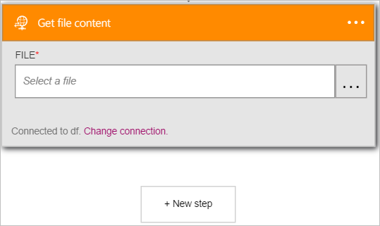

<properties
pageTitle="Informationen zum Verwenden von FTP-Connector Logik Apps | Microsoft Azure"
description="Erstellen Sie Logik apps mit Azure-App-Dienst an. Verbinden Sie mit FTP-Server für Ihre Dateien verwalten. Sie können verschiedene Aktionen wie z. B. Upload ausführen, aktualisieren, abrufen und Löschen von Dateien in den FTP-Server."
services="logic-apps"   
documentationCenter=".net,nodejs,java"  
authors="msftman"   
manager="erikre"    
editor=""
tags="connectors" />

<tags
ms.service="logic-apps"
ms.devlang="multiple"
ms.topic="article"
ms.tgt_pltfrm="na"
ms.workload="integration"
ms.date="07/22/2016"
ms.author="deonhe"/>

# Erste Schritte mit FTP-connector

Verwenden Sie den FTP-Connector überwachen, verwalten und Erstellen von Dateien auf einem FTP-Server. 

Um [alle Verbinder](./apis-list.md)verwenden zu können, müssen Sie zuerst eine app Logik zu erstellen. Sie können durch [Erstellen einer Logik app jetzt](../app-service-logic/app-service-logic-create-a-logic-app.md)loslegen.

## Verbinden mit FTP

Bevor Sie Ihre app Logik Dienste zugreifen kann, müssen Sie zuerst eine *Verbindung* mit dem Dienst erstellen. Eine [Verbindung](./connectors-overview.md) stellt eine Verbindung zwischen einer app Logik und einem anderen Dienst.  

### Herstellen einer Verbindung mit FTP

>[AZURE.INCLUDE [Steps to create a connection to FTP](../../includes/connectors-create-api-ftp.md)]

## Verwenden eines Triggers FTP-

Ein Trigger ist ein Ereignis, das zum Starten des Workflows in einer app Logik definiert verwendet werden kann. [Erfahren Sie mehr über Trigger](../app-service-logic/app-service-logic-what-are-logic-apps.md#logic-app-concepts).  

>[AZURE.IMPORTANT]FTP-Connector erfordert einen FTP-Server, der aus dem Internet zugänglich ist, und ist so konfiguriert, dass das Kontrollkästchen Passiver Modus ausgeführt werden. Darüber hinaus ist FTP-Connector **mit impliziten FTPS (FTP over SSL) nicht kompatibel**. FTP-Connector unterstützt nur explizite FTPS (FTP over SSL).  

In diesem Beispiel stellen ich wird gezeigt, wie Sie mithilfe den Trigger **FTP -, wenn eine Datei hinzugefügt oder geändert wird** um einen Logik app Workflow zu starten, wenn eine Datei hinzugefügt wird, oder auf einem FTP-Server geändert. In ein Enterprise-Beispiel können Sie diese Trigger um zu einen FTP-Ordner für neue Dateien zu überwachen, die Aufträge von Kunden darstellen.  Sie können eine Aktion FTP-Verbinder, z. B. **-Dateiinhalt abrufen** klicken Sie dann den Inhalt der Reihenfolge für die weitere Verarbeitung und Speicher in Ihrer Datenbank Bestellungen abrufen verwenden.

1. Geben Sie in das Suchfeld *ftp* im Logik apps Designer und wählen Sie dann den Trigger **FTP -, wenn eine Datei hinzugefügt oder geändert wird**   
  
Das Steuerelement **, wenn eine Datei hinzugefügt oder geändert wird** angezeigt wird  
  
- Wählen Sie die **...** befindet sich auf der rechten Seite des Steuerelements. Daraufhin wird das Ordner Datumsauswahl-Steuerelement  
  
- Wählen Sie aus der **>** (rechts) und navigieren Sie zu den Ordner zu finden, die Sie für neue oder geänderte Dateien überwachen möchten. Wählen Sie den Ordner aus, und beachten Sie, dass der Ordner im **Ordner** Steuerelement jetzt angezeigt wird.  
   

An diesem Punkt wurde die app Logik zu einem Trigger konfiguriert, die in eine Abfolge von anderen Trigger und Aktionen in dem Workflow beginnen, wenn eine Datei geändert oder in bestimmten FTP-Ordner erstellt wird. 

>[AZURE.NOTE]Für eine app Logik funktioniert muss es mindestens ein Trigger und eine Aktion enthalten. Führen Sie die Schritte im nächsten Abschnitt, um eine Aktion hinzuzufügen.  

## Verwenden einer FTP-Aktion

Eine Aktion ist ein Vorgang durchgeführten durch den Workflow in einer app Logik definiert. [Erfahren Sie mehr über Aktionen](../app-service-logic/app-service-logic-what-are-logic-apps.md#logic-app-concepts).  

Jetzt, da Sie einen Trigger hinzugefügt haben, folgendermaßen Sie vor, um eine Aktion hinzuzufügen, die den Inhalt der Datei neue oder geänderte vom Trigger gefunden erhalten.    

1. Wählen Sie **+ neuen Schritt** zum Hinzufügen der der Aktion den Inhalt der Datei auf den FTP-Server abrufen  
- Wählen Sie den Link zum **Hinzufügen einer Aktion** aus.  
  
- Geben Sie *FTP* für alle Aktionen im Zusammenhang mit FTP zu suchen.
- Wählen Sie **FTP - Dateiinhalt abrufen** als die auszuführende Aktion, wenn eine neue oder geänderte Datei im FTP-Ordner gefunden wird.      
  
Das Steuerelement **Abrufen der Inhalt der Datei** wird geöffnet. **Hinweis**: werden Sie aufgefordert, autorisieren Ihre app Logik Ihr FTP-Server-Konto zugreifen, wenn Sie nicht bereits getan haben.  
   
- Wählen Sie das Steuerelement **Datei** (den Leerraum unterhalb der **Datei***). Hier können Sie die verschiedenen Eigenschaften der neue oder geänderte Datei gefunden wird, klicken Sie auf den FTP-Server verwenden.  
- Wählen Sie die Option **Inhalt der Datei** ein.  
   
-  Das Steuerelement wird aktualisiert, die angibt, dass die Aktion **FTP - Dateiinhalt abrufen** der *Datei Inhalt* der neue oder geänderte Datei auf den FTP-Server abruft.      
     
- Speichern Sie Ihre Arbeit, und klicken Sie dann Hinzufügen einer Datei zu den FTP-Ordner, um den Workflow zu testen.    

An diesem Punkt wurde die app Logik zu einem Trigger in einem Ordner auf einem FTP-Server überwachen und den Workflow einleiten, wenn sie eine neue Datei oder eine geänderte Datei auf den FTP-Server findet konfiguriert. 

Die app Logik wurde auch mit der Aktion den Inhalt der Datei neue oder geänderte abrufen konfiguriert.

Sie können nun eine andere Aktion wie die [SQL Server - Zeile einfügen](./connectors-create-api-sqlazure.md#insert-row) Aktion zum Einfügen des Inhalts der neue oder geänderte Datei in einer SQL-Datenbank-Tabelle hinzufügen.  

## Technische Details

Hier sind die Details der Trigger, Aktionen und Antworten, die diese Verbindung unterstützt:

## FTP-Triggern

FTP besteht aus die folgenden Triggern:  

|Auslösen | Beschreibung|
|--- | ---|
|[Wenn eine Datei hinzugefügt oder geändert wird](connectors-create-api-ftp.md#when-a-file-is-added-or-modified)|Dieser Vorgang löst einen Fluss, wenn eine Datei hinzugefügt oder in einem Ordner geändert wird.|

## FTP-Aktionen

FTP weist die folgenden Aktionen aus:

|Aktion|Beschreibung|
|--- | ---|
|[Abrufen von Dateimetadaten](connectors-create-api-ftp.md#get-file-metadata)|Mit diesem Vorgang wird die Metadaten für eine Datei an.|
|[Update-Datei](connectors-create-api-ftp.md#update-file)|Dieser Vorgang aktualisiert eine Datei an.|
|[Datei löschen](connectors-create-api-ftp.md#delete-file)|Dieser Vorgang löscht eine Datei.|
|[Abrufen von Metadaten mit Pfad der Datei](connectors-create-api-ftp.md#get-file-metadata-using-path)|Dieser Vorgang ruft die Metadaten einer Datei mit den Pfad ab.|
|[Abrufen von Dateiinhalt unter Verwendung der Pfad](connectors-create-api-ftp.md#get-file-content-using-path)|Dieser Vorgang ruft den Inhalt einer Datei mit den Pfad ab.|
|[Abrufen der Inhalt der Datei](connectors-create-api-ftp.md#get-file-content)|Mit diesem Vorgang wird den Inhalt einer Datei an.|
|[Datei erstellen](connectors-create-api-ftp.md#create-file)|Dieser Vorgang erstellt eine Datei an.|
|[Kopieren einer Datei](connectors-create-api-ftp.md#copy-file)|Dieser Vorgang kopiert eine Datei an einem FTP-Server.|
|[Der Listendateien im Ordner](connectors-create-api-ftp.md#list-files-in-folder)|Mit diesem Vorgang wird die Liste der Dateien und Unterordner in einem Ordner.|
|[Der Listendateien im Stammordner](connectors-create-api-ftp.md#list-files-in-root-folder)|Mit diesem Vorgang wird die Liste der Dateien und Unterordner im Stammordner.|
|[Ordner zu extrahieren](connectors-create-api-ftp.md#extract-folder)|Dieser Vorgang extrahiert eine Archivdatei in einem anderen Ordner (Beispiel: ZIP).|
### Aktionsdetails

Hier sind die Details für die Aktionen und Trigger für diesen Connector, zusammen mit ihren Antworten:

### Abrufen von Dateimetadaten
Mit diesem Vorgang wird die Metadaten für eine Datei an. 

|Eigenschaftsname| Anzeigename|Beschreibung|
| ---|---|---|
|ID *|Datei|Wählen Sie eine Datei|

Ein * zeigt an, dass eine Eigenschaft erforderlich ist

#### Die Ausgabedetails

BlobMetadata

| Eigenschaftsname | Datentyp |
|---|---|---|
|ID|Zeichenfolge|
|Namen|Zeichenfolge|
|DisplayName|Zeichenfolge|
|Pfad|Zeichenfolge|
|LastModified|Zeichenfolge|
|Größe|ganze Zahl|
|MediaType|Zeichenfolge|
|IsFolder|Boolesch|
|ETag|Zeichenfolge|
|FileLocator|Zeichenfolge|

### Update-Datei
Dieser Vorgang aktualisiert eine Datei an. 

|Eigenschaftsname| Anzeigename|Beschreibung|
| ---|---|---|
|ID *|Datei|Wählen Sie eine Datei|
|Textkörper *|Der Inhalt der Datei|Inhalt der Datei|

Ein * zeigt an, dass eine Eigenschaft erforderlich ist

#### Die Ausgabedetails

BlobMetadata

| Eigenschaftsname | Datentyp |
|---|---|---|
|ID|Zeichenfolge|
|Namen|Zeichenfolge|
|DisplayName|Zeichenfolge|
|Pfad|Zeichenfolge|
|LastModified|Zeichenfolge|
|Größe|ganze Zahl|
|MediaType|Zeichenfolge|
|IsFolder|Boolesch|
|ETag|Zeichenfolge|
|FileLocator|Zeichenfolge|

### Datei löschen
Dieser Vorgang löscht eine Datei. 

|Eigenschaftsname| Anzeigename|Beschreibung|
| ---|---|---|
|ID *|Datei|Wählen Sie eine Datei|

Ein * zeigt an, dass eine Eigenschaft erforderlich ist

### Abrufen von Metadaten mit Pfad der Datei
Dieser Vorgang ruft die Metadaten einer Datei mit den Pfad ab. 

|Eigenschaftsname| Anzeigename|Beschreibung|
| ---|---|---|
|Pfad *|Dateipfad|Wählen Sie eine Datei|

Ein * zeigt an, dass eine Eigenschaft erforderlich ist

#### Die Ausgabedetails

BlobMetadata

| Eigenschaftsname | Datentyp |
|---|---|---|
|ID|Zeichenfolge|
|Namen|Zeichenfolge|
|DisplayName|Zeichenfolge|
|Pfad|Zeichenfolge|
|LastModified|Zeichenfolge|
|Größe|ganze Zahl|
|MediaType|Zeichenfolge|
|IsFolder|Boolesch|
|ETag|Zeichenfolge|
|FileLocator|Zeichenfolge|

### Abrufen von Dateiinhalt unter Verwendung der Pfad
Dieser Vorgang ruft den Inhalt einer Datei mit den Pfad ab. 

|Eigenschaftsname| Anzeigename|Beschreibung|
| ---|---|---|
|Pfad *|Dateipfad|Wählen Sie eine Datei|

Ein * zeigt an, dass eine Eigenschaft erforderlich ist

### Abrufen der Inhalt der Datei
Mit diesem Vorgang wird den Inhalt einer Datei an. 

|Eigenschaftsname| Anzeigename|Beschreibung|
| ---|---|---|
|ID *|Datei|Wählen Sie eine Datei|

Ein * zeigt an, dass eine Eigenschaft erforderlich ist

### Datei erstellen
Dieser Vorgang erstellt eine Datei an. 

|Eigenschaftsname| Anzeigename|Beschreibung|
| ---|---|---|
|Ordnerpfad *|Ordnerpfad|Wählen Sie einen Ordner aus.|
|Namen *|Dateiname|Name der Datei|
|Textkörper *|Der Inhalt der Datei|Inhalt der Datei|

Ein * zeigt an, dass eine Eigenschaft erforderlich ist

#### Die Ausgabedetails

BlobMetadata

| Eigenschaftsname | Datentyp |
|---|---|---|
|ID|Zeichenfolge|
|Namen|Zeichenfolge|
|DisplayName|Zeichenfolge|
|Pfad|Zeichenfolge|
|LastModified|Zeichenfolge|
|Größe|ganze Zahl|
|MediaType|Zeichenfolge|
|IsFolder|Boolesch|
|ETag|Zeichenfolge|
|FileLocator|Zeichenfolge|

### Kopieren einer Datei
Dieser Vorgang kopiert eine Datei an einem FTP-Server. 

|Eigenschaftsname| Anzeigename|Beschreibung|
| ---|---|---|
|Quelle *|Url der Quelle|URL-Quelldatei|
|Ziel *|Zieldateipfad|Zieldateipfad, einschließlich Zieldateiname|
|Überschreiben|Überschreiben?|Überschreibt die Zieldatei aus, wenn auf "True" gesetzt|

Ein * zeigt an, dass eine Eigenschaft erforderlich ist

#### Die Ausgabedetails

BlobMetadata

| Eigenschaftsname | Datentyp |
|---|---|---|
|ID|Zeichenfolge|
|Namen|Zeichenfolge|
|DisplayName|Zeichenfolge|
|Pfad|Zeichenfolge|
|LastModified|Zeichenfolge|
|Größe|ganze Zahl|
|MediaType|Zeichenfolge|
|IsFolder|Boolesch|
|ETag|Zeichenfolge|
|FileLocator|Zeichenfolge|

### Wenn eine Datei hinzugefügt oder geändert wird
Dieser Vorgang löst einen Fluss, wenn eine Datei hinzugefügt oder in einem Ordner geändert wird. 

|Eigenschaftsname| Anzeigename|Beschreibung|
| ---|---|---|
|Ordner ID *|Ordner|Wählen Sie einen Ordner aus.|

Ein * zeigt an, dass eine Eigenschaft erforderlich ist

### Der Listendateien im Ordner
Mit diesem Vorgang wird die Liste der Dateien und Unterordner in einem Ordner. 

|Eigenschaftsname| Anzeigename|Beschreibung|
| ---|---|---|
|ID *|Ordner|Wählen Sie einen Ordner aus.|

Ein * zeigt an, dass eine Eigenschaft erforderlich ist

#### Die Ausgabedetails

BlobMetadata

| Eigenschaftsname | Datentyp |
|---|---|---|
|ID|Zeichenfolge|
|Namen|Zeichenfolge|
|DisplayName|Zeichenfolge|
|Pfad|Zeichenfolge|
|LastModified|Zeichenfolge|
|Größe|ganze Zahl|
|MediaType|Zeichenfolge|
|IsFolder|Boolesch|
|ETag|Zeichenfolge|
|FileLocator|Zeichenfolge|

### Der Listendateien im Stammordner
Mit diesem Vorgang wird die Liste der Dateien und Unterordner im Stammordner. 

Es sind keine Parameter für diesen Anruf

#### Die Ausgabedetails

BlobMetadata

| Eigenschaftsname | Datentyp |
|---|---|---|
|ID|Zeichenfolge|
|Namen|Zeichenfolge|
|DisplayName|Zeichenfolge|
|Pfad|Zeichenfolge|
|LastModified|Zeichenfolge|
|Größe|ganze Zahl|
|MediaType|Zeichenfolge|
|IsFolder|Boolesch|
|ETag|Zeichenfolge|
|FileLocator|Zeichenfolge|

### Ordner zu extrahieren
Dieser Vorgang extrahiert eine Archivdatei in einem anderen Ordner (Beispiel: ZIP). 

|Eigenschaftsname| Anzeigename|Beschreibung|
| ---|---|---|
|Quelle *|Der Pfad der Archivdatei Quelle|Pfad der Archivdatei|
|Ziel *|Zielordnerpfad|Pfad zum Zielordner|
|Überschreiben|Überschreiben?|Überschreibt die Zieldateien, wenn auf "True" gesetzt|

Ein * zeigt an, dass eine Eigenschaft erforderlich ist

#### Die Ausgabedetails

BlobMetadata

| Eigenschaftsname | Datentyp |
|---|---|---|
|ID|Zeichenfolge|
|Namen|Zeichenfolge|
|DisplayName|Zeichenfolge|
|Pfad|Zeichenfolge|
|LastModified|Zeichenfolge|
|Größe|ganze Zahl|
|MediaType|Zeichenfolge|
|IsFolder|Boolesch|
|ETag|Zeichenfolge|
|FileLocator|Zeichenfolge|

## HTTP-Antworten

Eine oder mehrere der folgenden HTTP Statuscodes können die Aktionen und Trigger oben zurückgegeben werden: 

|Namen|Beschreibung|
|---|---|
|200|Okay|
|202|Akzeptiert|
|400|Ungültige Anforderung|
|401|Nicht autorisierte|
|403|Verboten|
|404|Nicht gefunden|
|500|Interner Serverfehler. Es ist ein Fehler aufgetreten.|
|Standard|Fehler bei Vorgang.|

## Nächste Schritte
[Erstellen Sie eine app Logik](../app-service-logic/app-service-logic-create-a-logic-app.md)