<properties
    pageTitle="Hinzufügen den Informix Verbinder in Ihrer Apps Logik | Microsoft Azure"
    description="Übersicht über Informix Verbinder mit den Parametern REST-API"
    services=""
    documentationCenter="" 
    authors="gplarsen"
    manager="erikre"
    editor=""
    tags="connectors"/>

<tags
   ms.service="logic-apps"
   ms.devlang="na"
   ms.topic="article"
   ms.tgt_pltfrm="na"
   ms.workload="integration" 
   ms.date="09/26/2016"
   ms.author="plarsen"/>

# Erste Schritte mit der Informix-Verbinder
Microsoft-Connector für Informix verbindet Logik Apps zu Ressourcen, die in einer IBM Informix-Datenbank gespeichert. Der Verbinder Informix enthält einen Microsoft Client zu Remotecomputern für Informix-Server in einem Netzwerk TCP/IP kommunizieren. Dies umfasst Clouddatenbanken wie IBM Informix für Windows ausgeführt wird, bei der Azure Virtualisierung sowie lokalen Datenbanken Gateways lokaler Daten verwenden. Finden Sie in der [Liste unterstützt](connectors-create-api-informix.md#supported-informix-platforms-and-versions) IBM Informix Plattformen und Versionen (in diesem Thema).

>[AZURE.NOTE] Diese Version des Artikels gilt Logik Apps allgemeine Verfügbarkeit (GA) aus. 

Der Verbinder unterstützt die folgenden Datenbankvorgänge:

- Liste-Datenbanktabellen
- Lesen Sie eine Zeile mit auswählen
- Lesen Sie alle Zeilen mit SELECT
- Hinzufügen einer Zeile mit INSERT
- Ändern Sie eine Zeile mit UPDATE
- Entfernen einer Zeile mit löschen

In diesem Thema wird gezeigt, wie den Verbinder in einer app Logik ausgeführten Datenbankvorgängen verwendet werden kann.

Wenn Sie weitere Informationen zur Logik Apps finden Sie unter [erstellen eine app Logik](../app-service-logic/app-service-logic-create-a-logic-app.md).

## Verfügbare Aktionen
Dieser Connector unterstützt folgende Logik app Aktionen:

- Getables
- [GetRow
- GetRows
- InsertRow
- UpdateRow
- DeleteRow

## Liste Tabellen
Erstellen einer app Logik für jeden Vorgang besteht vielen Schritten über das Microsoft Azure-Portal ausgeführt.

Innerhalb der app Logik können Sie in der Liste der Tabellen in einer Datenbank Informix eine Aktion hinzufügen. Diese Aktion weist den Verbinder, um eine Informix-Schema-Anweisung wie verarbeiten `CALL SYSIBM.SQLTABLES`.

### Erstellen Sie eine app Logik
1.  **Azure Brett zu starten**, wählen Sie **+** (Pluszeichen) **Web + Mobile**, und klicken Sie dann **Logik App**.
2.  Geben Sie den **Namen**, z. B. `InformixgetTables`, **Abonnements**, **Ressourcengruppe**, **Position**und **Planen der App-Dienst**. Wählen Sie **zum Dashboard Pin**, und wählen Sie dann auf **Erstellen**.

### Hinzufügen eines Trigger und Aktion
1.  Wählen Sie in der **Logik Apps-Designer** **Leere LogicApp** in der Liste **Vorlagen** aus.
2.  Wählen Sie in der Liste **Trigger** **Serie**aus. 
3.  Wählen Sie in der **Serie** Trigger **Bearbeiten**aus, wählen Sie **Häufigkeit** Dropdown- **Tag**auswählen aus, und wählen Sie dann das **Intervall** zum Eingeben von **7**aus.  
4.  Wählen Sie im Feld **+ neuen Schritt** aus, und wählen Sie dann **eine Aktion hinzufügen**.
5.  Geben Sie im Feld **Suchen, um weitere Aktionen** bearbeiten **Informix** , und wählen Sie dann auf **Informix - Tabellen (Preview) abgerufen werden**, in der Liste **Aktionen** .

    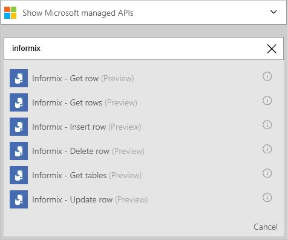  

6.  Wählen Sie im Bereich Konfiguration **Informix - Tabellen abrufen** **Kontrollkästchen** **Verbinden über lokaler datenverwaltungsgateway**aktivieren aus. Beachten Sie, dass die Einstellungen zu lokalen aus der Cloud ändern.
    - Geben Sie Wert für **Server**in Form von Adresse oder Alias Doppelpunkt Port-Nummer ein. Geben Sie beispielsweise `ibmserver01:9089`.
    - Geben Sie für die **Datenbank**Wert ein. Geben Sie beispielsweise `nwind`.
    - Wählen Sie Wert für die **Authentifizierung**ein. Wählen Sie beispielsweise **grundlegende**aus.
    - Geben Sie für **Username**Wert ein. Geben Sie beispielsweise `informix`.
    - Geben einen Wert für **das Kennwort**ein. Geben Sie beispielsweise `Password1`.
    - Wählen Sie Wert für das **Gateway**ein. Wählen Sie beispielsweise **datagateway01**ein.
7. Wählen Sie **Erstellen**aus, und wählen Sie dann auf **Speichern**. 

    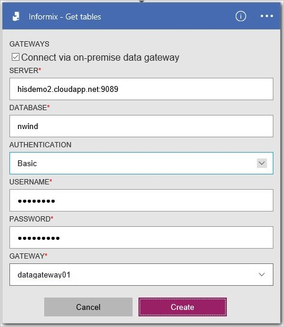

8.  Wählen Sie in der **InformixgetTables** Blade, in der Liste **Alle ausgeführt wird** , klicken Sie unter **Zusammenfassung**das Element zuerst aufgeführten (die letzte Ausführung) ein.
9.  Wählen Sie das Blade **Logik app ausführen** **Details ausführen**. Wählen Sie in der Liste **Aktion** **Get_tables**aus. Lesen Sie den Wert für **Status** **erfolgreich**sein sollten. Wählen Sie den **Link Eingaben** Eingaben anzeigen. Wählen Sie den **Link gibt**aus, und zeigen Sie die Ausgaben; die eine Liste der Tabellen enthalten soll.

    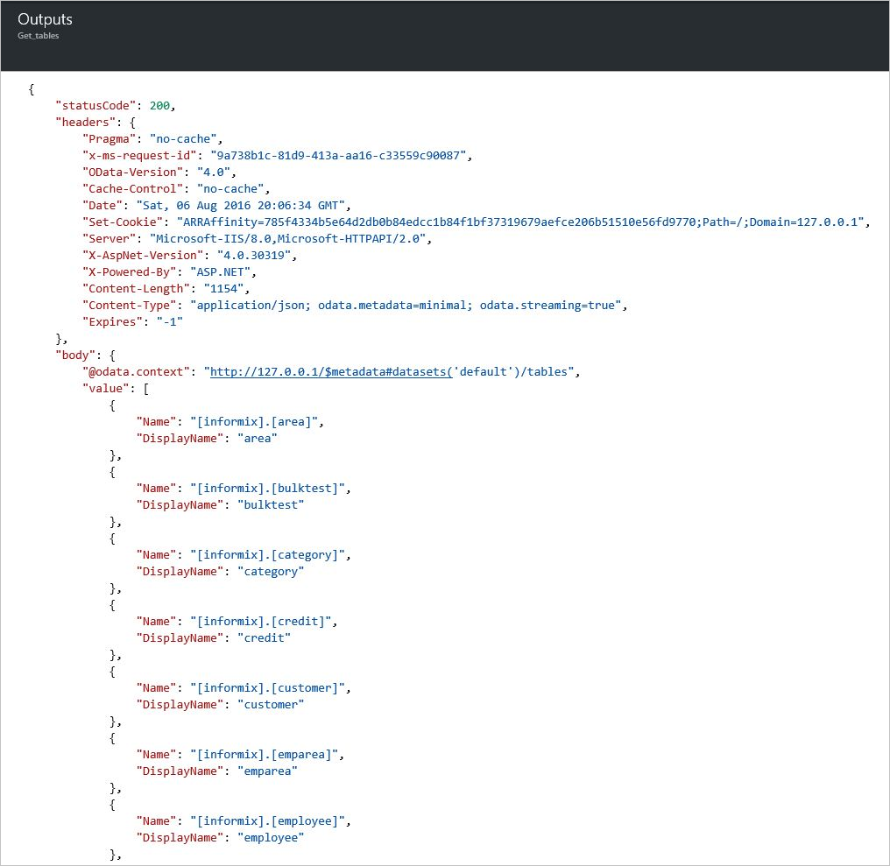

## Erstellen von Verbindungen
Dieser Connector unterstützt Verbindungen Datenbank lokal und in der Cloud, verwenden die folgenden Verbindungseigenschaften. 

Eigenschaft | Beschreibung
--- | ---
Server | Erforderlich. Akzeptiert einen Zeichenfolgenwert, eine TCP/IP Adresse oder Alias, entweder IPv4 oder IPv6-Format, gefolgt (Doppelpunkt-getrennt) nach einem TCP/IP Portnummern darstellt. 
Datenbank | Erforderlich. Akzeptiert einen Zeichenfolgenwert für eine DRDA relationalen Datenbank Namen (RDBNAM). Informix akzeptiert eine Zeichenfolge 128-Byte-Zeichen (Datenbank wird als eine IBM Informix Datenbankname (DB-Name) bezeichnet).
Authentifizierung | Optional. Akzeptiert einen Element Listenwert, entweder Basic oder Windows (Kerberos). 
Benutzername | Erforderlich. Akzeptiert einen Zeichenfolgenwert an.
Kennwort | Erforderlich. Akzeptiert einen Zeichenfolgenwert an.
Gateway | Erforderlich. Akzeptiert einen Element Listenwert zu Logik Apps definiert, in der Speichergruppe lokaler Daten Gateways darstellt.  

## Erstellen der lokalen Gateway-Verbindung
Diesen Connector kann eine lokalen Informix-Datenbank mithilfe des Gateways lokaler Daten zugreifen. Gateway finden Sie weitere Informationen finden Sie unter. 

1. Wählen Sie im Bereich Konfiguration **Gateways** **Kontrollkästchen** **Verbinden über Gateway**aktivieren aus. Finden Sie unter die Einstellungen in lokalen aus der Cloud zu ändern.
2. Geben Sie Wert für **Server**in Form von Adresse oder Alias Doppelpunkt Port-Nummer ein. Geben Sie beispielsweise `ibmserver01:9089`.
3. Geben Sie für die **Datenbank**Wert ein. Geben Sie beispielsweise `nwind`.
4. Wählen Sie Wert für die **Authentifizierung**ein. Wählen Sie beispielsweise **grundlegende**aus.
5. Geben Sie für **Username**Wert ein. Geben Sie beispielsweise `informix`.
6. Geben einen Wert für **das Kennwort**ein. Geben Sie beispielsweise `Password1`.
7. Wählen Sie Wert für das **Gateway**ein. Wählen Sie beispielsweise **datagateway01**ein.
8. Wählen Sie **Erstellen** , um den Vorgang fortzusetzen. 

    

## Erstellen Sie die Cloud-Verbindung
Diesen Connector kann eine Cloud Informix-Datenbank zugreifen. 

1. Klicken Sie im Konfigurationsbereich **Gateways** deaktiviert lassen Sie das **Kontrollkästchen** (nicht geklickt) **Verbinden über Gateway**. 
2. Geben Sie für **Verbindungsname**Wert ein. Geben Sie beispielsweise `hisdemo2`.
3. Geben einen Wert für **Servername Informix**in Form von Adresse oder Alias Doppelpunkt Port-Nummer ein. Geben Sie beispielsweise `hisdemo2.cloudapp.net:9089`.
3. Geben Sie für **Informix Datenbankname ein**Wert ein. Geben Sie beispielsweise `nwind`.
4. Geben einen Wert für den **Benutzernamen**ein. Geben Sie beispielsweise `informix`.
5. Geben einen Wert für **das Kennwort**ein. Geben Sie beispielsweise `Password1`.
6. Wählen Sie **Erstellen** , um den Vorgang fortzusetzen. 

    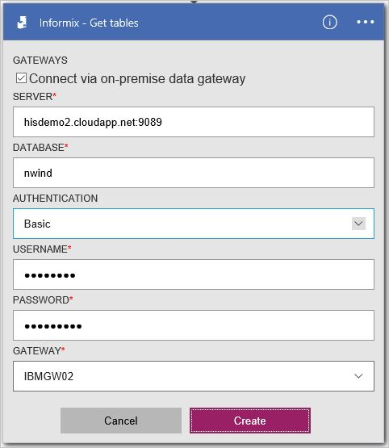

## Rufen Sie alle Zeilen mit SELECT
Sie können eine Aktion Logik app, um alle Zeilen in der Tabelle Informix abzurufen erstellen. Diese Aktion weist den Verbinder, um eine Informix SELECT-Anweisung, wie verarbeiten `SELECT * FROM AREA`.

### Erstellen Sie eine app Logik
1.  **Azure Brett zu starten**, wählen Sie **+** (Pluszeichen) **Web + Mobile**, und klicken Sie dann **Logik App**.
2.  Geben Sie die **Namen** (z. B. "**InformixgetRows**"), **Abonnement**, **Ressourcengruppe**, **Speicherort**, und **Planen der App-Dienst**. Wählen Sie **zum Dashboard Pin**, und wählen Sie dann auf **Erstellen**.

### Hinzufügen eines Trigger und Aktion
1.  Wählen Sie in der **Logik Apps-Designer** **Leere LogicApp** in der Liste **Vorlagen** aus.
2.  Wählen Sie in der Liste **Trigger** **Serie**aus. 
3.  Wählen Sie in der **Serie** Trigger **Bearbeiten**aus, wählen Sie **Häufigkeit** Dropdown- **Tag**auswählen aus, und wählen Sie dann das **Intervall** zum Eingeben von **7**aus. 
4.  Wählen Sie im Feld **+ neuen Schritt** aus, und wählen Sie dann **eine Aktion hinzufügen**.
5.  Geben Sie im Feld **Suchen, um weitere Aktionen** bearbeiten **Informix** in der Liste **Aktionen** , und wählen Sie dann auf **Informix - Abrufen von Zeilen (Preview)**.
6. Wählen Sie in der Aktion **Abrufen von Zeilen (Preview)** **Verbindung ändern**.
7. Wählen Sie im Bereich **Verbindungen** Konfiguration **neu erstellen**. 

    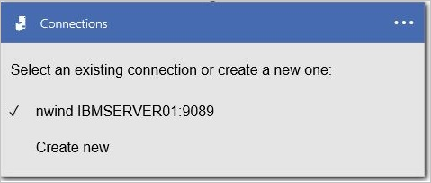
  
8. Klicken Sie im Konfigurationsbereich **Gateways** deaktiviert lassen Sie das **Kontrollkästchen** (nicht geklickt) **Verbinden über Gateway**.
    - Geben Sie für **Verbindungsname**Wert ein. Geben Sie beispielsweise `HISDEMO2`.
    - Geben einen Wert für **Servername Informix**in Form von Adresse oder Alias Doppelpunkt Port-Nummer ein. Geben Sie beispielsweise `HISDEMO2.cloudapp.net:9089`.
    - Geben Sie für **Informix Datenbankname ein**Wert ein. Geben Sie beispielsweise `NWIND`.
    - Geben einen Wert für den **Benutzernamen**ein. Geben Sie beispielsweise `informix`.
    - Geben einen Wert für **das Kennwort**ein. Geben Sie beispielsweise `Password1`.
9. Wählen Sie **Erstellen** , um den Vorgang fortzusetzen.

    

10. Klicken Sie in der Liste **Tabellenname** wählen Sie die **nach-unten**, und wählen Sie dann **im Bereich**.
11. Wählen Sie optional **Erweiterte Optionen anzeigen** , um die Abfrage anzugeben.
12. Wählen Sie **Speichern**aus. 

    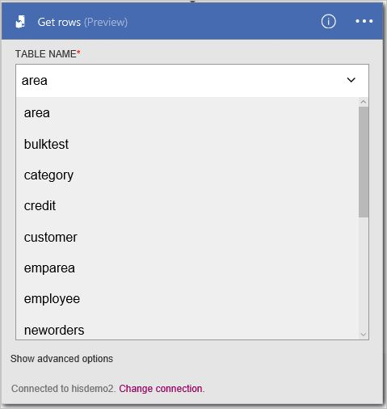

13. Wählen Sie in der **InformixgetRows** Blade, in der Liste **Alle ausgeführt wird** , klicken Sie unter **Zusammenfassung**das Element zuerst aufgeführten (die letzte Ausführung) ein.
14. Wählen Sie das Blade **Logik app ausführen** **Details ausführen**. Wählen Sie in der Liste **Aktion** **Get_rows**aus. Lesen Sie den Wert für **Status** **erfolgreich**sein sollten. Wählen Sie den **Link Eingaben** Eingaben anzeigen. Wählen Sie den **Link gibt**aus, und zeigen Sie die Ausgaben; die eine Liste der Zeilen enthalten soll.

    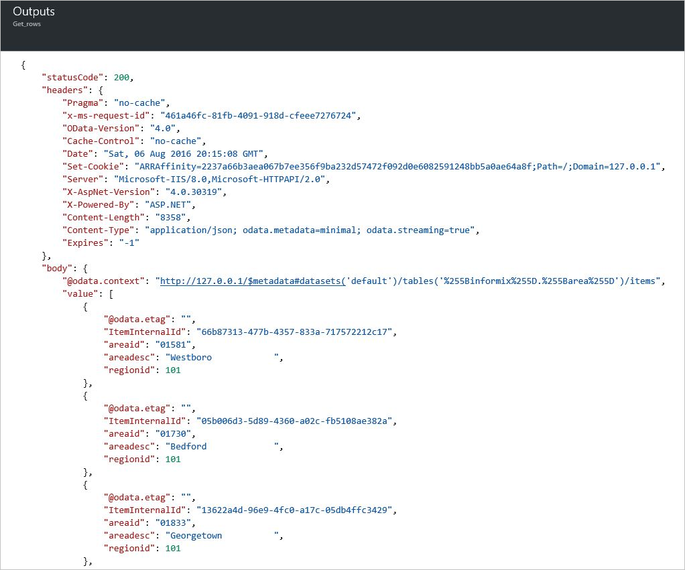

## Hinzufügen einer Zeile mit INSERT
Sie können eine Logik app Aktion zum Hinzufügen einer Zeile in einer Tabelle Informix erstellen. Diese Aktion weist den Verbinder, um eine INSERT Informix-Anweisung wie verarbeiten `INSERT INTO AREA (AREAID, AREADESC, REGIONID) VALUES ('99999', 'Area 99999', 102)`.

### Erstellen Sie eine app Logik
1.  **Azure Brett zu starten**, wählen Sie **+** (Pluszeichen) **Web + Mobile**, und klicken Sie dann **Logik App**.
2.  Geben Sie den **Namen**, z. B. `InformixinsertRow`, **Abonnements**, **Ressourcengruppe**, **Position**und **Planen der App-Dienst**. Wählen Sie **zum Dashboard Pin**, und wählen Sie dann auf **Erstellen**.

### Hinzufügen eines Trigger und Aktion
1.  Wählen Sie in der **Logik Apps-Designer** **Leere LogicApp** in der Liste **Vorlagen** aus.
2.  Wählen Sie in der Liste **Trigger** **Serie**aus. 
3.  Wählen Sie in der **Serie** Trigger **Bearbeiten**aus, wählen Sie **Häufigkeit** Dropdown- **Tag**auswählen aus, und wählen Sie dann das **Intervall** zum Eingeben von **7**aus. 
4.  Wählen Sie im Feld **+ neuen Schritt** aus, und wählen Sie dann **eine Aktion hinzufügen**.
5.  Geben Sie im Feld **Suchen, um weitere Aktionen** bearbeiten **Informix** in der Liste **Aktionen** , und wählen Sie dann auf **Informix - Zeile einfügen (Preview)**.
6. Wählen Sie in der Aktion **Abrufen von Zeilen (Preview)** **Verbindung ändern**. 
7. Wählen Sie im Bereich **Verbindungen** Konfiguration um eine Verbindung zu markieren. Wählen Sie beispielsweise **hisdemo2**ein.

    

8. Klicken Sie in der Liste **Tabellenname** wählen Sie die **nach-unten**, und wählen Sie dann **im Bereich**.
9. Geben Sie Werte für alle erforderlichen Spalten (Siehe rotes Sternchen) ein. Geben Sie beispielsweise `99999` **AREAID**, geben Sie ein `Area 99999`, und geben Sie `102` für **REGIONID**. 
10. Wählen Sie **Speichern**aus.

    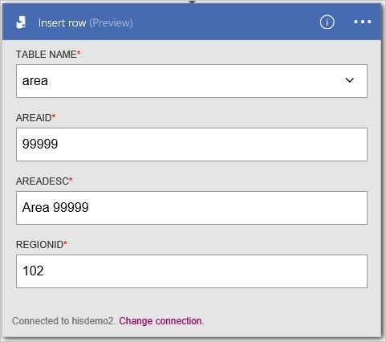
 
11. Wählen Sie in der **InformixinsertRow** Blade, in der Liste **Alle ausgeführt wird** , klicken Sie unter **Zusammenfassung**das Element zuerst aufgeführten (die letzte Ausführung) ein.
12. Wählen Sie das Blade **Logik app ausführen** **Details ausführen**. Wählen Sie in der Liste **Aktion** **Get_rows**aus. Lesen Sie den Wert für **Status** **erfolgreich**sein sollten. Wählen Sie den **Link Eingaben** Eingaben anzeigen. Wählen Sie den **Link gibt**aus, und zeigen Sie die Ausgaben; die neue Zeile enthalten soll.

    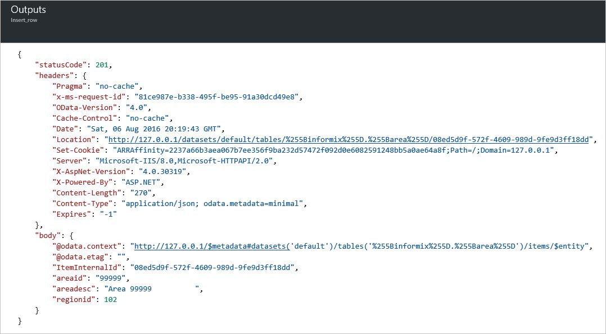

## Rufen Sie eine Zeile mit SELECT ab
Sie können eine Aktion Logik app, um eine Zeile in einer Tabelle Informix abrufen erstellen. Diese Aktion weist den Verbinder, um eine Anweisung Informix auswählen, wie verarbeiten `SELECT FROM AREA WHERE AREAID = '99999'`.

### Erstellen Sie eine app Logik
1.  **Azure Brett zu starten**, wählen Sie **+** (Pluszeichen) **Web + Mobile**, und klicken Sie dann **Logik App**.
2.  Geben Sie den **Namen**, z. B. `InformixgetRow`, **Abonnements**, **Ressourcengruppe**, **Position**und **Planen der App-Dienst**. Wählen Sie **zum Dashboard Pin**, und wählen Sie dann auf **Erstellen**.

### Hinzufügen eines Trigger und Aktion
1.  Wählen Sie in der **Logik Apps-Designer** **Leere LogicApp** in der Liste **Vorlagen** aus.
2.  Wählen Sie in der Liste **Trigger** **Serie**aus. 
3.  Wählen Sie in der **Serie** Trigger **Bearbeiten**aus, wählen Sie **Häufigkeit** Dropdown- **Tag**auswählen aus, und wählen Sie dann das **Intervall** zum Eingeben von **7**aus. 
4.  Wählen Sie im Feld **+ neuen Schritt** aus, und wählen Sie dann **eine Aktion hinzufügen**.
5.  Geben Sie im Feld **Suchen, um weitere Aktionen** bearbeiten **Informix** in der Liste **Aktionen** , und wählen Sie dann auf **Informix - Abrufen von Zeilen (Preview)**.
6. Wählen Sie in der Aktion **Abrufen von Zeilen (Preview)** **Verbindung ändern**. 
7. Wählen Sie im Bereich Konfigurationen **Verbindungen** , wählen Sie eine vorhandene Verbindung aus. Wählen Sie beispielsweise **hisdemo2**ein.

    

8. Klicken Sie in der Liste **Tabellenname** wählen Sie die **nach-unten**, und wählen Sie dann **im Bereich**.
9. Geben Sie Werte für alle erforderlichen Spalten (Siehe rotes Sternchen) ein. Geben Sie beispielsweise `99999` für **AREAID**. 
10. Wählen Sie optional **Erweiterte Optionen anzeigen** , um die Abfrage anzugeben.
11. Wählen Sie **Speichern**aus. 

    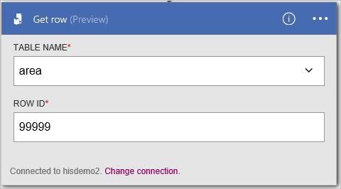

12. Wählen Sie in der **InformixgetRow** Blade, in der Liste **Alle ausgeführt wird** , klicken Sie unter **Zusammenfassung**das Element zuerst aufgeführten (die letzte Ausführung) ein.
13. Wählen Sie das Blade **Logik app ausführen** **Details ausführen**. Wählen Sie in der Liste **Aktion** **Get_rows**aus. Lesen Sie den Wert für **Status** **erfolgreich**sein sollten. Wählen Sie den **Link Eingaben** Eingaben anzeigen. Wählen Sie den **Link gibt**aus, und zeigen Sie die Ausgaben; die Zeile enthalten soll.

    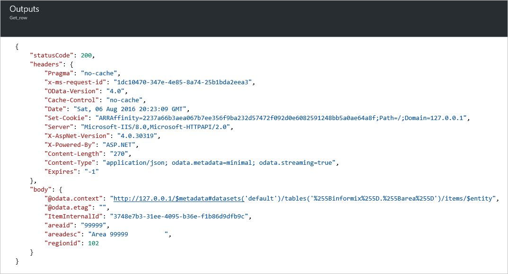

## Ändern Sie eine Zeile mit UPDATE
Sie können eine Aktion Logik app, um eine Zeile in einer Tabelle Informix ändern erstellen. Diese Aktion weist den Verbinder, um eine Informix-UPDATE-Anweisung, wie verarbeiten `UPDATE AREA SET AREAID = '99999', AREADESC = 'Area 99999', REGIONID = 102)`.

### Erstellen Sie eine app Logik
1.  **Azure Brett zu starten**, wählen Sie **+** (Pluszeichen) **Web + Mobile**, und klicken Sie dann **Logik App**.
2.  Geben Sie den **Namen**, z. B. `InformixupdateRow`, **Abonnements**, **Ressourcengruppe**, **Position**und **Planen der App-Dienst**. Wählen Sie **zum Dashboard Pin**, und wählen Sie dann auf **Erstellen**.

### Hinzufügen eines Trigger und Aktion
1.  Wählen Sie in der **Logik Apps-Designer** **Leere LogicApp** in der Liste **Vorlagen** aus.
2.  Wählen Sie in der Liste **Trigger** **Serie**aus. 
3.  Wählen Sie in der **Serie** Trigger **Bearbeiten**aus, wählen Sie **Häufigkeit** Dropdown- **Tag**auswählen aus, und wählen Sie dann das **Intervall** zum Eingeben von **7**aus. 
4.  Wählen Sie im Feld **+ neuen Schritt** aus, und wählen Sie dann **eine Aktion hinzufügen**.
5.  Geben Sie im Feld **Suchen, um weitere Aktionen** bearbeiten **Informix** in der Liste **Aktionen** , und wählen Sie dann auf **Informix - Update-Zeile (Preview)**.
6. Wählen Sie in der Aktion **Abrufen von Zeilen (Preview)** **Verbindung ändern**. 
7. Wählen Sie im Bereich Konfigurationen **Verbindungen** , wählen Sie eine vorhandene Verbindung aus. Wählen Sie beispielsweise **hisdemo2**ein.

    

8. Klicken Sie in der Liste **Tabellenname** wählen Sie die **nach-unten**, und wählen Sie dann **im Bereich**.
9. Geben Sie Werte für alle erforderlichen Spalten (Siehe rotes Sternchen) ein. Geben Sie beispielsweise `99999` **AREAID**, geben Sie ein `Updated 99999`, und geben Sie `102` für **REGIONID**. 
10. Wählen Sie **Speichern**aus. 

    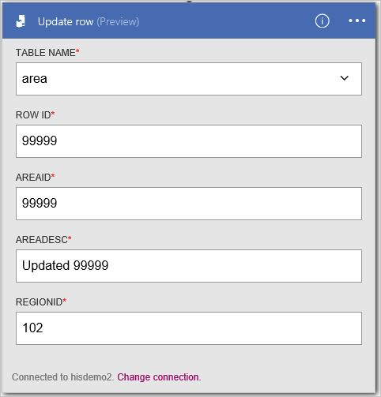

11. Wählen Sie in der **InformixupdateRow** Blade, in der Liste **Alle ausgeführt wird** , klicken Sie unter **Zusammenfassung**das Element zuerst aufgeführten (die letzte Ausführung) ein.
12. Wählen Sie das Blade **Logik app ausführen** **Details ausführen**. Wählen Sie in der Liste **Aktion** **Get_rows**aus. Lesen Sie den Wert für **Status** **erfolgreich**sein sollten. Wählen Sie den **Link Eingaben** Eingaben anzeigen. Wählen Sie den **Link gibt**aus, und zeigen Sie die Ausgaben; die neue Zeile enthalten soll.

    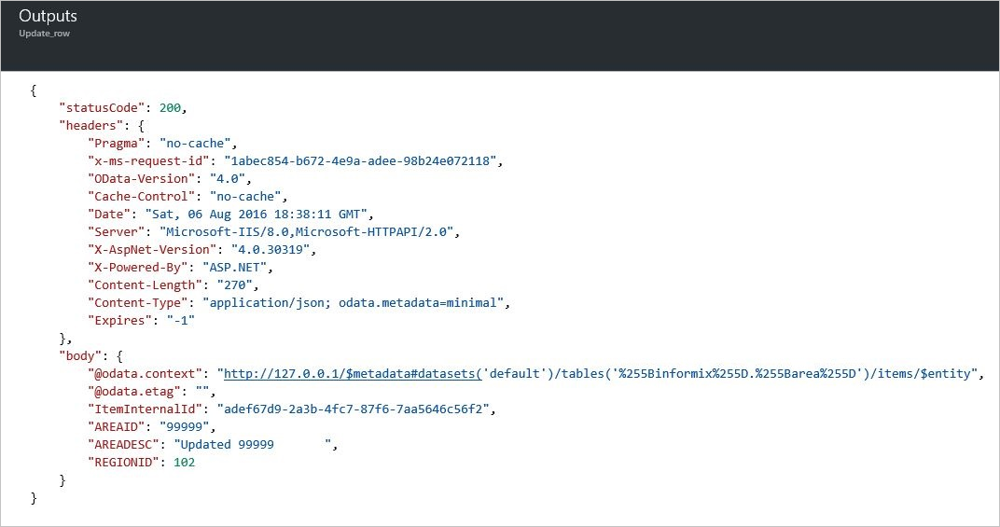

## Entfernen einer Zeile mit löschen
Sie können eine Aktion Logik app, um eine Zeile in einer Tabelle Informix entfernen erstellen. Diese Aktion weist den Verbinder, um die Verarbeitung von einer löschen Informix-Anweisung, wie `DELETE FROM AREA WHERE AREAID = '99999'`.

### Erstellen Sie eine app Logik
1.  **Azure Brett zu starten**, wählen Sie **+** (Pluszeichen) **Web + Mobile**, und klicken Sie dann **Logik App**.
2.  Geben Sie den **Namen**, z. B. `InformixdeleteRow`, **Abonnements**, **Ressourcengruppe**, **Position**und **Planen der App-Dienst**. Wählen Sie **zum Dashboard Pin**, und wählen Sie dann auf **Erstellen**.

### Hinzufügen eines Trigger und Aktion
1.  Wählen Sie in der **Logik Apps-Designer** **Leere LogicApp** in der Liste **Vorlagen** aus.
2.  Wählen Sie in der Liste **Trigger** **Serie**aus. 
3.  Wählen Sie in der **Serie** Trigger **Bearbeiten**aus, wählen Sie **Häufigkeit** Dropdown- **Tag**auswählen aus, und wählen Sie dann das **Intervall** zum Eingeben von **7**aus. 
4.  Wählen Sie im Feld **+ neuen Schritt** aus, und wählen Sie dann **eine Aktion hinzufügen**.
5.  Geben Sie in der Liste **Aktionen** im Feld **Suchen, um weitere Aktionen** bearbeiten **Informix** ein, und wählen Sie dann auf **Informix - Zeile (Preview) zu löschen**.
6. Wählen Sie in der Aktion **Abrufen von Zeilen (Preview)** **Verbindung ändern**. 
7. Wählen Sie im Bereich **Verbindungen** Konfigurationen eine vorhandene Verbindung aus. Wählen Sie beispielsweise **hisdemo2**ein.

    

8. Klicken Sie in der Liste **Tabellenname** wählen Sie die **nach-unten**, und wählen Sie dann **im Bereich**.
9. Geben Sie Werte für alle erforderlichen Spalten (Siehe rotes Sternchen) ein. Geben Sie beispielsweise `99999` für **AREAID**. 
10. Wählen Sie **Speichern**aus. 

    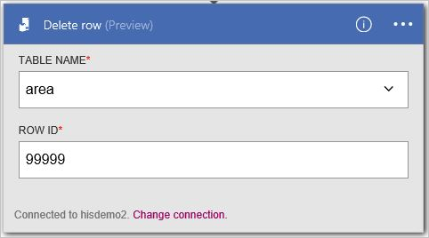

11. Wählen Sie in der **InformixdeleteRow** Blade, in der Liste **Alle ausgeführt wird** , klicken Sie unter **Zusammenfassung**das Element zuerst aufgeführten (die letzte Ausführung) ein.
12. Wählen Sie das Blade **Logik app ausführen** **Details ausführen**. Wählen Sie in der Liste **Aktion** **Get_rows**aus. Lesen Sie den Wert für **Status** **erfolgreich**sein sollten. Wählen Sie den **Link Eingaben** Eingaben anzeigen. Wählen Sie den **Link gibt**aus, und zeigen Sie die Ausgaben; die gelöschte Zeile enthalten soll.

    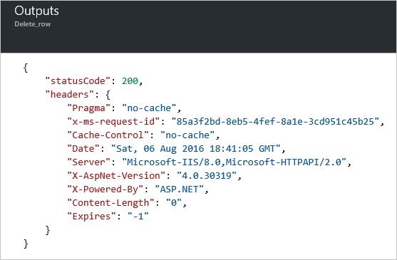

## Technische Details

## Aktionen
Eine Aktion ist ein Vorgang durchgeführten durch den Workflow in einer app Logik definiert. Der Verbinder Informix-Datenbank umfasst die folgenden Aktionen aus. 

|Aktion|Beschreibung|
|--- | ---|
|[[GetRow](connectors-create-api-informix.md#get-row)|Ruft eine einzelne Zeile aus einer Tabelle Informix|
|[GetRows](connectors-create-api-informix.md#get-rows)|Ruft Zeilen aus einer Tabelle Informix|
|[InsertRow](connectors-create-api-informix.md#insert-row)|Fügt eine neue Zeile in eine Tabelle Informix|
|[DeleteRow](connectors-create-api-informix.md#delete-row)|Löscht eine Zeile aus einer Tabelle Informix|
|[GetTables](connectors-create-api-informix.md#get-tables)|Ruft Tabellen aus einer Datenbank Informix|
|[UpdateRow](connectors-create-api-informix.md#update-row)|So aktualisiert, dass eine vorhandene Zeile in einer Tabelle Informix|

### Aktionsdetails

In diesem Abschnitt finden Sie unter der bestimmte Details zu jeder Aktion, einschließlich alle erforderlichen oder optionalen von Eigenschaften und eine entsprechende Ausgabe der Verbinder zugeordnet.

#### Erste Zeile 
Ruft eine einzelne Zeile aus einer Tabelle Informix ab.  

| Eigenschaftsname| Anzeigename |Beschreibung|
| ---|---|---|
|Tabelle * | Tabellenname |Name der Tabelle Informix|
|ID * | Zeilen-id |Eindeutiger Bezeichner der Zeile zum Abrufen von|

Ein Sternchen (*) bedeutet, dass die Eigenschaft erforderlich ist.

##### Die Ausgabedetails
Element

| Eigenschaftsname | Datentyp |
|---|---|
|ItemInternalId|Zeichenfolge|

#### Abrufen von Zeilen 
Ruft Zeilen aus einer Tabelle Informix ab.  

|Eigenschaftsname| Anzeigename|Beschreibung|
| ---|---|---|
|Tabelle *|Tabellenname|Name der Tabelle Informix|
|$skip|Überspringen zählen|Anzahl von Einträgen, überspringen (Standard = 0)|
|$top|Abrufen der maximalen Anzahl|Maximale Anzahl von Einträgen zum Abrufen (Standard = 256)|
|$filter|Filtern der Abfrage|Die Abfrage ein ODATA Filter zum Einschränken der Anzahl von Einträgen|
|$orderby|Sortiert nach|Eine ODATA OrderBy Abfrage zum Festlegen der Reihenfolge von Einträgen|

Ein Sternchen (*) bedeutet, dass die Eigenschaft erforderlich ist.

##### Die Ausgabedetails
ItemsList

| Eigenschaftsname | Datentyp |
|---|---|
|Wert|Matrix|

#### Zeile einfügen 
Fügt eine neue Zeile in einer Tabelle Informix ein.  

|Eigenschaftsname| Anzeigename|Beschreibung|
| ---|---|---|
|Tabelle *|Tabellenname|Name der Tabelle Informix|
|Element *|Zeile|Zeile in der angegebenen Tabelle in Informix einfügen|

Ein Sternchen (*) bedeutet, dass die Eigenschaft erforderlich ist.

##### Die Ausgabedetails
Element

| Eigenschaftsname | Datentyp |
|---|---|
|ItemInternalId|Zeichenfolge|

#### Zeile löschen 
Löscht eine Zeile aus einer Tabelle Informix an.  

|Eigenschaftsname| Anzeigename|Beschreibung|
| ---|---|---|
|Tabelle *|Tabellenname|Name der Tabelle Informix|
|ID *|Zeilen-id|Eindeutiger Bezeichner des zu löschenden Zeile|

Ein Sternchen (*) bedeutet, dass die Eigenschaft erforderlich ist.

##### Die Ausgabedetails
Keine.

#### Abrufen von Tabellen 
Ruft Tabellen aus einer Datenbank Informix ab.  

Es gibt keine Parameter für diesen Anruf. 

##### Die Ausgabedetails 
TablesList

| Eigenschaftsname | Datentyp |
|---|---|
|Wert|Matrix|

#### Zeile aktualisieren 
Aktualisiert eine vorhandene Zeile in einer Tabelle Informix an.  

|Eigenschaftsname| Anzeigename|Beschreibung|
| ---|---|---|
|Tabelle *|Tabellenname|Name der Tabelle Informix|
|ID *|Zeilen-id|Eindeutiger Bezeichner für die zu aktualisierende Zeile|
|Element *|Zeile|Zeile mit aktualisierten Werte|

Ein Sternchen (*) bedeutet, dass die Eigenschaft erforderlich ist.

##### Die Ausgabedetails  
Element

| Eigenschaftsname | Datentyp |
|---|---|
|ItemInternalId|Zeichenfolge|

### HTTP-Antworten

Wenn die anderen Aktionen aufrufen, möglicherweise bestimmte Antworten erhalten haben. In der folgenden Tabelle werden die Antworten und deren Beschreibung an:  

|Namen|Beschreibung|
|---|---|
|200|Okay|
|202|Akzeptiert|
|400|Ungültige Anforderung|
|401|Nicht autorisierte|
|403|Verboten|
|404|Nicht gefunden|
|500|Interner Serverfehler. Unbekannter Fehler aufgetreten ist.|
|Standard|Fehler bei Vorgang.|

## Unterstützte Plattformen für Informix und Versionen
Dieser Connector unterstützt die folgenden IBM Informix-Versionen, wenn so konfiguriert, dass Clientverbindungen verteilt relationalen Datenbank Architektur (DRDA) unterstützen.

- IBM Informix 12.1
- IBM Informix 11.7

 
## Nächste Schritte

[Erstellen einer app Logik](../app-service-logic/app-service-logic-create-a-logic-app.md). Untersuchen der verfügbaren Connectors in Logik Apps auf unserer [APIs Liste](apis-list.md)an.

