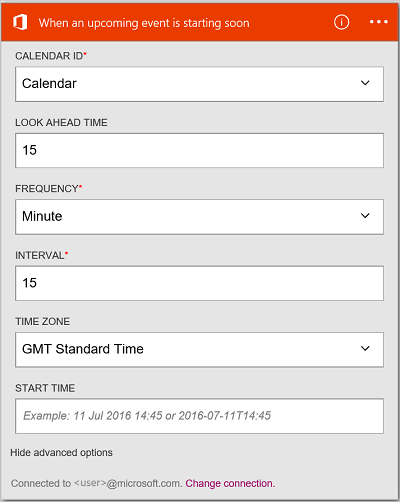

<properties
    pageTitle="Hinzufügen von Office 365 Outlook Connector in Ihrer Apps Logik | Microsoft Azure"
    description="Erstellen Sie Logik apps mit Office 365-Verbinder, um die Interaktion mit Office 365 zu ermöglichen. Beispiel: erstellen, bearbeiten und Aktualisieren von Kontakten und Kalenderelementen."
    services=""    
    documentationCenter=""     
    authors="MandiOhlinger"    
    manager="anneta"    
    editor="" 
    tags="connectors" />

<tags
ms.service="logic-apps"
ms.devlang="na"
ms.topic="article"
ms.tgt_pltfrm="na"
ms.workload="integration"
ms.date="10/18/2016"
ms.author="mandia"/>

# Erste Schritte mit Office 365 Outlook connector 

Office 365 Outlook Connector ermöglicht die Interaktion mit Outlook in Office 365. Verwenden Sie diese Verbinder zu erstellen, bearbeiten und Aktualisieren von Kontakten und Kalenderelementen, und auch, senden und Beantworten von e-Mails aus.

Mit Office 365 Outlook können Sie:

- Erstellen Sie den Workflow verwenden die e-Mail und Kalender-Funktionen in Office 365 an. 
- Verwenden Sie Trigger, um den Workflow zu starten, wenn es ist eine neue e-Mail, wenn ein Kalenderelement aktualisiert wird.
- Verwenden von Aktionen zum Senden einer e-Mail, erstellen ein neues Ereignis im Kalender und vieles mehr. Wenn ein neues Objekt in Vertrieb (eines Triggers) vorhanden ist, senden Sie eine e-Mail mit Ihrer Office 365 Outlook (eine Aktion) fest. 

In diesem Thema wird gezeigt, wie Office 365 Outlook Connector in einer app Logik verwenden, und auch Listet die Trigger und Aktionen.

>[AZURE.NOTE] Diese Version des Artikels gilt Logik Apps allgemeine Verfügbarkeit (GA) aus.

Weitere Informationen zu Logik Apps finden Sie unter [Was sind die Logik apps](../app-service-logic/app-service-logic-what-are-logic-apps.md) , und [Erstellen Sie eine app Logik](../app-service-logic/app-service-logic-create-a-logic-app.md).

## Verbinden mit Office 365

Bevor Sie Ihre app Logik Dienste zugreifen kann, erstellen Sie zuerst eine *Verbindung* mit dem Dienst an. Eine Verbindung stellt eine Verbindung zwischen einer app Logik und einem anderen Dienst. Beispielsweise benötigen zum Verbinden mit Office 365 Outlook Sie zuerst ein Office 365- *Verbindung*. Um eine Verbindung herzustellen, geben Sie die Anmeldeinformationen, die Sie normalerweise verwenden, den Zugriff auf Dienste, die Sie verbinden möchten. Geben Sie also mit Office 365 Outlook die Anmeldeinformationen auf Ihre Office 365-Konto, um die Verbindung zu erstellen.

## Herstellen der Verbindungs

>[AZURE.INCLUDE [Steps to create a connection to Office 365](../../includes/connectors-create-api-office365-outlook.md)]

## Verwenden eines Triggers

Ein Trigger ist ein Ereignis, das zum Starten des Workflows in einer app Logik definiert verwendet werden kann. Trigger Umfrage"" Dienst unter zu einem Intervall und die gewünschte Häufigkeit. [Erfahren Sie mehr über Trigger](../app-service-logic/app-service-logic-what-are-logic-apps.md#logic-app-concepts).

1. Geben Sie in der app Logik "Office 365", um eine Liste der Trigger zu erhalten:  

    

2. Wählen Sie **Office 365 Outlook – Wenn bevorstehende Veranstaltung bald gestartet wird**. Wenn Sie bereits eine Verbindung besteht, wählen Sie einen Kalender aus der Dropdown-Liste ein.

    

    Wenn Sie aufgefordert werden, melden Sie sich, geben Sie dann die Vorzeichen in Details, um die Verbindung zu erstellen. [Erstellen die Verbindung](connectors-create-api-office365-outlook.md#create-the-connection) in diesem Thema werden die Schritte aufgelistet. 

    > [AZURE.NOTE] In diesem Beispiel wird die app Logik ausgeführt, wenn ein Ereignis im Kalender aktualisiert wird. Um die Ergebnisse dieser Trigger anzuzeigen, fügen Sie eine andere Aktion, die Ihnen eine Textnachricht sendet. Fügen Sie der Aktion Twilio *Nachricht senden,* beispielsweise die Texte Sie beim Starten von des Kalenderereignis in 15 Minuten. 

3. Wählen Sie die Schaltfläche **Bearbeiten** , und legen Sie die **Häufigkeit** und **Intervall** Werte. Angenommen, Sie bei Bedarf den Trigger auf Umfrage alle 15 Minuten, klicken Sie dann legen Sie die **Häufigkeit** auf **Minute**, und legen Sie das **Intervall** auf **15**. 

    

4. **Speichern** der Änderungen (oberen linken Ecke der Symbolleiste). Ihre app Logik wird gespeichert und automatisch aktiviert werden kann.

## Verwenden Sie eine Aktion

Eine Aktion ist ein Vorgang durchgeführten durch den Workflow in einer app Logik definiert. [Erfahren Sie mehr über Aktionen](../app-service-logic/app-service-logic-what-are-logic-apps.md#logic-app-concepts).

1. Wählen Sie das Pluszeichen (+) aus. Die Reihe von Optionen angezeigt: **Hinzufügen einer Aktion**, **Hinzufügen einer Bedingung**oder eine der **Weitere** Optionen.

    

2. Wählen Sie **eine Aktion hinzufügen**.

3. Geben Sie im Textfeld "Office 365", um eine Liste aller verfügbaren Aktionen zu erhalten.

     

4. Wählen Sie in diesem Beispiel **Office 365 Outlook - Kontakt zu erstellen**. Wenn Sie bereits eine Verbindung besteht, wählen Sie dann die **Ordner-ID**, **Vorname**und andere Eigenschaften aus:  

    

    Wenn Sie für die Verbindungsinformationen aufgefordert werden, geben Sie dann die Details, um die Verbindung zu erstellen. [Erstellen Sie die Verbindung](connectors-create-api-office365-outlook.md#create-the-connection) in diesem Thema werden diese Eigenschaften beschrieben. 

    > [AZURE.NOTE] In diesem Beispiel erstellen wir einen neuen Kontakt in Outlook für Office 365 an. Die Ausgabe von einem anderen Trigger können Sie um den Kontakt zu erstellen. Fügen Sie beispielsweise den Trigger Vertrieb *beim Erstellen ein Objekts* hinzu. Fügen Sie dann die Aktion mit Office 365 Outlook- *Kontakt erstellen* , die den Vertrieb Felder verwendet, um den neuen neuer Kontakt in Office 365 erstellen hinzu. 

5. **Speichern** der Änderungen (oberen linken Ecke der Symbolleiste). Ihre app Logik wird gespeichert und automatisch aktiviert werden kann.

## Technische Details

Hier sind die Details der Trigger, Aktionen und Antworten, die diese Verbindung unterstützt:

## Office 365-Triggern

|Auslösen | Beschreibung|
|--- | ---|
|[Wenn eine bevorstehende Veranstaltung früh starten](connectors-create-api-office365-outlook.md#when-an-upcoming-event-is-starting-soon)|Dieser Vorgang löst einen Fluss aus, wenn eine anstehende Kalenderereignis gestartet wird.|
|[Beim Eintreffen einer neuen e-Mail-Nachricht](connectors-create-api-office365-outlook.md#when-a-new-email-arrives)|Dieser Vorgang löst einen Fluss beim Eintreffen einer neuen e-Mail-Nachricht|
|[Wenn ein neues Ereignis erstellt wurde](connectors-create-api-office365-outlook.md#when-a-new-event-is-created)|Dieser Vorgang löst einen Fluss aus, wenn ein neues Ereignis in einem Kalender erstellt wird.|
|[Wenn ein Ereignis geändert wird.](connectors-create-api-office365-outlook.md#when-an-event-is-modified)|Dieser Vorgang löst einen Fluss aus, wenn ein Ereignisses in einem Kalender geändert wird.|

## Office 365-Aktionen

|Aktion|Beschreibung|
|--- | ---|
|[Abrufen von e-Mails](connectors-create-api-office365-outlook.md#get-emails)|Dieser Vorgang ruft e-Mails aus einem Ordner ab.|
|[Senden einer e-Mail](connectors-create-api-office365-outlook.md#send-an-email)|Dieser Vorgang sendet eine e-Mail-Nachricht an.|
|[Löschen von e-Mails](connectors-create-api-office365-outlook.md#delete-email)|Dieser Vorgang löscht eine e-Mail-Nachricht nach Id an.|
|[Als gelesen markieren](connectors-create-api-office365-outlook.md#mark-as-read)|Dieser Vorgang wird eine e-Mail-Nachricht als gelesen markiert.|
|[Beantworten von e-Mails](connectors-create-api-office365-outlook.md#reply-to-email)|Dieser Vorgang Antworten auf eine e-Mail-Nachricht.|
|[Anlage erhalten](connectors-create-api-office365-outlook.md#get-attachment)|Mit diesem Vorgang wird eine e-Mail-Anlage nach Id an.|
|[Senden von e-Mails mit Optionen](connectors-create-api-office365-outlook.md#send-email-with-options)|Dieser Vorgang sendet eine e-Mail-Nachricht mit mehreren Optionen und wartet darauf, dass der Empfänger Antworten mit eine der Optionen zurück.|
|[Senden von e-Mail mit der Genehmigung](connectors-create-api-office365-outlook.md#send-approval-email)|Dieser Vorgang sendet eine e-Mail mit der Genehmigung und wartet auf eine Antwort von der Empfänger.|
|[Abrufen von Kalendern](connectors-create-api-office365-outlook.md#get-calendars)|Dieser Vorgang Listen verfügbaren Kalender.|
|[Abrufen von Ereignissen](connectors-create-api-office365-outlook.md#get-events)|Dieser Vorgang ruft Ereignisse in einem Kalender ab.|
|[Erstellen von Ereignis](connectors-create-api-office365-outlook.md#create-event)|Dieser Vorgang erstellt ein neues Ereignis in einem Kalender ein.|
|[Rufen Sie Ereignis](connectors-create-api-office365-outlook.md#get-event)|Dieser Vorgang ruft ein bestimmtes Ereignis aus einem Kalender ab.|
|[Ereignis löschen](connectors-create-api-office365-outlook.md#delete-event)|Dieser Vorgang löscht ein Ereignisses in einem Kalender ein.|
|[Aktualisieren der Veranstaltung](connectors-create-api-office365-outlook.md#update-event)|Dieser Vorgang aktualisiert ein Ereignisses in einem Kalender ein.|
|[Abrufen von Kontaktordnern](connectors-create-api-office365-outlook.md#get-contact-folders)|Dieser Vorgang Listen Kontakteordner verfügbar.|
|[Abrufen von Kontakten](connectors-create-api-office365-outlook.md#get-contacts)|Dieser Vorgang ruft die Kontakte aus einem Kontakteordner ab.|
|[Kontakt erstellen](connectors-create-api-office365-outlook.md#create-contact)|Dieser Vorgang erstellt einen neuen Kontakt in einem Kontakteordner.|
|[Abrufen von Kontakt](connectors-create-api-office365-outlook.md#get-contact)|Dieser Vorgang Ruft einem bestimmten Kontakt in einem Kontakteordner ab.|
|[Kontakt löschen](connectors-create-api-office365-outlook.md#delete-contact)|Dieser Vorgang wird ein Kontakt aus einem Kontakteordner gelöscht.|
|[Kontakt aktualisieren](connectors-create-api-office365-outlook.md#update-contact)|Dieser Vorgang aktualisiert ein Kontakts in einem Kontakteordner.|

### Details zu Trigger und Aktion

In diesem Abschnitt finden Sie unter die bestimmte Details zu den einzelnen Trigger und die Aktion, einschließlich alle erforderlichen oder optionalen von Eigenschaften und eine entsprechende Ausgabe der Verbinder zugeordnet.

#### Wenn eine bevorstehende Veranstaltung früh starten
Dieser Vorgang löst einen Fluss aus, wenn eine anstehende Kalenderereignis gestartet wird. 

|Eigenschaftsname| Anzeigename|Beschreibung|
| ---|---|---|
|Tabelle *|Kalender-id|Eindeutiger Bezeichner des Kalenders|
|lookAheadTimeInMinutes|Während der Zeit aussehen|Zeit (in Minuten) für bevorstehende Ereignisse anstehen aussehen|

Ein Sternchen (*) bedeutet, dass die Eigenschaft erforderlich ist.

##### Die Ausgabedetails
CalendarItemsList: Die Liste der Elemente im Kalender

| Eigenschaftsname | Datentyp | Beschreibung |
|---|---|---|
|Wert|Matrix|Liste der Elemente im Kalender|

#### Abrufen von e-Mails
Dieser Vorgang ruft e-Mails aus einem Ordner ab. 

|Eigenschaftsname| Anzeigename|Beschreibung|
| ---|---|---|
|Ordnerpfad|Ordnerpfad|Pfad zum Ordner zum Abrufen von e-Mails (Standard: 'Posteingang')|
|Nach oben|Nach oben|Anzahl der e-Mails abrufen (Standard: 10)|
|fetchOnlyUnread|Nur ungelesene Nachrichten abgerufen werden sollen|Abrufen von nur ungelesenen e-Mails?|
|includeAttachments|Einschließen von Anlagen|Wenn wahr, Anlagen festlegen auch zusammen mit der e-Mail einbezogen werden sollen|
|searchQuery|Suchabfrage|Suchabfrage zum Filtern von e-Mails|
|Überspringen|Überspringen|Anzahl der e-Mails zu überspringen (Standard: 0)|
|skipToken|Überspringen Token|Überspringen von Token auf Abruf neue Seite|

Ein Sternchen (*) bedeutet, dass die Eigenschaft erforderlich ist.

##### Die Ausgabedetails
ReceiveMessage: Empfangen von e-Mail-Nachricht

| Eigenschaftsname | Datentyp | Beschreibung |
|---|---|---|
|Von|Zeichenfolge|Von|
|An|Zeichenfolge|An|
|Betreff|Zeichenfolge|Betreff|
|Textkörper|Zeichenfolge|Textkörper|
|Wichtigkeit: hoch|Zeichenfolge|Wichtigkeit: hoch|
|HasAttachment|Boolesch|Anlage enthält|
|ID|Zeichenfolge|Nachrichten-Id|
|IsRead|Boolesch|Ist schreibgeschützt|
|DateTimeReceived|Zeichenfolge|Uhrzeit empfangen|
|Anlagen|Matrix|Anlagen|
|Cc|Zeichenfolge|Geben Sie die e-Mail-Adressen durch Semikolons getrennt, wiesomeone@contoso.com|
|"Bcc"|Zeichenfolge|Geben Sie die e-Mail-Adressen durch Semikolons getrennt, wiesomeone@contoso.com|
|IsHtml|Boolesch|HTML-Code|

#### Senden einer e-Mail
Dieser Vorgang sendet eine e-Mail-Nachricht an. 

|Eigenschaftsname| Anzeigename|Beschreibung|
| ---|---|---|
|' EmailMessage ' *|E-Mail|E-Mail|

Ein Sternchen (*) bedeutet, dass die Eigenschaft erforderlich ist.

##### Die Ausgabedetails
Keine.

#### Löschen von e-Mails
Dieser Vorgang löscht eine e-Mail-Nachricht nach Id an. 

|Eigenschaftsname| Anzeigename|Beschreibung|
| ---|---|---|
|Nachrichten-ID *|Nachrichten-Id|Die e-Mail zu löschenden-ID|

Ein Sternchen (*) bedeutet, dass die Eigenschaft erforderlich ist.

##### Die Ausgabedetails
Keine.

#### Als gelesen markieren
Dieser Vorgang wird eine e-Mail-Nachricht als gelesen markiert. 

|Eigenschaftsname| Anzeigename|Beschreibung|
| ---|---|---|
|Nachrichten-ID *|Nachrichten-Id|Lesen Sie-ID die e-Mail als markiert sein soll.|

Ein Sternchen (*) bedeutet, dass die Eigenschaft erforderlich ist.

##### Die Ausgabedetails
Keine.

#### Beantworten von e-Mails
Dieser Vorgang Antworten auf eine e-Mail-Nachricht. 

|Eigenschaftsname| Anzeigename|Beschreibung|
| ---|---|---|
|Nachrichten-ID *|Nachrichten-Id|ID der e-Mail, um zu Antworten|
|Kommentar *|Kommentar|Kommentar antworten|
|replyAll|Allen Antworten|Senden einer Antwort an alle Empfänger|

Ein Sternchen (*) bedeutet, dass die Eigenschaft erforderlich ist.

##### Die Ausgabedetails
Keine.

#### Anlage erhalten
Mit diesem Vorgang wird eine e-Mail-Anlage nach Id an. 

|Eigenschaftsname| Anzeigename|Beschreibung|
| ---|---|---|
|Nachrichten-ID *|Nachrichten-Id|Die e-Mail-ID|
|AttachmentId *|Anlage-Id|ID der Anlage herunterladen|

Ein Sternchen (*) bedeutet, dass die Eigenschaft erforderlich ist.

##### Die Ausgabedetails
Keine.

#### Beim Eintreffen einer neuen e-Mail-Nachricht
Dieser Vorgang löst einen Fluss beim Eintreffen einer neuen e-Mail-Nachricht.

|Eigenschaftsname| Anzeigename|Beschreibung|
| ---|---|---|
|Ordnerpfad|Ordnerpfad|Abrufen von e-Mail-Ordner (Standard: Posteingang)|
|An|An|Empfänger e-Mail-Adressen|
|Von|Von|Von Adresse|
|Wichtigkeit: hoch|Wichtigkeit: hoch|Bedeutung der e-Mail (hoch, Normal, Niedrig) (Standard: Normal)|
|fetchOnlyWithAttachment|Hat Anlagen|Abrufen von nur e-Mail-Nachrichten mit einer Anlage|
|includeAttachments|Einschließen von Anlagen|Einschließen von Anlagen|
|subjectFilter|Betreff filtern|Die Zeichenfolge, die in der Betreffzeile suchen|

Ein Sternchen (*) bedeutet, dass die Eigenschaft erforderlich ist.

##### Die Ausgabedetails
TriggerBatchResponse [ReceiveMessage]

| Eigenschaftsname | Datentyp |
|---|---|
|Wert|Matrix|

#### Senden von e-Mails mit Optionen
Dieser Vorgang sendet eine e-Mail-Nachricht mit mehreren Optionen und wartet darauf, dass der Empfänger Antworten mit eine der Optionen zurück. 

|Eigenschaftsname| Anzeigename|Beschreibung|
| ---|---|---|
|OptionsEmailSubscription *|Abonnementsanfrage für Optionen e-Mail|Abonnementsanfrage für Optionen e-Mail|

Ein Sternchen (*) bedeutet, dass die Eigenschaft erforderlich ist.

##### Die Ausgabedetails
SubscriptionResponse: Modell für die Genehmigung von e-Mail-Abonnements

| Eigenschaftsname | Datentyp | Beschreibung |
|---|---|---|
|ID|Zeichenfolge|ID des Abonnements|
|Ressource|Zeichenfolge|Ressource der Abonnementsanfrage|
|notificationType|Zeichenfolge|Benachrichtigungstyp|
|notificationUrl|Zeichenfolge|Benachrichtigung-Url|

#### Senden von e-Mail mit der Genehmigung
Dieser Vorgang sendet eine e-Mail mit der Genehmigung und wartet auf eine Antwort von der Empfänger. 

|Eigenschaftsname| Anzeigename|Beschreibung|
| ---|---|---|
|ApprovalEmailSubscription *|Zur Genehmigung e-Mail-Abonnement stehende Frage|Zur Genehmigung e-Mail-Abonnement stehende Frage|

Ein Sternchen (*) bedeutet, dass die Eigenschaft erforderlich ist.

##### Die Ausgabedetails
SubscriptionResponse: Modell für die Genehmigung von e-Mail-Abonnements

| Eigenschaftsname | Datentyp | Beschreibung |
|---|---|---|
|ID|Zeichenfolge|ID des Abonnements|
|Ressource|Zeichenfolge|Ressource der Abonnementsanfrage|
|notificationType|Zeichenfolge|Benachrichtigungstyp|
|notificationUrl|Zeichenfolge|Benachrichtigung-Url|

#### Abrufen von Kalendern
Dieser Vorgang Listen verfügbaren Kalender. 

Es gibt keine Parameter für diesen Anruf.

##### Die Ausgabedetails
TablesList

| Eigenschaftsname | Datentyp |
|---|---|
|Wert|Matrix|

#### Abrufen von Ereignissen
Dieser Vorgang ruft Ereignisse in einem Kalender ab. 

|Eigenschaftsname| Anzeigename|Beschreibung|
| ---|---|---|
|Tabelle *|Kalender-id|Wählen Sie einen Kalender|
|$filter|Filtern der Abfrage|Die Abfrage ein ODATA Filter zum Einschränken der zurückgegebenen Einträge|
|$orderby|Sortiert nach|Eine ODATA OrderBy Abfrage zum Festlegen der Reihenfolge von Einträgen|
|$skip|Überspringen zählen|Anzahl von Einträgen, überspringen (Standard = 0)|
|$top|Abrufen der maximalen Anzahl|Maximale Anzahl von Einträgen zum Abrufen (Standard = 256)|

Ein Sternchen (*) bedeutet, dass die Eigenschaft erforderlich ist.

##### Die Ausgabedetails
CalendarEventList: Die Liste der Elemente im Kalender

| Eigenschaftsname | Datentyp | Beschreibung |
|---|---|---|
|Wert|Matrix|Liste der Elemente im Kalender|

#### Erstellen von Ereignis
Dieser Vorgang erstellt ein neues Ereignis in einem Kalender ein. 

|Eigenschaftsname| Anzeigename|Beschreibung|
| ---|---|---|
|Tabelle *|Kalender-id|Wählen Sie einen Kalender|
|Element *|Element|Ereignis erstellen|

Ein Sternchen (*) bedeutet, dass die Eigenschaft erforderlich ist.

##### Die Ausgabedetails
CalendarEvent: Verbinder bestimmten Kalender Ereignis Modell Class.

| Eigenschaftsname | Datentyp | Beschreibung |
|---|---|---|
|ID|Zeichenfolge|Eindeutiger Bezeichner für des Ereignisses.|
|Teilnehmer|Matrix|Liste der Teilnehmer für das Ereignis.|
|Textkörper|nicht definiert|Hauptteil der Nachricht, die mit dem Ereignis verknüpfte.|
|BodyPreview|Zeichenfolge|Die Vorschau der Nachricht mit dem Ereignis verknüpfte.|
|Kategorien|Matrix|Mit dem Ereignis verknüpfte Kategorien.|
|ChangeKey|Zeichenfolge|Ermittelt die Version des Ereignisobjekts. Jedes Mal, wenn das Ereignis geändert wird, ändert sich ChangeKey ebenfalls ein.|
|DateTimeCreated|Zeichenfolge|Datum und Uhrzeit, die das Ereignis erstellt wurde.|
|DateTimeLastModified|Zeichenfolge|Datum und Uhrzeit der letzten Änderung des Ereignisses.|
|Ende|Zeichenfolge|Die Endzeit des Ereignisses.|
|EndTimeZone|Zeichenfolge|Gibt die Zeitzone für die Besprechung Endzeit. Dieser Wert muss in Windows definierten (Beispiel: "Pazifischen Raum Standard Time").|
|HasAttachments|Boolesch|Legen Sie auf true, wenn das Ereignis Anlagen hat.|
|Wichtigkeit: hoch|Zeichenfolge|Das Ereignis die Wichtigkeit: niedrig, Normal oder hoch.|
|IsAllDay|Boolesch|Dauert das Ereignis Ganztägig true festgelegt.|
|IsCancelled|Boolesch|True, wenn das Ereignis abgebrochen wurde festgelegt.|
|IsOrganizer|Boolesch|True, wenn der Absender der Nachricht auch des Organisators wird festgelegt.|
|Speicherort|nicht definiert|Die Position des Ereignisses.|
|Organizer|nicht definiert|Der Organisator des Ereignisses.|
|Serie|nicht definiert|Das Serienmuster für das Ereignis.|
|Erinnerung|ganze Zahl|Zeit in Minuten vor dem Ereignis Start erinnern.|
|ResponseRequested|Boolesch|True, wenn der Absender eine Antwort erhalten möchte, wenn das Ereignis akzeptiert oder abgelehnt wird festgelegt.|
|ResponseStatus|nicht definiert|Gibt den Typ der Antwort, die als Antwort auf ein Ereignisnachricht gesendet.|
|SeriesMasterId|Zeichenfolge|Eindeutiger Bezeichner für Ereignistyp Reihe Master-Shape.|
|ShowAs|Zeichenfolge|Zeigt an, dass die Frei / Gebucht-Informationen.|
|Starten|Zeichenfolge|Die Startzeit des Ereignisses.|
|StartTimeZone|Zeichenfolge|Gibt den Zeitpunkt der Besprechung Zone Startzeit. Dieser Wert muss in Windows definierten (Beispiel: "Pazifischen Raum Standard Time").|
|Betreff|Zeichenfolge|Betreff für ein Ereignis.|
|Typ|Zeichenfolge|Ereignistyp: einzelnen Instanz, vorkommen, Ausnahme oder Reihe Master-Shape.|
|WebLink|Zeichenfolge|Die Vorschau der Nachricht mit dem Ereignis verknüpfte.|

#### Rufen Sie Ereignis
Dieser Vorgang ruft ein bestimmtes Ereignis aus einem Kalender ab. 

|Eigenschaftsname| Anzeigename|Beschreibung|
| ---|---|---|
|Tabelle *|Kalender-id|Wählen Sie einen Kalender|
|ID *|Listenelement-id|Wählen Sie ein Ereignis|

Ein Sternchen (*) bedeutet, dass die Eigenschaft erforderlich ist.

##### Die Ausgabedetails
CalendarEvent: Verbinder bestimmten Kalender Ereignis Modell Class.

| Eigenschaftsname | Datentyp | Beschreibung |
|---|---|---|
|ID|Zeichenfolge|Eindeutiger Bezeichner für des Ereignisses.|
|Teilnehmer|Matrix|Liste der Teilnehmer für das Ereignis.|
|Textkörper|nicht definiert|Hauptteil der Nachricht, die mit dem Ereignis verknüpfte.|
|BodyPreview|Zeichenfolge|Die Vorschau der Nachricht mit dem Ereignis verknüpfte.|
|Kategorien|Matrix|Mit dem Ereignis verknüpfte Kategorien.|
|ChangeKey|Zeichenfolge|Ermittelt die Version des Ereignisobjekts. Jedes Mal, wenn das Ereignis geändert wird, ändert sich ChangeKey ebenfalls ein.|
|DateTimeCreated|Zeichenfolge|Datum und Uhrzeit, die das Ereignis erstellt wurde.|
|DateTimeLastModified|Zeichenfolge|Datum und Uhrzeit der letzten Änderung des Ereignisses.|
|Ende|Zeichenfolge|Die Endzeit des Ereignisses.|
|EndTimeZone|Zeichenfolge|Gibt die Zeitzone für die Besprechung Endzeit. Dieser Wert muss in Windows definierten (Beispiel: "Pazifischen Raum Standard Time").|
|HasAttachments|Boolesch|Legen Sie auf true, wenn das Ereignis Anlagen hat.|
|Wichtigkeit: hoch|Zeichenfolge|Das Ereignis die Wichtigkeit: niedrig, Normal oder hoch.|
|IsAllDay|Boolesch|Dauert das Ereignis Ganztägig true festgelegt.|
|IsCancelled|Boolesch|True, wenn das Ereignis abgebrochen wurde festgelegt.|
|IsOrganizer|Boolesch|True, wenn der Absender der Nachricht auch des Organisators wird festgelegt.|
|Speicherort|nicht definiert|Die Position des Ereignisses.|
|Organizer|nicht definiert|Der Organisator des Ereignisses.|
|Serie|nicht definiert|Das Serienmuster für das Ereignis.|
|Erinnerung|ganze Zahl|Zeit in Minuten vor dem Ereignis Start erinnern.|
|ResponseRequested|Boolesch|True, wenn der Absender eine Antwort erhalten möchte, wenn das Ereignis akzeptiert oder abgelehnt wird festgelegt.|
|ResponseStatus|nicht definiert|Gibt den Typ der Antwort, die als Antwort auf ein Ereignisnachricht gesendet.|
|SeriesMasterId|Zeichenfolge|Eindeutiger Bezeichner für Ereignistyp Reihe Master-Shape.|
|ShowAs|Zeichenfolge|Zeigt an, dass die Frei / Gebucht-Informationen.|
|Starten|Zeichenfolge|Die Startzeit des Ereignisses.|
|StartTimeZone|Zeichenfolge|Gibt den Zeitpunkt der Besprechung Zone Startzeit. Dieser Wert muss in Windows definierten (Beispiel: "Pazifischen Raum Standard Time").|
|Betreff|Zeichenfolge|Betreff für ein Ereignis.|
|Typ|Zeichenfolge|Ereignistyp: einzelnen Instanz, vorkommen, Ausnahme oder Reihe Master-Shape.|
|WebLink|Zeichenfolge|Die Vorschau der Nachricht mit dem Ereignis verknüpfte.|

#### Ereignis löschen
Dieser Vorgang löscht ein Ereignisses in einem Kalender ein. 

|Eigenschaftsname| Anzeigename|Beschreibung|
| ---|---|---|
|Tabelle *|Kalender-id|Wählen Sie einen Kalender|
|ID *|ID|Wählen Sie ein Ereignis|

Ein Sternchen (*) bedeutet, dass die Eigenschaft erforderlich ist.

##### Die Ausgabedetails
Keine.

#### Aktualisieren der Veranstaltung
Dieser Vorgang aktualisiert ein Ereignisses in einem Kalender ein. 

|Eigenschaftsname| Anzeigename|Beschreibung|
| ---|---|---|
|Tabelle *|Kalender-id|Wählen Sie einen Kalender|
|ID *|ID|Wählen Sie ein Ereignis|
|Element *|Element|Ereignis aktualisieren|

Ein Sternchen (*) bedeutet, dass die Eigenschaft erforderlich ist.

##### Die Ausgabedetails
CalendarEvent: Verbinder bestimmten Kalender Ereignis Modell Class.

| Eigenschaftsname | Datentyp | Beschreibung |
|---|---|---|
|ID|Zeichenfolge|Eindeutiger Bezeichner für des Ereignisses.|
|Teilnehmer|Matrix|Liste der Teilnehmer für das Ereignis.|
|Textkörper|nicht definiert|Hauptteil der Nachricht, die mit dem Ereignis verknüpfte.|
|BodyPreview|Zeichenfolge|Die Vorschau der Nachricht mit dem Ereignis verknüpfte.|
|Kategorien|Matrix|Mit dem Ereignis verknüpfte Kategorien.|
|ChangeKey|Zeichenfolge|Ermittelt die Version des Ereignisobjekts. Jedes Mal, wenn das Ereignis geändert wird, ändert sich ChangeKey ebenfalls ein.|
|DateTimeCreated|Zeichenfolge|Datum und Uhrzeit, die das Ereignis erstellt wurde.|
|DateTimeLastModified|Zeichenfolge|Datum und Uhrzeit der letzten Änderung des Ereignisses.|
|Ende|Zeichenfolge|Die Endzeit des Ereignisses.|
|EndTimeZone|Zeichenfolge|Gibt die Zeitzone für die Besprechung Endzeit. Dieser Wert muss in Windows definierten (Beispiel: "Pazifischen Raum Standard Time").|
|HasAttachments|Boolesch|Legen Sie auf true, wenn das Ereignis Anlagen hat.|
|Wichtigkeit: hoch|Zeichenfolge|Das Ereignis die Wichtigkeit: niedrig, Normal oder hoch.|
|IsAllDay|Boolesch|Dauert das Ereignis Ganztägig true festgelegt.|
|IsCancelled|Boolesch|True, wenn das Ereignis abgebrochen wurde festgelegt.|
|IsOrganizer|Boolesch|True, wenn der Absender der Nachricht auch des Organisators wird festgelegt.|
|Speicherort|nicht definiert|Die Position des Ereignisses.|
|Organizer|nicht definiert|Der Organisator des Ereignisses.|
|Serie|nicht definiert|Das Serienmuster für das Ereignis.|
|Erinnerung|ganze Zahl|Zeit in Minuten vor dem Ereignis Start erinnern.|
|ResponseRequested|Boolesch|True, wenn der Absender eine Antwort erhalten möchte, wenn das Ereignis akzeptiert oder abgelehnt wird festgelegt.|
|ResponseStatus|nicht definiert|Gibt den Typ der Antwort, die als Antwort auf ein Ereignisnachricht gesendet.|
|SeriesMasterId|Zeichenfolge|Eindeutiger Bezeichner für Ereignistyp Reihe Master-Shape.|
|ShowAs|Zeichenfolge|Zeigt an, dass die Frei / Gebucht-Informationen.|
|Starten|Zeichenfolge|Die Startzeit des Ereignisses.|
|StartTimeZone|Zeichenfolge|Gibt den Zeitpunkt der Besprechung Zone Startzeit. Dieser Wert muss in Windows definierten (Beispiel: "Pazifischen Raum Standard Time").|
|Betreff|Zeichenfolge|Betreff für ein Ereignis.|
|Typ|Zeichenfolge|Ereignistyp: einzelnen Instanz, vorkommen, Ausnahme oder Reihe Master-Shape.|
|WebLink|Zeichenfolge|Die Vorschau der Nachricht mit dem Ereignis verknüpfte.|

#### Wenn ein neues Ereignis erstellt wurde
Dieser Vorgang löst einen Fluss aus, wenn ein neues Ereignis in einem Kalender erstellt wird. 

|Eigenschaftsname| Anzeigename|Beschreibung|
| ---|---|---|
|Tabelle *|Kalender-id|Wählen Sie einen Kalender|
|$filter|Filtern der Abfrage|Die Abfrage ein ODATA Filter zum Einschränken der zurückgegebenen Einträge|
|$orderby|Sortiert nach|Eine ODATA OrderBy Abfrage zum Festlegen der Reihenfolge von Einträgen|
|$skip|Überspringen zählen|Anzahl von Einträgen, überspringen (Standard = 0)|
|$top|Abrufen der maximalen Anzahl|Maximale Anzahl von Einträgen zum Abrufen (Standard = 256)|

Ein Sternchen (*) bedeutet, dass die Eigenschaft erforderlich ist.

##### Die Ausgabedetails
CalendarItemsList: Die Liste der Elemente im Kalender

| Eigenschaftsname | Datentyp | Beschreibung |
|---|---|---|
|Wert|Matrix|Liste der Elemente im Kalender|

#### Wenn ein Ereignis geändert wird.
Dieser Vorgang löst einen Fluss aus, wenn ein Ereignisses in einem Kalender geändert wird. 

|Eigenschaftsname| Anzeigename|Beschreibung|
| ---|---|---|
|Tabelle *|Kalender-id|Wählen Sie einen Kalender|
|$filter|Filtern der Abfrage|Die Abfrage ein ODATA Filter zum Einschränken der zurückgegebenen Einträge|
|$orderby|Sortiert nach|Eine ODATA OrderBy Abfrage zum Festlegen der Reihenfolge von Einträgen|
|$skip|Überspringen zählen|Anzahl von Einträgen, überspringen (Standard = 0)|
|$top|Abrufen der maximalen Anzahl|Maximale Anzahl von Einträgen zum Abrufen (Standard = 256)|

Ein Sternchen (*) bedeutet, dass die Eigenschaft erforderlich ist.

##### Die Ausgabedetails
CalendarItemsList: Die Liste der Elemente im Kalender

| Eigenschaftsname | Datentyp | Beschreibung |
|---|---|---|
|Wert|Matrix|Liste der Elemente im Kalender|

#### Abrufen von Kontaktordnern
Dieser Vorgang Listen Kontakteordner verfügbar. 

Es gibt keine Parameter für diesen Anruf.

##### Die Ausgabedetails
TablesList

| Eigenschaftsname | Datentyp |
|---|---|
|Wert|Matrix|

#### Abrufen von Kontakten
Dieser Vorgang ruft die Kontakte aus einem Kontakteordner ab. 

|Eigenschaftsname| Anzeigename|Beschreibung|
| ---|---|---|
|Tabelle *|Ordner-id|Eindeutiger Bezeichner für den Kontakteordner zum Abrufen von|
|$filter|Filtern der Abfrage|Die Abfrage ein ODATA Filter zum Einschränken der zurückgegebenen Einträge|
|$orderby|Sortiert nach|Eine ODATA OrderBy Abfrage zum Festlegen der Reihenfolge von Einträgen|
|$skip|Überspringen zählen|Anzahl von Einträgen, überspringen (Standard = 0)|
|$top|Abrufen der maximalen Anzahl|Maximale Anzahl von Einträgen zum Abrufen (Standard = 256)|

Ein Sternchen (*) bedeutet, dass die Eigenschaft erforderlich ist.

##### Die Ausgabedetails
ContactList: Die Liste der Kontakte

| Eigenschaftsname | Datentyp | Beschreibung |
|---|---|---|
|Wert|Matrix|Liste der Kontakte|

#### Kontakt erstellen
Dieser Vorgang erstellt einen neuen Kontakt in einem Kontakteordner. 

|Eigenschaftsname| Anzeigename|Beschreibung|
| ---|---|---|
|Tabelle *|Ordner-id|Wählen Sie einen Kontakteordner aus.|
|Element *|Element|Kontakt erstellen|

Ein Sternchen (*) bedeutet, dass die Eigenschaft erforderlich ist.

##### Die Ausgabedetails
Kontakt: Kontakt

| Eigenschaftsname | Datentyp | Beschreibung |
|---|---|---|
|ID|Zeichenfolge|Eindeutiger Bezeichner des Kontakts.|
|ParentFolderId|Zeichenfolge|Die ID des Kontakts übergeordneten Ordner|
|Geburtstag|Zeichenfolge|Das Geburtsdatum des Kontakts.|
|Speichern|Zeichenfolge|Der Namen des Kontakts wird unter abgelegt.|
|DisplayName|Zeichenfolge|Den Namen des Kontakts anzeigen.|
|Vorname|Zeichenfolge|Vorname des Kontakts.|
|Initialen|Zeichenfolge|Die ersten Buchstaben des Kontakts.|
|MiddleName|Zeichenfolge|Zweiter Vorname des Kontakts.|
|Spitzname|Zeichenfolge|Spitzname des Kontakts.|
|Nachname|Zeichenfolge|Den Nachnamen des Kontakts.|
|Titel|Zeichenfolge|Titel des Kontakts.|
|Der zweiten Generation|Zeichenfolge|Der zweiten Generation des Kontakts.|
|EmailAddresses|Matrix|Des Kontakts e-Mail-Adressen.|
|ImAddresses|Matrix|Des Kontakts instant messaging (IM) Adressen.|
|Position|Zeichenfolge|Position des Kontakts.|
|Firmenname|Zeichenfolge|Der Name des Unternehmens des Kontakts.|
|Abteilung|Zeichenfolge|Die Abteilung des Kontakts.|
|OfficeLocation|Zeichenfolge|Die Position des Kontakts Office.|
|Tätigkeit|Zeichenfolge|Tätigkeit des Kontakts.|
|BusinessHomePage|Zeichenfolge|Die Business-Homepage des Kontakts.|
|AssistantName|Zeichenfolge|Der Name des Assistenten des Kontakts.|
|Manager|Zeichenfolge|Der Name des Vorgesetzten des Kontakts.|
|HomePhones|Matrix|Private Telefonnummern des Kontakts.|
|BusinessPhones|Matrix|Den geschäftlichen Telefonnummer des Kontakts|
|MobilePhone1|Zeichenfolge|Mobiltelefonnummer des Kontakts.|
|HomeAddress|nicht definiert|Home-Adresse des Kontakts.|
|BusinessAddress|nicht definiert|Business-Adresse des Kontakts.|
|OtherAddress|nicht definiert|Andere Adressen für den Kontakt.|
|YomiCompanyName|Zeichenfolge|Die phonetischen japanischen Firmennamen des Kontakts.|
|YomiGivenName|Zeichenfolge|Die phonetischen japanischen Vorname (Vorname) des Kontakts.|
|YomiSurname|Zeichenfolge|Die phonetischen Japanisch Nachname (Nachname) des Kontakts|
|Kategorien|Matrix|Die Kategorien, die mit dem Kontakt verknüpft ist.|
|ChangeKey|Zeichenfolge|Gibt die Version des Event-Objekts|
|DateTimeCreated|Zeichenfolge|Die Zeit, die der Kontakt erstellt wurde.|
|DateTimeLastModified|Zeichenfolge|Die Zeit, die der Kontakt geändert wurde.|

#### Abrufen von Kontakt
Dieser Vorgang Ruft einem bestimmten Kontakt in einem Kontakteordner ab. 

|Eigenschaftsname| Anzeigename|Beschreibung|
| ---|---|---|
|Tabelle *|Ordner-id|Wählen Sie einen Kontakteordner aus.|
|ID *|Listenelement-id|Eindeutige ID eines Kontakts zum Abrufen von|

Ein Sternchen (*) bedeutet, dass die Eigenschaft erforderlich ist.

##### Die Ausgabedetails
Kontakt: Kontakt

| Eigenschaftsname | Datentyp | Beschreibung |
|---|---|---|
|ID|Zeichenfolge|Eindeutiger Bezeichner des Kontakts.|
|ParentFolderId|Zeichenfolge|Die ID des Kontakts übergeordneten Ordner|
|Geburtstag|Zeichenfolge|Das Geburtsdatum des Kontakts.|
|Speichern|Zeichenfolge|Der Namen des Kontakts wird unter abgelegt.|
|DisplayName|Zeichenfolge|Den Namen des Kontakts anzeigen.|
|Vorname|Zeichenfolge|Vorname des Kontakts.|
|Initialen|Zeichenfolge|Die ersten Buchstaben des Kontakts.|
|MiddleName|Zeichenfolge|Zweiter Vorname des Kontakts.|
|Spitzname|Zeichenfolge|Spitzname des Kontakts.|
|Nachname|Zeichenfolge|Den Nachnamen des Kontakts.|
|Titel|Zeichenfolge|Titel des Kontakts.|
|Der zweiten Generation|Zeichenfolge|Der zweiten Generation des Kontakts.|
|EmailAddresses|Matrix|Des Kontakts e-Mail-Adressen.|
|ImAddresses|Matrix|Des Kontakts instant messaging (IM) Adressen.|
|Position|Zeichenfolge|Position des Kontakts.|
|Firmenname|Zeichenfolge|Der Name des Unternehmens des Kontakts.|
|Abteilung|Zeichenfolge|Die Abteilung des Kontakts.|
|OfficeLocation|Zeichenfolge|Die Position des Kontakts Office.|
|Tätigkeit|Zeichenfolge|Tätigkeit des Kontakts.|
|BusinessHomePage|Zeichenfolge|Die Business-Homepage des Kontakts.|
|AssistantName|Zeichenfolge|Der Name des Assistenten des Kontakts.|
|Manager|Zeichenfolge|Der Name des Vorgesetzten des Kontakts.|
|HomePhones|Matrix|Private Telefonnummern des Kontakts.|
|BusinessPhones|Matrix|Den geschäftlichen Telefonnummer des Kontakts|
|MobilePhone1|Zeichenfolge|Mobiltelefonnummer des Kontakts.|
|HomeAddress|nicht definiert|Home-Adresse des Kontakts.|
|BusinessAddress|nicht definiert|Business-Adresse des Kontakts.|
|OtherAddress|nicht definiert|Andere Adressen für den Kontakt.|
|YomiCompanyName|Zeichenfolge|Die phonetischen japanischen Firmennamen des Kontakts.|
|YomiGivenName|Zeichenfolge|Die phonetischen japanischen Vorname (Vorname) des Kontakts.|
|YomiSurname|Zeichenfolge|Die phonetischen Japanisch Nachname (Nachname) des Kontakts|
|Kategorien|Matrix|Die Kategorien, die mit dem Kontakt verknüpft ist.|
|ChangeKey|Zeichenfolge|Gibt die Version des Event-Objekts|
|DateTimeCreated|Zeichenfolge|Die Zeit, die der Kontakt erstellt wurde.|
|DateTimeLastModified|Zeichenfolge|Die Zeit, die der Kontakt geändert wurde.|

#### Kontakt löschen
Dieser Vorgang wird ein Kontakt aus einem Kontakteordner gelöscht. 

|Eigenschaftsname| Anzeigename|Beschreibung|
| ---|---|---|
|Tabelle *|Ordner-id|Wählen Sie einen Kontakteordner aus.|
|ID *|ID|Eindeutiger Bezeichner des Kontakts zu löschen|

Ein Sternchen (*) bedeutet, dass die Eigenschaft erforderlich ist.

##### Die Ausgabedetails
Keine.

#### Kontakt aktualisieren
Dieser Vorgang aktualisiert ein Kontakts in einem Kontakteordner. 

|Eigenschaftsname| Anzeigename|Beschreibung|
| ---|---|---|
|Tabelle *|Ordner-id|Wählen Sie einen Kontakteordner aus.|
|ID *|ID|Eindeutiger Bezeichner des Kontakts aktualisieren|
|Element *|Element|Kontakt zu aktualisierenden Element|

Ein Sternchen (*) bedeutet, dass die Eigenschaft erforderlich ist.

##### Die Ausgabedetails
Kontakt: Kontakt

| Eigenschaftsname | Datentyp | Beschreibung |
|---|---|---|
|ID|Zeichenfolge|Eindeutiger Bezeichner des Kontakts.|
|ParentFolderId|Zeichenfolge|Die ID des Kontakts übergeordneten Ordner|
|Geburtstag|Zeichenfolge|Das Geburtsdatum des Kontakts.|
|Speichern|Zeichenfolge|Der Namen des Kontakts wird unter abgelegt.|
|DisplayName|Zeichenfolge|Den Namen des Kontakts anzeigen.|
|Vorname|Zeichenfolge|Vorname des Kontakts.|
|Initialen|Zeichenfolge|Die ersten Buchstaben des Kontakts.|
|MiddleName|Zeichenfolge|Zweiter Vorname des Kontakts.|
|Spitzname|Zeichenfolge|Spitzname des Kontakts.|
|Nachname|Zeichenfolge|Den Nachnamen des Kontakts.|
|Titel|Zeichenfolge|Titel des Kontakts.|
|Der zweiten Generation|Zeichenfolge|Der zweiten Generation des Kontakts.|
|EmailAddresses|Matrix|Des Kontakts e-Mail-Adressen.|
|ImAddresses|Matrix|Des Kontakts instant messaging (IM) Adressen.|
|Position|Zeichenfolge|Position des Kontakts.|
|Firmenname|Zeichenfolge|Der Name des Unternehmens des Kontakts.|
|Abteilung|Zeichenfolge|Die Abteilung des Kontakts.|
|OfficeLocation|Zeichenfolge|Die Position des Kontakts Office.|
|Tätigkeit|Zeichenfolge|Tätigkeit des Kontakts.|
|BusinessHomePage|Zeichenfolge|Die Business-Homepage des Kontakts.|
|AssistantName|Zeichenfolge|Der Name des Assistenten des Kontakts.|
|Manager|Zeichenfolge|Der Name des Vorgesetzten des Kontakts.|
|HomePhones|Matrix|Private Telefonnummern des Kontakts.|
|BusinessPhones|Matrix|Den geschäftlichen Telefonnummer des Kontakts|
|MobilePhone1|Zeichenfolge|Mobiltelefonnummer des Kontakts.|
|HomeAddress|nicht definiert|Home-Adresse des Kontakts.|
|BusinessAddress|nicht definiert|Business-Adresse des Kontakts.|
|OtherAddress|nicht definiert|Andere Adressen für den Kontakt.|
|YomiCompanyName|Zeichenfolge|Die phonetischen japanischen Firmennamen des Kontakts.|
|YomiGivenName|Zeichenfolge|Die phonetischen japanischen Vorname (Vorname) des Kontakts.|
|YomiSurname|Zeichenfolge|Die phonetischen Japanisch Nachname (Nachname) des Kontakts|
|Kategorien|Matrix|Die Kategorien, die mit dem Kontakt verknüpft ist.|
|ChangeKey|Zeichenfolge|Gibt die Version des Event-Objekts|
|DateTimeCreated|Zeichenfolge|Die Zeit, die der Kontakt erstellt wurde.|
|DateTimeLastModified|Zeichenfolge|Die Zeit, die der Kontakt geändert wurde.|

## HTTP-Antworten

Eine oder mehrere der folgenden HTTP Statuscodes können die Aktionen und Trigger oben zurückgegeben werden: 

|Namen|Beschreibung|
|---|---|
|200|Okay|
|202|Akzeptiert|
|400|Ungültige Anforderung|
|401|Nicht autorisierte|
|403|Verboten|
|404|Nicht gefunden|
|500|Interner Serverfehler. Unbekannter Fehler aufgetreten ist.|
|Standard|Fehler bei Vorgang.|

## Nächste Schritte

[Erstellen einer app Logik](../app-service-logic/app-service-logic-create-a-logic-app.md). Untersuchen der verfügbaren Connectors in Logik Apps auf unserer [APIs Liste](apis-list.md)an.