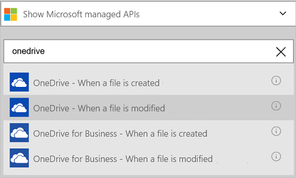
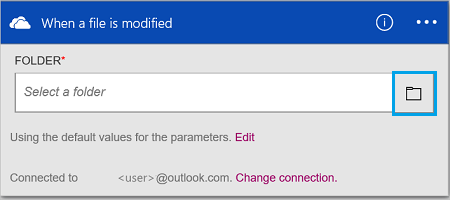
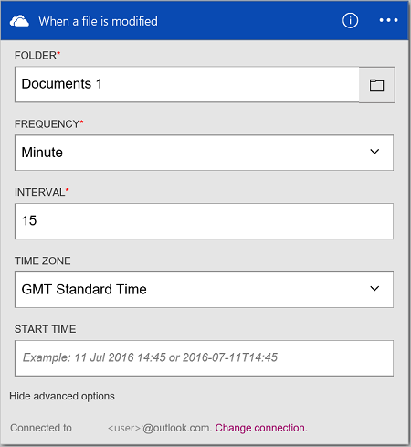
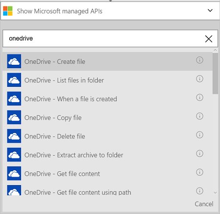
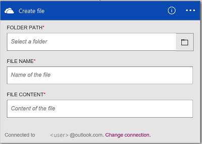
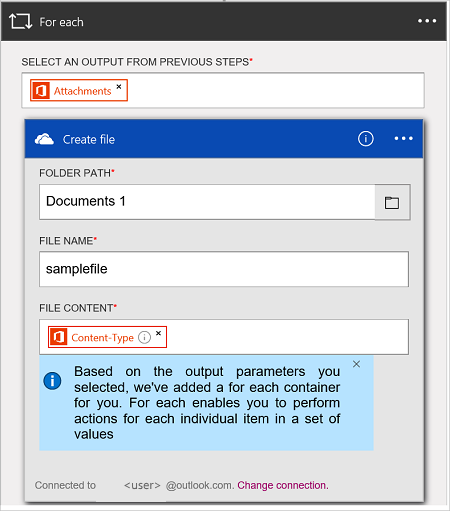

<properties
    pageTitle="Hinzufügen den OneDrive-Verbinder in Ihrer Apps Logik | Microsoft Azure"
    description="Übersicht über den OneDrive-Verbinder mit den Parametern REST-API"
    services="logic-apps"    
    documentationCenter=""     
    authors="MandiOhlinger"    
    manager="anneta"    
    editor=""
    tags="connectors"/>

<tags
   ms.service="logic-apps"
   ms.devlang="na"
   ms.topic="article"
   ms.tgt_pltfrm="na"
   ms.workload="integration"
   ms.date="10/18/2016"
   ms.author="mandia"/>

# Erste Schritte mit der OneDrive-Verbinder

Verbinden mit OneDrive zum Verwalten Ihrer Dateien, einschließlich hochladen, abrufen, Löschen von Dateien und vieles mehr. 

Mit OneDrive Sie: 

- Erstellen Sie den Workflow durch Speichern von Dateien in OneDrive, oder aktualisieren Sie vorhandene Dateien in OneDrive. 
- Verwenden Sie Trigger, um den Workflow zu starten, wenn eine Datei erstellt oder innerhalb Ihrer OneDrive aktualisiert.
- Verwenden von Aktionen zum Erstellen einer Datei, und löschen Sie eine Datei und vieles mehr. Beispielsweise, wenn ein neues Office 365-e-Mail mit einer Anlage (eines Triggers) eingeht, Erstellen einer neuen Datei in OneDrive (eine Aktion).

In diesem Thema wird gezeigt, wie Sie mit der OneDrive-Verbinder in einer app Logik sowie eine Auflistung der Trigger und Aktionen.

>[AZURE.NOTE] Diese Version des Artikels gilt Logik Apps allgemeine Verfügbarkeit (GA) aus. 

Weitere Informationen zu Logik Apps finden Sie unter [Was sind die Logik apps](../app-service-logic/app-service-logic-what-are-logic-apps.md) , und [Erstellen Sie eine app Logik](../app-service-logic/app-service-logic-create-a-logic-app.md).

## Verbinden mit OneDrive

Bevor Sie Ihre app Logik Dienste zugreifen kann, erstellen Sie zuerst eine *Verbindung* mit dem Dienst an. Eine Verbindung stellt eine Verbindung zwischen einer app Logik und einem anderen Dienst. Beispielsweise benötigen zum Verbinden mit OneDrive Sie zuerst eine OneDrive- *Verbindung*. Um eine Verbindung herzustellen, geben Sie die Anmeldeinformationen, die Sie normalerweise verwenden, den Zugriff auf Dienste, die Sie verbinden möchten. Geben Sie Ja, mit OneDrive, die Anmeldeinformationen bei Ihrem OneDrive-Konto, um die Verbindung zu erstellen.

### Herstellen der Verbindungs

>[AZURE.INCLUDE [Steps to create a connection to OneDrive](../../includes/connectors-create-api-onedrive.md)]

## Verwenden eines Triggers

Ein Trigger ist ein Ereignis, das zum Starten des Workflows in einer app Logik definiert verwendet werden kann. Trigger Umfrage"" Dienst unter zu einem Intervall und die gewünschte Häufigkeit. [Erfahren Sie mehr über Trigger](../app-service-logic/app-service-logic-what-are-logic-apps.md#logic-app-concepts).

1. Geben Sie in der app Logik "Onedrive" um eine Liste der Trigger zu erhalten:  

    

2. Wählen Sie aus, **Wenn eine Datei geändert wird**. Wenn Sie bereits eine Verbindung besteht, wählen Sie dann auf die Schaltfläche Datumsauswahl anzeigen, um einen anderen Ordner auswählen.

    

    Wenn Sie aufgefordert werden, melden Sie sich, geben Sie dann die Vorzeichen in Details, um die Verbindung zu erstellen. [Erstellen die Verbindung](connectors-create-api-onedrive.md#create-the-connection) in diesem Thema werden die Schritte aufgelistet. 

    > [AZURE.NOTE] In diesem Beispiel wird die app Logik Wenn Sie eine Datei in den Ordner, den Sie auswählen, aktualisiert wird ausgeführt. Wenn die Ergebnisse dieser Trigger anzeigen möchten, fügen Sie eine andere Aktion, die Ihnen eine e-Mail sendet. Fügen Sie beispielsweise die Office 365 Outlook *Senden einer e-Mail* -Aktion, die Sie e-Mails, wenn eine Datei aktualisiert wird. 

3. Wählen Sie die Schaltfläche **Bearbeiten** , und legen Sie die **Häufigkeit** und **Intervall** Werte. Angenommen, Sie bei Bedarf den Trigger auf Umfrage alle 15 Minuten, klicken Sie dann legen Sie die **Häufigkeit** auf **Minute**, und legen Sie das **Intervall** auf **15**. 

    

4. **Speichern** der Änderungen (oberen linken Ecke der Symbolleiste). Ihre app Logik wird gespeichert und automatisch aktiviert werden kann.

## Verwenden Sie eine Aktion

Eine Aktion ist ein Vorgang durchgeführten durch den Workflow in einer app Logik definiert. [Erfahren Sie mehr über Aktionen](../app-service-logic/app-service-logic-what-are-logic-apps.md#logic-app-concepts).

1. Wählen Sie das Pluszeichen (+) aus. Die Reihe von Optionen angezeigt: **Hinzufügen einer Aktion**, **Hinzufügen einer Bedingung**oder eine der **Weitere** Optionen.

    

2. Wählen Sie **eine Aktion hinzufügen**.

3. Geben Sie "Onedrive" in das Textfeld um eine Liste aller verfügbaren Aktionen zu erhalten.

     

4. Wählen Sie in diesem Beispiel **OneDrive - Datei zu erstellen**. Wenn bereits eine Verbindung besteht, dann wählen Sie den **Ordnerpfad** legen Sie die Datei, geben Sie den **Dateinamen ein**, und wählen Sie die **Datei Inhalt** werden sollen:  

    

    Wenn Sie für die Verbindungsinformationen aufgefordert werden, geben Sie dann die Details, um die Verbindung zu erstellen. [Erstellen Sie die Verbindung](connectors-create-api-onedrive.md#create-the-connection) in diesem Thema werden diese Eigenschaften beschrieben. 

    > [AZURE.NOTE] In diesem Beispiel erstellen wir eine neue Datei in einem Ordner OneDrive aus. Ausgabe von einem anderen Trigger können Sie um die OneDrive-Datei zu erstellen. Fügen Sie beispielsweise den Trigger Office 365 Outlook *beim Eintreffen einer neuen e-Mail-Nachricht* hinzu. Fügen Sie die OneDrive *Datei erstellen* Aktion, die Anlagen und Inhaltstyp verwendet, Felder innerhalb einer ForEach So erstellen Sie die neue Datei in OneDrive. 
    > 
    > 

5. **Speichern** der Änderungen (oberen linken Ecke der Symbolleiste). Ihre app Logik wird gespeichert und automatisch aktiviert werden kann.

## Technische Details

## Trigger

|Auslösen | Beschreibung|
|--- | ---|
|[Wenn eine Datei erstellt wird](connectors-create-api-onedrive.md#when-a-file-is-created)|Dieser Vorgang löst einen Fluss aus, wenn eine neue Datei in einem Ordner erstellt wird.|
|[Wenn eine Datei geändert wird.](connectors-create-api-onedrive.md#when-a-file-is-modified)|Dieser Vorgang löst einen Fluss aus, wenn eine Datei in einem Ordner geändert wird.|

## Aktionen

|Aktion|Beschreibung|
|--- | ---|
|[Abrufen von Dateimetadaten](connectors-create-api-onedrive.md#get-file-metadata)|Mit diesem Vorgang wird die Metadaten für eine Datei an.|
|[Update-Datei](connectors-create-api-onedrive.md#update-file)|Dieser Vorgang aktualisiert eine Datei an.|
|[Datei löschen](connectors-create-api-onedrive.md#delete-file)|Dieser Vorgang löscht eine Datei.|
|[Abrufen von Metadaten mit Pfad der Datei](connectors-create-api-onedrive.md#get-file-metadata-using-path)|Dieser Vorgang ruft die Metadaten einer Datei mit den Pfad ab.|
|[Abrufen von Dateiinhalt unter Verwendung der Pfad](connectors-create-api-onedrive.md#get-file-content-using-path)|Dieser Vorgang ruft den Inhalt einer Datei mit den Pfad ab.|
|[Abrufen der Inhalt der Datei](connectors-create-api-onedrive.md#get-file-content)|Mit diesem Vorgang wird den Inhalt einer Datei an.|
|[Datei erstellen](connectors-create-api-onedrive.md#create-file)|Dieser Vorgang erstellt eine Datei an.|
|[Kopieren einer Datei](connectors-create-api-onedrive.md#copy-file)|Dieser Vorgang kopiert eine Datei zu OneDrive.|
|[Der Listendateien im Ordner](connectors-create-api-onedrive.md#list-files-in-folder)|Mit diesem Vorgang wird die Liste der Dateien und Unterordner in einem Ordner.|
|[Der Listendateien im Stammordner](connectors-create-api-onedrive.md#list-files-in-root-folder)|Mit diesem Vorgang wird die Liste der Dateien und Unterordner im Stammordner.|
|[Extrahieren Archiv in Ordner](connectors-create-api-onedrive.md#extract-archive-to-folder)|Dieser Vorgang extrahiert eine Archivdatei in einem anderen Ordner (Beispiel: ZIP).|

### Aktionsdetails

In diesem Abschnitt finden Sie unter der bestimmte Details zu jeder Aktion, einschließlich alle erforderlichen oder optionalen von Eigenschaften und eine entsprechende Ausgabe der Verbinder zugeordnet.

#### Abrufen von Dateimetadaten
Mit diesem Vorgang wird die Metadaten für eine Datei an. 

|Eigenschaftsname| Anzeigename|Beschreibung|
| ---|---|---|
|ID *|Datei|Wählen Sie eine Datei|

Ein Sternchen (*) bedeutet, dass die Eigenschaft erforderlich ist.

##### Die Ausgabedetails
BlobMetadata

| Eigenschaftsname | Datentyp |
|---|---|
|ID|Zeichenfolge|
|Namen|Zeichenfolge|
|DisplayName|Zeichenfolge|
|Pfad|Zeichenfolge|
|LastModified|Zeichenfolge|
|Größe|ganze Zahl|
|MediaType|Zeichenfolge|
|IsFolder|Boolesch|
|ETag|Zeichenfolge|
|FileLocator|Zeichenfolge|

#### Update-Datei
Dieser Vorgang aktualisiert eine Datei an. 

|Eigenschaftsname| Anzeigename|Beschreibung|
| ---|---|---|
|ID *|Datei|Wählen Sie eine Datei|
|Textkörper *|Der Inhalt der Datei|Inhalt der Datei|

Ein Sternchen (*) bedeutet, dass die Eigenschaft erforderlich ist.

##### Die Ausgabedetails
BlobMetadata

| Eigenschaftsname | Datentyp |
|---|---|
|ID|Zeichenfolge|
|Namen|Zeichenfolge|
|DisplayName|Zeichenfolge|
|Pfad|Zeichenfolge|
|LastModified|Zeichenfolge|
|Größe|ganze Zahl|
|MediaType|Zeichenfolge|
|IsFolder|Boolesch|
|ETag|Zeichenfolge|
|FileLocator|Zeichenfolge|

#### Datei löschen
Dieser Vorgang löscht eine Datei. 

|Eigenschaftsname| Anzeigename|Beschreibung|
| ---|---|---|
|ID *|Datei|Wählen Sie eine Datei|

Ein Sternchen (*) bedeutet, dass die Eigenschaft erforderlich ist.

##### Die Ausgabedetails
Keine.

#### Abrufen von Metadaten mit Pfad der Datei
Dieser Vorgang ruft die Metadaten einer Datei mit den Pfad ab. 

|Eigenschaftsname| Anzeigename|Beschreibung|
| ---|---|---|
|Pfad *|Dateipfad|Wählen Sie eine Datei|

Ein Sternchen (*) bedeutet, dass die Eigenschaft erforderlich ist.

##### Die Ausgabedetails
BlobMetadata

| Eigenschaftsname | Datentyp |
|---|---|
|ID|Zeichenfolge|
|Namen|Zeichenfolge|
|DisplayName|Zeichenfolge|
|Pfad|Zeichenfolge|
|LastModified|Zeichenfolge|
|Größe|ganze Zahl|
|MediaType|Zeichenfolge|
|IsFolder|Boolesch|
|ETag|Zeichenfolge|
|FileLocator|Zeichenfolge|

#### Abrufen von Dateiinhalt unter Verwendung der Pfad
Dieser Vorgang ruft den Inhalt einer Datei mit den Pfad ab. 

|Eigenschaftsname| Anzeigename|Beschreibung|
| ---|---|---|
|Pfad *|Dateipfad|Wählen Sie eine Datei|

Ein Sternchen (*) bedeutet, dass die Eigenschaft erforderlich ist.

##### Die Ausgabedetails
Keine.

#### Abrufen der Inhalt der Datei
Mit diesem Vorgang wird den Inhalt einer Datei an. 

|Eigenschaftsname| Anzeigename|Beschreibung|
| ---|---|---|
|ID *|Datei|Wählen Sie eine Datei|

Ein Sternchen (*) bedeutet, dass die Eigenschaft erforderlich ist.

##### Die Ausgabedetails
Keine.

#### Datei erstellen
Dieser Vorgang erstellt eine Datei an. 

|Eigenschaftsname| Anzeigename|Beschreibung|
| ---|---|---|
|Ordnerpfad *|Ordnerpfad|Wählen Sie einen Ordner aus.|
|Namen *|Dateiname|Name der Datei|
|Textkörper *|Der Inhalt der Datei|Inhalt der Datei|

Ein Sternchen (*) bedeutet, dass die Eigenschaft erforderlich ist.

##### Die Ausgabedetails
BlobMetadata

| Eigenschaftsname | Datentyp |
|---|---|
|ID|Zeichenfolge|
|Namen|Zeichenfolge|
|DisplayName|Zeichenfolge|
|Pfad|Zeichenfolge|
|LastModified|Zeichenfolge|
|Größe|ganze Zahl|
|MediaType|Zeichenfolge|
|IsFolder|Boolesch|
|ETag|Zeichenfolge|
|FileLocator|Zeichenfolge|

#### Kopieren einer Datei
Dieser Vorgang kopiert eine Datei zu OneDrive. 

|Eigenschaftsname| Anzeigename|Beschreibung|
| ---|---|---|
|Quelle *|Url der Quelle|URL-Quelldatei|
|Ziel *|Zieldateipfad|Zieldateipfad, einschließlich Zieldateiname|
|Überschreiben|Überschreiben?|Überschreibt die Zieldatei aus, wenn auf "True" gesetzt|

Ein Sternchen (*) bedeutet, dass die Eigenschaft erforderlich ist.

##### Die Ausgabedetails
BlobMetadata

| Eigenschaftsname | Datentyp |
|---|---|
|ID|Zeichenfolge|
|Namen|Zeichenfolge|
|DisplayName|Zeichenfolge|
|Pfad|Zeichenfolge|
|LastModified|Zeichenfolge|
|Größe|ganze Zahl|
|MediaType|Zeichenfolge|
|IsFolder|Boolesch|
|ETag|Zeichenfolge|
|FileLocator|Zeichenfolge|

#### Wenn eine Datei erstellt wird
Dieser Vorgang löst einen Fluss aus, wenn eine neue Datei in einem Ordner erstellt wird. 

|Eigenschaftsname| Anzeigename|Beschreibung|
| ---|---|---|
|Ordner ID *|Ordner|Wählen Sie einen Ordner aus.|

Ein Sternchen (*) bedeutet, dass die Eigenschaft erforderlich ist.

##### Die Ausgabedetails
Keine.

#### Wenn eine Datei geändert wird.
Dieser Vorgang löst einen Fluss aus, wenn eine Datei in einem Ordner geändert wird. 

|Eigenschaftsname| Anzeigename|Beschreibung|
| ---|---|---|
|Ordner ID *|Ordner|Wählen Sie einen Ordner aus.|

Ein Sternchen (*) bedeutet, dass die Eigenschaft erforderlich ist.

##### Die Ausgabedetails
Keine.

#### Der Listendateien im Ordner
Mit diesem Vorgang wird die Liste der Dateien und Unterordner in einem Ordner.

|Eigenschaftsname| Anzeigename|Beschreibung|
| ---|---|---|
|ID *|Ordner|Wählen Sie einen Ordner aus.|

Ein Sternchen (*) bedeutet, dass die Eigenschaft erforderlich ist.

##### Die Ausgabedetails
BlobMetadata

| Eigenschaftsname | Datentyp |
|---|---|
|ID|Zeichenfolge|
|Namen|Zeichenfolge|
|DisplayName|Zeichenfolge|
|Pfad|Zeichenfolge|
|LastModified|Zeichenfolge|
|Größe|ganze Zahl|
|MediaType|Zeichenfolge||
|IsFolder|Boolesch|
|ETag|Zeichenfolge|
|FileLocator|Zeichenfolge|

#### Der Listendateien im Stammordner
Mit diesem Vorgang wird die Liste der Dateien und Unterordner im Stammordner. 

Es gibt keine Parameter für diesen Anruf.

##### Die Ausgabedetails
BlobMetadata

| Eigenschaftsname | Datentyp |
|---|---|
|ID|Zeichenfolge|
|Namen|Zeichenfolge|
|DisplayName|Zeichenfolge|
|Pfad|Zeichenfolge|
|LastModified|Zeichenfolge|
|Größe|ganze Zahl|
|MediaType|Zeichenfolge|
|IsFolder|Boolesch|
|ETag|Zeichenfolge|
|FileLocator|Zeichenfolge|

#### Extrahieren Archiv in Ordner
Dieser Vorgang extrahiert eine Archivdatei in einem anderen Ordner (Beispiel: ZIP). 

|Eigenschaftsname| Anzeigename|Beschreibung|
| ---|---|---|
|Quelle *|Der Pfad der Archivdatei Quelle|Pfad der Archivdatei|
|Ziel *|Zielordnerpfad|Pfad zum Extrahieren des Inhalts Archiv|
|Überschreiben|Überschreiben?|Überschreibt die Zieldateien, wenn auf "True" gesetzt|

Ein Sternchen (*) bedeutet, dass die Eigenschaft erforderlich ist.

##### Die Ausgabedetails
BlobMetadata

| Eigenschaftsname | Datentyp |
|---|---|
|ID|Zeichenfolge|
|Namen|Zeichenfolge|
|DisplayName|Zeichenfolge|
|Pfad|Zeichenfolge|
|LastModified|Zeichenfolge|
|Größe|ganze Zahl|
|MediaType|Zeichenfolge|
|IsFolder|Boolesch|
|ETag|Zeichenfolge|
|FileLocator|Zeichenfolge|

## HTTP-Antworten

In der folgenden Tabelle werden die Antworten auf die Aktionen und Trigger und die Beschreibungen Antwort:  

|Namen|Beschreibung|
|---|---|
|200|Okay|
|202|Akzeptiert|
|400|Ungültige Anforderung|
|401|Nicht autorisierte|
|403|Verboten|
|404|Nicht gefunden|
|500|Interner Serverfehler. Unbekannter Fehler aufgetreten ist.|
|Standard|Fehler bei Vorgang.|

## Nächste Schritte

[Erstellen einer app Logik](../app-service-logic/app-service-logic-create-a-logic-app.md). Untersuchen der verfügbaren Connectors in Logik Apps auf unserer [APIs Liste](apis-list.md)an.
