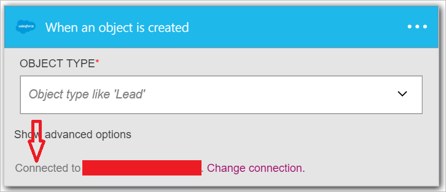

<properties
pageTitle="SMTP | Microsoft Azure"
description="Erstellen Sie Logik apps mit Azure-App-Dienst an. Verbinden Sie mit SMTP-e-Mail senden."
services="logic-apps"   
documentationCenter=".net,nodejs,java"  
authors="msftman"   
manager="erikre"    
editor=""
tags="connectors" />

<tags
ms.service="app-service-logic"
ms.devlang="multiple"
ms.topic="article"
ms.tgt_pltfrm="na"
ms.workload="integration"
ms.date="07/15/2016"
ms.author="deonhe"/>

# Erste Schritte mit der SMTP-connector

Verbinden Sie mit SMTP-e-Mail senden.

Um [alle Verbinder](./apis-list.md)verwenden zu können, müssen Sie zuerst eine app Logik zu erstellen. Sie können durch [Erstellen einer Logik app jetzt](../app-service-logic/app-service-logic-create-a-logic-app.md)loslegen.

## Verbinden mit SMTP

Bevor Sie Ihre app Logik Dienste zugreifen kann, müssen Sie zuerst eine *Verbindung* mit dem Dienst erstellen. Eine [Verbindung](./connectors-overview.md) stellt eine Verbindung zwischen einer app Logik und einem anderen Dienst. Beispielsweise benötigen Verbinden mit SMTP Sie zuerst eine SMTP- *Verbindung*. Um eine Verbindung herzustellen, müssen Sie die Anmeldeinformationen ein, die Sie normalerweise verwenden, den Zugriff auf Dienste, die Sie verbinden möchten. Ja, im Beispiel SMTP finden Sie die Anmeldeinformationen ein, die Ihre Verbindungsname, Adresse SMTP-Servers und Benutzeranmeldeinformationen müssten Sie akzeptieren, um die Verbindung zu SMTP erstellen. [Weitere Informationen zu Verbindungen]()  

### Herstellen einer Verbindung mit SMTP

>[AZURE.INCLUDE [Steps to create a connection to SMTP](../../includes/connectors-create-api-smtp.md)]

## Verwenden eines Triggers SMTP

Ein Trigger ist ein Ereignis, das zum Starten des Workflows in einer app Logik definiert verwendet werden kann. [Erfahren Sie mehr über Trigger](../app-service-logic/app-service-logic-what-are-logic-apps.md#logic-app-concepts).

In diesem Beispiel da SMTP kein Triggers eigene, wird den Trigger **Vertrieb - beim Erstellen ein Objekts** verwendet. Beim Erstellen ein neues Objekts in Vertrieb, wird dieser Trigger aktivieren. Für Beispiel können wir es so eingerichtet, dass jedes Mal ein neuer Lead in Vertrieb erstellt wird, eine Aktion *e-Mails* über den SMTP-Connector mit eine Benachrichtigung über den neuen Lead erstellt wird ausgeführt wird.

1. Geben Sie *Vertrieb* in das Suchfeld ein, auf dem Logik apps-Designer, und wählen Sie den Trigger **Vertrieb – Wenn Sie ein Objekt erstellt wird** .  
   

2. Das Steuerelement **beim Erstellen ein Objekts** wird angezeigt.
   

3. Wählen Sie den **Objekttyp** , und klicken Sie dann in der Liste der Objekte markieren Sie *führen* . In diesem Schritt bestätigen Sie, dass Sie einen Trigger erstellen, der Ihre app Logik benachrichtigen wird, wenn ein neuer Lead in Vertrieb erstellt wird.  
   

4. Der Trigger wurde erstellt.  
   

## Verwenden Sie eine SMTP-Aktion

Eine Aktion ist ein Vorgang durchgeführten durch den Workflow in einer app Logik definiert. [Erfahren Sie mehr über Aktionen](../app-service-logic/app-service-logic-what-are-logic-apps.md#logic-app-concepts).

Jetzt, da der Trigger hinzugefügt wurde, folgendermaßen Sie vor, um eine Aktion SMTP hinzuzufügen, die beim Erstellen ein neues Leads in Vertrieb stattfindet.

1. Wählen Sie **+ neuen Schritt** zum Hinzufügen von der Aktion, die Sie beim Erstellen ein neues Leads ausführen möchten.  
   

2. Wählen Sie **eine Aktion hinzufügen**. Dieses wird geöffnet, die im Suchfeld, in dem Sie für jede Aktion suchen können, ausführen möchten.  
   

3. Geben Sie *smtp* zu suchenden Aktionen im Zusammenhang mit SMTP.  

4. Wählen Sie als die Aktion, die beim Erstellen der neue Lead **SMTP - E-Mail senden** aus. Die Aktion Steuerelement blockieren wird geöffnet. Sie haben die SMTP-Verbindung in der Designer-Block herstellen, wenn Sie nicht bereits getan haben.  
     

5. Geben Sie Ihre gewünschte e-Mail-Informationen im Block **SMTP - E-Mail senden** .  
   

6. Speichern Sie Ihre Arbeit, um den Workflow zu aktivieren.  

## Technische details

Hier sind die Details der Trigger, Aktionen und Antworten, die diese Verbindung unterstützt:

## SMTP-Triggern

SMTP hat keine Trigger. 

## SMTP-Aktionen

SMTP besteht die folgende Aktion aus:

|Aktion|Beschreibung|
|--- | ---|
|[Senden von E-Mails](connectors-create-api-smtp.md#send-email)|Dieser Vorgang sendet eine e-Mail-Nachricht an einen oder mehrere Empfänger.|

### Aktionsdetails

Hier sind die Details für die Aktion dieser Verbinders, zusammen mit den zugehörigen Antworten:

### Senden von E-Mails
Dieser Vorgang sendet eine e-Mail-Nachricht an einen oder mehrere Empfänger. 

|Eigenschaftsname| Anzeigename|Beschreibung|
| ---|---|---|
|An|An|Geben Sie die e-Mail-Adressen durch Semikolons getrennt, wierecipient1@domain.com;recipient2@domain.com|
|CC|cc|Geben Sie die e-Mail-Adressen durch Semikolons getrennt, wierecipient1@domain.com;recipient2@domain.com|
|Betreff|Betreff|E-Mail-Betreff|
|Textkörper|Textkörper|E-Mail-Text|
|Von|Von|E-Mail-Adresse des Absenders wiesender@domain.com|
|IsHtml|HTML-Code|Senden Sie die e-Mail im HTML-Format (wahr/falsch)|
|"Bcc"|"Bcc"|Geben Sie die e-Mail-Adressen durch Semikolons getrennt, wierecipient1@domain.com;recipient2@domain.com|
|Wichtigkeit: hoch|Wichtigkeit: hoch|Bedeutung der e-Mail (hoch, Normal oder niedrig)|
|ContentData|Anlagen von Daten|Inhalte Daten (base64 codierte für Streams und als-Zeichenfolge ist)|
|ContentType|Inhaltstyp Anlagen|Inhaltstyp|
|ContentTransferEncoding|Anlagen Content Transfer Codierung|Inhalt übertragen Codierung (base64 oder keiner)|
|Dateiname|Anlagen-Dateiname|Dateiname|
|ContentId|Anlagen Inhalts-ID|Inhalts-id|

Ein * zeigt an, dass eine Eigenschaft erforderlich ist

## HTTP-Antworten

Eine oder mehrere der folgenden HTTP Statuscodes können die Aktionen und Trigger oben zurückgegeben werden: 

|Namen|Beschreibung|
|---|---|
|200|Okay|
|202|Akzeptiert|
|400|Ungültige Anforderung|
|401|Nicht autorisierte|
|403|Verboten|
|404|Nicht gefunden|
|500|Interner Serverfehler. Es ist ein Fehler aufgetreten.|
|Standard|Fehler bei Vorgang.|

## Nächste Schritte
[Erstellen Sie eine app Logik](../app-service-logic/app-service-logic-create-a-logic-app.md)