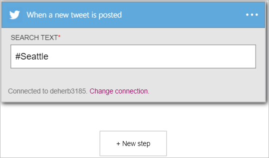

<properties
    pageTitle="Informationen zum Verwenden des Verbinders Twitter in Logik apps | Microsoft Azure"
    description="Übersicht über Twitter-Verbinder mit den Parametern REST-API"
    services=""
    documentationCenter="" 
    authors="msftman"
    manager="erikre"
    editor=""
    tags="connectors"/>

<tags
   ms.service="multiple"
   ms.devlang="na"
   ms.topic="article"
   ms.tgt_pltfrm="na"
   ms.workload="na" 
   ms.date="07/18/2016"
   ms.author="deonhe"/>

# Erste Schritte mit der Twitter-Verbinder

Mit der Twitter-Verbinder können Sie folgende Aktionen ausführen:

- Beitrag Tweets und Get tweets
- Access Zeitachsen, Freunde und gefolgten Personen
- Führen Sie einen der anderen Aktionen und Trigger nachfolgend beschriebenen  

Um [alle Verbinder](./apis-list.md)verwenden zu können, müssen Sie zuerst eine app Logik zu erstellen. Sie können durch [Erstellen einer Logik app jetzt](../app-service-logic/app-service-logic-create-a-logic-app.md)loslegen.  

## Verbinden mit Twitter

Bevor Sie Ihre app Logik Dienste zugreifen kann, müssen Sie zuerst eine *Verbindung* mit dem Dienst erstellen. Eine [Verbindung](./connectors-overview.md) stellt eine Verbindung zwischen einer app Logik und einem anderen Dienst.  

### Herstellen einer Verbindung mit Twitter

>[AZURE.INCLUDE [Steps to create a connection to Twitter](../../includes/connectors-create-api-twitter.md)]

## Verwenden eines Triggers Twitter

Ein Trigger ist ein Ereignis, das zum Starten des Workflows in einer app Logik definiert verwendet werden kann. [Erfahren Sie mehr über Trigger](../app-service-logic/app-service-logic-what-are-logic-apps.md#logic-app-concepts).

In diesem Beispiel wird aufgezeigt, wie Sie mithilfe den Trigger **Wenn ein neuer Tweet gebucht wird** #Seattle suchen, und wenn #Seattle gefunden wird, aktualisieren eine Datei im Dropbox durch den Text aus der Tweet. In ein Enterprise-Beispiel könnten Sie für den Namen Ihres Unternehmens suchen und aktualisieren eine SQL-Datenbank mit dem Text aus der Tweet.

1. Klicken Sie auf den Logik apps-Designer in das Suchfeld Geben Sie *twitter ein-* und wählen Sie dann den Trigger **Twitter - Wenn ein neuer Tweet gebucht wird**   
  
- Geben Sie den **Zu suchenden Text** -Steuerelement *#Seattle*  
 

An diesem Punkt wurde die app Logik zu einem Trigger konfiguriert, die in eine Abfolge von anderen Trigger und Aktionen in dem Workflow begonnen wird. 

>[AZURE.NOTE]Für eine app Logik funktioniert muss es mindestens ein Trigger und eine Aktion enthalten. Führen Sie die Schritte im nächsten Abschnitt, um eine Aktion hinzuzufügen.  

## Hinzufügen einer bedingungs
Da wir nur von Benutzern mit mehr als 50 Benutzern Tweets interessiert sind, muss eine Bedingung, die die Anzahl der Followers bestätigt zunächst mit der Logik hinzugefügt werden.  

1. Wählen Sie **+ neuen Schritt** zum Hinzufügen von der Aktion, die Sie berücksichtigen, wenn Sie in einer neuen Tweet #Seattle gefunden wird möchten  
  
- Wählen Sie den Link zum **Hinzufügen einer Bedingung** aus.  
   
Daraufhin wird das **Bedingung** -Steuerelement, Sie Bedingungen wie *ist gleich prüfen können*, *ist kleiner als*, *ist größer als*, *enthält*usw..  
   
- Wählen Sie das Steuerelement **auswählen einen Wert** aus.  
In diesem Steuerelement können Sie auswählen eine oder mehrere der Eigenschaften von einem beliebigen zuvor ausgeführten Aktionen oder Trigger als Wert, dessen Bedingung ausgewertet wird, als WAHR oder falsch.
   
- Wählen Sie die **...** , um die Liste der Eigenschaften zu erweitern, sodass Sie alle Eigenschaften sehen können, die verfügbar sind.        
   
- Wählen Sie die Eigenschaft **Followers zählen** .    
   
- Beachten Sie die Count-Eigenschaft Followers jetzt im Steuerelement Wert ist.    
   
- Wählen Sie aus der Liste Operatoren **größer ist** .    
   
- Geben Sie 50 als Operand für den Operator *ist größer als* ein.  
Die Bedingung wird jetzt hinzugefügt. Speichern Sie Ihre Arbeit, die über den Link **Speichern** auf das Menü oben ein.    
   

## Verwenden Sie eine Aktion Twitter

Eine Aktion ist ein Vorgang durchgeführten durch den Workflow in einer app Logik definiert. [Erfahren Sie mehr über Aktionen](../app-service-logic/app-service-logic-what-are-logic-apps.md#logic-app-concepts).  

Jetzt, da Sie einen Trigger hinzugefügt haben, folgendermaßen Sie vor, um eine Aktion hinzuzufügen, die einen neuen Tweet mit dem Inhalt der vom Trigger gefunden Tweets gebucht werden sollen. Im Hinblick auf diese exemplarische Vorgehensweise werden nur Tweets von Benutzern mit mehr als 50 Followers veröffentlicht werden.  

Im nächsten Schritt fügen Sie eine Twitter-Aktion, die gebucht werden sollen, einen Tweet mithilfe einiger der Eigenschaften eines einzelnen Tweet, die von einem Benutzer bereitgestellt wurde, mehr als 50 Followers hat.  

1. Wählen Sie **eine Aktion hinzufügen**. Daraufhin wird das Search-Steuerelement, in dem Sie für andere Aktionen und Trigger suchen können.  
   
- Geben Sie in das Suchfeld *twitter* und wählen Sie dann die Aktion **Twitter - Beitrag einen Tweet** . Daraufhin wird das **Beitrag einen Tweet** -Steuerelement, in dem Sie alle Details für die Tweet übermittelt eingeben.      
   
- Wählen Sie das Steuerelement **Tweet** . Alle Ausgaben aus zuvor ausgeführten Aktionen und Trigger in der app Logik werden nun angezeigt. Sie können wählen Sie eine der folgenden und als Teil des Texts Tweet, der die neue Tweet verwenden.     
   
- Wählen Sie **Benutzername**   
- Geben Sie *besagt:* Tweet Textfeld-Steuerelement. Aktion nur nach dem Benutzernamen ein.  
- Wählen Sie *Tweet Text*ein.       
   
- Speichern Sie Ihre Arbeit, und senden Sie einen Tweet mit den #Seattle hashtags, den Workflow zu aktivieren.  

## Technische Details

Hier sind die Details der Trigger, Aktionen und Antworten, die diese Verbindung unterstützt:

## Twitter-Triggern

Der Verbinder Twitter besteht aus die folgenden Triggern:  

|Auslösen | Beschreibung|
|--- | ---|
|[Wenn ein neuer Tweet gebucht wird](connectors-create-api-twitter.md#when-a-new-tweet-is-posted)|Dieser Vorgang löst einen Fluss, wenn ein neuer Tweet, der eine angegebenen Suchabfrage entspricht gebucht wird.|

## Twitter-Aktionen

Der Verbinder Twitter weist die folgenden Aktionen aus:

|Aktion|Beschreibung|
|--- | ---|
|[Abrufen von Benutzer-Zeitachse](connectors-create-api-twitter.md#get-user-timeline)|Mit diesem Vorgang wird eine Liste der zuletzt Tweets von einem bestimmten Benutzer bereitgestellt wurde.|
|[Erste Start Zeitachse](connectors-create-api-twitter.md#get-home-timeline)|Mit diesem Vorgang wird die letzte Tweets und erneut tweets von mich und Meine gefolgten Personen bereitgestellt wurde.|
|[Tweets suchen](connectors-create-api-twitter.md#search-tweets)|Mit diesem Vorgang wird eine Liste der relevanten Tweets mit der Suchabfrage übereinstimmen.|
|[Abrufen von followers](connectors-create-api-twitter.md#get-followers)|Mit diesem Vorgang wird die Liste der Benutzer, die einen bestimmten Benutzer folgen.|
|[Meine Followers abrufen](connectors-create-api-twitter.md#get-my-followers)|Mit diesem Vorgang wird die Liste der Benutzer, die mir folgen.|
|[Abrufen von folgen](connectors-create-api-twitter.md#get-following)|Der Vorgang ruft die Liste der Personen zu der angegebenen Benutzer folgt.|
|[Meine folgenden abrufen](connectors-create-api-twitter.md#get-my-following)|Mit diesem Vorgang wird die Liste der Benutzer, die ich Folge.|
|[Benutzer erhalten](connectors-create-api-twitter.md#get-user)|Mit diesem Vorgang wird die Profildetails für einen bestimmten Benutzer, wie z. B. Benutzernamen, zählen Followers, Beschreibung und mehr.|
|[Veröffentlichen Sie einen tweet](connectors-create-api-twitter.md#post-a-tweet)|Dieser Vorgang Beiträge einen neuen Tweet.|
## Aktionsdetails

Hier sind die Details für die Aktionen und Trigger für diesen Connector, zusammen mit ihren Antworten:

### Abrufen von Benutzer-Zeitachse
Mit diesem Vorgang wird eine Liste der zuletzt Tweets von einem bestimmten Benutzer bereitgestellt wurde. 

|Eigenschaftsname| Anzeigename|Beschreibung|
| ---|---|---|
|Benutzername *|Benutzername|Twitter-Handle für den Benutzer|
|maxResults|Maximale Ergebnisse|Maximale Anzahl der zurückzugebenden tweets|

Ein * zeigt an, dass eine Eigenschaft erforderlich ist

#### Die Ausgabedetails

TweetModel: Darstellung Tweet-Objekts

| Eigenschaftsname | Datentyp | Beschreibung |
|---|---|---|
|TweetText|Zeichenfolge|Textinhalt der Tweet|
|TweetId|Zeichenfolge|Die Tweet-ID|
|CreatedAt|Zeichenfolge|Uhrzeit, an dem die Tweet veröffentlicht wurde|
|RetweetCount|ganze Zahl|Gesamtzahl der erneut tweets für die tweet|
|TweetedBy|Zeichenfolge|Name des Benutzers, dem die Tweet gebucht sind|
|MediaUrls|Matrix|URL der Medien zusammen mit den Tweet gebucht|
|TweetLanguageCode|Zeichenfolge|Sprachcode, der die tweet|
|TweetInReplyToUserId|Zeichenfolge|Benutzer-Id des Autors der Tweet, die das aktuelle Tweet ist eine Antwort auf|
|Favorisierte|Boolesch|Gibt an, ob die Tweet als favorisierte markiert ist|
|UserMentions|Matrix|Liste der Benutzer in der Tweet angegeben ist|
|OriginalTweet|nicht definiert|Ursprüngliche Tweet, aus denen das aktuelle Tweet erneut tweeted ist|
|UserDetails|nicht definiert|Details des Benutzers, dem tweeted|

### Erste Start Zeitachse
Mit diesem Vorgang wird die letzte Tweets und erneut tweets von mich und Meine gefolgten Personen bereitgestellt wurde. 

|Eigenschaftsname| Anzeigename|Beschreibung|
| ---|---|---|
|maxResults|Maximale Ergebnisse|Maximale Anzahl der zurückzugebenden tweets|

Ein * zeigt an, dass eine Eigenschaft erforderlich ist

#### Die Ausgabedetails

TweetModel: Darstellung Tweet-Objekts

| Eigenschaftsname | Datentyp | Beschreibung |
|---|---|---|
|TweetText|Zeichenfolge|Textinhalt der Tweet|
|TweetId|Zeichenfolge|Die Tweet-ID|
|CreatedAt|Zeichenfolge|Uhrzeit, an dem die Tweet veröffentlicht wurde|
|RetweetCount|ganze Zahl|Gesamtzahl der erneut tweets für die tweet|
|TweetedBy|Zeichenfolge|Name des Benutzers, dem die Tweet gebucht sind|
|MediaUrls|Matrix|URL der Medien zusammen mit den Tweet gebucht|
|TweetLanguageCode|Zeichenfolge|Sprachcode, der die tweet|
|TweetInReplyToUserId|Zeichenfolge|Benutzer-Id des Autors der Tweet, die das aktuelle Tweet ist eine Antwort auf|
|Favorisierte|Boolesch|Gibt an, ob die Tweet als favorisierte markiert ist|
|UserMentions|Matrix|Liste der Benutzer in der Tweet angegeben ist|
|OriginalTweet|nicht definiert|Ursprüngliche Tweet, aus denen das aktuelle Tweet erneut tweeted ist|
|UserDetails|nicht definiert|Details des Benutzers, dem tweeted|

### Tweets suchen
Mit diesem Vorgang wird eine Liste der relevanten Tweets mit der Suchabfrage übereinstimmen. 

|Eigenschaftsname| Anzeigename|Beschreibung|
| ---|---|---|
|SearchQuery *|Von Suchtext|Suchbegriff wie "Happy Hour", #haiku, oder Hass ist Spitze|
|maxResults|Maximale Ergebnisse|Maximale Anzahl der zurückzugebenden tweets|

Ein * zeigt an, dass eine Eigenschaft erforderlich ist

#### Die Ausgabedetails

TweetModel: Darstellung Tweet-Objekts

| Eigenschaftsname | Datentyp | Beschreibung |
|---|---|---|
|TweetText|Zeichenfolge|Textinhalt der Tweet|
|TweetId|Zeichenfolge|Die Tweet-ID|
|CreatedAt|Zeichenfolge|Uhrzeit, an dem die Tweet veröffentlicht wurde|
|RetweetCount|ganze Zahl|Gesamtzahl der erneut tweets für die tweet|
|TweetedBy|Zeichenfolge|Name des Benutzers, dem die Tweet gebucht sind|
|MediaUrls|Matrix|URL der Medien zusammen mit den Tweet gebucht|
|TweetLanguageCode|Zeichenfolge|Sprachcode, der die tweet|
|TweetInReplyToUserId|Zeichenfolge|Benutzer-Id des Autors der Tweet, die das aktuelle Tweet ist eine Antwort auf|
|Favorisierte|Boolesch|Gibt an, ob die Tweet als favorisierte markiert ist|
|UserMentions|Matrix|Liste der Benutzer in der Tweet angegeben ist|
|OriginalTweet|nicht definiert|Ursprüngliche Tweet, aus denen das aktuelle Tweet erneut tweeted ist|
|UserDetails|nicht definiert|Details des Benutzers, dem tweeted|

### Abrufen von followers
Mit diesem Vorgang wird die Liste der Benutzer, die einen bestimmten Benutzer folgen. 

|Eigenschaftsname| Anzeigename|Beschreibung|
| ---|---|---|
|Benutzername *|Benutzername|Twitter-Handle für den Benutzer|
|maxResults|Maximale Ergebnisse|Maximale Anzahl der zurückzugebenden Benutzer|

Ein * zeigt an, dass eine Eigenschaft erforderlich ist

#### Die Ausgabedetails

UserDetailsModel: Twitter-Benutzerdetails

| Eigenschaftsname | Datentyp | Beschreibung |
|---|---|---|
|FullName|Zeichenfolge|Name des Benutzers|
|Speicherort|Zeichenfolge|Position des Benutzers|
|ID|ganze Zahl|Twitter-Id des Benutzers|
|Benutzername|Zeichenfolge|Bildschirm Name des Benutzers|
|FollowersCount|ganze Zahl|Anzahl der followers|
|Beschreibung|Zeichenfolge|Beschreibung der Benutzer|
|StatusesCount|ganze Zahl|Anzahl Benutzer ' Status '|
|FriendsCount|ganze Zahl|Anzahl von Freunden|
|FavouritesCount|ganze Zahl|Anzahl der Tweets, dass der Benutzer favorisierte verfügt|
|ProfileImageUrl|Zeichenfolge|Die URL des Bilds Profil|

### Meine Followers abrufen
Mit diesem Vorgang wird die Liste der Benutzer, die mir folgen. 

|Eigenschaftsname| Anzeigename|Beschreibung|
| ---|---|---|
|maxResults|Maximale Ergebnisse|Maximale Anzahl von Benutzern zu erhalten|

Ein * zeigt an, dass eine Eigenschaft erforderlich ist

#### Die Ausgabedetails

UserDetailsModel: Twitter-Benutzerdetails

| Eigenschaftsname | Datentyp | Beschreibung |
|---|---|---|
|FullName|Zeichenfolge|Name des Benutzers|
|Speicherort|Zeichenfolge|Position des Benutzers|
|ID|ganze Zahl|Twitter-Id des Benutzers|
|Benutzername|Zeichenfolge|Bildschirm Name des Benutzers|
|FollowersCount|ganze Zahl|Anzahl der followers|
|Beschreibung|Zeichenfolge|Beschreibung der Benutzer|
|StatusesCount|ganze Zahl|Anzahl Benutzer ' Status '|
|FriendsCount|ganze Zahl|Anzahl von Freunden|
|FavouritesCount|ganze Zahl|Anzahl der Tweets, dass der Benutzer favorisierte verfügt|
|ProfileImageUrl|Zeichenfolge|Die URL des Bilds Profil|

### Abrufen von folgen
Der Vorgang ruft die Liste der Personen zu der angegebenen Benutzer folgt. 

|Eigenschaftsname| Anzeigename|Beschreibung|
| ---|---|---|
|Benutzername *|Benutzername|Twitter-Handle für den Benutzer|
|maxResults|Maximale Ergebnisse|Maximale Anzahl der zurückzugebenden Benutzer|

Ein * zeigt an, dass eine Eigenschaft erforderlich ist

#### Die Ausgabedetails

UserDetailsModel: Twitter-Benutzerdetails

| Eigenschaftsname | Datentyp | Beschreibung |
|---|---|---|
|FullName|Zeichenfolge|Name des Benutzers|
|Speicherort|Zeichenfolge|Position des Benutzers|
|ID|ganze Zahl|Twitter-Id des Benutzers|
|Benutzername|Zeichenfolge|Bildschirm Name des Benutzers|
|FollowersCount|ganze Zahl|Anzahl der followers|
|Beschreibung|Zeichenfolge|Beschreibung der Benutzer|
|StatusesCount|ganze Zahl|Anzahl Benutzer ' Status '|
|FriendsCount|ganze Zahl|Anzahl von Freunden|
|FavouritesCount|ganze Zahl|Anzahl der Tweets, dass der Benutzer favorisierte verfügt|
|ProfileImageUrl|Zeichenfolge|Die URL des Bilds Profil|

### Meine folgenden abrufen
Mit diesem Vorgang wird die Liste der Benutzer, die ich Folge. 

|Eigenschaftsname| Anzeigename|Beschreibung|
| ---|---|---|
|maxResults|Maximale Ergebnisse|Maximale Anzahl der zurückzugebenden Benutzer|

Ein * zeigt an, dass eine Eigenschaft erforderlich ist

#### Die Ausgabedetails

UserDetailsModel: Twitter-Benutzerdetails

| Eigenschaftsname | Datentyp | Beschreibung |
|---|---|---|
|FullName|Zeichenfolge|Name des Benutzers|
|Speicherort|Zeichenfolge|Position des Benutzers|
|ID|ganze Zahl|Twitter-Id des Benutzers|
|Benutzername|Zeichenfolge|Bildschirm Name des Benutzers|
|FollowersCount|ganze Zahl|Anzahl der followers|
|Beschreibung|Zeichenfolge|Beschreibung der Benutzer|
|StatusesCount|ganze Zahl|Anzahl Benutzer ' Status '|
|FriendsCount|ganze Zahl|Anzahl von Freunden|
|FavouritesCount|ganze Zahl|Anzahl der Tweets, dass der Benutzer favorisierte verfügt|
|ProfileImageUrl|Zeichenfolge|Die URL des Bilds Profil|

### Benutzer erhalten
Mit diesem Vorgang wird die Profildetails für einen bestimmten Benutzer, wie z. B. Benutzernamen, zählen Followers, Beschreibung und mehr. 

|Eigenschaftsname| Anzeigename|Beschreibung|
| ---|---|---|
|Benutzername *|Benutzername|Twitter-Handle für den Benutzer|

Ein * zeigt an, dass eine Eigenschaft erforderlich ist

#### Die Ausgabedetails

UserDetailsModel: Twitter-Benutzerdetails

| Eigenschaftsname | Datentyp | Beschreibung |
|---|---|---|
|FullName|Zeichenfolge|Name des Benutzers|
|Speicherort|Zeichenfolge|Position des Benutzers|
|ID|ganze Zahl|Twitter-Id des Benutzers|
|Benutzername|Zeichenfolge|Bildschirm Name des Benutzers|
|FollowersCount|ganze Zahl|Anzahl der followers|
|Beschreibung|Zeichenfolge|Beschreibung der Benutzer|
|StatusesCount|ganze Zahl|Anzahl Benutzer ' Status '|
|FriendsCount|ganze Zahl|Anzahl von Freunden|
|FavouritesCount|ganze Zahl|Anzahl der Tweets, dass der Benutzer favorisierte verfügt|
|ProfileImageUrl|Zeichenfolge|Die URL des Bilds Profil|

### Veröffentlichen Sie einen tweet
Dieser Vorgang Beiträge einen neuen Tweet. 

|Eigenschaftsname| Anzeigename|Beschreibung|
| ---|---|---|
|tweetText|Tweet text|Text bereitgestellt|
|Textkörper|Medien|Medien bereitgestellt|

Ein * zeigt an, dass eine Eigenschaft erforderlich ist

#### Die Ausgabedetails

TweetResponseModel: Modellieren Sie Tweet gepostet darstellt

| Eigenschaftsname | Datentyp | Beschreibung |
|---|---|---|
|TweetId|Zeichenfolge|Die abgerufene Tweet-ID|

### Wenn ein neuer Tweet gebucht wird
Dieser Vorgang löst einen Fluss, wenn ein neuer Tweet, der eine angegebenen Suchabfrage entspricht gebucht wird. 

|Eigenschaftsname| Anzeigename|Beschreibung|
| ---|---|---|
|SearchQuery *|Von Suchtext|Suchbegriff wie "Happy Hour", #haiku, oder Hass ist Spitze|

Ein * zeigt an, dass eine Eigenschaft erforderlich ist

#### Die Ausgabedetails

TriggerBatchResponse [TweetModel]

| Eigenschaftsname | Datentyp |
|---|---|
|Wert|Matrix|

## HTTP-Antworten

Eine oder mehrere der folgenden HTTP Statuscodes können die Aktionen und Trigger oben zurückgegeben werden: 

|Namen|Beschreibung|
|---|---|
|200|Okay|
|202|Akzeptiert|
|400|Ungültige Anforderung|
|401|Nicht autorisierte|
|403|Verboten|
|404|Nicht gefunden|
|500|Interner Serverfehler. Es ist ein Fehler aufgetreten.|
|Standard|Fehler bei Vorgang.|

## Nächste Schritte
[Erstellen Sie eine app Logik](../app-service-logic/app-service-logic-create-a-logic-app.md)