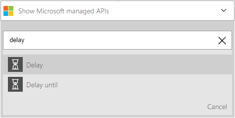

<properties
    pageTitle="Hinzufügen einer Verzögerung in Logik apps | Microsoft Azure"
    description="Übersicht über die Verzögerung und Verzögerung-bis Aktionen, und wie sie mit einer app Azure Logik verwendet."
    services=""
    documentationCenter=""
    authors="jeffhollan"
    manager="erikre"
    editor=""
    tags="connectors"/>

<tags
   ms.service="logic-apps"
   ms.devlang="na"
   ms.topic="article"
   ms.tgt_pltfrm="na"
   ms.workload="na"
   ms.date="07/18/2016"
   ms.author="jehollan"/>

# Erste Schritte mit der Verzögerung und Verzögerung-bis-Aktionen

Mithilfe der Verzögerung und "Verzögerung-bis" Aktionen können Sie Workflows Szenarien abschließen.

Beispielsweise können Sie:

- Warten Sie, bis ein Wochentag Statusinformationen über e-Mail senden.
- Verzögern des Workflows, bis zu ein Anruf HTTP-Zeit in Anspruch, bevor Sie fortsetzen und Abrufen des Ergebnisses.

Um anzufangen mithilfe der Verzögerungsaktion in einer app Logik, finden Sie unter [Erstellen einer app Logik](../app-service-logic/app-service-logic-create-a-logic-app.md).

## Verwenden Sie die Aktionen Verzögerung

Eine Aktion ist ein Vorgang, der über der Workflow ausgeführt wird, die in einer app Logik definiert ist. [Erfahren Sie mehr über Aktionen](connectors-overview.md).

Hier ist eine Beispiel Sequenz wie einen Verzögerung Schritt in eine app Logik verwenden:

1. Nach dem Hinzufügen eines Triggers, klicken Sie auf **Neuen Schritt** , um eine Aktion hinzuzufügen.
2. Suchen Sie nach **Verzögerung** , um die Verzögerung Aktionen zu öffnen. In diesem Beispiel werden wir **Verzögerung**auswählen.

    

3. Führen Sie die Aktion Eigenschaften zum Konfigurieren der Verzögerung an.

    

4. Klicken Sie auf **Speichern** , um veröffentlichen, und aktivieren die app Logik.

## Aktionsdetails

Der Serie Trigger weist die folgenden Eigenschaften, die so konfiguriert werden können.

### Verzögerungsaktion

Diese Aktion verzögert ausführen für einen bestimmten Zeitraum aus.
A * bedeutet, dass es ein Feld erforderlich ist.

|Anzeigename|Eigenschaftsname|Beschreibung|
|---|---|---|
|Anzahl *|zählen|Die Anzahl der Zeiteinheiten zum verzögern|
|Einheiten *|Einheit|Die Zeiteinheit: `Second`, `Minute`, `Hour`, oder`Day`|
 

### Verzögerung-bis Aktion

Diese Aktion verzögert bis zu einem bestimmten Datum/Uhrzeit ausführen.
A * bedeutet, dass es ein Feld erforderlich ist.

|Anzeigename|Eigenschaftsname|Beschreibung|
|---|---|---|
|Jahr *|Zeitstempel|Des Jahres bis zum verzögern bis (GMT)|
|Monat *|Zeitstempel|Des Monats bis zum verzögern bis (GMT)|
|Tag *|Zeitstempel|Den Tag verzögern bis (GMT)|
 

## Nächste Schritte

Probieren Sie die Plattform und [Erstellen Sie eine app Logik](../app-service-logic/app-service-logic-create-a-logic-app.md). Sie können der verfügbaren Connectors Logik Apps vertraut machen, indem Sie die [Liste der APIs](apis-list.md).
