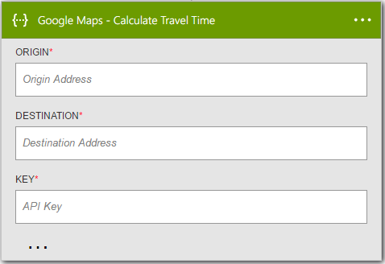

<properties
    pageTitle="Hinzufügen der HTTP + Swagger Aktion in Logik apps | Microsoft Azure"
    description="Übersicht über die HTTP + Swagger Aktion und Vorgänge"
    services=""
    documentationCenter=""
    authors="jeffhollan"
    manager="erikre"
    editor=""
    tags="connectors"/>

<tags
   ms.service="logic-apps"
   ms.devlang="na"
   ms.topic="article"
   ms.tgt_pltfrm="na"
   ms.workload="na"
   ms.date="07/18/2016"
   ms.author="jehollan"/>

# Erste Schritte mit der HTTP + Swagger Aktion

Mit der HTTP + Swagger Aktion können Sie einen herausragende Verbinder an alle übrigen Endpunkt durch ein [Swagger Dokument](https://swagger.io)erstellen. Sie können auch eine app Logik zum Aufrufen von alle übrigen Endpunkt eine herausragende Logik App-Designer zu erweitern.

Erste Schritte mit der HTTP + Swagger Aktion in einer app Logik finden Sie unter [Erstellen einer neuen Logik app](../app-service-logic/app-service-logic-create-a-logic-app.md).

---

## Verwenden Sie HTTP + Swagger als eines Triggers oder einer Aktion

Die HTTP + Swagger Trigger und Aktion identisch mit der [Aktion HTTP](connectors-native-http.md) -Funktion, aber Entwurf optimal bereitstellen, indem Sie mit der Form der API und Ausgaben im Designer aus der [Swagger Metadaten](https://swagger.io). Darüber hinaus können Sie HTTP + Swagger als Trigger. Wenn Sie einen Trigger Umfragen implementieren möchten, sollten sie das Umfragen Muster folgen, das beim Erstellen [einer benutzerdefinierten API zur Verwendung mit Logik apps](../app-service-logic/app-service-logic-create-api-app.md#polling-triggers)beschrieben ist.

[Weitere Informationen zu Logik app Trigger und Aktionen.](connectors-overview.md)

Hier ist ein Beispiel für die verwenden das HTTP- + Swagger Vorgang als eine Aktion in einem Workflow in einer app Logik aus.

1. Wählen Sie die Schaltfläche für den **Neuen Schritt** aus.
2. Wählen Sie **eine Aktion hinzufügen**.
3. Geben Sie in das Suchfeld der Aktion **swagger** , um die Liste der HTTP + Swagger Aktion aus.

    

4. Geben Sie die URL für ein Dokument Swagger an:
    - Wenn Sie aus dem App-Designer Logik arbeiten möchten, muss die URL einen HTTPS-Endpunkt und CORS aktiviert haben.
    - Wenn das Dokument Swagger diese Anforderung nicht entspricht, können Sie [Azure-Speicher mit CORS aktiviert](#hosting-swagger-from-storage) , um das Dokument zu speichern.
5. Klicken Sie auf **Weiter** , um zu lesen und aus dem Dokument Swagger gerendert werden.
6. Fügen Sie alle Parameter, die für den Anruf HTTP erforderlich sind.

    

1. Klicken Sie auf die obere linke Ecke der Symbolleiste und Ihre Logik app wird sowohl speichern auf **Speichern** und veröffentlichen (aktivieren).

### Host Swagger aus Azure-Speicher

Möglicherweise möchten ein Dokument Swagger verwiesen werden, die nicht gehostet wird, oder die Sicherheit und Cross-Origin Anforderungen für den Designer nicht entsprechen. Um dieses Problem zu beheben, können Sie das Dokument Swagger in Azure Storage gespeichert und CORS in Bezug auf das Dokument aktivieren.  

Hier sind die Schritte zum Erstellen, konfigurieren und speichern Sie Swagger Dokumente in Azure-Speicher ein:

1. [Erstellen Sie ein Konto Azure-Speicher mit Azure Blob-Speicher](../storage/storage-create-storage-account.md). (Hierzu Festlegen von Berechtigungen für den **Zugriff auf die öffentlichen**.)
2. Aktivieren Sie auf der Blob CORS. [Diese PowerShell-Skript](https://github.com/logicappsio/EnableCORSAzureBlob/blob/master/EnableCORSAzureBlob.ps1) können Sie diese Einstellung automatisch konfigurieren.
3. Laden Sie die Datei Swagger, in dem Blob. Sie können von der [Azure-Portal](https://portal.azure.com) oder eines Tools wie [Azure-Speicher-Explorer](http://storageexplorer.com/)ausführen.
1. Verweisen auf einen HTTPS-Link zum Dokument in Azure Blob-Speicher. (Der Link entspricht dem Format `https://*storageAccountName*.blob.core.windows.net/*container*/*filename*`.)

## Technische details

Im folgenden werden die Details zu den Trigger und Aktionen, die in diesem HTTP + Swagger Netzwerke unterstützt.

## HTTP + Swagger Trigger

Ein Trigger ist ein Ereignis, die verwendet werden kann, um den Workflow zu starten, der in einer app Logik definiert ist. [Weitere Informationen zu Triggern.](connectors-overview.md) Die HTTP + Swagger Verbinder weist eine auslösen.

|Trigger|Beschreibung|
|---|---|
|HTTP + Swagger|Tätigen Sie eines Anrufs HTTP und zurückgeben den Antwortinhalt|

## HTTP + Swagger Aktionen

Eine Aktion ist ein Vorgang, der über der Workflow ausgeführt wird, die in einer app Logik definiert ist. [Weitere Informationen zu Aktionen.](connectors-overview.md) Die HTTP + Swagger Verbinder besitzt eine mögliche Aktion.

|Aktion|Beschreibung|
|---|---|
|HTTP + Swagger|Tätigen Sie eines Anrufs HTTP und zurückgeben den Antwortinhalt|

### Aktionsdetails

Die HTTP + Swagger Verbinder im Lieferumfang von eine möglicher Aktion. Im folgenden sehen Informationen zu den einzelnen die Aktionen, die erforderlichen und optionalen Eingabefelder und den entsprechenden Ausgabedetails, die ihre Verwendung zugeordnet sind.

#### HTTP + Swagger

Stellen Sie eine ausgehende HTTP-Anforderung mit Swagger-Metadaten-Unterstützung.
Ein Sternchen (*) bedeutet, dass ein erforderliches Feld.

|Anzeigename|Eigenschaftsname|Beschreibung|
|---|---|---|
|Methode *|Methode|HTTP-Verb zu verwenden.|
|URI *|URI|URI für die HTTP-Anforderung.|
|Kopfzeilen|Kopfzeilen|Ein JSON-Objekt der HTTP-Header aufnehmen möchten.|
|Textkörper|Textkörper|HTTP-Anforderungstexts.|
|Authentifizierung|Authentifizierung|Authentifizierung für die Anforderung verwendet werden soll. [Weitere Informationen hierzu finden Sie unter HTTP](./connectors-native-http.md#authentication).|

**Die Ausgabedetails**

HTTP-Antwort

|Eigenschaftsname|Datentyp|Beschreibung|
|---|---|---|
|Kopfzeilen|Objekt|Antwort-Header|
|Textkörper|Objekt|Antwortobjekt|
|Statuscode|Ganzzahl|HTTP-Statuscode|

### HTTP-Antworten

Wenn verschiedene Aktionen aufrufen, können Sie bestimmte Antworten erhalten haben. Es folgt eine Tabelle, die entsprechenden Antworten und Beschreibungen werden.

|Namen|Beschreibung|
|---|---|
|200|Okay|
|202|Akzeptiert|
|400|Ungültige Anforderung|
|401|Nicht autorisierte|
|403|Verboten|
|404|Nicht gefunden|
|500|Interner Serverfehler. Es ist ein Fehler aufgetreten.|

---

## Nächste Schritte

Testen der Plattform und [Erstellen Sie eine app Logik](../app-service-logic/app-service-logic-create-a-logic-app.md) jetzt. Sie können der verfügbaren Connectors Logik Apps vertraut machen, indem Sie die [Liste der APIs](apis-list.md)ansehen.
