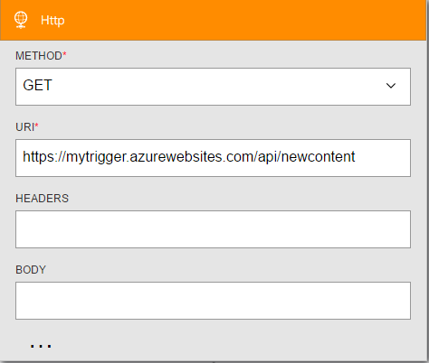

<properties
    pageTitle="Hinzufügen die Aktion HTTP Logik Apps | Microsoft Azure"
    description="Übersicht über die HTTP-Aktion mit Eigenschaften"
    services=""
    documentationCenter=""
    authors="jeffhollan"
    manager="erikre"
    editor=""
    tags="connectors"/>

<tags
   ms.service="logic-apps"
   ms.devlang="na"
   ms.topic="article"
   ms.tgt_pltfrm="na"
   ms.workload="na"
   ms.date="07/15/2016"
   ms.author="jehollan"/>

# <a name="get-started-with-the-http-action"></a>Erste Schritte mit der Aktion HTTP

Mit der Aktion HTTP können Sie Workflows für Ihre Organisation erweitern und an einem beliebigen Endpunkt über HTTP kommunizieren.

Sie können:

- Erstellen von Logik app Workflows, die (Trigger) aktivieren, wenn eine Website, die Sie verwalten-fällt aus.
- Kommunizieren Sie an einem beliebigen Endpunkt über HTTP, um Ihre Workflows in anderen Diensten zu erweitern.

Um anzufangen mithilfe der HTTP-Aktion in einer app Logik, finden Sie unter [Erstellen einer app Logik](../app-service-logic/app-service-logic-create-a-logic-app.md).

## <a name="use-the-http-trigger"></a>Verwenden Sie den HTTP-trigger

Ein Trigger ist ein Ereignis, die verwendet werden kann, um den Workflow zu starten, der in einer app Logik definiert ist. [Erfahren Sie mehr über Trigger](connectors-overview.md).

Hier ist eine Beispiel-Abfolge von Informationen zum Einrichten der HTTP-Trigger im Logik App-Designer.

1. Fügen Sie den HTTP-Trigger in Ihrer app Logik hinzu.
2. Füllen Sie die Parameter für den HTTP-Endpunkt, den Sie abfragen möchten.
3. Ändern des Intervalls Serie auf wie häufig sie Umfrage sollte.
4. Die app Logik wird nun für alle Inhalte, die bei jeder Überprüfung zurückgegeben wird ausgelöst.



### <a name="how-the-http-trigger-works"></a>Funktionsweise der HTTP-trigger

Der HTTP-Trigger macht einen Anruf an einen HTTP-Endpunkt in einem periodischen Intervall. Standardmäßig alle HTTP-Antwort code auf weniger als 300 Ergebnisse in eine Logik app ausführen. Sie können eine Bedingung in der Codeansicht hinzufügen, die ausgewertet wird, nach der HTTP-Anruf, um festzustellen, ob die app Logik ausgelöst werden soll. Hier ist ein Beispiel für einen HTTP-Trigger, die ausgelöst wird, wenn der Fehlerstatus größer als oder gleich ist `400`.

```javascript
"Http":
{
    "conditions": [
        {
            "expression": "@greaterOrEquals(triggerOutputs()['statusCode'], 400)"
        }
    ],
    "inputs": {
        "method": "GET",
        "uri": "https://blogs.msdn.microsoft.com/logicapps/",
        "headers": {
            "accept-language": "en"
        }
    },
    "recurrence": {
        "frequency": "Second",
        "interval": 15
    },
    "type": "Http"
}
```

Vollständige Details zu Parametern Trigger HTTP stehen auf [MSDN](https://msdn.microsoft.com/library/azure/mt643939.aspx#HTTP-trigger).

## <a name="use-the-http-action"></a>Verwenden Sie die HTTP-Aktion

Eine Aktion ist ein Vorgang, der über der Workflow ausgeführt wird, die in einer app Logik definiert ist. [Erfahren Sie mehr über Aktionen](connectors-overview.md).

1. Wählen Sie die Schaltfläche für den **Neuen Schritt** aus.
2. Wählen Sie **eine Aktion hinzufügen**.
3. Geben Sie in das Suchfeld der Aktion **http** , um die Liste der HTTP-Aktion aus.

    

4. Fügen Sie alle Parameter, die für den Anruf HTTP erforderlich sind.

    

5. Klicken Sie auf der oberen linken Ecke der Symbolleiste auf Speichern. Ihre app Logik wird sowohl speichern und veröffentlichen (aktivieren).

## <a name="http-trigger"></a>HTTP-trigger

Hier sind die Details für den Trigger, den dieser Connector unterstützt. HTTP-Connector verfügt über eine auslösen.

|Trigger|Beschreibung|
|---|---|
|HTTP|Stellt einen HTTP-Anruf, und gibt den Antwortinhalt.|

## <a name="http-action"></a>HTTP-Aktion

Hier sind die Details für die Aktion, die dieser Connector unterstützt. HTTP-Connector verfügt über eine mögliche Aktion.

|Aktion|Beschreibung|
|---|---|
|HTTP|Stellt einen HTTP-Anruf, und gibt den Antwortinhalt.|

## <a name="http-details"></a>HTTP-details

Die folgenden Tabellen beschreiben die erforderlichen und optionalen Eingabefelder für die Aktion und den entsprechenden Ausgabedetails, die mit der Aktion zugeordnet sind.


#### <a name="http-request"></a>HTTP-Anforderung
Im folgenden werden die Eingabefelder für die Aktion, wodurch eine ausgehende HTTP-Anforderung.
A * bedeutet, dass es ein Feld erforderlich ist.

|Anzeigename|Eigenschaftsname|Beschreibung|
|---|---|---|
|Methode *|Methode|Das HTTP-Verb verwenden|
|URI *|URI|Der URI für die HTTP-Anforderung|
|Kopfzeilen|Kopfzeilen|Ein JSON-Objekt HTTP-Header aufnehmen möchten|
|Textkörper|Textkörper|HTTP-Anforderungstexts|
|Authentifizierung|Authentifizierung|Details im Abschnitt [Authentifizierung](#authentication)|
<br>

#### <a name="output-details"></a>Die Ausgabedetails

Im folgenden sind die Ausgabedetails für die HTTP-Antwort.

|Eigenschaftsname|Datentyp|Beschreibung|
|---|---|---|
|Kopfzeilen|Objekt|Antwort-Header|
|Textkörper|Objekt|Antwortobjekt|
|Statuscode|Ganzzahl|HTTP-Statuscode|

## <a name="authentication"></a>Authentifizierung

Das Feature Logik Apps der App-Verwaltungsdienst Azure können Sie verschiedene Arten von Authentifizierung über HTTP-Endpunkte verwenden. Sie können diese Authentifizierung mit der Verbinder **HTTP**, **[HTTP + Swagger](./connectors-native-http-swagger.md)**und **[HTTP-Webhook](./connectors-native-webhook.md)** verwenden. Die folgenden Arten von Authentifizierung werden können konfiguriert:

* [Standardauthentifizierung](#basic-authentication)
* [Client-Zertifikat-Authentifizierung](#client-certificate-authentication)
* [Azure Active Directory (Azure AD) OAuth-Authentifizierung](#azure-active-directory-oauth-authentication)

#### <a name="basic-authentication"></a>Standardauthentifizierung

Das folgende Authentifizierungsobjekt ist für Standardauthentifizierung erforderlich.
A * bedeutet, dass es ein Feld erforderlich ist.

|Eigenschaftsname|Datentyp|Beschreibung|
|---|---|---|
|Typ *|Typ|Art der Authentifizierung (muss `Basic` für die Standardauthentifizierung)|
|Benutzername *|Benutzername|Benutzername zum Authentifizieren|
|Kennwort *|Kennwort|Kennwort zum Authentifizieren|

>[AZURE.TIP] Wenn Sie ein Kennwort verwenden, die aus der Definition, verwenden Sie unauffindbar möchten eine `securestring` Parameter und die `@parameters()` [Workflow Definition (Funktion)](http://aka.ms/logicappdocs).

So erstellen Sie im Authentifizierungsfeld ein Objekt wie folgt:

```javascript
{
    "type": "Basic",
    "username": "user",
    "password": "test"
}
```

#### <a name="client-certificate-authentication"></a>Client-Zertifikat-Authentifizierung

Das folgende Authentifizierungsobjekt ist für Kunden Zertifikatauthentifizierung erforderlich. A * bedeutet, dass es ein Feld erforderlich ist.

|Eigenschaftsname|Datentyp|Beschreibung|
|---|---|---|
|Typ *|Typ|Die Art der Authentifizierung (muss `ClientCertificate` für SSL-Client-Zertifikate)|
|PFX *|PFX|Die Base64-codierte Inhalt der Datei persönliche Informationen Exchange (PFX)|
|Kennwort *|Kennwort|Kennwort zum Zugreifen auf der PFX-Datei|

>[AZURE.TIP] Können Sie eine `securestring` Parameter und die `@parameters()` [Workflow Definition-Funktion](http://aka.ms/logicappdocs) einen Parameter verwenden, die in der Definition nach dem Speichern der app Logik lesbare können nicht.

Beispiel:

```javascript
{
    "type": "ClientCertificate",
    "pfx": "aGVsbG8g...d29ybGQ=",
    "password": "@parameters('myPassword')"
}
```

#### <a name="azure-ad-oauth-authentication"></a>Azure AD-OAuth-Authentifizierung

Das folgende Authentifizierungsobjekt ist für Azure AD OAuth-Authentifizierung erforderlich. A * bedeutet, dass es ein Feld erforderlich ist.

|Eigenschaftsname|Datentyp|Beschreibung|
|---|---|---|
|Typ *|Typ|Die Art der Authentifizierung (muss `ActiveDirectoryOAuth` für Azure AD OAuth)|
|Mandanten *|Mandanten|Der Mandant Bezeichner für den Azure AD-Mandanten|
|Zielgruppe *|Zielgruppe|Legen Sie auf`https://management.core.windows.net/`|
|Client -ID *|clientId|Die Client-ID für die Azure AD-Anwendung|
|Geheim *|geheim|Das Geheimnis der Client, der das Token anfordert|

>[AZURE.TIP] Können Sie eine `securestring` Parameter und die `@parameters()` [Workflow Definition-Funktion](http://aka.ms/logicappdocs) einen Parameter verwenden, die in der Definition nach dem Speichern lesbare können nicht.

Beispiel:

```javascript
{
    "type": "ActiveDirectoryOAuth",
    "tenant": "72f988bf-86f1-41af-91ab-2d7cd011db47",
    "audience": "https://management.core.windows.net/",
    "clientId": "34750e0b-72d1-4e4f-bbbe-664f6d04d411",
    "secret": "hcqgkYc9ebgNLA5c+GDg7xl9ZJMD88TmTJiJBgZ8dFo="
}
```

## <a name="next-steps"></a>Nächste Schritte

Probieren Sie die Plattform und [Erstellen Sie eine app Logik](../app-service-logic/app-service-logic-create-a-logic-app.md). Sie können der verfügbaren Connectors Logik Apps vertraut machen, indem Sie die [Liste der APIs](apis-list.md).
