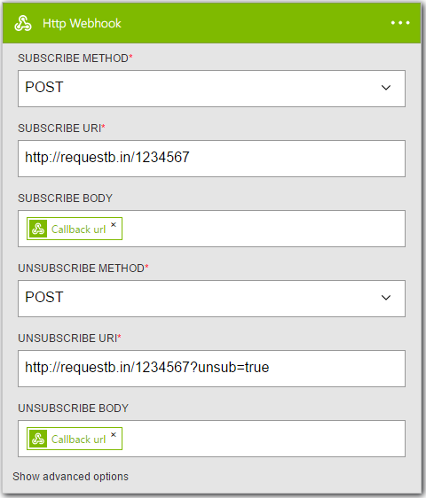
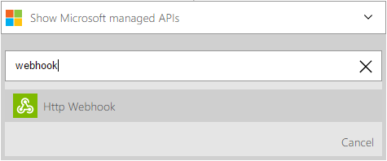
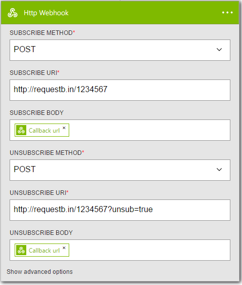

<properties
    pageTitle="Logik App Webhook Verbinder | Microsoft Azure"
    description="Übersicht über Webhook Aktion und Trigger zum Ausführen von Aktionen wie Filter Matrix zurück."
    services=""
    documentationCenter="" 
    authors="jeffhollan"
    manager="erikre"
    editor=""
    tags="connectors"/>

<tags
   ms.service="logic-apps"
   ms.devlang="na"
   ms.topic="article"
   ms.tgt_pltfrm="na"
   ms.workload="na" 
   ms.date="07/21/2016"
   ms.author="jehollan"/>

# Erste Schritte mit der Webhook Verbinder

Mit der Aktion Webhook und der Trigger können Sie auslösen, Anhalten und fortsetzen Zahlungen zu erreichen:

- Auslösen von einem [Azure Ereignis Hub so früh wie ein Element](https://github.com/logicappsio/EventHubAPI) empfangen wird
- Warten Sie auf eine Genehmigung, bevor Sie fortfahren eines Workflows

Informationen zum Erstellen einer API, die unterstützt ein Webhook abonnieren finden Sie [in diesem Artikel zum Erstellen von Logik App Verbinder](../app-service-logic/app-service-logic-create-api-app.md).

---

## Verwenden des Triggers webhook

Ein Trigger ist ein Ereignis, das zum Starten des Workflows in einer app Logik definiert verwendet werden kann. [Erfahren Sie mehr über Trigger](connectors-overview.md).  Ein Trigger Webhook ist besonders hilfreich, wie er auf Umfragen für neue Elemente – wie die [Anforderung Trigger](./connectors-native-reqres.md) verlassen nicht die app Logik Instant ausgelöst wird, die ein Ereignis eintritt.  Dazu registriert einen *Rückruf URL* an einen Dienst verwendet werden kann, die app Logik Bedarf ausgelöst werden.

Hier ist eine Beispiel Sequenz zum Einrichten eines Triggers HTTP im Logik app-Designer.  Dies wird davon ausgegangen, Sie haben bereits bereitgestellt oder auf eine API, die [die Webhook abonnieren und Kündigen des Abonnements verwendete Logik Apps Muster](../app-service-logic/app-service-logic-create-api-app.md#webhook-triggers)folgt zugreifen.  Die abonnieren wird aufgerufen, wenn eine app Logik mit einer neuen Webhook gespeichert oder ein von deaktiviert Wechsel aktiviert wird.  Der Anruf Abo kündigen besteht bei jedem Logik app Webhook Trigger entfernt und gespeichert oder ein von Wechsel aktiviert auf deaktiviert.

1. Hinzufügen des **HTTP-Webhook** Triggers als ersten Schritt in eine app Logik
1. Füllen Sie die Parameter für die Webhook abonnieren und Kündigen des Abonnements Anrufe
    - Führen Sie diese dasselbe Muster wie die [Aktion HTTP](./connectors-native-http.md) -format

    

1. Fügen Sie mindestens eine Aktion hinzu.
1. Klicken Sie auf Speichern, veröffentlichen Sie die app Logik – dies Ruft den Endpunkt abonnieren mit den Rückruf-URL zum Auslösen diese app Logik erforderlich sind
1. Der Dienst jederzeit macht eine `HTTP POST` Rückruf-URL, wird die app Logik ausgelöst (und schließen Sie keine Daten in der Anforderung übergeben)

## Verwenden Sie die Aktion webhook
    
Eine Aktion ist ein Vorgang durchgeführten durch den Workflow in einer app Logik definiert. [Weitere Informationen zu Aktionen.](connectors-overview.md)  Eine Aktion Webhook ist besonders hilfreich, wie sie einen *Rückruf URL* mit einem Dienst registriert und warten, bis die URL vor fortsetzen aufgerufen wird.  Die ["Genehmigung E-Mail senden"](./connectors-create-api-office365-outlook.md) ist ein Beispiel für einen Verbinder, der diesem Muster folgt.  Sie können dieses Muster in jedem Dienst, bis die Aktion Webhook erweitern.  Dies wird davon ausgegangen, Sie haben bereits bereitgestellt oder auf eine API, die [die Webhook abonnieren und Kündigen des Abonnements verwendete Logik Apps Muster](../app-service-logic/app-service-logic-create-api-app.md#webhook-actions)folgt zugreifen.  Die abonnieren wird aufgerufen, wenn eine app Logik die Webhook Aktion ausgeführt wird.  Die Abo kündigen wird aufgerufen, wenn eine ausführen abgebrochen wird, während Sie warten auf eine Antwort oder vor der Logik ausführen Zeiten.

So fügen Sie eine Aktion Webhook hinzu:

1. Wählen Sie die Schaltfläche **Neue Schritt**
1. **Hinzufügen einer Aktion** auswählen
1. Geben Sie in das Suchfeld der Aktion "Webhook", um die Aktion **Webhook HTTP-** Liste

    

1. Füllen Sie die Parameter für die Webhook abonnieren und Kündigen des Abonnements Anrufe
    - Führen Sie diese dasselbe Muster wie die [Aktion HTTP](./connectors-native-http.md) -format

    

    - Laufzeit ruft die app Logik den Endpunkt abonnieren beim erreichen den Schritt

1. Klicken Sie auf Speichern, in der oberen linken Ecke der Symbolleiste und Ihre app Logik wird sowohl speichern und veröffentlichen (aktivieren)

---

## Technische details

Nachstehend sind die Details für den Trigger und Aktion Webhook unterstützt.

## Webhook Trigger

Ein Trigger ist ein Vorgang zum Starten eines Workflows an. [Weitere Informationen zu Triggern.](connectors-overview.md) Bei diesem Connector wird 1 auslösen.

|Aktion|Beschreibung|
|---|---|
|HTTP-Webhook|Abonnieren Sie einen Rückruf URL zu einem Webdienst, der die URL zum Auslösen Logik app Bedarf aufgerufen werden kann.|

### Auslösen von details

Der Verbinder Webhook im Lieferumfang von 1 möglichen auslösen. Im folgenden finden Sie die Informationen in der Aktion, die erforderlichen und optionalen Eingabefelder und seine Verwendung zugeordneten Details das entsprechende ausgeben.

#### HTTP-Webhook
Abonnieren Sie einen Rückruf URL zu einem Webdienst, der die URL zum Auslösen Logik app Bedarf aufgerufen werden kann.
Eine * erforderliches Feld bedeutet.

|Anzeigename|Eigenschaftsname|Beschreibung|
|---|---|---|
|Abonnieren Methode *|Methode|HTTP-Methode für abonnieren Anforderung|
|Abonnieren URI *|URI|HTTP-URI für abonnieren Anforderung|
|Kündigen des Abonnements Methode *|Methode|HTTP-Methode für Abo kündigen Anforderung|
|Kündigen des Abonnements URI *|URI|HTTP-URI für Abo kündigen Anforderung|
|Abonnieren von Text|Textkörper|HTTP-Anforderungstexts für abonnieren|
|Abonnieren von Kopfzeilen|Kopfzeilen|HTTP-Anforderungsheader für abonnieren|
|Abonnieren-Authentifizierung|authencation|HTTP-Authentifizierung für abonnieren verwendet werden soll. [Finden Sie unter http-Connector](./connectors-native-http.md#authenication) Details|
|Kündigen des Abonnements Textkörper|Textkörper|HTTP-Anforderungstexts für Abo kündigen|
|Kündigen des Abonnements Kopfzeilen|Kopfzeilen|HTTP-Anforderungsheader für Abo kündigen|
|Kündigen des Abonnements Authentifizierung|Authentifizierung|HTTP-Authentifizierung für Abo kündigen verwendet werden soll. [Finden Sie unter http-Connector](./connectors-native-http.md#authenication) Details|
 

**Die Ausgabedetails**

Webhook Anforderung

|Eigenschaftsname|Datentyp|Beschreibung|
|---|---|---|
|Kopfzeilen|Objekt|Webhook Anforderung Kopfzeilen|
|Textkörper|Objekt|Webhook Anforderungsobjekt|
|Statuscode|Ganzzahl|Webhook Anforderung Statuscode|

## Webhook Aktionen

Eine Aktion ist ein Vorgang durchgeführten durch den Workflow in einer app Logik definiert. [Weitere Informationen zu Aktionen.](connectors-overview.md) Der Verbinder ist 1 mögliche Aktion. 

|Aktion|Beschreibung|
|---|---|
|HTTP-Webhook|Abonnieren Sie einen Rückruf URL zu einem Webdienst, der die URL zum Fortsetzen eines Workflowschritt Bedarf aufgerufen werden kann.|

### Aktionsdetails

Der Verbinder Webhook im Lieferumfang von 1 mögliche Aktion. Nachstehend, Informationen zu den Aktionen, die erforderlichen und optionalen Eingabefelder vorhanden ist und seine Verwendung zugeordneten Details das entsprechende ausgeben.

#### HTTP-Webhook
Abonnieren Sie einen Rückruf URL zu einem Webdienst, der die URL zum Fortsetzen eines Workflowschritt Bedarf aufgerufen werden kann.
Eine * erforderliches Feld bedeutet.

|Anzeigename|Eigenschaftsname|Beschreibung|
|---|---|---|
|Abonnieren Methode *|Methode|HTTP-Methode für abonnieren Anforderung|
|Abonnieren URI *|URI|HTTP-URI für abonnieren Anforderung|
|Kündigen des Abonnements Methode *|Methode|HTTP-Methode für Abo kündigen Anforderung|
|Kündigen des Abonnements URI *|URI|HTTP-URI für Abo kündigen Anforderung|
|Abonnieren von Text|Textkörper|HTTP-Anforderungstexts für abonnieren|
|Abonnieren von Kopfzeilen|Kopfzeilen|HTTP-Anforderungsheader für abonnieren|
|Abonnieren-Authentifizierung|authencation|HTTP-Authentifizierung für abonnieren verwendet werden soll. [Finden Sie unter http-Connector](./connectors-native-http.md#authentication) Details|
|Kündigen des Abonnements Textkörper|Textkörper|HTTP-Anforderungstexts für Abo kündigen|
|Kündigen des Abonnements Kopfzeilen|Kopfzeilen|HTTP-Anforderungsheader für Abo kündigen|
|Kündigen des Abonnements Authentifizierung|Authentifizierung|HTTP-Authentifizierung für Abo kündigen verwendet werden soll. [Finden Sie unter http-Connector](./connectors-native-http.md#authentication) Details|
 

**Die Ausgabedetails**

Webhook Anforderung

|Eigenschaftsname|Datentyp|Beschreibung|
|---|---|---|
|Kopfzeilen|Objekt|Webhook Anforderung Kopfzeilen|
|Textkörper|Objekt|Webhook Anforderungsobjekt|
|Statuscode|Ganzzahl|Webhook Anforderung Statuscode|

---

## Nächste Schritte

Nachstehend sind Details zum Weiterleiten Logik apps und unserer Community navigieren.

## Erstellen Sie eine app Logik

Testen der Plattform und [Erstellen Sie eine app Logik](../app-service-logic/app-service-logic-create-a-logic-app.md) jetzt. Sie können der verfügbaren Connectors Logik Apps vertraut machen, indem Sie die [Liste der APIs](apis-list.md).
