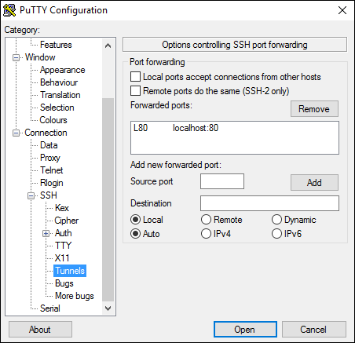

<properties
   pageTitle="Verbinden mit einem Cluster Azure Container Dienst | Microsoft Azure"
   description="Verbinden Sie mit einem Cluster Azure Container Dienst mithilfe eines SSH Tunnels."
   services="container-service"
   documentationCenter=""
   authors="rgardler"
   manager="timlt"
   editor=""
   tags="acs, azure-container-service"
   keywords="Docker, Container, Micro-Dienste DC/OS, Azure"/>

<tags
   ms.service="container-service"
   ms.devlang="na"
   ms.topic="get-started-article"
   ms.tgt_pltfrm="na"
   ms.workload="na"
   ms.date="09/13/2016"
   ms.author="rogardle"/>


# <a name="connect-to-an-azure-container-service-cluster"></a>Verbinden Sie mit einem Cluster Azure Container Service

Verfügbar machen REST-Endpunkte, die DC/OS und Docker Swarm Cluster, die vom Azure Container Dienst bereitgestellt werden. Diese Grenzwerte sind jedoch nicht nach außen öffnen. Damit diese Endpunkte verwalten zu können, müssen Sie einen Tunnel Secure Shell (SSH) erstellen. Nachdem eine SSH wurde Tunnel aufgebaut, können Sie Befehle für die Endpunkte Cluster ausgeführt und Anzeigen von Cluster Benutzeroberfläche erfolgt über einen Browser auf Ihrem System. Dieses Dokument führt Sie durch die Erstellung eines SSH Tunnels Linux, OS X und Windows.

>[AZURE.NOTE] Sie können eine Sitzung SSH mit einem Cluster Managementsystem erstellen. Jedoch empfohlen nicht. Arbeiten Sie direkt auf eine Management-System stellt das Risiko unbeabsichtigtes Konfiguration Änderungen zur Verfügung.   

## <a name="create-an-ssh-tunnel-on-linux-or-os-x"></a>Erstellen Sie einen Tunnel SSH unter Linux oder OS X

Erstes, die Sie ausführen, wenn Sie einen Tunnel SSH unter Linux oder OS X erstellen, besteht darin, den öffentlichen DNS-des Master-Shapes mit Lastenausgleich zu suchen. Erweitern Sie hierzu die Ressourcengruppe, damit jeder Ressource angezeigt wird. Suchen nach ein, und wählen Sie die öffentliche IP-Adresse des Master-Shapes. Dadurch wird eine Blade geöffnet, die Informationen für die öffentliche IP-Adresse enthält, wozu auch der DNS-Name. Dieser Name zur späteren Verwendung zu speichern. <br />


Jetzt eine Shell öffnen, und führen Sie den folgenden Befehl aus, in dem:

**PORT** wird von den Endpunkt, den Sie verfügbar machen möchten. Dies ist für Punktschwarms 2375. Verwenden Sie für DC/OS den Port 80 ein.  
**Benutzername** ist der Benutzername, das bereitgestellt wurde, wenn Sie den Cluster bereitgestellt.  
**DNSPREFIX** ist die DNS-Präfix, das Sie zur Verfügung gestellt, wenn Sie den Cluster bereitgestellt.  
**Bereich** ist der Bereich, in dem sich die Ressourcengruppe befindet.  
**PATH_TO_PRIVATE_KEY** [OPTIONAL] ist den Pfad für den privaten Schlüssel, der die den öffentlichen Schlüssel, die Sie zur Verfügung gestellt entspricht, wenn Sie den Container Dienst Cluster erstellt haben. Verwenden Sie diese Option, mit der i - kennzeichnen.

```bash
ssh -L PORT:localhost:PORT -f -N [USERNAME]@[DNSPREFIX]mgmt.[REGION].cloudapp.azure.com -p 2200
```
> SSH Verbindungsport ist 2200 – nicht den Standardport 22.

## <a name="dcos-tunnel"></a>DC/OS tunnel

Um einen Tunnel an die Endpunkte DC, OS-bezogene zu öffnen, führen Sie einen Befehl ist ähnlich wie der folgende aus:

```bash
sudo ssh -L 80:localhost:80 -f -N azureuser@acsexamplemgmt.japaneast.cloudapp.azure.com -p 2200
```

Sie können nun die Endpunkte DC, OS-bezogene beim zugreifen:

- DC/OS:`http://localhost/`
- Marathon:`http://localhost/marathon`
- Mesos:`http://localhost/mesos`

Auf ähnliche Weise können Sie den Rest APIs für jede Anwendung über diesen Tunnel erreicht haben.

## <a name="swarm-tunnel"></a>Punktschwarms tunnel

Um einen Tunnel an den Endpunkt Punktschwarms zu öffnen, führen Sie einen Befehl, der ähnlich wie der folgende aus:

```bash
ssh -L 2375:localhost:2375 -f -N azureuser@acsexamplemgmt.japaneast.cloudapp.azure.com -p 2200
```

Jetzt können Sie Ihre DOCKER_HOST Umgebungsvariable wie folgt festlegen. Sie können weiterhin Ihre Docker line Interface (CLI) wie gewohnt verwenden.

```bash
export DOCKER_HOST=:2375
```

## <a name="create-an-ssh-tunnel-on-windows"></a>Erstellen Sie einen Tunnel SSH unter Windows

Es gibt mehrere Optionen für das Erstellen von SSH Tunnel unter Windows aus. Dieses Dokument wird beschrieben, wie kitten dazu verwenden.

Laden Sie kitten auf Ihrem Windows-System, und führen Sie die Anwendung.

Geben Sie einen Hostnamen ein, der von den Cluster Administrator-Benutzernamen und den öffentlichen DNS-Namen des ersten Master-Shapes im Cluster besteht. Der **Hostname** wird wie folgt aussehen: `adminuser@PublicDNS`. Geben Sie 2200 für den **Port**ein.


Wählen Sie **SSH** und **Authentifizierung**. Fügen Sie Ihre Datei für den private Schlüssel für die Authentifizierung ein.


Wählen Sie **Tunnel** aus, und konfigurieren Sie die folgenden Ports weitergeleitet:
- **Quelle Port:** Die von Ihnen gewünschte – verwenden 80 für DC/OS oder 2375 für Punktschwarms.
- **Ziel:** Verwenden Sie Localhost:80 für DC/OS oder Localhost:2375 für Punktschwarms.

Im folgende Beispiel für DC/OS konfiguriert ist, aber für Docker Swarm sieht ungefähr.

>[AZURE.NOTE] Port 80 muss nicht verwendet werden, wenn Sie diesen Tunnel erstellen.



Wenn Sie fertig sind, speichern Sie die Verbindungskonfiguration, und verbinden Sie die Sitzung PuTTY. Wenn Sie eine Verbindung herstellen, können Sie die Portkonfiguration im Ereignisprotokoll PuTTY anzeigen.


Wenn Sie den Tunnel für DC/OS konfiguriert haben, können Sie den zugehörigen Endpunkt am zugreifen:

- DC/OS:`http://localhost/`
- Marathon:`http://localhost/marathon`
- Mesos:`http://localhost/mesos`

Wenn Sie den Tunnel für Docker Swarm konfiguriert haben, können Sie über die Docker CLI Punktschwarms Cluster zugreifen. Sie müssen zuerst so konfigurieren Sie eine Windows-Umgebungsvariable namens `DOCKER_HOST` mit dem Wert ` :2375`.

## <a name="next-steps"></a>Nächste Schritte

Bereitstellen und Verwalten von Container mit DC/OS oder Punktschwarms:

- [Arbeiten Sie mit Azure Container Dienst und DC/OS](container-service-mesos-marathon-rest.md)
- [Arbeiten Sie mit den Container Azure-Dienst und Docker Punktschwarms](container-service-docker-swarm.md)
