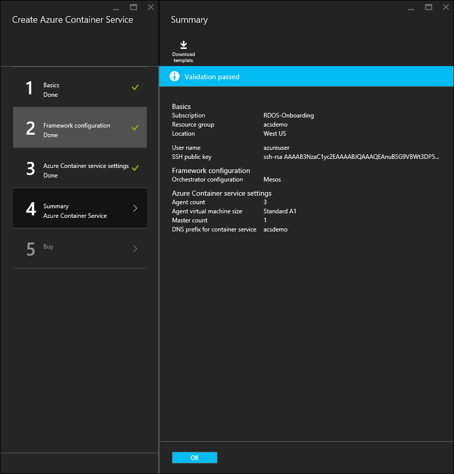
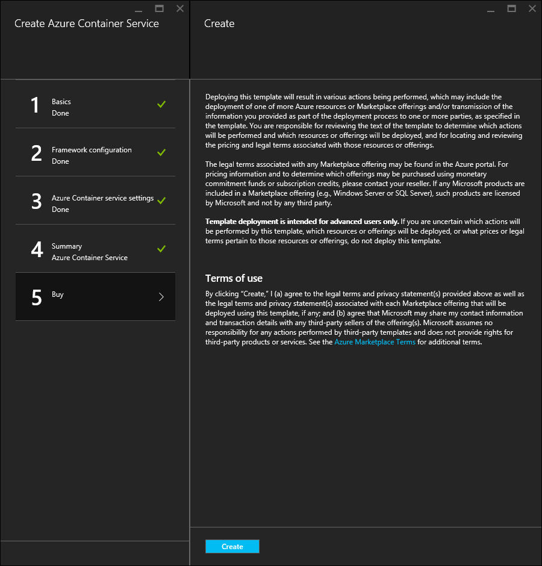

<properties
   pageTitle="Bereitstellen einen Azure Container Dienst Cluster | Microsoft Azure"
   description="Bereitstellen eines Azure Container Dienst Clusters mithilfe der Azure-Portal, die Azure CLI oder PowerShell an."
   services="container-service"
   documentationCenter=""
   authors="rgardler"
   manager="timlt"
   editor=""
   tags="acs, azure-container-service"
   keywords="Docker, Container, Micro-Dienste Mesos, Azure"/>

<tags
   ms.service="container-service"
   ms.devlang="na"
   ms.topic="get-started-article"
   ms.tgt_pltfrm="na"
   ms.workload="na"
   ms.date="09/13/2016"
   ms.author="rogardle"/>

# <a name="deploy-an-azure-container-service-cluster"></a>Bereitstellen eines Azure Container Dienst Clusters

Azure Container-Dienst bietet schnelle Bereitstellung von beliebte Source-öffnen Container Cluster und Orchestrierung Lösungen. Mithilfe von Azure Container Dienst können Sie DC/OS und Docker Swarm Cluster mit Azure Ressourcenmanager Vorlagen oder Azure-Portal bereitstellen. Sie diese Cluster mithilfe von Azure-virtuellen Computern skalieren Sätze bereitstellen, und die Cluster Azure Netzwerk- und Angebote nutzen. Um Azure Container Dienst zugreifen zu können, benötigen Sie ein Azure-Abonnement. Wenn Sie eine besitzen, können Sie für eine [kostenlose Testversion](http://azure.microsoft.com/pricing/free-trial/?WT.mc_id=AA4C1C935)von signieren.

Dieses Dokument führt Sie durch die Bereitstellung von einem Cluster Azure Container Dienst mithilfe der [Azure-Portal](#creating-a-service-using-the-azure-portal), die [Azure line Interface (CLI)](#creating-a-service-using-the-azure-cli)und der [Azure-PowerShell-Modul](#creating-a-service-using-powershell).  

## <a name="create-a-service-by-using-the-azure-portal"></a>Erstellen Sie einen Dienst mithilfe des Azure-Portals

Melden Sie sich bei der Azure-Portal, wählen Sie **neu**, und suchen Sie die Azure Marketplace für **Azure Container Dienst**.

  <br />

Wählen Sie **Azure Container Dienst**aus, und klicken Sie auf **Erstellen**.

  <br />

Geben Sie die folgenden Informationen ein:

- **Benutzername**: Dies ist der Benutzername, der für ein Konto in jeder der virtuellen Computer verwendet wird und virtuellen Computern Maßstab legt fest, im Container-Dienst Azure Cluster.
- **Abonnements**: Wählen Sie ein Abonnement Azure.
- **Ressourcengruppe**: Wählen Sie eine vorhandene Ressourcengruppe aus, oder Erstellen eines neuen Kontos.
- **Standort**: Wählen Sie einen Azure-Bereich für die Bereitstellung von Azure Container Service aus.
- **Öffentlicher Schlüssel SSH**: hinzufügen den öffentlichen Schlüssel, die für die Authentifizierung gegen Container-Dienst Azure-virtuellen Computern verwendet werden. Es ist wichtig, dass dieser Schlüssel keine Zeilenumbrüche enthält und sie das Präfix'ssh-Rsa' enthält und die 'username@domain' postfix. Es sollte etwa wie folgt aussehen: **ssh Rsa AAAAB3Nz... <>...... UcyupgH azureuser@linuxvm **. Leitfaden zum Erstellen von Tasten Secure Shell (SSH) finden Sie unter den Artikeln [Linux]( https://azure.microsoft.com/documentation/articles/virtual-machines-linux-ssh-from-linux/) und [Windows]( https://azure.microsoft.com/documentation/articles/virtual-machines-linux-ssh-from-windows/) .

Klicken Sie auf **OK** , wenn Sie bereit sind, fortzufahren.

  <br />

Wählen Sie eine Orchestrierungstyp aus. Die Optionen sind:

- **DC/OS**: einen Cluster DC/OS bereitstellt.
- **Swarm**: einen Docker Swarm Cluster bereitstellt.

Klicken Sie auf **OK** , wenn Sie bereit sind, fortzufahren.

  <br />

Geben Sie die folgenden Informationen ein:

- **Zählen von Master**: die Anzahl der im Cluster Master-Shapes.
- **Agent zählen**: für Docker Swarm, werden dadurch die ursprüngliche Anzahl der Agents Agent Maßstab festlegen. Für DC/OS werden dadurch die ursprüngliche Anzahl der Agents in einer Gruppe von privaten skalieren. Darüber hinaus wird eine Reihe von öffentlichen Maßstab erstellt, der eine festgelegte Anzahl von Agents enthält. Die Anzahl der Agents in diesem Satz öffentlichen Skala wird bestimmt durch wie viele Master-Shapes im Cluster – eine öffentliche Agent für eine Master-Shape, und zwei öffentliche Agents für drei oder fünf Master-Shapes erstellt wurden.
- **Größe des virtuellen Computers Agent**: die Größe der Agent virtuellen Computer.
- **DNS-Präfix**: einen eindeutigen Namen von Welt, die wichtige Informationen in den vollqualifizierten Domänennamen für den Dienst Präfix verwendet werden soll.

Klicken Sie auf **OK** , wenn Sie bereit sind, fortzufahren.

  <br />

Nach Abschluss der Überprüfung Service, klicken Sie auf **OK** .

  <br />

Klicken Sie auf **Erstellen** , um die Bereitstellung zu starten.

  <br />

Wenn Sie sich entschieden haben, die Bereitstellung Azure-Portal anheften, sehen Sie den Bereitstellungsstatus.

  <br />

Nach Abschluss die Bereitstellung ist Azure Container Dienst Cluster zur Verwendung bereit.

## <a name="create-a-service-by-using-the-azure-cli"></a>Erstellen Sie einen Dienst mithilfe der Azure-CLI

Um eine Instanz des Azure Container Dienstes über die Befehlszeile zu erstellen, benötigen Sie ein Azure-Abonnement. Wenn Sie eine besitzen, können Sie für eine [kostenlose Testversion](http://azure.microsoft.com/pricing/free-trial/?WT.mc_id=AA4C1C935)von signieren. Sie müssen außerdem [installiert](../xplat-cli-install.md) und [konfiguriert](../xplat-cli-connect.md) haben die CLI Azure.

Um einen DC/OS oder Docker Swarm Cluster bereitstellen möchten, wählen Sie eine der folgenden Vorlagen aus GitHub aus. Beachten Sie, dass diese beiden Vorlagen mit Ausnahme der Standardauswahl Orchestrator gleich sind.

* [DC/OS-Vorlage](https://github.com/Azure/azure-quickstart-templates/tree/master/101-acs-dcos)
* [Punktschwarms Vorlage](https://github.com/Azure/azure-quickstart-templates/tree/master/101-acs-swarm)

Als Nächstes stellen Sie sicher, dass die CLI Azure zu einem Abonnement Azure verbunden wurde. Sie können dazu verwenden den folgenden Befehl aus:

```bash
azure account show
```
Wenn ein Azure-Konto nicht zurückgegeben wird, verwenden Sie den folgenden Befehl die CLI Azure anmelden.

```bash
azure login -u user@domain.com
```

Konfigurieren Sie anschließend die CLI Azure-Tools zur Azure Ressourcenmanager verwenden.

```bash
azure config mode arm
```

Erstellen einer Azure Ressourcengruppe und Container Dienst Cluster mit den folgenden Befehl aus, wo:

- **RESOURCE_GROUP** ist der Name der Ressourcengruppe, die Sie für diesen Dienst verwenden möchten.
- **Speicherort** ist der Azure Region, in dem die Ressourcengruppe und Azure Container Service-Bereitstellung erstellt werden.
- **TEMPLATE_URI** wird der Speicherort der Bereitstellungsdatei. Beachten Sie, dass dies der unformatierten Datei keinen Zeiger auf die GitHub UI sein muss. Um diese URL zu finden, wählen Sie die Datei azuredeploy.json in GitHub aus, und klicken Sie auf die Schaltfläche **Rohstoffe** .

> [AZURE.NOTE] Wenn Sie diesen Befehl ausführen, werden die Verwaltungsshell Bereitstellung Parameterwerte abgefragt.

```bash
azure group create -n RESOURCE_GROUP DEPLOYMENT_NAME -l LOCATION --template-uri TEMPLATE_URI
```

### <a name="provide-template-parameters"></a>Bereitstellen von Vorlagenparameter

Diese Version des Befehls erfordert Sie Parameter interaktiv definieren. Wenn Sie Parameter, wie etwa ein JSON-formatierte Zeichenfolge bereitstellen möchten Sie können dazu mithilfe der `-p` wechseln. Beispiel:

 ```bash
azure group deployment create RESOURCE_GROUP DEPLOYMENT_NAME --template-uri TEMPLATE_URI -p '{ "param1": "value1" … }'
```

Alternativ können Sie eine Parameterdatei JSON-formatierte bereitstellen, mithilfe der `-e` wechseln:

```bash
azure group deployment create RESOURCE_GROUP DEPLOYMENT_NAME --template-uri TEMPLATE_URI -e PATH/FILE.JSON
```

Um eine Parameter-Beispieldatei mit dem Namen finden Sie unter `azuredeploy.parameters.json`, mit der Azure Container Dienst Vorlagen in GitHub gesucht.

## <a name="create-a-service-by-using-powershell"></a>Erstellen Sie einen Dienst mithilfe der PowerShell

Sie können auch einen Azure Container Dienst Cluster mit PowerShell bereitstellen. Dieses Dokument basiert auf der Version 1.0 [Azure PowerShell-Modul](https://azure.microsoft.com/blog/azps-1-0/).

Um einen DC/OS oder Docker Swarm Cluster bereitstellen, wählen Sie eine der folgenden Vorlagen. Beachten Sie, dass diese beiden Vorlagen mit Ausnahme der Standardauswahl Orchestrator gleich sind.

* [DC/OS-Vorlage](https://github.com/Azure/azure-quickstart-templates/tree/master/101-acs-dcos)
* [Punktschwarms Vorlage](https://github.com/Azure/azure-quickstart-templates/tree/master/101-acs-swarm)

Vor dem Erstellen eines Clusters in Ihrem Abonnement Azure, stellen Sie sicher, dass die PowerShell-Sitzung zu Azure angemeldet wurde. Sie können dafür mit der `Get-AzureRMSubscription` Befehl:

```powershell
Get-AzureRmSubscription
```

Wenn Sie bei Azure anmelden müssen, verwenden Sie die `Login-AzureRMAccount` Befehl:

```powershell
Login-AzureRmAccount
```

Wenn Sie zu einer neuen Ressourcengruppe bereitstellen, müssen Sie zuerst die Ressourcengruppe erstellen. Verwenden Sie zum Erstellen einer neuen Ressourcengruppe der `New-AzureRmResourceGroup` Befehl aus, und geben Sie eine Namen und einen Zielordner Region der Gruppe Ressourcen:

```powershell
New-AzureRmResourceGroup -Name GROUP_NAME -Location REGION
```

Nachdem Sie eine Ressourcengruppe erstellt haben, können Sie Ihren Cluster mit dem folgenden Befehl erstellen. Der URI der gewünschten Vorlage wird angegeben werden, für die `-TemplateUri` Parameter. Wenn Sie diesen Befehl ausführen, werden PowerShell für die Bereitstellung Parameterwerte aufgefordert.

```powershell
New-AzureRmResourceGroupDeployment -Name DEPLOYMENT_NAME -ResourceGroupName RESOURCE_GROUP_NAME -TemplateUri TEMPLATE_URI
```

### <a name="provide-template-parameters"></a>Bereitstellen von Vorlagenparameter

Wenn Sie mit PowerShell vertraut sind, wissen Sie, dass Sie durch die verfügbaren Parameter für ein Cmdlet wechseln können, indem Sie ein Minuszeichen (-) eingeben und dann die TAB-Taste drücken. Diese Funktionalität funktioniert auch mit den Parametern, die Sie in der Vorlage definieren. Sobald Sie den Namen der Vorlage eingeben, das Cmdlet die Vorlage abgerufen, analysiert die Parameter, und fügt die Vorlagenparameter zum Befehl dynamisch. Dies erleichtert die Vorlage Parameterwerte festlegen. Und wenn Sie einen erforderlichen Parameterwert vergessen haben, fordert PowerShell Sie für den Wert.

Im folgenden finden Sie der vollständige Befehl mit Parametern enthalten. Sie können eigene Werte für die Namen der Ressourcen bereitstellen.

```powershell
New-AzureRmResourceGroupDeployment -ResourceGroupName RESOURCE_GROUP_NAME-TemplateURI TEMPLATE_URI -adminuser value1 -adminpassword value2 ....
```

## <a name="next-steps"></a>Nächste Schritte

Jetzt, da Sie einen funktionsfähigen Cluster haben, finden Sie unter diese Dokumente für die Verbindung und Management Details:

- [Verbinden Sie mit einem Cluster Azure Container Service](container-service-connect.md)
- [Arbeiten Sie mit Azure Container Dienst und DC/OS](container-service-mesos-marathon-rest.md)
- [Arbeiten Sie mit Azure Container Dienst und Docker Punktschwarms](container-service-docker-swarm.md)
