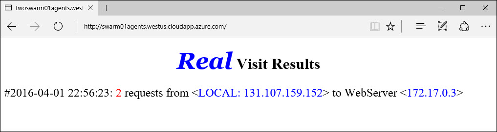

<properties
   pageTitle="Azure Container Container Servicemanagement mit Docker Swarm | Microsoft Azure"
   description="Bereitstellen Sie Container für eine Docker Swarm in Azure Container Dienst"
   services="container-service"
   documentationCenter=""
   authors="neilpeterson"
   manager="timlt"
   editor=""
   tags="acs, azure-container-service"
   keywords="Docker, Container, Micro-Dienste Mesos, Azure"/>

<tags
   ms.service="container-service"
   ms.devlang="na"
   ms.topic="get-started-article"
   ms.tgt_pltfrm="na"
   ms.workload="na"
   ms.date="09/13/2016"
   ms.author="timlt"/>

# <a name="container-management-with-docker-swarm"></a>Verwaltung von Container mit Docker Swarm

Docker Punktschwarms stellt eine Umgebung zum Bereitstellen von Sammelartikeleinheit Auslastung über einen der gepoolten Satz von Docker Hosts bereit. Docker Punktschwarms verwendet die systemeigene Docker-API. Der Workflow für die Verwaltung von Containern auf eine Docker Swarm ist fast identisch mit was es auf einem einzelnen Container Host wäre. Dieses Dokument enthält ein einfaches Beispiel dafür Sammelartikeleinheit Auslastung in einer Instanz Azure Container Dienst Docker Swarm bereitstellen. Weitere ausführliche Informationen zu auf Docker Swarm finden Sie unter [Docker Swarm auf Docker.com](https://docs.docker.com/swarm/).

Zu den Übungen in diesem Dokument erforderliche Komponenten:

[Erstellen Sie einen Punktschwarms Cluster in Azure Container-Dienst](container-service-deployment.md)

[Verbinden Sie mit dem Punktschwarms Cluster in Azure Container-Dienst](container-service-connect.md)

## <a name="deploy-a-new-container"></a>Bereitstellen eines neuen Containers

Verwenden Sie zum Erstellen eines neuen Containers in der Docker Swarm der `docker run` Befehl (um sicherzustellen, dass Sie einen Tunnel SSH auf den Mastern gemäß der oben genannten erforderliche Komponenten geöffnet haben). In diesem Beispiel erstellt einen Container aus der `yeasy/simple-web` Bild:


```bash
user@ubuntu:~$ docker run -d -p 80:80 yeasy/simple-web

4298d397b9ab6f37e2d1978ef3c8c1537c938e98a8bf096ff00def2eab04bf72
```

Verwenden Sie nach der Container erstellt wurde, `docker ps` , um Informationen zu den Container zurückzukehren. Wie Sie sehen, dass der Punktschwarms-Agent, der den Container gehostet wird aufgeführt wird:


```bash
user@ubuntu:~$ docker ps

CONTAINER ID        IMAGE               COMMAND                  CREATED             STATUS              PORTS                 NAMES
4298d397b9ab        yeasy/simple-web    "/bin/sh -c 'python i"   31 seconds ago      Up 9 seconds        10.0.0.5:80->80/tcp   swarm-agent-34A73819-1/happy_allen
```  

Sie können nun die Anwendung zugreifen, die in diesem Container durch den öffentlichen DNS-Namen des Punktschwarms Agent Lastenausgleich ausgeführt wird. Sie finden diese Informationen im Azure-Portal:  


  

Standardmäßig weist Lastenausgleich Ports 80, 8080 und 443 öffnen. Wenn Sie einen anderen Anschluss eine Verbindung herstellen möchten, müssen Sie diesen Port auf dem Azure Lastenausgleich für den Agent Pool zu öffnen.

## <a name="deploy-multiple-containers"></a>Bereitstellen von mehreren Containern

Wie mehrere Container durch Ausführen 'Docker ausführen' mehrmals, gestartet werden, können Sie die `docker ps` Befehl angezeigt, die den Container hostet auf ausführen. Im folgenden Beispiel werden drei Container gleichmäßig auf die drei Punktschwarms Agents verteilen:  


```bash
user@ubuntu:~$ docker ps

CONTAINER ID        IMAGE               COMMAND                  CREATED             STATUS              PORTS                 NAMES
11be062ff602        yeasy/simple-web    "/bin/sh -c 'python i"   11 seconds ago      Up 10 seconds       10.0.0.6:83->80/tcp   swarm-agent-34A73819-2/clever_banach
1ff421554c50        yeasy/simple-web    "/bin/sh -c 'python i"   49 seconds ago      Up 48 seconds       10.0.0.4:82->80/tcp   swarm-agent-34A73819-0/stupefied_ride
4298d397b9ab        yeasy/simple-web    "/bin/sh -c 'python i"   2 minutes ago       Up 2 minutes        10.0.0.5:80->80/tcp   swarm-agent-34A73819-1/happy_allen
```  

## <a name="deploy-containers-by-using-docker-compose"></a>Bereitstellen von Containern mithilfe von Docker verfassen

Verfassen Sie Docker können Sie die Bereitstellung und Konfiguration von mehreren Containern automatisieren. Hierzu stellen Sie sicher, dass ein Tunnel Secure Shell (SSH) erstellt wurde und die Variable DOCKER_HOST (siehe die erforderlichen Komponenten oben) festgelegt wurde.

Erstellen einer Docker-compose.yml-Datei auf Ihrem lokalen System. Verwenden Sie hierzu in diesem [Beispiel](https://raw.githubusercontent.com/rgardler/AzureDevTestDeploy/master/docker-compose.yml)ein.

```bash
web:
  image: adtd/web:0.1
  ports:
    - "80:80"
  links:
    - rest:rest-demo-azure.marathon.mesos
rest:
  image: adtd/rest:0.1
  ports:
    - "8080:8080"

```

Führen Sie `docker-compose up -d` um den Container Bereitstellungen zu starten:


```bash
user@ubuntu:~/compose$ docker-compose up -d
Pulling rest (adtd/rest:0.1)...
swarm-agent-3B7093B8-0: Pulling adtd/rest:0.1... : downloaded
swarm-agent-3B7093B8-2: Pulling adtd/rest:0.1... : downloaded
swarm-agent-3B7093B8-3: Pulling adtd/rest:0.1... : downloaded
Creating compose_rest_1
Pulling web (adtd/web:0.1)...
swarm-agent-3B7093B8-3: Pulling adtd/web:0.1... : downloaded
swarm-agent-3B7093B8-0: Pulling adtd/web:0.1... : downloaded
swarm-agent-3B7093B8-2: Pulling adtd/web:0.1... : downloaded
Creating compose_web_1
```

Schließlich wird die Liste der aktiven Container zurückgegeben. In dieser Liste angezeigt, die Container, die mithilfe von Docker verfassen bereitgestellt wurden:


```bash
user@ubuntu:~/compose$ docker ps
CONTAINER ID        IMAGE               COMMAND                CREATED             STATUS              PORTS                     NAMES
caf185d221b7        adtd/web:0.1        "apache2-foreground"   2 minutes ago       Up About a minute   10.0.0.4:80->80/tcp       swarm-agent-3B7093B8-0/compose_web_1
040efc0ea937        adtd/rest:0.1       "catalina.sh run"      3 minutes ago       Up 2 minutes        10.0.0.4:8080->8080/tcp   swarm-agent-3B7093B8-0/compose_rest_1
```

Können natürlich `docker-compose ps` lediglich die Container definiert Untersuchen der `compose.yml` Datei.

## <a name="next-steps"></a>Nächste Schritte

[Weitere Informationen zu Docker Swarm](https://docs.docker.com/swarm/)
