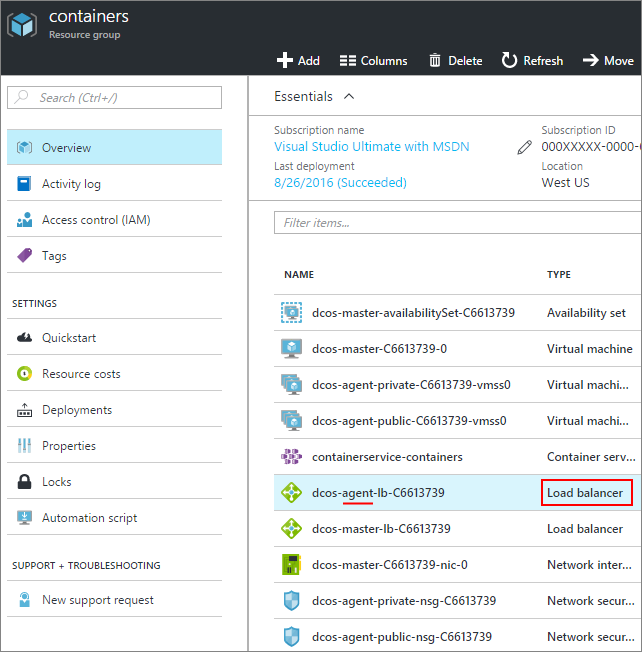

<properties
   pageTitle="Aktivieren von öffentlichen Zugriff zu einer app ACS | Microsoft Azure"
   description="Informationen zum öffentlichen Zugriff auf eine Azure Container Service aktivieren."
   services="container-service"
   documentationCenter=""
   authors="Thraka"
   manager="timlt"
   editor=""
   tags="acs, azure-container-service"
   keywords="Docker, Container, Micro-Dienste Mesos, Azure"/>

<tags
   ms.service="container-service"
   ms.devlang="na"
   ms.topic="article"
   ms.tgt_pltfrm="na"
   ms.workload="na"
   ms.date="08/26/2016"
   ms.author="timlt"/>

# Aktivieren des öffentlichen Zugriffs auf eine Azure Container Service-Anwendung

Alle DC/OS Container im ACS- [Agent öffentlichen Ressourcenpool](container-service-mesos-marathon-ui.md#deploy-a-docker-formatted-container) wird automatisch mit dem Internet verfügbar gemacht. Standardmäßige Ports **80**, **443** **8080** geöffnet sind und jeder (öffentlich) Container diese Ports Abhören zugegriffen werden kann. In diesem Artikel wird gezeigt, wie Sie weitere Ports für die Anwendung in Azure Container Dienst zu öffnen.

## Öffnen Sie einen Port (Portal) 

Zuerst müssen wir den Port zu öffnen, die, den wir möchten.

1. Melden Sie sich mit dem Portal aus.
2. Suchen Sie die Ressourcengruppe aus, der Sie der Azure Container-Dienst bereitgestellt.
3. Wählen Sie Agent Lastenausgleich (die ähnliche **XXXX-Agent-lb-XXXX**heißt) aus.

    

4. Klicken Sie auf **Suchen** , und klicken Sie dann auf **Hinzufügen**.

    

5. Füllen Sie das Formular Prüfpunkt, und klicken Sie auf **OK**.

  	| Feld | Beschreibung |
  	| ----- | ----------- |
  	| Namen  | Ein aussagekräftiger Name für den Prüfpunkt werden soll. |
  	| Port  | Der Port des Containers zu testen. |
  	| Pfad  | (Wenn im HTTP-Modus) Der Pfad relativ Website Prüfpunkt. HTTPS nicht unterstützt. |
  	| Intervall | Die Zeitdauer zwischen Prüfpunkt versucht in Sekunden an. |
  	| Fehlerhafte Schwellenwert | Anzahl der aufeinander folgenden Prüfpunkt Versuche, bevor Sie sich mit den Container fehlerhaft. | 
    

6. Klicken Sie in den Eigenschaften des Agent Lastenausgleich auf **Regeln Lastenausgleich laden** und klicken Sie dann auf **Hinzufügen**.

    

7. Füllen Sie das Laden Lastenausgleich Formular, und klicken Sie auf **OK**.

  	| Feld | Beschreibung |
  	| ----- | ----------- |
  	| Namen  | Ein beschreibender Name des Lastenausgleich. |
  	| Port  | Der öffentlichen eingehenden Port. |
  	| Back-End-Anschluss | Der interne öffentlichen Port des Containers zum Weiterleiten von Datenverkehr an. |
  	| Back-End-Ressourcenpool | Der Container in diesem Pool werden das Ziel für diese Lastenausgleich. |
  	| Prüfpunkt | Der Prüfpunkt verwendet, um festzustellen, ob das Ziel in die **Back-End-Ressourcenpool** fehlerfrei ist. |
  	| Beibehaltung der Sitzung | Bestimmt, wie Datenverkehr von einem Client für die Dauer der Sitzung behandelt werden soll.  **Keine**: aufeinander folgende Anfragen desselben Clients können von einem beliebigen Container bewältigt werden. **Client-IP-**: aufeinanderfolgende das gleiche Client-IP-Anfragen vom gleichen Container verarbeitet werden. **Client-IP- und -Protokoll**: aufeinander folgende Anfragen dieselbe Client IP-Adresse und das Protokoll Kombination von demselben Container verarbeitet werden. |
  	| Im Leerlauf timeout | (Nur TCP) In Minuten, öffnen Sie die Zeit für einen TCP/HTTP-Client beibehalten unabhängig von *Keepalive -* Nachrichten. |

## Fügen Sie eine Sicherheitsregel (Portal)

Als Nächstes müssen wir eine Sicherheitsregel hinzufügen, die von unserem geöffnete Port durch die Firewall den Datenverkehr weiterleiten.

1. Melden Sie sich mit dem Portal aus.
2. Suchen Sie die Ressourcengruppe aus, der Sie der Azure Container-Dienst bereitgestellt.
3. Wählen Sie die **öffentlichen** Agent Netzwerksicherheitsgruppe (mit dem **XXXX-Agent-öffentlichen-Nsg-XXXX**ähnliche Namen).

    

4. Wählen Sie **eingehende Sicherheitsregeln** und dann auf **Hinzufügen**.

    

5. Füllen Sie die Firewall-Regel zu Ihrer öffentlichen Port erlauben, und klicken Sie auf **OK**.

  	| Feld | Beschreibung |
  	| ----- | ----------- |
  	| Namen  | Ein beschreibender Name der Firewallregel. |
  	| Priorität | Prioritätsrang für die Regel. Je niedriger die Nummer desto höher die Priorität. |
  	| Datenquelle | Einschränken des eingehenden IP-Adressbereichs um zulässig sein oder verweigert, indem Sie diese Regel. Formular mit **einem beliebigen** keine Beschränkung anzugeben. |
  	| Dienst | Wählen Sie eine Reihe von vordefinierten Dienste, die, denen für diese Sicherheitsregel ist. Verwenden Sie andernfalls **Benutzerdefiniert** , um eigene erstellen. |
  	| Protokoll | Beschränken Sie den Datenverkehr basierend auf **TCP** oder **UDP**. Formular mit **einem beliebigen** keine Beschränkung anzugeben. |
  	| Port-Bereich | Wenn **Dienst** **Benutzerdefiniert**ist, gibt den Bereich der Ports, die diese Regel wirkt sich auf. Sie können einen einzelnen Port, z. B. **80**oder einen Zellbereich wie **1024-1500**verwenden. |
  	| Aktion | Zulassen Sie oder verweigern Sie Datenverkehr, die die Kriterien entsprechen. |

## Nächste Schritte

Lernen Sie den Unterschied zwischen [öffentlichen und privaten DC/OS-Agents](container-service-dcos-agents.md)aus.

Lesen Sie weitere Informationen zum [Verwalten Ihrer DC/OS Container](container-service-mesos-marathon-ui.md).