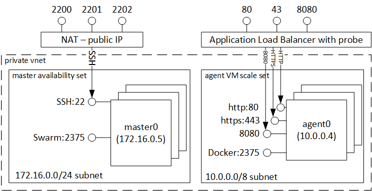

<properties
   pageTitle="Container Azure Service Einführung | Microsoft Azure"
   description="Azure Container-Dienst bietet eine Möglichkeit zur Vereinfachung der Erstellung, Konfiguration und Verwaltung von einem Cluster von virtuellen Computern, die zum Ausführen von Applications Sammelartikeleinheit vorkonfiguriert sind."
   services="container-service"
   documentationCenter=""
   authors="rgardler"
   manager="timlt"
   editor=""
   tags="acs, azure-container-service"
   keywords="Docker, Container, Micro-Dienste Mesos, Azure"/>

<tags
   ms.service="container-service"
   ms.devlang="na"
   ms.topic="article"
   ms.tgt_pltfrm="na"
   ms.workload="na"
   ms.date="09/13/2016"
   ms.author="rogardle"/>

# Azure Service Container Einführung

Azure Container Service erleichtert das Erstellen, konfigurieren und Verwalten von einem Cluster von virtuellen Computern, die zum Ausführen von Applications Sammelartikeleinheit vorkonfiguriert sind. Es wird eine optimierte Konfiguration von beliebte Source öffnen-Planung und Orchestrierung Tools verwendet. So können Sie Ihre vorhandene Kenntnisse verwenden oder eine große und wachsende Textkörper Community Erfahrung, zum Bereitstellen und Verwalten von Container-basierten Anwendungen auf Microsoft Azure zu zeichnen.

Azure Container Service nutzt das Format Docker Container, um sicherzustellen, dass Ihre Anwendungscontainer vollständig portabel sind. Es unterstützt auch Ihrer Wahl Marathon und DC/OS oder Docker Swarm, sodass diese Applikationen Tausende von Containern oder sogar Dutzende Tausendertrennzeichen skaliert werden kann.

Mithilfe von Azure Container Dienst, können Sie der Enterprise-Noten Features von Azure nutzen bei weitgehender weiterhin Anwendungsportabilität – einschließlich Portabilität bei der Orchestrierung Ebenen.

Mithilfe von Container Azure Service
-----------------------------

Unser Ziel mit Azure Container Service ist zum Angeben eines Containers hostumgebung mithilfe der Open-Source-Tools und Technologien, die heute beliebte zwischen unsere Kunden sind. Zu diesem Zweck verfügbar machen wir die standardmäßige API Endpunkte für Ihre ausgewählten Orchestrator (DC/OS oder Docker Swarm). Mithilfe dieser Endpunkte können Sie keine Software nutzen, die ein Gespräch mit diesen Endpunkten kann. Beispielsweise bei den Endpunkt Docker Swarm können Sie die Docker line Interface (CLI) verwenden. Für DC/OS können Sie die DCOS CLI verwenden.

Erstellen eines Docker Clusters mit Azure Container-Dienst
-------------------------------------------------------

Um mithilfe von Azure Container Service beginnen, stellen Sie einen Azure Container Dienst Cluster über das Portal (Suche nach 'Azure Container Service'), mithilfe einer Vorlage Azure Ressourcenmanager ([Docker Swarm](https://github.com/Azure/azure-quickstart-templates/tree/master/101-acs-swarm) oder [DC/OS](https://github.com/Azure/azure-quickstart-templates/tree/master/101-acs-dcos)) oder über die [CLI](/documentation/articles/xplat-cli-install/). Vorlagen bereitgestellten Schnellstart können geändert werden, um zusätzliche oder erweiterte Azure Konfiguration enthalten. Weitere Informationen zum Bereitstellen von eines Clusters Azure Container Service finden Sie unter [Bereitstellen einer Azure Container Dienst Cluster](container-service-deployment.md).

Bereitstellen einer Anwendung
------------------------

Azure Container-Dienst bietet eine Auswahl an Docker Swarm oder DC/OS für Orchestrierung. Wie Sie die Anwendung bereitstellen, hängt von Ihrer Wahl der Orchestrator ab.

### Verwenden von DC/OS

DC/OS ist ein verteilt Betriebssystem auf dem Apache Mesos verteilte Systeme Kernel basiert. Apache Mesos wird mit einem bei der Apache Software Foundation und enthält einige der [größte Namen in IT](http://mesos.apache.org/documentation/latest/powered-by-mesos/) als Benutzer und Mitwirkenden.

DC/OS und Apache Mesos umfassen ein Feature ausdrucksstarke festlegen:

-   Bewährte Skalierbarkeit

-   Fehlertoleranz repliziert Master und Slaves Apache ZooKeeper verwenden

-   Unterstützung für Docker formatierten Container

-   Systemeigene Isolationsgrad zwischen Aufgaben mit Linux Container

-   Multiresource Planung (Arbeitsspeicher, CPU, Datenträger und Ports)

-   Java, Python und C++-APIs für die Entwicklung von neuer paralleler Applikationen

-   Ein Web-Benutzeroberfläche für die Anzeige von Cluster Zustand

Standardmäßig umfasst DC/OS auf Azure Container Dienst die Marathon Orchestrierung Plattform für die Planung von Auslastung. Lieferumfang der DC/OS-Bereitstellung von ACS ist jedoch der Menge Mesosphere Dienste, die Ihrem Dienst hinzugefügt werden können, diese Spark, Hadoop, Cassandra und vieles mehr enthalten.

#### Verwenden von Marathon

Marathon ist für den gesamten Cluster Initialisierung und Steuerelement-System für Dienste Cgroups – oder bei Azure Container Dienst Container Docker formatiert. Marathon bietet eine Webbenutzeroberfläche, die von der Anwendung bereitgestellt werden kann. Sie können dies bei einer URL, die sieht ungefähr wie folgt aus zugreifen `http://DNS_PREFIX.REGION.cloudapp.azure.com` , in dem DNS\_Präfix "und" REGION sind zum Zeitpunkt der Bereitstellung definiert. Natürlich können Sie auch Ihre eigenen DNS-Namen bereitstellen. Weitere Informationen zum Ausführen eines Containers das Marathon Web-Benutzeroberfläche verwenden finden Sie unter [Container Management über das Web-Benutzeroberfläche](container-service-mesos-marathon-ui.md).

Sie können auch die REST-APIs verwenden, für die Kommunikation mit Marathon. Es gibt eine Reihe von Clientbibliotheken, die für die einzelnen Tools zur Verfügung stehen. Diese Deckblatt einer Vielzahl von Sprachen – und natürlich können Sie das HTTP-Protokoll in eine andere Sprache verwenden. Darüber hinaus unterstützen viele beliebter DevOps Tools Marathon. Dies bietet maximale Flexibilität für Ihr Team Vorgänge aus, wenn Sie beim Arbeiten mit einer Azure Container Dienst Cluster. Weitere Informationen zum Ausführen eines Containers mithilfe der Marathon REST-API finden Sie unter [Container-Management mit die REST-API](container-service-mesos-marathon-rest.md).

### Verwenden von Docker Punktschwarms

Docker Punktschwarms bietet native Cluster für Docker. Da Docker Swarm der standardmäßigen Docker-API fungiert, kann alle Tool, die bereits mit Docker Daemon kommuniziert transparent an mehrere Hosts Azure Container Dienst skalieren Punktschwarms verwenden.

Unterstützte Tools für die Verwaltung von Container auf einem Cluster Punktschwarms einschließen, aber nicht die folgenden:

-   Dokku

-   Verfassen Sie Docker CLI und Docker

-   Krane

-   Jenkins

Videos
------

Erste Schritte mit Azure Container Service (101):  

> [AZURE.VIDEO azure-container-service-101]

Erstellen von Applications mithilfe von Container Azure Service (Build 2016)

> [AZURE.VIDEO build-2016-building-applications-using-the-azure-container-service]
