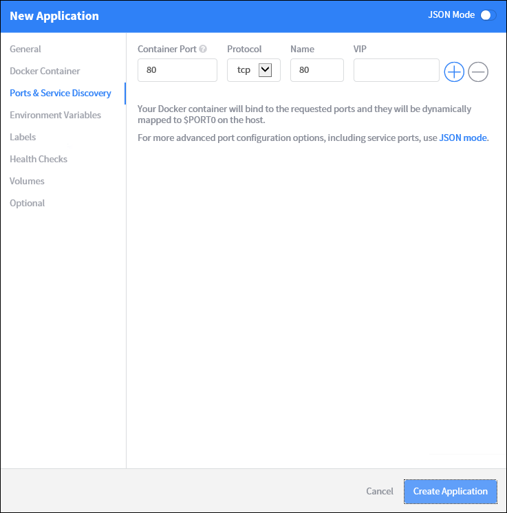

<properties
   pageTitle="Azure Container Container Servicemanagement über das Web-Benutzeroberfläche | Microsoft Azure"
   description="Stellen Sie Container in einer Azure Container Clusterdienst mithilfe das Marathon Web-Benutzeroberfläche an."
   services="container-service"
   documentationCenter=""
   authors="neilpeterson"
   manager="timlt"
   editor=""
   tags="acs, azure-container-service"
   keywords="Docker, Container, Micro-Dienste Mesos, Azure"/>

<tags
   ms.service="container-service"
   ms.devlang="na"
   ms.topic="get-started-article"
   ms.tgt_pltfrm="na"
   ms.workload="na"
   ms.date="09/19/2016"
   ms.author="timlt"/>

# <a name="container-management-through-the-web-ui"></a>Container Management über das Web-Benutzeroberfläche

DC/OS bietet es sich um eine Umgebung für die Bereitstellung und gruppierte Auslastung, während die zugrunde liegenden Hardware zu skalieren. Auf DC/OS ist es ein Framework, das Planen und Ausführen von berechnen Auslastung verwaltet.

Während Framework für viele beliebte Auslastung verfügbar sind, wird dieses Dokument beschrieben, wie Sie erstellen und Container Bereitstellungen mit Marathon skalieren können. Vor dem Durcharbeiten in diesen Beispielen benötigen Sie einen DC/OS Cluster aus, der in Azure Container Dienst konfiguriert ist. Sie müssen außerdem remote Connectivity mit diesem Cluster haben. Weitere Informationen zu diesen Elementen finden Sie unter den folgenden Artikeln:

- [Bereitstellen eines Azure Container Dienst Clusters](container-service-deployment.md)
- [Verbinden Sie mit einem Cluster Azure Container Service](container-service-connect.md)

## <a name="explore-the-dcos-ui"></a>Untersuchen der DC/OS-Benutzeroberfläche

Navigieren Sie zu http://localhost/, mit einem Secure Shell (SSH) Tunnel eingerichtet. Laden das DC/OS-Web-Benutzeroberfläche, und zeigt Informationen zum Cluster, wie z. B. verwendeten Ressourcen, aktiven-Agents und Dienste.


## <a name="explore-the-marathon-ui"></a>Untersuchen der Marathon UI

Wenn der Benutzeroberfläche Marathon anzeigen möchten, navigieren Sie zu http://localhost/Marathon. Dieser Bildschirm können Sie einen neuen Container oder eine andere Anwendung auf dem Cluster Azure Container Dienst DC/OS starten. Sie können auch finden Sie unter Informationen zum Ausführen von Containern und Applikationen.  


## <a name="deploy-a-docker-formatted-container"></a>Bereitstellen eines Containers Docker formatierten

Um einen neuen Container mithilfe von Marathon bereitstellen möchten, klicken Sie auf die Schaltfläche **Anwendung erstellen** , und geben Sie die folgenden Informationen in das Formular:

Feld           | Wert
----------------|-----------
ID              | nginx
Bild           | nginx
Netzwerk         | Bridged
Host Port       | 80
Protokoll        | TCP




Wenn Sie einen Port auf dem Agent statisch den Container Anschluss zuordnen möchten, müssen Sie JSON-Modus verwenden. Wechseln Sie hierzu der Assistent neue Anwendung in den **JSON-Modus** mithilfe der Schalter ein. Geben Sie dann die folgenden unter der `portMappings` Abschnitt der Anwendungsdefinition. In diesem Beispiel bindet Port 80 des Containers an Port 80 des DC/OS-Agents. Nachdem Sie diese Änderung vorgenommen haben, können Sie mit diesem Assistenten aus dem JSON-Modus wechseln.

```none
"hostPort": 80,
```


DC/OS Cluster wird mit einer Reihe von öffentlichen und privaten Agents bereitgestellt. Für den Cluster Applications aus dem Internet zugreifen können müssen Sie die Programme auf einen öffentlichen Agent bereitstellen. Dazu wählen Sie die Registerkarte **Optional** des Assistenten neue Anwendung, und geben Sie **Slave_public** für die **Ressource Rollen akzeptiert**.


Klicken Sie auf der Hauptseite von Marathon sehen Sie den Bereitstellungsstatus für den Container.


Wenn Sie zurück zu der DC/OS-Web-Benutzeroberfläche (http://localhost/) wechseln, sehen Sie sich, dass eine Aufgabe (in diesem Fall eines Containers Docker formatierten) auf dem DC/OS Cluster ausgeführt wird.


Sie können auch Cluster-Knoten anzeigen, den die Aufgabe ausgeführt wird, klicken Sie auf.


## <a name="scale-your-containers"></a>Ihre Container skalieren

Die Benutzeroberfläche Marathon können Sie die Anzahl der Instanzen eines Containers skalieren. Dazu, navigieren Sie zu der Seite **Marathon** , wählen Sie den Container, den Sie skalieren möchten, und klicken Sie auf die Schaltfläche " **Skalierung** ". Klicken Sie im Dialogfeld **Skalierung Anwendung** Geben Sie die Anzahl der Instanzen Container die gewünschte, und wählen Sie **Farben-Skala aus**.


Nach dem Beenden der Operation skalieren, sehen Sie mehrere Instanzen des gleichen Vorgangs auf DC/OS-Agents verteilt.


## <a name="next-steps"></a>Nächste Schritte

- [Arbeiten Sie mit DC/OS und die Marathon-API](container-service-mesos-marathon-rest.md)

Tiefer Azure-Container mit Mesos Dienst

> [AZURE. VIDEO] Azurecon-2015-deep-dive-on-the-azure-container-service-with-mesos]
