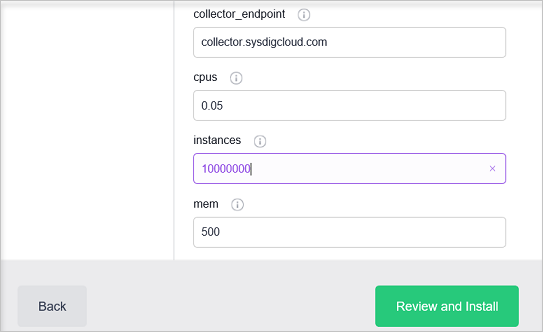

<properties
   pageTitle="Überwachen von einem Azure Container Dienst Cluster mit Sysdig | Microsoft Azure"
   description="Überwachen eines Azure Container Dienst Clusters mit Sysdig an."
   services="container-service"
   documentationCenter=""
   authors="rbitia"
   manager="timlt"
   editor=""
   tags="acs, azure-container-service"
   keywords="Container, DC/OS, Azure"/>

<tags
   ms.service="container-service"
   ms.devlang="na"
   ms.topic="get-started-article"
   ms.tgt_pltfrm="na"
   ms.workload="na"
   ms.date="08/08/2016"
   ms.author="t-ribhat"/>

# Überwachen von einem Azure Container Dienst Cluster mit Sysdig

In diesem Artikel werden wir die Agent-Knoten in Ihrem Cluster Azure Container Dienst Sysdig Agents bereitstellen. Für diese Konfiguration benötigen Sie ein Konto bei Sysdig. 

## Erforderliche Komponenten 

[Bereitstellen](container-service-deployment.md) und [Verbinden](container-service-connect.md) eines Cluster von Azure Container Dienst konfiguriert. Untersuchen der [Marathon Benutzeroberfläche](container-service-mesos-marathon-ui.md). Wechseln Sie zu [http://app.sysdigcloud.com](http://app.sysdigcloud.com) , um eine Sysdig Cloud-Konto einzurichten. 

## Sysdig

Sysdig ist eine überwachenden Dienst, der Sie Ihrem Container in Ihren Cluster überwachen kann. Sysdig ist bekannt, dass Sie bei der Problembehandlung helfen, aber auch grundlegenden überwachen metrischen für CPU, Speicher, Netzwerke und e/a-ist. Sysdig erleichtert das finden Sie unter welche Container arbeiten am schwierigsten oder im Wesentlichen verwenden, die am häufigsten Arbeitsspeicher und CPU. Diese Ansicht ist im Abschnitt "Übersicht", die derzeit in Beta ist. 

 

## Konfigurieren einer Sysdig bereitstellungs mit Marathon

Diese Schritte werden gezeigt, wie konfigurieren und Sysdig Applikationen zum Cluster mit Marathon bereitstellen. 

Zugriff auf Ihre DC/OS Benutzeroberfläche mittels [http://localhost: 80 /](http://localhost:80/) nur ein Mal in der Benutzeroberfläche DC/OS navigieren Sie zu "Universums", also unten links, und suchen Sie nach "Sysdig".

Um die Konfiguration abzuschließen benötigen Sie jetzt ein Sysdig Cloud oder eine kostenlose Testversion Benutzerkonto. Nachdem Sie in der Cloud-Website Sysdig angemeldet sind, klicken Sie auf Ihren Benutzernamen, und finden Sie auf der Seite Ihre "Zugriffstaste". 

 

Geben Sie anschließend Ihre Zugriffstaste in die Konfiguration Sysdig innerhalb der DC/OS Menge ein. 

Jetzt festlegen, die die Instanzen zu 10000000 sobald Cluster Sysdig ein neuer Knoten hinzugefügt wird automatisch auch bereitstellen Agent für diesen Knoten. Dies ist eine Lösung zwischenzeitlichen, um sicherzustellen, dass Sysdig auf alle neuen Agents innerhalb der Cluster bereitgestellt wird. 

Nachdem Sie installiert haben das Paket navigieren Sie zurück zu den Sysdig UI und zwar die verschiedenen Verwendung Metrik für den Containern innerhalb der Cluster durchsuchen können. 