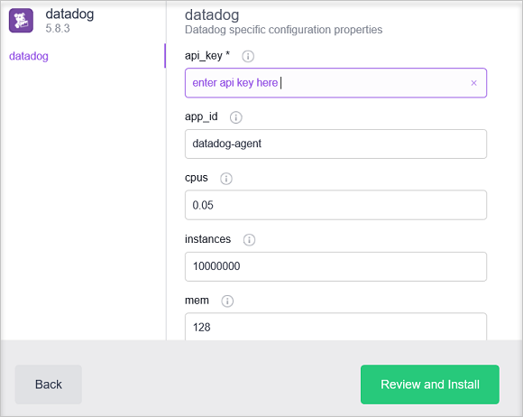

<properties
   pageTitle="Überwachen von einem Azure Container Dienst Cluster mit Datadog | Microsoft Azure"
   description="Überwachen eines Azure Container Dienst Clusters mit Datadog an. Verwenden Sie das Web-DC/OS Benutzeroberfläche Datadog-Agents zum Cluster bereitstellen."
   services="container-service"
   documentationCenter=""
   authors="rbitia"
   manager="timlt"
   editor=""
   tags="acs, azure-container-service"
   keywords="Container, DC/OS, Docker Punktschwarms, Azure"/>

<tags
   ms.service="container-service"
   ms.devlang="na"
   ms.topic="article"
   ms.tgt_pltfrm="na"
   ms.workload="infrastructure"   
   ms.date="07/28/2016"
   ms.author="t-ribhat"/>

# Überwachen von einem Azure Container Dienst Cluster mit Datadog

In diesem Artikel werden wir die Agent-Knoten in Ihrem Cluster Azure Container Dienst Datadog Agents bereitstellen. Sie benötigen ein Konto bei Datadog für diese Konfiguration. 

## Erforderliche Komponenten 

[Bereitstellen](container-service-deployment.md) und [Verbinden](container-service-connect.md) eines Cluster von Azure Container Dienst konfiguriert. Untersuchen der [Marathon Benutzeroberfläche](container-service-mesos-marathon-ui.md). Wechseln Sie zu [http://datadoghq.com](http://datadoghq.com) , um eine Datadog Konto einzurichten. 

## Datadog 

Datadog ist eine überwachenden Dienst, der Überwachung Daten von Ihrem Container in Ihren Cluster Azure Container Dienst gesammelt. Datadog verfügt über eine Docker Integration Dashboard, in dem Sie bestimmte Kennzahlen innerhalb der Container sehen können. Daten aus Ihrem Container gesammelt werden nach CPU, Speicher, Netzwerk und e/a-angeordnet. Datadog teilt Kennzahlen in Containern und Bildern. Ein Beispiel für wie die Benutzeroberfläche für die CPU-Auslastung aussieht ist unter.

## Konfigurieren einer Datadog bereitstellungs mit Marathon

Diese Schritte werden gezeigt, wie konfigurieren und Datadog Applikationen zum Cluster mit Marathon bereitstellen. 

Zugriff auf Ihre DC/OS Benutzeroberfläche mittels [http://localhost: 80 /](http://localhost:80/). Nur ein Mal in der Benutzeroberfläche DC/OS navigieren Sie zu "Universums" also unten links, und suchen Sie nach "Datadog", und klicken Sie auf "Installieren".

Zum Fertigstellen der Konfiguration werden Sie jetzt ein Datadog oder eine kostenlose Testversion Benutzerkonto benötigen. Nachdem Sie das Aussehen des Datadog-Website auf der linken Seite angemeldet sind, und wechseln Sie zur Integration-API des >. 

Geben Sie als Nächstes den API Key, in die Konfiguration Datadog innerhalb der Menge DC/OS. 

 

In der Konfiguration oben Instanzen festgelegt sind, dass 10000000 dies ein neuer Knoten Datadog wird automatisch einen Agent zu diesem Knoten bereitstellen Cluster hinzugefügt wird. Dies ist eine zwischenzeitlichen Lösung. Nachdem Sie das Paket installiert haben, das sollten Sie navigieren Sie zurück zu der Website Datadog und Suchen nach "Dashboards". Von dort aus sehen Sie benutzerdefinierte und Integration Dashboards. Die Docker Integration Dashboard haben alle Container-Kriterien, die Sie für Ihren Cluster Überwachung müssen. 
