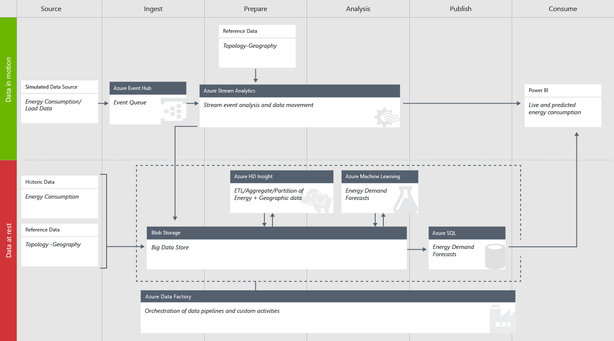

<properties
    pageTitle="Cortana Intelligence Lösung Vorlage Playbook für Demand Planung der Aufwand | Microsoft Azure"
    description="Eine Lösung Vorlage mit Microsoft Cortana Intelligence, die bei Bedarf für ein Aufwand Programm Unternehmen SCHÄTZER hilft."
    services="cortana-analytics"
    documentationCenter=""
    authors="ilanr9"
    manager="ilanr9"
    editor="yijichen"/>

<tags
    ms.service="cortana-analytics"
    ms.workload="data-services"
    ms.tgt_pltfrm="na"
    ms.devlang="na"
    ms.topic="article"
    ms.date="01/24/2016"
    ms.author="ilanr9;yijichen;garye"/>

# Cortana Intelligence Lösung Vorlage Playbook für Demand Planung der Aufwand  

## Geschäftsleitung Zusammenfassung  

In den letzten Jahren haben Internet der Dinge (IoT), alternativen Aufwand Quellen und große Daten zusammengeführt, um große Verkaufschancen in der Domäne Programm und Aufwand zu erstellen. Zur gleichen Zeit haben das Programm und die gesamte Aufwand Sector Verbrauch reduzieren mit Nutzer anspruchsvolle bessere Möglichkeiten zum Steuern der Verwendung von Energy gesehen. Daher sind das Programm und smart Raster Unternehmen benötigt dringend Innovationen und erneuern selbst ein. Darüber hinaus werden viele Power und Utility Raster immer veraltet und sehr teure zu verwalten und zu verwalten. Im letzten Jahr hat das Team an eine Reihe von Aufträgen innerhalb der Domäne Aufwand gearbeitet. Bei diesen Fällen wurden wir vielen Fällen gefunden, in denen die Dienstprogramme oder ISVs (Independent Software Lieferanten) gesucht haben in Planung für zukünftige Aufwand bei Bedarf. Diese Vorhersagen spielen eine wichtige Rolle in ihrer aktuellen und zukünftigen Business und die Grundlage für die verschiedenen verwenden Fällen geworden. Hierzu gehören kurz- und langfristig Power laden SCHÄTZER, Handel, den Lastenausgleich, Raster Optimierung usw.. Big Data und erweiterte Analytics (AA) Methoden, wie z. B. Computer Learning (ML) sind die wichtigsten Faktoren für die Erstellung von Genauigkeit und Zuverlässigkeit Vorhersagen.  

In diesem Playbook wir zusammengestellt, die Business und analytischen Richtlinien für eine erfolgreiche Entwicklung erforderlich und Bereitstellung von Energy Demand SCHÄTZER Lösung. Diese vorgeschlagenen Richtlinien können Dienstprogramme, Daten Wissenschaftler und Ingenieure von Daten beim Herstellen vollständig operationalized, cloudbasierten, bei Bedarf Prognose Lösungen helfen. Für Unternehmen, die nur ihre big Data und erweiterte Analytics Reise gestartet werden, kann eine solche Lösung der Startwert in ihrer langfristiges smart Raster Strategie darstellen.

>[AZURE.TIP] Zum Herunterladen eines Diagramms, das bietet einen Überblick über diese Vorlage finden Sie unter [Cortana Intelligence Lösungsvorlage Architektur für Demand Planung der Aufwand](cortana-analytics-architecture-demand-forecasting-energy.md).  

## (Übersicht)  

Dieses Dokument beschreibt die Business, Daten und technischen Aspekte der Verwendung von Cortana Intelligence und in bestimmten Azure maschinellen Learning (AML) für die Implementierung und Bereitstellung von Energy Prognostizieren von Lösungen. Das Dokument besteht aus drei Hauptteilen:  

1. Business Grundlegendes zu  
2. Grundlegendes zu die Daten  
3. Technische Implementierung

Das Webpart **Business Grundlegendes zu** werden den Business Aspekt, muss eine verstehen und vor der Entscheidung für eine Investition zu berücksichtigen sind. Es wird erläutert, wie qualifizieren des Problems des Unternehmens zur hand, um sicherzustellen, dass Vorhersageanalytik und Computer-Schulung tatsächlich um wirksam und verfügbar sind. Das Dokument weiter erläutert die Grundlagen der Computer lernen und wie sie genutzt werden Aufwand prognostizieren Probleme behoben werden. Es werden die erforderlichen Komponenten und die Qualifikationskriterien einer Anfrage verwenden. Einige Beispiele für verwenden Fällen und Business Groß-/Kleinschreibung auch Szenarien bereitgestellt werden.

Daten sind die wichtigsten Bestandteil für alle Computer learning Lösung. Der **Daten Grundlegendes zu** Teil dieses Dokuments werden einige wichtige Aspekte der Daten behandelt. Es werden die Arten von Daten, die für Energy prognostizieren, Daten Qualität Anforderungen und welche Datenquellen vorhanden sein, in der Regel erforderlich ist. Zudem wird erläutert, wie die unformatierten Daten zum Datenfeatures vorbereiten, die das Webpart Modellierung tatsächlich Laufwerk verwendet werden.

Der dritte Teil des Dokuments behandelt den **Technischen Implementierung** Aspekt einer Lösung. Feature technisch und Modellierung sind das Herzstück des Prozesses Wissenschaft Daten und werden deshalb einige ausführlich erläutert werden. Es behandelt des Konzepts der Webdienste, die eine wichtige Fahrzeug für Cloudbereitstellung von Lösungen Vorhersageanalytik sind. Wir Gliedern Sie auch eine normale Architektur einer operationalized End-to-End-Lösung.

Das Dokument enthält darüber hinaus Referenzmaterial, die Sie verwenden können, und das Verständnis der Domäne und Technologie finden Sie heraus.

Es ist wichtig, beachten Sie, dass wir nicht beabsichtigen, die in diesem Dokument Deckblatt tieferen Wissenschaft von Daten, die mathematische und technische Aspekte. Diese Details finden Sie in der [Dokumentation Azure ML](http://azure.microsoft.com/services/machine-learning/) und [Blogs](http://blogs.microsoft.com/blog/tag/azure-machine-learning/).

### Zielgruppe   
Die Zielgruppe für dieses Dokument ist sowohl Business und technisches Personal, die Kenntnisse erhalten möchten und Verständnis maschinellen Learning Grundlage Lösungen und wie diese speziell innerhalb der Domäne Aufwand prognostizieren genutzt werden.

Daten Wissenschaftler können auch nutzbringend Lesen dieses Dokuments, um besser zu verstehen des Prozesses auf hoher Ebene, die die Bereitstellung von einer Lösung prognostizieren Aufwand Laufwerke zu erhalten. In diesem Zusammenhang sie können auch zum Herstellen verwendet eine solide und Ausgangspunkt für Weitere detaillierte und erweiterte Material.

### Industry Trends  
In den letzten Jahren haben IoT, alternativen Aufwand Quellen und große Daten zusammengeführt, um große Verkaufschancen im Bereich Programm und Aufwand zu erstellen. Zur gleichen Zeit haben das Programm und den gesamten Aufwand Bereichen Verbrauch reduzieren mit Nutzer anspruchsvolle bessere Möglichkeiten zum Steuern der Verwendung von Energy gesehen.

Viele Programm und Energy smart Unternehmen haben Pionierarbeit wurde [smart Raster](https://en.wikipedia.org/wiki/Smart_grid) durch die Bereitstellung von einer Anzahl verwenden, die Fälle, in denen vornehmen, die auf das Raster Daten verwenden. Verwenden Sie häufig im Wesentlichen die gehörende Merkmale der Stromerzeugung: kann nicht Gesamtzeit noch reservieren als Inventory gespeichert. Ja, was erzeugt wird, muss verwendet werden. Dienstprogramme, mit denen Sie effizienter arbeiten sollen müssen Stromverbrauch einfach SCHÄTZER Aufwand Schwundes, **verringern Treibhausgasen Gas Emission**und Steuerelement Kosten da, die sie besser in der Lage zu **Doppelraten Angebot und Nachfrage**erhält, daher verhindern.

Bei der Kommunikation von Kosten, ist es ein weiterer wichtiger Aspekt, also Preis. Neue Funktionen Power zwischen Dienstprogramme Handel haben in eine hervorragende müssen **SCHÄTZER zukünftigen Bedarf und zukünftigen Preis von Elektrizität**eingebracht hat. Damit können Sie bestimmen, deren Herstellung Datenmengen Unternehmen.

Wenn wir das Wort 'SmartArt' verwenden, verweisen wir tatsächlich an einem Raster, die Informationen und nehmen Sie dann Vorhersagen kann. Sie können überlegen, welche saisonale Änderungen in Verbrauch sowie **erwarten vorübergehenden Überlastung Situationen und dafür automatisch anpassen**. Durch Überwachung des Remote Verbrauch (mit Hilfe der folgenden smart Meter), können die lokalisierten Überladung Situationen behandelt werden. **Indem Sie zuerst Vorhersage und dann gilt**, wird im Raster selbst optimiertes über einen Zeitraum.

Im weiteren Verlauf dieses Dokuments wir liegt der Schwerpunkt auf bestimmten Familien verwenden Fälle, in denen der Zukunft prognostizieren behandelt kurzfristig und langfristig Aufwand bei Bedarf. Wir gearbeitet haben in diesen Bereichen für einige Monate und einige Knowledge und Qualifikation, mit denen uns Industry Noten Ergebnissen führen erzielt haben. Anderen Fällen verwenden werden in Kürze ebenfalls im Dokument behandelt.

## Business Grundlegendes zu

### Business Ziele
Das Ziel **Aufwand Demo** wird veranschaulicht, wie eine normale Vorhersageanalytik und Computer lernen die Lösung, die in einem Rahmen kürzester Zeit bereitgestellt werden kann. Insbesondere ist unsere aktuelle Fokus zum Aufwand Demand Wettervorhersage angezeigt werden Lösungen aktivieren, damit ihres geschäftlichen Werts schnell realisiert und bei genutzt. Die Informationen in diesem Playbook helfen den Kunden die folgenden Ziele erledigen:
-   Kurze Zeit Wert der maschinellen Learning basierte Lösung
-   Möglichkeit zum Erweitern eines Pilotprojekts verwenden Fall anderen Fällen verwenden oder einen größeren Bereich basierend auf ihre geschäftliche Notwendigkeit
-   Erlangen Sie schnell Kenntnisse zu Produkten Cortana Intelligence Suite

Mit unter Berücksichtigung dieser Ziele soll diese Playbook ausliefern von der Business und technisches Wissen, das diese Ziele dabei helfen.

### Power-laden und bei Bedarf Prognose
Innerhalb der Sector Aufwand könnte vielen Möglichkeiten, welche Nachfrage prognostizieren helfen kann kritische geschäftliche Probleme zu lösen. Tatsächlich kann bei Bedarf prognostizieren die Grundlage für viele Core verwenden Fälle, in der Branche angesehen werden. Im Allgemeinen wir zwei Arten von Energy Demand Vorhersagen berücksichtigen: kurzfristig und langfristig. Jeweils möglicherweise einen anderen Zweck dienen und eine andere Vorgehensweise zu nutzen. Der wichtigste Unterschied zwischen den beiden ist der Prognose Horizont, d. h., den Zellbereich, der Uhrzeit in der Zukunft für die wir SCHÄTZER würden.

#### Kurze Ausdruck Last Prognose
Innerhalb des Kontexts der Aufwand Demand kurze Ausdruck laden prognostizieren (STLF) als die aggregierten laden definiert, dem bald für verschiedene Teile des Rasters (oder das Raster als Ganzes) prognostizierte ist. In diesem Zusammenhang ist kurzfristig benutzerspezifisch Zeithorizont innerhalb des Bereichs von 1 Stunde auf 24 Stunden definiert. In einigen Fällen ist auch ein voreingestellter von 48 Stunden möglich. Daher kommt STLF häufig in einem Fall Handhabung des Rasters. Hier sind einige Beispiele für STLF leistungsgesteuert Fällen verwenden:
-   Angebot und Nachfrage Lastenausgleich
-   Unterstützung für Power Handel
-   Markt machen (Einstellung Power Preis)
-   Raster Betrieb Optimierung
-   [Bei Bedarf Antwort](https://en.wikipedia.org/wiki/Demand_response)
-   Maximale Demand Prognose
-   Seite projektbedarfsmanagement
-   Lastenausgleich und überladen prevention
-   Langfristig laden Prognose
-   Fehlerstrukturanalyse und Anomalien Erkennung
-   Höchstwert Abgeltung/Abgleich 

STLF Modell basieren hauptsächlich auf der Vergangenheit nahe (letzter Tag oder Woche) Verbrauchsdaten und Verwendung prognostizierte Temperatur als eine wichtige Vorhersage. Beziehen Sie genau Temperatur Planung für die nächste Stunde und von 24 Stunden wird immer kleiner komplizierter jetzt Tage. Diese Modelle sind weniger vertrauliche saisonale Muster oder langfristig Verbrauchstrends.

SLTF Solutions sind auch wahrscheinlich umfangreicher Vorhersage Anrufe (Serviceanfragen) generieren, da sie stündlich und in einigen Fällen sogar mit höheren Häufigkeit aufgerufen wird werden. Es ist auch häufig finden Sie unter Integration, in dem jeder einzelne Unterwerk oder Transformator als eigenständigen Modell dargestellt wird und die Lautstärke der Vorhersage Anfragen sind daher noch stärkere.

#### Langfristig laden Prognose
Das Ziel der langen Ausdruck Last prognostizieren (LTLF) ist prognostizieren Power bei Bedarf mit einem Mal Horizont Zahl von 1 Woche, mehrere Monate (und in einigen Fällen für eine Anzahl von Jahren). Dieser Zellbereich Horizont ist in der Hauptsache für die Planung verfügbar und Investition Anwendungsmöglichkeiten.

Langfristiges Szenarien ist es wichtig, Daten von hoher Qualität sein, die eine Spanne der mehrere Jahre (minimale 3 Jahre) behandelt. Diese Modelle in der Regel saisonbedingten Muster aus den zurückliegenden Daten extrahieren und nehmen Sie beispielsweise die Verwendung von externen Predicators aus, die Sie als Wetter und Klima Mustern.

Es ist wichtig, um zu verdeutlichen, dass die länger Prognose Horizont ist, weniger genau die Planung möglicherweise. Es ist daher wichtig, können einige Konfidenzintervall zusammen mit der tatsächlichen Planung erstellt Menschen, um die möglichen Variation in deren Planungsprozesses berücksichtigen möchten.

Da das Verbrauch Szenario für LTLF hauptsächlich Planung ist, können wir dann viel unteren Vorhersage Datenmengen (im Vergleich zu STLF) erwarten. Wir möchten in der Regel finden Sie unter diese eingebettete in Visualisierungstools, wie etwa Excel oder PowerBI Vorhersagen und manuell vom Benutzer aufgerufen werden.

### Kurze Ausdruck im Vergleich zu lange Ausdruck Vorhersage
Die folgende Tabelle vergleicht STLF und LTLF in Bezug auf die wichtigsten Attribute:

|Attribut|SCHÄTZER kurzfristig laden|Langfristig laden Prognose|
|---|---|---|
|SCHÄTZER Horizont|Von 1 Stunde auf 48 Stunden|Von 1 bis 6 Monaten oder mehr|
|Genauigkeit von Daten|Pro Stunde|Stündlich oder täglich|
|Typische Nutzung von Fällen|<ul><li>Nachfrage/Lieferung Lastenausgleich</li><li>Wählen Sie die Stunde Prognose</li><li>Bei Bedarf Antwort</li></ul>|<ul><li>Langfristig Planung</li><li>Raster Posten Planung</li><li>Ressourcenplanung</li></ul>|
|Typische vorausgesagt|<ul><li>Tag oder eine Woche</li><li>Stunde des Tages</li><li>Stündlich Temperatur</li></ul>|<ul><li>Monat des Jahres</li><li>Tag des Monats</li><li>Langfristig Temperatur und Klima</li></ul>|
|Zurückliegende Datenbereich|Zwei oder drei Jahren Einheiten im Wert von Daten|5 bis 10 Dienstjahre Einheiten im Wert von Daten|
|Typische Genauigkeit|MAPE * von 5 % kleiner oder gleich|MAPE * von 25 % kleiner oder gleich|
|SCHÄTZER Häufigkeit|Gefertigt stündlich oder alle 24 Stunden|Nachdem Monats-, Quartals- oder Jahreskalender mit gefertigt|
\*[MAPE](https://en.wikipedia.org/wiki/Mean_absolute_percentage_error) – Mittelwert durchschnittliche prozentuale zurück

Wie aus dieser Tabelle gesehen werden können, ist es wichtig ganz unterscheiden, die kurz- oder langfristig Szenarien prognostizieren, wie diese verschiedenen geschäftliche Anforderungen darstellen und anderen Bereitstellung und individuelle Nutzung aufweisen.

### Anwendungsfall-Beispiel 1: eSmart Systeme – Überladung Optimierung
Eine wichtige Rolle eines [smart Raster](https://en.wikipedia.org/wiki/Smart_grid) besteht darin, dynamisch und ständig optimieren und für die ändern Verbrauchsmuster anpassen. Stromverbrauch kann kurzfristig Änderungen auswirken, die hauptsächlich von Temperaturschwankungen verursacht werden (*z.*B. mehr Leistung für Air Bedingung oder Heizung verwendet). Zur gleichen Zeit wird die Stromverbrauch auch von Trends langfristiges beeinflusst. Dies können saisonbedingten Effekte, nationale Feiertage, langfristiges Verbrauch Wachstum und sogar economic Faktoren wie Consumer Index, Oil Preis und GDP enthalten.

In diesem Fall verwenden wollten [eSmart](http://www.esmartsystems.com/) eine Cloud-basierte Lösung bereitstellen, die die von vornherein von eine Überlastung herbeiführen auf alle angegebenen Unterwerk des Rasters Vorhersage ermöglicht. ESmart wollten vor allem Unterwerke zu identifizieren, die wahrscheinlich innerhalb der nächsten Stunde, überladen sind, damit Sie sofortige eine Aktion ergriffen werden könnten, um zu verhindern oder die Situation lösen.

Eine genaue und schnelles Durchführung Vorhersage erfordert Implementierung von drei Vorhersage Modelle:
-   Lange Ausdruck Modell ermöglicht, die Planung der Stromverbrauch auf jede Unterwerk während der nächsten einige Wochen oder Monaten
-   Kurzfristig Modell, die Vorhersage von Überlastung herbeiführen auf einer angegebenen Unterwerk während der nächsten Stunde ermöglicht.
-   Temperatur-Modell, das bietet Prognostizieren des zukünftigen Temperatur über mehrere Szenarien

Das Ziel des Modells langfristiges besteht darin, die Unterwerken durch ihre (die angegebene ihrer Power Übertragungskapazität) während der nächsten Woche oder Monat Überladen von vornherein Rangfolge. Dadurch wird die Erstellung einer kurzen Liste Unterwerke, die als Eingabe für die kurzfristig Vorhersage dienen würden. Wie Temperatur eine wichtige Vorhersage für das Modell langfristiges ist, besteht die Notwendigkeit ständig mit mehreren Szenario Temperatur Vorhersagen Naturprodukte und diese als Eingabe in dem Modell langfristiges feed. Die Planung kurzfristig wird dann zum Vorhersagen, welche Unterwerk wahrscheinlich über die nächsten Stunde überladen wird aufgerufen.

Die kurz- und langfristig Modelle werden einzeln pro jedes Unterwerk bereitgestellt. Daher erfordert die praktische Ausführung dieser Modelle umfassende Orchestrierung. Um eine höhere Vorhersage Genauigkeit kurzfristig zu erhalten, wird eine detailliertere Modell für jede Stunde des Tages ausschließlich. Alle diese Modelle stündlich ausgeführt werden und Ausführung in wenigen Minuten zum Berechnen Sie genügend Zeit zu reagieren und bei Bedarf vorbeugende Aktionen abzuschließen. Diese Sammlung von Datenmodellen wird von regelmäßige Umschulung mithilfe der aktuellen Daten auf dem neuesten Stand gehalten.

Weitere Informationen zu diesem Anwendungsfall-finden Sie [hier](https://customers.microsoft.com/Pages/CustomerStory.aspx?recid=18945).

#### Verwenden von Groß-/Kleinschreibung Qualifikationskriterien – erforderliche Komponenten
Die wichtigste Stärke der Cortana Intelligence ist in deren leistungsfähige Möglichkeit zum Bereitstellen und skalieren maschinellen Learning orientierte Lösungen. Es ist auf Tausende von Vorhersagen ausgelegt, die gleichzeitig ausgeführt werden. Sie können automatisch skalieren, um eine geändert Verbrauchstyp entsprechen. Eine Lösung Fokus befindet sich daher auf Genauigkeit und berechnete Leistung. Ein Programm Unternehmen beträgt beispielsweise Herstellung genau Aufwand bei Bedarf für die nächste Stunde und für jede Stunde des Tages SCHÄTZER interessiert. Andererseits, wir beantwortet die Frage, warum die Anforderung regressionsgleichung ist dargestelltes werden ist weniger interessiert sind (das Modell selbst wird Schritt übernehmen).

Es ist daher zu beachten, dass nicht für alle Fälle verwenden und geschäftliche Probleme können effektiv mit maschinellen Learning gelöst werden.

Cortana Intelligence und Computer-Schulung könnte höchst effektiv lösen eines Problems angegebenen Business, wenn die folgenden Kriterien erfüllt sind:
-   Des Problems des Unternehmens in Hand ist **Vorhersage** Natur. Ein Beispiel für Vorhersagen verwenden die Groß-/Kleinschreibung wird ein Programm Unternehmen, die Power Belastung einer angegebenen Unterwerk während der nächsten Stunde vorhersagen möchten. Analysieren und Rangfolge der Treiber von zurückliegenden Demand wäre andererseits, **beschreibenden** in Art und daher weniger gilt.
-   Es gibt einen klaren **Pfad der Aktion** absolviert werden, sobald die Vorhersage verfügbar ist. Beispielsweise kann eine Überladung auf einer Unterwerk während der nächsten Stunde Vorhersage auslösen eine proaktive Aktion laden, die die Unterwerk zugeordnet ist zu verringern und somit potenziell eine Überladung zu verhindern.
-   Die Anwendungsfall-stellt einen **normalen Art des Problems** solche, die bei lösen des vorliegenden es können weltumspannende lösen ähnlichen Fällen verwenden.
-   Der Kunden kann **quantitativen und qualitativen Ziele** , um zu veranschaulichen, eine erfolgreiche Lösung Implementierung festlegen. Beispielsweise wäre ein guter quantitative Ziel für Energy Demand SCHÄTZER den oberen Schwellenwert der erforderlichen Genauigkeit (*z.*B. bis zu 5 % Fehler ist zulässig) oder wenn Vorhersage Unterwerk überladen klicken Sie dann die Genauigkeit (WAHR positive Satz) und Rückruf (soweit WAHR positiver Ergebnisse) sollten über einen bestimmten Schwellenwert. Diese Ziele sollte der vom Kunden Business Ziele abgeleitet werden.
-   Es ist ein Löschen **Integrationsszenario** mit Business-Workflow des Unternehmens. Beispielsweise kann die Unterwerk laden SCHÄTZER in das Raster neue Steuerzentrum Überladung Prevention Aktivitäten dürfen integriert werden.
-   Der Kunde hat sofort zu **Daten mit ausreichende Qualität** verwenden, um die Anwendungsfall-(Siehe mehr im nächsten Abschnitt, **Qualität der Daten**, der diese Playbook) zu unterstützen.
-   Der Kunde berücksichtigt Cloud orientierte Datenarchitektur oder **maschinelle cloudbasierten learning**, einschließlich Azure ML und andere Cortana Intelligence Suite-Komponenten.
-   Der Kunde sind, **eine durchgehende Datenfluss** die Fertigungsanlagen herstellen ist die Übermittlung von Daten in der Cloud kontinuierlichen Produktlizenzierung, und die Lösung zu **Prozessen umsetzen** möchte.
-   Der Kunde ist bereit sind, **weisen Sie Ressourcen** , die bei der anfänglichen Pilotprojekt Implementierung aktiv beschäftigt sein werden, damit wissen und Besitzer der Lösung an den Kunden nach dem erfolgreichen Abschluss übertragen werden können.
-   Die Ressource der Kunden sollten ein **professionelles erfahrenen Daten**, vorzugsweise eine Daten Scientist.

Qualifikation von einem Anwendungsfall-, basierend auf den oben angegebenen Kriterien kann erheblich zur Verbesserung der Erfolg Sätzen einer Anfrage verwenden und einen guten Beachhead zur Durchführung von Fällen für eine zukünftige Verwendung einrichten.

### Cloudbasierten Lösungen
Cortana Intelligence Suite auf Azure ist eine integrierte Umgebung, die in der Cloud gespeichert ist. Die Bereitstellung von einer erweiterten Analytics-Lösung in einen Cloud-Umgebung enthält wesentliche Vorteile für Unternehmen und zur gleichen Zeit große Änderung für Unternehmen bedeuten können, die lokal IT-Lösungen weiterhin verwenden. Innerhalb der Aufwand Sector gibt es ein Trend Löschen der schrittweisen Migration von JOIN-Operationen in der Cloud. Dieser Trend geht miteinander zusammen mit der Entwicklung des Rasters smart wie oben in der **Branchentrends**beschrieben. Wie diese Playbook auf eine Cloud-basierte Lösung in der Domäne Aufwand gerichtet sind, ist es wichtig, Erläutern Sie die Vorteile und weitere Aspekte der Bereitstellung einer Cloud-basierte Lösung.

Vielleicht ist der größte Vorteil von eine Cloud-basierte Lösung die Kosten. Als Lösung nutzt Komponenten Cloud bereitgestellt, es gibt keine vorab-Kosten oder WARENEINSATZ (Kosten verkaufter Waren) Komponentenkosten zugeordnet. Dies bedeutet, dass es ist nicht erforderlich in Hardware, Software- und IT-Wartung investieren, und daher wesentliche Verminderung des Risikos für Business besteht.

Ein weiterer wichtiger Vorteil ist die Kostenstruktur je nach Bedarf berechnet cloudbasierten Lösungen. Cloud-basierte Server Computing-Segment oder Speicher können bereitgestellt und auf einer nur-Bedarf skaliert werden. Hierbei handelt es sich um die Kosten Effizienz nutzen eine Cloud-basierte Lösung.

Es ist schließlich nicht erforderlich, für die Investition in IT-Wartung oder zukünftigen Infrastrukturentwicklung, wie all dies das Angebot cloudbasierten gehört. Diese Handlungen Cortana Intelligence Suite umfasst das beste Klasse Services und behält seine Wegweiser Weiterentwicklung. Neue Features, Komponenten und Funktionen werden beständig eingeführt und weiterentwickelt.

Nach einem Unternehmen, die gerade den Übergang in die Cloud gestartet wird, empfehlen wir sind hochgradig schrittweisen Ausführen, indem Sie eine Cloud Migrations-Wegweiser. Wir glauben, dass für Dienstprogramme und in der Aufwand Domäne Unternehmen, die Fällen verwenden, die in dieser Playbook erläutert werden eine hervorragende Möglichkeit für testen Vorhersageanalytik Lösungen in der Cloud darstellen.

#### Geschäftliche Groß-/Kleinschreibung Ausrichtung Aspekte
In vielen Fällen möglicherweise der Kunden interessiert, eine Business Ausrichtung für einen angegebenen Anwendungsfall-, in dem wichtige Komponenten einer Cloud-basierte Lösung und Computer-Schulung sind. Im Gegensatz zu einer Lösung lokal, wenn eine Cloud-basierte Lösung die im Vorfeld Kostenkomponente ist minimal und die meisten Kostenelemente stehen im Zusammenhang mit der tatsächlichen Verwendung. Wenn es sich um eine Lösung auf Cortana Intelligence Suite prognostizieren Aufwand bereitstellen geht, können mehrere Dienste mit einer einzelnen allgemeine Kostenstruktur integriert werden. Beispielsweise Datenbanken (*z.*B. SQL Azure) zum Speichern der unformatierten Daten verwendet werden können, und klicken Sie dann für die eigentliche Trends Azure ML wird verwendet, um die Prognose Dienste hosten. In diesem Beispiel kann die Kostenstruktur Speicher und Transaktionen Komponenten enthalten.

Andererseits, sollte eine gute Kenntnisse über den geschäftlichen Wert von Betriebssystemen ein Aufwand Demand prognostizieren (kurz- oder langfristig) haben. Tatsächlich ist es wichtig, geschäftlichen Nutzen der einzelnen Vorgänge Wettervorhersage angezeigt werden. Beispielsweise genau prognostizieren Power Laden der nächsten 24 Stunden kann verhindern, dass Overproduction oder eine Überlastung des Rasters zu vermeiden helfen und dies kann in Bezug auf finanzielle Spareinlagen täglich quantifiziert werden.

Eine einfache Formel zur Berechnung der finanziellen Vorteile der Demand SCHÄTZER Lösung wäre: 

Da Cortana Intelligence Suite ein je nach Bedarf berechnet Preisgestaltung Modell bereitgestellt, ist nicht erforderlich für eine Komponente Fixkosten zu dieser Formel anfallen. Diese Formel kann auf täglich, monatlich oder jährlich Basis berechnet werden.

Aktuelle Cortana Intelligence Suite und Azure ML Preise Pläne finden Sie [hier](http://azure.microsoft.com/pricing/details/machine-learning/).

### Entwicklung Lösungsprozess
Entwicklungszyklus einer Aufwand Nachfrage prognostizieren, dass die Lösung umfasst in der Regel 4 Phasen, in dem alle Wir stellen Verwenden von cloudbasierte Technologies und-Diensten innerhalb der Cortana Intelligence-Suite auf.

Dies ist in der folgenden Abbildung dargestellt:

Der folgende Absatz beschreibt dieser Schritt 4:

1.  **Datensammlung** – alle erweiterten Analytics-basierte Lösung abhängig von Daten (siehe **Daten Grundlegendes zu**). Insbesondere wenn es sich um Vorhersageanalytik und prognostizieren geht, benötigen wir laufenden, dynamische Datenfluss. Bei Energy Demand prognostizieren, diese Daten können smart Meter direkt bezogen oder bereits auf einer Datenbank auf Prem aggregiert werden. Wir verlassen sich auch auf anderen externen Datenquellen wie Wetter und Temperatur aus. Dieser laufenden Datenfluss muss koordiniert, geplant und gespeichert werden. [Factory Azure-Daten](http://azure.microsoft.com/services/data-factory/) (ADF) ist unsere Hauptfenster Arbeit für diese Aufgabe durchzuführen.
2.  **Modellieren** – für Genauigkeit und Zuverlässigkeit Aufwand sagt voraus, muss eine entwickeln (Zug) und eine gute Modell macht zurückliegende Daten verwenden und extrahiert die aussagekräftigen und Vorhersage Muster in den Daten verwalten. Der Bereich der Computer Learning (ML) weist mit erweiterte Algorithmen regelmäßig entwickelt wurde schnell wachsende wurde. Azure ML Studio bietet eine großartige Benutzerfunktionalität, die die am häufigsten erweiterten ML Algorithmen in einem Flow Durchführen der Arbeit nutzen kann. Dieser Workflow wird in eine intuitive Datenflussdiagramm dargestellt und enthält die Daten zur Vorbereitung, Extraktion von Features, modellieren und Modell Auswertung. Der Benutzer kann in hundert verschiedene Modelle ziehen, die in dieser Umgebung enthalten sind. Am Ende dieser Phase, eine Scientist Daten ein Arbeitsmodells müssen, das vollständig ausgewerteten und für die Bereitstellung bereit ist.

    Das folgende Diagramm ist eine Abbildung der Workflow normalerweise:

    

3.  **Bereitstellung** – besteht der nächste Schritt Bereitstellung mit einem Arbeitsmodell in Hand und. Hier wird das Modell in einem Webdienst konvertiert, die ein Rest API verfügbar gemacht, die über das Internet aus verschiedenen Verbrauch Clients gleichzeitig aufgerufen werden können. Azure ML bietet eine einfache Methode zum Bereitstellen eines Modells direkt von der Azure ML Studio mit einem einzigen Klick eine Schaltfläche aus. Der gesamte Bereitstellungsprozess passiert Erweiterte Einstellungen. Diese Lösung kann automatisch skalieren, um die erforderlichen Verbrauch entsprechen.

4.  **Verbrauch** – In dieser Phase wir tatsächlich Stellen des Modells Prognose verwenden, um vorhersagen zu erzeugen. Die von einer Anwendung (*z. B.*, Dashboard) gesteuert werden kann oder direkt aus einer laufenden System z. B. Demand/Lieferung Lastenausgleich System oder eine Lösung zur Optimierung von Raster. Mehrere verwenden Fällen können aus einem einzelnen Modell gesteuert werden.

## Grundlegendes zu die Daten
Nach der Behandlung (siehe **Business Grundlegendes zu**) Business Aspekte einer Aufwand Nachfrage prognostizieren Lösung, können wir nun den Webpart diskutieren. Alle Vorhersageanalytik Lösung beruht auf zuverlässigen Daten. Für Prognostizieren von Energy Demand abhängig wir zurückliegenden Verbrauchsdaten mit verschiedenen Ebenen Genauigkeit. Die zurückliegende Daten als die Rohstoffe verwendet werden. Es wird eine genaue Analyse werden, in der Daten bei vorausgesagt (auch als Funktionen bezeichnet) erkennen, die in einem Datenmodell platziert werden kann, die später die erforderlichen Vorhersagen generieren wird.

Die restlichen in diesem Abschnitt werden die verschiedenen Schritte und Aspekte für das Verständnis der Daten und wie Sie ihn zu einem Formular verwendbar wieder abrufen beschrieben.

### Modell Entwicklungszyklus
Gute Prognostizieren von Datenmodellen erfordert sorgfältige vorbereitende Schritte und Planung hergestellt werden. Wenn Sie den Modellierungsprozess in mehrere Schritte aufteilen und Konzentration auf einen Schritt nacheinander konnte deutlich das Ergebnis des gesamten Prozesses verbessern.

Das folgende Diagramm veranschaulicht, wie der Modellierungsprozess in mehrere Schritte unterteilt werden kann:

Wie zu sehen ist, dass der Zyklus sechs Schritten besteht aus:
-   Problem Formulierung
-   Daten Aufnahme und Durchsuchen von Daten
-   Vorbereiten der Daten und Features technisch
-   Modellierung
-   Modell Auswertung
-   Entwicklung

In den Rest der in diesem Abschnitt werden die einzelnen Schritte und Elemente berücksichtigen bei jedem Schritt beschrieben.

### Problem Formulierung
Wir können die Formulierung Problem als wichtigste Schritt berücksichtigen, die eine vor der Implementierung von Vorhersageanalytik ausführen muss. Hier möchten wir des Problems des Unternehmens transformieren und Gliedern sie bestimmte Elemente, die durch die Verwendung von Daten und modeling Techniken gelöst werden können. Es empfiehlt sich das Problem als eine Reihe von Fragen zu erstellen, die wir, die beantwortet werden soll. Hier sind einige möglichen Fragen, die möglicherweise innerhalb des Gültigkeitsbereichs von Energy Demand prognostizieren verfügbar:
-   Was ist die erwartete Last auf eine einzelne Unterwerk in der nächsten Stunde oder Tag?
-   Welche zum Zeitpunkt des Tages treten mein Raster Höchstwert Demand?
-   Wie wahrscheinlich ist meine Raster, um die erwarteten Höchstwert Auslastung bewältigen?
-   Wie viel Power sollte die Soulom während jede Stunde des Tages generieren?

Formulierung dieser Fragen kann uns Konzentration auf die richtigen Daten abrufen und Implementieren einer Lösung, die vollständig des Problems des Unternehmens zur hand ausgerichtet ist. Darüber hinaus können wir dann einige wichtigen Kriterien festlegen, mit denen uns für die Leistung des Modells ausgewertet werden soll. Angenommen, wie genau sollten die Planung, und was ist der Bereich zurück, die vom Unternehmen zulässigen weiterhin möchten?

### Datenquellen
Modernes smart Rasters sammelt Daten aus verschiedenen Teilen und Komponenten des Rasters ein. Diese Daten stellen verschiedene Aspekte des Vorgangs und die Nutzung des Rasters Power dar. In den Bereich der Aufwand Demand SCHÄTZER werden wir die Diskussion auf Datenquellen beschränken, die wirken sich auf den aktuellen Bedarf Verbrauch aus. Eine wichtige Quelle der Stromverbrauch sind smart Meter. Dienstprogramme auf der ganzen Welt bereitstellen smart Meter schnell für ihren Kunden. Intelligentes Meter den tatsächliche Stromverbrauch aufzeichnen und ständig weiterzuleiten diese Daten wieder in das Programm Unternehmen. Daten werden gesammelt und wieder in festen Intervallen von 5 Minuten bis hin zu 1 Stunde gesendet. Erweiterte smart Meter können Remote zum Steuern und Saldo der Istverbrauch innerhalb eines Haushalts programmiert werden. Intelligentes Meter Daten ist relativ zuverlässig und schließt einen Zeitstempel. So können sie ein wichtiger Bestandteil für SCHÄTZER Demand. Meter Daten können aggregiert werden (zusammengezählten) auf verschiedenen Ebenen der Suchtopologie Raster: *Transformer, Unterwerk, Region*. Wir können Sie dann die erforderlichen Aggregationsebene ein Modells Prognose dafür erstellen auswählen. Angenommen, wenn das Programm Unternehmen zukünftigen Auslastung auf jeder der zugehörigen Raster Unterwerke SCHÄTZER möchten klicken Sie dann alle Meter Daten können werden für jede einzelne Unterwerk zusammengefasst und als Eingabe für das Modell Prognose verwendet. Wir bezeichnen smart Meter als eine interne Datenquelle.

Eine zuverlässigen Aufwand Demand Planung wird auch auf andere externe Datenquellen verlassen. Ein wichtiger Faktor, den Stromverbrauch wirkt sich auf ist das Wetter oder genauer die Temperatur. Zurückliegende Daten zeigt starken Beziehung zwischen externen Temperatur und Stromverbrauch. Während wichtiges Sommer Tage, nehmen Sie Nutzer von deren Klimaanlagen und während der Winter Power auf Heizung verwenden. Eine zuverlässige Quelle der zurückliegenden Temperaturen an der Position des Rasters ist daher Schlüssel. Darüber hinaus benötigen wir auch genau Planung der Temperatur als eine Vorhersage der Stromverbrauch.

Andere externe Datenquellen können auch erstellen Aufwand Demand Prognose Modellen helfen. Dazu kann auch langfristig gehören Klima Änderungen und preisgünstige Indizes (*z.*B. GDP). In diesem Dokument werden wir nicht dazu anderer Datenquellen gehören.

### Datenstruktur
Nach dem Ermitteln der erforderlichen Datenquellen, möchten wir stellen Sie sicher, dass die richtigen Datenfeatures enthält, unformatierte Daten, die gesammelt wurden. Zum Erstellen einer zuverlässigen Demand Wettervorhersage angezeigt werden Modell müssen wir möchten sicherstellen, dass die erfassten Daten Datenelemente enthält, die den zukünftigen Bedarf Vorhersagen helfen können. Hier sind einige grundlegenden Vorschriften, die für die Datenstruktur (Schema), der die unformatierten Daten aus.

Die unformatierten Daten besteht aus Zeilen und Spalten. Jede Maße wird als eine einzelne Zeile mit Daten dargestellt. Jede Zeile von Daten enthält mehrere Spalten (auch als Features oder Felder bezeichnet).

1.  **Zeitstempel** – Timestamp-Feld stellt die tatsächliche Zeit, wenn die Maße angegeben wurde. Sie sollten eine allgemeine Datums-/Zeitformate entsprechen. Datum und die Uhrzeit Webparts soll eingeschlossen werden. In den meisten Fällen gibt es keine Notwendigkeit der Zeit, bis der zweiten Ebene der Genauigkeit erfasst werden soll. Es ist wichtig, die Zeitzone angeben, die die Daten gespeichert ist.
2.  **Meter-ID** – dieses Feld identifiziert den Meter oder das Gerät Maßeinheiten. Es kann ist eine kategorisierte Variable und eine Kombination aus Ziffern und Zeichen.
3.  **Wert für den Artikelverbrauch** – Dies ist der tatsächliche Verbrauch bei einem bestimmten Datum/Uhrzeit. Der Verbrauch gemessen werden kann, in kWh (Kilowatt-hour) oder eine beliebige andere bevorzugte Einheiten. Es ist wichtig, beachten Sie, dass die Maßeinheit über alle Maße in den Daten konsistent bleiben muss. In einigen Fällen kann Verbrauch über 3 Power Phasen bereitgestellt werden. In diesem Fall müssen wir alle unabhängigen Verbrauch Phasen sammeln.
4.  **Temperatur** – der Temperatur von eine unabhängige Quelle in der Regel erfasst. Es sollte jedoch mit der Verbrauchsdaten kompatibel sein. Sie sollten einen Zeitstempel wie zuvor beschrieben enthalten, mit der sie mit den Daten Istverbrauch synchronisiert werden können. Der Temperaturwert kann in Grad Celsius oder Fahrenheit angegeben werden, aber sollten über alle Maße konsistent bleiben.
5.  **Speicherort –** Das Feld "Speicherort" wird in der Regel den Ort, wo die Temperaturdaten gesammelt wurden, zugeordnet. Es kann als Zahl Zip-Code oder Breite/Länge (Lat/lang) Format dargestellt werden.

In den folgenden Tabellen werden Beispiele für ein guter Verbrauch und Temperatur Datenformat:

|**Datum**|**Zeit**|**Meter-ID**|**Phase 1**|**Phase 2**|**Phase 3**|
|--------|--------|------------|-----------|-----------|-----------|
|7/1/2015|10:00:00|ABC1234     |7.0        |2.1        |5.3        |
|7/1/2015|10:00:01|ABC1234     |7.1        |2.2        |4.3        |
|7/1/2015|10:00:02|ABC1234     |6.0        |2.1        |4.0        |

|**Datum**|**Zeit**|**Speicherort**|**Temperatur**|
|--------|--------|-------------|---------------|
|7/1/2015|10:00:00|11242        |24,4           |
|7/1/2015|10:00:01|11242        |24,4           |
|7/1/2015|10:00:02|11242        |24,5           |

Wie oben erwähnt, umfasst in diesem Beispiel 3 verschiedene Werte für die Ernährung 3 Power Phasen zugeordnet. Beachten Sie, dass die Felder Datum und Uhrzeit voneinander zu trennen, jedoch sie auch in einer einzigen Spalte kombiniert werden können. In diesem Fall wird die Spalte Ort in einem 5-stelliges Postleitzahl Format und die Temperatur in einem Format Grad Celsius dargestellt.

### Formatieren von Daten
Cortana Intelligence Suite kann die am häufigsten verwendeten Datenformate wie *CSV, TSV, JSON*unterstützen. Es ist wichtig, dass das Datenformat für den gesamten Lebenszyklus des Projekts konsistent bleibt.

### Erfassung von Daten
Da Aufwand Demand SCHÄTZER beständig und häufig regressionsgleichung ist, stellen wir sicher, dass die unformatierten Daten mit einer zuverlässigen Vollton und als Farbton Daten Aufnahme Vorgang fließt. Der Erfassung Prozess muss sichergestellt ist, dass die unformatierten Daten den entsprechenden Zeitpunkt für die Prognose Prozess verfügbar ist. Die setzt voraus, dass die Daten Aufnahme Häufigkeit größer als die Prognose Häufigkeit sein soll.

Beispiel: unsere Lösung prognostizieren Demand erzeugt eine neue Planung 8:00 Uhr täglich, und wir müssen Sie sicherstellen, dass alle Daten, die während der letzten 24 Stunden gesammelt wurden weist vollständig bis zu diesem Zeitpunkt aufgenommen und sogar müssen die letzte Stunde Daten enthalten.

Um diese Aufgabe auszuführen, bietet Cortana Intelligence Suite verschiedene Methoden zur Unterstützung von einer zuverlässigen Erfassung von Daten. Dies wird im Abschnitt **Bereitstellung** dieses Dokuments ausführlicher behandelt.

### Qualität der Daten
Unformatierte Datenquelle, die für die Durchführung zuverlässig und genau Demand prognostizieren erforderlich ist, muss einige grundlegende Daten Qualitätskriterien erfüllen. Obwohl erweiterte statistische Methoden für einige möglichen Daten Qualität Problem zukommen lassen verwendet werden können, müssen wir sicherstellen, dass wir einige Basis Daten Qualität Schwellenwert überschreiten werden, wenn neue Daten Aufnahme. Hier sind ein paar Überlegungen betreffend die Qualität der unformatierten Daten:
-   **Fehlender Wert** – Dies bezieht sich auf die Situation Wenn bestimmte Maße nicht erfasst wurden. Hier die grundlegende Anforderung ist, dass die fehlende Wert Rate nicht größer als 10 % für alle angegebenen Zeitraum sein soll. Im Fall, dass ein einzelner Wert ihm fehlt anzugeben, mithilfe eines vordefinierten Werts (zum Beispiel: '9999') und nicht "0" sich ein gültiges Maß handeln.
-   **Maßeinheiten Genauigkeit** – der tatsächliche Wert Verbrauch oder Temperatur sollte korrekt erfasst werden. Falsche Maße erzeugt falsche Vorhersagen. In der Regel sollten weniger als 1 % relativ zu den Wert true die Maße zurück.
-   **Zeitpunkt der Maße** – ist es erforderlich, dass der tatsächliche Zeitstempel Daten gesammelt werden nicht von mehr als 10 Sekunden relativ zu den tatsächlichen Zeitpunkt der tatsächlichen Maßeinheit abweichen.
-   **Synchronisierung** – Wenn mehrere Datenquellen verwendet werden (*z. B.*, Verbrauch und Temperatur) Wir müssen sicherstellen, dass es sind keine Zeit dazwischen Synchronisierungsprobleme. Dies bedeutet, dass die zeitlichen Differenz zwischen den zusammengestellten Zeitstempel aus einem beliebigen zwei unabhängigen Datenquellen werden nicht mehr als 10 Sekunden darf.
-   **Wartezeit** – wie oben in der **Erfassung von Daten**beschrieben sind wir einer zuverlässigen Daten Fluss und Aufnahme Prozess abhängig. So steuern Sie, die müssen wir sicherstellen, dass wir die Daten Wartezeit steuern. Dies wird angegeben, wie der zeitlichen Differenz zwischen dem Zeitpunkt an, dem die eigentliche Maße durchgeführt wurde und die Zeit, in der Cortana Intelligence Suite Speicher geladen wurde und einsatzbereit ist. Für kurzfristig laden sollte die Gesamtwartezeit prognostizieren nicht größer als 30 Minuten sein. Für lange Ausdruck Last sollte die Gesamtwartezeit prognostizieren nicht größer als 1 Tag sein.

### Vorbereiten der Daten und Features technisch
Sobald die unformatierten Daten wurde Motor angesaugten (siehe **Aufnahme Daten**) und sicher gespeichert wurde, kann er verarbeitet werden sollen. Vorbereitung der Daten im Wesentlichen die unformatierten Daten aufzeichnen und konvertieren (transformieren, Eckpunkte) es in ein Formular für die Modellierung Phase. Die einfache Aufgaben, wie unter Verwendung der Spalte unformatierten Daten mit tatsächlichen gemessen Wert, standardisierte Werte, komplexere JOIN-Operationen wie [Zeit als schwach](https://en.wikipedia.org/wiki/Lag_operator)und andere ungeändert einbeziehen Die neu erstellten Datenspalten werden als Datenfeatures bezeichnet, und diese beim Generieren wird als Feature technisch bezeichnet. Am Ende dieses Verfahren möchten wir einen neuen Datensatz haben, der weist die unformatierten Daten abgeleitet wurden und für die Modellierung verwendet werden kann. Darüber hinaus muss die Daten Vorbereitungsphase Achten Sie fehlende Werte (siehe **Qualität der Daten**) und diese anzugleichen. In einigen Fällen benötigen wir auch normalisieren die Daten, um sicherzustellen, dass alle Werte in der gleichen Skala dargestellt werden.

In diesem Abschnitt wir einige der allgemeinen Datenfeatures Liste, die in der Aufwand enthalten sind SCHÄTZER Demand Modelle.

**Zeit leistungsgesteuert Features:** Diese Features werden von dem Datum/Timestamp-Datentyp abgeleitet. Diese sind, extrahiert und in der Kategorieliste Features wie konvertiert wurde:
-   Zeit Tag – Dies ist die Stunde des Tages die Werte von 0 bis 23 annimmt.
-   Tag der Woche – dies den Tag der Woche darstellt, und übernimmt die Werte von 1 (Sonntag) bis 7 (Samstag)
-   Tag des Monats – Dies steht für das aktuelle Datum und können die erforderlichen Werte zwischen 1 und 31 zurück
-   Monat des Jahres – Dies stellt den Monat und übernimmt die Werte von 1 (Januar) bis 12 (Dezember)
-   Wochenende – Dies ist ein Binärwert-Feature, das die Werte von 0 für Wochentage oder 1 für Wochenende hat
-   Feiertag - Dies ist ein Binärwert Feature, die die Werte von 0 für eine normale Tag oder 1 für einen Feiertag akzeptiert
-   Fourieranalyse Ausdrücke – sind die Fourieranalyse Begriffe-Stärken, die den Zeitstempel abgeleitet sind und dienen zum Erfassen der saisonbedingten (Zyklen) in den Daten. Da wir mehrere Jahreszeiten in unseren Daten möglicherweise benötigen wir möglicherweise mehrere Fourieranalyse Ausdrücke. Beispielsweise können bei Bedarf Werte mit jährliche, Wochen- und Tageskalender Jahreszeiten/zyklischen arbeiten 3 Fourieranalyse Ausdrücke erreicht.

**Unabhängig Maße Features:** Die unabhängigen Funktionen umfassen die Data-Elemente, die wir als vorausgesagt in unseren Modell verwenden möchten. Hier schließen wir das abhängige Feature mit dem Beginn müssen wir vorhersagen möchten.
-   Positiven Feature – diese Zeit verschoben werden Werte in den aktuellen Bedarf. Beispielsweise werden Features positiven 1 den Wert bei Bedarf in der vorherigen Stunde (vorausgesetzt, stündliche Daten) relativ zu den aktuellen Zeitstempel enthalten soll. Wir kann auf ähnliche Weise hinzufügen positiven 2, 3, positiven *usw.*. Die tatsächliche Kombination von positiven Features, mit denen hängen davon der Phase Modellierung Bewertung der Modellergebnisse.
-   Langfristig beliebte – dieses Feature steht für einen linearen erhöhten Bedarf zwischen Jahre.

**Abhängige Features:** Das abhängige Feature ist die Datenspalte, die wir unser Modell vorhersagen möchten. Mit [Kontrolle maschinellen learning](https://en.wikipedia.org/wiki/Supervised_learning)müssen zuerst das Modell mit den abhängige Features Schulen (die auch als Beschriftungen bezeichnet). Dadurch wird das Modell lernen Sie die Muster in den Daten, die das abhängige Feature zugeordnet. Aufwand Nachfrage SCHÄTZER wir normalerweise den aktuellen Bedarf schätzen möchten und daher wir verwenden diese als die abhängige Features.

**Behandlung von fehlenden Werte:** Während der Vorbereitung der Daten benötigen wir die beste Strategie fehlende Werte behandelt zu bestimmen. Dies geschieht hauptsächlich mithilfe der verschiedenen statistischen [Methoden für die Herausgabepflicht](https://en.wikipedia.org/wiki/Imputation_(statistics)). Bei Energy Demand prognostizieren impute wir fehlende Werte in der Regel mithilfe des gleitenden Durchschnitt aus den vorherigen Datenpunkte verfügbar.

**Data Normalization:** Normalisierung von Daten ist eine andere Art der Transformation der verwendet wird, um alle numerischen Daten wie bei Bedarf SCHÄTZER in einer ähnlichen Skala verwenden. Dadurch wird in der Regel Modell Genauigkeit und zu verbessern. Wir normalerweise dazu durch Dividieren des tatsächlichen Werts durch den Bereich der Daten.
Dadurch wird den Originalwert in einen kleineren Bereich, in der Regel zwischen-1 und 1 verkleinern.

## Modellierung
Die Modellierung Phase ist, an dem die Umwandlung von Daten in einem Modell erfolgt. Das Herzstück dieses Verfahren vorhanden sind Algorithmen erweitert, die die zurückliegenden Daten (Schulung) scannen, Muster zu extrahieren, und erstellen ein Modells. Dieses Modell kann später verwendet werden, klicken Sie auf neue Daten Vorhersagen, die zur Erstellung des Modells nicht verwendet wurde.

Wenn wir haben ein Modell der Arbeit zuverlässigen wir dann diese verwenden können, um neue Daten zu bewerten, die strukturiert ist, wenn Sie die erforderlichen Features (X). Der Punktzahl Prozess kopiere des Modells dauerhaften (Objekt aus der Schulungsphase) verwenden und Vorhersagen die Zielvariable, die durch Ŷ gekennzeichnet ist.

### Bei Bedarf Modeling Techniken Prognose
Wenn bei Bedarf prognostizieren, stellen wir verwenden zurückliegende Daten das nach Zeit sortiert ist. Wir beziehen sich in der Regel auf Daten, die die Zeitdimension als [Zeitreihe](https://en.wikipedia.org/wiki/Time_series)enthält. Das Ziel in Zeit Reihe Modellierung zu finden ist Anzeigedauer verwandte Trends, saisonbedingten, Auto-Korrelationskoeffizienten (Korrelationskoeffizienten über einen Zeitraum), und die in einem Datenmodell zu erstellen.

In den letzten Jahren haben erweiterte Algorithmen Reihe Prognostizieren von Zeit zu berücksichtigen und Prognose Genauigkeit zu verbessern entwickelt wurden. Einige davon hier kurz erläutert.

> [AZURE.NOTE] In diesem Abschnitt ist nicht verwendet werden, als Computer lernen und prognostizieren Übersicht, sondern als einer kurzen Umfrage modellieren Techniken, die für die Planung Demand häufig verwendet werden soll. Weitere Informationen und Informationen über die Zeit Reihe Prognose für Ausbildungszwecke Material wird empfohlen das online-Buch [Planung: Prinzipien und die Vorgehensweise](https://www.otexts.org/book/fpp).

#### [**MA (gleitenden Durchschnitt)**](https://www.otexts.org/fpp/6/2)
Gleitender Durchschnitt ist eine der ersten analytical Techniken, die für die Planung von Zeit Reihe verwendet wurde, und es ist, dass immer noch eine der am häufigsten gängige Techniken ab heute. Es ist auch die Grundlage für die Weitere erweiterte Techniken prognostizieren. Mit Gleitender Durchschnitt sind wir am nächsten Datenpunkt prognostizieren, indem Sie über die letzten Punkte K, wobei K die Reihenfolge der Berechnung des gleitenden Durchschnitts kennzeichnet aus.

Die gleitende Durchschnitt Technik sorgt für die Planung glätten und gut große Flüchtigkeit in den Daten möglicherweise nicht verarbeiten.

#### [**Legt (Exponentielles)**](https://www.otexts.org/fpp/7/5)
Exponentielles Glätten (legt) ist eine Reihe von verschiedenen Methoden die gewichteten Mittelwert der aktuellsten Datenpunkte verwenden, um den nächsten Datenpunkt Vorhersagen. Die Idee besteht darin, höherer Gewichtung neuere Werte zuweisen und allmählich verringern dieses Gewicht für ältere gemessen Werte. Es gibt eine Reihe von unterschiedlichen Methoden mit dieser Familie, einige der Behandlung von Saisonabhängigkeit in den Daten, z. B. [Schleger-Winters saisonale Methode](https://www.otexts.org/fpp/7/5)enthalten.

Einige dieser Methoden Faktor auch in der Saisonabhängigkeit Daten.

#### [**ARIMA (automatische Regression integriert Gleitender Durchschnitt)**](https://www.otexts.org/fpp/8)
Automatische Regression integrierte Gleitender Durchschnitt (ARIMA) ist eine weitere Familie von Methoden der Zeit Investition ohne Finanzierungskosten prognostizieren häufig verwendet wird. Praktisch kombiniert Auto-Regression Methoden mit Gleitender Durchschnitt. Auto-Regression Methoden mithilfe von Regression Modellen durch annehmen der vorherigen Zeitwerten Reihe akzeptieren, um den nächsten datumspunkt zu berechnen. ARIMA Methoden gelten auch differenzierende Methoden, die beim Berechnen der Differenz zwischen Datenpunkten und verwenden die statt der ursprünglichen gemessen Wert enthalten. Schließlich ARIMA auch der gleitenden Durchschnitt Techniken der oben beschriebenen verwendet. Die Kombination der alle der folgenden Methoden auf verschiedene Weise ist, was die Familie der ARIMA Methoden erstellt.

Legt und ARIMA stark heute Aufwand Demand prognostizieren und viele andere Prognose Probleme dienen. In vielen Fällen werden diese kombiniert zusammen, um sehr genaue Ergebnisse vorführen.

**Allgemeine Vielfache Regression** Regression Modelle könnte die wichtigsten Modellierung Ansatz innerhalb der Domäne der Computer lernen und Statistik. Im Rahmen der Zeitreihe verwenden wir Regression Vorhersagen zukünftiger Werte (*z. B.*, der bei Bedarf). Regression wir eine Linear Kombination der vorausgesagt machen und das Gewicht (auch als Koeffizienten bezeichnet), der diese vorausgesagt während des Schulungsprozesses erfahren. Das Ziel ist eine Regressionsgeraden berechnet werden, die unsere geschätzten Werte SCHÄTZER wird. Regression Methoden eignen sich, wenn die Zielvariable numerisch und daher auch Zeit Reihe prognostizieren passt. Es gibt eine Vielzahl von Regression Methoden, einschließlich sehr einfache Regression Modelle wie [Lineare Regression](https://en.wikipedia.org/wiki/Linear_regression) und erweiterte Dateien wie Entscheidungsbäume, [Verteilte Gesamtstrukturen](https://en.wikipedia.org/wiki/Random_forest), [Neuronale Netzwerke](https://en.wikipedia.org/wiki/Artificial_neural_network)und Entscheidungsstruktur erhöht.

Bauen Aufwand bei Bedarf als ein Problem Regression prognostizieren, erhalten Sie eine große Flexibilität beim Auswählen der aktuellen Bedarf Reihe Zeitdaten und externe Faktoren wie Temperatur unsere Datenfeatures, die kombiniert werden können. Weitere Informationen zu den ausgewählten Features finden Sie im Abschnitt das Feature Technik Abschnitt dieser Playbook (siehe **Vorbereiten der Daten und Features Engineering**).

Aus unserer Erfahrung mit Implementierung und Bereitstellung von Energy Demand Vorhersagen Pilotprojekt, haben wir festgestellt, dass die erweiterte Regression Modelle, die in Azure ML sind, in der Regel am besten Ergebnisse erzielen, und wir stellen hiervon verwenden.

## Modell Auswertung
Modell Auswertung verfügt über eine wichtige Rolle innerhalb des **Modells Entwicklungszyklus**. In diesem Schritt nähere wir Überprüfen des Modells und seine Leistung mit Praxis Daten. Während der Modellierung Schritt verwenden wir einen Teil der verfügbaren Daten für das Modell Schulung. Während der Auswertungsphase nehmen wir den Rest der Daten in das Modell zu testen. Praktisch bedeutet, dass wir die neue Modelldaten eingezogen wird, die wurde neu strukturiert wurde, und die gleichen Funktionen wie das Dataset Schulung enthält. Jedoch verwenden, bei der Validierung wir das Modell um die Zielvariable Vorhersagen, anstatt die verfügbaren Zielvariable angeben. Wir schlagen Sie häufig in dieses Verfahren als Modell bewerten. Wir dann verwenden Sie die Zielwerte true und mit den geschätzten Preisen zu vergleichen. Die in diesem Fall messen und minimieren Vorhersage Fehler, d. h. des Unterschieds zwischen der Vorhersagen und der Wert true. Quantifizierung der Fehler Maße ist Schlüssel, da wir möchten Optimieren des Modells und überprüfen Sie, ob der Fehler tatsächlich unbefriedigend ist. Feinabstimmung des Modells kann Modellparameter, die den Prozess Learning steuern, indem ändern oder hinzufügen oder Entfernen von Datenfeatures ( [Parameter Zug](https://channel9.msdn.com/Blogs/Windows-Azure/Data-Science-Series-Building-an-Optimal-Model-With-Parameter-Sweep)genannt) vorgenommen werden. Praktisch bedeutet dies, dass es sich bei Beginn müssen wir möglicherweise zwischen der Funktion technisch, modeling, durchlaufen und modellieren Auswertung Phasen mehrmals, bis wir den Fehler auf die gewünschte Stufe reduzieren können.

Es ist wichtig, Hervorhebung des Fehlers Vorhersage gleich null nie werden kann, die ein Modell, das perfekte jeder Ergebnis Vorhersagen kann nie vorhanden ist. Es gibt jedoch eine bestimmte Größe des Fehlers, die vom Unternehmen zulässig ist. Während der Validierung, wir möchten sicherstellen, dass unsere Modell Vorhersage Fehler auf der Ebene ist oder der Ebene der Fehlertoleranz überlegen. Es ist daher wichtig, die Ebene des Fehlers zulässige am Anfang des Zyklus der Phase **Problem Formulierung** zu setzen.

### Typische Auswertung Techniken
Es gibt verschiedene Möglichkeiten, in welche, die Vorhersage Fehler gemessen und quantifiziert werden kann. In diesem Abschnitt werden wir uns die Diskussion auf Auswertung Techniken relevanten Zeitreihe und in bestimmten für Energy Demand SCHÄTZER konzentrieren.

#### [**MAPE**](https://en.wikipedia.org/wiki/Mean_absolute_percentage_error)
MAPE steht für Mittelwert absoluter Prozentsatz zurück. Mit MAPE werden wir die Differenz zwischen computing jede prognostizierte Punkt und der tatsächliche Wert von diesem Punkt. Klicken Sie dann Quantifizierung wir den Fehler pro Punkt, durch das Verhältnis der aus Quadratzahlen relativ der tatsächliche Wert zu berechnen. Bei der letzte Schritt darin durchschnittliche wir diese Werte an. Die für MAPE verwendete mathematische Formel lautet wie folgt:

*, wobei einet der tatsächliche Wert ist, F,t der geschätzten Wert ist und n die Wettervorhersage angezeigt werden Horizont ist.*

## Bereitstellung
Sobald wir unten einer Phase Modellierung festgelegt und die Leistung Modell überprüft haben, können wir bereit sind, wechseln Sie in der Phase der Bereitstellung. In diesem Zusammenhang bedeutet Bereitstellung deren der Kunde das Modell durch Ausführen der tatsächlichen Vorhersagen daran in großen Maßstab nutzen. Des Konzepts der Bereitstellung ist Key in Azure ML, da unser Hauptfenster Ziel ständig Vorhersagen im Gegensatz zum Abrufen von nur die Einblicke aus den Daten aufgerufen wird. Die Phase der Bereitstellung ist das Webpart, in dem wir Aktivieren des Modells und bei großem Umfang genutzt werden sollen.

Unser Ziel darin, innerhalb des Kontexts der Aufwand Demand SCHÄTZER fortlaufende und regelmäßige Vorhersagen zu ermöglichen, während Sie sicherstellen, dass neue Daten für das Modell verfügbar ist und die prognostizierten Daten an den Client in Anspruch nehmen gesendet werden.

### Web Services-Bereitstellung
Das Hauptfenster bereitzustellenden Baustein in Azure ML ist der Webdienst. Dies ist die beste Methode Verbrauch eines Modells Vorhersage in der Cloud zu aktivieren. Webdienst kapselt das Modell und schließt die es mit einer [RESTful](http://www.restapitutorial.com/) API (Application Programming Interface). Die API kann als Teil eines Client-Code wie in der folgenden Abbildung dargestellt verwendet werden.

Wie gesehen werden können, wird der Webdienst in der Cloud Cortana Intelligence Suite bereitgestellt und über deren zugänglicher REST-API Endpunkt aufgerufen werden kann. Verschiedenen Typen von Clients in verschiedenen Domänen kann den Dienst über die Web-API gleichzeitig aufrufen. Webdienst kann auch skalieren, um Tausende von gleichzeitige Anrufe unterstützen.

### Eine Typische Lösungsarchitektur
Wenn Sie eine Energy Demand prognostizieren Lösung bereitstellen, sind wir Bereitstellen einer durchgehende-Lösung, die den Webdienst Vorhersage überschreitet und erleichtert die gesamte Datenfluss interessiert. Zeitpunkt wir eine neue Planung aufzurufen, benötigen wir sicherstellen, dass das Modell mit den Daten auf dem neuesten Stand eingezogen wird. Die setzt voraus, dass die neu zusammengestellten unformatierten Daten ist ständig aufgenommen, verarbeitet und transformiert in das erforderliche Feature festlegen, auf der das Modell erstellt wurde. Zur gleichen Zeit möchten wir die prognostizierten Daten für das Ende der Verarbeitung von Clients zur Verfügung stellen. Ein Beispiel für Daten Fluss Kreis (oder Daten Verkaufspipeline) wird in der folgenden Abbildung dargestellt:

Hierbei handelt es sich um die Schritte, die im Rahmen des Energy Demand Prognose Zyklus stattfinden:
1.  Millionen von bereitgestellten Daten Meter werden beständig Power Verbrauchsdaten in Echtzeit generieren.
2.  Diese Daten werden gesammelt und in einen Cloud-Repository (*z.*B. Azure Blob) hochgeladen werden.
3.  Vor der Verarbeitung, werden die unformatierten Daten zu einem Unterwerk oder regionale Ebene aggregiert wie vom Unternehmen definiert sind.
4.  Die Feature Verarbeitung (siehe **Vorbereiten der Daten und Features Processing**) dann stattfindet und erzeugt die Daten, die für erforderlich ist modellieren Schulung oder bewerten – die Feature Set-Daten in einer Datenbank (*z.*B. SQL Azure) gespeichert ist.
5.  Der Dienst erneut Schulung aufgerufen wird zum Schulen von Prognosen Modells – erneut die aktualisierte Version des Modells beibehalten wird, damit sie von der Punktzahl Webdienst verwendet werden kann.
6.  Der Punktzahl Webdienst wird nach einem Zeitplan aufgerufen, die die erforderliche Prognose Häufigkeit passt.
7.  Die prognostizierten Daten werden in einer Datenbank gespeichert, die vom Ende Verbrauch Client zugegriffen werden kann.
8.  Der Verbrauch Client Ruft die Vorhersagen, wieder in das Datenblatt angewendet und Übereinstimmung mit den erforderlichen Anwendungsfall-nutzt.

Es ist wichtig, beachten Sie, dass diesen ganzen Lebenszyklus vollständig automatisierte ist und nach einem Zeitplan ausgeführt wird. Die gesamte Planung der diesen Datenzyklus kann mithilfe von Tools wie [Azure Data Factory](http://azure.microsoft.com/services/data-factory/)vorgenommen werden.

### Durchgehende Bereitstellungsarchitektur
Um eine Wettervorhersage angezeigt werden Aufwand Demand-Lösung auf Cortana Intelligence praktisch bereitstellen zu können, müssen wir sicherstellen, dass die erforderlichen Komponenten eingerichtet und ordnungsgemäß konfiguriert sind.

Das folgende Diagramm veranschaulicht eine typische Cortana Intelligence basierend Architektur, die implementiert und koordiniert die Datenfluss Kreis, der oben beschrieben ist:

Weitere Informationen zu den einzelnen Komponenten und der gesamten Architektur Näheres Aufwand Lösungsvorlage.
