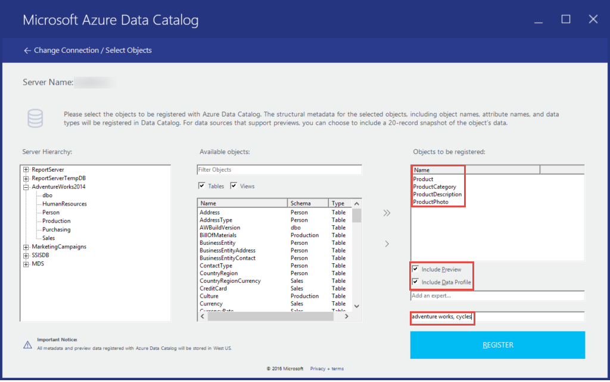
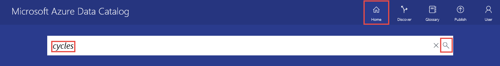
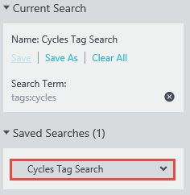
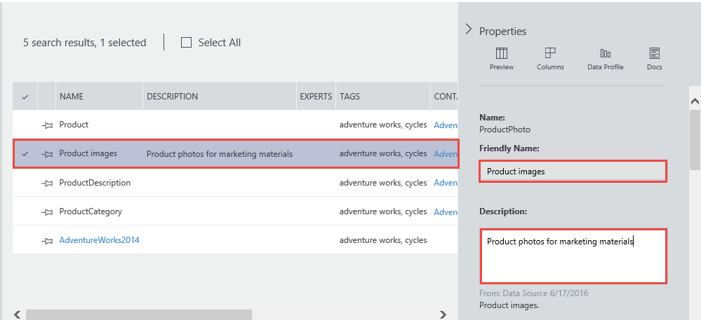
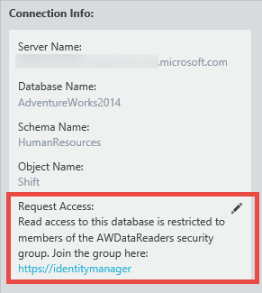

<properties
    pageTitle="Erste Schritte mit Datenkatalog | Microsoft Azure"
    description="End-to-End-Lernprogramm die Szenarien und Funktionen von Azure Datenkatalog präsentieren."
    documentationCenter=""
    services="data-catalog"
    authors="steelanddata"
    manager="jhubbard"
    editor=""
    tags=""/>
<tags
    ms.service="data-catalog"
    ms.devlang="NA"
    ms.topic="get-started-article"
    ms.tgt_pltfrm="NA"
    ms.workload="data-catalog"
    ms.date="09/20/2016"
    ms.author="spelluru"/>

# Erste Schritte mit Azure-Datenkatalog
Azure Datenkatalog ist eine vollständig verwaltete Cloud-Dienst, der als ein System der Registrierung und der Suche für Enterprise-Datenbestände System dient. Einen detaillierten Überblick finden Sie unter [Was ist Azure Datenkatalog](data-catalog-what-is-data-catalog.md).

In diesem Lernprogramm hilft Ihnen die erste Schritte mit Azure Datenkatalog. Führen Sie die folgenden Verfahren in diesem Lernprogramm:

| Vorgehensweise | Beschreibung |
| :--- | :---------- |
| [Bereitstellen von Datenkatalog](#provision-data-catalog) | In diesem Verfahren unter bereitstellen oder Azure Datenkatalog einrichten. Nur, wenn der Katalog nicht vor dem eingerichtet wurde, wiederholen Sie diesen Schritt. Sie können nur eine Datenkatalog pro Organisation (Microsoft Azure-Active Directory-Domäne) verwenden, obwohl es mehrere Abonnements, die mit Ihrem Azure-Konto verknüpft sind gibt. |
| [Register Datenbestände](#register-data-assets) | In diesem Verfahren können Sie mit dem Datenkatalog Datenbestände aus der Beispieldatenbank AdventureWorks2014 erfassen. Die Registrierung ist die Vorgehensweise zum Extrahieren von Key strukturelle Metadaten wie Namen, Typen und Speicherorte aus der Datenquelle, und kopieren die Metadaten für den Katalog. Die Datenquelle und Datenbestände bleiben, wo sie sind, aber die Metadaten wird vom Katalog verwendeten Ausdruckssatz, sodass sie einfacher auffindbar zu und verständlich sind. |
| [Erkennen von von Datenressourcen](#discover-data-assets) | In diesem Verfahren verwenden Sie im Datenkatalog Azure-Portal um zu Datenbestände zu finden, die im vorherigen Schritt registriert wurden. Nachdem eine Datenquelle mit Azure Datenkatalog registriert wurde, wird ihre Metadaten vom Dienst indiziert, sodass die Benutzer einfach nach Daten suchen können benötigten. |
| [Kommentieren Datenbestände](#annotate-data-assets) | In diesem Verfahren geben Sie Anmerkungen (Informationen wie eine Beschreibung, Kategorien, Dokumentation oder Experten) für die Datenbestände an. Diese Informationen ergänzen die Metadaten extrahiert aus einer Datenquelle und die Datenquelle an weitere Personen verständlicher vornehmen. |
| [Herstellen einer Verbindung Datenbestände mit](#connect-to-data-assets) | In diesem Verfahren öffnen Sie Datenbestände in integrierte Clienttools (wie Excel und SQL Server Data Tools) und ein nicht integrierten Tool (SQL Server Management Studio). |
| [Verwalten von Datenbestände](#manage-data-assets) | In diesem Verfahren richten Sie Sicherheit für Ihre Daten Anlagen aus. Datenkatalog wird nicht Benutzern Zugriff auf die Daten selbst ermöglicht. Der Besitzer der Datenquelle steuert Zugriff auf Daten.    Mit dem Datenkatalog erkennen Sie Datenquellen und zeigt die **Metadaten** für die Quellen im Katalog registriert zugehörigen. Es gibt möglicherweise Situationen, allerdings, wo Datenquellen nur für bestimmte Benutzer oder Gruppen bestimmte Mitglieder angezeigt werden sollen. Für diese Szenarios können Sie Datenkatalog den Besitz von erfassten Daten Anlagen in den Katalog und die Sichtbarkeit von Ressourcen, die Sie besitzen steuern. |
| [Entfernen von Datenbestände](#remove-data-assets) | In diesem Verfahren erfahren Sie, wie Datenbestände aus dem Datenkatalog zu entfernen. |  

## Lernprogramm erforderliche Komponenten

### Azure-Abonnement
Um Azure Datenkatalog eingerichtet haben, müssen Sie den Besitzer oder eines Azure-Abonnements gemeinsame Besitzer sein.

Azure-Abonnements können Sie Zugriff auf die Cloud-Service-Ressourcen wie Azure Datenkatalog organisieren. Diese auch Hilfe Sie steuern, wie Ressource: Einsatz gemeldet wird, in Rechnung gestellt, und für bezahlt. Jedes Abonnement kann eine andere Abrechnung und Bezahlung eingerichtet haben, anderen Abonnements und anderen Pläne nach Abteilung, Project, Landes-/ Office usw. zu haben. Jeder Cloud-Dienst auf ein Abonnement gehört, und muss ein Abonnement vor dem Einrichten von Azure Datenkatalog sein. Weitere Informationen finden Sie unter [Verwalten Konten, Abonnements, und administrative Rollen](../active-directory/active-directory-how-subscriptions-associated-directory.md).

Wenn Sie ein Abonnement besitzen, können Sie ein kostenloses Testversion Konto nur wenigen Minuten erstellen. Details finden Sie [Kostenlose Testversion](https://azure.microsoft.com/pricing/free-trial/) .

### Azure-Active Directory
Um Azure Datenkatalog eingerichtet haben, müssen Sie sich mit einem Benutzerkonto Azure Active Directory (Azure AD) angemeldet sein. Sie müssen der Besitzer oder gemeinsame Besitzer eines Azure-Abonnements.  

Azure AD bietet eine einfache Möglichkeit für Ihr Unternehmen Identität und greifen Sie sowohl in der Cloud und lokale verwalten. Ein einzelnes Arbeit oder Schule-Konto können Sie bei jeder Cloud oder lokalen Web-Anwendung anmelden. Azure Datenkatalog verwendet Azure AD anmelden Authentifizierung. Weitere Informationen finden Sie unter [Was ist Azure Active Directory](../active-directory/active-directory-whatis.md).

### Azure-Active Directory-Richtlinie-Konfiguration

Sie können eine Situation auftreten, wobei Datenkatalog Azure-Portal anmelden können, aber wenn Sie versuchen, die Anmeldung bei der Tools für die Datenquelle Registrierung, Ihnen wird eine Fehlermeldung angezeigt, die Anmeldung verhindert. Dieser Fehler kann auftreten, wenn Sie auf das Unternehmensnetzwerk haben, oder wenn Sie sich von außerhalb des Unternehmensnetzwerks verbinden.

Tools für die Registrierung verwendet *formularbasierte Authentifizierung* , um Benutzer anmelden-ins gegen Azure Active Directory überprüfen. Für erfolgreiche anmelden muss ein Azure Active Directory-Administrator formularbasierte Authentifizierung in die *globale Authentifizierungsrichtlinie*aktivieren.

Mit der Authentifizierungsrichtlinie globale können Sie Authentifizierung separat für Intranet- und extranet-Verbindungen aktivieren, wie in der folgenden Abbildung gezeigt. Fehler bei der Anmeldung können auftreten, wenn formularbasierte Authentifizierung nicht für das Netzwerk aktiviert ist, aus denen Sie eine Verbindung herstellen.

 

Weitere Informationen finden Sie unter [Konfigurieren von Authentifizierungsrichtlinien](https://technet.microsoft.com/library/dn486781.aspx).

## Bereitstellen von Datenkatalog
Sie können nur eine Datenkatalog pro Organisation (Azure-Active Directory-Domäne) bereitstellen. Daher, wenn den Besitzer oder gemeinsame Besitzer eines Azure-Abonnements, die diese Azure Active Directory-Domäne gehört Katalog bereits erstellt hat, werden Sie nicht möglicherweise einen Katalog erneut erstellen, auch wenn Sie mehrere Azure-Abonnements haben. Um zu testen, ob ein Datenkatalog von einem Benutzer in Ihrer Domäne Azure Active Directory erstellt wurde, wechseln Sie zur [Homepage Azure Datenkatalog](http://azuredatacatalog.com) , und überprüfen Sie, ob Sie den Katalog finden Sie unter. Wenn ein Katalog bereits für Sie erstellt wurde, überspringen Sie die folgende Schritte und wechseln Sie zum nächsten Abschnitt.    

1. Wechseln Sie zur [Seite Datenkatalog-Dienst](https://azure.microsoft.com/services/data-catalog) , und klicken Sie auf **Erste Schritte**.

    
2. Melden Sie sich mit einem Benutzerkonto, das den Besitzer oder gemeinsame Besitzer eines Azure-Abonnements ist. Sie finden Sie in der folgenden Seite nach der Anmeldung.

    
3. Geben Sie einen **Namen** für die Datenkatalog, das **Abonnement** , die Sie verwenden möchten, und den **Speicherort** für den Katalog.
4. Erweitern Sie **Preise** zu, und wählen Sie eine Azure Datenkatalog **Edition** (Free oder Standard).
    
5. Erweitern Sie **Katalog Benutzer** aus, und klicken Sie auf **Hinzufügen** , um Benutzer für den Datenkatalog hinzufügen. Sie werden automatisch dieser Gruppe hinzugefügt.
    
6. Erweitern Sie **Administratoren Katalog** zu, und klicken Sie auf **Hinzufügen** , um zusätzliche Administratoren für den Datenkatalog hinzufügen. Sie werden automatisch dieser Gruppe hinzugefügt.
    
7. Klicken Sie auf **Katalog erstellen** , um den Datenkatalog für Ihre Organisation erstellen. Die Homepage für die Datenkatalog wird angezeigt, nachdem sie erstellt wurde.
        

### Suchen Sie einen Datenkatalog Azure-Portal
1. Klicken Sie auf einer separaten Registerkarte in einem Webbrowser oder in einem separaten Browserfenster wechseln Sie zum [Azure-Portal](https://portal.azure.com) , und melden Sie sich das Konto, das Sie zum Erstellen der Datenkatalog im vorherigen Schritt verwendet.
2. Wählen Sie **Durchsuchen** , und klicken Sie dann auf **Datenkatalog**.

     Sie sehen die Datenkatalog, die Sie erstellt haben.

    
4.  Klicken Sie auf den Katalog, den Sie erstellt haben. Sie finden Sie unter **Datenkatalog** vorher in im Portal aus.

    
5. Sie können Eigenschaften des Katalogs Daten anzeigen und aktualisieren kann. Angenommen, klicken Sie auf die **Preise Ebene** , und ändern Sie die Edition.

    

### Adventure Works-Beispieldatenbank
In diesem Lernprogramm Sie Datenbestände (Tabellen) aus der Beispieldatenbank AdventureWorks2014 für die SQL Server-Datenbank-Engine registrieren, aber Sie können alle unterstützten Datenquellen verwenden, wenn Sie lieber mit Daten arbeiten, die vertrauten und für Ihre Rolle relevant ist. Eine Liste der unterstützten Datenquellen finden Sie unter [unterstützte Datenquellen](data-catalog-dsr.md).

### Installieren der Adventure Works 2014 OLTP-Datenbank
Die Adventure Works-Datenbank unterstützt standard online Verarbeitung von Transaktionen Szenarien für ein fiktives Fahrradhersteller (Adventure Works Cycles), wozu auch Produkte, Verkauf und Einkauf. In diesem Lernprogramm können Sie Informationen zu den Produkten in Azure Datenkatalog erfassen.

So installieren Sie die Beispieldatenbank Adventure Works

1. Herunterladen Sie auf CodePlex [Adventure Works 2014 vollständigen Datenbank Backup.zip](https://msftdbprodsamples.codeplex.com/downloads/get/880661) .
2. Wenn Sie die Datenbank auf Ihrem Computer wiederherstellen möchten, gehen Sie wie [Wiederherstellen einer Sicherungskopie der Datenbank mithilfe von SQL Server Management Studio](http://msdn.microsoft.com/library/ms177429.aspx), oder indem Sie wie folgt vor:
    1. Öffnen Sie SQL Server Management Studio, und Verbinden mit SQL Server-Datenbank-Engine.
    2. Mit der rechten Maustaste **Datenbanken** , und klicken Sie auf **Datenbank wiederherstellen**.
    3. Klicken Sie unter **Datenbank wiederherstellen**klicken Sie auf die Option **Gerät** für **Quelle** , und klicken Sie auf **Durchsuchen**.
    4. Klicken Sie unter **Wählen Sie zusätzliche Geräte aus**klicken Sie auf **Hinzufügen**.
    5. Wechseln Sie zu dem Ordner, wo Sie die Datei **AdventureWorks2014.bak** haben, wählen Sie die Datei, und klicken Sie auf **OK** , um das Dialogfeld **Sicherungsdatei suchen** zu schließen.
    6. Klicken Sie auf **OK** , um das Dialogfeld **Sicherung Geräte auswählen** zu schließen.    
    7. Klicken Sie auf **OK** , um das Dialogfeld **Datenbank wiederherstellen** zu schließen.

Sie können jetzt Datenbestände aus der Adventure Works-Beispieldatenbank mithilfe von Azure Datenkatalog registrieren.

## Register Datenbestände

In dieser Übung verwenden Sie die Tools für die Registrierung Datenbestände aus der Adventure Works-Datenbank mit dem Katalog registrieren. Die Registrierung ist die Vorgehensweise zum Extrahieren von Key strukturelle Metadaten wie Namen, Typen und Speicherorte aus der Datenquelle und die darin enthaltenen Anlagen, und kopieren die Metadaten für den Katalog. Die Datenquelle und Datenbestände bleiben, wo sie sind, aber die Metadaten wird vom Katalog verwendeten Ausdruckssatz, sodass sie einfacher auffindbar zu und verständlich sind.

### Registrieren einer Datenquelle

1.  Wechseln Sie zur [Homepage Azure Datenkatalog](https://azuredatacatalog.com) , und klicken Sie auf **Daten veröffentlichen**.

    

2.  Klicken Sie auf **Launch Application** zum Herunterladen, installieren und Ausführen von Tools für die Registrierung auf Ihrem Computer.

    

3. Klicken Sie auf der Seite **Willkommen** klicken Sie auf **Anmelden** , und geben Sie Ihre Anmeldeinformationen.    

    

4. Klicken Sie auf der Seite **Microsoft Azure Datenkatalog** auf **SQL Server** und **Weiter**.

    

5.  Geben Sie die SQL Server-Verbindungseigenschaften für **AdventureWorks2014** (siehe folgendes Beispiel), und klicken Sie auf **Verbinden**.

    

6.  Registrieren Sie sich die Metadaten Ihrer Daten Ressource. In diesem Beispiel können Sie **Herstellung/Product** -Objekten aus dem AdventureWorks Herstellung Namespace erfassen:

    1. In der Hierarchie **Server** erweitern Sie **AdventureWorks2014** , und klicken Sie auf die **Herstellung**.
    2. Auswählen von **Product**, **ProductCategory**, **ProductDescription**und **ProductPhoto** mithilfe von STRG + klicken.
    3. Klicken Sie auf die **ausgewählten Pfeil verschieben** (**>**). Diese Aktion verschiebt alle ausgewählten Objekte in der Liste **Objekte registriert werden** .

        
    4. Wählen Sie **einschließen eine Vorschau** eine Vorschau Momentaufnahme der Daten aufnehmen möchten. Der Snapshot bietet bis zu 20 Datensätze aus jeder Tabelle, und es wird in den Katalog kopiert.
    5. Wählen Sie **Datenprofil einschließen** eine Momentaufnahme der Objekt Statistiken für das Datenprofil aufnehmen möchten (zum Beispiel: minimum, maximum und Mittelwert der Werte für eine Spalte, die Anzahl der Zeilen).
    6. Geben Sie im Feld **Hinzufügen von Tags** **Adventure funktioniert, Zyklen**aus. Dadurch wird die Suche Tags für diese Daten Anlagen hinzugefügt. Kategorien sind eine großartige Möglichkeit, um registrierte Datenquelle suchen Benutzern dabei helfen können.
    7. Geben Sie den Namen des einer- **Experten** auf diese Daten (optional) ein.

        

    8. Klicken Sie auf **Registrieren**. Azure Datenkatalog registriert die markierten Objekte an. In dieser Übung werden die markierten Objekte von Adventure Works registriert. Tools für die Registrierung extrahiert Metadaten aus der Anlage Daten und die Daten in den Dienst Azure Datenkatalog kopiert. Die Daten bleiben, in dem sie aktuell gespeichert ist und unter dem Steuerelement der Administratoren und Richtlinien des aktuellen Systems bleibt.

        

    9. Wenn Ihre registrierten Datenquellenobjekte anzeigen möchten, klicken Sie auf **Ansicht Portal**. Im Datenkatalog Azure-Portal zu bestätigen, dass Sie alle vier Tabellen und die Datenbank in der Rasteransicht finden Sie unter.

        

In dieser Übung registriert Sie Objekte aus der Adventure Works-Beispieldatenbank, damit diese leicht von Benutzer in Ihrer Organisation gefunden werden können. In der nächsten Übung erfahren Sie, wie eingetragene Datenbestände ermitteln.

## Erkennen von von Datenressourcen
Suche in Azure Datenkatalog verwendet zwei primäre Methoden: Suchen und filtern.

Suche soll intuitive und leistungsfähige sein. Standardmäßig werden Suchbegriffe mit einem beliebigen-Eigenschaft im Katalog, einschließlich Benutzer bereitgestellte Anmerkungen verglichen.

Filtern wird als Ergänzung suchen. Wählen Sie Besonderheiten wie Experten, Datenquellentyp, Objekttyp und Kategorien passende Datenbestände anzeigen und zum Einschränken der Suchergebnisse in Passende Posten.

Mithilfe einer Kombination von Suchen und Filtern können Sie schnell die Datenquellen navigieren, die mit Azure Datenkatalog zum Ermitteln von der Datenbestände benötigte erfasst wurden.

In dieser Übung verwenden Sie im Datenkatalog Azure-Portal um zu Datenbestände zu finden, die Sie in der vorherigen Übung registriert haben. Details zur Syntax der Suche finden Sie unter [syntaxreferenz für die Suche im Katalog](https://msdn.microsoft.com/library/azure/mt267594.aspx) .

Es folgen einige Beispiele für Datenbestände im Katalog entdecken.  

### Erkennen von Datenressourcen mit einfache Suche
Einfache Suche hilft Ihnen der Katalog zu suchen, indem Sie einen oder mehrere Suchbegriffe. Ergebnisse werden alle Elemente, die in einer beliebigen Eigenschaft mit einem oder mehreren von den angegebenen Bedingungen entsprechen.

1. Klicken Sie auf **Start** , im Datenkatalog Azure-Portal. Wenn Sie den Webbrowser geschlossen haben, wechseln Sie zur [Homepage Azure Datenkatalog](https://www.azuredatacatalog.com).
2. Geben Sie im Suchfeld `cycles` und drücken Sie die **EINGABETASTE**.

    
3. Bestätigen Sie, dass Sie alle vier Tabellen und die Datenbank (AdventureWorks2014) in den Ergebnissen angezeigt. Sie können zwischen **der Datenblattansicht** und **Listenansicht** wechseln, indem Sie auf Schaltflächen auf der Symbolleiste aus, wie in der folgenden Abbildung gezeigt. Beachten Sie, dass die Suchschlüsselwort in den Suchergebnissen hervorgehoben ist, da die Option **Hervorheben** **aktiviert**ist. Sie können auch die Anzahl der **Ergebnisse pro Seite** in den Suchergebnissen angeben.

    

    Klicken Sie im Bereich **Suchbegriffe** wird auf der linken Seite und **im Eigenschaftenbereich** auf der rechten Seite ist. Klicken Sie im Bereich **Suchen** können Sie Suchkriterien ändern und Filtern von Ergebnissen. **Im Eigenschaftenbereich** zeigt die Eigenschaften eines ausgewählten Objekts in der Liste oder Raster.

4. Klicken Sie in den Suchergebnissen auf **Produkt** . Klicken Sie auf **Vorschau**, **Spalten**, **Datenprofil**und **Dokumentation** Registerkarten, oder klicken Sie auf den Pfeil, um den unteren Bereich zu erweitern.  

    

    Klicken Sie auf der Registerkarte **Vorschau** wird eine Vorschau der Daten in der Tabelle **Product** .  
5. Klicken Sie auf die Registerkarte **Spalten** , um die Spalten (z. B. **Namen** und **Datentyp**) in der Anlage Daten ausführlich behandelt.
6. Klicken Sie auf der Registerkarte **Datenprofil** , um anzuzeigen, das Profil Daten (zum Beispiel: Anzahl der Zeilen, die Größe der Daten oder kleinsten Wert in einer Spalte) in der Anlage Daten.
7. Filtern der Ergebnisse mithilfe von **Filtern** auf der linken Seite. Klicken Sie zum Beispiel für **Objekttyp**auf **Tabelle** , und Sie nur die vier Tabellen angezeigt, und nicht die Datenbank.

    

### Erkennen von Datenressourcen mit Eigenschaft Bereichsdefinition
Eigenschaft Bereichsdefinition hilft Ihnen, Datenbestände ermitteln, wo die angegebene Eigenschaft der Suchbegriff zugeordnet ist.

1. Deaktivieren Sie den Filter **Tabelle** klicken Sie unter **Objekttyp** in **Filter**ein.  
2. Geben Sie im Suchfeld `tags:cycles` und drücken Sie die **EINGABETASTE**. Die Eigenschaften, die Sie verwenden können, für die Suche im Datenkatalog finden Sie unter [syntaxreferenz für die Suche im Katalog](https://msdn.microsoft.com/library/azure/mt267594.aspx) .
3. Bestätigen Sie, dass Sie alle vier Tabellen und die Datenbank (AdventureWorks2014) in den Ergebnissen angezeigt.  

    

### Speichern Sie die Suche
1. Klicken Sie im Bereich **Suchen** im Abschnitt **Aktuelle suchen** Geben Sie einen Namen für die Suche, und klicken Sie auf **Speichern**.

    
2. Bestätigen Sie, dass die gespeicherte Suche unter **Gespeicherte Suchen**angezeigt.

    
3. Wählen Sie eine der Aktionen, die Sie auf die gespeicherte Suche (**Umbenennen**, **Löschen**, **Speichern als Standard** -Suche) ausführen können.

    

### Boolesche Operatoren
Sie können erweitern oder Eingrenzen der Suche mit booleschen Operatoren.

1. Geben Sie im Suchfeld `tags:cycles AND objectType:table`, und drücken Sie die **EINGABETASTE**.
2. Bestätigen Sie, dass Sie nur Tabellen (nicht die Datenbank) die Ergebnisse angezeigt.  

    

### Gruppieren von mit Klammern
Durch Gruppieren mit Klammern können Sie die Teile der Abfrage um logische Isolation, insbesondere zusammen mit booleschen Operatoren erzielen gruppieren.

1. Geben Sie im Suchfeld `name:product AND (tags:cycles AND objectType:table)` und drücken Sie die **EINGABETASTE**.
2. Bestätigen Sie, dass nur die Tabelle **Product** in den Suchergebnissen angezeigt.

       

### Vergleichsoperatoren
Mit Vergleichsoperatoren können Sie anderen Kriteriums als Vergleiche für Eigenschaften, die numerischen und Datum Datentypen aufweisen.

1. Geben Sie im Suchfeld `lastRegisteredTime:>"06/09/2016"`.
2. Deaktivieren Sie die **Tabelle** filtern, klicken Sie unter **Objekttyp**.
3. Drücken Sie die **EINGABETASTE**.
4. Bestätigen Sie, dass die Tabellen **Product**, **ProductCategory**, **ProductDescription**und **ProductPhoto** und die AdventureWorks2014-Datenbank, die Sie in den Suchergebnissen registriert angezeigt wird.

    

Ausführliche Informationen zur Erkennung von Datenbestände und [Datensuche-Katalog-syntaxreferenz](https://msdn.microsoft.com/library/azure/mt267594.aspx) für die Syntax der Suche finden Sie unter [So Datenbestände zu ermitteln](data-catalog-how-to-discover.md) .

## Kommentieren Datenbestände
In dieser Übung verwenden Sie im Datenkatalog Azure-Portal um zu kommentieren (Fügen Sie Informationen wie eine Beschreibung, Kategorien oder Experten) Datenbestände, die Sie zuvor im Katalog registriert haben. Die Anmerkungen ergänzen und verbessern die strukturelle Metadaten aus der Datenquelle während der Registrierung extrahiert und erleichtert die Datenbestände zu ermitteln und zu verstehen.

In dieser Übung mit Anmerkungen versehen eine einzelnen Daten Anlage (ProductPhoto). Einen Anzeigenamen und eine Beschreibung können Sie auf die Anlage ProductPhoto Daten hinzufügen.  

1.  Wechseln Sie zur [Homepage Azure Datenkatalog](https://www.azuredatacatalog.com) und suchen mit `tags:cycles` der Datenbestände finden Sie registriert haben.  
2. Klicken Sie in den Suchergebnissen auf **ProductPhoto** .  
3. Geben Sie **Produktbilder** für **Anzeigenamen** und **Fotos von Produkten für marketing-Materialien** für die **Beschreibung**ein.

    

    Die **Beschreibung** kann andere ermitteln und zu verstehen, warum und wie Sie die Anlage ausgewählten Daten verwenden. Sie können auch Hinzufügen weiterer Tags und Spalten anzeigen. Nachdem Sie versuchen können, suchen und filtern, um Datenbestände mithilfe der beschreibenden Metadaten, die Sie, um den Katalog hinzugefügt haben zu ermitteln.

Sie können auch auf dieser Seite die folgenden Aktionen ausführen:

- Hinzufügen von Experten für die Anlage Daten. Klicken Sie auf **Hinzufügen** , klicken Sie im Bereich **Experten** .
- Hinzufügen von Kategorien auf Datensatzebene. Klicken Sie auf **Hinzufügen** , klicken Sie im Bereich **Kategorien** . Eine Kategorie kann ein Benutzertag oder eine Kategorie Glossar. Der Standard Edition von Datenkatalog enthält ein Business-Glossar, mit der Katalogadministratoren eine zentralen Business Taxonomie definieren. Katalog Benutzer können dann Datenbestände Begriffe Glossar mit Anmerkungen versehen. Weitere Informationen finden Sie unter [Informationen zum Einrichten der Business-Glossar für Tagging geregelt](data-catalog-how-to-business-glossary.md)
- Hinzufügen von Kategorien Ebene der Spalte. Klicken Sie auf **Hinzufügen** unter **Kategorien** für die Spalte, die Sie einen Kommentar hinzufügen möchten.
- Hinzufügen einer Beschreibung der Ebene der Spalte. Geben Sie **eine Beschreibung** für eine Spalte aus. Sie können auch die Beschreibungsmetadaten extrahiert aus einer Datenquelle anzeigen.
- Fügen Sie **Zugriff beantragen** Informationen, die Benutzer wird gezeigt, wie der Zugriff auf die Anlage Daten anfordern.

    

- Wählen Sie die Registerkarte **Dokumentation** und Bereitstellen Sie Dokumentation für die Anlage Daten. Mit Datenkatalog Azure-Dokumentation können Sie Ihrer Datenkatalog als Content Repository verwenden, um eine vollständige verbale Ihrer Datenbestände zu erstellen.

    

Sie können auch eine Anmerkung mehrere Datenbestände hinzufügen. Sie können beispielsweise wählen alle Daten Anlagen, die Sie sich registriert und geben Experte für diese.

Azure Datenkatalog unterstützt einen Ansatz Masse – als Quelle für die Anmerkungen an. Jeder Benutzer Datenkatalog kann Kategorien (Benutzer oder Glossar), Beschreibung und sonstige Metadaten, die hinzufügen, sodass jeder Benutzer mit einer Perspektive einer Anlage Daten und die Verwendung dieser Perspektive aufgenommene und für andere Benutzer verfügbar haben, kann.

Ausführliche Informationen zu Stapels Datenbestände finden Sie unter [So Datenbestände kommentieren](data-catalog-how-to-annotate.md) .

## Herstellen einer Verbindung Datenbestände mit
In dieser Übung öffnen Sie mithilfe von Verbindungsinformationen Datenbestände in eine integrierte Client-Tool (Excel) und einer nicht integrierten Tool (SQL Server Management Studio).

> [AZURE.NOTE] Es ist wichtig, denken Sie daran, Azure Datenkatalog Sie Zugriff auf die tatsächliche Datenquelle erhalten nicht – es einfach erleichtert zum Ermitteln und ihm vertraut zu machen. Beim Herstellen einer mit einer Datenquelle Verbindung, die Clientanwendung, die Sie auswählen, verwendet die Windows-Anmeldeinformationen oder Anmeldeinformationen aufgefordert, nach Bedarf. Wenn Sie nicht zuvor Zugriff auf die Datenquelle erteilt wurden, müssen Sie Zugriff erteilt werden, bevor Sie eine Verbindung herstellen können.

### Verbinden Sie mit einer Anlage von Daten aus Excel

1. Wählen Sie **Produkt** aus den Suchergebnissen aus. Klicken Sie auf der Symbolleiste **Öffnen In** , und klicken Sie auf **Excel**.

    
2. Klicken Sie auf **Öffnen** im Popupfenster herunterladen. Diese können je nach Browser abweichen.

    
3. Klicken Sie im Fenster **Sicherheitshinweis für Microsoft Excel** klicken Sie auf **Aktivieren**.

    
4. Übernehmen Sie die Standardeinstellungen im Dialogfeld **Daten importieren** , und klicken Sie auf **OK**.

    
5. Anzeigen der Datenquelle in Excel.

    

In dieser Übung mit Sie mithilfe von Azure Datenkatalog entdeckt Datenbestände verbunden. Mit dem Datenkatalog Azure-Portal können Sie direkt mithilfe der integriert Menü **Öffnen in** Clientanwendungen verbinden. Sie können auch mit einer beliebigen Anwendung herstellen, die Sie mithilfe der Speicherort Verbindungsinformationen enthalten, in den Metadaten Objekt auswählen. Beispielsweise können Sie die SQL Server Management Studio zum Herstellen der AdventureWorks2014 Datenbank Zugriff auf die Daten in der Datenbestände registriert in diesem Lernprogramm verwenden.

1. Öffnen Sie **SQL Server Management Studio**.
2. Geben Sie den Servernamen **-Eigenschaften** ' im Datenkatalog Azure-Portal, klicken Sie im Dialogfeld **Verbindung mit Server herstellen** .
3. Verwenden Sie entsprechende Anmelde- und Anmeldeinformationen, um die Anlage Daten zuzugreifen. Wenn Sie keinen Zugriff haben, verwenden Sie, wie Sie Informationen in das Feld **Anfordern des Zugriffs** .

    

Klicken Sie auf **Ansicht Verbindungszeichenfolgen** zum Anzeigen und ADF.NET, ODBC und OLE DB-Verbindungszeichenfolgen zur Verwendung in Ihrer Anwendung in die Zwischenablage kopieren.

## Verwalten von Datenbestände
In diesem Schritt erfahren Sie, wie die Sicherheit für Ihre Daten Anlagen eingerichtet. Datenkatalog wird nicht Benutzern Zugriff auf die Daten selbst ermöglicht. Der Besitzer der Datenquelle steuert Zugriff auf Daten.

Sie können Datenkatalog zum Ermitteln von Datenquellen und die Metadaten, die im Zusammenhang mit der Quellen registriert im Katalog anzuzeigen. Es gibt möglicherweise Situationen, in dem Datenquellen nur bestimmten Benutzern oder Gruppen bestimmte Mitglieder sichtbar sein soll. Für diese Szenarios können Sie Datenkatalog registrierten Datenbestände innerhalb des Katalogs des Besitzes verwenden, und dann Steuerelement die Sichtbarkeit der Vermögenswerte Sie besitzen.

> [AZURE.NOTE] In dieser Übung beschriebenen Verwaltungsfunktionen stehen nur in der Standard Edition von Azure Datenkatalog, nicht in der kostenlosen Edition.
In Azure Datenkatalog können Sie Besitz Datenbestände, gemeinsame Besitzer zu Datenbestände hinzufügen, und legen Sie die Sichtbarkeit Datenbestände.

### Übernehmen Sie der Besitzrechte Datenbestände und einschränken Sie der Sichtbarkeit

1. Wechseln Sie zur [Homepage Azure Datenkatalog](https://www.azuredatacatalog.com). Geben Sie im Feld **Suchen** den Text `tags:cycles` und drücken Sie die **EINGABETASTE**.
2. Klicken Sie auf ein Element in der Ergebnisliste aus, und klicken Sie auf der Symbolleiste auf **Besitzrechte** .
3. Klicken Sie im Abschnitt **Verwaltung** von **im Eigenschaftenbereich** auf **Besitzrechte**.

    
4. Um die Sichtbarkeit einschränken möchten, wählen Sie im Abschnitt **Sichtbarkeit** **Besitzer und diese Benutzer** aus, und klicken Sie auf **Hinzufügen**. Geben Sie die Benutzer e-Mail-Adressen in das Textfeld ein, und drücken Sie die **EINGABETASTE**.

    

## Entfernen von Datenbestände

In dieser Übung verwenden Sie im Portal Azure Datenkatalog Datenvorschau aus registrierten Datenbestände entfernen und Löschen von Daten aus dem Katalog aus.

In Azure Datenkatalog können Sie eine einzelne Anlage löschen oder Löschen mehrere Anlagen.

1. Wechseln Sie zur [Homepage Azure Datenkatalog](https://www.azuredatacatalog.com).
2. Geben Sie im Feld **Suchen** den Text `tags:cycles` , und klicken Sie auf die **EINGABETASTE**.
3. Wählen Sie ein Element in der Ergebnisliste aus, und klicken Sie auf **Löschen** auf der Symbolleiste wie in der folgenden Abbildung dargestellt:

    

    Wenn Sie in der Listenansicht arbeiten, ist das Kontrollkästchen links neben dem Element, wie in der folgenden Abbildung dargestellt:

    

    Sie können auch wählen Sie mehrere Datenbestände und löschen ist möglich wie in der folgenden Abbildung dargestellt:

    

> [AZURE.NOTE] Das Standardverhalten des Katalogs wird auf alle Benutzer zum Registrieren einer beliebigen Datenquelle, und die Benutzer können alle Daten Element zu löschen, die registriert wurde. Die im Lieferumfang der Standard Edition von Azure Datenkatalog Verwaltungsfunktionen bieten zusätzliche Optionen für den Besitz der Posten, einschränken, die Posten, ermitteln können und einschränken können, wer Posten löschen.

## Zusammenfassung

In diesem Lernprogramm untersucht Sie grundlegende Funktionen von Azure Datenkatalog, einschließlich registrieren, Stapels, entdecken und Verwalten von Enterprise-Datenbestände. Jetzt, da Sie das Lernprogramm abgeschlossen haben, ist es Zeit, um anzufangen. Sie können heute beginnen, indem Sie registrieren die Datenquellen, die, denen Ihnen und Ihrem Team auf verlassen, und auffordert Kollegen so verwenden Sie den Katalog.

## Verweise

- [So registrieren Datenbestände](data-catalog-how-to-register.md)
- [So ermitteln Datenbestände](data-catalog-how-to-discover.md)
- [So kommentieren Datenbestände](data-catalog-how-to-annotate.md)
- [So Dokument Datenbestände](data-catalog-how-to-documentation.md)
- [Herstellen einer Verbindung mit Datenbestände](data-catalog-how-to-connect.md)
- [So verwalten Sie Datenbestände](data-catalog-how-to-manage.md)
