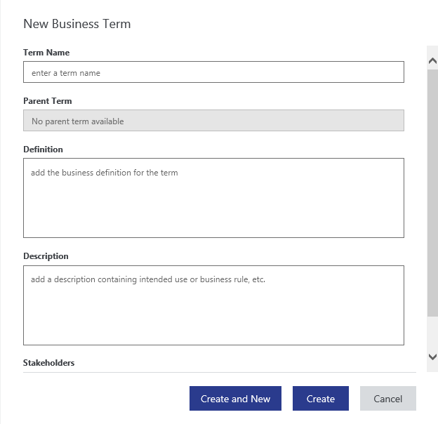
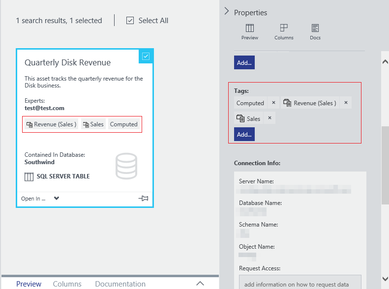

<properties
    pageTitle="Informationen zum Einrichten der Business-Glossar für tagging geregelt | Microsoft Azure"
    description="Gewusst wie-Artikel Hervorhebung des Business-Glossars in Azure Datenkatalog definieren und verwenden eine allgemeine Business Vokabular kategorisieren registriert Datenbestände."
    services="data-catalog"
    documentationCenter=""
    authors="steelanddata"
    manager="NA"
    editor=""
    tags=""/>
<tags
    ms.service="data-catalog"
    ms.devlang="NA"
    ms.topic="article"
    ms.tgt_pltfrm="NA"
    ms.workload="data-catalog"
    ms.date="09/21/2016"
    ms.author="maroche"/>

# Zum Einrichten der Business-Glossar für Tagging geregelt

## Einführung

Azure Datenkatalog bietet Funktionen für die Quelle Datenermittlung, zulassen, dass Benutzer leicht ermitteln und verstehen die benötigten Datenanalysen und treffen von Entscheidungen auf Datenquellen. Diese Discovery-Funktionen stellen die größte Wirkung, wenn Benutzer suchen können und breiten Spektrums der verfügbaren Datenquellen verstehen.

Eine Datenkatalog Features, die größer Verständnis Posten Daten höher gestuft ist kategorisieren. Kategorisieren von ermöglicht Benutzern Schlüsselwörter mit einer Anlage oder einer Spalte, die wiederum die Anlage über suchen oder Browsen ermitteln erleichtert, zuordnen und ermöglicht Benutzern, die Kontext bereitstellen und Absicht der Anlage leichter zu verstehen.

Kategorisieren kann jedoch manchmal Probleme eigene führen. Einige Beispiele für Probleme, die durch tagging entstehen können sind:

1.  Benutzer mit Abkürzungen auf einige Bestand und die erweiterten Text auf andere während kategorisieren. Diese Inkonsistenzen behindert die Suche nach Ressourcen auf, obwohl beabsichtigt ist, markieren die Anlagen mit dem gleichen Tag.
2.  Kategorien, die verschiedene Dinge in unterschiedlichen Kontexten Mittelwert. Beispielsweise ein Kennzeichen so genannten "Umsatz" in einer Datenmenge Kunden Umsätze nach Kunde bedeutet möglicherweise, aber das gleiche Tag für einen vierteljährlichen sales Dataset könnte Quartalsumsatz bedeuten, für das Unternehmen.  

Datenkatalog enthält ein Glossar Business erleichtern diese und andere ähnliche Probleme zu beheben.

Die Datenkatalog Business-Glossar ermöglicht Organisationen Dokument Business-Begriffe und ihrer Definitionen zum Erstellen einer allgemeinen Business Vokabular. Diese Governance ermöglicht Konsistenz bei der Verwendung von Daten in der gesamten Organisation an. Nachdem Ausdrücke im Business-Glossar definiert sind, zugewiesen werden zu Datenbestände im Katalog mit den gleichen Ansatz als kategorisieren, wodurch _geregelt kategorisieren_.

> [AZURE.NOTE] Die in diesem Artikel beschriebene Funktionen stehen nur in der Standard Edition von Azure Datenkatalog. Die kostenlose Edition bietet keine Funktionen für tagging geregelt oder eine Business-Glossar.

## Glossar Verfügbarkeit und Berechtigungen

*Das Business-Glossar steht in der Standard Edition von Azure Datenkatalog. Ein Glossar enthält der kostenlosen Edition von Datenkatalog nicht.*

Das Business-Glossar kann über die Option "Glossar" im Navigationsmenü des Portals Datenkatalog zugegriffen werden.  

Daten-Katalog-Administratoren und Mitglieder der Rolle Glossar Administratoren können erstellen, diesen bearbeiten und Löschen von Glossar im Business-Glossar. Alle Datenkatalog Benutzer können die Definitionen Ausdruck anzeigen und Kategorisieren von Anlagen mit Glossar können.

## Glossar erstellen

Datenkatalog und Glossar-Administratoren erstellen neue Glossar, indem Sie auf den neuen Begriff ' Schaltfläche Glossar mit den folgenden Feldern zu erstellen:

* Business Definition für den Ausdruck
* Eine Beschreibung, die erfasst die beabsichtigte Verwendung oder Business Regeln für die Anlage/Spalte
* Eine Liste der Projektbeteiligten, die am besten über den Ausdruck kennen
* Der Begriff übergeordneten definiert werden, die die Hierarchie, in der der Ausdruck organisiert wird

## Glossar Ausdruck Hierarchien

Das Business-Glossar Datenkatalog ermöglicht das Ihres Vokabulars Unternehmen beschreiben, wie Sie eine Hierarchie von Ausdrücken. Dadurch wird die Organisationen, die eine Einstufung Ausdrücke zu erstellen, die ihre Business Taxonomie besser darstellt.

Der Name eines Begriffs auf einer bestimmten Ebene der Hierarchie eindeutig sein muss – doppelte Namen sind nicht zulässig. Es gibt keine Beschränkung für die Anzahl der Ebenen in einer Hierarchie, aber eine Hierarchie häufig einfacher verstanden, wenn es drei Ebenen oder weniger gibt.

Die Verwendung von Hierarchien in den Business-Glossar ist optional. Verlassen der übergeordneten Ausdruck Feld leer für Glossar wird eine Liste der Farbtiefe (nicht hierarchische) Ausdrücke im Glossar erstellen.  

## Kategorisieren von Anlagen mit Glossar

Nachdem Glossar innerhalb des Katalogs definiert wurden, ist zur Darstellung von Kategorisieren von Anlagen optimiert das Glossar suchen möchten, wie der Benutzer, deren Kategorie eingibt. Im Portal Datenkatalog zeigt eine Liste mit übereinstimmenden Glossar für den Benutzer zur Auswahl. Wenn der Benutzer ein Ausdrucks Glossar aus der Liste auswählt wird es auf die Anlage als eine Kategorie (auch bekannt als hinzugefügt Glossar-Tag). Der Benutzer kann zum Erstellen einer neuen Kategorie durch Eingeben eines Ausdrucks, der nicht im Glossar (auch bekannt als wird auch auswählen Benutzertag).

> [AZURE.NOTE] Kategorien Benutzer sind der einzige Kategorie in der kostenlosen Edition von Datenkatalog unterstützt.

### Zeigen Sie auf Kategorien Verhalten
Im Portal Datenkatalog unterscheiden sich die zwei Typen von Tags visuell, mit anderen Hover-Verhalten. Wenn der Benutzer eine Kategorie Benutzer bewegt wird können sie sehen, den Kategorientext und den oder die Benutzer, die die Kategorie hinzugefügt haben. Wenn der Benutzer eine Kategorie Glossar bewegt wird, finden Sie unter diese auch die Definition von den Ausdruck Glossar und einen Link zu das Business-Glossar zum Anzeigen der vollständigen Definition der Ausdruck zu öffnen.

### Suchfilter für Kategorien
Sowohl Glossar und Benutzer-Tags durchsucht werden, und können als Filter in einer Suche angewendet werden.

## Zusammenfassung
Das Business Glossar in Azure Datenkatalog und der geregelt tagging, die es ermöglicht, zulassen Datenbestände zu identifiziert, verwaltet und konsistent erkannt werden. Das Business-Glossar kann Schulung des Business Vokabulars dem Benutzer einer Organisation heraufstufen und unterstützt aussagekräftige Metadaten zu erfasst werden, Anlage Discovery vornimmt und Grundlegendes zu einem Kinderspiel.

## Siehe auch

- [REST-API-Dokumentation für Business-Glossar Vorgänge](https://msdn.microsoft.com/library/mt708855.aspx)
