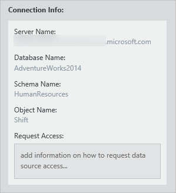

<properties
   pageTitle="Herstellen einer Verbindung mit Datenquellen | Microsoft Azure"
   description="Gewusst wie-Artikel Hervorhebung der Herstellen einer Verbindung mit Datenquellen mit Azure Datenkatalog erkannt."
   services="data-catalog"
   documentationCenter=""
   authors="steelanddata"
   manager="NA"
   editor=""
   tags=""/>
<tags
   ms.service="data-catalog"
   ms.devlang="NA"
   ms.topic="article"
   ms.tgt_pltfrm="NA"
   ms.workload="data-catalog"
   ms.date="09/15/2016"
   ms.author="maroche"/>

# Herstellen einer Verbindung mit Datenquellen

## Einführung
**Microsoft Azure Datenkatalog** ist eine vollständig verwaltete Cloud-Dienst, der als ein System der Registrierung und der Suche für Enterprise-Datenquellen System dient. Kurzum, geht **Azure Datenkatalog** beiträgt ermitteln, verstehen und Verwenden von Datenquellen und Hilfe Organisationen, um größeren Nutzen aus ihrer vorhandenen Daten zu ziehen. Ein wichtiger Aspekt des dieses Szenario wird mithilfe der Daten – nachdem ein Benutzer eine Datenquelle erkennt und ihren Zweck versteht, im nächsten Schritt wird die Verbindung zur Datenquelle, setzen die Daten zu verwenden.

## Datenquelle Speicherorte
Während der Registrierung Datenquelle empfängt **Azure Datenkatalog** Metadaten für die Datenquelle an. Diese Metadaten enthält die Details des Speicherorts der Datenquelle. Die Details des Speicherorts variiert aus Datenquelle Datenquelle, aber es wird immer die Herstellen der Verbindung erforderliche Informationen enthalten. Der Speicherort für eine SQL Server-Tabelle enthält beispielsweise den Servernamen, Datenbankname, Schemanamen und Tabellennamen, während Sie der Speicherort für einen SQL Server Reporting Services-Bericht auf den Namen des Servers und den Pfad zu dem Bericht enthält. Andere Arten von Datenquellen werden Speicherorte noch die Struktur und Funktionen von Quellsystem berücksichtigt.

## Integrierte Clienttools
Die einfachste Methode zum Verbinden mit einer Datenquelle ist die Verwendung der "im geöffneten...." Menü im **Datenkatalog Azure** -Portal. In diesem Menü zeigt eine Liste der Optionen für das Herstellen einer Verbindung mit der ausgewählten Daten Anlage.
Bei Verwendung die Kachel Standardansicht steht in diesem Menü auf die einzelnen Kachel.

 

Bei Verwendung die Listenansicht steht im Menü in der Suchleiste am oberen Rand des Fensters Portal.

 

## Unterstützte Clientanwendungen
Bei Verwendung der "im geöffneten...." Menü für Datenquellen im Portal Azure Datenkatalog die richtige Clientanwendung muss auf dem Clientcomputer installiert sein.

| Öffnen Sie in der Anwendung | Datei Erweiterung / Protokoll | Unterstützte Anwendungsversionen |
| --- | --- | --- |
| Excel | ODC | Excel 2010 oder höher |
| Excel (oben 1000) | ODC | Excel 2010 oder höher |
| Power Query | XLSX | Excel 2016 oder Excel 2010 oder Excel 2013 mit Power Query für Excel-add-in installiert
| Power BI-Desktop | .pbix | Power BI-Desktop-Juli 2016 oder höher |
| SQL Server Data Tools | Vsweb: / / | Update für Visual Studio 2013 4 oder höher mit SQL Server-Tools installiert |
| Berichts-Manager | http:// | [Browseranforderungen für SQL Server Reporting Services](https://technet.microsoft.com/en-us/library/ms156511.aspx) finden Sie unter |

## Die Daten, die Ihre tools
Im Menü verfügbaren Optionen hängen auf den Typ des aktuell ausgewählten Daten-Objekt. Natürlich werden nicht alle möglichen Tools enthalten sein, der "in geöffneten...." ist das Menü, aber es immer noch einfach die Verbindung zur Datenquelle mithilfe eines beliebigen Clienttools. Wenn ein Objekt Daten im Portal **Azure Datenkatalog** ausgewählt ist, wird der vollständige Speicherort im Bereich Eigenschaften angezeigt.

 

Die Verbindung Informationen Details unterscheidet sich von den Datenquellentyp an Datenquellentyp, aber die Informationen im Portal enthalten erhalten Sie alles, was Sie benötigen für die Verbindung zur Datenquelle in jedem Clienttool. Benutzer können Sie die Details der Verbindung für die Datenquellen kopieren, die sie mithilfe des **Azure Datenkatalog**, aktivieren sie zur Arbeit mit den Daten in ihrer Wahl Tool entdeckt haben.

## Herstellen und Daten Quelle Berechtigungen
Obwohl auf **Azure Datenkatalog** Datenquellen sichtbar ist, bleibt Zugriff auf die Daten selbst von der Datenquelle Besitzer oder Administrator gesteuert. Entdecken eine Datenquelle in **Azure Datenkatalog** keine Berechtigungen zum Zugreifen auf die Datenquelle selbst erteilen Sie einem Benutzer.

Um für Benutzer vereinfachen, die eine Datenquelle ermitteln, jedoch sind nicht berechtigt, dessen Daten zugreifen, können Benutzer in der Eigenschaft anfordern des Zugriffs beim Bereitstellen eine Datenquelle Stapels. Diese Angaben – einschließlich Links zu den Prozess oder Kontaktpunkt für den Datenquellenzugriff – wird neben der Position Datenquelleninformationen im Portal angezeigt.

 

##Zusammenfassung
Registrieren einer Datenquelle mit **Azure Datenkatalog** macht die Daten durch Kopieren strukturelle und beschreibenden Metadaten aus der Datenquelle in den Katalog-Dienst sichtbar. Nachdem eine Datenquelle, erkannt und registriert wurde, können Benutzer mit der Datenquelle aus dem **Datenkatalog Azure** -Portal verbinden "im geöffneten...." " Menü oder deren Datentools Wahl verwenden.

## Siehe auch
- [Erste Schritte mit Azure Datenkatalog](data-catalog-get-started.md) Lernprogramm schrittweise Details zum Herstellen einer Verbindung mit Datenquellen.
