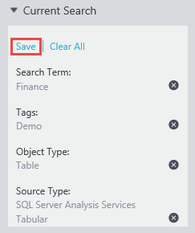
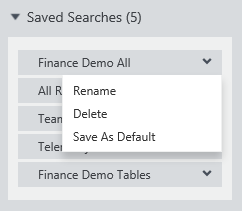
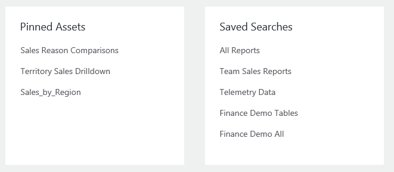

<properties
   pageTitle="So speichern Suchvorgänge und anheften Datenbestände | Microsoft Azure"
   description="Gewusst wie-Artikel hervorheben-Funktionen in Azure Datenkatalog für Datenquellen und Datenbestände zur späteren Wiederverwendung speichern."
   services="data-catalog"
   documentationCenter=""
   authors="steelanddata"
   manager="NA"
   editor=""
   tags=""/>
<tags
   ms.service="data-catalog"
   ms.devlang="NA"
   ms.topic="article"
   ms.tgt_pltfrm="NA"
   ms.workload="data-catalog"
   ms.date="10/10/2016"
   ms.author="maroche"/>

# So speichern Suchvorgänge und anheften Datenbestände

## Einführung

Microsoft Azure Datenkatalog bietet Funktionen für die Quelle Datenermittlung. Benutzer können schnell suchen und den Katalog zum Suchen von Datenquellen und deren Verwendungszweck verstehen filtern, auf denen es einfacher ist, um die richtigen Daten für den Auftrag zur hand zu ermitteln.

Aber Wissenswertes zum, wenn Benutzer regelmäßig arbeiten mit den gleichen Daten müssen? Wissenswertes zu, wenn Benutzer ihre Kenntnisse auf die gleiche Datenquellen im Katalog regelmäßig mitwirken In diesen Fällen wiederholt dieselben Suchvorgänge ausgeben müssen nicht effizient werden kann – dies ist, wobei Suchlauf und angehefteten Daten, die Posten helfen können.

## Gespeicherte Suchen

Eine gespeicherte Suche in Azure Datenkatalog ist wieder verwendbare, Definition pro Benutzer suchen. Nachdem eine Suche – einschließlich Suchbegriffe, Kategorien und anderen Filter – ein benutzerdefinierter kann er ihn zur späteren Verwendung zu speichern. Die Definition gespeicherte Suche kann dann erneut ausgeführt werden, zu einem späteren Zeitpunkt, um alle Datenbestände zurückzukehren, die die Suchkriterien entsprechen.

### Erstellen einer gespeicherten Suche

Um eine gespeicherte Suche erstellen zu können, müssen Sie zuerst Geben Sie die Suchkriterien wiederzuverwendende ein. Klicken Sie dann auf den Link "Speichern" im Feld "Aktuelle suchen" im Datenkatalog Azure-Portal.

 

Wenn Sie dazu aufgefordert werden, geben Sie einen Namen für die gespeicherte Suche aus. Wählen Sie einen Namen, der aussagekräftigen und beschreibenden der Datenbestände, die von der Suche zurückgegeben werden.

 

### Gespeicherte Suchen verwalten

Nachdem ein Benutzer eine oder mehrere Suchen gespeichert wurde, wird eine Option "Gespeicherte Suche" im Datenkatalog Azure-Portal unter dem Feld "Aktuelle suchen" angezeigt. Wenn erweitert wird, wird die vollständige Liste der speichert Suchvorgänge angezeigt.

 

Auswählen einer gespeicherten Suche aus der Liste bewirkt, dass die Suche, ausgeführt werden soll.

Klicken Sie im Dropdown-Menü auswählen, wird eine Reihe von Verwaltungsoptionen bereit:

 

"Umbenennen" auswählen, wird den Benutzer geben Sie einen neuen Namen für die gespeicherte Suche aufgefordert werden. Die Definition der Suche wird nicht geändert werden.

Sie die Option "Löschen" fordert den Benutzer zur Bestätigung, und die gespeicherte Suche werden dann aus der Liste des Benutzers entfernt.

"Als Standard speichern" auswählen, markieren Sie die ausgewählte Suchlauf als die Standardsuche für den Benutzer. Wenn der Benutzer eine "leere" nach der Homepage Azure Datenkatalog ausführt, wird den standardmäßigen Suchvorgang ausgeführt werden. Darüber hinaus markiert die Suche standardmäßig am oberen Rand der Liste Gespeicherte Suchen erscheint.

### Organisationseinheit gespeicherten Suchen

Jeder Benutzer kann Suchbegriffe zur eigenen Verwendung speichern. Daten-Katalog-Administratoren können auch sucht nach allen Benutzern innerhalb der Organisation speichern. Wenn Sie eine Suche speichern, wird eine Option aus, um die gespeicherte Suche innerhalb des Unternehmens freigeben Administratoren angezeigt. Wenn diese Option ausgewählt ist, wird die gespeicherte Suche in der Liste der verfügbaren sucht nach allen Benutzern enthalten.

 

## Angeheftete Datenbestände

Gespeicherte Suchen Benutzerberechtigungen zum Speichern und Wiederverwenden von Definitionen suchen; die von der Suche zurückgegebenen Datenbestände können während des Inhalts der Katalog-Änderung der Dauer geändert werden. Anheften Datenbestände ermöglicht Benutzern explizit bestimmte Daten Anlagen um sie für den Zugriff auf übersichtlicher gestalten, ohne eine Suche verwenden, identifizieren.

Anheften eines Wirtschaftsguts Daten ist einfach – Benutzer können einfach klicken Sie auf das Symbol für "fixieren" für die Anlage Daten sie ihre angehefteten Liste hinzu. Dieses Symbol wird in der Ecke der Kachel Anlage in der Kachelansicht, und klicken Sie in der Spalte ganz links in der Listenansicht im Datenkatalog Azure-Portal.

Fixierung aufheben eines Wirtschaftsguts gleichmäßig recht einfach ist – Benutzer klicken Sie einfach auf das Symbol für "fixieren" erneut aus, um die Einstellung für die ausgewählte Anlage umzuschalten.

## "Meine Ressourcen"
Homepage des Datenkatalog Azure Portals enthält einen Abschnitt von "Meine Posten", der relevante Ressourcen für den aktuellen Benutzer angezeigt werden. Dieser Abschnitt enthält beide angehefteten Posten und gespeicherte Suchen.

## Zusammenfassung
Azure Datenkatalog enthält Funktionen, die für die Datenquellen, die sie benötigen, die erfahren Sie, damit sie weniger Zeit, suchen Sie nach Daten und mehr Zeit mit it investieren, können Benutzer zu erleichtern. Gespeicherte Suchen und angehefteten Daten, die auf diesen zentralen Funktionen zu erstellen, damit Benutzer problemlos Datenquellen erkennen können, mit denen sie wiederholt funktionieren.
