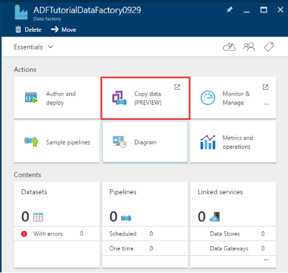
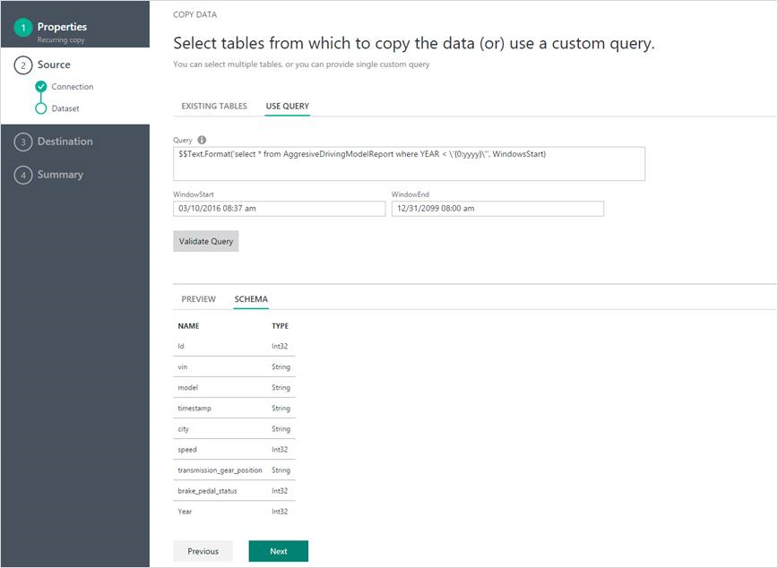
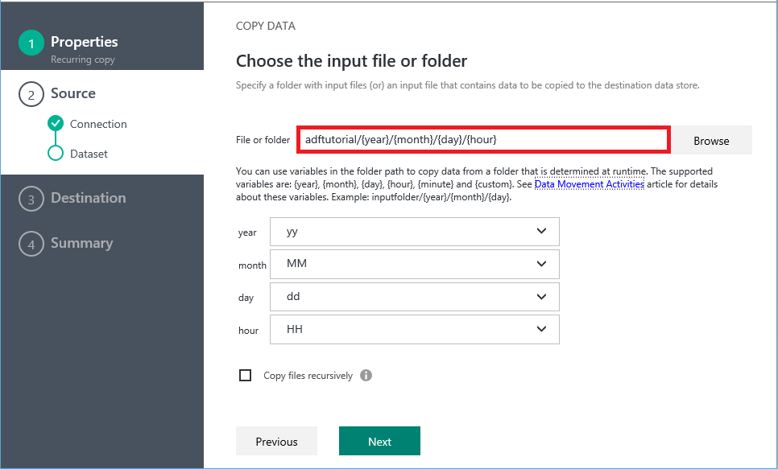

<properties
    pageTitle="Daten Factory Azure kopieren-Assistenten | Microsoft Azure"
    description="Informationen Sie dazu, wie Sie den Assistenten zum Kopieren von Daten Factory Azure verwenden Sie zum Kopieren von Daten aus unterstützten Datenquellen zu senken."
    services="data-factory"
    documentationCenter=""
    authors="spelluru"
    manager="jhubbard"
    editor="monicar"/>

<tags
    ms.service="data-factory"
    ms.workload="data-services"
    ms.tgt_pltfrm="na"
    ms.devlang="na"
    ms.topic="article"
    ms.date="10/03/2016"
    ms.author="spelluru"/>

# Azure-Daten Factory - Assistenten zum Kopieren von
Der Assistent zum Kopieren von Azure Daten Factory ist Verfahren technologische Daten, das in der Regel ein erster Schritt in einem Integrationsszenario mit End-to-End-Daten zu vereinfachen. Wenn Sie den Assistenten zum Kopieren von Azure Daten Factory durchgelassen, müssen Sie keine JSON-Definitionen für verknüpfte Services, Datasets und Rohrleitungen zu verstehen. Nach Abschluss aller Schritte des Assistenten erstellt der Assistent jedoch automatisch eine Verkaufspipeline, um Daten aus der ausgewählten Datenquelle in das ausgewählte Ziel zu kopieren. Darüber hinaus die kopieren-Assistenten können Sie zum Überprüfen der Daten, die zum Zeitpunkt der Erstellung, aufgenommen wird dem viel Zeit gespeichert, besonders wenn Sie sind Aufnahme Daten zum ersten Mal aus der Datenquelle. Um den Assistenten zum Kopieren beginnen möchten, klicken Sie auf die Kachel **Kopieren von Daten** auf der Homepage Ihrer Daten Factory.

## Eine intuitive Assistenten zum Kopieren von Daten
Mit diesem Assistenten können Sie ganz einfach Daten aus einer Vielzahl von Datenquellen in Ziele in Minuten verschieben. Nach Abschluss des Assistenten, wird eine Verkaufspipeline mit einer Kopie Aktivität automatisch für Sie zusammen mit abhängigen Daten Factory Einheiten (verknüpften Diensten und Datasets) erstellt. Zum Erstellen der Verkaufspipeline sind keine zusätzliche Schritte erforderlich.   

> [AZURE.NOTE] [Assistent zum Kopieren von Lernprogramm](data-factory-copy-data-wizard-tutorial.md) finden Sie im Artikel für eine schrittweise Anleitung zum Erstellen einer Stichprobe Verkaufspipeline zum Kopieren von Daten aus einer Azure BLOB-zu einer Tabelle Azure SQL-Datenbank. 

Der Assistent dient mit big Daten Punkte ab dem Anfang. Es ist einfach und effizient Daten Factory Pipelines erstellen, die mehrere hundert Ordner, Dateien oder Tabellen mit dem Assistenten kopieren zu verschieben. Der Assistent unterstützt die folgenden drei Funktionen: automatische Datenvorschau, Schema erfassen und Zuordnung und Filtern von Daten. 

## Automatische Datenvorschau 
Assistent zum Kopieren von können Sie überprüfen Teil der Daten aus der ausgewählten Datenquelle für Sie, um zu überprüfen, ob die Daten sie die richtigen Daten, die Sie kopieren möchten. Darüber hinaus ist die Quelldaten in eine Textdatei, analysiert des Assistenten zum Kopieren die Textdatei Zeilen- und Spaltentrennzeichen und Schema automatisch zu finden. 

## Schema erfassen und Zuordnung 
Das Schema der Eingabedaten möglicherweise nicht das Schema der Ausgabedaten in einigen Fällen überein. In diesem Szenario müssen Sie Spalten aus der Quellschema Spalten aus dem Zielschema zuordnen. 

Assistent zum Kopieren von ordnet automatisch Spalten in der Quellschema Spalten im Zielschema. Sie können im Zuordnungen überschreiben, indem Sie mithilfe der Dropdown-Listen (oder) geben an, ob eine Spalte beim Kopieren der Daten übersprungen werden muss.   

## Filtern von Daten  
Mit dem Assistenten können Sie zum Filtern der Quelldaten, um nur die Daten auszuwählen, die mit dem Ziel/Empfänger Datenspeicher kopiert werden muss. Filterung verringert die Lautstärke der Daten in der Empfänger Datenspeicher kopiert werden und daher verbessert den Durchsatz des Kopiervorgangs. Es stellt eine flexible Möglichkeit zum Filtern von Daten in einer relationalen Datenbank mithilfe von SQL Query Language (oder) Dateien in einem Ordner Azure Blob mithilfe von [Daten Factory-Funktionen und Variablen](data-factory-functions-variables.md).   

### Filtern von Daten in einer Datenbank  
Im Beispiel die SQL-Abfrage verwendet die `Text.Format` (Funktion) und `WindowStart` Variable. 

### Filtern von Daten in einem Azure Blob-Ordner
Verwenden von Variablen in den Ordnerpfad zum Kopieren von Daten aus einem Ordner, der zur Laufzeit basierend auf [Systemvariablen](data-factory-functions-variables.md#data-factory-system-variables)bestimmt wird. Die unterstützten Variablen sind: **{Jahr}**, **{Monat}**, **{Day}**, **{Stunde}**, **{Minute}**und **{benutzerdefinierte}**. Beispiel: Inputfolder / {Year} / {Monat} / {Tag}.

Nehmen Sie an, dass Sie Ordner in folgendem Format eingegeben haben:

    2016/03/01/01
    2016/03/01/02
    2016/03/01/03
    ...

Klicken Sie auf die Schaltfläche **Durchsuchen** für die **Datei oder einen Ordner**, navigieren Sie zu einem der folgenden Ordner (z. B. 2016-03 > -> 01 -> 02), und klicken Sie auf **auswählen**. Sie sollten finden Sie unter `2016/03/01/02` in das Textfeld ein. Ersetzen Sie nun **2016** mit **{Jahr}**, **03** mit **{Monat}**, **01** mit **{Day}**und **02** mit **{Stunde}**, und drücken Sie Tab. Wählen Sie das Format für diese vier Variablen Dropdown-Listen sollte angezeigt werden:

   

Wie im folgenden Screenshot gezeigt wird, können Sie auch eine **benutzerdefinierte** Variable und alle [Formatzeichenfolgen unterstützt](https://msdn.microsoft.com/library/8kb3ddd4.aspx). Verwenden Sie zum Auswählen eines Ordners mit dieser Struktur zuerst die Schaltfläche **Durchsuchen** . Klicken Sie dann ersetzen Sie einen Wert mit **{benutzerdefinierte}**, und drücken Sie Tab, um das Textfeld anzuzeigen, wo Sie die Formatzeichenfolge eingeben können.     

## Unterstützung für unterschiedliche Daten und Objekttypen
Mithilfe des Assistenten zum Kopieren, können Sie effizient hundert Tabellen, Dateien oder Ordner verschieben.

## Optionen zum Planen
Sie können den Kopiervorgang einmal oder nach einem Zeitplan (stündlich, täglich, usw.) ausführen. Beide der folgenden Optionen können für die große Bandbreite der Connectors über lokalen, Cloud und lokalen desktop kopieren verwendet werden.

Ein einmaligen Kopiervorgang ermöglicht das Verschieben von Daten aus einer Quelle zu einem Ziel nur einmal an. Es gilt für Daten von jeder Größe und unterstützter Formate. Die geplanten kopieren können Sie Daten in einer Serie vorgegebenen kopieren. Sie können Rich-Einstellungen (wie "Wiederholen", erklärt und Benachrichtigungen) so konfigurieren Sie die geplante Kopie verwenden.

## Nächste Schritte
Eine Kurzübersicht Exemplarische Vorgehensweise mithilfe des Assistenten zum Kopieren von Daten Factory zum Erstellen eines Verkaufspipeline mit Aktivität kopieren, finden Sie unter [Lernprogramm: Erstellen einer Verkaufspipeline mithilfe des Assistenten zum Kopieren](data-factory-copy-data-wizard-tutorial.md).
