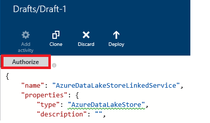

<properties
    pageTitle="Verschieben von Daten zu/aus Azure Lake Datenspeicher | Factory Azure-Daten"
    description="Informationen Sie zum Verschieben von Daten zu/aus Azure Lake Datenspeicher Azure Data Factory verwenden"
    services="data-factory"
    documentationCenter=""
    authors="linda33wj"
    manager="jhubbard"
    editor="monicar"/>

<tags
    ms.service="data-factory"
    ms.workload="data-services"
    ms.tgt_pltfrm="na"
    ms.devlang="na"
    ms.topic="article"
    ms.date="09/27/2016"
    ms.author="jingwang"/>

# Verschieben von Daten an und von Azure Lake Datenspeicher Azure Data Factory verwenden
In diesem Artikel wird beschrieben, wie Sie die Aktivität kopieren in einer Factory Azure-Daten zum Verschieben von Daten aus dem und in Azure Lake Datenspeicher zu/aus einem anderen Datenspeicher verwenden können. In diesem Artikel wird im Artikel [Daten Bewegung Aktivitäten](data-factory-data-movement-activities.md) , die eine allgemeine Übersicht über das Verschieben von Daten mit der Aktivität kopieren und die unterstützten Data Store Kombinationen bietet erstellt.

> [AZURE.NOTE]
> Erstellen Sie ein Konto Azure Lake Datenspeicher, vor dem Erstellen einer Verkaufspipeline mit einer Kopie Aktivität zum Verschieben von Daten in einer Azure Daten Lake Store. Weitere Informationen zu Azure Lake Datenspeicher finden Sie unter [Erste Schritte mit Azure dem Datenspeicher](../data-lake-store/data-lake-store-get-started-portal.md).
>  
> Überprüfen Sie die [Erstellen Ihrer ersten Verkaufspipeline Lernprogramm](data-factory-build-your-first-pipeline.md) die detaillierten Schritte zum Erstellen einer Factory Daten, verknüpften Diensten, Datasets und eine Verkaufspipeline. Verwenden Sie den JSON-Codeausschnitte mit Daten Factory-Editor oder Visual Studio oder Azure PowerShell, um die Daten Factory-Elemente zu erstellen.

## Assistent zum Kopieren von Daten
Die einfachste Möglichkeit, eine Verkaufspipeline zu erstellen, die Daten zu/aus Azure Lake Datenspeicher kopiert besteht darin, den Assistenten zum Kopieren von Daten verwenden. Finden Sie unter [Lernprogramm: Erstellen einer Verkaufspipeline mithilfe des Assistenten zum Kopieren von](data-factory-copy-data-wizard-tutorial.md) für eine schnelle Exemplarische Vorgehensweise zum Erstellen einer Verkaufspipeline mithilfe des Assistenten zum Kopieren von Daten. 

In den folgenden Beispielen bieten Stichprobe JSON-Definitionen, mit denen Sie eine Verkaufspipeline mithilfe von [Azure-Portal](data-factory-copy-activity-tutorial-using-azure-portal.md) oder [Visual Studio](data-factory-copy-activity-tutorial-using-visual-studio.md) oder [Azure PowerShell](data-factory-copy-activity-tutorial-using-powershell.md)erstellen. Wird gezeigt, wie Daten an und von Azure Lake Datenspeicher und Azure BLOB-Speicher kopieren. Daten kann jedoch kopierten **direkt** aus einer der Quellen an die senken angegebener [hier](data-factory-data-movement-activities.md#supported-data-stores) die Aktivität kopieren in Azure Data Factory verwenden.  

## Beispiel: Kopieren Sie Daten aus Azure Blob in Azure Lake Datenspeicher
Im folgende Beispiel gezeigt:

1.  Eine verknüpfte Dienst vom Typ [AzureStorage](#azure-storage-linked-service-properties).
2.  Eine verknüpfte Dienst vom Typ [AzureDataLakeStore](#azure-data-lake-linked-service-properties).
3.  Eine Eingabe- [Dataset](data-factory-create-datasets.md) vom Typ [AzureBlob](#azure-blob-dataset-type-properties).
4.  Eine Ausgabe [Dataset](data-factory-create-datasets.md) vom Typ [AzureDataLakeStore](#azure-data-lake-dataset-type-properties).
4.  Eine [Verkaufspipeline](data-factory-create-pipelines.md) mit einer Aktivität kopieren, die [BlobSource](#azure-blob-copy-activity-type-properties) und [AzureDataLakeStoreSink](#azure-data-lake-copy-activity-type-properties)verwendet.

Im Beispiel kopiert Zeit-Serie Daten von einer Azure BLOB-Speicher auf Azure Lake Datenspeicher stündlich. Die JSON-Eigenschaften, die in diesen Beispielen verwendete werden in den Beispielen folgen Abschnitten beschrieben.

**Azure verknüpft Speicherdienst:**

    {
      "name": "StorageLinkedService",
      "properties": {
        "type": "AzureStorage",
        "typeProperties": {
          "connectionString": "DefaultEndpointsProtocol=https;AccountName=<accountname>;AccountKey=<accountkey>"
        }
      }
    }

**Azure Daten Lake verknüpft Dienst an:**

    {
        "name": "AzureDataLakeStoreLinkedService",
        "properties": {
            "type": "AzureDataLakeStore",
            "typeProperties": {
                "dataLakeStoreUri": "https://<accountname>.azuredatalakestore.net/webhdfs/v1",
                "sessionId": "<session ID>",
                "authorization": "<authorization URL>"
            }
        }
    }

### So erstellen Sie Azure Daten dem verknüpfte Dienst mit Daten Factory-Editor
Das folgende Verfahren enthält Schritte zum Erstellen eines Azure Lake Datenspeicher verknüpft-Diensts, mit dem Daten Factory-Editor.

1. Klicken Sie auf der Befehlsleiste auf **neue Daten speichern möchten** , und wählen Sie **Azure dem Datenspeicher**.
2. Geben Sie in den JSON-Editor, für die Eigenschaft **DataLakeStoreUri** den URI für die Daten See.
3. Klicken Sie auf die Schaltfläche auf der Befehlsleiste **Autorisieren** . Es sollte ein Popupfenster angezeigt.

    

4. Melden Sie sich unter Verwendung Ihrer Anmeldeinformationen, und die **Autorisierung** -Eigenschaft in den JSON sollte nun auf einen Wert zugewiesen werden.
5. (optional) Geben Sie Werte für optionale Parameter wie **Kontoname**, **SubscriptionID**und **ResourceGroupName** in das JSON (oder) löschen Sie diese Eigenschaften aus den JSON.
6. Klicken Sie auf der Befehlsleiste verknüpften Dienst bereitstellen auf **Bereitstellen** .

> [AZURE.IMPORTANT] Der Autorisierungscode, den Sie mithilfe der Schaltfläche **Autorisieren** generiert läuft ab nach einer Weile. Schaltfläche **autorisieren möchten** , verwenden die **Autorisieren** , wenn die **Sicherheitstoken abläuft** und die erneute Bereitstellung verknüpfter Dienst. Siehe Abschnitt " [Azure Daten dem Store verknüpfte Service](#azure-data-lake-store-linked-service-properties) " Details. 

**Azure Blob Eingabe-Dataset:**

Daten werden übernommen aus einer neuen Blob stündlich (Häufigkeit: Stunde, Intervall: 1). Der Ordnername Pfad und den Dateinamen für die Blob werden dynamisch ausgewertet, basierend auf der Startzeit des Segments, die verarbeitet wird. Der Pfad des verwendet Jahr, Monat und Tagesanteil der Startzeit und Dateinamen der Stundenteil des der Startzeit. "externe": "true" Einstellung informiert Daten Factory-Dienst, dass die Tabelle externe Daten Fabrik Wert und nicht durch eine Aktivität in der Factory Daten erstellt wird.

    {
      "name": "AzureBlobInput",
      "properties": {
        "type": "AzureBlob",
        "linkedServiceName": "StorageLinkedService",
        "typeProperties": {
          "folderPath": "mycontainer/myfolder/yearno={Year}/monthno={Month}/dayno={Day}",
          "partitionedBy": [
            {
              "name": "Year",
              "value": {
                "type": "DateTime",
                "date": "SliceStart",
                "format": "yyyy"
              }
            },
            {
              "name": "Month",
              "value": {
                "type": "DateTime",
                "date": "SliceStart",
                "format": "MM"
              }
            },
            {
              "name": "Day",
              "value": {
                "type": "DateTime",
                "date": "SliceStart",
                "format": "dd"
              }
            },
            {
              "name": "Hour",
              "value": {
                "type": "DateTime",
                "date": "SliceStart",
                "format": "HH"
              }
            }
          ]
        },
        "external": true,
        "availability": {
          "frequency": "Hour",
          "interval": 1
        },
        "policy": {
          "externalData": {
            "retryInterval": "00:01:00",
            "retryTimeout": "00:10:00",
            "maximumRetry": 3
          }
        }
      }
    }

**Azure Daten Lake ausgeben Dataset:**

Im Beispiel werden die Daten in einer Azure Daten Lake Store kopiert. Neue Daten ist zu Daten Lake Kopien stündlich speichern.

    {
        "name": "AzureDataLakeStoreOutput",
        "properties": {
            "type": "AzureDataLakeStore",
            "linkedServiceName": "AzureDataLakeStoreLinkedService",
            "typeProperties": {
                "folderPath": "datalake/output/"
            },
            "availability": {
                "frequency": "Hour",
                "interval": 1
            }
        }
    }

**Mit einer Kopie Aktivität Pipeline:**

Der Verkaufspipeline enthält eine Kopie-Aktivität, ist so konfiguriert, dass die Eingabe- und Datasets verwenden und stündlich Ausführung geplant ist. Klicken Sie in der Verkaufspipeline JSON-Definition der Typ der **Quelle** auf **BlobSource** festgelegt ist, und Typ der **Empfänger** auf **AzureDataLakeStoreSink**festgelegt ist.

    {  
        "name":"SamplePipeline",
        "properties":
        {  
            "start":"2014-06-01T18:00:00",
            "end":"2014-06-01T19:00:00",
            "description":"pipeline with copy activity",
            "activities":
            [  
                {
                    "name": "AzureBlobtoDataLake",
                    "description": "Copy Activity",
                    "type": "Copy",
                    "inputs": [
                    {
                        "name": "AzureBlobInput"
                    }
                    ],
                    "outputs": [
                    {
                        "name": "AzureDataLakeStoreOutput"
                    }
                    ],
                    "typeProperties": {
                        "source": {
                            "type": "BlobSource",
                            "treatEmptyAsNull": true,
                            "blobColumnSeparators": ","
                        },
                        "sink": {
                            "type": "AzureDataLakeStoreSink"
                        }
                    },
                    "scheduler": {
                        "frequency": "Hour",
                        "interval": 1
                    },
                    "policy": {
                        "concurrency": 1,
                        "executionPriorityOrder": "OldestFirst",
                        "retry": 0,
                        "timeout": "01:00:00"
                    }
                }
            ]
        }
    }

## Beispiel: Kopieren Sie Daten aus Azure Lake Datenspeicher in Azure Blob
Im folgende Beispiel gezeigt:

1.  Eine verknüpfte Dienst vom Typ [AzureDataLakeStore](#azure-data-lake-linked-service-properties).
2.  Eine verknüpfte Dienst vom Typ [AzureStorage](#azure-storage-linked-service-properties).
3.  Eine Eingabe- [Dataset](data-factory-create-datasets.md) vom Typ [AzureDataLakeStore](#azure-data-lake-dataset-type-properties).
4.  Eine Ausgabe [Dataset](data-factory-create-datasets.md) vom Typ [AzureBlob](#azure-blob-dataset-type-properties).
5.  Eine [Verkaufspipeline](data-factory-create-pipelines.md) mit einer Aktivität kopieren, die [AzureDataLakeStoreSource](#azure-data-lake-copy-activity-type-properties) und [BlobSink](#azure-blob-copy-activity-type-properties) verwendet.

Im Beispiel Zeit-Serie Daten kopiert eine Azure Daten Lake Store zu einer Azure Blob stündlich. Die JSON-Eigenschaften, die in diesen Beispielen verwendete werden in den Beispielen folgen Abschnitten beschrieben.

**Azure Lake Datenspeicher verknüpft Dienst an:**

    {
        "name": "AzureDataLakeStoreLinkedService",
        "properties": {
            "type": "AzureDataLakeStore",
            "typeProperties": {
                "dataLakeStoreUri": "https://<accountname>.azuredatalakestore.net/webhdfs/v1",
                "sessionId": "<session ID>",
                "authorization": "<authorization URL>"
            }
        }
    }

> [AZURE.NOTE] Informationen Sie zu den Schritten im vorherigen Beispiel Autorisierung URL abrufen.  

**Azure verknüpft Speicherdienst:**

    {
      "name": "StorageLinkedService",
      "properties": {
        "type": "AzureStorage",
        "typeProperties": {
          "connectionString": "DefaultEndpointsProtocol=https;AccountName=<accountname>;AccountKey=<accountkey>"
        }
      }
    }

**Azure Daten Lake Eingabemethoden Dataset:**

Festlegen von **"externe": WAHR** informiert Sie dem Daten Factory-Dienst, dass die Tabelle externe Daten Fabrik Wert und nicht durch eine Aktivität in der Factory Daten erstellt wird.

    {
        "name": "AzureDataLakeStoreInput",
        "properties":
        {
            "type": "AzureDataLakeStore",
            "linkedServiceName": "AzureDataLakeStoreLinkedService",
            "typeProperties": {
                "folderPath": "datalake/input/",
                "fileName": "SearchLog.tsv",
                "format": {
                    "type": "TextFormat",
                    "rowDelimiter": "\n",
                    "columnDelimiter": "\t"
                }
            },
            "external": true,
            "availability": {
                "frequency": "Hour",
                "interval": 1
            },
            "policy": {
                "externalData": {
                    "retryInterval": "00:01:00",
                    "retryTimeout": "00:10:00",
                    "maximumRetry": 3
                }
            }
        }
    }

**Azure Blob ausgeben Dataset:**

Jede Stunde Daten in einer neuen Blob geschrieben (Häufigkeit: Stunde, Intervall: 1). Pfad des Ordners für das Blob wird dynamisch ausgewertet basierend auf der Startzeit des Segments, die verarbeitet wird. Der Pfad des verwendet Jahr, Monat, Tag und Stunden Teile der Startzeit.

    {
      "name": "AzureBlobOutput",
      "properties": {
        "type": "AzureBlob",
        "linkedServiceName": "StorageLinkedService",
        "typeProperties": {
          "folderPath": "mycontainer/myfolder/yearno={Year}/monthno={Month}/dayno={Day}/hourno={Hour}",
          "partitionedBy": [
            {
              "name": "Year",
              "value": {
                "type": "DateTime",
                "date": "SliceStart",
                "format": "yyyy"
              }
            },
            {
              "name": "Month",
              "value": {
                "type": "DateTime",
                "date": "SliceStart",
                "format": "MM"
              }
            },
            {
              "name": "Day",
              "value": {
                "type": "DateTime",
                "date": "SliceStart",
                "format": "dd"
              }
            },
            {
              "name": "Hour",
              "value": {
                "type": "DateTime",
                "date": "SliceStart",
                "format": "HH"
              }
            }
          ],
          "format": {
            "type": "TextFormat",
            "columnDelimiter": "\t",
            "rowDelimiter": "\n"
          }
        },
        "availability": {
          "frequency": "Hour",
          "interval": 1
        }
      }
    }

**Pipeline mit der Aktivität kopieren:**

Der Verkaufspipeline enthält eine Kopie-Aktivität, ist so konfiguriert, dass die Eingabe- und Datasets verwenden und stündlich Ausführung geplant ist. Klicken Sie in der Verkaufspipeline JSON-Definition der Typ der **Quelle** auf **AzureDataLakeStoreSource** festgelegt ist, und Typ der **Empfänger** auf **BlobSink**festgelegt ist.

    {  
        "name":"SamplePipeline",
        "properties":{  
            "start":"2014-06-01T18:00:00",
            "end":"2014-06-01T19:00:00",
            "description":"pipeline for copy activity",
            "activities":[  
                {
                    "name": "AzureDakeLaketoBlob",
                    "description": "copy activity",
                    "type": "Copy",
                    "inputs": [
                      {
                        "name": "AzureDataLakeStoreInput"
                      }
                    ],
                    "outputs": [
                      {
                        "name": "AzureBlobOutput"
                      }
                    ],
                    "typeProperties": {
                        "source": {
                            "type": "AzureDataLakeStoreSource",
                        },
                        "sink": {
                            "type": "BlobSink"
                        }
                    },
                    "scheduler": {
                        "frequency": "Hour",
                        "interval": 1
                    },
                    "policy": {
                        "concurrency": 1,
                        "executionPriorityOrder": "OldestFirst",
                        "retry": 0,
                        "timeout": "01:00:00"
                    }
                }
             ]
        }
    }

## Azure Daten dem Store verknüpfte Service-Eigenschaften

Sie können ein Konto Azure-Speicher mit einer Azure Daten Factory mithilfe einer Azure verknüpft Speicherdienst verknüpfen. Die folgende Tabelle enthält eine Beschreibung für den JSON-Elemente, die speziell für Azure verknüpft Speicherdienst.

| Eigenschaft | Beschreibung | Erforderlich |
| :-------- | :----------- | :-------- |
| Typ | Die Eigenschaft muss auf festgelegt sein: **AzureDataLakeStore** | Ja |
| dataLakeStoreUri | Geben Sie Informationen über das Azure Lake Datenspeicher-Konto an. Es ist in folgendem Format: https://<Azure Data Lake account name>.azuredatalakestore.net/webhdfs/v1 | Ja |
| Autorisierung | Klicken Sie auf die Schaltfläche **Autorisieren** in den **Daten Factory-Editor** , und geben Sie Ihre Anmeldeinformationen, die die URL für die automatisch generierte Autorisierung dieser Eigenschaft zuweist.  | Ja |
| sessionId | OAuth Sitzung-Id aus der Oauth Autorisierung Sitzung. Jede Id für eine Sitzung ist eindeutig und darf nur einmal verwendet werden. Diese Einstellung wird automatisch generiert, wenn Sie Daten Factory-Editor verwenden. | Ja |  
| Kontoname | Daten Lake Kontonamen | Nein |
| subscriptionId | Azure-Abonnement-ID an. | Nein (wenn nicht angegeben, wird der Daten Factory Abonnement verwendet). |
| resourceGroupName |  Gruppennamen Azure Ressource | Nein (wenn nicht angegeben, wird der Daten Factory Ressourcengruppe verwendet). |

## Token Ablauf 
Der Autorisierungscode, die, den Sie mithilfe der Schaltfläche **Autorisieren** generieren, läuft ab nach einer Weile. In der folgenden Tabelle finden Sie die Ablaufzeiten für verschiedene Typen von Benutzerkonten. Wird den folgenden Fehler angezeigt Meldung an, wenn die Authentifizierung **Sicherheitstoken abläuft**: "Vorgang Anmeldefehler: Invalid_grant - AADSTS70002: Fehler beim Überprüfen der Anmeldeinformationen. AADSTS70008: Die bereitgestellten Zugriff gewähren abgelaufen ist oder widerrufen. Verfolgen von ID: d18629e8-af88-43c5-88e3-d8419eb1fca1 Korrelations-ID: fac30a0c-6be6-4e02-8d69-a776d2ffefd7 Zeitstempel: 2015-12-15 21-09-31Z ".

| Benutzertyp | Läuft ab nach |
| :-------- | :----------- | 
| Benutzerkonten, die nicht von Azure Active Directory verwaltet (@hotmail.com, @live.com, usw..). | 12 Stunden |
| Konten für Benutzer von Azure Active Directory (AAD) verwaltet | 14 Tage nach dem letzten Segment ausführen zu können.   90 Tage, wenn ein Segment basierend auf Verknüpfte Dienst OAuth-basierten alle 14 Tage mindestens einmal ausgeführt wird. |

Wenn Sie Ihr Kennwort vor diesem Ablaufzeitpunkt token ändern, das Token läuft ab sofort und den in diesem Abschnitt genannten Fehler zu sehen. 

Um zu vermeiden, / dieser Fehler beheben, autorisieren möchten, verwenden die **Autorisieren** Schaltfläche, wenn die **Sicherheitstoken abläuft** und die erneute Bereitstellung verknüpfter Dienst. Sie können auch die Werte für **SessionId** und **Autorisierung** Eigenschaften programmgesteuert im folgenden Abschnitt mit Code generieren:

### Programmgesteuert SessionId und Autorisierung Werte generieren 

    if (linkedService.Properties.TypeProperties is AzureDataLakeStoreLinkedService ||
        linkedService.Properties.TypeProperties is AzureDataLakeAnalyticsLinkedService)
    {
        AuthorizationSessionGetResponse authorizationSession = this.Client.OAuth.Get(this.ResourceGroupName, this.DataFactoryName, linkedService.Properties.Type);

        WindowsFormsWebAuthenticationDialog authenticationDialog = new WindowsFormsWebAuthenticationDialog(null);
        string authorization = authenticationDialog.AuthenticateAAD(authorizationSession.AuthorizationSession.Endpoint, new Uri("urn:ietf:wg:oauth:2.0:oob"));

        AzureDataLakeStoreLinkedService azureDataLakeStoreProperties = linkedService.Properties.TypeProperties as AzureDataLakeStoreLinkedService;
        if (azureDataLakeStoreProperties != null)
        {
            azureDataLakeStoreProperties.SessionId = authorizationSession.AuthorizationSession.SessionId;
            azureDataLakeStoreProperties.Authorization = authorization;
        }

        AzureDataLakeAnalyticsLinkedService azureDataLakeAnalyticsProperties = linkedService.Properties.TypeProperties as AzureDataLakeAnalyticsLinkedService;
        if (azureDataLakeAnalyticsProperties != null)
        {
            azureDataLakeAnalyticsProperties.SessionId = authorizationSession.AuthorizationSession.SessionId;
            azureDataLakeAnalyticsProperties.Authorization = authorization;
        }
    }

Finden Sie Details zu den Daten Factory-Klassen im Code verwendeten [AzureDataLakeStoreLinkedService Class](https://msdn.microsoft.com/library/microsoft.azure.management.datafactories.models.azuredatalakestorelinkedservice.aspx), [AzureDataLakeAnalyticsLinkedService Class](https://msdn.microsoft.com/library/microsoft.azure.management.datafactories.models.azuredatalakeanalyticslinkedservice.aspx)und [AuthorizationSessionGetResponse Klasse](https://msdn.microsoft.com/library/microsoft.azure.management.datafactories.models.authorizationsessiongetresponse.aspx) Themen. Fügen Sie einen Verweis auf **2.9.10826.1824** Version von **Microsoft.IdentityModel.Clients.ActiveDirectory.WindowsForms.dll** für die WindowsFormsWebAuthenticationDialog-Klasse im Code verwendet. 
 

## Azure Daten Lake Typ Datensatzeigenschaften

Eine vollständige Liste der JSON-Abschnitte und Eigenschaften, die zum Definieren von Datasets zur Verfügung finden Sie im Artikel [Datasets erstellen](data-factory-create-datasets.md) . Abschnitte wie Struktur, Verfügbarkeit und Richtlinie eines Datasets JSON ähneln für alle Dataset-Typen (Azure SQL Azure Blob, Azure Table usw..).

Im Abschnitt **TypeProperties** unterscheidet sich für jede Art von Dataset und enthält Informationen über den Speicherort, formatieren usw., der die Daten in der Datenquelle. Im Abschnitt TypeProperties für Dataset vom Typ **AzureDataLakeStore** Dataset weist die folgenden Eigenschaften:

| Eigenschaft | Beschreibung | Erforderlich |
| :-------- | :----------- | :-------- |
| Ordnerpfad | Pfad zum Container und Ordner in der Azure-Daten Lake speichern. | Ja |
| Dateiname | Name der Datei im Speicher Azure Daten Lake. FileName ist optional und Groß-/Kleinschreibung beachtet.   Wenn Sie einen Dateinamen angeben, funktioniert die Aktivität (einschließlich kopieren) auf bestimmte Datei.  Wenn FileName nicht angegeben ist, enthält Kopie aller Dateien in den Ordnerpfad für die Eingabe-Dataset an.  Wenn FileName nicht für ein Dataset Ausgabe angegeben ist, der Namen der generierten Datei in den folgenden wäre dieses Format: Daten. <Guid>txt (zum Beispiel:: Data.0a405f8a-93ff-4c6f-b3be-f69616f1df7a.txt | Nein |
| partitionedBy | PartitionedBy ist eine optionale Eigenschaft. Sie können es verwenden, um eine dynamische Ordnerpfad und den Dateinamen für die Reihe Zeitdaten anzugeben. Beispielsweise kann Ordnerpfad für jede Stunde Daten parametrisierte werden. Finden Sie im Abschnitt [verwenden PartitionedBy Eigenschaft](#using-partitionedby-property) Details und Beispielen aus. | Nein |
| Format | Die folgenden Arten von Format werden unterstützt: **TextFormat**, **AvroFormat**, **JsonFormat**, **OrcFormat**, **ParquetFormat**. Legen Sie die Eigenschaft **Typ** , klicken Sie unter Format auf einen der folgenden Werte ein. Finden Sie Details Abschnitten [TextFormat zurück, der angibt](#specifying-textformat), [AvroFormat zurück, der angibt](#specifying-avroformat), [JsonFormat zurück, der angibt](#specifying-jsonformat), [OrcFormat angeben](#specifying-orcformat)und [ParquetFormat angeben](#specifying-parquetformat) . Wenn Sie die Dateien als kopieren möchten – ist zwischen Datei-basierten Stores (binäre kopieren), können Sie den Formatabschnitt beide Definitionen Eingabe- und Dataset überspringen.| Nein
| Komprimierung | Geben Sie den Typ und die Ebene der Komprimierung für die Daten ein. Unterstützte Datentypen sind: **GZip**, **Deflate**, und **BZip2** und unterstützten Ebenen sind: **Optimal** und **am schnellsten**. Die komprimierungseinstellungen werden für Daten in **AvroFormat** oder **OrcFormat**derzeit nicht unterstützt. Weitere Informationen finden Sie unter [Unterstützung der Komprimierung](#compression-support) Abschnitt.  | Nein |

### Verwenden die Eigenschaft partitionedBy
Sie können eine dynamische Ordnerpfad und den Dateinamen für die Reihe Zeitdaten mit Abschnitt **PartitionedBy** , Daten Factory Makros und das Systemvariablen angeben: SliceStart und SliceEnd, die Start- und Endzeiten für einen angegebenen Daten Segment angeben.

Finden Sie unter [Erstellen von Datasets](data-factory-create-datasets.md) und [Planung & Ausführung](data-factory-scheduling-and-execution.md) Artikeln zu verstehen, weitere Details auf Zeit Reihe Datasets, Planung und Segmente.

#### Beispiel 1

    "folderPath": "wikidatagateway/wikisampledataout/{Slice}",
    "partitionedBy":
    [
        { "name": "Slice", "value": { "type": "DateTime", "date": "SliceStart", "format": "yyyyMMddHH" } },
    ],

In diesem Beispiel {Segment} wird mit dem angegebenen Wert Daten Factory System Variablen SliceStart im Format (YYYYMMDDHH) ersetzt. Die SliceStart bezieht sich zur Startzeit des Segments. Der Ordnerpfad unterscheidet sich für jedes Segment. Beispiel: Wikidatagateway/Wikisampledataout/2014100103 oder Wikidatagateway/Wikisampledataout/2014100104

#### Beispiel 2

    "folderPath": "wikidatagateway/wikisampledataout/{Year}/{Month}/{Day}",
    "fileName": "{Hour}.csv",
    "partitionedBy":
     [
        { "name": "Year", "value": { "type": "DateTime", "date": "SliceStart", "format": "yyyy" } },
        { "name": "Month", "value": { "type": "DateTime", "date": "SliceStart", "format": "MM" } },
        { "name": "Day", "value": { "type": "DateTime", "date": "SliceStart", "format": "dd" } },
        { "name": "Hour", "value": { "type": "DateTime", "date": "SliceStart", "format": "hh" } }
    ],

In diesem Beispiel werden Jahr, Monat, Tag und die Uhrzeit der SliceStart in separaten Variablen extrahiert, die von den Ordnerpfad und den Dateinamen Eigenschaften verwendet werden.

[AZURE.INCLUDE [data-factory-file-format](../../includes/data-factory-file-format.md)]
 

### Unterstützung für die Komprimierung  
Verarbeitung großen Datenmengen kann dazu führen, dass e/a und Netzwerkengpässen. Daher komprimierte Daten in Stores können nicht nur Datenübertragung im Netzwerk beschleunigen und Speicherplatz zu sparen, aber auch bringen Leistung erheblich verbesserte Verarbeitung big Data. Datei-basierten Datenspeicher wie Azure Blob oder lokalen Dateisystem wird derzeit Komprimierung unterstützt.  

Verwenden Sie Komprimierung für ein Dataset, um die Eigenschaft **Komprimierung** im Dataset JSON wie im folgenden Beispiel gezeigt:   

    {  
        "name": "AzureDatalakeStoreDataSet",  
        "properties": {  
            "availability": {  
                "frequency": "Day",  
                "interval": 1  
            },  
            "type": "AzureDatalakeStore",  
            "linkedServiceName": "DataLakeStoreLinkedService",  
            "typeProperties": {  
                "fileName": "pagecounts.csv.gz",  
                "folderPath": "compression/file/",  
                "compression": {  
                    "type": "GZip",  
                    "level": "Optimal"  
                }  
            }  
        }  
    }  
 
Im Abschnitt **Komprimierung** verfügt über zwei Eigenschaften:  
  
- **Typ:** Komprimierung Codecs, die **GZIP**, **Deflate** oder **BZIP2**dienen.  
- **Ebene:** das Komprimierungsverhältnis, der **Optimal** oder **am schnellsten**sein kann. 
    - **Am schnellsten:** Die Komprimierung sollte Vorgang so schnell wie möglich, selbst wenn die resultierende Datei nicht optimal komprimiert ist. 
    - **Optimal**: der Komprimierungsvorgang sollte optimal komprimiert werden, auch wenn der Vorgang eine längere Zeit in Anspruch nimmt. 
    
    Weitere Informationen finden Sie unter [Komprimierungsebene](https://msdn.microsoft.com/library/system.io.compression.compressionlevel.aspx) Thema. 

Nehmen Sie an, dass das Stichprobendataset als die Ausgabe einer Aktivität kopieren verwendet wird. Die Aktivität kopieren komprimiert die Ausgabedaten mit GZIP Codec optimale Verhältnis verwenden und dann die komprimierten Daten in einer Datei namens pagecounts.csv.gz im Speicher Azure Daten Lake schreibt.   

Wenn Sie in einer Eingabe JSON-Dataset Komprimierung Eigenschaft angeben, liest die Verkaufspipeline komprimierte Daten aus der Quelle. Wenn Sie die Eigenschaft in einem Dataset Ausgabe JSON angeben, kann die Aktivität kopieren komprimierte Daten in das Ziel geschrieben. Hier sind einige Beispielszenarien aus: 

- Lesen GZIP komprimierte Daten aus einem Azure Lake Datenspeicher Dekomprimieren Sie sie, und Schreiben von Ergebnisdaten in einer SQL Azure-Datenbank. Das Eingabe Azure Lake Datenspeicher-Dataset mit der Komprimierung JSON-Eigenschaft definieren in diesem Fall. 
- Lesen von Daten aus einer nur-Text-Datei aus lokalen Dateisystem, mit GZip-Format komprimieren und die komprimierten Daten in einer Azure Lake Datenspeicher schreiben. In diesem Fall definieren Sie ein Dataset Ausgabe Azure Daten Lake, mit der Komprimierung JSON-Eigenschaft.  
- Lesen Sie eine komprimierte GZIP-Daten aus einem Azure Lake Datenspeicher, dekomprimieren Sie sie, komprimieren sie mithilfe von BZIP2 und Schreiben Sie Ergebnisdaten in einer Azure Lake Datenspeicher zu. Sie legen Sie Komprimierung Typ festlegen als GZIP und BZIP2 Eingabe und Datasets Hilfethemas ausgeben.   

## Azure Daten dem Kopieren Aktivität Schrifteigenschaften  
Eine vollständige Liste der Abschnitte und Eigenschaften zum Definieren von Aktivitäten verfügbar sind finden Sie unter Artikel [Pipelines erstellen](data-factory-create-pipelines.md) . Eigenschaften wie Name, Beschreibung, Eingabe- und Tabellen und Richtlinie stehen für alle Arten von Aktivitäten.

Im Abschnitt TypeProperties der Aktivität verfügbaren Eigenschaften variieren andererseits bei jeder Aktivität. Aktivitäten, kopieren variieren je nach den Typen von Datenquellen und senken

**AzureDataLakeStoreSource** unterstützt Abschnitt **TypeProperties** folgende Eigenschaften:

| Eigenschaft | Beschreibung | Zulässigen Werte | Erforderlich |
| -------- | ----------- | -------------- | -------- |
| Rekursive | Gibt an, ob die Daten rekursiv aus den Sub-Ordnern oder nur aus dem angegebenen Ordner gelesen werden. | True (Standardwert), False | Nein |

**AzureDataLakeStoreSink** unterstützt Abschnitt **TypeProperties** folgende Eigenschaften:

| Eigenschaft | Beschreibung | Zulässigen Werte | Erforderlich |
| -------- | ----------- | -------------- | -------- |
| copyBehavior | Gibt das Verhalten beim Kopieren. | **PreserveHierarchy:** behält die Hierarchie im Zielordner. Der relative Pfad der Quelldatei in Quellordner entspricht der relative Pfad der Zieldatei zum Zielordner.  **FlattenHierarchy:** werden alle Dateien im Ordner "Datenquelle" in die erste Ebene von Zielordner erstellt. Mit dem Namen automatisch generiert werden die Zieldateien erstellt.  **MergeFiles:** werden alle Dateien aus dem Quellordner zu einer Datei zusammengeführt. Wenn der Name der Datei/Blob angegeben wird, wäre der verbundenen Dateiname den angegebenen Namen; Andernfalls wäre automatisch generierten Dateinamen. | Nein |

[AZURE.INCLUDE [data-factory-structure-for-rectangualr-datasets](../../includes/data-factory-structure-for-rectangualr-datasets.md)]

[AZURE.INCLUDE [data-factory-type-conversion-sample](../../includes/data-factory-type-conversion-sample.md)]

[AZURE.INCLUDE [data-factory-column-mapping](../../includes/data-factory-column-mapping.md)]

## Leistung und optimieren  
Finden Sie unter [Kopieren Aktivität Leistung und Optimieren von Leitfaden für](data-factory-copy-activity-performance.md) die Leistung Einfluss der Daten Bewegung (Kopieren Aktivität) in Azure Data Factory und verschiedene Methoden zum Optimieren sie wichtige Faktoren lernen.
