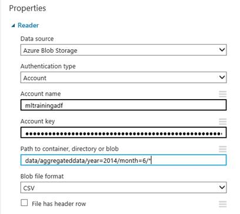

<properties 
    pageTitle="Computer-Schulung Aktivitäten verwenden | Microsoft Azure" 
    description="Beschreibt das Erstellen von erstellen Vorhersage Pipelines mit Azure Data Factory und Azure-Computer-Schulung" 
    services="data-factory" 
    documentationCenter="" 
    authors="sharonlo101" 
    manager="jhubbard" 
    editor="monicar"/>

<tags 
    ms.service="data-factory" 
    ms.workload="data-services" 
    ms.tgt_pltfrm="na" 
    ms.devlang="na" 
    ms.topic="article" 
    ms.date="09/06/2016" 
    ms.author="shlo"/>

# Erstellen von Vorhersagen Pipelines mit Azure maschinellen Learning Aktivitäten   
> [AZURE.SELECTOR]
[Struktur](data-factory-hive-activity.md)  
[Schwein](data-factory-pig-activity.md)  
[MapReduce](data-factory-map-reduce.md)  
[Hadoop Streaming](data-factory-hadoop-streaming-activity.md)
[Computer Learning](data-factory-azure-ml-batch-execution-activity.md) 
[Gespeicherte Prozedur](data-factory-stored-proc-activity.md)
[Daten dem Analytics U SQL](data-factory-usql-activity.md)
[benutzerdefinierten .NET](data-factory-use-custom-activities.md)

## Einführung

[Computer-Schulung Azure](https://azure.microsoft.com/documentation/services/machine-learning/) ermöglicht es Ihnen zu erstellen, testen und Bereitstellen von Lösungen Vorhersageanalytik. Aus auf hoher Ebene Sicht erfolgt es in drei Schritte: 

1. **Erstellen einer Schulung experimentieren**. Mithilfe der Azure ML Studio, wiederholen Sie diesen Schritt. Die ML Studio ist eine gemeinsame visuelle Entwicklung-Umgebung, die zum Schulen und Testen eines Vorhersageanalytik-Modells mithilfe von Schulungsdaten verwenden.
2. **Konvertieren sie eine Vorhersage experimentieren**. Sobald Modell mit den vorhandenen Daten angewiesen wurden weist, und Sie zur gemeinsamen Nutzung von Punktzahl neue Daten bereit sind, Sie vorbereiten und Optimieren Ihrer experimentieren Sie bewerten.
3. **Es als Webdienst bereitstellen**. Sie können Ihre Punktzahl experimentieren als Azure Webdienst veröffentlichen. Daten in Ihr Modell über diese Endpunkt des Web-Dienst senden können und empfangen Ergebnis Vorhersagen des Modells aus.  

Azure Data Factory ermöglicht es Ihnen leicht Pipelines erstellen, die einem veröffentlichten [Azure maschinellen Learning] verwenden[ azure-machine-learning] -Webdienst für Vorhersageanalytik ab. Finden Sie unter [Einführung in Azure Data Factory](data-factory-introduction.md) und [Erstellen Ihrer ersten Verkaufspipeline](data-factory-build-your-first-pipeline.md) Artikel mit dem Dienst Azure Data Factory schnellen Einstieg. 

Die **Ausführung Aktivität** in einer Azure Data Factory Verkaufspipeline verwenden, können Sie einen Azure ML-Webdienst, um die Daten in den Stapel Vorhersagen anzeigen aufrufen. Finden Sie [eine Azure ML aufrufen-Webdienst ab, die mit der Ausführung Aktivität](#invoking-an-azure-ml-web-service-using-the-batch-execution-activity) im Abschnitt Details.

Im Laufe der Zeit müssen die Vorhersage Modelle in die Azure ML bewerten Versuche einarbeiten neue Eingabewerte Datasets verwenden. Sie können ein Modell Azure ML aus einer Data Factory Verkaufspipeline neu trainieren, durch die folgenden Schritte ausführen: 

1. Veröffentlichen Sie die Schulung experimentieren (nicht vorhersagen experimentieren) als Webdienst. Wie zuvor um Vorhersage experimentieren als Webdienst im vorherigen Szenario verfügbar zu machen, führen Sie diesen Schritt in Azure ML Studio.
2. Verwenden Sie die Azure ML Stapel Ausführung Aktivität, um den Webdienst für die Ausbildung experimentieren aufzurufen. Im Wesentlichen, können Sie die Aktivität Azure ML Stapel Ausführung zum Aufrufen von sowohl Schulung Webdienst und Punktzahl Webdienst aus. 
  
Nachdem Sie mit Umschulung fertig sind, den Punktzahl Webdienst (Vorhersage experimentieren als Webdienst verfügbar gemacht) mit dem Modell neu ausgebildeten aktualisieren möchten. Hier sind die Schritte aus: 

1. Fügen Sie einen nicht standardmäßigen Endpunkt an den Punktzahl Webdienst hinzu. Der Standardendpunkt des Webdiensts kann nicht aktualisiert werden, daher Sie einen nicht standardmäßigen Endpunkt über das Azure-Portal zu erstellen müssen. Finden Sie im Artikel [Erstellen Endpunkte](../machine-learning/machine-learning-create-endpoint.md) sowohl in grundlegende Informationen zu Vorgehensweisen Schritte aus.
2. Aktualisieren Sie vorhandene Azure ML verknüpft Services zur Bewertung, um den Endpunkt nicht standardmäßige verwenden. Erste Schritte mit den neuen Endpunkt den Web-Dienst verwenden, der aktualisiert wird.
3. Verwenden Sie die **Azure ML aktualisieren Ressource Aktivität** , um den Webdienst mit dem neu ausgebildeten Modell zu aktualisieren.  

Finden Sie [mithilfe der Update Ressource Aktivität aktualisieren Azure ML-Modellen](#updating-azure-ml-models-using-the-update-resource-activity) im Abschnitt Details. 

## Aufrufen eines Webdiensts mit Datenausführungsverhinderung Aktivität

Sie verwenden zum Verschieben von Daten und Verarbeitung koordinieren Azure Data Factory, und führen Sie dann auf Stapel Ausführung mit Azure maschinellen Learning. Hier sind die auf oberster Ebene Schritte aus:

1. Erstellen eines Azure maschinellen Learning verknüpft-Diensts. Sie benötigen Folgendes:
    1. **URI anfordern** , für die Ausführung Stapel API. Sie können den URI anfordern durch Klicken auf den Link **Stapel Ausführung** der Web Services-Seite suchen.
    1. **API-Schlüssel** für den veröffentlichten Azure maschinellen Learning-Webdienst. Sie können die Taste API suchen, indem Sie auf der Webdienst, den Sie veröffentlicht haben. 
 2. Verwenden Sie die **AzureMLBatchExecution** Aktivität.

    

    

### Szenario: Weinbauversuche mit Web Service Eingaben/Ausgaben, die mit Daten in Azure BLOB-Speicher verweisen
In diesem Szenario Azure maschinellen Learning-Webdienst macht Vorhersagen anhand von Daten aus einer Datei in einer Azure Blob-Speicher und speichert die Vorhersageergebnisse in der Blob-Speicher. Die folgende JSON definiert eine Verkaufspipeline Factory Daten mit einer Aktivität AzureMLBatchExecution. Die Aktivität weist das Dataset **DecisionTreeInputBlob** als Eingabe und **DecisionTreeResultBlob** wie die Ausgabe. Die **DecisionTreeInputBlob** wird als Eingabe für den Webdienst mithilfe der **WebServiceInput** JSON-Eigenschaft übergeben. Die **DecisionTreeResultBlob** wird als eine Ausgabe an den Webdienst mithilfe der **WebServiceOutputs** JSON-Eigenschaft übergeben.  

> [AZURE.IMPORTANT] 
> Wenn der Webdienst mehrere Eingaben akzeptiert, verwenden Sie die Eigenschaft **WebServiceInputs** anstelle von **WebServiceInput**aus. Finden Sie im Abschnitt [Webdienst erfordert mehrere Eingaben](#web-service-requires-multiple-inputs) Beispiel für die Verwendung der WebServiceInputs-Eigenschaft aus.
>  
> Datasets, die die **WebServiceInput**verweisen/**WebServiceInputs** und **WebServiceOutputs** Eigenschaften (in **TypeProperties**) müssen auch in der Aktivität **Eingaben** und **gibt**enthalten sein.
> 
> In Ihrem Versuch Azure ML haben Web Service Eingabe und Ausgangsports und globale Parameter Standardnamen ("input1", "input2"), die Sie anpassen können. Die Namen, die Sie für WebServiceInputs, WebServiceOutputs und GlobalParameters Einstellungen verwenden, müssen exakt Namen in die Versuche übereinstimmen. Sie können auf der Seite Stapel Ausführung Hilfe für Ihre Azure ML Endpunkt zur Überprüfung der erwarteten Zuordnung der Stichprobe Anforderungsnutzlast anzeigen. 

    {
      "name": "PredictivePipeline",
      "properties": {
        "description": "use AzureML model",
        "activities": [
          {
            "name": "MLActivity",
            "type": "AzureMLBatchExecution",
            "description": "prediction analysis on batch input",
            "inputs": [
              {
                "name": "DecisionTreeInputBlob"
              }
            ],
            "outputs": [
              {
                "name": "DecisionTreeResultBlob"
              }
            ],
            "linkedServiceName": "MyAzureMLLinkedService",
            "typeProperties":
            {
                "webServiceInput": "DecisionTreeInputBlob",
                "webServiceOutputs": {
                    "output1": "DecisionTreeResultBlob"
                }                
            },
            "policy": {
              "concurrency": 3,
              "executionPriorityOrder": "NewestFirst",
              "retry": 1,
              "timeout": "02:00:00"
            }
          }
        ],
        "start": "2016-02-13T00:00:00Z",
        "end": "2016-02-14T00:00:00Z"
      }
    }

> [AZURE.NOTE] Nur Eingaben und Ausgaben der Aktivität AzureMLBatchExecution können als Parameter an den Webdienst übergeben. In den oben angegebenen JSON-Codeausschnitt beträgt beispielsweise DecisionTreeInputBlob Eingabe für die Aktivität AzureMLBatchExecution, die als Eingabe für den Webdienst über WebServiceInput Parameter übergeben wird.   

### Beispiel

In diesem Beispiel wird mit der Azure-Speicher die Eingabe- und Daten enthalten. 

Es empfiehlt sich, dass Sie durch das [Erstellen Ihrer ersten Verkaufspipeline mit Daten Factory] wechseln[ adf-build-1st-pipeline] zusammengehörenden vor diesem Beispiel durchgehen. Verwenden Sie die Daten Factory-Editor, um Daten Factory-Elemente (verknüpften Diensten, Datasets Verkaufspipeline) in diesem Beispiel zu erstellen.   
 

1. Erstellen einer **verknüpften Dienst** für Ihren **Azure-Speicher**. Wenn die Eingabe- und Dateien in verschiedenen Speicherkonten sind, benötigen Sie zwei verknüpfte Diensten. Hier ist ein JSON-Beispiel:

        {
          "name": "StorageLinkedService",
          "properties": {
            "type": "AzureStorage",
            "typeProperties": {
              "connectionString": "DefaultEndpointsProtocol=https;AccountName=[acctName];AccountKey=[acctKey]"
            }
          }
        }

2. Erstellen der **Eingabewerte** Azure Data Factory **Dataset**. Im Gegensatz zu einige andere Daten Factory Datasets muss diese Datasets **Ordnerpfad** und den **Dateinamen** Werte enthalten. Sie können Partitionierung dazu führen, dass jede Stapel Ausführung (jedes Segment Daten) zum Verarbeiten oder Naturprodukte eindeutige Eingabe und Dateien ausgeben. Möglicherweise müssen Sie einige übergeordneten Aktivität, um die Eingabe in der CSV-Datei umzuwandeln, und platzieren Sie es in das Speicherkonto für jedes Segment enthalten. In diesem Fall nicht schließen Sie die Einstellungen für **externe** und **ExternalData** im folgenden Beispiel dargestellt, und Ihre DecisionTreeInputBlob wäre ein Dataset Ausgabe einer anderen Aktivität.

        {
          "name": "DecisionTreeInputBlob",
          "properties": {
            "type": "AzureBlob",
            "linkedServiceName": "StorageLinkedService",
            "typeProperties": {
              "folderPath": "azuremltesting/input",
              "fileName": "in.csv",
              "format": {
                "type": "TextFormat",
                "columnDelimiter": ","
              }
            },
            "external": true,
            "availability": {
              "frequency": "Day",
              "interval": 1
            },
            "policy": {
              "externalData": {
                "retryInterval": "00:01:00",
                "retryTimeout": "00:10:00",
                "maximumRetry": 3
              }
            }
          }
        }
    
    Ihre Eingabe CSV-Datei müssen die Spaltenkopfzeile. Wenn Sie die **Aktivität Kopie** zu um erstellen/im CSV-Format in den Blob-Speicher verschieben verwenden, sollten Sie die Empfänger Eigenschaft **BlobWriterAddHeader** auf **true**festlegen. Beispiel:
    
         sink: 
         {
             "type": "BlobSink",     
             "blobWriterAddHeader": true 
         }
     
    Wenn die CSV-Datei nicht die Kopfzeile verfügt, möglicherweise den folgenden Fehler angezeigt: **in Aktivität Fehler: Fehler beim Lesen der Zeichenfolge. Unerwartetes Token: StartObject. Pfad '', Zeile 1, 1 positionieren**.
3. Die **Ausgabe** Azure Data Factory **Dataset**zu erstellen. In diesem Beispiel wird Partitionierung zum Erstellen eines Pfads eindeutige Ausgabe für jede Ausführung Segments. Die Aktivität ohne die Partitionierung, würde die Datei zu überschreiben.

        {
          "name": "DecisionTreeResultBlob",
          "properties": {
            "type": "AzureBlob",
            "linkedServiceName": "StorageLinkedService",
            "typeProperties": {
              "folderPath": "azuremltesting/scored/{folderpart}/",
              "fileName": "{filepart}result.csv",
              "partitionedBy": [
                {
                  "name": "folderpart",
                  "value": {
                    "type": "DateTime",
                    "date": "SliceStart",
                    "format": "yyyyMMdd"
                  }
                },
                {
                  "name": "filepart",
                  "value": {
                    "type": "DateTime",
                    "date": "SliceStart",
                    "format": "HHmmss"
                  }
                }
              ],
              "format": {
                "type": "TextFormat",
                "columnDelimiter": ","
              }
            },
            "availability": {
              "frequency": "Day",
              "interval": 15
            }
          }
        }

4. Erstellen einer **verknüpften Dienst** des Typs: **AzureMLLinkedService**, die API bereitstellen wichtiger und modellieren Stapel Ausführung URL.
        
        {
          "name": "MyAzureMLLinkedService",
          "properties": {
            "type": "AzureML",
            "typeProperties": {
              "mlEndpoint": "https://[batch execution endpoint]/jobs",
              "apiKey": "[apikey]"
            }
          }
        }
5. Verfassen Sie schließlich eine Verkaufspipeline, eine Aktivität **AzureMLBatchExecution** enthält. Zur Laufzeit führt Verkaufspipeline die folgenden Schritte aus:
    1. Ruft die Position der eingegebenen Datei aus Ihrer Eingabe Datasets ab.
    2. Ruft die Azure maschinellen Learning Stapel Ausführung API
    3. Die Ausgabe der Stapel Ausführung kopiert in der angegebenen in der Ausgabe Dataset Blob. 

    > [AZURE.NOTE] AzureMLBatchExecution Aktivität kann NULL oder mehrere Eingaben und eine oder mehrere Ausgaben haben.

        {
          "name": "PredictivePipeline",
          "properties": {
            "description": "use AzureML model",
            "activities": [
              {
                "name": "MLActivity",
                "type": "AzureMLBatchExecution",
                "description": "prediction analysis on batch input",
                "inputs": [
                  {
                    "name": "DecisionTreeInputBlob"
                  }
                ],
                "outputs": [
                  {
                    "name": "DecisionTreeResultBlob"
                  }
                ],
                "linkedServiceName": "MyAzureMLLinkedService",
                "typeProperties":
                {
                    "webServiceInput": "DecisionTreeInputBlob",
                    "webServiceOutputs": {
                        "output1": "DecisionTreeResultBlob"
                    }                
                },
                "policy": {
                  "concurrency": 3,
                  "executionPriorityOrder": "NewestFirst",
                  "retry": 1,
                  "timeout": "02:00:00"
                }
              }
            ],
            "start": "2016-02-13T00:00:00Z",
            "end": "2016-02-14T00:00:00Z"
          }
        }

    **Anfang** und **Ende** Zeiteingabe muss im [ISO-Format](http://en.wikipedia.org/wiki/ISO_8601). Beispiel: 2014-10-14T16:32:41Z. **Die Endzeit** ist optional. Wenn Sie keinen Wert für die Eigenschaft **Ende** angeben, wird berechnet als "**Start + 48 Stunden.**" Wenn der Verkaufspipeline endlos ausführen möchten, geben Sie als Wert für die Eigenschaft **Ende** **9999-09-09** an. Details zu JSON-Eigenschaften finden Sie unter [Scripting JSON-Referenz](https://msdn.microsoft.com/library/dn835050.aspx) .

    > [AZURE.NOTE] Festlegen der Eingaben für die AzureMLBatchExecution ist Aktivität optional. 

### Szenario: Weinbauversuche mit Reader/Autor Module mit Daten in verschiedenen speichern verweisen

Ein weiteres gängiges Szenario beim Erstellen von Azure ML Versuche besteht darin, Reader und Autor Module verwenden. Das Modul Reader wird verwendet, um Daten in einem Versuch laden und das Modul Autor besteht darin, die Daten aus Ihrem Versuche zu speichern. Details zu Reader und Autor Modulen finden Sie unter [Reader](https://msdn.microsoft.com/library/azure/dn905997.aspx) und [Autor](https://msdn.microsoft.com/library/azure/dn905984.aspx) Themen auf der MSDN-Bibliothek.     

Wenn Sie die Leser und Autor Module verwenden, empfiehlt es Web Service Parameter für jede Eigenschaft dieser Reader/Autor Module verwenden. Diese Web-Parameter können Sie die Werte während der Laufzeit konfigurieren. Beispielsweise konnten Sie einem Versuch erstellen, mit einem Reader-Modul, das eine SQL Azure-Datenbank verwendet: XXX.database.windows.net. Nach der Webdienst bereitgestellt wurde, möchten Sie die Nutzer des Webdiensts an ein anderes Azure SQL Server mit dem Namen YYY.database.windows.net aktivieren. Der Parameter ein Web-Diensts können diesen Wert konfiguriert sein dürfen.

> [AZURE.NOTE] Web Service ein- und Ausgabe unterscheiden sich von Web Service-Parameter. Im ersten Szenario haben Sie erfahren, wie eine Eingabe und Ausgabe für einen Azure ML Webdienst angegeben werden muss. In diesem Szenario übergeben Sie Parameter für einen Webdienst, die entsprechen Eigenschaften von Reader/Autor Module. 

Ein Szenario für die Verwendung der Web-Dienstparameter wollen. Sie haben einen bereitgestellten Azure maschinellen Learning-Webdienst, der ein Modul Reader zum Lesen von Daten aus einem der von Azure maschinellen Learning unterstützten Datenquellen verwendet (zum Beispiel: Azure SQL-Datenbank). Nachdem die Ausführung des Stapels ausgeführt wird, sind die Ergebnisse über ein Autor-Modul (Azure SQL-Datenbank) geschrieben.  Keine Web-Service-Eingaben und Ausgaben werden in die Versuche definiert. In diesem Fall wird empfohlen, dass Sie die entsprechenden Web Service Parameter für die Bildschirmsprachausgabe und Autor Module konfigurieren. Diese Konfiguration ermöglicht die Leser/Autor Module konfiguriert sein, wenn Sie die Aktivität AzureMLBatchExecution verwenden. Web-Dienstparameter angeben im Abschnitt **GlobalParameters** in die Aktivität JSON wie folgt. 

    "typeProperties": {
        "globalParameters": {
            "Param 1": "Value 1",
            "Param 2": "Value 2"
        }
    }

[Daten Factory-Funktionen](https://msdn.microsoft.com/library/dn835056.aspx) können Sie auch in übergeben von Werten für die Web-Service-Parameter wie im folgenden Beispiel gezeigt:

    "typeProperties": {
        "globalParameters": {
           "Database query": "$$Text.Format('SELECT * FROM myTable WHERE timeColumn = \\'{0:yyyy-MM-dd HH:mm:ss}\\'', Time.AddHours(WindowStart, 0))"
        }
    }
 
> [AZURE.NOTE] Die Web-Dienstparameter Groß-/Kleinschreibung, also sicherstellen, dass die Namen in der Aktivität angegebenen JSON derjenigen, die von den Webdienst verfügbar gemacht werden. 

### Verwenden eines Moduls Reader zum Lesen von Daten aus mehreren in Azure Blob-Dateien
Große Daten mit Aktivitäten wie Schwein Rohrleitungen und Struktur kann eine Naturprodukte oder weitere Dateien ohne Erweiterung ausgeben. Wenn Sie eine externe strukturtabelle angeben, können die Daten für die externe strukturtabelle beispielsweise in Azure Blob-Speicher mit den folgenden Namen 000000_0 gespeichert werden. Sie können mithilfe des Moduls Reader in einem Versuch mehrere Dateien lesen und für Vorhersagen verwenden können. 

Bei Verwendung des Moduls Reader in einem Versuch Azure maschinellen Learning können Sie als Eingabe Azure Blob angeben. Die Dateien in der Azure Blob-Speicher die Ausgabedateien werden können (Beispiel: 000000_0), die von einem ausgeführt HDInsight Schwein und Struktur-Skript produziert werden. Dem Modul Reader können Sie zum Lesen von Dateien (mit ohne Erweiterung) durch Konfigurieren der **Pfad zum Container, Verzeichnis/Blob**. Der **Pfad zum Container** für verweist auf die Container und **Verzeichnis/Blob** für verweist auf die Ordner, die die Dateien enthält, wie in der folgenden Abbildung gezeigt. Das Sternchen d. h., \*) **Gibt an, dass alle Dateien im Container/Ordner (d. h., Daten/Aggregateddata/Jahr 2014/Monat-6 = /\*)** als Teil der experimentieren gelesen werden.

### Beispiel 
#### Pipeline mit AzureMLBatchExecution Aktivität mit Web Service-Parameter

    {
      "name": "MLWithSqlReaderSqlWriter",
      "properties": {
        "description": "Azure ML model with sql azure reader/writer",
        "activities": [
          {
            "name": "MLSqlReaderSqlWriterActivity",
            "type": "AzureMLBatchExecution",
            "description": "test",
            "inputs": [
              {
                "name": "MLSqlInput"
              }
            ],
            "outputs": [
              {
                "name": "MLSqlOutput"
              }
            ],
            "linkedServiceName": "MLSqlReaderSqlWriterDecisionTreeModel",
            "typeProperties":
            {
                "webServiceInput": "MLSqlInput",
                "webServiceOutputs": {
                    "output1": "MLSqlOutput"
                }
                "globalParameters": {
                    "Database server name": "<myserver>.database.windows.net",
                    "Database name": "<database>",
                    "Server user account name": "<user name>",
                    "Server user account password": "<password>"
                }              
            },
            "policy": {
              "concurrency": 1,
              "executionPriorityOrder": "NewestFirst",
              "retry": 1,
              "timeout": "02:00:00"
            },
          }
        ],
        "start": "2016-02-13T00:00:00Z",
        "end": "2016-02-14T00:00:00Z"
      }
    }
 
Im obigen JSON-Beispiel:

- Der bereitgestellte Azure maschinellen Learning-Webdienst verwendet einen Reader und ein Autor Modul zum Lesen/Schreiben von Daten aus dem und in eine SQL Azure-Datenbank. Dieser Webdienst macht die folgenden vier Parameter: Servername, Datenbankname, Server-Konto Benutzernamen und Kennworts des Benutzerkontos Server-Datenbank.  
- **Anfang** und **Ende** Zeiteingabe muss im [ISO-Format](http://en.wikipedia.org/wiki/ISO_8601). Beispiel: 2014-10-14T16:32:41Z. **Die Endzeit** ist optional. Wenn Sie keinen Wert für die Eigenschaft **Ende** angeben, wird berechnet als "**Start + 48 Stunden.**" Wenn der Verkaufspipeline endlos ausführen möchten, geben Sie als Wert für die Eigenschaft **Ende** **9999-09-09** an. Details zu JSON-Eigenschaften finden Sie unter [Scripting JSON-Referenz](https://msdn.microsoft.com/library/dn835050.aspx) .

### Andere Szenarien

#### Webdienst erfordert mehrere Eingaben
Wenn der Webdienst mehrere Eingaben akzeptiert, verwenden Sie die Eigenschaft **WebServiceInputs** anstelle von **WebServiceInput**aus. Datasets, die von der **WebServiceInputs** verwiesen wird, muss auch in die Aktivität **Eingaben**enthalten sein.
 
In Ihrem Versuch Azure ML haben Web Service Eingabe und Ausgangsports und globale Parameter Standardnamen ("input1", "input2"), die Sie anpassen können. Die Namen, die Sie für WebServiceInputs, WebServiceOutputs und GlobalParameters Einstellungen verwenden, müssen exakt Namen in die Versuche übereinstimmen. Sie können auf der Seite Stapel Ausführung Hilfe für Ihre Azure ML Endpunkt zur Überprüfung der erwarteten Zuordnung der Stichprobe Anforderungsnutzlast anzeigen.

    {
        "name": "PredictivePipeline",
        "properties": {
            "description": "use AzureML model",
            "activities": [{
                "name": "MLActivity",
                "type": "AzureMLBatchExecution",
                "description": "prediction analysis on batch input",
                "inputs": [{
                    "name": "inputDataset1"
                }, {
                    "name": "inputDataset2"
                }],
                "outputs": [{
                    "name": "outputDataset"
                }],
                "linkedServiceName": "MyAzureMLLinkedService",
                "typeProperties": {
                    "webServiceInputs": {
                        "input1": "inputDataset1",
                        "input2": "inputDataset2"
                    },
                    "webServiceOutputs": {
                        "output1": "outputDataset"
                    }
                },
                "policy": {
                    "concurrency": 3,
                    "executionPriorityOrder": "NewestFirst",
                    "retry": 1,
                    "timeout": "02:00:00"
                }
            }],
            "start": "2016-02-13T00:00:00Z",
            "end": "2016-02-14T00:00:00Z"
        }
    }

#### Webdienst sind keine Eingabe erforderlich.

Azure ML Stapel Ausführung Webdienste können Workflows, für Beispiel R oder Python Skripts ausführen, die keine Eingaben erfordern möglicherweise verwendet werden. Oder der Versuch so konfiguriert ist, mit einem Reader-Modul, das keine GlobalParameters verfügbar gemacht werden. In diesem Fall würde die Aktivität AzureMLBatchExecution folgendermaßen konfiguriert sein:

    {
        "name": "scoring service",
        "type": "AzureMLBatchExecution",
        "outputs": [
            {
                "name": "myBlob"
            }
        ],
        "typeProperties": {
            "webServiceOutputs": {
                "output1": "myBlob"
            }              
         },
        "linkedServiceName": "mlEndpoint",
        "policy": {
            "concurrency": 1,
            "executionPriorityOrder": "NewestFirst",
            "retry": 1,
            "timeout": "02:00:00"
        }
    },
   

#### Webdienst erfordert eine Ausgang keine
Der Azure ML Stapel Ausführung Webdienst möglicherweise keine Webdienst Ausgabe konfiguriert haben. In diesem Beispiel kein Webdienst Eingabe oder Ausgabe, noch werden alle GlobalParameters konfiguriert. Es ist immer noch eine Ausgabe, die so konfiguriert ist, klicken Sie auf die Aktivität selbst, aber nicht als eine WebServiceOutput angegeben.

    {
        "name": "retraining",
        "type": "AzureMLBatchExecution",
        "outputs": [
            {
                "name": "placeholderOutputDataset"
            }
        ],
        "typeProperties": {
         },
        "linkedServiceName": "mlEndpoint",
        "policy": {
            "concurrency": 1,
            "executionPriorityOrder": "NewestFirst",
            "retry": 1,
            "timeout": "02:00:00"
        }
    },

#### Web-Dienst verwendet Leser und Autoren und die Aktivität ausgeführt wird nur, wenn andere Aktivitäten erfolgreich ausgeführt wurden

Die Azure ML Web Service Reader und Autor Module möglicherweise ausführen mit oder ohne alle GlobalParameters konfiguriert sein. Sie möchten möglicherweise jedoch Service-Aufrufe in einer Verkaufspipeline einbetten, die Abhängigkeiten Dataset verwendet zum Aufrufen des Diensts nur, wenn einige übergeordneten Verarbeitung durchgeführt wurde. Nachdem die Ausführung des Stapels mit diesem Ansatz abgeschlossen ist, können Sie auch andere Aktionen auslösen. In diesem Fall können Sie die Abhängigkeiten Aktivität Eingaben und Ausgaben, ohne Benennen jede hiervon als Webdienst Eingaben oder Ausgaben mit Ausdrücken.

    {
        "name": "retraining",
        "type": "AzureMLBatchExecution",
        "inputs": [
            {
                "name": "upstreamData1"
            },
            {
                "name": "upstreamData2"
            }
        ],
        "outputs": [
            {
                "name": "downstreamData"
            }
        ],
        "typeProperties": {
         },
        "linkedServiceName": "mlEndpoint",
        "policy": {
            "concurrency": 1,
            "executionPriorityOrder": "NewestFirst",
            "retry": 1,
            "timeout": "02:00:00"
        }
    },

**Vorteile** sind:

-   Wenn Ihre experimentieren Endpunkt einer WebServiceInput verwendet: Es wird durch ein Dataset Blob dargestellt und in die Aktivität Eingaben und die Eigenschaft WebServiceInput enthalten ist. Andernfalls wird die Eigenschaft WebServiceInput weggelassen. 
-   Wenn Ihre experimentieren Endpunkt WebServiceOutput(s) verwendet: durch Blob Datasets dargestellt werden, und in die Aktivität Ausgaben und in der Eigenschaft WebServiceOutputs enthalten sind. Gibt die Aktivität aus, und durch den Namen der einzelnen Ausgaben den Versuch WebServiceOutputs zugeordnet sind. Andernfalls wird die Eigenschaft WebServiceOutputs weggelassen.
-   Wenn Sie Ihre experimentieren Endpunkt GlobalParameter(s) verfügbar gemacht, als Key, Wert-Paare in der Aktivität GlobalParameters Eigenschaft angegeben. Andernfalls wird die Eigenschaft GlobalParameters weggelassen. Die Tasten Groß-/Kleinschreibung. Die Werte möglicherweise [Azure Data Factory-Funktionen](data-factory-scheduling-and-execution.md#data-factory-functions-reference) verwendet werden. 
- Weitere Datasets möglicherweise in den Aktivität Eingaben und Ausgaben Eigenschaften enthalten sein, ohne in die Aktivität TypeProperties verwiesen wird. Diese Datasets Aufsicht Ausführung mit Segment Abhängigkeiten jedoch werden durch die Aktivität AzureMLBatchExecution andernfalls ignoriert. 

## Aktualisieren von Datenmodellen Update Ressource Aktivität verwenden
Im Laufe der Zeit müssen die Vorhersage Modelle in die Azure ML bewerten Versuche einarbeiten neue Eingabewerte Datasets verwenden. Wenn Sie fertig sind, mit Umschulung, den Punktzahl Webdienst mit dem retrained ML Modell aktualisieren möchten. Allgemeine Übersicht der Schritte Umschulung und Aktualisierung Azure ML Modelle über Webdienste aktivieren sind: 

1. Erstellen einer experimentieren [Azure ML Studio](https://studio.azureml.net). 
2. Wenn Sie mit dem Modell zufrieden sind, mithilfe von Azure ML Studio-Webdiensten für beide die **Schulung experimentieren** veröffentlichen und bewerten /**Vorhersage experimentieren**.

Die folgende Tabelle beschreibt die in diesem Beispiel verwendete Webdienste.  Details finden Sie unter [neu trainieren maschinellen Learning Modelle programmgesteuert](../machine-learning/machine-learning-retrain-models-programmatically.md) .

| Typ des Webdiensts | Beschreibung 
| :------------------ | :---------- 
| **Webdienst Schulung** | Schulungsdaten empfängt und ausgebildeten Modelle erzeugt. Die Ausgabe der Umschulung ist eine .ilearner-Datei in einer Azure Blob-Speicher.  Den **standardmäßigen Endpunkt** wird automatisch für Sie erstellt, wenn Sie die Schulung experimentieren als Webdienst veröffentlichen. Sie können mehrere Endpunkte erstellen, aber im Beispiel wird mit den Standardendpunkt |
| **Webdienst bewerten** | Beispiele für unbeschrifteten Daten empfängt und Vorhersagen macht. Die Ausgabe der Vorhersage denkbar verschiedene Formulare, z. B. einer CSV-Datei oder Zeilen in einer SQL Azure-Datenbank, abhängig von der Konfiguration der experimentieren. Der Standardendpunkt wird automatisch für Sie erstellt, wenn Sie die Vorhersage experimentieren als Webdienst veröffentlichen. Erstellen Sie den zweiten **nicht standardmäßige und aktualisierbar Endpunkt** mithilfe der [Azure-Portal](https://manage.windowsazure.com)an. Sie können mehrere Endpunkte erstellen, aber in diesem Beispiel wird nur eine nicht standardmäßige aktualisierbar Endpunkt. Finden Sie im Artikel [Erstellen Endpunkte](../machine-learning/machine-learning-create-endpoint.md) Schritte aus.       
 
Die folgende Abbildung zeigt die Beziehung zwischen Schulung und Bewerten von Endpunkten in Azure ML. 

Sie können der **Schulung Webdienst** aufrufen, indem Sie mit der **Ausführung Aktivität Azure ML**. Aufrufen von einem Webdienst Schulung ist identisch mit einen Azure ML Webdienst (bewerten Webdienst) für Punktzahl Daten aufrufen. In den vorherigen Abschnitten hervorgehen, wie einen Webdienst Azure ML aus einer Azure Data Factory Verkaufspipeline im Detail aufrufen. 
  
Sie können die **Bewertung Webdienst** mithilfe der **Azure ML aktualisieren Ressource Aktivität** den Webdienst mit dem Modell neu ausgebildeten aktualisieren aufrufen. Wie in der obigen Tabelle angegeben ist, müssen Sie erstellen und verwenden den nicht standardmäßigen aktualisierbaren Endpunkt. Darüber hinaus aktualisieren Sie alle vorhandenen verknüpften Diensten in Ihrem Unternehmen Daten den Endpunkt nicht standardmäßige verwenden, damit sie immer über die neuesten retrained Modell verwenden. 

Das folgende Szenario bietet weitere Details an. Es wurde ein Beispiel für Umschulung und Azure ML Datenmodellen aus einer Azure Data Factory Verkaufspipeline aktualisieren. 
 
### Szenario: Umschulung und Aktualisieren eines Modells Azure ML
Dieser Abschnitt enthält ein Beispiel für Verkaufspipeline, mit denen die **Aktivität Azure ML Stapel Ausführung** ein Modells neu trainieren. Der Verkaufspipeline verwendet die **Aktivität Azure ML aktualisieren Ressource** auch beim Aktualisieren des Modells im Punktzahl Webdienst. Der Abschnitt enthält auch JSON Codeausschnitte für alle verknüpften Diensten, Datasets und Verkaufspipeline im Beispiel. 

So sieht die Diagrammansicht für die Stichprobe Verkaufspipeline aus. Wie Sie sehen können, die Azure ML Stapel Ausführung Aktivität übernimmt die Schulung Eingabe und die Ausgabe einer Schulung (iLearner-Datei). Die Azure ML Update Ressource Aktivität verwendet diese Schulung Ausgabe und das Modell in der Punktzahl Webdienst-Endpunkt aktualisiert. Die Update-Ressource Aktivität erzeugt keine Ausgabe. Die PlaceholderBlob ist nur ein Dataset-platzhalterprodukt Ausgabe, die vom Dienst Azure Data Factory zum Ausführen der Verkaufspipeline erforderlich ist. 

#### Azure Blob-Speicher verknüpft Dienst an:
Der Azure-Speicher enthält die folgenden Daten:

- Schulungsdaten. Die Eingabedaten für den Azure ML Schulung Webdienst.  
- iLearner-Datei. Die Ausgabe aus dem Azure ML Schulung Webdienst. Diese Datei ist auch die Eingabe für die Aktivität Ressourcen aktualisieren.  
   
So sieht die Stichprobe JSON Definition verknüpfte Dienst aus: 

    {
        "name": "StorageLinkedService",
        "properties": {
            "type": "AzureStorage",
            "typeProperties": {
                "connectionString": "DefaultEndpointsProtocol=https;AccountName=name;AccountKey=key"
            }
        }
    }

#### Eingabe-Dataset Schulung:
Das folgende Dataset stellt die Eingabewerte Schulung Daten für den Azure ML Schulung Webdienst dar. Die Aktivität Azure ML Stapel Ausführung wird dieses Dataset als Eingabe. 

    {
        "name": "trainingData",
        "properties": {
            "type": "AzureBlob",
            "linkedServiceName": "StorageLinkedService",
            "typeProperties": {
                "folderPath": "labeledexamples",
                "fileName": "labeledexamples.arff",
                "format": {
                    "type": "TextFormat"
                }
            },
            "availability": {
                "frequency": "Week",
                "interval": 1
            },
            "policy": {          
                "externalData": {
                    "retryInterval": "00:01:00",
                    "retryTimeout": "00:10:00",
                    "maximumRetry": 3
                }
            }
        }
    }

#### Schulung Ausgabe Dataset:
Das folgende Dataset stellt die Ausgabe iLearner-Datei aus dem Azure ML Schulung Webdienst dar. Die Azure ML Stapel Ausführung Aktivität erzeugt dieses Dataset. Dieses Dataset ist auch die Eingabe für die Aktivität Azure ML Update Ressource an.

    {
        "name": "trainedModelBlob",
        "properties": {
            "type": "AzureBlob",
            "linkedServiceName": "StorageLinkedService",
            "typeProperties": {
                "folderPath": "trainingoutput",
                "fileName": "model.ilearner",
                "format": {
                    "type": "TextFormat"
                }
            },
            "availability": {
                "frequency": "Week",
                "interval": 1
            }
        }
    }

#### Verknüpfte Dienst für Azure ML Schulung Endpunkt 
Im folgende JSON-Codeausschnitt definiert einen Dienst Azure maschinellen Learning verknüpft, die auf den Standardendpunkt des Webdiensts Schulung verweist. 

    {   
        "name": "trainingEndpoint",
        "properties": {
            "type": "AzureML",
            "typeProperties": {
                "mlEndpoint": "https://ussouthcentral.services.azureml.net/workspaces/xxx/services/--training experiment--/jobs",
                "apiKey": "myKey"
            }
        }
    }

In **Azure ML Studio**gehen Sie wie folgt vor, um Werte für **MlEndpoint** und **ApiKey**zu erhalten:

1. Klicken Sie im Menü links auf **Webdienste** .
2. Klicken Sie auf die **Schulung Webdienst** in der Liste der Webdienste. 
3. Klicken Sie auf neben dem Textfeld **API-Schlüssel** kopieren. Fügen Sie die Taste in der Zwischenablage in den Daten Factory JSON-Editor ein.
4. Klicken Sie in **Azure ML Studio**auf **Stapel Ausführung** Link.
5. Kopieren Sie den **URI anfordern** , aus dem Abschnitt **anfordern** , und fügen Sie ihn in den Daten Factory JSON-Editor.   

#### Verknüpfte Dienst für aktualisierbare Punktzahl ML Azure-Endpunkt:
Im folgende JSON-Codeausschnitt definiert einen Dienst Azure maschinellen Learning verknüpft, die an den Endpunkt nicht standardmäßige aktualisiert werden kann, von der Punktzahl Webdienst verweist.  

    {
        "name": "updatableScoringEndpoint2",
        "properties": {
            "type": "AzureML",
            "typeProperties": {
                "mlEndpoint": "https://ussouthcentral.services.azureml.net/workspaces/xxx/services/--scoring experiment--/jobs",
                "apiKey": "endpoint2Key",
                "updateResourceEndpoint": "https://management.azureml.net/workspaces/xxx/webservices/--scoring experiment--/endpoints/endpoint2"
            }
        }
    }

Vor dem Erstellen und Bereitstellen einer ML Azure Service verknüpft, führen Sie die Schritte in [Erstellen Endpunkte](../machine-learning/machine-learning-create-endpoint.md) -Artikel, um einen zweiten (nicht standardmäßige und aktualisiert werden kann) Endpunkt für den Webdienst Bewertungssystem zu erstellen.

Nachdem Sie den nicht standardmäßigen aktualisierbaren Endpunkt erstellt haben, führen Sie folgende Schritte aus:

- Klicken Sie auf **Stapel Ausführung** , sodass den URI-Wert für die **MlEndpoint** JSON-Eigenschaft abzurufen.
- Klicken Sie auf **Ressource UPDATE** -Link, um den URI-Wert für die **UpdateResourceEndpoint** JSON-Eigenschaft abzurufen. Die API-Taste befindet sich auf den Endpunkt Seiteneigenschaften (in der unteren rechten Ecke). 

 
#### Platzhalter Ausgabe Dataset:
Die Aktivität Azure ML Update Ressource wird keine Ausgabe erzeugt. Azure Data Factory erfordert jedoch eine Ausgabe Dataset zu den Zeitplan für eine Verkaufspipeline versorgen. Verwenden Sie daher ein Dataset Dummy/Platzhalter in diesem Beispiel.  

    {
        "name": "placeholderBlob",
        "properties": {
            "availability": {
                "frequency": "Week",
                "interval": 1
            },
            "type": "AzureBlob",
            "linkedServiceName": "StorageLinkedService",
            "typeProperties": {
                "folderPath": "any",
                "format": {
                    "type": "TextFormat"
                }
            }
        }
    }

#### Verkaufspipeline
Der Verkaufspipeline weist zwei Aktivitäten: **AzureMLBatchExecution** und **AzureMLUpdateResource**. Die Aktivität Azure ML Stapel Ausführung die Schulung Daten als Eingabe und erzeugt eine iLearner-Datei als Ausgabe. Die Aktivität wird der Schulung-Webdienst (Schulung experimentieren als Webdienst verfügbar gemacht) mit den Schulungsdaten einer aufgerufen und die Datei Ilearner aus dem Webdienst empfängt. Die PlaceholderBlob ist nur ein Dataset-platzhalterprodukt Ausgabe, die vom Dienst Azure Data Factory zum Ausführen der Verkaufspipeline erforderlich ist. 

    {
        "name": "pipeline",
        "properties": {
            "activities": [
                {
                    "name": "retraining",
                    "type": "AzureMLBatchExecution",
                    "inputs": [
                        {
                            "name": "trainingData"
                        }
                    ],
                    "outputs": [
                        {
                            "name": "trainedModelBlob"
                        }
                    ],
                    "typeProperties": {
                        "webServiceInput": "trainingData",
                        "webServiceOutputs": {
                            "output1": "trainedModelBlob"
                        }              
                     },
                    "linkedServiceName": "trainingEndpoint",
                    "policy": {
                        "concurrency": 1,
                        "executionPriorityOrder": "NewestFirst",
                        "retry": 1,
                        "timeout": "02:00:00"
                    }
                },
                {
                    "type": "AzureMLUpdateResource",
                    "typeProperties": {
                        "trainedModelName": "Training Exp for ADF ML [trained model]",
                        "trainedModelDatasetName" :  "trainedModelBlob"
                    },
                    "inputs": [
                        {
                            "name": "trainedModelBlob"
                        }
                    ],
                    "outputs": [
                        {
                            "name": "placeholderBlob"
                        }
                    ],
                    "policy": {
                        "timeout": "01:00:00",
                        "concurrency": 1,
                        "retry": 3
                    },
                    "name": "AzureML Update Resource",
                    "linkedServiceName": "updatableScoringEndpoint2"
                }
            ],
            "start": "2016-02-13T00:00:00Z",
            "end": "2016-02-14T00:00:00Z"
        }
    }

### Reader und Module Autor

Ein übliches Szenario für die Verwendung der Web-Dienstparameter ist die Verwendung von Azure SQL-Reader und Autoren. Das Modul Reader wird verwendet, um die Daten in einem Versuch von Management Datendiensten außerhalb Azure maschinellen Learning Studio zu laden. Das Modul Autor ist zum Speichern von Daten aus Ihrem Versuche in Data Management Services außerhalb Azure maschinellen Learning Studio.  

Details zu Azure Blob/Azure SQL-Reader/Autor finden Sie unter [Reader](https://msdn.microsoft.com/library/azure/dn905997.aspx) und [Autor](https://msdn.microsoft.com/library/azure/dn905984.aspx) Themen auf der MSDN-Bibliothek. Das Beispiel im vorherigen Abschnitt verwendet die Azure Blob-Reader und Azure Blob-Autor. In diesem Abschnitt erörtert die Verwendung von SQL Azure-Reader und SQL Azure-Autor.

## Häufig gestellte Fragen

**Q:** Ich habe mehrere Dateien, die von meinem große Datenpipelines generiert werden. Kann ich die Aktivität AzureMLBatchExecution zur Arbeit an alle Dateien verwenden?

**A:** Ja. Finden Sie im Abschnitt **über ein Modul Reader zum Lesen von Daten aus mehreren Dateien in Azure Blob** Details aus. 

## Azure ML Stapel bewerten Aktivität
Wenn Sie die Aktivität **AzureMLBatchScoring** arbeiten mit Azure maschinellen Learning integriert werden soll, empfehlen wir, dass Sie die neueste **AzureMLBatchExecution** Aktivität verwenden. 

Wird die Aktivität AzureMLBatchExecution eingeführt in der August 2015 Version des Azure SDK und Azure PowerShell.

Wenn Sie weiterhin die Aktivität AzureMLBatchScoring verwenden möchten, fahren Sie fort, lesen diesen Abschnitt.  

### Azure ML Stapel bewerten Aktivität mit Azure-Speicher für ein-/Ausgabe 

    {
      "name": "PredictivePipeline",
      "properties": {
        "description": "use AzureML model",
        "activities": [
          {
            "name": "MLActivity",
            "type": "AzureMLBatchScoring",
            "description": "prediction analysis on batch input",
            "inputs": [
              {
                "name": "ScoringInputBlob"
              }
            ],
            "outputs": [
              {
                "name": "ScoringResultBlob"
              }
            ],
            "linkedServiceName": "MyAzureMLLinkedService",
            "policy": {
              "concurrency": 3,
              "executionPriorityOrder": "NewestFirst",
              "retry": 1,
              "timeout": "02:00:00"
            }
          }
        ],
        "start": "2016-02-13T00:00:00Z",
        "end": "2016-02-14T00:00:00Z"
      }
    }

### Parameter der Web-Dienst
Um Werte für Web Service-Parameter angeben, fügen Sie einen Abschnitt **TypeProperties** zum Abschnitt **AzureMLBatchScoringActivty** in der Verkaufspipeline JSON wie im folgenden Beispiel gezeigt: 

    "typeProperties": {
        "webServiceParameters": {
            "Param 1": "Value 1",
            "Param 2": "Value 2"
        }
    }

[Daten Factory-Funktionen](https://msdn.microsoft.com/library/dn835056.aspx) können Sie auch in übergeben von Werten für die Web-Service-Parameter wie im folgenden Beispiel gezeigt:

    "typeProperties": {
        "webServiceParameters": {
           "Database query": "$$Text.Format('SELECT * FROM myTable WHERE timeColumn = \\'{0:yyyy-MM-dd HH:mm:ss}\\'', Time.AddHours(WindowStart, 0))"
        }
    }
 
> [AZURE.NOTE] Die Web-Dienstparameter Groß-/Kleinschreibung, also sicherstellen, dass die Namen in der Aktivität angegebenen JSON derjenigen, die von den Webdienst verfügbar gemacht werden. 

## Siehe auch

- [Azure Blogbeitrag: Erste Schritte mit Azure Data Factory und Azure-Computer-Schulung](https://azure.microsoft.com/blog/getting-started-with-azure-data-factory-and-azure-machine-learning-4/)

[adf-build-1st-pipeline]: data-factory-build-your-first-pipeline.md

[azure-machine-learning]: http://azure.microsoft.com/services/machine-learning/

 
