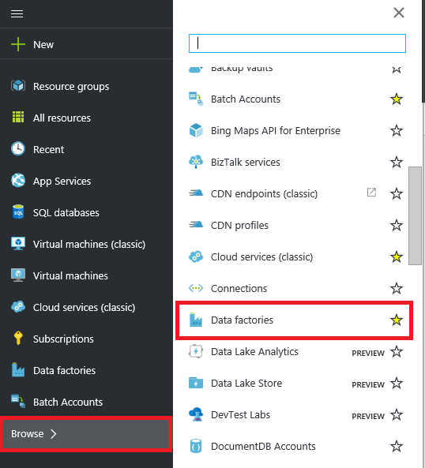
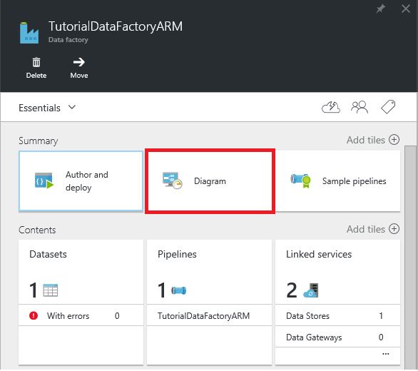
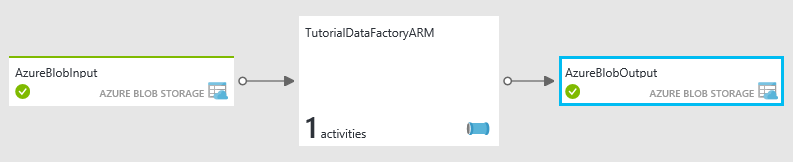
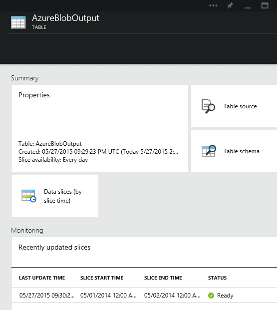

<properties
    pageTitle="Erstellen Ihrer erste Daten Factory (Ressourcenmanager Vorlage) | Microsoft Azure"
    description="In diesem Lernprogramm erstellen Sie eine Stichprobe Azure Data Factory Verkaufspipeline mithilfe einer Vorlage Azure Ressourcenmanager."
    services="data-factory"
    documentationCenter=""
    authors="spelluru"
    manager="jhubbard"
    editor="monicar"/>

<tags
    ms.service="data-factory"
    ms.workload="data-services"
    ms.tgt_pltfrm="na"
    ms.devlang="na"
    ms.topic="hero-article"
    ms.date="10/12/2016"
    ms.author="spelluru"/>

# Lernprogramm: Erstellen Sie Ihrer erste Azure-Daten Factory mit Ressourcenmanager Azure-Vorlage
> [AZURE.SELECTOR]
- [Übersicht und erforderliche Komponenten](data-factory-build-your-first-pipeline.md)
- [Azure-portal](data-factory-build-your-first-pipeline-using-editor.md)
- [Visual Studio](data-factory-build-your-first-pipeline-using-vs.md)
- [PowerShell](data-factory-build-your-first-pipeline-using-powershell.md)
- [Ressourcenmanager-Vorlage](data-factory-build-your-first-pipeline-using-arm.md)
- [REST-API](data-factory-build-your-first-pipeline-using-rest-api.md)

In diesem Artikel verwenden Sie eine Ressourcenmanager Azure-Vorlage zum Erstellen Ihrer ersten Azure-Daten Factory.

## Erforderliche Komponenten
- [Lernprogramm Übersicht](data-factory-build-your-first-pipeline.md) Artikel lesen Sie, und führen Sie die Schritte **Voraussetzung** aus.
- Anweisungen Sie [zum Installieren und Konfigurieren von Azure PowerShell](../powershell-install-configure.md) -Artikel auf die neueste Version von Azure PowerShell auf Ihrem Computer installieren.
- Finden Sie unter [Authoring Azure Ressourcenmanager Vorlagen](../resource-group-authoring-templates.md) Azure Ressourcenmanager Vorlagen lernen. 

## In diesem Lernprogramm
Entität | Beschreibung  
------ | ----------- 
Azure verknüpft Speicherdienst | Ihr Konto Azure-Speicher verknüpft mit den Daten Factory. Das Konto Azure-Speicher enthält die Eingabe- und Daten für die Verkaufspipeline, in diesem Beispiel. 
HDInsight bei Bedarf verknüpfte Dienst| Links eine bei Bedarf HDInsight cluster Fabrik Daten. Der Cluster wird zum Verarbeiten von Daten automatisch für Sie erstellt und wird gelöscht, nachdem die Verarbeitung abgeschlossen ist.
Eingabe Azure Blob-dataset | Bezieht sich auf den Dienst Azure-Speicher verknüpft. Verknüpfte Dienst mit einer Firma Azure-Speicher verweist und Azure Blob Dataset gibt Container, Ordner und Dateinamen im Speicher, der die eingegebenen Daten enthält. 
Azure Blob ausgeben dataset | Bezieht sich auf den Dienst Azure-Speicher verknüpft. Verknüpfte Dienst mit einer Firma Azure-Speicher verweist und Azure Blob Dataset gibt den Container, Ordner und Dateinamen in der Speicher, der die Ausgabedaten an. 
Daten Verkaufspipeline | Der Verkaufspipeline weist eine Aktivität vom Typ HDInsightHive verbraucht des Eingabe-Dataset und das Ausgabe Dataset erzeugt.   

Eine Factory Daten kann eine oder mehrere Rohrleitungen haben. Eine Verkaufspipeline kann eine oder mehrere Aktivitäten enthalten. Es gibt zwei Arten von Aktivitäten: [Daten Bewegung](data-factory-data-movement-activities.md) und [Daten Transformationsaktivitäten](data-factory-data-transformation-activities.md). In diesem Lernprogramm erstellen Sie eine Verkaufspipeline Zug (Aktivität kopieren).

Der folgende Abschnitt enthält die vollständige Ressourcenmanager Vorlage zum Definieren von Daten Factory Personen, damit Sie schnell anhand des Lernprogramms ausführen können, und Testen Sie die Vorlage ein. Um zu verstehen, wie jede Entität Daten Factory wird definiert, finden Sie unter [Data Factory Einheiten in der Vorlage](#data-factory-entities-in-the-template) Abschnitt.

## Data Factory JSON-Vorlage
Vorlage für eine Fabrik Daten definieren auf oberster Ebene Ressourcenmanager lautet: 

    {
        "$schema": "http://schema.management.azure.com/schemas/2015-01-01/deploymentTemplate.json#",
        "contentVersion": "1.0.0.0",
        "parameters": { ...
        },
        "variables": { ...
        },
        "resources": [
            {
                "name": "[parameters('dataFactoryName')]",
                "apiVersion": "[variables('apiVersion')]",
                "type": "Microsoft.DataFactory/datafactories",
                "location": "westus",
                "resources": [
                    { ... },
                    { ... },
                    { ... },
                    { ... }
                ]
            }
        ]
    }

Erstellen einer JSON-Datei mit dem Namen **ADFTutorialARM.json** **C:\ADFGetStarted** Ordner mit dem folgenden Inhalt:

    {
        "contentVersion": "1.0.0.0",
        "$schema": "http://schema.management.azure.com/schemas/2015-01-01/deploymentTemplate.json#",
        "parameters": {
            "storageAccountName": { "type": "string", "metadata": { "description": "Name of the Azure storage account that contains the input/output data." } },
            "storageAccountKey": { "type": "securestring", "metadata": { "description": "Key for the Azure storage account." } },
            "blobContainer": { "type": "string", "metadata": { "description": "Name of the blob container in the Azure Storage account." } },
            "inputBlobFolder": { "type": "string", "metadata": { "description": "The folder in the blob container that has the input file." } },
            "inputBlobName": { "type": "string", "metadata": { "description": "Name of the input file/blob." } },
            "outputBlobFolder": { "type": "string", "metadata": { "description": "The folder in the blob container that will hold the transformed data." } },
            "hiveScriptFolder": { "type": "string", "metadata": { "description": "The folder in the blob container that contains the Hive query file." } },
            "hiveScriptFile": { "type": "string", "metadata": { "description": "Name of the hive query (HQL) file." } }
        },
        "variables": {
            "dataFactoryName": "[concat('HiveTransformDF', uniqueString(resourceGroup().id))]",
            "azureStorageLinkedServiceName": "AzureStorageLinkedService",
            "hdInsightOnDemandLinkedServiceName": "HDInsightOnDemandLinkedService",
            "blobInputDatasetName": "AzureBlobInput",
            "blobOutputDatasetName": "AzureBlobOutput",
            "pipelineName": "HiveTransformPipeline"
        },
        "resources": [
        {
            "name": "[variables('dataFactoryName')]",
            "apiVersion": "2015-10-01",
            "type": "Microsoft.DataFactory/datafactories",
            "location": "West US",
            "resources": [
            {
                "type": "linkedservices",
                "name": "[variables('azureStorageLinkedServiceName')]",
                "dependsOn": [
                    "[variables('dataFactoryName')]"
                ],
                "apiVersion": "2015-10-01",
                "properties": {
                    "type": "AzureStorage",
                    "description": "Azure Storage linked service",
                    "typeProperties": {
                        "connectionString": "[concat('DefaultEndpointsProtocol=https;AccountName=',parameters('storageAccountName'),';AccountKey=',parameters('storageAccountKey'))]"
                    }
                }
            },
            {
                "type": "linkedservices",
                "name": "[variables('hdInsightOnDemandLinkedServiceName')]",
                "dependsOn": [
                    "[variables('dataFactoryName')]",
                    "[variables('azureStorageLinkedServiceName')]"
                ],
                "apiVersion": "2015-10-01",
                "properties": {
                    "type": "HDInsightOnDemand",
                    "typeProperties": {
                        "clusterSize": 1,
                        "version": "3.2",
                        "timeToLive": "00:05:00",
                        "osType": "windows",
                        "linkedServiceName": "[variables('azureStorageLinkedServiceName')]"
                    }
                }
            },
            {
                "type": "datasets",
                "name": "[variables('blobInputDatasetName')]",
                "dependsOn": [
                    "[variables('dataFactoryName')]",
                    "[variables('azureStorageLinkedServiceName')]"
                ],
                "apiVersion": "2015-10-01",
                "properties": {
                    "type": "AzureBlob",
                    "linkedServiceName": "[variables('azureStorageLinkedServiceName')]",
                    "typeProperties": {
                        "fileName": "[parameters('inputBlobName')]",
                        "folderPath": "[concat(parameters('blobContainer'), '/', parameters('inputBlobFolder'))]",
                        "format": {
                            "type": "TextFormat",
                            "columnDelimiter": ","
                        }
                    },
                    "availability": {
                        "frequency": "Month",
                        "interval": 1
                    },
                    "external": true
                }
            },
            {
                "type": "datasets",
                "name": "[variables('blobOutputDatasetName')]",
                "dependsOn": [
                    "[variables('dataFactoryName')]",
                    "[variables('azureStorageLinkedServiceName')]"
                ],
                "apiVersion": "2015-10-01",
                "properties": {
                    "type": "AzureBlob",
                    "linkedServiceName": "[variables('azureStorageLinkedServiceName')]",
                    "typeProperties": {
                        "folderPath": "[concat(parameters('blobContainer'), '/', parameters('outputBlobFolder'))]",
                        "format": {
                            "type": "TextFormat",
                            "columnDelimiter": ","
                        }
                    },
                    "availability": {
                        "frequency": "Month",
                        "interval": 1
                    }
                }
            },
            {
                "type": "datapipelines",
                "name": "[variables('pipelineName')]",
                "dependsOn": [
                    "[variables('dataFactoryName')]",
                    "[variables('azureStorageLinkedServiceName')]",
                    "[variables('hdInsightOnDemandLinkedServiceName')]",
                    "[variables('blobInputDatasetName')]",
                    "[variables('blobOutputDatasetName')]"
                ],
                "apiVersion": "2015-10-01",
                "properties": {
                    "description": "Pipeline that transforms data using Hive script.",
                    "activities": [
                    {
                        "type": "HDInsightHive",
                        "typeProperties": {
                            "scriptPath": "[concat(parameters('blobContainer'), '/', parameters('hiveScriptFolder'), '/', parameters('hiveScriptFile'))]",
                            "scriptLinkedService": "[variables('azureStorageLinkedServiceName')]",
                            "defines": {
                                "inputtable": "[concat('wasb://', parameters('blobContainer'), '@', parameters('storageAccountName'), '.blob.core.windows.net/', parameters('inputBlobFolder'))]",
                                "partitionedtable": "[concat('wasb://', parameters('blobContainer'), '@', parameters('storageAccountName'), '.blob.core.windows.net/', parameters('outputBlobFolder'))]"
                            }
                        },
                        "inputs": [
                            {
                                "name": "[variables('blobInputDatasetName')]"
                            }
                        ],
                        "outputs": [
                            {
                                "name": "[variables('blobOutputDatasetName')]"
                            }
                        ],
                        "policy": {
                            "concurrency": 1,
                            "retry": 3
                        },
                        "scheduler": {
                            "frequency": "Month",
                            "interval": 1
                        },
                        "name": "RunSampleHiveActivity",
                        "linkedServiceName": "[variables('hdInsightOnDemandLinkedServiceName')]"
                    }
                    ],
                    "start": "2016-10-01T00:00:00Z",
                    "end": "2016-10-02T00:00:00Z",
                    "isPaused": false
                }
            }
            ]
        }
        ]
    }

> [AZURE.NOTE] Sie können ein weiteres Beispiel für Ressourcenmanager Vorlage zum Erstellen einer Factory Azure-Daten auf gefunden [Lernprogramm: Erstellen einer Verkaufspipeline mit Kopieren Aktivität mithilfe einer Vorlage Azure Ressourcenmanager](data-factory-copy-activity-tutorial-using-azure-resource-manager-template.md).  

## JSON-Parameter 
Erstellen einer JSON-Datei mit dem Namen **ADFTutorialARM-Parameters.json** , die Parameter für die Vorlage Azure Ressourcenmanager enthält.  

> [AZURE.IMPORTANT] Geben Sie den Namen und die Taste Ihres Kontos Azure-Speicher für die Parameter **StorageAccountName** und **StorageAccountKey** in dieser Parameterdatei ein. 

    {
        "$schema": "https://schema.management.azure.com/schemas/2015-01-01/deploymentParameters.json#",
        "contentVersion": "1.0.0.0",
        "parameters": {
            "storageAccountName": {
                "value": "<Name of your Azure Storage account>"
            },
            "storageAccountKey": {
                "value": "<Key of your Azure Storage account>"
            },
            "blobContainer": {
                "value": "adfgetstarted"
            },
            "inputBlobFolder": {
                "value": "inputdata"
            },
            "inputBlobName": {
                "value": "input.log"
            },
            "outputBlobFolder": {
                "value": "partitioneddata"
            },
            "hiveScriptFolder": {
                "value": "script"
            },
            "hiveScriptFile": {
                "value": "partitionweblogs.hql"
            }
        }
    }

> [AZURE.IMPORTANT] Möglicherweise müssen Sie separaten Parameter JSON-Dateien für die Entwicklung, testen und Herstellung Umgebungen, die Sie mit der gleichen Daten Factory JSON-Vorlage verwenden können. Mithilfe von Power-Shellskript können Sie die Bereitstellung von Daten Factory-Elemente in dieser Umgebungen automatisieren. 

## Erstellen von Daten factory

1. Starten Sie **Azure PowerShell** , und führen Sie den folgenden Befehl aus: 
    - Führen Sie `Login-AzureRmAccount` , und geben Sie den Benutzernamen und das Kennwort für die Anmeldung bei der Azure-Portal.  
    - Führen Sie `Get-AzureRmSubscription` alle Abonnements für dieses Konto anzeigen.
    - Führen Sie `Get-AzureRmSubscription -SubscriptionName <SUBSCRIPTION NAME> | Set-AzureRmContext` um das Abonnement auszuwählen, die Sie mit arbeiten möchten. Abonnement sollte der identisch sein, die Sie in der Azure-Portal verwendet haben.
1. Führen Sie den folgenden Befehl zum Bereitstellen von Daten Factory Personen, die mit der Vorlage Ressourcenmanager, dass Sie in Schritt 1 erstellt haben. 

        New-AzureRmResourceGroupDeployment -Name MyARMDeployment -ResourceGroupName ADFTutorialResourceGroup -TemplateFile C:\ADFGetStarted\ADFTutorialARM.json -TemplateParameterFile C:\ADFGetStarted\ADFTutorialARM-Parameters.json

## Monitor Verkaufspipeline
 
1.  Nach der Anmeldung an den [Azure-Portal](https://portal.azure.com/), klicken Sie auf **Suchen** und Auswählen von **Daten Factory**.
        
2.  Klicken Sie in das Blade **Factory Daten** auf die Daten Factory (**TutorialFactoryARM**), die Sie erstellt haben.   
2.  Klicken Sie in den **Daten Factory** Blade für Ihre Daten Factory auf **Diagramm**.
        
4.  In der **Diagrammansicht**finden Sie unter Übersicht über die Pipelines und Datasets in diesem Lernprogramm verwendet.
    
     
8. Doppelklicken Sie in der Diagrammansicht auf das Dataset **AzureBlobOutput**. Sie sehen, die das Segment, die gerade verarbeitet wird.

    
9. Wenn Verarbeitung fertig ist, wird das Segment im Zustand **bereit** . Erstellung einer bei Bedarf HDInsight Cluster normalerweise dauert einige Zeit (ungefähr 20 Minuten). Daher erwarten der Verkaufspipeline werden müssen, **etwa 30 Minuten** das Segment Verarbeitungszeit.

     
10. Wenn das Segment **eingeschaltet** ist, überprüfen Sie den Ordner **Partitioneddata** im Container **Adfgetstarted** in Ihrem BLOB-Speicher für die Ausgabedaten.  

Finden Sie unter [Monitor Datasets und Verkaufspipeline](data-factory-monitor-manage-pipelines.md) Anweisungen zur Verwendung der Azure Portals Blades die Verkaufspipeline und Datasets überwachen, dass Sie in diesem Lernprogramm erstellt haben.

Überwachen und Verwalten von App können Sie auch Ihre Datenpipelines überwachen. Finden Sie unter [Überwachen und Verwalten von Azure Data Factory Pipelines mit App Überwachung](data-factory-monitor-manage-app.md) detaillierte Informationen zur Verwendung der Anwendungs. 

> [AZURE.IMPORTANT] Wenn das Segment erfolgreich verarbeitet wird, erhält die Eingabe Datei gelöscht. Daher, wenn Sie das Segment erneut ausführen, oder führen Sie das Lernprogramm erneut möchten, Hochladen Sie eingegebenen Datei (input.log) in den Ordner Inputdata des Containers Adfgetstarted.

## Daten Factory Einheiten in der Vorlage
### Definieren von Daten factory
Definieren Sie eine Factory Daten in der Vorlage Ressourcenmanager, wie im folgenden Beispiel gezeigt:  

    "resources": [
    {
        "name": "[variables('dataFactoryName')]",
        "apiVersion": "2015-10-01",
        "type": "Microsoft.DataFactory/datafactories",
        "location": "West US"
    }

Die DataFactoryName ist wie folgt definiert: 
      
      "dataFactoryName": "[concat('HiveTransformDF', uniqueString(resourceGroup().id))]",

Es ist eine eindeutige Zeichenfolge basierend auf die Kennung der Ressource.  

### Definieren von Daten Factory Einheiten
Die folgenden Daten Factory-Elemente sind in der Vorlage JSON definiert: 

- [Azure verknüpft Speicherdienst](#azure-storage-linked-service)
- [HDInsight bei Bedarf verknüpfte Dienst](#hdinsight-on-demand-linked-service)
- [Eingabe Azure Blob-dataset](#azure-blob-input-dataset)
- [Azure Blob Ausgabe dataset](#azure-blob-output-dataset)
- [Daten Verkaufspipeline mit einer Kopie Aktivität](#data-pipeline)

#### Azure verknüpft Speicherdienst
In diesem Abschnitt geben Sie den Namen und Schlüssel Ihres Kontos Azure-Speicher. Details zum Definieren einer Azure verknüpft Speicherdienst verwendeten JSON-Eigenschaften finden Sie unter [Azure-Speicher verknüpft Dienst](data-factory-azure-blob-connector.md#azure-storage-linked-service) . 

      {
        "type": "linkedservices",
        "name": "[variables('azureStorageLinkedServiceName')]",
        "dependsOn": [
          "[variables('dataFactoryName')]"
        ],
        "apiVersion": "2015-10-01",
        "properties": {
          "type": "AzureStorage",
          "description": "Azure Storage linked service",
          "typeProperties": {
            "connectionString": "[concat('DefaultEndpointsProtocol=https;AccountName=',parameters('storageAccountName'),';AccountKey=',parameters('storageAccountKey'))]"
          }
        }
      }

**ConnectionString** verwendet die Parameter StorageAccountName und StorageAccountKey. Die Werte für diesen Parameter mithilfe einer Konfigurationsdatei übergeben. Die Definition auch Variablen verwendet: AzureStroageLinkedService und DataFactoryName in der Vorlage definiert. 
    
#### HDInsight bei Bedarf verknüpfte Dienst
[Berechnen von verknüpften Diensten](data-factory-compute-linked-services.md#azure-hdinsight-on-demand-linked-service) finden Sie im Artikel Details JSON-Eigenschaften, die zum Definieren einer verknüpften HDInsight bei Bedarf-Diensts verwendet.  

      {
        "type": "linkedservices",
        "name": "[variables('hdInsightOnDemandLinkedServiceName')]",
        "dependsOn": [
          "[variables('dataFactoryName')]"
        ],
        "apiVersion": "2015-10-01",
        "properties": {
          "type": "HDInsightOnDemand",
          "typeProperties": {
            "clusterSize": 1,
            "version": "3.2",
            "timeToLive": "00:05:00",
            "osType": "windows",
            "linkedServiceName": "[variables('azureStorageLinkedServiceName')]"
          }
        }
      }

Beachten Sie die folgenden Punkte: 

- Die Daten Factory erstellt einen **Windows-basierten** HDInsight Cluster, mit den oben angegebenen JSON. Sie auch haben diese erstellen Sie einen **Linux-basierten** HDInsight Cluster. Details finden Sie [Bei Bedarf HDInsight verknüpfte Dienst](data-factory-compute-linked-services.md#azure-hdinsight-on-demand-linked-service) . 
- Sie können **Eigene HDInsight Cluster** anstelle von einem bei Bedarf HDInsight Cluster verwenden. Details finden Sie unter [Verknüpfte HDInsight-Dienst](data-factory-compute-linked-services.md#azure-hdinsight-linked-service) .
- HDInsight Cluster erstellt einen **standardmäßige Container** in den Blob-Speicher, die, den Sie in das JSON (**LinkedServiceName**) angegeben haben. HDInsight wird dieser Container nicht gelöscht, wenn der Cluster gelöscht wird. Dieses Verhalten ist beabsichtigt. Bei Bedarf verknüpft HDInsight Dienst eine HDInsight Cluster erstellt wird jedes Mal, wenn ein Segment muss verarbeitet werden, es sei denn, es ist ein vorhandenes live Cluster (**TimeToLive**) und wird gelöscht, wenn die Verarbeitung abgeschlossen ist.

    Als weitere Segmente verarbeitet werden, wird in Ihrem Azure Blob Storage viele Container. Wenn Sie nicht zur Behandlung dieses Problems der Einzelvorgänge benötigen, möchten Sie möglicherweise löschen, um die Speicherkosten für reduzieren. Führen Sie die Namen dieser Container ein Muster: "Adf**Yourdatafactoryname**-**Linkedservicename**- Datetimestamp". Mit Tools wie [Microsoft Speicher-Explorer](http://storageexplorer.com/) zum Container in Ihrer Azure Blob-Speicher löschen.

Details finden Sie [Bei Bedarf HDInsight verknüpfte Dienst](data-factory-compute-linked-services.md#azure-hdinsight-on-demand-linked-service) .

#### Eingabe Azure Blob-dataset
Sie geben Sie die Namen der Blob-Container, Ordner und Datei, die die eingegebenen Daten enthält. Details zum Definieren einer Azure Blob-Dataset verwendeten JSON-Eigenschaften finden Sie unter [Datensatzeigenschaften Azure Blob](data-factory-azure-blob-connector.md#azure-blob-dataset-type-properties) . 

      {
        "type": "datasets",
        "name": "[variables('blobInputDatasetName')]",
        "dependsOn": [
          "[variables('dataFactoryName')]",
          "[variables('azureStorageLinkedServiceName')]"
        ],
        "apiVersion": "2015-10-01",
        "properties": {
          "type": "AzureBlob",
          "linkedServiceName": "[variables('azureStorageLinkedServiceName')]",
          "typeProperties": {
            "fileName": "[parameters('inputBlobName')]",
            "folderPath": "[concat(parameters('blobContainer'), '/', parameters('inputBlobFolder'))]",
            "format": {
              "type": "TextFormat",
              "columnDelimiter": ","
            }
          },
          "availability": {
            "frequency": "Month",
            "interval": 1
          },
          "external": true
        }
      }

Diese Definition verwendet die folgenden Parameter in Parameter Vorlage definiert: BlobContainer, InputBlobFolder, und InputBlobName. 

#### Azure Blob ausgeben dataset
Sie geben Sie die Namen der Blob-Container und Ordner aus, die Ausgabedaten enthält. Details zum Definieren einer Azure Blob-Dataset verwendeten JSON-Eigenschaften finden Sie unter [Datensatzeigenschaften Azure Blob](data-factory-azure-blob-connector.md#azure-blob-dataset-type-properties) .  

      {
        "type": "datasets",
        "name": "[variables('blobOutputDatasetName')]",
        "dependsOn": [
          "[variables('dataFactoryName')]",
          "[variables('azureStorageLinkedServiceName')]"
        ],
        "apiVersion": "2015-10-01",
        "properties": {
          "type": "AzureBlob",
          "linkedServiceName": "[variables('azureStorageLinkedServiceName')]",
          "typeProperties": {
            "folderPath": "[concat(parameters('blobContainer'), '/', parameters('outputBlobFolder'))]",
            "format": {
              "type": "TextFormat",
              "columnDelimiter": ","
            }
          },
          "availability": {
            "frequency": "Month",
            "interval": 1
          }
        }
      }

Diese Definition verwendet die folgenden Parameter in der Vorlage Parameter definiert: BlobContainer und OutputBlobFolder. 

#### Daten Verkaufspipeline
Definieren Sie eine Verkaufspipeline, die Daten transformieren, indem Sie eine bei Bedarf Azure HDInsight Cluster Struktur Skript ausgeführt. Eine Beschreibung der JSON-Elementen, die zum Festlegen einer Verkaufspipeline in diesem Beispiel finden Sie unter [Verkaufspipeline JSON](data-factory-create-pipelines.md#pipeline-json) . 

    {
        "type": "datapipelines",
        "name": "[variables('pipelineName')]",
        "dependsOn": [
          "[variables('dataFactoryName')]",
          "[variables('azureStorageLinkedServiceName')]",
          "[variables('hdInsightOnDemandLinkedServiceName')]",
          "[variables('blobInputDatasetName')]",
          "[variables('blobOutputDatasetName')]"
        ],
        "apiVersion": "2015-10-01",
        "properties": {
          "description": "Pipeline that transforms data using Hive script.",
          "activities": [
            {
              "type": "HDInsightHive",
              "typeProperties": {
                "scriptPath": "[concat(parameters('blobContainer'), '/', parameters('hiveScriptFolder'), '/', parameters('hiveScriptFile'))]",
                "scriptLinkedService": "[variables('azureStorageLinkedServiceName')]",
                "defines": {
                  "inputtable": "[concat('wasb://', parameters('blobContainer'), '@', parameters('storageAccountName'), '.blob.core.windows.net/', parameters('inputBlobFolder'))]",
                  "partitionedtable": "[concat('wasb://', parameters('blobContainer'), '@', parameters('storageAccountName'), '.blob.core.windows.net/', parameters('outputBlobFolder'))]"
                }
              },
              "inputs": [
                {
                  "name": "[variables('blobInputDatasetName')]"
                }
              ],
              "outputs": [
                {
                  "name": "[variables('blobOutputDatasetName')]"
                }
              ],
              "policy": {
                "concurrency": 1,
                "retry": 3
              },
              "scheduler": {
                "frequency": "Month",
                "interval": 1
              },
              "name": "RunSampleHiveActivity",
              "linkedServiceName": "[variables('hdInsightOnDemandLinkedServiceName')]"
            }
          ],
          "start": "2016-10-01T00:00:00Z",
          "end": "2016-10-02T00:00:00Z",
          "isPaused": false
        }
      }

## Die Vorlage wiederverwenden 
Im Lernprogramm haben Sie eine Vorlage zum Definieren von Daten Factory-Einheiten und eine Vorlage für die Übergabe von Werten für Parameter erstellt. Um dieselbe Vorlage verwenden, um Daten Factory Personen zu verschiedenen Umgebungen bereitstellen, erstellen Sie eine Parameterdatei für jede Umgebung und diese verwenden, wenn Sie für diese Umgebung bereitstellen.     

Beispiel:  

    New-AzureRmResourceGroupDeployment -Name MyARMDeployment -ResourceGroupName ADFTutorialResourceGroup -TemplateFile ADFTutorialARM.json -TemplateParameterFile ADFTutorialARM-Parameters-Dev.json

    New-AzureRmResourceGroupDeployment -Name MyARMDeployment -ResourceGroupName ADFTutorialResourceGroup -TemplateFile ADFTutorialARM.json -TemplateParameterFile ADFTutorialARM-Parameters-Test.json

    New-AzureRmResourceGroupDeployment -Name MyARMDeployment -ResourceGroupName ADFTutorialResourceGroup -TemplateFile ADFTutorialARM.json -TemplateParameterFile ADFTutorialARM-Parameters-Production.json

Beachten Sie, dass der erste Befehl Parameterdatei für die Entwicklungsumgebung, zweiten eine für die testumgebung und das dritte Layout für die Herstellung Umgebung verwendet.  

Sie können auch die Vorlage, um wiederholte Aufgaben wiederverwenden. Beispielsweise müssen Sie viele Daten Factory mit eine oder mehrere Rohrleitungen zu erstellen, die die gleiche Logik implementieren jedoch jede Factory Daten werden verschiedene Azure-Speicher und Azure SQL-Datenbank-Konten verwendet. In diesem Szenario mithilfe erstellen Sie derselben Vorlage in der gleichen Umgebung (Entwickler, testen oder Fertigung) mit anderen Parameterdateien Daten Factory. 

## Ressourcenmanager-Vorlage zum Erstellen eines Gateways
Hier ist eine Stichprobe Ressourcenmanager Vorlage zum Erstellen eines Gateways logischen in den Hintergrund rücken. Installieren eines Gateways auf Ihrem lokalen Computer oder Azure Neuerung und das Gateway mit Daten Factory-Dienst Drücken einer Taste registrieren. Weitere Informationen finden Sie unter [Verschieben von Daten zwischen lokalen und Cloud](data-factory-move-data-between-onprem-and-cloud.md) .

    {
        "contentVersion": "1.0.0.0",
        "$schema": "http://schema.management.azure.com/schemas/2015-01-01/deploymentTemplate.json#",
        "parameters": {
        },
        "variables": {
            "dataFactoryName":  "GatewayUsingArmDF",
            "apiVersion": "2015-10-01",
            "singleQuote": "'"
        },
        "resources": [
            {
                "name": "[variables('dataFactoryName')]",
                "apiVersion": "[variables('apiVersion')]",
                "type": "Microsoft.DataFactory/datafactories",
                "location": "eastus",
                "resources": [
                    {
                        "dependsOn": [ "[concat('Microsoft.DataFactory/dataFactories/', variables('dataFactoryName'))]" ],
                        "type": "gateways",
                        "apiVersion": "[variables('apiVersion')]",
                        "name": "GatewayUsingARM",
                        "properties": {
                            "description": "my gateway"
                        }
                    }            
                ]
            }
        ]
    }

Diese Vorlage erstellt eine Daten Factory mit dem Namen GatewayUsingArmDF mit ein Gateway mit dem Namen: GatewayUsingARM. 

## Siehe auch
| Thema | Beschreibung |
| :---- | :---- |
| [Daten Transformationsaktivitäten](data-factory-data-transformation-activities.md) | Dieser Artikel enthält eine Liste der Daten Transformationsaktivitäten (z. B. HDInsight Struktur Transformation, die Sie in diesem Lernprogramm verwendeten) von Azure Daten Factory unterstützt. |
| [Planung und Ausführung](data-factory-scheduling-and-execution.md) | In diesem Artikel wird erläutert, die Planung und Ausführung Aspekte des Modells für Azure Data Factory-Anwendung. |
| [Pipelines](data-factory-create-pipelines.md) | In diesem Artikel können Sie die Pipelines und Aktivitäten in Azure Data Factory und deren Verwendung zum Erstellen von End-to-End-Daten basierende Workflows für Ihre Szenario oder Ihr Unternehmen zu verstehen. |
| [Datasets](data-factory-create-datasets.md) | In diesem Artikel können Sie die Datasets in Azure Data Factory zu verstehen.
| [Überwachen und Verwalten von Pipelines mit App für die Überwachung](data-factory-monitor-manage-app.md) | Dieser Artikel beschreibt, wie überwachen, verwalten und Debuggen Pipelines die Überwachung und Verwaltung App verwenden. 

  

