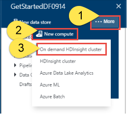
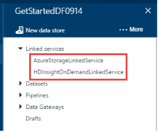
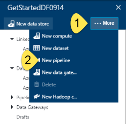
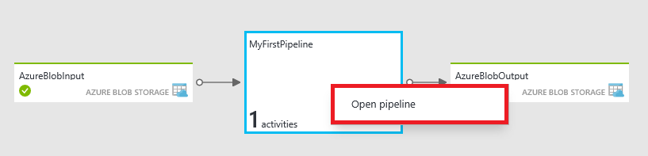
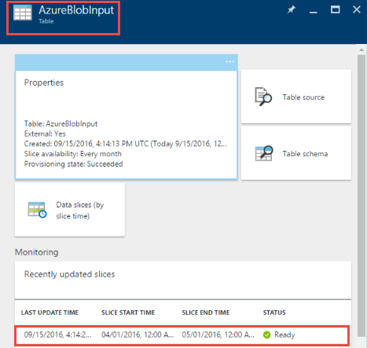
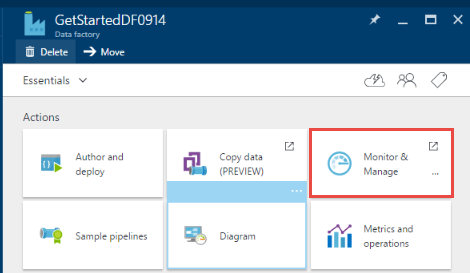

<properties
    pageTitle="Erstellen Ihrer erste Daten Factory (Azure Portal) | Microsoft Azure"
    description="In diesem Lernprogramm erstellen Sie eine Stichprobe Azure Data Factory Verkaufspipeline mit Daten Factory-Editor in der Azure-Portal an."
    services="data-factory"
    documentationCenter=""
    authors="spelluru"
    manager="jhubbard"
    editor="monicar"/>

<tags
    ms.service="data-factory"
    ms.workload="data-services"
    ms.tgt_pltfrm="na"
    ms.devlang="na"
    ms.topic="hero-article" 
    ms.date="09/14/2016"
    ms.author="spelluru"/>

# Lernprogramm: Erstellen Sie Ihrer erste Azure-Daten Factory mit Azure-portal
> [AZURE.SELECTOR]
- [Übersicht und erforderliche Komponenten](data-factory-build-your-first-pipeline.md)
- [Azure-portal](data-factory-build-your-first-pipeline-using-editor.md)
- [Visual Studio](data-factory-build-your-first-pipeline-using-vs.md)
- [PowerShell](data-factory-build-your-first-pipeline-using-powershell.md)
- [Ressourcenmanager-Vorlage](data-factory-build-your-first-pipeline-using-arm.md)
- [REST-API](data-factory-build-your-first-pipeline-using-rest-api.md)

In diesem Artikel erfahren Sie, wie Sie mithilfe der [Azure-Portal](https://portal.azure.com/) Erstellen Ihrer erste Azure-Daten Factory. 

## Erforderliche Komponenten        
1. [Lernprogramm Übersicht](data-factory-build-your-first-pipeline.md) Artikel lesen Sie, und führen Sie die Schritte **Voraussetzung** aus.
2. In diesem Artikel bietet eine grundlegende Übersicht über den Azure Data Factory-Dienst nicht. Es empfiehlt sich, dass Sie die [Einführung in Azure Data Factory](data-factory-introduction.md) -Artikel für einen detaillierten Überblick des Diensts durchlaufen.  

## Erstellen von Daten factory
Eine Factory Daten kann eine oder mehrere Rohrleitungen haben. Eine Verkaufspipeline kann eine oder mehrere Aktivitäten enthalten. Angenommen, eine Kopie Aktivität zum Kopieren von Daten aus einer Quelle zu einem Ziel Datenspeicher und eine HDInsight Struktur Aktivität zu Struktur Skript transformieren Eingabedaten mit Produkt ausführen, um Daten ausgeben. Beginnen wir mit die Daten Factory in diesem Schritt erstellen. 

1.  Melden Sie sich mit dem [Azure-Portal](https://portal.azure.com/)an.
2.  Klicken Sie im Menü links auf **neu** , klicken Sie auf **Daten + Analytics**, und klicken Sie auf **Daten Factory**.
        
    

2.  Geben Sie in das **neue Daten Factory** Blade **GetStartedDF** für den Namen ein.

    

    > [AZURE.IMPORTANT] 
    > Der Name der Factory Azure-Daten muss **global eindeutig**sein. Wenn Sie die Fehlermeldung: **Factory Data Source Name "GetStartedDF" ist nicht verfügbar**. Ändern Sie den Namen der Factory Daten (z. B. YournameGetStartedDF), und versuchen Sie erneut zu erstellen. Finden Sie unter [Data Factory - Regeln zur Benennung von](data-factory-naming-rules.md) Thema Benennungskonventionen für Daten Factory Elemente.
    > 
    > Der Name der Factory Daten möglicherweise als einen **DNS-** Namen in der Zukunft und somit werden öffentlich sichtbar registriert sein.

3.  Wählen Sie das **Abonnement Azure** , werden die Daten Factory erstellt werden soll. 
4.  Wählen Sie vorhandene **Ressourcengruppe** oder erstellen Sie eine Ressourcengruppe. Erstellen Sie eine Ressourcengruppe mit dem Namen für das Lernprogramm: **ADFGetStartedRG**. 
5.  Klicken Sie auf die **neuen Daten Factory** -Blade auf **Erstellen** .

    > [AZURE.IMPORTANT] Um Daten Factory-Instanzen erstellen zu können, müssen Sie Mitglied der Rolle [Data Factory Mitwirkender](../active-directory/role-based-access-built-in-roles.md/#data-factory-contributor) auf Gruppenebene Abonnement oder einer Ressource sein. 
6.  Sehen Sie die Daten Factory erstellt in der **Startboard** des Portals Azure wie folgt aus:   

    
7. Herzlichen Glückwunsch! Sie haben Ihre erste Daten Factory erfolgreich erstellt. Nachdem die Daten Factory erfolgreich erstellt wurde, wird die Factory Seite, die Sie den Inhalt der Daten Factory anzeigt.   

    

Vor dem Erstellen einer Verkaufspipeline in den Daten Factory, müssen Sie zuerst ein paar Daten Factory-Elemente zu erstellen. Zuerst erstellen Sie ein verknüpftes Services, um Daten Stores/berechnet an den Datenspeicher verknüpfen, Eingabe definieren und ausgeben Datasets ein-/Ausgabe von Daten in verknüpften Datenspeicher darstellen, und erstellen Sie dann die Verkaufspipeline mit einer Aktivität, die diese Datasets verwendet. 

## Erstellen von verknüpften Diensten
In diesem Schritt verknüpfen Sie Ihr Konto Azure-Speicher und eine bei Bedarf Azure HDInsight Cluster mit Ihrer Daten Factory ein. Das Konto Azure-Speicher enthält die Eingabe- und Daten für die Verkaufspipeline, in diesem Beispiel. Der Dienst HDInsight verknüpft dient zum Ausführen von Struktur Skript in die Aktivität von der Verkaufspipeline in diesem Beispiel angegeben. Identifizieren, welche [Daten speichern](data-factory-data-movement-activities.md)/[Services berechnen](data-factory-compute-linked-services.md) , werden in Ihrem Szenario verwendet und Dienste Fabrik Daten durch Erstellen von verknüpften Diensten verknüpfen.  

### Erstellen von Azure verknüpft Speicherdienst
In diesem Schritt verknüpfen Sie Ihr Konto Azure-Speicher mit Ihrer Daten Factory an. In diesem Lernprogramm verwenden Sie das gleiche Speicher Azure-Konto zum Speichern/Ausgang Daten und der HQL-Skriptdatei aus. 

1.  Klicken Sie auf **Autor und Bereitstellen von** auf dem **Daten FACTORY** -Blade für **GetStartedDF**. Die Daten Factory-Editor sollte angezeigt werden. 
     
    
2.  Klicken Sie auf **neue Daten speichern möchten** , und wählen Sie **Azure-Speicher**.

    

3.  Es sollte das JSON-Skript zum Erstellen einer Azure verknüpft Speicherdienst im Editor angezeigt. 
    
    
     
4. Ersetzen Sie **Kontonamen** durch den Namen Ihrer Azure-Speicher-Konto und **kontoschlüssel** zusammen mit der Tastenkombination für das Konto ein Azure-Speicher. So erhalten Sie Ihre Zugriffstaste Speicher finden Sie unter [anzeigen, kopieren und neu generieren Speicher-Tastenkombinationen](../storage/storage-create-storage-account.md#view-copy-and-regenerate-storage-access-keys)
5. Klicken Sie auf der Befehlsleiste verknüpften Dienst bereitstellen auf **Bereitstellen** .

    

   Nachdem der verknüpfte Dienst erfolgreich bereitgestellt wurde, im Fenster **: 1-Entwurf** sollte verschwinden, und finden Sie unter **AzureStorageLinkedService** in der Strukturansicht auf der linken Seite. 
       

 
### Erstellen von Azure HDInsight verknüpft-Dienst
In diesem Schritt verknüpfen Sie einen bei Bedarf HDInsight Cluster mit Ihrer Daten Factory an. HDInsight Cluster wird automatisch zur Laufzeit erstellt und gelöscht, nachdem es für die angegebene Zeitspanne Verarbeitung und im Leerlauf ausgeführt werden. 

1. Klicken Sie in den **Daten Factory-Editor** **auf... Weitere**, klicken Sie auf **neu zu berechnen**, und wählen Sie **bei Bedarf HDInsight Cluster**aus.

    
2. Kopieren Sie und fügen Sie den folgenden Codeausschnitt zum **Entwurfs-1** -Fenster ein. Der JSON-Codeausschnitt enthält eine Beschreibung die Eigenschaften, mit denen den HDInsight Cluster bei Bedarf erstellen. 

        {
          "name": "HDInsightOnDemandLinkedService",
          "properties": {
            "type": "HDInsightOnDemand",
            "typeProperties": {
              "version": "3.2",
              "clusterSize": 1,
              "timeToLive": "00:30:00",
              "linkedServiceName": "AzureStorageLinkedService"
            }
          }
        }
    
    Die folgende Tabelle enthält eine Beschreibung für die JSON-Eigenschaften in der Codeausschnitt verwendet werden:
    
  	| Eigenschaft | Beschreibung |
  	| :------- | :---------- |
  	| Version | Gibt an, dass die Version von der HDInsight benutzerspezifisch 3,2 erstellt. | 
  	| ClusterSize | Gibt die Größe des HDInsight Cluster an. | 
  	| TimeToLive | Gibt an, dass die im Leerlauf Zeit für den Cluster HDInsight, bevor sie gelöscht wird. |
  	| linkedServiceName | Gibt das Speicherkonto, mit dem die Protokolle speichern, die von HDInsight generiert werden. |

    Beachten Sie die folgenden Punkte: 
    
    - Die Daten Factory erstellt einen **Windows-basierten** HDInsight Cluster, mit der JSON. Sie auch haben diese erstellen Sie einen **Linux-basierten** HDInsight Cluster. Details finden Sie [Bei Bedarf HDInsight verknüpfte Dienst](data-factory-compute-linked-services.md#azure-hdinsight-on-demand-linked-service) . 
    - Sie können **Eigene HDInsight Cluster** anstelle von einem bei Bedarf HDInsight Cluster verwenden. Details finden Sie unter [Verknüpfte HDInsight-Dienst](data-factory-compute-linked-services.md#azure-hdinsight-linked-service) .
    - HDInsight Cluster erstellt einen **standardmäßige Container** in den Blob-Speicher, die, den Sie in das JSON (**LinkedServiceName**) angegeben haben. HDInsight wird dieser Container nicht gelöscht, wenn der Cluster gelöscht wird. Dieses Verhalten ist beabsichtigt. Mit dem Dienst bei Bedarf HDInsight verknüpft wird ein HDInsight Cluster erstellt jedes Mal, wenn ein Segment verarbeitet wird, es sei denn, es ist ein vorhandener live Cluster (**TimeToLive**). Cluster wird automatisch gelöscht, wenn die Verarbeitung abgeschlossen ist.
    
        Als weitere Segmente verarbeitet werden, wird in Ihrem Azure Blob Storage viele Container. Wenn Sie nicht zur Behandlung dieses Problems der Einzelvorgänge benötigen, möchten Sie möglicherweise löschen, um die Speicherkosten für reduzieren. Führen Sie die Namen dieser Container ein Muster: "Adf**Yourdatafactoryname**-**Linkedservicename**- Datetimestamp". Mit Tools wie [Microsoft Speicher-Explorer](http://storageexplorer.com/) zum Container in Ihrer Azure Blob-Speicher löschen.

    Details finden Sie [Bei Bedarf HDInsight verknüpfte Dienst](data-factory-compute-linked-services.md#azure-hdinsight-on-demand-linked-service) .
3. Klicken Sie auf der Befehlsleiste verknüpften Dienst bereitstellen auf **Bereitstellen** . 

    

4. Bestätigen Sie, dass Sie sowohl **AzureStorageLinkedService** und **HDInsightOnDemandLinkedService** in der Strukturansicht auf der linken Seite anzeigen sehen.

    

## Datasets erstellen
In diesem Schritt erstellen Sie Datasets zum Darstellen der Eingabe und Ausgabedaten für die Verarbeitung von Struktur. Diese Datasets finden Sie in der **AzureStorageLinkedService** , die Sie zuvor in diesem Lernprogramm erstellt haben. Die verknüpfte Dienstpunkte einer Azure-Speicher-Konto und Datasets angeben Container, Ordner, Dateiname in der Speicher, der Eingabe und Ausgabedaten.   

### Erstellen von dataset

1. Klicken Sie in den **Daten Factory-Editor** **auf... Weitere** auf der Befehlsleiste, klicken Sie auf **Neues Dataset**, und wählen Sie **Azure Blob-Speicher**.

    
2. Kopieren Sie und fügen Sie den folgenden Codeausschnitt zum Entwurfs-1-Fenster ein. In den JSON-Codeausschnitt erstellen Sie ein Dataset namens **AzureBlobInput** , die Eingabedaten für eine Aktivität in der Verkaufspipeline darstellt. Darüber hinaus geben Sie an, dass die Eingabedaten in den Blob-Container **Adfgetstarted** bezeichnet und Ordner mit dem Namen **Inputdata**befindet.
        
        {
            "name": "AzureBlobInput",
            "properties": {
                "type": "AzureBlob",
                "linkedServiceName": "AzureStorageLinkedService",
                "typeProperties": {
                    "fileName": "input.log",
                    "folderPath": "adfgetstarted/inputdata",
                    "format": {
                        "type": "TextFormat",
                        "columnDelimiter": ","
                    }
                },
                "availability": {
                    "frequency": "Month",
                    "interval": 1
                },
                "external": true,
                "policy": {}
            }
        } 

    Die folgende Tabelle enthält eine Beschreibung für die JSON-Eigenschaften in der Codeausschnitt verwendet werden:

  	| Eigenschaft | Beschreibung |
  	| :------- | :---------- |
  	| Typ | Die Eigenschaft wird auf AzureBlob festgelegt, da die Daten in Azure Blob-Speicher befinden. |  
  	| linkedServiceName | verweist auf die AzureStorageLinkedService, die Sie zuvor erstellt haben. |
  	| Dateiname | Diese Eigenschaft ist optional. Wenn Sie diese Eigenschaft nicht angeben, werden alle Dateien aus den Ordnerpfad entnommen. In diesem Fall wird nur das input.log verarbeitet. |
  	| Typ | Die Protokolldateien werden im Text-Format, damit wir TextFormat verwenden. | 
  	| columnDelimiter | Spalten in die Protokolldateien werden durch Komma (,) getrennt. |
  	| Häufigkeit/Intervall | Legen Sie auf den Monat und das Intervall Häufigkeit ist 1, was bedeutet, dass die Eingabewerte Segmente monatlich verfügbar sind. | 
  	| externe | True, wenn die Eingabedaten nicht vom Dienst Daten Factory generiert werden, wird diese Eigenschaft festgelegt. | 
        
3. Klicken Sie auf der Befehlsleiste neu erstellte Dataset bereitstellen auf **Bereitstellen** . Das Dataset in der Strukturansicht auf der linken Seite sollte angezeigt werden. 

### Die Ausgabe Dataset erstellen
Erstellen Sie jetzt das Ausgabe-Dataset aus, um die Ausgabedaten Azure Blob-Speicher gehörende Kehrmatrix darstellen. 

1. Klicken Sie in den **Daten Factory-Editor** **auf... Weitere** auf der Befehlsleiste, klicken Sie auf **Neues Dataset**, und wählen Sie **Azure Blob-Speicher**.  
2. Kopieren Sie und fügen Sie den folgenden Codeausschnitt zum Entwurfs-1-Fenster ein. In den JSON-Codeausschnitt erstellen Sie ein Dataset namens **AzureBlobOutput**und angeben, die die Struktur der Daten, die durch das Skript Struktur erstellt werden. Darüber hinaus geben Sie an, dass die Ergebnisse in der Blob-Container **Adfgetstarted** bezeichnet und Ordner mit dem Namen **Partitioneddata**gespeichert werden. Im Abschnitt **Verfügbarkeit** der gibt an, dass das Ausgabe Dataset monatlich erzeugt wird.
    
        {
          "name": "AzureBlobOutput",
          "properties": {
            "type": "AzureBlob",
            "linkedServiceName": "AzureStorageLinkedService",
            "typeProperties": {
              "folderPath": "adfgetstarted/partitioneddata",
              "format": {
                "type": "TextFormat",
                "columnDelimiter": ","
              }
            },
            "availability": {
              "frequency": "Month",
              "interval": 1
            }
          }
        }

    Finden Sie unter **Erstellen von Dataset** Abschnitt für eine Beschreibung dieser Eigenschaften. Sie können nicht externe Eigenschaft auf ein Dataset Ausgabe festlegen, wie das Dataset durch die Daten Factory-Dienst erstellt wird.
3. Klicken Sie auf der Befehlsleiste neu erstellte Dataset bereitstellen auf **Bereitstellen** .
4. Stellen Sie sicher, dass das Dataset erfolgreich erstellt wird.

    

## Erstellen der Verkaufspipeline
In diesem Schritt erstellen Sie Ihre erste Verkaufspipeline mit einer Aktivität **HDInsightHive** aus. Eingabe Segment steht monatlich (Häufigkeit: Monat, Intervall: 1), Ausgabe Segment monatlich erstellt wird und die Scheduler-Eigenschaft für die Aktivität auch monatlich festgelegt ist. Die Einstellungen für die Ausgabe Dataset und die Aktivität Scheduler müssen übereinstimmen. Derzeit ist Ausgabe Dataset, was den Terminplan veranlasst, müssen Sie ein Dataset Ausgabe erstellen, selbst wenn die Aktivität keine Ausgabe erzeugt. Wenn die Aktivität jede Eingabe übernehmen möchten nicht, können Sie überspringen des Eingabe-Dataset zu erstellen. Am Ende des in diesem Abschnitt werden die Eigenschaften in der folgenden JSON verwendete erläutert. 

1. Klicken Sie im **Daten Factory-Editor**auf **Auslassungspunkte (...) Weitere Befehle** , und klicken Sie dann auf **neue Verkaufspipeline**.
    
    
2. Kopieren Sie und fügen Sie den folgenden Codeausschnitt zum Entwurfs-1-Fenster ein.

    > [AZURE.IMPORTANT] Ersetzen Sie **Storageaccountname** durch den Namen Ihres Kontos Speicher in den JSON.
        
        {
            "name": "MyFirstPipeline",
            "properties": {
                "description": "My first Azure Data Factory pipeline",
                "activities": [
                    {
                        "type": "HDInsightHive",
                        "typeProperties": {
                            "scriptPath": "adfgetstarted/script/partitionweblogs.hql",
                            "scriptLinkedService": "AzureStorageLinkedService",
                            "defines": {
                                "inputtable": "wasb://adfgetstarted@<storageaccountname>.blob.core.windows.net/inputdata",
                                "partitionedtable": "wasb://adfgetstarted@<storageaccountname>.blob.core.windows.net/partitioneddata"
                            }
                        },
                        "inputs": [
                            {
                                "name": "AzureBlobInput"
                            }
                        ],
                        "outputs": [
                            {
                                "name": "AzureBlobOutput"
                            }
                        ],
                        "policy": {
                            "concurrency": 1,
                            "retry": 3
                        },
                        "scheduler": {
                            "frequency": "Month",
                            "interval": 1
                        },
                        "name": "RunSampleHiveActivity",
                        "linkedServiceName": "HDInsightOnDemandLinkedService"
                    }
                ],
                "start": "2016-04-01T00:00:00Z",
                "end": "2016-04-02T00:00:00Z",
                "isPaused": false
            }
        }
 
    In den JSON-Codeausschnitt erstellen Sie eine Verkaufspipeline, der eine einzelne Aktivität besteht, die Struktur an Prozess Daten auf einem Cluster HDInsight verwendet.
    
    Die Struktur-Skriptdatei, **partitionweblogs.hql**, wird in der Azure-Speicher-Konto (angegeben durch die ScriptLinkedService, die als **AzureStorageLinkedService**bezeichnet), und klicken Sie im Ordner " **Skript** " in den Container **Adfgetstarted**gespeichert.

    Im Abschnitt **definiert** wird verwendet, um die Einstellungen für die Laufzeit angeben, die als Struktur Konfigurationswerte an das Skript Struktur übergeben werden (z. B. ${Hiveconf: inputtable}, ${Hiveconf:partitionedtable}).

    Die Eigenschaften **Starten** und **Beenden** der Verkaufspipeline gibt den aktiven Zeitraum der Verkaufspipeline an.

    In der Aktivität JSON Geben Sie an, dass das Skript Struktur für das Berechnen von der **LinkedServiceName** – **HDInsightOnDemandLinkedService**angegebenen ausgeführt wird.

    > [AZURE.NOTE] Details zu JSON-Eigenschaften, die im Beispiel verwendete finden Sie unter [Aufbau einer Verkaufspipeline](data-factory-create-pipelines.md#anatomy-of-a-pipeline) . 

3. Überprüfen Sie Folgendes: 
    1. **Input.log** Datei vorhanden ist, in den Ordner **Inputdata** des Containers **Adfgetstarted** in der Azure Blob-Speicher
    2. **partitionweblogs.hql** -Datei, die im Ordner " **Skript** " des Containers **Adfgetstarted** in der Azure Blob-Speicher vorhanden ist. Schließen Sie Schritte Voraussetzung im [Lernprogramm (Übersicht)](data-factory-build-your-first-pipeline.md) Wenn Sie diese Dateien nicht angezeigt werden. 
    3. Bestätigen Sie, dass Sie **Storageaccountname** durch den Namen Ihres Kontos Speicher in der Verkaufspipeline JSON ersetzt. 
2. Klicken Sie auf der Befehlsleiste in der Verkaufspipeline bereitstellen auf **Bereitstellen** . Da die ** **Starten** und** Endzeiten werden in der Vergangenheit und **IsPaused** auf falsch festgelegt ist, wird der Verkaufspipeline (Aktivität in der Verkaufspipeline) unmittelbar nach der Bereitstellung ausgeführt. 
4. Bestätigen Sie, dass Sie der Verkaufspipeline in der Strukturansicht angezeigt.

    
5. Herzlichen Glückwunsch, Sie haben Ihre erste Verkaufspipeline erfolgreich erstellt!

## Monitor Verkaufspipeline

### Monitor Verkaufspipeline mithilfe der Diagrammsicht

6. Klicken Sie auf **X** Daten Factory-Editor Blades schließen und zurück zu den Daten Factory Blade zu navigieren, und klicken Sie auf **Diagramm**.
  
    
7. In der Diagrammansicht finden Sie unter Übersicht über die Pipelines und Datasets in diesem Lernprogramm verwendet.
    
     
8. Zum Anzeigen aller Aktivitäten in der Verkaufspipeline mit der rechten Maustaste Verkaufspipeline im Diagramm, und klicken Sie auf Öffnen Verkaufspipeline. 

    
9. Bestätigen Sie, dass Sie in der Verkaufspipeline die HDInsightHive-Aktivitäten angezeigt. 
  
    

    Um zurück zur vorherigen Ansicht zu navigieren, klicken Sie auf **Daten Factory** in der Breadcrumb-Menü am oberen. 
10. Doppelklicken Sie in der **Diagrammansicht**auf das Dataset **AzureBlobInput**. Bestätigen Sie, dass das Segment Zustand **bereit** . Es dauert ein paar Minuten dauern, bis das Segment eingeschaltet angezeigt. Wenn es nicht geschieht, nachdem Sie einige Zeit warten, finden Sie unter Wenn Sie die Eingabe Datei (input.log) in den richtigen Container (Adfgetstarted) und einen Ordner (Inputdata) platziert haben.

    
11. Klicken Sie auf **X** , um **AzureBlobInput** Blade zu schließen. 
12. Doppelklicken Sie in der **Diagrammansicht**auf das Dataset **AzureBlobOutput**. Sie sehen, die das Segment, die gerade verarbeitet wird.

    
9. Wenn Verarbeitung fertig ist, wird das Segment im Zustand **bereit** .
    
>[AZURE.IMPORTANT] Erstellung einer bei Bedarf HDInsight Cluster normalerweise dauert einige Zeit (ungefähr 20 Minuten). Daher erwarten der Verkaufspipeline werden müssen, **etwa 30 Minuten** das Segment Verarbeitungszeit.    

     
    
10. Wenn das Segment **eingeschaltet** ist, überprüfen Sie den Ordner **Partitioneddata** im Container **Adfgetstarted** in Ihrem BLOB-Speicher für die Ausgabedaten.  
 
    
11. Klicken Sie auf das Segment, um Details es in einem Blade **Segment Daten** finden Sie unter.

      
12. Klicken Sie auf eine Aktivität ausführen in der **Liste der Aktivitäten ausgeführt** , zum Anzeigen von Details zu einer Aktivität (Struktur Aktivität in diesem Szenario) in einem Fenster **Ausführen Details Aktivität** ausführen.   

      
    
    Aus den Protokolldateien sehen Sie sich die Struktur Abfrage, die ausgeführt wurde und Statusinformationen. Diese Protokolle sind nützlich zur Behandlung dieses Problems Probleme.
Finden Sie unter [Überwachen und Verwalten von Pipelines mit Azure Portals Blades](data-factory-monitor-manage-pipelines.md) Artikel weitere Details. 

> [AZURE.IMPORTANT] Wenn das Segment erfolgreich verarbeitet wird, erhält die Eingabe Datei gelöscht. Daher, wenn Sie das Segment erneut ausführen, oder führen Sie das Lernprogramm erneut möchten, Hochladen Sie eingegebenen Datei (input.log) in den Ordner Inputdata des Containers Adfgetstarted.

### Überwachen der Verkaufspipeline überwachen und Verwalten von App verwenden
Sie können auch Monitor verwenden und Verwalten der Anwendung, um Ihre Rohrleitungen überwachen. Ausführliche Informationen zur Verwendung dieser Anwendungs finden Sie unter [Überwachen und Verwalten von Azure Data Factory Pipelines mit Überwachung und Verwaltung App](data-factory-monitor-manage-app.md).

1. Klicken Sie auf auf der Startseite für Ihre Daten Factory-Kachel **Überwachen und verwalten** .

     
2. **Überwachen und Verwalten von Anwendung**sollte angezeigt werden. Ändern Sie die **Startzeit** und **Endzeit** Start übereinstimmt (04-01-2016 12:00 Uhr) und Endzeit (04-02-2016 12:00 Uhr) von der Verkaufspipeline, und klicken Sie auf **Übernehmen**.

     
3. Wählen Sie ein Aktivitätsfenster in der Liste **Aktivität Windows** zur Anzeige von Details zu erhalten. 
    

## Zusammenfassung 
In diesem Lernprogramm haben Sie eine Fabrik Azure-Daten zum Verarbeiten von Daten durch Ausführen der Struktur Skripts auf einem HDInsight Hadoop Cluster erstellt. Sie verwendet die Daten Factory-Editor im Azure-Portal an, um führen Sie die folgenden Schritte aus:  

1.  Erstellt eine Azure- **Daten Factory**.
2.  Erstellt zwei **verknüpften Diensten**:
    1.  **Azure-Speicher** verknüpft Dienst Ihre Azure Blob-Speicher zu verknüpfen, der ein-/Ausgabe Dateien auf die Factory Daten enthält.
    2.  **Azure HDInsight** bei Bedarf verknüpfte Dienst zum Verknüpfen von eines bei Bedarf HDInsight Hadoop Clusters Fabrik Daten. Azure Data Factory erstellt eine HDInsight Hadoop Cluster lediglich-Time um Verarbeitung Eingabedaten und Ausgabedaten. 
3.  Erstellt zwei **Datasets**, mit denen Eingabe- und Daten für HDInsight Struktur Aktivität in der Verkaufspipeline beschrieben. 
4.  Erstellt eine **Verkaufspipeline** mit einer Aktivität **HDInsight Struktur** . 

## Nächste Schritte
In diesem Artikel haben Sie eine Verkaufspipeline mit einer Transformation Aktivität (HDInsight-Aktivität) erstellt, die eine Struktur Skript für eine bei Bedarf HDInsight Cluster ausgeführt wird. So verwenden Sie eine Kopie Aktivität zum Kopieren von Daten aus einer Azure Blob zu SQL Azure finden Sie unter [Lernprogramm: Kopieren von Daten aus einer Azure BLOB zu SQL Azure-](data-factory-copy-data-from-azure-blob-storage-to-sql-database.md).

## Siehe auch
| Thema | Beschreibung |
| :---- | :---- |
| [Daten Transformationsaktivitäten](data-factory-data-transformation-activities.md) | Dieser Artikel enthält eine Liste der Daten Transformationsaktivitäten (z. B. HDInsight Struktur Transformation, die Sie in diesem Lernprogramm verwendeten) von Azure Daten Factory unterstützt. | 
| [Planung und Ausführung](data-factory-scheduling-and-execution.md) | In diesem Artikel wird erläutert, die Planung und Ausführung Aspekte des Modells für Azure Data Factory-Anwendung. |
| [Pipelines](data-factory-create-pipelines.md) | In diesem Artikel können Sie die Pipelines und Aktivitäten in Azure Data Factory und deren Verwendung zum Erstellen von End-to-End-Daten basierende Workflows für Ihre Szenario oder Ihr Unternehmen zu verstehen. |
| [Datasets](data-factory-create-datasets.md) | In diesem Artikel können Sie die Datasets in Azure Data Factory zu verstehen.
| [Überwachen und Verwalten von Pipelines mit App für die Überwachung](data-factory-monitor-manage-app.md) | Dieser Artikel beschreibt, wie überwachen, verwalten und Debuggen Pipelines die Überwachung und Verwaltung App verwenden. 

  

