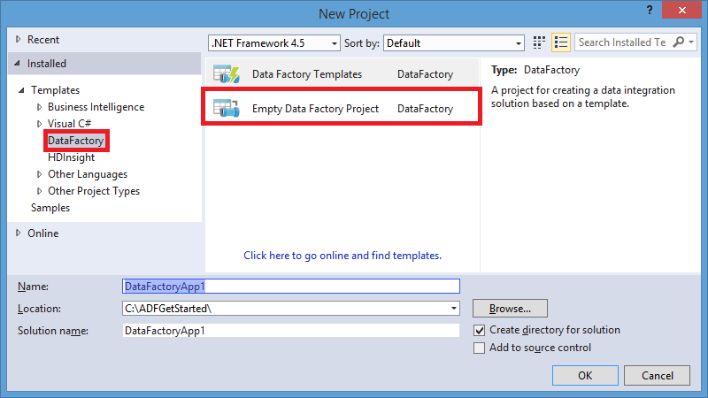
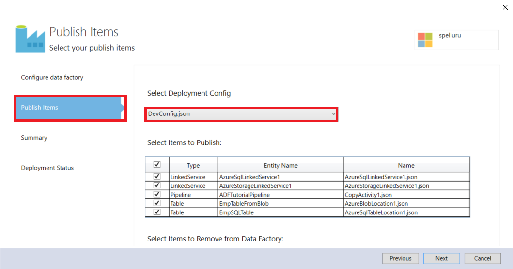

<properties
    pageTitle="Erstellen Ihrer erste Daten Factory (Visual Studio) | Microsoft Azure"
    description="In diesem Lernprogramm erstellen Sie eine Stichprobe Azure Data Factory Verkaufspipeline mit Visual Studio."
    services="data-factory"
    documentationCenter=""
    authors="spelluru"
    manager="jhubbard"
    editor="monicar"/>

<tags
    ms.service="data-factory"
    ms.workload="data-services"
    ms.tgt_pltfrm="na"
    ms.devlang="na"
    ms.topic="hero-article" 
    ms.date="10/17/2016"
    ms.author="spelluru"/>

# Lernprogramm: Erstellen Ihrer ersten Azure Daten Factory mithilfe von Microsoft Visual Studio
> [AZURE.SELECTOR]
- [Übersicht und erforderliche Komponenten](data-factory-build-your-first-pipeline.md)
- [Azure-portal](data-factory-build-your-first-pipeline-using-editor.md)
- [Visual Studio](data-factory-build-your-first-pipeline-using-vs.md)
- [PowerShell](data-factory-build-your-first-pipeline-using-powershell.md)
- [Ressourcenmanager-Vorlage](data-factory-build-your-first-pipeline-using-arm.md)
- [REST-API](data-factory-build-your-first-pipeline-using-rest-api.md)

In diesem Artikel verwenden Sie Microsoft Visual Studio erstellen Ihrer erste Azure-Daten Factory.

## Erforderliche Komponenten
1. [Lernprogramm Übersicht](data-factory-build-your-first-pipeline.md) Artikel lesen Sie, und führen Sie die Schritte **Voraussetzung** aus.
2. Sie müssen ein **Administrator des Abonnements Azure** Data Factory Einheiten aus Visual Studio Azure Data Factory veröffentlichen können sein.
3. Sie müssen Folgendes auf Ihrem Computer installiert sein: 
    - Visual Studio-2013 oder Visual Studio 2015
    - Herunterladen von Azure SDK für Visual Studio-2013 oder Visual Studio 2015. Navigieren Sie zur [Downloadseite Azure](https://azure.microsoft.com/downloads/) , und klicken Sie auf **im Vergleich mit einer 2013** oder **im Vergleich mit einer 2015** im Abschnitt **.NET** .
    - Laden Sie die neuesten Azure Data Factory-Plug-In für Visual Studio: [im Vergleich mit einer 2013](https://visualstudiogallery.msdn.microsoft.com/754d998c-8f92-4aa7-835b-e89c8c954aa5) oder [im Vergleich mit einer 2015](https://visualstudiogallery.msdn.microsoft.com/371a4cf9-0093-40fa-b7dd-be3c74f49005). Sie können auch das Plug-in aktualisieren, indem Sie wie folgt vorgehen: Klicken Sie im Menü **Extras**auf -> **Extensions und Updates** -> **Online** -> **Visual Studio Gallery** -> **Microsoft Azure Data Factory-Tools für Visual Studio** -> **Aktualisieren**. 
 
Jetzt, lassen Sie uns Visual Studio verwenden, um eine Fabrik Azure-Daten zu erstellen. 

## Visual Studio-Projekt erstellen 
1. Starten Sie den **Visual Studio 2013** oder **Visual Studio 2015**. Klicken Sie auf **Datei**, zeigen Sie auf **neu**, und klicken Sie auf **Projekt**. Klicken Sie im Dialogfeld **Neues Projekt** sollte angezeigt werden.  
2. Klicken Sie im Dialogfeld **Neues Projekt** wählen Sie die Vorlage **DataFactory** aus, und klicken Sie auf **Leere Daten Factory-Projekt**.   

    

3. Geben Sie einen **Namen** für das Projekt, **Speicherort**und einen Namen für die **Lösung**, und klicken Sie auf **OK**.

    

## Erstellen von verknüpften Diensten
Eine Factory Daten kann eine oder mehrere Rohrleitungen haben. Eine Verkaufspipeline kann eine oder mehrere Aktivitäten enthalten. Angenommen, eine Kopie Aktivität zum Kopieren von Daten aus einer Quelle zu einem Ziel-Datenspeicher und eine HDInsight Struktur Aktivität Struktur Skript aus, um die Eingabedaten transformieren ausführen. Finden Sie unter [unterstützte Daten gespeichert sind](data-factory-data-movement-activities.md##supported-data-stores-and-formats) , für alle Quellen und senken unterstützt, indem Sie die Aktivität kopieren. Finden Sie unter für die Liste der berechnen Dienste von Daten Factory unterstützt [verknüpfte Diensten zu berechnen](data-factory-compute-linked-services.md) . 

In diesem Schritt verknüpfen Sie Ihr Konto Azure-Speicher und eine bei Bedarf Azure HDInsight Cluster mit Ihrer Daten Factory ein. Das Konto Azure-Speicher enthält die Eingabe- und Daten für die Verkaufspipeline, in diesem Beispiel. Der Dienst HDInsight verknüpft dient zum Ausführen von Struktur Skript in die Aktivität von der Verkaufspipeline in diesem Beispiel angegeben. Welche Daten identifizieren Store/berechnen Services werden in Ihrem Szenario verwendet und Dienste Fabrik Daten durch Erstellen von verknüpften Diensten verknüpfen.  

Geben Sie den Namen und Einstellungen für die Daten Factory später, wenn Sie Ihre Daten Factory-Lösung veröffentlichen.

#### Erstellen von Azure verknüpft Speicherdienst
In diesem Schritt verknüpfen Sie Ihr Konto Azure-Speicher mit Ihrer Daten Factory an. In diesem Lernprogramm verwenden Sie das gleiche Speicher Azure-Konto zum Speichern/Ausgang Daten und der HQL-Skriptdatei aus. 

4. Mit der rechten Maustaste **Verknüpften Diensten** Explorer Lösung, zeigen Sie auf **Hinzufügen**, und klicken Sie auf **Neues Element**.      
5. Wählen Sie im Dialogfeld **Neues Element hinzufügen** aus der Liste **Verknüpfte Azure-Speicherdienst** aus, und klicken Sie auf **Hinzufügen**. 
3. Ersetzen von **Kontoname** und **Accountkey** mit dem Namen der Ihr Konto Azure-Speicher und den zugehörigen Schlüssel. So erhalten Sie Ihre Zugriffstaste Speicher finden Sie unter [anzeigen, kopieren und neu generieren Speicher-Tastenkombinationen](../storage/storage-create-storage-account.md#view-copy-and-regenerate-storage-access-keys)

    

4. Speichern Sie die Datei **AzureStorageLinkedService1.json** .

#### Erstellen von Azure HDInsight verknüpft-Dienst
In diesem Schritt verknüpfen Sie einen bei Bedarf HDInsight Cluster mit Ihrer Daten Factory an. HDInsight Cluster wird automatisch zur Laufzeit erstellt und gelöscht, nachdem es für die angegebene Zeitspanne Verarbeitung und im Leerlauf ausgeführt werden. Sie können eigene HDInsight Cluster anstelle von einem bei Bedarf HDInsight Cluster verwenden. Details finden Sie unter [Verknüpfte Services zu berechnen](data-factory-compute-linked-services.md) . 

1. In der **Lösung Explorer**mit der rechten Maustaste **Verknüpften Diensten**, zeigen Sie auf **Hinzufügen**, und klicken Sie auf **Neues Element**.
2. Wählen Sie **HDInsight auf Demand verknüpfte Dienst**aus, und klicken Sie auf **Hinzufügen**. 
3. Ersetzen Sie den **JSON** durch Folgendes ein:

        {
          "name": "HDInsightOnDemandLinkedService",
          "properties": {
            "type": "HDInsightOnDemand",
            "typeProperties": {
              "version": "3.2",
              "clusterSize": 1,
              "timeToLive": "00:30:00",
              "linkedServiceName": "AzureStorageLinkedService1"
            }
          }
        }
    
    Die folgende Tabelle enthält eine Beschreibung für die JSON-Eigenschaften in der Codeausschnitt verwendet werden:
    
    Eigenschaft | Beschreibung
    -------- | -----------
    Version | Gibt an, dass die Version von der HDInsight benutzerspezifisch 3,2 erstellt. 
    ClusterSize | Gibt die Größe des HDInsight Cluster an. 
    TimeToLive | Gibt an, dass die im Leerlauf Zeit für den Cluster HDInsight, bevor sie gelöscht wird.
    linkedServiceName | Gibt das Speicherkonto, mit dem die Protokolle speichern, die von HDInsight generiert werden

    Beachten Sie Folgendes: 
    
    - Die Daten Factory erstellt einen **Windows-basierten** HDInsight Cluster, mit der vorherigen JSON. Sie auch haben diese erstellen Sie einen **Linux-basierten** HDInsight Cluster. Details finden Sie [Bei Bedarf HDInsight verknüpfte Dienst](data-factory-compute-linked-services.md#azure-hdinsight-on-demand-linked-service) . 
    - Sie können **Eigene HDInsight Cluster** anstelle von einem bei Bedarf HDInsight Cluster verwenden. Details finden Sie unter [Verknüpfte HDInsight-Dienst](data-factory-compute-linked-services.md#azure-hdinsight-linked-service) .
    - HDInsight Cluster erstellt einen **standardmäßige Container** in den Blob-Speicher, die, den Sie in das JSON (**LinkedServiceName**) angegeben haben. HDInsight wird dieser Container nicht gelöscht, wenn der Cluster gelöscht wird. Dieses Verhalten ist beabsichtigt. Mit dem Dienst bei Bedarf HDInsight verknüpft wird ein HDInsight Cluster erstellt jedes Mal, wenn ein Segment verarbeitet wird, es sei denn, es ist ein vorhandener live Cluster (**TimeToLive**). Cluster wird automatisch gelöscht, wenn die Verarbeitung abgeschlossen ist.
    
        Als weitere Segmente verarbeitet werden, wird in Ihrem Azure Blob Storage viele Container. Wenn Sie nicht zur Behandlung dieses Problems der Einzelvorgänge benötigen, möchten Sie möglicherweise löschen, um die Speicherkosten für reduzieren. Führen Sie die Namen dieser Container ein Muster: "Adf**Yourdatafactoryname**-**Linkedservicename**- Datetimestamp". Mit Tools wie [Microsoft Speicher-Explorer](http://storageexplorer.com/) zum Container in Ihrer Azure Blob-Speicher löschen.

    Details finden Sie [Bei Bedarf HDInsight verknüpfte Dienst](data-factory-compute-linked-services.md#azure-hdinsight-on-demand-linked-service) . 
4. Speichern Sie die Datei **HDInsightOnDemandLinkedService1.json** .

## Datasets erstellen
In diesem Schritt erstellen Sie Datasets zum Darstellen der Eingabe und Ausgabedaten für die Verarbeitung von Struktur. Diese Datasets finden Sie in der **AzureStorageLinkedService1** , die Sie zuvor in diesem Lernprogramm erstellt haben. Die verknüpfte Dienstpunkte einer Azure-Speicher-Konto und Datasets angeben Container, Ordner, Dateiname in der Speicher, der Eingabe und Ausgabedaten.   

#### Erstellen von dataset

1. In der **Lösung Explorer**mit der rechten Maustaste **Tabellen**, zeigen Sie auf **Hinzufügen**, und klicken Sie auf **Neues Element**. 
2. Wählen Sie in der Liste **Azure Blob** , ändern Sie den Namen der Datei zu **InputDataSet.json**, und klicken Sie auf **Hinzufügen**.
3. Ersetzen Sie den **JSON** im Editor durch Folgendes ein: 

    In den JSON-Codeausschnitt erstellen Sie ein Dataset namens **AzureBlobInput** , die Eingabedaten für eine Aktivität in der Verkaufspipeline darstellt. Geben Sie darüber hinaus an, dass die Eingabedaten in den Blob-Container **Adfgetstarted** bezeichnet und Ordner mit dem Namen **Inputdata** befindet
        
        {
            "name": "AzureBlobInput",
            "properties": {
                "type": "AzureBlob",
                "linkedServiceName": "AzureStorageLinkedService1",
                "typeProperties": {
                    "fileName": "input.log",
                    "folderPath": "adfgetstarted/inputdata",
                    "format": {
                        "type": "TextFormat",
                        "columnDelimiter": ","
                    }
                },
                "availability": {
                    "frequency": "Month",
                    "interval": 1
                },
                "external": true,
                "policy": {}
            }
        } 

    Die folgende Tabelle enthält eine Beschreibung für die JSON-Eigenschaften in der Codeausschnitt verwendet werden:

  	| Eigenschaft | Beschreibung |
  	| :------- | :---------- |
  	| Typ | Die Eigenschaft wird auf AzureBlob festgelegt, da die Daten in Azure Blob-Speicher befinden. |  
  	| linkedServiceName | verweist auf die AzureStorageLinkedService1, die Sie zuvor erstellt haben. |
  	| Dateiname | Diese Eigenschaft ist optional. Wenn Sie diese Eigenschaft nicht angeben, werden alle Dateien aus den Ordnerpfad entnommen. In diesem Fall wird nur das input.log verarbeitet. |
  	| Typ | Die Protokolldateien werden im Text-Format, damit wir TextFormat verwenden. | 
  	| columnDelimiter | Spalten in die Protokolldateien werden durch das Komma (,) getrennt. |
  	| Häufigkeit/Intervall | Legen Sie auf den Monat und das Intervall Häufigkeit ist 1, was bedeutet, dass die Eingabewerte Segmente monatlich verfügbar sind. | 
  	| externe | True, wenn die Eingabedaten nicht vom Dienst Daten Factory generiert werden, wird diese Eigenschaft festgelegt. | 
      
    
3. Speichern Sie die Datei **InputDataset.json** . 

 
#### Die Ausgabe Dataset erstellen
Erstellen Sie jetzt das Ausgabe-Dataset aus, um die Ausgabedaten Azure Blob-Speicher gehörende Kehrmatrix darstellen. 

1. In der **Lösung Explorer**mit der rechten Maustaste **Tabellen**, zeigen Sie auf **Hinzufügen**, und klicken Sie auf **Neues Element**. 
2. Wählen Sie in der Liste **Azure Blob** , ändern Sie den Namen der Datei zu **OutputDataset.json**, und klicken Sie auf **Hinzufügen**. 
3. Ersetzen Sie den **JSON** im Editor durch Folgendes ein: 

    In den JSON-Codeausschnitt erstellen Sie ein Dataset namens **AzureBlobOutput**und angeben, die die Struktur der Daten, die durch das Skript Struktur erstellt werden. Darüber hinaus geben Sie an, dass die Ergebnisse in der Blob-Container **Adfgetstarted** bezeichnet und Ordner mit dem Namen **Partitioneddata**gespeichert werden. Im Abschnitt **Verfügbarkeit** der gibt an, dass das Ausgabe Dataset monatlich erzeugt wird.
    
        {
          "name": "AzureBlobOutput",
          "properties": {
            "type": "AzureBlob",
            "linkedServiceName": "AzureStorageLinkedService1",
            "typeProperties": {
              "folderPath": "adfgetstarted/partitioneddata",
              "format": {
                "type": "TextFormat",
                "columnDelimiter": ","
              }
            },
            "availability": {
              "frequency": "Month",
              "interval": 1
            }
          }
        }

    Finden Sie unter **Erstellen von Dataset** Abschnitt für eine Beschreibung dieser Eigenschaften. Sie können nicht externe Eigenschaft auf ein Dataset Ausgabe festlegen, wie das Dataset durch die Daten Factory-Dienst erstellt wird.

4. Speichern Sie die Datei **OutputDataset.json** .

### Erstellen der Verkaufspipeline
In diesem Schritt erstellen Sie Ihre erste Verkaufspipeline mit einer Aktivität **HDInsightHive** aus. Das Segment Eingabewerte steht monatlich (Häufigkeit: Monat, Intervall: 1), Ausgabe Segment monatlich erstellt wird und die Scheduler-Eigenschaft für die Aktivität auch monatlich festgelegt ist. Die Einstellungen für die Ausgabe Dataset und die Aktivität Scheduler müssen übereinstimmen. Derzeit ist Ausgabe Dataset, was den Terminplan veranlasst, müssen Sie ein Dataset Ausgabe erstellen, selbst wenn die Aktivität keine Ausgabe erzeugt. Wenn die Aktivität jede Eingabe übernehmen möchten nicht, können Sie überspringen des Eingabe-Dataset zu erstellen. Am Ende des in diesem Abschnitt werden die Eigenschaften in der folgenden JSON verwendete erläutert.

1. Die **Lösung Explorer**, mit der Maustaste **Pipelines**, zeigen Sie auf **Hinzufügen**, und klicken Sie auf **Neues Element.** 
2. Wählen Sie die **Struktur Transformation Verkaufspipeline** aus der Liste aus, und klicken Sie auf **Hinzufügen**. 
3. Ersetzen Sie den **JSON** mit den folgenden Codeausschnitt an.

    > [AZURE.IMPORTANT] Ersetzen Sie **Storageaccountname** durch den Namen Ihres Kontos Speicher ein.

        {
            "name": "MyFirstPipeline",
            "properties": {
                "description": "My first Azure Data Factory pipeline",
                "activities": [
                    {
                        "type": "HDInsightHive",
                        "typeProperties": {
                            "scriptPath": "adfgetstarted/script/partitionweblogs.hql",
                            "scriptLinkedService": "AzureStorageLinkedService1",
                            "defines": {
                                "inputtable": "wasb://adfgetstarted@<storageaccountname>.blob.core.windows.net/inputdata",
                                "partitionedtable": "wasb://adfgetstarted@<storageaccountname>.blob.core.windows.net/partitioneddata"
                            }
                        },
                        "inputs": [
                            {
                                "name": "AzureBlobInput"
                            }
                        ],
                        "outputs": [
                            {
                                "name": "AzureBlobOutput"
                            }
                        ],
                        "policy": {
                            "concurrency": 1,
                            "retry": 3
                        },
                        "scheduler": {
                            "frequency": "Month",
                            "interval": 1
                        },
                        "name": "RunSampleHiveActivity",
                        "linkedServiceName": "HDInsightOnDemandLinkedService"
                    }
                ],
                "start": "2016-04-01T00:00:00Z",
                "end": "2016-04-02T00:00:00Z",
                "isPaused": false
            }
        }

    In den JSON-Codeausschnitt erstellen Sie eine Verkaufspipeline, der eine einzelne Aktivität besteht, die Struktur an Prozess Daten auf einem Cluster HDInsight verwendet.
    
    In den JSON-Codeausschnitt erstellen Sie eine Verkaufspipeline, der eine einzelne Aktivität besteht, die Struktur an Prozess Daten auf einem Cluster HDInsight verwendet.
    
    Die Struktur-Skriptdatei, **partitionweblogs.hql**, wird in der Azure-Speicher-Konto (angegeben durch die ScriptLinkedService, die als **AzureStorageLinkedService1**bezeichnet), und klicken Sie im Ordner " **Skript** " in den Container **Adfgetstarted**gespeichert.

    Im Abschnitt **definiert** wird verwendet, um die Einstellungen für die Laufzeit angeben, die als Struktur Konfigurationswerte an das Skript Struktur übergeben werden (z. B. ${Hiveconf: inputtable}, ${Hiveconf:partitionedtable}).

    Die Eigenschaften **Starten** und **Beenden** der Verkaufspipeline gibt den aktiven Zeitraum der Verkaufspipeline an.

    In der Aktivität JSON Geben Sie an, dass das Skript Struktur für das Berechnen von der **LinkedServiceName** – **HDInsightOnDemandLinkedService**angegebenen ausgeführt wird.

    > [AZURE.NOTE] Details zu JSON-Eigenschaften, die im Beispiel verwendete finden Sie unter [Aufbau einer Verkaufspipeline](data-factory-create-pipelines.md#anatomy-of-a-pipeline) . 
3. Speichern Sie die Datei **HiveActivity1.json** .

### Hinzufügen von partitionweblogs.hql und input.log als Abhängigkeit 

1. Mit der rechten Maustaste **Abhängigkeiten** in **Solution Explorer** -Fenster, zeigen Sie auf **Hinzufügen**, und klicken Sie auf **Vorhandenes Element**.  
2. Navigieren Sie zu der **C:\ADFGettingStarted** und **partitionweblogs.hql**, **input.log** Dateien, wählen Sie aus, und klicken Sie auf **Hinzufügen**. Sie haben diese beiden Dateien als Teil der Voraussetzungen für aus der [Übersicht Lernprogramm](data-factory-build-your-first-pipeline.md)erstellt.

Wenn Sie die Lösung im nächsten Schritt veröffentlichen, wird die **partitionweblogs.hql** -Datei in den Skriptordner im Container Blob **Adfgetstarted** hochgeladen.   

### Veröffentlichen/Bereitstellen von Daten Factory Einheiten

18. Mit der rechten Maustaste Projekt in der Lösung-Explorer, und klicken Sie auf **Veröffentlichen**. 
19. Wenn Sie im Dialogfeld **Melden Sie sich bei Ihrem Microsoft-Konto** angezeigt wird, geben Sie Ihre Anmeldeinformationen für das Konto, das Abonnement Azure hat, und klicken Sie auf **Anmelden**.
20. Das Dialogfeld sollte angezeigt werden:

    

21. Folgendermaßen Sie in der Seite konfigurieren Factory vor: 
    1. Wählen Sie **Erstellen neue Daten Factory** -Option aus.
    2. Geben Sie einen eindeutigen **Namen** für die Daten Factory ein. Beispiel: **FirstDataFactoryUsingVS09152016**. Der Name muss global eindeutig sein.  
    
    
        > [AZURE.IMPORTANT] Wenn Sie beim Veröffentlichen des Fehlers **Factory Data Source Name "FirstDataFactoryUsingVS" ist nicht verfügbar** erhalten, ändern Sie den Namen (beispielsweise YournameFirstDataFactoryUsingVS). Finden Sie unter [Data Factory - Regeln zur Benennung von](data-factory-naming-rules.md) Thema Benennungskonventionen für Daten Factory Elemente.
3. Wählen Sie das richtige Abonnement für das Feld **Abonnement** aus.
     
     
        > [AZURE.IMPORTANT] Wenn Sie alle Abonnements nicht angezeigt werden, stellen Sie sicher, dass Sie sich mit einem Konto, ist ein oder co-Administrator des Abonnements, angemeldet.  
        
    4. Wählen Sie aus der **Ressourcengruppe** für die Daten Factory erstellt werden. 
    5. Wählen Sie im **Bereich** für die Daten Factory aus. 
    6. Klicken Sie auf **Weiter** , wechseln Sie zur Seite **Elemente veröffentlichen** . (Drücken Sie **TAB** , um das Namensfeld zu verlassen, wenn die Schaltfläche **Weiter** deaktiviert ist.) 
23. Auf der Seite **Veröffentlichen Elemente** sicher, dass alle Daten-Factory Elemente ausgewählt sind, und klicken Sie auf **Weiter** zur Seite **Zusammenfassung** zu wechseln.     
24. Überprüfen Sie die Zusammenfassung, und klicken Sie auf **Weiter** , um zu den Bereitstellungsprozess starten, und zeigen Sie den **Status der Bereitstellung**.
25. Die **Bereitstellung** Statusseite sollten Sie den Status des Bereitstellungsprozesses angezeigt. Klicken Sie auf Fertig stellen, nachdem die Bereitstellung abgeschlossen ist. 

 
Wichtige Punkte zu beachten: 

- Wenn Sie die Fehlermeldung: "**Abonnement ist nicht registriert, um den Namespace Microsoft.DataFactory verwenden**", führen Sie eine der folgenden Aktionen, und versuchen Sie erneut veröffentlichen: 

    - Führen Sie in Azure PowerShell zum Registrieren des Daten Factory-Anbieters den folgenden Befehl ein. 
        
            Register-AzureRmResourceProvider -ProviderNamespace Microsoft.DataFactory
    
        Sie können dem folgenden Befehl aus, um zu bestätigen, dass die Daten Factory ausführen, wenn Anbieter registriert ist. 
    
            Get-AzureRmResourceProvider
    - Melden Sie sich mit dem Azure Abonnement in [Azure-Portal](https://portal.azure.com) und navigieren Sie zu einer Blade Daten Factory (oder) erstellen Sie eine Factory Daten im Azure-Portal. Diese Aktion registriert automatisch den Anbieter für Sie.
-   Der Name der Factory Daten möglicherweise als DNS-Namen in der Zukunft und somit werden öffentlich sichtbar registriert werden.
-   Um Daten Factory-Instanzen erstellen zu können, müssen Sie ein oder co-Administrator des Abonnements Azure sein

 
## Monitor Verkaufspipeline

### Monitor Verkaufspipeline mithilfe der Diagrammsicht
6. Melden Sie sich bei der [Azure-Portal](https://portal.azure.com/), gehen Sie folgendermaßen vor:
    1. Klicken Sie auf **Weitere Dienste** , und klicken Sie auf **Daten Factory**.
         
    2. Wählen Sie den Namen Ihrer Daten Factory (zum Beispiel: **FirstDataFactoryUsingVS09152016**) in der Liste der Daten Factory. 
        
7. Klicken Sie in der Homepage für Ihre Daten Factory auf **Diagramm**.
  
    
7. In der Diagrammansicht finden Sie unter Übersicht über die Pipelines und Datasets in diesem Lernprogramm verwendet.
    
     
8. Zum Anzeigen aller Aktivitäten in der Verkaufspipeline mit der rechten Maustaste Verkaufspipeline im Diagramm, und klicken Sie auf Öffnen Verkaufspipeline. 

    
9. Bestätigen Sie, dass Sie in der Verkaufspipeline die HDInsightHive-Aktivitäten angezeigt. 
  
    

    Um zurück zur vorherigen Ansicht zu navigieren, klicken Sie auf **Daten Factory** in der Breadcrumb-Menü am oberen. 
10. Doppelklicken Sie in der **Diagrammansicht**auf das Dataset **AzureBlobInput**. Bestätigen Sie, dass das Segment Zustand **bereit** . Es dauert ein paar Minuten dauern, bis das Segment eingeschaltet angezeigt. Wenn es nicht geschieht, nachdem Sie einige Zeit warten, finden Sie unter Wenn Sie die Eingabe Datei (input.log) in den richtigen Container (Adfgetstarted) und einen Ordner (Inputdata) platziert haben.

    
11. Klicken Sie auf **X** , um **AzureBlobInput** Blade zu schließen. 
12. Doppelklicken Sie in der **Diagrammansicht**auf das Dataset **AzureBlobOutput**. Sie sehen, die das Segment, die gerade verarbeitet wird.

    
9. Wenn Verarbeitung fertig ist, wird das Segment im Zustand **bereit** .

    > [AZURE.IMPORTANT] Erstellung einer bei Bedarf HDInsight Cluster normalerweise dauert einige Zeit (ungefähr 20 Minuten). Daher erwarten der Verkaufspipeline werden müssen, **etwa 30 Minuten** das Segment Verarbeitungszeit.  

     
    
10. Wenn das Segment **eingeschaltet** ist, überprüfen Sie den Ordner **Partitioneddata** im Container **Adfgetstarted** in Ihrem BLOB-Speicher für die Ausgabedaten.  
 
    
11. Klicken Sie auf das Segment, um Details es in einem Blade **Segment Daten** finden Sie unter.

      
12. Klicken Sie auf eine Aktivität ausführen in der **Liste der Aktivitäten ausgeführt** , zum Anzeigen von Details zu einer Aktivität (Struktur Aktivität in diesem Szenario) in einem Fenster **Ausführen Details Aktivität** ausführen.   
      
    
    Aus den Protokolldateien sehen Sie sich die Struktur Abfrage, die ausgeführt wurde und Statusinformationen. Diese Protokolle sind nützlich zur Behandlung dieses Problems Probleme.  
 

Finden Sie unter [Monitor Datasets und Verkaufspipeline](data-factory-monitor-manage-pipelines.md) Anweisungen zur Verwendung das Azure-Portal die Verkaufspipeline und Datasets überwachen, dass Sie in diesem Lernprogramm erstellt haben.

### Überwachen der Verkaufspipeline überwachen und Verwalten von App verwenden
Sie können auch Monitor verwenden und Verwalten der Anwendung, um Ihre Rohrleitungen überwachen. Ausführliche Informationen zur Verwendung dieser Anwendungs finden Sie unter [Überwachen und Verwalten von Azure Data Factory Pipelines mit Überwachung und Verwaltung App](data-factory-monitor-manage-app.md).

1. Klicken Sie auf Überwachen und verwalten Sie der Kachel.

     
2. Sie sollten finden Sie unter Überwachen und Verwalten der Anwendung. Ändern Sie die **Startzeit** und **Endzeit** Start übereinstimmt (04-01-2016 12:00 Uhr) und Endzeit (04-02-2016 12:00 Uhr) von der Verkaufspipeline, und klicken Sie auf **Übernehmen**.

     
3. Wählen Sie ein Aktivitätsfenster in der Liste Aktivität Windows zur Anzeige von Details zu erhalten. 
    

> [AZURE.IMPORTANT] Wenn das Segment erfolgreich verarbeitet wird, erhält die Eingabe Datei gelöscht. Daher, wenn Sie das Segment erneut ausführen, oder führen Sie das Lernprogramm erneut möchten, Hochladen Sie eingegebenen Datei (input.log) in den Ordner Inputdata des Containers Adfgetstarted.
 

## Verwenden Sie Server-Explorer zum Anzeigen von Daten Factory

1. Klicken Sie in **Visual Studio**klicken Sie im Menü **Ansicht** auf, und klicken Sie auf **Server-Explorer**.
2. Der Server-Explorer-Fenster erweitern Sie **Azure** und **Daten Factory**. Wenn **Visual Studio anmelden**, geben Sie angezeigt wird das **Konto** mit Ihrem Azure-Abonnement verknüpft ist, und klicken Sie auf **Weiter**. Geben Sie **Ihr Kennwort ein**, und klicken Sie auf **Anmelden**. Visual Studio versucht, Informationen zu allen Azure Daten Factory in Ihrem Abonnement zu erhalten. Der Status dieses Vorgangs im Fenster **Daten Factory-Aufgabenliste** angezeigt.

    
3. Sie können mit der rechten Maustaste in einer Factory Daten, und wählen Sie **Exportieren Daten Factory auf Neues Projekt** basierend auf einer vorhandenen Daten Factory Visual Studio-Projekt erstellen.

    

## Aktualisieren von Daten Factory-Tools für Visual Studio

Zum Aktualisieren von Azure Data Factory-Tools für Visual Studio folgendermaßen Sie vor:

1. Klicken Sie im Menü auf **Extras** , und wählen Sie **Extensions und Updates**.
2. Wählen Sie im linken Bereich **Updates** aus, und wählen Sie dann **Visual Studio-Katalog**.
3. Wählen Sie **die Daten Factory Azure Tools für Visual Studio** aus, und klicken Sie auf **Aktualisieren**. Wenn Sie diesen Eintrag nicht angezeigt werden, verfügen Sie bereits über die neueste Version der Tools. 

## Verwenden Sie die von Konfigurationsdateien
Von Konfigurationsdateien in Visual Studio können so konfigurieren Sie die Eigenschaften für verknüpfte Services/Tabellen/Pipelines für jede Umgebung unterschiedlich. 

Erwägen Sie die folgende JSON-Definition für eine Azure verknüpft Speicherdienst. Um anzugeben, **ConnectionString** mit anderen Werten für Kontoname und Accountkey basierend auf der Umgebung (Entwicklung/Test/Fertigung), die Sie Daten Factory Personen bereitstellen. Sie können dieses Verhalten mit separaten Konfigurationsdatei für jede Umgebung erreichen. 

    {
        "name": "StorageLinkedService",
        "properties": {
            "type": "AzureStorage",
            "description": "",
            "typeProperties": {
                "connectionString": "DefaultEndpointsProtocol=https;AccountName=<accountname>;AccountKey=<accountkey>"
            }
        }
    } 

### Hinzufügen einer Konfigurationsdatei
Fügen Sie eine Konfigurationsdatei für jede Umgebung anhand der folgenden Schritte aus:   

1. Mit der rechten Maustaste in des Daten Factory-Projekts in der Visual Studio-Lösung, zeigen Sie auf **Hinzufügen**, und klicken Sie auf **Neues Element**.
2. Wählen Sie in der Liste der installierten Vorlagen auf der linken Seite **Config** , wählen Sie **Konfigurationsdatei aus**, geben Sie einen **Namen** für die Konfigurationsdatei, und klicken Sie auf **Hinzufügen**.

    
3. Fügen Sie die Konfigurationsparameter und deren Werte in folgendem Format hinzu.

        {
            "$schema": "http://datafactories.schema.management.azure.com/vsschemas/V1/Microsoft.DataFactory.Config.json",
            "AzureStorageLinkedService1": [
                {
                    "name": "$.properties.typeProperties.connectionString",
                    "value": "DefaultEndpointsProtocol=https;AccountName=<accountname>;AccountKey=<accountkey>"
                }
            ],
            "AzureSqlLinkedService1": [
                {
                    "name": "$.properties.typeProperties.connectionString",
                    "value":  "Server=tcp:spsqlserver.database.windows.net,1433;Database=spsqldb;User ID=spelluru;Password=Sowmya123;Trusted_Connection=False;Encrypt=True;Connection Timeout=30"
                }
            ]
        }

    In diesem Beispiel wird die ConnectionString-Eigenschaft einer Azure verknüpft Speicherdienst und einem SQL Azure-Verknüpfte Service konfiguriert. Beachten Sie, dass die Syntax zur Angabe von Namen [JsonPath](http://goessner.net/articles/JsonPath/)ist.   

    Wenn JSON eine Eigenschaft hat, die ein Array von Werten, wie in den folgenden Code dargestellt:  

        "structure": [
            {
                "name": "FirstName",
                "type": "String"
            },
            {
                "name": "LastName",
                "type": "String"
            }
        ],
    
    Konfigurieren Sie die Eigenschaften wie in der folgenden Konfigurationsdatei (verwenden nullbasierte Indizierung) dargestellt: 
        
        {
            "name": "$.properties.structure[0].name",
            "value": "FirstName"
        }
        {
            "name": "$.properties.structure[0].type",
            "value": "String"
        }
        {
            "name": "$.properties.structure[1].name",
            "value": "LastName"
        }
        {
            "name": "$.properties.structure[1].type",
            "value": "String"
        }

### Eigenschaftennamen mit Leerzeichen
Wenn Sie ein Eigenschaftennamen Leerzeichen enthält, verwenden Sie eckigen Klammern, wie im folgenden Beispiel (Datenbankservername) dargestellt: 

     {
         "name": "$.properties.activities[1].typeProperties.webServiceParameters.['Database server name']",
         "value": "MyAsqlServer.database.windows.net"
     }

### Bereitstellen der Lösung mit einer Konfiguration
Beim Veröffentlichen von Azure Data Factory Personen in im Vergleich mit einer können Sie die Konfiguration angeben, die Sie für diesen Vorgang verwenden möchten. 

So veröffentlichen Sie Elemente in einem Konfigurationsdatei mit Azure Data Factory-Projekt:   

1. Mit der rechten Maustaste Daten Factory-Projekt, und klicken Sie auf **Veröffentlichen** , um das Dialogfeld **Veröffentlichen Elemente** anzuzeigen. 
2. Wählen Sie eine vorhandene Daten Factory, oder geben Sie Werte für eine Fabrik Daten erstellen, klicken Sie auf der Seite **"Data Factory" Konfigurieren** , und klicken Sie auf **Weiter**.   
3. Klicken Sie auf der Seite **Elemente veröffentlichen** : wird eine Dropdown-Liste mit verfügbaren Konfigurationen für das Feld **Bereitstellung Config auswählen** .

    

4. Wählen Sie die **Konfigurationsdatei** , die Sie möchten, und klicken Sie auf **Weiter**. 
5. Bestätigen Sie, dass Sie den Namen der JSON-Datei auf der Seite **Zusammenfassung** finden Sie unter, und klicken Sie auf **Weiter**. 
6. Klicken Sie nach Abschluss des Bereitstellungsvorgangs auf **Fertig stellen** . 

Beim Bereitstellen, werden die Werte aus der Konfigurationsdatei verwendet, in den JSON-Dateien für Daten Factory Personen Werte für die Eigenschaften festlegen, bevor die Personen Azure Data Factory-Dienst bereitgestellt werden.   

## Zusammenfassung 
In diesem Lernprogramm haben Sie eine Fabrik Azure-Daten zum Verarbeiten von Daten durch Ausführen der Struktur Skripts auf einem HDInsight Hadoop Cluster erstellt. Sie verwendet die Daten Factory-Editor im Azure-Portal an, um führen Sie die folgenden Schritte aus:  

1.  Erstellt eine Azure- **Daten Factory**.
2.  Erstellt zwei **verknüpften Diensten**:
    1.  **Azure-Speicher** verknüpft Dienst Ihre Azure Blob-Speicher zu verknüpfen, der ein-/Ausgabe Dateien auf die Factory Daten enthält.
    2.  **Azure HDInsight** bei Bedarf verknüpfte Dienst zum Verknüpfen von eines bei Bedarf HDInsight Hadoop Clusters Fabrik Daten. Azure Data Factory erstellt eine HDInsight Hadoop Cluster lediglich-Time um Verarbeitung Eingabedaten und Ausgabedaten. 
3.  Erstellt zwei **Datasets**, mit denen Eingabe- und Daten für HDInsight Struktur Aktivität in der Verkaufspipeline beschrieben. 
4.  Erstellt eine **Verkaufspipeline** mit einer Aktivität **HDInsight Struktur** .  

## Nächste Schritte
In diesem Artikel haben Sie eine Verkaufspipeline mit einer Transformation Aktivität (HDInsight-Aktivität) erstellt, die eine Struktur Skript für eine bei Bedarf HDInsight Cluster ausgeführt wird. So verwenden Sie eine Kopie Aktivität zum Kopieren von Daten aus einer Azure Blob zu SQL Azure finden Sie unter [Lernprogramm: Kopieren von Daten aus einer Azure BLOB zu SQL Azure-](data-factory-copy-data-from-azure-blob-storage-to-sql-database.md).
  
## Siehe auch
| Thema | Beschreibung |
| :---- | :---- |
| [Daten Transformationsaktivitäten](data-factory-data-transformation-activities.md) | Dieser Artikel enthält eine Liste der Daten Transformationsaktivitäten (z. B. HDInsight Struktur Transformation, die Sie in diesem Lernprogramm verwendeten) von Azure Daten Factory unterstützt. | 
| [Planung und Ausführung](data-factory-scheduling-and-execution.md) | In diesem Artikel wird erläutert, die Planung und Ausführung Aspekte des Modells für Azure Data Factory-Anwendung. |
| [Pipelines](data-factory-create-pipelines.md) | In diesem Artikel können Sie die Pipelines und Aktivitäten in Azure Data Factory und deren Verwendung zum Erstellen von End-to-End-Daten basierende Workflows für Ihre Szenario oder Ihr Unternehmen zu verstehen. |
| [Datasets](data-factory-create-datasets.md) | In diesem Artikel können Sie die Datasets in Azure Data Factory zu verstehen.
| [Überwachen und Verwalten von Pipelines mit App für die Überwachung](data-factory-monitor-manage-app.md) | Dieser Artikel beschreibt, wie überwachen, verwalten und Debuggen Pipelines die Überwachung und Verwaltung App verwenden. 
