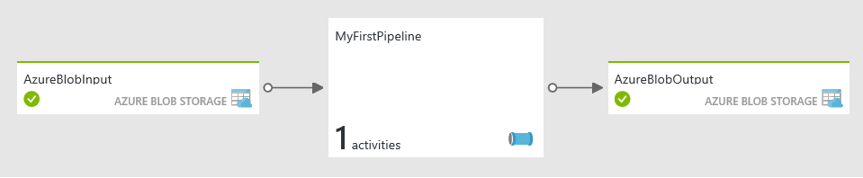

<properties
    pageTitle="Daten Factory Lernprogramm: erste Daten Verkaufspipeline | Microsoft Azure"
    description="In diesem Lernprogramm Azure Data Factory wird gezeigt, wie erstellen und planen eine Factory von Daten, die Daten mit Struktur Skript in einem Cluster Hadoop verarbeitet werden können."
    services="data-factory"
    keywords="Azure-Daten Factory Lernprogramm Hadoop Cluster Hadoop Struktur"
    documentationCenter=""
    authors="spelluru"
    manager="jhubbard"
    editor=""/>

<tags
    ms.service="data-factory"
    ms.workload="data-services"
    ms.tgt_pltfrm="na"
    ms.devlang="na"
    ms.topic="article" 
    ms.date="09/26/2016"
    ms.author="spelluru"/>

# Lernprogramm: Erstellen Sie Ihrer ersten Verkaufspipeline zum Verarbeiten von Daten mithilfe von Hadoop cluster 
> [AZURE.SELECTOR]
- [Übersicht und erforderliche Komponenten](data-factory-build-your-first-pipeline.md)
- [Azure-portal](data-factory-build-your-first-pipeline-using-editor.md)
- [Visual Studio](data-factory-build-your-first-pipeline-using-vs.md)
- [PowerShell](data-factory-build-your-first-pipeline-using-powershell.md)
- [Ressourcenmanager-Vorlage](data-factory-build-your-first-pipeline-using-arm.md)
- [REST-API](data-factory-build-your-first-pipeline-using-rest-api.md)

In diesem Lernprogramm erstellen Sie Ihre erste Azure-Daten Factory mit einer Verkaufspipeline Daten, die Daten verarbeitet werden, indem Sie die Struktur Skript auf einem Cluster Azure HDInsight (Hadoop) ausführen. 

> [AZURE.NOTE] In diesem Artikel bietet eine grundlegende Übersicht über die Daten Factory Azure keine. Eine grundlegende Übersicht über den Dienst finden Sie unter [Einführung in Azure Data Factory](data-factory-introduction.md). Finden Sie unter [Data Factory learning Pfad](https://azure.microsoft.com/documentation/learning-paths/data-factory/) für ein empfohlenes Verfahren zum Navigieren durch unsere Inhalte Daten Factory lernen.

## Was ist in diesem Lernprogramm abgedeckt? 
**Azure Data Factory** können Sie Daten **Bewegung** und **Verarbeitung** Datentasks Verfassen Sie als Daten basierende Workflows (auch als Datenpipelines bezeichnet). Sie erfahren, wie Sie Ihre erste Daten mit einem Datenverarbeitung (oder Datentransformation) Verkaufspipeline Aktivität zu erstellen. Diese Aktivität verwendet einen Cluster HDInsight Hadoop transformieren und Stichprobe Webprotokolle analysieren.  

In diesem Lernprogramm führen Sie die folgenden Schritte aus:

1.  Erstellen Sie eine **Fabrik Daten**ein. Eine Factory Daten kann einen enthalten oder mehr Daten Sie die Daten verschieben und Prozess Rohrleitungen. 
2.  Erstellen von **verknüpften Diensten**. Erstellen einer verknüpften Dienst zum Verknüpfen von eines Datenspeichers oder einer Computing-Service Fabrik Daten. Ein Datenspeicher wie Azure-Speicher enthält Daten, die ein-/Ausgabe der Aktivitäten in der Verkaufspipeline. Ein Computing-Service wie HDInsight Hadoop Cluster Prozesse/kann Daten.    
3.  Erstellen von Eingabe- und **Datasets**ausgeben. Eingabe-Dataset die Eingabe für eine Aktivität in der Verkaufspipeline und ein Dataset Ausgabe darstellt die Ausgabe für die Aktivität.
3.  Erstellen der **Verkaufspipeline**an. Eine Verkaufspipeline kann eine oder mehrere Aktivitäten haben (Beispiele: Aktivität kopieren, HDInsight Struktur Aktivität). In diesem Beispiel wird die Struktur HDInsight Aktivität, die eine Struktur Skript in einem Cluster HDInsight Hadoop ausgeführt wird verwendet. Das Skript zuerst erstellt eine Tabelle, die die Daten unformatierten Web Log in Azure Blob-Speicher verweist und dann teilt den unformatierten Daten nach Jahr und Monat.

    Es gibt zwei Arten von Aktivitäten von Azure Daten Factory unterstützt. Sie sind: [Daten Bewegung](data-factory-data-movement-activities.md) und [Daten Transformationsaktivitäten](data-factory-data-transformation-activities.md). Es gibt Daten nur eine Bewegung Aktivität, die Aktivität kopieren aus. In diesem Lernprogramm verwenden Sie nicht die Aktivität kopieren. Ein Lernprogramm zur Verwendung der Aktivität kopieren, finden Sie unter [Lernprogramm: Kopieren von Daten aus einer Azure BLOB zu SQL Azure-](data-factory-copy-data-from-azure-blob-storage-to-sql-database.md). HDInsight Struktur Aktivitäten, die Sie in diesem Lernprogramm verwenden ist eine Daten Transformation Aktivitäten von Daten Factory unterstützt.  
 
So sieht der **Diagrammansicht** der Stichprobe Daten Factory, die Sie in diesem Lernprogramm erstellen aus. 

In diesem Lernprogramm enthält **Inputdata** Ordner des Containers Azure Blob **Adfgetstarted** einer Datei mit dem Namen input.log. Diese Protokolldatei hat Einträge aus den drei Monaten: Januar, Februar und März der 2016. Hier sind die Stichprobe Zeilen für jeden Monat in die Datei ein. 

    2016-01-01,02:01:09,SAMPLEWEBSITE,GET,/blogposts/mvc4/step2.png,X-ARR-LOG-ID=2ec4b8ad-3cf0-4442-93ab-837317ece6a1,80,-,1.54.23.196,Mozilla/5.0+(Windows+NT+6.3;+WOW64)+AppleWebKit/537.36+(KHTML,+like+Gecko)+Chrome/31.0.1650.63+Safari/537.36,-,http://weblogs.asp.net/sample/archive/2007/12/09/asp-net-mvc-framework-part-4-handling-form-edit-and-post-scenarios.aspx,\N,200,0,0,53175,871 
    2016-02-01,02:01:10,SAMPLEWEBSITE,GET,/blogposts/mvc4/step7.png,X-ARR-LOG-ID=d7472a26-431a-4a4d-99eb-c7b4fda2cf4c,80,-,1.54.23.196,Mozilla/5.0+(Windows+NT+6.3;+WOW64)+AppleWebKit/537.36+(KHTML,+like+Gecko)+Chrome/31.0.1650.63+Safari/537.36,-,http://weblogs.asp.net/sample/archive/2007/12/09/asp-net-mvc-framework-part-4-handling-form-edit-and-post-scenarios.aspx,\N,200,0,0,30184,871
    2016-03-01,02:01:10,SAMPLEWEBSITE,GET,/blogposts/mvc4/step7.png,X-ARR-LOG-ID=d7472a26-431a-4a4d-99eb-c7b4fda2cf4c,80,-,1.54.23.196,Mozilla/5.0+(Windows+NT+6.3;+WOW64)+AppleWebKit/537.36+(KHTML,+like+Gecko)+Chrome/31.0.1650.63+Safari/537.36,-,http://weblogs.asp.net/sample/archive/2007/12/09/asp-net-mvc-framework-part-4-handling-form-edit-and-post-scenarios.aspx,\N,200,0,0,30184,871

Wenn die Datei von der Verkaufspipeline mit HDInsight Struktur Aktivität verarbeitet wird, wird die Aktivität auf HDInsight Cluster ein Skript Struktur ausgeführt, dass Partitionen nach Jahr und Monat Daten eingegeben. Das Skript erstellt drei Ausgabeordner, die eine Datei mit den Einträgen aus jeden Monat enthalten.  

    adfgetstarted/partitioneddata/year=2016/month=1/000000_0
    adfgetstarted/partitioneddata/year=2016/month=2/000000_0
    adfgetstarted/partitioneddata/year=2016/month=3/000000_0

Aus den oben gezeigten Beispiel Linien der ersten Phase (mit 2016-01-01) bezieht sich auf die Datei 000000_0 im Monat = 1 Ordner. Auf ähnliche Weise im zweiten Beispiel bezieht sich auf die Datei im Monat = 2 Ordner und der dritte eine bezieht sich auf die Datei im Monat = 3 Ordner.  

## Erforderliche Komponenten
Bevor Sie dieses Lernprogramm beginnen, müssen Sie die folgenden Vorkenntnisse verfügen:

1.  **Azure-Abonnement** – Wenn Sie ein Azure-Abonnement besitzen, können Sie ein kostenloses Testversion Konto nur wenigen Minuten erstellen. Finden Sie unter [Kostenlose Testversion](https://azure.microsoft.com/pricing/free-trial/) auf, wie Sie ein kostenloses Testversion Konto abrufen können.

2.  **Azure-Speicher** – Sie ein Konto Azure-Speicher zum Speichern der Daten in diesem Lernprogramm verwenden. Wenn Sie ein Azure-Speicher-Konto besitzen, finden Sie im Artikel [Erstellen eines Speicher-Kontos](../storage/storage-create-storage-account.md#create-a-storage-account) . Nachdem Sie das Speicherkonto erstellt haben, beachten Sie unten den **Kontonamen** und **Zugriffstaste**. Finden Sie unter [anzeigen, kopieren und neu generieren Speicher Zugriffstasten](../storage/storage-create-storage-account.md#view-and-copy-storage-access-keys). 

### Hochladen von Dateien auf Azure-Speicher für das Lernprogramm
Vor dem Starten des Lernprogramms, müssen Sie Ihr Konto Azure-Speicher mit Beispieldateien des Lernprogramms vorzubereiten.

1. Hochladen Sie Struktur Query-Datei (HQL) in **Skript** -Ordner des Containers Blob **Adfgetstarted** an.
2. Hochladen einer Datei in **Inputdata** Ordner des Containers Blob **Adfgetstarted** . 

#### Erstellen von HQL-Skriptdatei 

1. Starten Sie den **Editor** , und fügen Sie das folgende HQL Skript. Dieses Skript Struktur erstellt zwei Tabellen: **WebLogsRaw** und **WebLogsPartitioned**. Klicken Sie im Menü **Datei** auf, und wählen Sie **Speichern unter**aus. Wechseln Sie zu dem Ordner **C:\adfgetstarted** auf Ihrer Festplatte. Wählen Sie * *Alle Dateien (*.*) **für die** Speichern Sie während der Eingabe** Feld. Geben Sie **partitionweblogs.hql** für die **Dateinamen**. Bestätigen, dass die **Codieren von ANSI**** Feld am unteren Rand des Dialogfelds festgelegt ist **. Wenn nicht, legen sie den **ANSI **.  

        set hive.exec.dynamic.partition.mode=nonstrict;
        
        DROP TABLE IF EXISTS WebLogsRaw; 
        CREATE TABLE WebLogsRaw (
          date  date,
          time  string,
          ssitename string,
          csmethod  string,
          csuristem  string,
          csuriquery string,
          sport int,
          susername string,
          cipcsUserAgent string,
          csCookie string,
          csReferer string,
          cshost  string,
          scstatus  int,
          scsubstatus  int,
          scwin32status  int,
          scbytes int,
          csbytes int,
          timetaken int
        )
        ROW FORMAT DELIMITED FIELDS TERMINATED BY ' '
        LINES TERMINATED BY '\n' 
        tblproperties ("skip.header.line.count"="2");
        
        LOAD DATA INPATH '${hiveconf:inputtable}' OVERWRITE INTO TABLE WebLogsRaw;
        
        DROP TABLE IF EXISTS WebLogsPartitioned ; 
        create external table WebLogsPartitioned (  
          date  date,
          time  string,
          ssitename string,
          csmethod  string,
          csuristem  string,
          csuriquery string,
          sport int,
          susername string,
          cipcsUserAgent string,
          csCookie string,
          csReferer string,
          cshost  string,
          scstatus  int,
          scsubstatus  int,
          scwin32status  int,
          scbytes int,
          csbytes int,
          timetaken int
        )
        partitioned by ( year int, month int)
        ROW FORMAT DELIMITED FIELDS TERMINATED BY ',' 
        STORED AS TEXTFILE 
        LOCATION '${hiveconf:partitionedtable}';
        
        INSERT INTO TABLE WebLogsPartitioned  PARTITION( year , month) 
        SELECT
          date,
          time,
          ssitename,
          csmethod,
          csuristem,
          csuriquery,
          sport,
          susername,
          cipcsUserAgent,
          csCookie,
          csReferer,
          cshost,
          scstatus,
          scsubstatus,
          scwin32status,
          scbytes,
          csbytes,
          timetaken,
          year(date),
          month(date)
        FROM WebLogsRaw

Zur Laufzeit übergibt die Struktur Aktivität in der Verkaufspipeline Daten Factory Werte für die **inputtable** und **Partitionedtable** Parameter wie im folgenden Codeausschnitt dargestellt:  

        "inputtable": "wasb://adfgetstarted@<storageaccountname>.blob.core.windows.net/inputdata",
        "partitionedtable": "wasb://adfgetstarted@<storageaccountname>.blob.core.windows.net/partitioneddata"

Die **Storageaccountname** ist der Name Ihres Kontos Azure-Speicher.
 
#### Erstellen einer Eingabe-Beispieldatei
Erstellen Sie mit Editor eine Datei namens **input.log** in der **c:\adfgetstarted** mit dem folgenden Inhalt: 

    #Software: Microsoft Internet Information Services 8.0
    #Fields: date time s-sitename cs-method cs-uri-stem cs-uri-query s-port cs-username c-ip cs(User-Agent) cs(Cookie) cs(Referer) cs-host sc-status sc-substatus sc-win32-status sc-bytes cs-bytes time-taken
    2016-01-01 02:01:09 SAMPLEWEBSITE GET /blogposts/mvc4/step2.png X-ARR-LOG-ID=2ec4b8ad-3cf0-4442-93ab-837317ece6a1 80 - 1.54.23.196 Mozilla/5.0+(Windows+NT+6.3;+WOW64)+AppleWebKit/537.36+(KHTML,+like+Gecko)+Chrome/31.0.1650.63+Safari/537.36 - http://weblogs.asp.net/sample/archive/2007/12/09/asp-net-mvc-framework-part-4-handling-form-edit-and-post-scenarios.aspx www.sample.com 200 0 0 53175 871 46
    2016-01-01 02:01:09 SAMPLEWEBSITE GET /blogposts/mvc4/step3.png X-ARR-LOG-ID=9eace870-2f49-4efd-b204-0d170da46b4a 80 - 1.54.23.196 Mozilla/5.0+(Windows+NT+6.3;+WOW64)+AppleWebKit/537.36+(KHTML,+like+Gecko)+Chrome/31.0.1650.63+Safari/537.36 - http://weblogs.asp.net/sample/archive/2007/12/09/asp-net-mvc-framework-part-4-handling-form-edit-and-post-scenarios.aspx www.sample.com 200 0 0 51237 871 32
    2016-01-01 02:01:09 SAMPLEWEBSITE GET /blogposts/mvc4/step4.png X-ARR-LOG-ID=4bea5b3d-8ac9-46c9-9b8c-ec3e9500cbea 80 - 1.54.23.196 Mozilla/5.0+(Windows+NT+6.3;+WOW64)+AppleWebKit/537.36+(KHTML,+like+Gecko)+Chrome/31.0.1650.63+Safari/537.36 - http://weblogs.asp.net/sample/archive/2007/12/09/asp-net-mvc-framework-part-4-handling-form-edit-and-post-scenarios.aspx www.sample.com 200 0 0 72177 871 47
    2016-01-01 02:01:09 SAMPLEWEBSITE GET /blogposts/mvc4/step5.png X-ARR-LOG-ID=9b0c14b1-434d-495a-9b0d-46775194257b 80 - 1.54.23.196 Mozilla/5.0+(Windows+NT+6.3;+WOW64)+AppleWebKit/537.36+(KHTML,+like+Gecko)+Chrome/31.0.1650.63+Safari/537.36 - http://weblogs.asp.net/sample/archive/2007/12/09/asp-net-mvc-framework-part-4-handling-form-edit-and-post-scenarios.aspx www.sample.com 200 0 0 37931 871 32
    2016-01-01 02:01:09 SAMPLEWEBSITE GET /blogposts/mvc4/step6.png X-ARR-LOG-ID=f99cff81-ec38-4a13-b2fe-21b10adca996 80 - 1.54.23.196 Mozilla/5.0+(Windows+NT+6.3;+WOW64)+AppleWebKit/537.36+(KHTML,+like+Gecko)+Chrome/31.0.1650.63+Safari/537.36 - http://weblogs.asp.net/sample/archive/2007/12/09/asp-net-mvc-framework-part-4-handling-form-edit-and-post-scenarios.aspx www.sample.com 200 0 0 27146 871 47
    2016-01-01 02:01:09 SAMPLEWEBSITE GET /blogposts/mvc4/step1.png X-ARR-LOG-ID=af94d3b4-8e05-4871-82c4-638f866d4e83 80 - 1.54.23.196 Mozilla/5.0+(Windows+NT+6.3;+WOW64)+AppleWebKit/537.36+(KHTML,+like+Gecko)+Chrome/31.0.1650.63+Safari/537.36 - http://weblogs.asp.net/sample/archive/2007/12/09/asp-net-mvc-framework-part-4-handling-form-edit-and-post-scenarios.aspx www.sample.com 200 0 0 66259 871 140
    2016-02-01 02:01:10 SAMPLEWEBSITE GET /blogposts/mvc4/step7.png X-ARR-LOG-ID=d7472a26-431a-4a4d-99eb-c7b4fda2cf4c 80 - 1.54.23.196 Mozilla/5.0+(Windows+NT+6.3;+WOW64)+AppleWebKit/537.36+(KHTML,+like+Gecko)+Chrome/31.0.1650.63+Safari/537.36 - http://weblogs.asp.net/sample/archive/2007/12/09/asp-net-mvc-framework-part-4-handling-form-edit-and-post-scenarios.aspx www.sample.com 200 0 0 30184 871 47
    2016-02-01 02:01:10 SAMPLEWEBSITE GET /blogposts/mvc4/step7.png X-ARR-LOG-ID=d7472a26-431a-4a4d-99eb-c7b4fda2cf4c 80 - 1.54.23.196 Mozilla/5.0+(Windows+NT+6.3;+WOW64)+AppleWebKit/537.36+(KHTML,+like+Gecko)+Chrome/31.0.1650.63+Safari/537.36 - http://weblogs.asp.net/sample/archive/2007/12/09/asp-net-mvc-framework-part-4-handling-form-edit-and-post-scenarios.aspx www.sample.com 200 0 0 30184 871 47
    2016-02-01 02:01:10 SAMPLEWEBSITE GET /blogposts/mvc4/step7.png X-ARR-LOG-ID=d7472a26-431a-4a4d-99eb-c7b4fda2cf4c 80 - 1.54.23.196 Mozilla/5.0+(Windows+NT+6.3;+WOW64)+AppleWebKit/537.36+(KHTML,+like+Gecko)+Chrome/31.0.1650.63+Safari/537.36 - http://weblogs.asp.net/sample/archive/2007/12/09/asp-net-mvc-framework-part-4-handling-form-edit-and-post-scenarios.aspx www.sample.com 200 0 0 30184 871 47
    2016-02-01 02:01:10 SAMPLEWEBSITE GET /blogposts/mvc4/step7.png X-ARR-LOG-ID=d7472a26-431a-4a4d-99eb-c7b4fda2cf4c 80 - 1.54.23.196 Mozilla/5.0+(Windows+NT+6.3;+WOW64)+AppleWebKit/537.36+(KHTML,+like+Gecko)+Chrome/31.0.1650.63+Safari/537.36 - http://weblogs.asp.net/sample/archive/2007/12/09/asp-net-mvc-framework-part-4-handling-form-edit-and-post-scenarios.aspx www.sample.com 200 0 0 30184 871 47
    2016-02-01 02:01:10 SAMPLEWEBSITE GET /blogposts/mvc4/step7.png X-ARR-LOG-ID=d7472a26-431a-4a4d-99eb-c7b4fda2cf4c 80 - 1.54.23.196 Mozilla/5.0+(Windows+NT+6.3;+WOW64)+AppleWebKit/537.36+(KHTML,+like+Gecko)+Chrome/31.0.1650.63+Safari/537.36 - http://weblogs.asp.net/sample/archive/2007/12/09/asp-net-mvc-framework-part-4-handling-form-edit-and-post-scenarios.aspx www.sample.com 200 0 0 30184 871 47
    2016-02-01 02:01:10 SAMPLEWEBSITE GET /blogposts/mvc4/step7.png X-ARR-LOG-ID=d7472a26-431a-4a4d-99eb-c7b4fda2cf4c 80 - 1.54.23.196 Mozilla/5.0+(Windows+NT+6.3;+WOW64)+AppleWebKit/537.36+(KHTML,+like+Gecko)+Chrome/31.0.1650.63+Safari/537.36 - http://weblogs.asp.net/sample/archive/2007/12/09/asp-net-mvc-framework-part-4-handling-form-edit-and-post-scenarios.aspx www.sample.com 200 0 0 30184 871 47
    2016-02-01 02:01:10 SAMPLEWEBSITE GET /blogposts/mvc4/step7.png X-ARR-LOG-ID=d7472a26-431a-4a4d-99eb-c7b4fda2cf4c 80 - 1.54.23.196 Mozilla/5.0+(Windows+NT+6.3;+WOW64)+AppleWebKit/537.36+(KHTML,+like+Gecko)+Chrome/31.0.1650.63+Safari/537.36 - http://weblogs.asp.net/sample/archive/2007/12/09/asp-net-mvc-framework-part-4-handling-form-edit-and-post-scenarios.aspx www.sample.com 200 0 0 30184 871 47
    2016-02-01 02:01:10 SAMPLEWEBSITE GET /blogposts/mvc4/step7.png X-ARR-LOG-ID=d7472a26-431a-4a4d-99eb-c7b4fda2cf4c 80 - 1.54.23.196 Mozilla/5.0+(Windows+NT+6.3;+WOW64)+AppleWebKit/537.36+(KHTML,+like+Gecko)+Chrome/31.0.1650.63+Safari/537.36 - http://weblogs.asp.net/sample/archive/2007/12/09/asp-net-mvc-framework-part-4-handling-form-edit-and-post-scenarios.aspx www.sample.com 200 0 0 30184 871 47
    2016-03-01 02:01:10 SAMPLEWEBSITE GET /blogposts/mvc4/step7.png X-ARR-LOG-ID=d7472a26-431a-4a4d-99eb-c7b4fda2cf4c 80 - 1.54.23.196 Mozilla/5.0+(Windows+NT+6.3;+WOW64)+AppleWebKit/537.36+(KHTML,+like+Gecko)+Chrome/31.0.1650.63+Safari/537.36 - http://weblogs.asp.net/sample/archive/2007/12/09/asp-net-mvc-framework-part-4-handling-form-edit-and-post-scenarios.aspx www.sample.com 200 0 0 30184 871 47
    2016-03-01 02:01:10 SAMPLEWEBSITE GET /blogposts/mvc4/step7.png X-ARR-LOG-ID=d7472a26-431a-4a4d-99eb-c7b4fda2cf4c 80 - 1.54.23.196 Mozilla/5.0+(Windows+NT+6.3;+WOW64)+AppleWebKit/537.36+(KHTML,+like+Gecko)+Chrome/31.0.1650.63+Safari/537.36 - http://weblogs.asp.net/sample/archive/2007/12/09/asp-net-mvc-framework-part-4-handling-form-edit-and-post-scenarios.aspx www.sample.com 200 0 0 30184 871 47
    2016-03-01 02:01:10 SAMPLEWEBSITE GET /blogposts/mvc4/step7.png X-ARR-LOG-ID=d7472a26-431a-4a4d-99eb-c7b4fda2cf4c 80 - 1.54.23.196 Mozilla/5.0+(Windows+NT+6.3;+WOW64)+AppleWebKit/537.36+(KHTML,+like+Gecko)+Chrome/31.0.1650.63+Safari/537.36 - http://weblogs.asp.net/sample/archive/2007/12/09/asp-net-mvc-framework-part-4-handling-form-edit-and-post-scenarios.aspx www.sample.com 200 0 0 30184 871 47
    2016-03-01 02:01:10 SAMPLEWEBSITE GET /blogposts/mvc4/step7.png X-ARR-LOG-ID=d7472a26-431a-4a4d-99eb-c7b4fda2cf4c 80 - 1.54.23.196 Mozilla/5.0+(Windows+NT+6.3;+WOW64)+AppleWebKit/537.36+(KHTML,+like+Gecko)+Chrome/31.0.1650.63+Safari/537.36 - http://weblogs.asp.net/sample/archive/2007/12/09/asp-net-mvc-framework-part-4-handling-form-edit-and-post-scenarios.aspx www.sample.com 200 0 0 30184 871 47
    2016-03-01 02:01:10 SAMPLEWEBSITE GET /blogposts/mvc4/step7.png X-ARR-LOG-ID=d7472a26-431a-4a4d-99eb-c7b4fda2cf4c 80 - 1.54.23.196 Mozilla/5.0+(Windows+NT+6.3;+WOW64)+AppleWebKit/537.36+(KHTML,+like+Gecko)+Chrome/31.0.1650.63+Safari/537.36 - http://weblogs.asp.net/sample/archive/2007/12/09/asp-net-mvc-framework-part-4-handling-form-edit-and-post-scenarios.aspx www.sample.com 200 0 0 30184 871 47

#### Hochladen von Eingabe- und HQL-Datei in Ihrer Azure BLOB-Speicher

Dieser Abschnitt enthält Anweisungen zur Verwendung von **AzCopy** Tool input.log und partitionweblogs.hql-Dateien in Azure BLOB-Speicher kopieren. Beliebiges Tool Ihrer Wahl können (zum Beispiel: [Microsoft Azure-Speicher-Explorer](http://storageexplorer.com/), [CloudXPlorer von ClumsyLeaf Software](http://clumsyleaf.com/products/cloudxplorer) , um diese Aufgabe auszuführen.   
     
1. Laden Sie die [neueste Version von **AzCopy**](http://aka.ms/downloadazcopy)oder die [neueste Vorschauversion](http://aka.ms/downloadazcopypr)an. [So verwenden Sie AzCopy](../storage/storage-use-azcopy.md) finden Sie im Artikel Anweisungen auf das Programm verwenden.
2. Navigieren Sie zum Ordner c:\adfgetstarted, und führen Sie den folgenden Befehl aus: 

        "C:\Program Files (x86)\Microsoft SDKs\Azure\AzCopy\AzCopy" /Source:. /Dest:https://<storageaccountname>.blob.core.windows.net/adfgetstarted/inputdata /DestKey:<storageaccesskey>  /Pattern:input.log

    Dieser Befehl lädt die **input.log** Datei hoch, mit dem Speicherkonto (**Adfgetstarted** Container und **Inputdata** Ordner). Ersetzen Sie **Storageaccountname** durch den Namen Ihrer Speicher-Konto und **Storageaccesskey** zusammen mit der Zugriffstaste Speicher ein.

    > [AZURE.NOTE] Dieser Befehl erstellt einen Container mit dem Namen **Adfgetstarted** in Ihrer Azure Blob-Speicher und die **input.log** -Datei von Ihrem lokalen Laufwerk in den Ordner **Inputdata** im Container kopiert. 
    
3. Nachdem die Datei erfolgreich hochgeladen wurde, wird die Ausgabe ähnlich der folgenden aus AzCopy.
    
        Finished 1 of total 1 file(s).
        [2015/12/16 23:07:33] Transfer summary:
        -----------------
        Total files transferred: 1
        Transfer successfully:   1
        Transfer skipped:        0
        Transfer failed:         0
        Elapsed time:            00.00:00:01
5. Führen Sie zum Hochladen der **partitionweblogs.hql** -Datei auf den Ordner **Skript** des Containers **Adfgetstarted** den folgenden Befehl ein. Hier ist der Befehl aus: 
    
        AzCopy /Source:. /Dest:https://<storageaccountname>.blob.core.windows.net/adfgetstarted/script /DestKey:<storageaccesskey>  /Pattern:partitionweblogs.hql

Sie haben die erforderlichen Komponenten abgeschlossen. Sie können eine Daten Factory mithilfe einer der folgenden Methoden erstellen. Klicken Sie auf eine der Registerkarten am Anfang oder zum Ausführen des Lernprogramms die folgenden Links. 

- [Azure-portal](data-factory-build-your-first-pipeline-using-editor.md)
- [Visual Studio](data-factory-build-your-first-pipeline-using-vs.md)
- [PowerShell](data-factory-build-your-first-pipeline-using-powershell.md)
- [Ressourcenmanager-Vorlage](data-factory-build-your-first-pipeline-using-arm.md)
- [REST-API](data-factory-build-your-first-pipeline-using-rest-api.md)