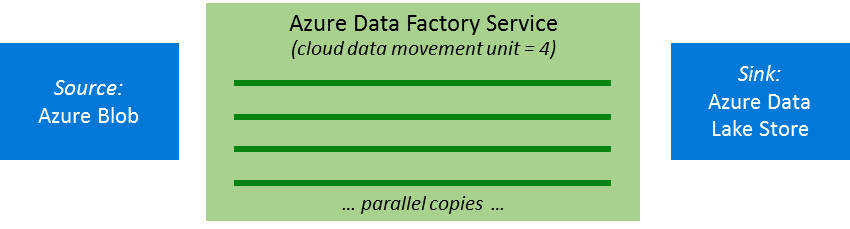

<properties
    pageTitle="Kopieren von Aktivität Leistung und Videogeräten Leitfaden | Microsoft Azure"
    description="Lernen Sie wichtige Faktoren, die Einfluss auf die Leistung von Verschieben von Daten in Azure Data Factory bei der Verwendung von Aktivität kopieren."
    services="data-factory"
    documentationCenter=""
    authors="linda33wj"
    manager="jhubbard"
    editor="monicar"/>

<tags
    ms.service="data-factory"
    ms.workload="data-services"
    ms.tgt_pltfrm="na"
    ms.devlang="na"
    ms.topic="article"
    ms.date="10/25/2016"
    ms.author="jingwang"/>

# Aktivität Leistung und Videogeräten Führungslinie kopieren
Azure Daten Factory kopieren Aktivität stellt eine herausragende sicheren, zuverlässigen und leistungsfähige Daten geladen Lösung. Sie können Sie Dutzende Kopie TB Daten täglich über eine Vielzahl von Cloud und lokalen Datenspeicher. Hohe machen Daten geladen Leistung ist Schlüssel, um sicherzustellen, dass Sie das Problem Core "big Data" konzentrieren können: Erstellung von Lösungen für erweiterte Analyse und erste Tiefe Einblicke aus all dieser Daten.

Azure bietet eine Reihe von unternehmensweite Daten Speicherung und Data Warehouse Lösungen, und kopieren Aktivität bietet eine hochgradig optimierten Daten geladen Benutzeroberfläche, die einfach zu konfigurieren und einrichten. Mit nur ein einzelnes Dokument Aktivität können Sie Folgendes erreichen:

- Beim Laden der Daten in **Azure SQL-Data Warehouse** bei **1,2 GBps**
- Laden von Daten in **Azure Blob-Speicher** in **1,0 GBps**
- Laden von Daten in **Azure dem Datenspeicher** beim **1.0 GBps**

In diesem Artikel werden:

- [Leistung Bezug Zahlen](#performance-reference) für unterstützte Datenquelle und Empfänger speichert zum Projekt planen.
- Features, die den Durchsatz kopieren in anderen Szenarien, einschließlich [parallele kopieren](#parallel-copy), [Cloud Daten Bewegung Einheiten](#cloud-data-movement-units)und [eingestufte kopieren](#staged-copy)verbessern können;
- [Leitfaden zur Feinabstimmung der Leistung](#performance-tuning-steps) zum Optimieren der Leistung und die wichtigsten Faktoren die Leistung beeinflussen können.

> [AZURE.NOTE] Wenn Sie im Allgemeinen nicht kopieren Aktivität vertraut sind finden Sie unter [Verschieben von Daten mithilfe von kopieren Aktivität](data-factory-data-movement-activities.md) , vor dem in diesem Artikel lesen.

## Bezug der Leistung

> [AZURE.NOTE] Erzielen Sie höheren Durchsatz durch die Nutzung von mehr Daten Bewegung Einheiten (DMUs) als das standardmäßige maximale DMUs, also 8 für eine Kopie der Cloud-Cloud-Aktivität ausführen. Beispielsweise können mit 100 DMUs, Sie Daten aus Azure Blob in Azure Lake Datenspeicher mit einer Geschwindigkeit von 1 GB pro Sekunde kopieren. Finden Sie im Abschnitt [Cloud Daten Bewegung Einheiten](#cloud-data-movement-units) Details dieses Feature aus. Wenden Sie sich an weitere DMUs anfordern [Azure unterstützen](https://azure.microsoft.com/support/) .

Punkte beachten:

- Durchsatz wird mithilfe der folgenden Formel berechnet: [Größe der Daten aus Quelle gelesenen] / [Kopieren Aktivität ausführen Dauer].
- Die Leistung Bezug Zahlen in der Tabelle wurden gemessen mit [TPC-H](http://www.tpc.org/tpch/) Datenmenge in ein einzelnes Dokument Aktivität ausführen.
- Wenn Sie zwischen Cloud Datenspeicher kopieren möchten, legen Sie **CloudDataMovementUnits** 1 und 4 (oder 8) für den Vergleich aus. **ParallelCopies** ist nicht angegeben. Finden Sie im Abschnitt [parallele Kopie](#parallel-copy) Details zu diesen Funktionen aus.
- In Azure Datenspeicher sind der Quelle und der Empfänger in der gleichen Azure Region ein.
- Für Hybrid (lokale Cloud oder auf lokale Cloud) Verschieben von Daten eine einzelne Instanz des Gateways auf einem Computer, die aus dem lokalen Datenspeicher separaten wurde ausgeführt wurde. Die Konfiguration wird in der folgenden Tabelle aufgeführt. Wenn Sie eine einzelne Aktivität auf Gateway ausgeführt wurde, verbraucht der Kopiervorgang nur einen kleinen Teil des Testcomputers CPU, Arbeitsspeicher oder Netzwerk-Bandbreite an.
    <table>
    <tr>
        <td>CPU</td>
        <td>32 Kerne 2.20 GHz Intel Xeon E5-2660 Version 2</td>
    </tr>
    <tr>
        <td>Arbeitsspeicher</td>
        <td>128 GB</td>
    </tr>
    <tr>
        <td>Netzwerk</td>
        <td>Internet-Benutzeroberfläche: 10 Gbps; Intranet-Benutzeroberfläche: 40 Gbps</td>
    </tr>
    </table>

## Parallele kopieren
Sie können Daten aus der Quelle gelesenen oder Schreiben von Daten in das Ziel **parallel innerhalb einer Kopie Aktivität ausführen**. Dieses Feature verbessert den Durchsatz Kopieren von und verringert die Zeit, die benötigt wird, um Daten zu verschieben.

Diese Einstellung unterscheidet sich von der **Parallelität** -Eigenschaft in der Aktivitätsdefinition. Die Eigenschaft **Parallelität** bestimmt die Anzahl der **gleichzeitigen kopieren Aktivität führt** zum Verarbeiten von Daten aus verschiedenen Aktivität Windows (1 Uhr zu 2 Uhr morgens 2, 3 Uhr, 3 Uhr mit 4 Uhr und usw.). Diese Funktion ist hilfreich, wenn Sie eine zurückliegende Last durchführen. Die Funktion parallele Kopie gilt für eine **einzelne Aktivität ausführen**.

Sehen wir uns ein Beispielszenario. Im folgenden Beispiel müssen mehrere Segmente aus der Vergangenheit verarbeitet werden sollen. Daten Factory führt eine Instanz kopieren Aktivität (einer Aktivität ausführen) für jedes Segment:

- Das Segment Daten aus dem ersten Aktivitätsfenster (1 morgens um 2 Uhr) == > Aktivität ausführen 1
- Das Segment Daten aus dem zweiten Aktivitätsfenster (2 Uhr zu 3 Uhr) == > Aktivität ausführen 2
- Das Segment Daten aus dem zweiten Aktivitätsfenster (3 zurück zu 4 Uhr) == > Aktivität ausführen 3

Und so weiter.

In diesem Beispiel wenn der Wert **Parallelität** auf 2 festgelegt ist kopieren **Aktivität 1** und **Aktivität ausgeführt 2** Daten aus zwei Aktivität Windows **gleichzeitig** für optimale Leistung mit Daten Bewegung. Jedoch, wenn mehrere Dateien mit 1 ausführen Aktivität verbunden sind, kopiert Bewegung Datendienst Dateien aus der Quelle in der Zieldatei eine nacheinander.

### parallelCopies
Sie können die Eigenschaft **ParallelCopies** verwenden, um die Parallelität anzugeben, die Sie kopieren Aktivität verwenden möchten. Sie können diese Eigenschaft als die maximale Anzahl von Threads innerhalb kopieren Aktivität vorstellen, die aus der Quelle zu lesen oder zu Ihrer Empfänger Datenspeicher parallel geschrieben werden können.

Für jede Kopie-Aktivität ausführen ermittelt Daten Factory, wie viele parallele Kopien zu verwenden, um Daten aus der Quelle zu kopieren, Daten zu speichern und zu den Zieldaten speichern. Die Standardanzahl von parallele Kopien, die verwendet wird, hängt von den Typ der Quelle und Empfänger, die Sie verwenden.  

Quelle und Empfänger |   Die Anzahl der Standardeinstellung parallele Kopie vom Dienst bestimmt
------------- | -------------------------------------------------
Kopieren von Daten zwischen den Datei-basierten Stores (BLOB-Speicher; Lake Datenspeicher; Amazon S3; einem lokalen Dateisystem; eine lokale HDFS) | Zwischen 1 und 32. Abhängig von der Größe der Dateien und die Anzahl der Cloud Daten Bewegung Einheiten (DMUs) verwendet, um das Kopieren von Daten zwischen zwei Cloud Datenspeicher oder die physische Konfiguration des Gateways Computers für eine Kopie Hybrid (zum Kopieren von Daten in den oder aus einer lokalen Datenspeicher) verwendet.
Kopieren Sie Daten aus **einer beliebigen Quelldaten zu Azure Table Storage gespeichert** | 4
Alle anderen Quelle und Empfänger Paare | 1

In der Regel, sollten Sie das Standardverhalten den besten Durchsatz verfügen. Allerdings speichert die Laden auf Computern steuern, die Ihre Daten zu hosten, oder zum Optimieren der Leistungsfähigkeit kopieren Sie können auch den Standardwert überschreiben, und geben Sie einen Wert für die Eigenschaft **ParallelCopies** . Der Wert muss zwischen 1 und 32 (beide einschließlich) sein. Zur Laufzeit verwendet kopieren Aktivität für die optimale Leistung, einen Wert, der kleiner oder gleich dem Wert, den Sie festgelegt ist.

    "activities":[  
        {
            "name": "Sample copy activity",
            "description": "",
            "type": "Copy",
            "inputs": [{ "name": "InputDataset" }],
            "outputs": [{ "name": "OutputDataset" }],
            "typeProperties": {
                "source": {
                    "type": "BlobSource",
                },
                "sink": {
                    "type": "AzureDataLakeStoreSink"
                },
                "parallelCopies": 8
            }
        }
    ]

Punkte beachten:

- Beim Kopieren von Daten zwischen den Datei-basierten Stores passiert Parallelism Ebene der Datei. Es gibt keine Aufteilen in Abschnitte in einer Datei. Die tatsächliche Anzahl der parallele Kopien Datendienst Bewegung für den Kopiervorgang zur Laufzeit verwendet, ist nicht mehr als die Anzahl der Dateien, die Sie installiert haben. Wenn das Verhalten beim Kopieren **MergeFile**ist, kann nicht kopieren Aktivität Parallelism nutzen.
- Wenn Sie einen Wert für die Eigenschaft **ParallelCopies** angeben, erwägen Sie das Laden Erhöhen der Quelle und Empfänger Datenspeicher und mit Gateway ist ein Hybrid kopieren. In diesem Fall besonders, wenn Sie haben mehrere Aktivitäten oder gleichzeitige Strecken von dieselben Aktivitäten, die im gleichen Datenspeicher ausgeführt werden. Wenn Sie feststellen, dass entweder die Datenspeicher oder Gateway mit dem Laden überlastet ist, verkleinern Sie den Wert **ParallelCopies** , um die Last entlasten.
- Wenn Sie Daten aus Stores, die nicht Datei-basierte Stores sind, die Datei basieren kopieren, ignoriert Bewegung Datendienst die **ParallelCopies** Eigenschaft aus. Auch wenn Parallelism angegeben ist, wird sie in diesem Fall nicht angewendet.

> [AZURE.NOTE] Sie müssen Datenverwaltungsgateway Version 1.11 oder höher verwenden, um die **ParallelCopies** -Funktion verwenden, wenn Sie eine Kopie der Hybrid ausführen.

### Cloud Daten Bewegung Einheiten
Eine **Cloud Bewegung Dateneinheit (DMU)** ist ein Measure, das die Potenz (eine Kombination aus CPU, Arbeitsspeicher und Zuweisung von Ressourcen) einer einzelnen Dateneinheit in Daten Factory darstellt. Ein DMU möglicherweise in einen Cloud-Cloud-Kopiervorgang, aber nicht in einer Hybrid kopieren verwendet werden.

Standardmäßig verwendet Daten Factory eine einzelne Cloud DMU zum Ausführen einer einzelnen Kopie Aktivität ausführen. Um diese Standardeinstellung zu überschreiben, geben Sie einen Wert für die Eigenschaft **CloudDataMovementUnits** wie folgt. Weitere Informationen zu der Ebene der Leistung erzielt werden könnte, wenn Sie weitere Einheiten für eine bestimmte kopieren-Quelle und Empfänger konfigurieren finden Sie unter den [Bezug der Leistung](#performance-reference).

    "activities":[  
        {
            "name": "Sample copy activity",
            "description": "",
            "type": "Copy",
            "inputs": [{ "name": "InputDataset" }],
            "outputs": [{ "name": "OutputDataset" }],
            "typeProperties": {
                "source": {
                    "type": "BlobSource",
                },
                "sink": {
                    "type": "AzureDataLakeStoreSink"
                },
                "cloudDataMovementUnits": 4
            }
        }
    ]

Der **zulässige Werte** für die Eigenschaft **CloudDataMovementUnits** sind (Standard)-1, 2, 4 und 8. Die **tatsächliche Anzahl der Cloud DMUs** zur Laufzeit mit der Kopiervorgang ist gleich oder kleiner als der konfigurierte Wert, abhängig von Ihrer Datenmuster. 

> [AZURE.NOTE] Wenn Sie weitere Cloud DMUs für einen höheren Durchsatz benötigen, wenden Sie sich an [Azure unterstützen](https://azure.microsoft.com/support/). Festlegen von 8 und über aktuell funktioniert nur, wenn Sie mehrere Dateien aus dem Blob-Speicher in Blob-Speicher Lake Datenspeicher oder SQL Azure-Datenbank, kopieren und die Dateigröße größer als oder gleich 16 MB einzeln ist.

Diese beiden Eigenschaften besser zu verwenden, und Ihre Daten Bewegung Verbesserung, finden Sie in der [Stichprobe Fällen verwenden](#case-study-use-parallel-copy). Sie benötigen keine **ParallelCopies** , um das Standardverhalten nutzen zu konfigurieren. Wenn Sie konfigurieren und **ParallelCopies** zu klein ist, wird möglicherweise mehrere Cloud DMUs nicht vollständig genutzt werden.  

Es **Wichtig** , denken Sie daran, dass Sie keine entrichten müssen basierend auf die Gesamtzeit des Kopiervorgangs. Wenn eine Kopie verwendet, um zu einer Stunde mit einer Cloud Einheit dauern und jetzt es 15 Minuten mit vier Cloud Einheiten dauert, bleibt die generelle Rechnung fast gleich aus. Angenommen, verwenden Sie die vier Cloud Einheiten. Die erste Cloud Einheit aufwenden 10 Minuten, das zweite zu 10 Minuten, das dritte meldet, 5 Minuten, und das vierte Schema, 5 Minuten alle in einer Kopie Aktivität ausführen. Sie unterliegen für die Uhrzeit total kopieren (Verschieben von Daten), also 10 + 10 + 5 + 5 = 30 Minuten. Verwenden von **ParallelCopies** wirkt sich nicht auf Abrechnung.

## Gestaffelter kopieren
Sie können beim Kopieren von Daten aus einem Datenspeicher Quelle zu einem Empfänger Datenspeicher Blob-Speicher als zwischenzeitlichen staging Speicher verwenden. Staging eignet sich insbesondere in folgenden Fällen:

1.  **Daten aus verschiedenen Datenspeicher in SQL Data Warehouse über PolyBase Aufnahme werden soll**. SQL Data Warehouse verwendet PolyBase als ein hohem Durchsatz Verfahren, um eine große Datenmenge in SQL Data Warehouse zu laden. Jedoch müssen die Quelldaten in Blob-Speicher, und sie müssen zusätzliche Kriterien erfüllt. Wenn Sie Daten aus einem Datenspeicher als Blob-Speicher laden, können Sie Daten über zwischenzeitlichen staging Blob-Speicher kopieren aktivieren. In diesem Fall führt Daten Factory die benötigten Datentransformationen, um sicherzustellen, dass sie die PolyBase erfüllt. Dann wird zum Laden von Daten in SQL Data Warehouse PolyBase verwendet. Weitere Informationen hierzu finden Sie unter [PolyBase verwenden, um Daten in Azure SQL-Data Warehouse zu laden](data-factory-azure-sql-data-warehouse-connector.md#use-polybase-to-load-data-into-azure-sql-data-warehouse).
2.  **Manchmal dauert es eine Weile zum Verschieben von Daten einer Hybrid ausführen (d. h., um zwischen einer lokalen Daten kopieren speichern und einem Cloud-speichern) über eine langsame Verbindung**. Um die Leistung zu verbessern, können Sie die Daten lokal komprimieren, sodass weniger Zeit zum Verschieben von Daten mit dem staging Datenspeicher in der Cloud dauert. Dann kann die Daten im Speicher staging entpacken, bevor Sie es in die Ziel-Datenspeicher laden.
3.  **Sie möchten nicht Ports als Port 80 und Port 443 in Ihrer Firewall, da Unternehmensrichtlinien zu öffnen**. Beim Kopieren von Daten aus einem lokalen Datenspeicher in einem Empfänger Azure SQL-Datenbank oder der einer Azure SQL-Data Warehouse Empfänger müssen Sie beispielsweise ausgehende TCP-Kommunikation auf Port 1433 für die Windows-Firewall und Firewall Ihres Unternehmens vergleichbar aktivieren. In diesem Szenario Nutzen des Gateways für das erste von Daten in eine BLOB-Speicher staging-Instanz über HTTP oder HTTPS Port 443. Klicken Sie dann laden Sie die Daten in der SQL-Datenbank oder SQL Data Warehouse von BLOB-Speicher Staging. In diesem Fluss brauchen Sie Port 1433 aktivieren.

### Wie bereitgestellte kopieren funktioniert
Wenn Sie das staging Feature aktivieren, zuerst die Daten kopiert aus der Quelle Datenspeicher mit dem staging Datenspeicher (bringen eigene). Als Nächstes werden die Daten in den Datenspeicher Empfänger aus dem staging Datenspeicher kopiert. Daten Factory verwaltet werden automatisch für Sie zwei Phasen illustrieren. Daten Factory bereinigt temporäre Daten aus dem staging Speicher auch aus, nach Abschluss der Verlagerung von Daten.

In der Cloud kopieren Szenario (sowohl Quell-als auch Empfänger Daten, die in der Cloud Stores befinden), wird die Gateway nicht verwendet. Der Daten Factory-Dienst führt die Kopiervorgänge.

Im Hybrid kopieren-Szenario (Quelle lokalen und Empfänger befindet sich in der Cloud), das Gateway zu einem staging Datenspeicher Daten aus der Quelle Datenspeicher verschoben. Factory Datendienst verschiebt Daten aus dem staging Datenspeicher im Datenspeicher Empfänger ein. Kopieren von Daten aus einem Datenspeicher Cloud in einen lokalen Datenspeicher über Staging wird mit dem umgekehrter Flow ebenfalls unterstützt.

Wenn Sie das Verschieben von Daten mithilfe einer staging speichern aktivieren, können Sie angeben, ob die Daten vor dem Verschieben von Daten aus der Quelle Datenspeicher in einen zwischenzeitlichen oder staging Datenspeicher komprimiert und dann vor dem Verschieben von Daten aus einer Zwischenzeit oder das staging von Datenspeicher an den Empfänger Datenspeicher dekomprimiert werden sollen.

Derzeit nicht Daten zwischen zwei lokalen Datenspeicher mithilfe einer staging Store kopiert werden. Wir erwarten, dass diese Option, um in Kürze verfügbar sein.

### Konfiguration
Konfigurieren Sie die Einstellung **EnableStaging** in Aktivität kopieren, um anzugeben, ob die Daten im BLOB-Speicher bereitgestellt werden soll, bevor Sie es in einem Datenspeicher Ziel laden sollen. Wenn Sie **EnableStaging** auf TRUE festlegen, geben Sie die zusätzlichen Eigenschaften, die in der folgenden Tabelle aufgelistet. Wenn Sie eine besitzen, müssen Sie auch zum Erstellen einer Azure-Speicher oder Speicher freigegeben Signatur verknüpft-Dienst für das Staging.

Eigenschaft | Beschreibung | Standardwert | Erforderlich
--------- | ----------- | ------------ | --------
**enableStaging** | Geben Sie an, ob Sie über eine Zwischenzeit staging Store Daten kopieren möchten. | Falsch | Nein
**linkedServiceName** | Geben Sie den Namen eines [AzureStorage](data-factory-azure-blob-connector.md#azure-storage-linked-service) oder [AzureStorageSas](data-factory-azure-blob-connector.md#azure-storage-sas-linked-service) verknüpfte-Dienst, der die Instanz des Speicher verweist, die Sie als zwischenzeitlichen staging Speicher verwenden.    Sie können keine Speicher mit einer freigegebenen Access-Signatur verwenden, um Daten in SQL Data Warehouse über PolyBase zu laden. Sie können es in allen anderen Szenarien verwenden. | N/V | Ja, wenn **EnableStaging** auf TRUE festgelegt wurde
**Pfad** | Geben Sie den Pfad der Blob-Speicher, den die bereitgestellten Daten aufnehmen soll. Wenn Sie einen Pfad nicht angeben, erstellt der Dienst ein Containers temporären Daten.    Geben Sie einen Pfad nur, wenn Sie Speicher mit einer freigegebenen Access-Signatur verwenden, oder wenn Sie temporäre Daten benötigen zu einem bestimmten Speicherort befinden. | N/V | Nein
**enableCompression** | Gibt an, ob die Daten komprimiert werden soll, bevor sie an das Ziel kopiert werden. Mit dieser Einstellung wird die Lautstärke der übertragenen Daten verringert. | Falsch | Nein

Hier ist eine Beispieldefinition kopieren Tätigkeit mit den Eigenschaften, die in der obigen Tabelle beschrieben sind:

    "activities":[  
    {
        "name": "Sample copy activity",
        "type": "Copy",
        "inputs": [{ "name": "OnpremisesSQLServerInput" }],
        "outputs": [{ "name": "AzureSQLDBOutput" }],
        "typeProperties": {
            "source": {
                "type": "SqlSource",
            },
            "sink": {
                "type": "SqlSink"
            },
            "enableStaging": true,
            "stagingSettings": {
                "linkedServiceName": "MyStagingBlob",
                "path": "stagingcontainer/path",
                "enableCompression": true
            }
        }
    }
    ]

### Abrechnung Einfluss
Sie unterliegen basierend auf zwei Schritte: Dauer kopieren und Typ kopieren. 

- Bei der Verwendung von staging während einer Cloud-kopieren (Kopieren von Daten aus einem Datenspeicher Cloud in einem anderen Cloud Datenspeicher), Sie [Summe kopieren Dauer für die Schritte 1 und 2] x [Cloud kopieren Einzelpreis] unterliegen.
- Bei der Verwendung von staging beim Hybrid kopieren (Kopieren von Daten aus einem lokalen Datenspeicher in einen Cloud-Datenspeicher), Sie unterliegen für [Hybrid kopieren Duration] x [Hybrid kopieren Einzelpreis] + [cloud kopieren Dauer] x [Cloud kopieren Einzelpreis].

## Leistung Videogeräten Schritte
Es wird empfohlen, dass Sie zum Optimieren der Leistung von Ihrem Dienst Daten Factory mit Kopieren Aktivität wie folgt vorgehen:

1.  **Einrichten eines Basisplans**. Testen Sie während der Entwicklungsphase der Verkaufspipeline anhand einer Stichprobe Vertreter Daten mithilfe von kopieren Aktivität. [Modell segmentieren](data-factory-scheduling-and-execution.md#time-series-datasets-and-data-slices) Factory Daten können Sie die Menge der Daten zu beschränken, mit denen Sie arbeiten.

    Erfassen von Ausführung dauert und Leistungsmerkmale mithilfe der **Überwachung und Verwaltung App**. Wählen Sie auf der Startseite Daten Factory **Überwachen und verwalten** aus. Wählen Sie in der Strukturansicht **Ausgabe Dataset**aus. Wählen Sie in der Liste **Aktivität Windows** die Kopie Aktivität ausführen. **Aktivitäten in Windows** -Listen die Dauer der Aktivität kopieren und die Größe der Daten, die kopiert werden. Der Durchsatz wird im **Windows-Explorer Aktivität**aufgeführt. Weitere Informationen über die app finden Sie unter [Überwachen und Verwalten von Azure Data Factory Pipelines mithilfe der Überwachung und Verwaltung App](data-factory-monitor-manage-app.md).

    

    Später in diesem Artikel können Sie die Leistung und Konfiguration von Ihrem Szenario zu kopieren der Aktivität [Leistung Verweis](#performance-reference) aus unserer Tests vergleichen.
2. **Konfigurationsprobleme und Optimieren der Leistung**. Wenn die Leistung, die Sie beobachten treffen, müssen Sie Leistungsengpässe zu identifizieren. Klicken Sie dann die optimieren Sie Leistung zum Entfernen oder Reduzieren des Effekts der Engpässe. Eine umfassende Beschreibung der Leistung Diagnose ist nicht Gegenstand dieses Artikels, aber hier sind einige allgemeinen zu beachten:
    - Leistungsmerkmale:
        - [Parallele kopieren](#parallel-copy)
        - [Cloud Daten Bewegung Einheiten](#cloud-data-movement-units)
        - [Gestaffelter kopieren](#staged-copy)   
    - [Datenquelle](#considerations-for-the-source)
    - [Empfänger](#considerations-for-the-sink)
    - [Serialisierung und Deserialisierung](#considerations-for-serialization-and-deserialization)
    - [Komprimierung](#considerations-for-compression)
    - [Spalte Zuordnung](#considerations-for-column-mapping)
    - [Datenverwaltungsgateway](#considerations-for-data-management-gateway)
    - [Weitere Überlegungen](#other-considerations)

3. **Erweitern Sie die Konfiguration auf Ihre gesamte Datenmenge**. Wenn Sie die Ergebnisse der Ausführung und Leistung zufrieden sind, können Sie die Definition und Verkaufspipeline aktiven Zeitraums zu bedecken Ihre gesamte Datenmenge erweitern.

## Überlegungen für die Quelle
### Allgemeine
Achten Sie darauf, dass der zugrunde liegenden Datenspeicher nicht durch aufgrund der Ergebnisse überlastet wird, die auf oder davor ausgeführt werden. 

Microsoft-Datenspeicher finden Sie unter [Überwachen und Optimieren von Themen](#performance-reference) , die speziell für Datenspeicher und helfen Ihnen, die Sie kennen, Daten speichern Leistungsmerkmale, Reaktionszeiten minimieren und Maximieren des Durchsatzes sind.

Wenn Sie Daten aus dem Blob-Speicher in SQL Data Warehouse kopieren, sollten Sie **PolyBase** verwenden, um die Leistung zu verbessern. Details finden Sie unter [PolyBase verwenden, um Daten in Azure SQL-Data Warehouse zu laden](data-factory-azure-sql-data-warehouse-connector.md###use-polybase-to-load-data-into-azure-sql-data-warehouse) .

### Datei-basierten Datenspeicher
*(Beinhaltet BLOB-Speicher, Sees Datenspeicher, Amazon S3, lokalen Datei Betriebssysteme und lokale HDFS)*

- **Durchschnittliche Dateigröße und die Anzahl der Dateien**: Kopieren Aktivität wird eine Datendatei nacheinander übertragen. Mit der gleichen Datenmenge verschoben werden soll ist der Gesamtdurchsatz kürzer ist, wenn die Daten ein paar großer Dateien aufgrund der bootstrap Phase für jede Datei, anstatt viele kleine Dateien besteht aus. Daher kombinieren Sie kleine Dateien in größere Dateien, um den Datendurchsatz zu erhalten, falls möglich.
- **Dateiformat und Komprimierung**: Weitere Möglichkeiten zur Verbesserung der Systemleistung, finden Sie unter den Abschnitten [für Serialisierung und Deserialisierung Aspekte](#considerations-for-serialization-and-deserialization) und [Hinweise für Komprimierung](#considerations-for-compression) .
- Dem **lokalen Dateisystem** Szenario, in dem **Datenverwaltungsgateway** erforderlich ist, finden Sie unter Abschnitt [Aspekte für Datenverwaltungsgateway](#considerations-for-data-management-gateway) .

### Relationale Datenspeicher
*(Einschließlich der SQL-Datenbank; SQL Datawarehouse; Amazon Redshift; SQL Server-Datenbanken und Oracle, MySQL, DB2, Teradata, Sybase und PostgreSQL-Datenbanken, usw.)*

- **Datenmuster**: Ihre Tabellenschema wirkt sich auf Durchsatz kopieren. Große Zeilen bietet Ihnen eine bessere Leistung als kleine Zeilenlänge, um die gleichen Datenmenge zu kopieren. Dies liegt daran, dass die Datenbank effizienter weniger Stapeln von Daten abrufen, die weniger Zeilen enthalten.
- **Abfrage oder gespeicherte Prozedur**: optimieren die Logik der Abfrage oder gespeicherte Prozedur, die Sie in der Quelle kopieren Aktivität zum Abrufen von Daten effizienter angeben.
- Für **lokal relationale Datenbanken**, wie etwa SQL Server und Oracle, die erfordern die Verwendung von **Datenverwaltungsgateway**, finden Sie im Abschnitt [für Datenverwaltungsgateway Aspekte](#considerations-on-data-management-gateway) .

## Aspekte, die für den Empfänger

### Allgemeine
Achten Sie darauf, dass der zugrunde liegenden Datenspeicher nicht durch aufgrund der Ergebnisse überlastet wird, die auf oder davor ausgeführt werden. 

Microsoft-Datenspeicher finden Sie unter [Überwachen und Optimieren von Themen](#performance-reference) , die für Datenspeicher spezifisch sind. Diese Themen helfen Ihnen die Grundlagen Daten Store Leistungsmerkmale und so Reaktionszeiten minimieren und Maximieren des Durchsatzes.

Wenn Sie Daten aus dem **Blob-Speicher** auf **SQL Data Warehouse**kopieren möchten, sollten Sie **PolyBase** verwenden, um die Leistung zu verbessern. Details finden Sie unter [PolyBase verwenden, um Daten in Azure SQL-Data Warehouse zu laden](data-factory-azure-sql-data-warehouse-connector.md###use-polybase-to-load-data-into-azure-sql-data-warehouse) .

### Datei-basierten Datenspeicher
*(Beinhaltet BLOB-Speicher, Sees Datenspeicher, Amazon S3, lokalen Datei Betriebssysteme und lokale HDFS)*

- **Verhalten beim Kopieren**: Wenn Sie Daten aus einer anderen Datei-basierten Datenspeicher kopieren, weist kopieren Aktivität drei Optionen über die Eigenschaft **CopyBehavior** . Es behält Hierarchie, fasst Hierarchie oder führt Dateien zusammen. Entweder beibehalten oder Reduzieren der Hierarchie weist wenig oder gar Leistung Verwaltungsaufwand, aber beim Zusammenführen von Dateien bewirkt, dass Leistung Verwaltungsaufwand zu vergrößern.
- **Dateiformat und Komprimierung**: finden Sie in den Abschnitten [Aspekte für Serialisierung und Deserialisierung](#considerations-for-serialization-and-deserialization) und [Hinweise für Komprimierung](#considerations-for-compression) weitere Möglichkeiten zur Verbesserung der Systemleistung.
- **BLOB-Speicher**: derzeit BLOB-Speicher unterstützt nur Blobs für optimierte Datenübertragung und Durchsatz blockieren.
- **Lokale Datei Systeme** Szenarien, die die Verwendung von **Datenverwaltungsgateway**erforderlich ist, finden Sie unter Abschnitt [Aspekte für Datenverwaltungsgateway](#considerations-for-data-management-gateway) .

### Relationale Datenspeicher
*(Einschließlich der SQL-Datenbank, SQL Data Warehouse, SQL Server-Datenbanken und Oracle-Datenbanken)*

- **Kopieren Sie Verhalten**: je nach den Eigenschaften, die Sie für **SqlSink**festgelegt haben, schreibt kopieren Aktivität Daten in die Zieldatenbank auf verschiedene Arten.
    - Standardmäßig fügt der Daten Bewegung Dienst verwendet die Massen kopieren-API zum Einfügen von Daten in Modus, der die optimale Leistung.
    - Wenn Sie eine gespeicherte Prozedur in den Empfänger konfigurieren, gilt die Datenbank die Daten zeilenweise nacheinander statt als einen Massenimport. Leistung legt erheblich ab. Ist der Datenmenge groß, sofern zutreffend, erwägen Sie den Wechsel zu mithilfe der Eigenschaft **SqlWriterCleanupScript** .
    - Wenn Sie die Eigenschaft **SqlWriterCleanupScript** für jede Kopie Aktivität ausführen konfigurieren, der Dienst löst das Skript, und verwenden Sie Sie dann die Massen kopieren-API zum Einfügen der Daten. Um die gesamte Tabelle mit den neuesten Daten zu überschreiben, können Sie beispielsweise ein Skript zum zuerst alle Datensätze löschen, bevor Sie die neuen Daten aus der Quelle Massen-laden angeben.
- **Daten Muster und Stapel Größe**:
    - Ihre Tabellenschema wirkt sich auf Durchsatz kopieren. Wenn die gleiche Datenmenge kopieren möchten, bietet große Zeilen Ihnen eine bessere Leistung als kleine Zeilen mit einer Größe, da die Datenbank weniger Stapeln von Daten effizienter Commit ausführen kann.
    - Kopieren Aktivität fügt die Daten in einer Reihe von Blattnamen ein. Sie können die Anzahl der Zeilen in einem Stapel mithilfe der Eigenschaft **WriteBatchSize** festlegen. Wenn Ihre Daten kleine Zeilen vorhanden sind, können Sie die Eigenschaft **WriteBatchSize** mit einem höheren Wert von unteren Stapel Verwaltungsaufwand und höheren Durchsatz profitieren festlegen. Wenn die Zeile Ihrer Daten groß ist, achten Sie darauf, wenn Sie **WriteBatchSize**vergrößern. Ein hoher Wert kann eines Fehlers Kopieren durch die Datenbank überladen aufgrund einer verursachen.
- **Lokale relationale Datenbanken** wie SQL Server und Oracle, die die Verwendung von **Datenverwaltungsgateway**erforderlich ist, finden Sie unter Abschnitt [Aspekte für Datenverwaltungsgateway](#considerations-for-data-management-gateway) .

### NoSQL stores
*(Einschließlich Tabellenspeicher und Azure DocumentDB)*

- Für **Table Storage**:
    - **Partition**: Schreiben von Daten auf überlappende erheblich beeinträchtigt die Leistung. Sortieren Sie die Quelldaten Partitionsschlüssel, damit die Daten in eine Partition nach der anderen effizient eingefügt werden, oder passen Sie die Logik zum Schreiben von Daten in einer einzelnen Partition.
- Für **DocumentDB**:
    - **Stapelgröße**: die Eigenschaft **WriteBatchSize** legt die Anzahl der parallele Anfragen zum Dienst DocumentDB zum Erstellen von Dokumenten. Sie können eine bessere Leistung erwarten, wenn Sie **WriteBatchSize** erhöhen, weil mehr parallelen Anfragen an DocumentDB gesendet werden. Sehen Sie sich jedoch beim Schreiben auf DocumentDB begrenzungsebene (die Fehlermeldung "Anfordern Zins umfangreich ist" ist). Verschiedene Faktoren können Einschränkung, einschließlich Dokumentgröße, die Anzahl der Ausdrücke in Dokumente und die Ziel-Websitesammlung Indizierung Richtlinie verursachen. Um höhere kopieren Durchsatz zu erreichen, bietet eine bessere Auflistung, z. B. S3.

## Aspekte für Serialisierung und Deserialisierung
Serialisierung und Deserialisierung können auftreten, wenn Ihr einer Datengruppe zurück oder der Datenmenge Ausgabe einer Datei ist. Kopieren von Aktivitäten unterstützt derzeit Avro und Text (z. B. csv- und TSV) von Datenformaten.

**Kopieren Sie Verhalten**:

-   Kopieren von Dateien zwischen Datei-basierten Datenspeicher:
    - Wenn Eingabe- und Datasets beide haben, die gleiche oder keine Format datendateieinstellungen, Bewegung Datendienst führt eine binäre Kopie ohne Serialisierung oder Deserialisierung aus. Sie finden Sie unter einen höheren Durchsatz im Vergleich zu dem Szenario, in dem die Quelle und Empfänger Datei Format Einstellungen voneinander unterscheiden.
    - Wenn Eingabemethoden und Ausgabe Datasets beide werden im Textformat und nur die Codierung Typ unterscheidet, Bewegung Datendienst unterstützt nur eine Konvertierung der Codierung. Es wird nicht eine Serialisierung führen und Deserialisierung, wodurch einige binäre Kopie Aufwand als der Leistung.
    - Wenn die Eingabe- und Datasets beide haben, verschiedenen Dateiformaten oder anderen Konfigurationen, wie Trennzeichen, Bewegung Datendienst deserialisiert Quelldaten zum übertragen, Transformieren und Serialisieren es dann in das Ausgabeformat aus, die, das Sie angegeben haben. Dieser Vorgang führt Aufwand als anderen Szenarien Performance viel mehr stark.
- Beim Kopieren von Dateien zu/aus einem Datenspeicher, die nicht Datei-basierte (beispielsweise von einem Datei-basierten Speicher zu einem relationalen Speicher) ist, ist der Serialisierung oder Deserialisierung Schritt erforderlich. Dieser Schritt führt erheblichen.

**Dateiformat**: das Dateiformat, das Sie auswählen, kann die Kopie Leistung beeinträchtigen. Avro beträgt beispielsweise einem kompakten Binärformat, die Metadaten mit Daten speichert. Es wird eine Breite Unterstützung in der Hadoop-Netz für die Verarbeitung und Abfragen angezeigt. Es ist jedoch Avro für Serialisierung und Deserialisierung, in der unteren kopieren Durchsatz im Vergleich zu Textformat wodurch teurer. Treffen Sie eine Auswahl des Dateiformats in der gesamten Verarbeitung illustrieren ganzheitlich. Beginnen mit was die Daten bilden wird in Datenspeicher Quelle oder aus externen Systemen extrahiert werden gespeichert ist. das beste Format für Speicher, analytical Verarbeitung und Abfragen; und in welchem Format die Daten in Datamarts für berichterstellungs-und Visualisierung exportiert werden soll. Ein Dateiformat, das nicht für optimalen ist manchmal lesen und Schreiben Leistung möglicherweise eine gute Wahl, wenn Sie den Prozess insgesamt analytical berücksichtigen.

## Überlegungen für Komprimierung
Wenn der Datenmenge Eingabe- oder einer Datei ist, können Sie kopieren Aktivität zum Ausführen von Komprimierung oder ursprünglich schreiben Daten in das Ziel festlegen. Wenn Sie Komprimierung auswählen, Sie Kompromiss zwischen ein-/Ausgabe (e/a) und CPU. Komprimieren die Datenübertragungskosten zusätzliche in Ressourcen berechnen. Aber im Gegenzug Netzwerk e/a und Speicher verringert. Je nach den Daten sehen Sie möglicherweise eine Steigerung in Gesamtdurchsatz kopieren.

**Codec**: Kopieren Aktivität Gzip, bzip2 und Deflate Komprimierung Datentypen unterstützt. Azure HDInsight kann alle drei Typen für die Verarbeitung nutzen. Jeder Komprimierungscodec hat Vorteile. Beispielsweise bzip2 hat den niedrigsten kopieren Durchsatz, aber Sie die optimale Leistung der Struktur Abfrage mit bzip2 abgerufen werden, da Sie es für die Verarbeitung von Teilen können. GZIP ist die Option optimal angeglichene und besonders häufig verwendet wird. Wählen Sie aus der Codec, der Ihre End-to-End-Szenario am besten passt.

**Ebene**: für jede Komprimierungscodec zwei Optionen stehen zur Verfügung: am schnellsten komprimierte und optimal komprimierte. Die am schnellsten komprimierte Option komprimiert die Daten so schnell wie möglich, selbst wenn die resultierende Datei nicht optimal komprimiert ist. Die Option optimal komprimierte benötigt mehr Zeit auf Komprimierung und eine minimale Datenmenge ergibt. Testen Sie beide Optionen, um zu sehen, die bessere Leistung insgesamt in Ihrem Fall bereitstellt.

**A Aspekte**: um eine große Datenmenge zwischen einer lokalen Store und in der Cloud zu kopieren, sollten Sie zwischenzeitlichen Blob-Speicher mit Komprimierung. Es wird empfohlen, zwischenzeitlichen Speicher verwenden, wenn die Bandbreite von Ihr Unternehmensnetzwerk und Ihre Azure-Dienste die Beschränkung ist und Eingabewerte Datenmenge und Ausgabe Datenmenge beide Formular nicht komprimiert werden soll. Genauer gesagt, können Sie ein einzelnes Dokument von Aktivitäten in zwei kopieren Aktivitäten aufteilen. Die erste Aktivität kopieren, aus der Quelle zu einem zwischenzeitlichen oder staging Blob in komprimierter Form kopiert. Die zweite Kopie Aktivität komprimierten Daten von Staging kopiert und dann dekomprimiert, während sie auf den Empfänger schreibt.

## Überlegungen für die Spalte Zuordnung
Sie können die Eigenschaft **ColumnMappings** in kopieren Aktivität Karte alle oder eine Teilmenge der Eingabewerte Spalten, um die Ausgabespalten festlegen. Nachdem die Daten aus der Quelle der Bewegung Datendienst gelesen wurde, muss diese Spalte Zuordnung auf der Registerkarte Daten ausführen, bevor sie die Daten an den Empfänger schreibt. Diese zusätzlichen Verarbeitung wird kopieren Durchsatz verringert.

Wenn die Quelldaten speichern können abgefragt werden, beispielsweise wenn er einen relationalen Speicher wie SQL-Datenbank oder SQL Server, oder ist eine NoSQL-Speichers wie Tabellenspeicher oder DocumentDB, berücksichtigen, drücken die Spalte filtern und Neuanordnen von Logik auf die **Abfrage** Eigenschaft anstelle von Spalte Zuordnung. Auf diese Weise erfolgt die Projektion während der Bewegung Datendienst Daten aus der Quelle Datenspeicher liest, wo es viel effizienter ist.

## Aspekte für Datenverwaltungsgateway
Empfehlungen für Gateway-Setup finden Sie unter [Aspekte der Verwendung von Datenverwaltungsgateway](data-factory-move-data-between-onprem-and-cloud.md#Considerations-for-using-Data-Management-Gateway).

**Computer-Gateway-Umgebung**: Es wird empfohlen, einen dedizierten Computer mit Host Datenverwaltungsgateway zu verwenden. Verwenden von Tools wie PerfMon CPU, Arbeitsspeicher und Bandbreite verwenden während ein Kopiervorgang auf Ihrem Computer Gateway untersuchen. Wechseln Sie zu einer leistungsfähigeren Computer, wenn CPU, Arbeitsspeicher oder Netzwerk-Bandbreite handelt.

**Gleichzeitige Kopieren Aktivitäten ausgeführt wird**: eine Instanz des Datenverwaltungsgateways kann mehrere kopieren Aktivität führt zur gleichen Zeit oder gleichzeitig dienen. Die maximale Anzahl von gleichzeitigen Aufträgen wird basierend auf dem Gatewaycomputer Hardwarekonfiguration berechnet. Zusätzliche Kopieraufträge werden in der Warteschlange bis sie von einem Gateway oder bis das Timeout eine andere Position erreicht nach oben entnommen werden. Um Ressourcenkonflikte auf dem Gatewaycomputer zu vermeiden, können Sie Phaseneigenschaften Terminplan kopieren Aktivitäten, die Anzahl der Kopieraufträge in der Warteschlange nacheinander zu verringern, oder Teilen Sie die Last auf mehreren Computern der Gateways.

## Weitere Überlegungen
Wenn die Daten, die zu kopierenden groß ist, können Sie die Daten mithilfe das Slices aufteilendes Verfahren in Data Factory Ihre Geschäftslogik zu weiteren Partition anpassen. Klicken Sie dann planen Sie kopieren Aktivität zu häufiger ausgeführt wird, klicken Sie zum Verringern der Größe der Daten für jede Kopie Aktivität ausführen.

Seien Sie über die Anzahl der Datensätze und Kopieren von Aktivitäten zur gleichen Zeit Daten Factory Verbinder, um die gleichen Datenspeicher Anmeldung. Viele parallele Kopieraufträge möglicherweise schränken Sie einen Datenspeicher und beeinträchtigt die Leistung, kopieren Auftrag internen Wiederholungsversuche, und in einigen Fällen Ausführungsfehlern führen.

## Beispielszenario: Kopieren aus einer lokalen SQL Server in Blob-Speicher
**Szenario**: eine Verkaufspipeline wird erstellt, um Daten aus einer lokalen SQL Server in BLOB-Speicher im CSV-Format zu kopieren. Um den Auftrag zum Kopieren schneller zu machen, sollte die CSV-Dateien in bzip2 Format komprimiert werden.

**Test und Analyse**: der Durchsatz kopieren Aktivität kleiner als 2/s, einer Zahlenmenge ist langsamer ist als der Leistung Maßstab.

**Leistungsanalyse und optimieren**: um die Leistungsproblem zu beheben, sehen wir uns wie die Daten verarbeitet und verschoben werden.

1.  **Lesen von Daten**: Gateway öffnet eine Verbindung mit SQL Server und sendet die Abfrage. SQL Server reagiert durch Senden von Datenstreams mit Gateway über das Intranet.
2.  **Serialize und Komprimieren von Daten**: Gateway serialisiert Streams Daten in CSV-Format, und die Daten in einen Stream bzip2 komprimiert.
3.  **Schreiben von Daten**: Gateway uploads bzip2 Streams zu BLOB-Speicher über das Internet.

Wie Sie sehen können, wird die Daten verarbeitet und streaming sequenziell verschoben: SQL Server > LAN > Gateway > WAN > BLOB-Speicher. **Die allgemeine Leistung durch den minimalen Durchsatz über die Verkaufspipeline gated ist**.

Ein oder mehrere der folgenden Faktoren können den Leistungsengpass führen:

-   **Datenquelle**: SQLServer selbst weist geringer Durchsatz aufgrund hoher Auslastung.
-   **Datenverwaltungsgateway**:
    -   **LAN**: Gateway alles andere als Computers mit SQL Server gespeichert ist, und hat eine Verbindung mit niedriger Bandbreite.
    -   **Gateway**: Gateway erreicht hat ihre Grenzen laden, um die folgenden Vorgänge ausführen:
        -   **Serialisierung**: Serialisieren des Streams Daten in CSV-Format langsam Durchsatz hat.
        -   **Komprimierung**: Sie haben einen Komprimierungscodec langsam (z. B. bzip2, also 2,8/s mit Core i7).
    -   **WAN**: die Bandbreite zwischen dem Firmennetzwerk und Ihrer Azure Dienste ist auf Niedrig (z. B. T1 = 1,544/s; T2 = 6,312/s).
-   **Ignorieren**: Blob-Speicher weist geringer Durchsatz. (Dieses Szenario ist wahrscheinlich nicht, da deren Vereinbarung zum SERVICELEVEL mindestens 60 MB / garantiert.)

In diesem Fall möglicherweise bzip2 Daten Komprimierung unten im gesamten Verkaufspipeline verlangsamt werden. Wechsel zu einem Gzip Komprimierungscodec möglicherweise dieser Engpass zu erleichtern.

## Beispielszenarien: Verwenden Sie parallele kopieren  

**Szenario I:** Kopieren Sie 1.000 1-MB-Dateien aus dem lokalen Dateisystem in Blob-Speicher.

**Analyse und Leistung zu optimieren**: ein Beispiel, wenn Sie Gateway, klicken Sie auf einem Computer Viereck Core installiert haben Daten Factory verwendet 16 parallele Kopien Dateien aus dem Dateisystem in Blob-Speicher gleichzeitig verschieben. Diese parallele Ausführung sollte hohen Durchsatz führen. Sie können auch die Anzahl der Kopien parallele explizit angeben. Wenn Sie viele kleine Dateien kopieren, helfen parallele Kopien Durchsatz erheblich effizienter mithilfe von Ressourcen an.

**Szenario II**: 20 Blobs von 500 MB von Blob-Speicher zu Daten dem Store Analytics kopieren und Optimieren der Leistung.

**Analyse und Leistung zu optimieren**: In diesem Szenario Daten Factory kopiert die Daten aus dem Blob-Speicher auf Lake Datenspeicher mithilfe von Single Copy (**ParallelCopies** auf 1 festgelegt) und Single-Cloud-Daten Bewegung Einheiten. Der Durchsatz, die, den Sie beobachten, wird in der Nähe, die im [Abschnitt der Leistung Referenz](#performance-reference)beschrieben.   

**Szenario III**: einzelne Dateigröße ist größer als der MB Dutzende und Gesamtes Volumen umfangreich ist.

**Analyse und Leistung Umwandlung**: zunehmender **ParallelCopies** nicht dazu führen, dass eine bessere Leistung aufgrund der Ressource Schwächen ein einzelnes-Cloud-DMU. Geben Sie stattdessen Weitere Cloud DMUs, um weitere Ressourcen zur Durchführung der Bewegung Daten abzurufen. Geben Sie einen Wert für die Eigenschaft **ParallelCopies** nicht. Daten Factory übernimmt die Parallelität für Sie. In diesem Fall, wenn Sie **CloudDataMovementUnits** mit 4 festlegen, tritt auf, ein Durchsatz von Info viermal.

## Bezug
Hier sind die Leistung überwachen und Optimieren von Verweise für einige der unterstützten Datenspeicher aus:

- Azure-Speicher (einschließlich Blob-Speicher und Tabellenspeicher): [Azure-Speicher Skalierbarkeit Ziele](../storage/storage-scalability-targets.md) und [Azure-Speicher Leistung und Skalierbarkeit Checkliste](../storage//storage-performance-checklist.md)
- Azure SQL­Datenbank: Sie können [Monitor die Leistung](../sql-database/sql-database-service-tiers.md#monitoring-performance) , und aktivieren Sie die Datenbank Transaktion Einheit (DTU) in Prozent
- Azure SQL-Datawarehouse: Die Funktion wird in Datawarehouse Einheiten (DWUs); gemessen. finden Sie unter [Verwalten berechnen Power in Azure SQL-Data Warehouse (Übersicht)](../sql-data-warehouse/sql-data-warehouse-manage-compute-overview.md)
- Azure DocumentDB: [Leistung Ebenen in DocumentDB](../documentdb/documentdb-performance-levels.md)
- Lokalen SQL Server: [Überwachung und Abstimmung für Leistung](https://msdn.microsoft.com/library/ms189081.aspx)
- Lokale Dateiserver: [Optimieren von Leistung für Dateiserver](https://msdn.microsoft.com/library/dn567661.aspx)
