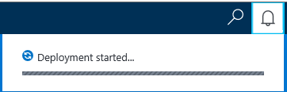
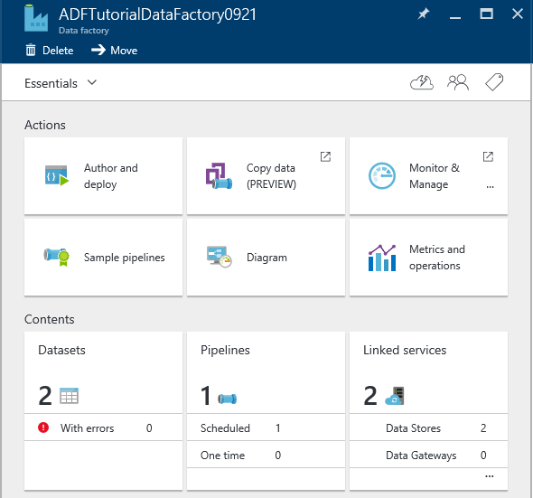
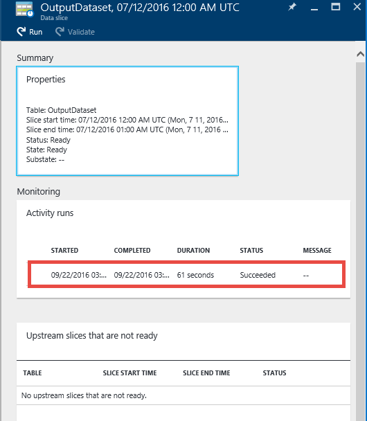
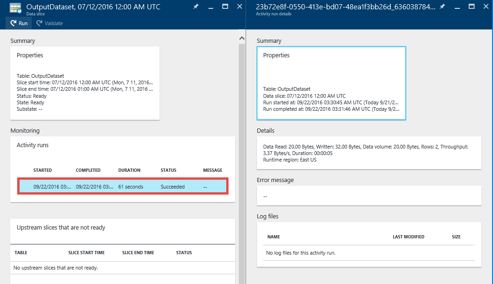

<properties 
    pageTitle="Lernprogramm: Erstellen einer Verkaufspipeline mit Kopieren Aktivität Azure-Portal mit | Microsoft Azure" 
    description="In diesem Lernprogramm erstellen Sie eine Verkaufspipeline Azure Data Factory mit einer Kopie Aktivität mithilfe der Daten Factory-Editor im Azure-Portal." 
    services="data-factory" 
    documentationCenter="" 
    authors="spelluru" 
    manager="jhubbard" 
    editor="monicar"/>

<tags 
    ms.service="data-factory" 
    ms.workload="data-services" 
    ms.tgt_pltfrm="na" 
    ms.devlang="na" 
    ms.topic="get-started-article" 
    ms.date="09/16/2016" 
    ms.author="spelluru"/>

# Lernprogramm: Erstellen einer Verkaufspipeline mit Kopieren Aktivität mit Azure-portal
> [AZURE.SELECTOR]
- [Übersicht und erforderliche Komponenten](data-factory-copy-data-from-azure-blob-storage-to-sql-database.md)
- [Assistent zum Kopieren von](data-factory-copy-data-wizard-tutorial.md)
- [Azure-portal](data-factory-copy-activity-tutorial-using-azure-portal.md)
- [Visual Studio](data-factory-copy-activity-tutorial-using-visual-studio.md)
- [PowerShell](data-factory-copy-activity-tutorial-using-powershell.md)
- [Azure Ressourcenmanager Vorlage](data-factory-copy-activity-tutorial-using-azure-resource-manager-template.md)
- [REST-API](data-factory-copy-activity-tutorial-using-rest-api.md)
- [.NET API](data-factory-copy-activity-tutorial-using-dotnet-api.md)

In diesem Lernprogramm erfahren Sie, wie erstellen und Überwachen einer Azure Daten Factory Azure-Portal verwenden. Der Verkaufspipeline in den Daten Factory verwendet eine Kopie Aktivität zum Kopieren von Daten aus Azure BLOB-Speicher mit Azure SQL-Datenbank.

Hier sind die Schritte, die Sie als Teil dieses Lernprogramms ausführen:

Schritt | Beschreibung
-----| -----------
[Erstellen einer Factory Azure-Daten](#create-data-factory) | In diesem Schritt erstellen Sie eine Azure-Daten Factory mit dem Namen **ADFTutorialDataFactory**.  
[Erstellen von verknüpften Diensten](#create-linked-services) | In diesem Schritt erstellen Sie zwei verknüpfte Diensten: **AzureStorageLinkedService** und **AzureSqlLinkedService**.   Die AzureStorageLinkedService links den Azure-Speicher und AzureSqlLinkedService die SQL Azure-Datenbank mit der ADFTutorialDataFactory verknüpft. Die eingegebenen Daten werden für die Verkaufspipeline in einem Container Blob in Azure BLOB-Speicher und die Ausgabe Daten befindet sich gespeichert in einer Tabelle in der SQL Azure-Datenbank. Daher, fügen Sie diese zwei Datenspeicher als verknüpften Diensten Fabrik Daten ein.      
[Erstellen von Eingabe- und Datasets ausgeben](#create-datasets) | Im vorherigen Schritt erstellt verknüpfte Diensten, die auf Datenspeicher verweisen, die ein-/Ausgabe Daten enthalten. In diesem Schritt definieren Sie zwei Datasets – **InputDataset** und **OutputDataset** –, die die Eingabe/Ausgabe Daten darstellen, die in die Datenspeicher gespeichert ist.   Für die InputDataset Sie angeben des Blob-Containers, der einen Blob für die Quelldaten und für die OutputDataset enthält, können Sie die SQL-Tabelle, die die Ausgabedaten speichert. Außerdem können andere Eigenschaften wie Struktur, Verfügbarkeit und Richtlinie angeben. 
[Erstellen Sie eine Verkaufspipeline](#create-pipeline) | In diesem Schritt erstellen Sie eine Verkaufspipeline mit dem Namen **ADFTutorialPipeline** in der ADFTutorialDataFactory.   Eine **Kopie Aktivität** hinzugefügt der Verkaufspipeline, die der Ausgabe Azure SQL-Tabelle Kopien Eingabemethoden-Daten aus der Azure BLOB. Die Kopie Aktivität führt das Verschieben von Daten in Azure Data Factory. Es wird von einer global verfügbaren Service bereitgestellt, die Daten zwischen verschiedenen Datenspeicher sicheren, zuverlässigen und skalierbare So kopieren können. [Aktivitäten zum Verschieben von Daten](data-factory-data-movement-activities.md) finden Sie im Artikel für Details zur Aktivität kopieren. 
[Monitor Verkaufspipeline](#monitor-pipeline) | In diesem Schritt überwachen Sie Segmente des Eingabe- und Tabellen mithilfe von Azure-Portal an.

## Erforderliche Komponenten 
In dem Artikel [Lernprogramm](data-factory-copy-data-from-azure-blob-storage-to-sql-database.md) vor Durchführung dieses Lernprogramms aufgeführten erforderlichen Komponenten abgeschlossen.

## Erstellen von Daten factory
In diesem Schritt mithilfe erstellen Sie das Azure-Portal eine Azure-Daten Factory mit dem Namen **ADFTutorialDataFactory**.

1.  Klicken Sie nach der Anmeldung [Azure-Portal](https://portal.azure.com/)auf **neu**, wählen Sie **Intelligence + Analytics**aus und klicken Sie auf **Daten Factory**. 

      

6. In der **neuen Daten Factory** -Blade:
    1. Geben Sie **ADFTutorialDataFactory** für den **Namen**ein. 
    
        

        Der Name der Factory Azure-Daten muss **global eindeutig**sein. Wenn Sie die folgende Fehlermeldung angezeigt, ändern Sie den Namen der Factory Daten (z. B. YournameADFTutorialDataFactory), und versuchen Sie erneut zu erstellen. Finden Sie unter [Data Factory - Regeln zur Benennung von](data-factory-naming-rules.md) Thema Benennungskonventionen für Daten Factory Elemente.
    
            Data factory name “ADFTutorialDataFactory” is not available  
     
        
    2. Wählen Sie Ihr **Abonnement**für Azure aus.
    3. Führen Sie für die Ressourcengruppe eine der folgenden Schritte aus:
        1. **Verwenden Sie bestehende**wählen Sie aus, und wählen Sie eine vorhandene Ressourcengruppe aus der Dropdownliste aus. 
        2. Wählen Sie **neu erstellen**, und geben Sie den Namen einer Ressourcengruppe.   
    
            Einige der Schritte in diesem Lernprogramm wird davon ausgegangen, dass Sie den Namen verwenden: **ADFTutorialResourceGroup** für die Ressourcengruppe. Weitere Informationen zu Ressourcengruppen finden Sie unter [verwenden Ressourcengruppen zum Verwalten Ihrer Azure Ressourcen](../azure-resource-manager/resource-group-overview.md).  
    4. Wählen Sie den **Speicherort** für die Daten Factory aus. Nur Regionen vom Dienst Daten Factory unterstützt werden in der Dropdownliste angezeigt.
    5. Wählen Sie **an Startboard anheften**.     
    6. Klicken Sie auf **Erstellen**.

        > [AZURE.IMPORTANT] Um Daten Factory-Instanzen erstellen zu können, müssen Sie Mitglied der Rolle [Data Factory Mitwirkender](../active-directory/role-based-access-built-in-roles.md/#data-factory-contributor) auf Gruppenebene Abonnement oder einer Ressource sein.
        >  
        >  Der Name der Factory Daten möglicherweise als DNS-Namen in der Zukunft und somit werden öffentlich sichtbar registriert werden.              
9.  Wenn die Status/Benachrichtigung Nachrichten anzeigen möchten, klicken Sie auf das Glockensymbol auf der Symbolleiste. 

     
10. Nach die Erstellung abgeschlossen ist, wird das Blade **Factory Daten** wie in der Abbildung dargestellt.

    

## Erstellen von verknüpften Diensten
Verknüpfte Services Datenspeicher verknüpfen oder Dienste für eine Fabrik Azure-Daten zu berechnen. Finden Sie unter [unterstützte Daten gespeichert sind](data-factory-data-movement-activities.md##supported-data-stores-and-formats) , für alle Quellen und senken unterstützt, indem Sie die Aktivität kopieren. Finden Sie unter für die Liste der berechnen Dienste von Daten Factory unterstützt [verknüpfte Diensten zu berechnen](data-factory-compute-linked-services.md) . In diesem Lernprogramm verwenden Sie keine Computing-Service. 

In diesem Schritt erstellen Sie zwei verknüpfte Diensten: **AzureStorageLinkedService** und **AzureSqlLinkedService**. AzureStorageLinkedService verknüpft Dienst Links ein Azure-Speicher-Konto und AzureSqlLinkedService eine SQL Azure-Datenbank mit der **ADFTutorialDataFactory**verknüpft. Erstellen Sie eine Verkaufspipeline später in diesem Lernprogramm, die Daten aus einem Container Blob in AzureStorageLinkedService zu einer SQL-Tabelle in AzureSqlLinkedService kopiert.

### Erstellen Sie einen verknüpften Dienst für das Konto Azure-Speicher
1.  Klicken Sie in das Blade **Daten Factory** auf **Autor und Bereitstellen** Kachel, um den **Editor** für die Daten Factory zu starten.

     
5. Klicken Sie im **Editor**auf die Schaltfläche **neue Daten speichern möchten** , klicken Sie auf der Symbolleiste, und wählen Sie aus dem Dropdownmenü aus **Azure-Speicher** . Es sollte die JSON-Vorlage zum Erstellen einer Azure verknüpft Speicherdienst im rechten Bereich angezeigt. 

        
6. Ersetzen Sie `<accountname>` und `<accountkey>` mit dem Kontonamen und dem Konto Schlüsselwerte für Ihr Konto Azure-Speicher. 

     
6. Klicken Sie auf der Symbolleiste auf **Bereitstellen** . Die bereitgestellten **AzureStorageLinkedService** in der Strukturansicht sollte jetzt angezeigt werden. 

    

> [AZURE.NOTE]
> Details zu JSON-Eigenschaften finden Sie unter [Verschieben von Daten aus dem und in Azure Blob](data-factory-azure-blob-connector.md#azure-storage-linked-service) .

### Erstellen Sie einen verknüpften Dienst für SQL Azure-Datenbank
1. Klicken Sie in den **Daten Factory-Editor**auf die Schaltfläche **neue Daten speichern möchten** , klicken Sie auf der Symbolleiste, und wählen Sie aus dem Dropdownmenü aus **Azure SQL-Datenbank** . Es sollte die JSON-Vorlage zum Erstellen des SQL Azure-Verknüpfte Diensts im rechten Bereich angezeigt.
2. Ersetzen Sie `<servername>`, `<databasename>`, `<username>@<servername>`, und `<password>` mit den Namen Ihrer SQL Azure-Server, Datenbank, Benutzerkonto und Ihr Kennwort ein. 
3. Klicken Sie auf der Symbolleiste auf erstellen und Bereitstellen der **AzureSqlLinkedService**auf **Bereitstellen** .
4. Bestätigen Sie, dass die **AzureSqlLinkedService** in der Strukturansicht angezeigt. 

> [AZURE.NOTE]
> Details zu JSON-Eigenschaften finden Sie unter [Verschieben von Daten aus dem und in Azure SQL-Datenbank](data-factory-azure-sql-connector.md#azure-sql-linked-service-properties) .

## Datasets erstellen
Im vorherigen Schritt erstellt Sie verknüpfte Diensten **AzureStorageLinkedService** und **AzureSqlLinkedService** ein Speicher Azure-Konto und SQL Azure-Datenbank Fabrik Daten verknüpfen: **ADFTutorialDataFactory**. In diesem Schritt definieren Sie zwei Datasets – **InputDataset** und **OutputDataset** –, die die Eingabe/Ausgabe Daten darstellen, die in die Datenspeicher Hilfethemas verwiesen wird AzureStorageLinkedService und AzureSqlLinkedService gespeichert ist. Für InputDataset Sie angeben des Blob-Containers, der einen Blob für die Quelldaten und für OutputDataset enthält, können Sie die SQL-Tabelle, die die Ausgabedaten speichert. 

### Erstellen von dataset 
In diesem Schritt erstellen Sie ein Dataset namens **InputDataset** , die zu einem Container Blob in den Azure-Speicher dargestellt werden vom Dienst **AzureStorageLinkedService** verknüpft verweist.

1. Klicken Sie im **Editor** für die Daten Factory **auf... Weitere**, klicken Sie auf **Neues Dataset**, und klicken Sie im Dropdown-Menü auf **Azure Blob-Speicher** . 

    
2. Ersetzen Sie JSON im rechten Bereich mit den folgenden JSON-Codeausschnitt: 

        {
          "name": "InputDataset",
          "properties": {
            "structure": [
              {
                "name": "FirstName",
                "type": "String"
              },
              {
                "name": "LastName",
                "type": "String"
              }
            ],
            "type": "AzureBlob",
            "linkedServiceName": "AzureStorageLinkedService",
            "typeProperties": {
              "folderPath": "adftutorial/",
              "fileName": "emp.txt",
              "format": {
                "type": "TextFormat",
                "columnDelimiter": ","
              }
            },
            "external": true,
            "availability": {
              "frequency": "Hour",
              "interval": 1
            }
          }
        }
        
     Beachten Sie die folgenden Punkte: 
    
    - DataSet **Typ** wird auf **AzureBlob**festgelegt.
    - **LinkedServiceName** wird auf **AzureStorageLinkedService**festgelegt. Sie erstellt diesen Dienst verknüpfte in Schritt2 aus.
    - **Ordnerpfad** wird an den Container **Adftutorial** festgelegt. Sie können auch den Namen eines Blob innerhalb des Ordners mithilfe der Eigenschaft **FileName** angeben. Da Sie den Namen des Blob nicht angeben, werden Daten aus allen Blobs im Container als eine Eingabedaten angesehen.  
    - **Art** der Formatierung wird auf **TextFormat** festgelegt.
    - Es gibt zwei Felder in der Textdatei – **FirstName** und **LastName** – getrennt durch ein Komma (**ColumnDelimiter**) 
    - Die **Verfügbarkeit** wird festgelegt, um **stündlich** (**Häufigkeit** auf **Stunde** festgelegt ist und **Intervall** auf **1**festgelegt ist). Daher sucht Daten Factory Eingabedaten stündlich in den Stammordner des Blob Container (**Adftutorial**), die Sie angegeben haben. 
    
    Wenn Sie einen **Dateinamen** für eine **Eingabe** -Dataset nicht angeben, werden alle Dateien/Blobs im Ordner "Eingabe" (**Ordnerpfad**) als Eingaben angesehen. Wenn Sie einen Dateinamen in das JSON angeben, wird nur das angegebene Datei/Blob Asn Eingabe betrachtet.
 
    Wenn Sie einen **Dateinamen** für eine **Ausgabetabelle**nicht angeben, werden die generierten Dateien in den **Ordnerpfad** im folgenden Format benannt: Daten. &lt;Guid\&amp. TXT (Beispiel: Data.0a405f8a-93ff-4c6f-b3be-f69616f1df7a.txt.).

    Um **Ordnerpfad** und **Dateiname** dynamisch basierend auf der Uhrzeit **SliceStart** festzulegen, verwenden Sie die Eigenschaft **PartitionedBy** ein. Im folgenden Beispiel Ordnerpfad verwendet Jahr, Monat und Tag aus der SliceStart (Startzeit für das Segment des verarbeiteten) und FileName verwendet Stunde aus der SliceStart. Wenn Sie ein Segment für 2016 gefertigt wird beispielsweise-09-20T08:00:00, der Ordnername auf Wikidatagateway/Wikisampledataout/2016/09/20 festgelegt ist und der Dateinamen auf 08.csv festgelegt ist. 

            "folderPath": "wikidatagateway/wikisampledataout/{Year}/{Month}/{Day}",
            "fileName": "{Hour}.csv",
            "partitionedBy": 
            [
                { "name": "Year", "value": { "type": "DateTime", "date": "SliceStart", "format": "yyyy" } },
                { "name": "Month", "value": { "type": "DateTime", "date": "SliceStart", "format": "MM" } }, 
                { "name": "Day", "value": { "type": "DateTime", "date": "SliceStart", "format": "dd" } }, 
                { "name": "Hour", "value": { "type": "DateTime", "date": "SliceStart", "format": "hh" } } 
            ],
2. Klicken Sie auf der Symbolleiste auf erstellen und Bereitstellen von **InputDataset** Dataset auf **Bereitstellen** . Bestätigen Sie, dass Sie die **InputDataset** in der Strukturansicht angezeigt.

> [AZURE.NOTE]
> Details zu JSON-Eigenschaften finden Sie unter [Verschieben von Daten aus dem und in Azure Blob](data-factory-azure-blob-connector.md#azure-blob-dataset-type-properties) .

### Die Ausgabe Dataset erstellen
In dieser Phase des Schritts erstellen Sie eine Ausgabe Dataset mit dem Namen **OutputDataset**. Dieses Dataset verweist auf eine SQL-Tabelle in der SQL Azure-Datenbank, die durch **AzureSqlLinkedService**dargestellt werden. 

1. Klicken Sie im **Editor** für die Daten Factory **auf... Weitere**, klicken Sie auf **Neues Dataset**, und klicken Sie im Dropdown-Menü auf **SQL Azure** . 
2. Ersetzen Sie JSON im rechten Bereich mit den folgenden JSON-Codeausschnitt:

        {
          "name": "OutputDataset",
          "properties": {
            "structure": [
              {
                "name": "FirstName",
                "type": "String"
              },
              {
                "name": "LastName",
                "type": "String"
              }
            ],
            "type": "AzureSqlTable",
            "linkedServiceName": "AzureSqlLinkedService",
            "typeProperties": {
              "tableName": "emp"
            },
            "availability": {
              "frequency": "Hour",
              "interval": 1
            }
          }
        }
        
     Beachten Sie die folgenden Punkte: 
    
    - DataSet **Typ** wird auf **AzureSQLTable**festgelegt.
    - **LinkedServiceName** wird auf **AzureSqlLinkedService** festgelegt (Sie erstellt diesen Dienst verknüpfte in Schritt2).
    - **Tabellenname** ist **emp**festgelegt.
    - Es gibt drei Spalten – **ID**, **FirstName**und **LastName** – in der Tabelle emp in der Datenbank ein. ID ist eine Identitätsspalte, daher Sie nur **FirstName** und **LastName** hier angeben müssen.
    - Die **Verfügbarkeit** wird **stündlich** (**Häufigkeit** auf **Hour** festgelegten und **Intervall** auf **1**festgelegt) festgelegt.  Der Dienst Daten Factory generiert ein Ausgabe Daten Segments stündlich in der Tabelle **emp** der SQL Azure-Datenbank.

3. Klicken Sie auf der Symbolleiste auf erstellen und Bereitstellen von **OutputDataset** Dataset auf **Bereitstellen** . Bestätigen Sie, dass Sie die **OutputDataset** in der Strukturansicht angezeigt. 

> [AZURE.NOTE]
> Details zu JSON-Eigenschaften finden Sie unter [Verschieben von Daten aus dem und in Azure SQL-Datenbank](data-factory-azure-sql-connector.md#azure-sql-linked-service-properties) .

## Erstellen der Verkaufspipeline
In diesem Schritt erstellen Sie eine Verkaufspipeline mit einer **Kopie Aktivitäten** , die **InputDataset** als Eingabe verwendet und **OutputDataset** in der Ausgabe.

1. Klicken Sie im **Editor** für die Daten Factory **auf... Weitere**, und klicken Sie auf **neue Verkaufspipeline**. Alternativ können Sie mit der rechten Maustaste **Pipelines** in der Strukturansicht, und klicken Sie auf **neue Verkaufspipeline**.
2. Ersetzen Sie JSON im rechten Bereich mit den folgenden JSON-Codeausschnitt: 
        
        {
          "name": "ADFTutorialPipeline",
          "properties": {
            "description": "Copy data from a blob to Azure SQL table",
            "activities": [
              {
                "name": "CopyFromBlobToSQL",
                "type": "Copy",
                "inputs": [
                  {
                    "name": "InputDataset"
                  }
                ],
                "outputs": [
                  {
                    "name": "OutputDataset"
                  }
                ],
                "typeProperties": {
                  "source": {
                    "type": "BlobSource"
                  },
                  "sink": {
                    "type": "SqlSink",
                    "writeBatchSize": 10000,
                    "writeBatchTimeout": "60:00:00"
                  }
                },
                "Policy": {
                  "concurrency": 1,
                  "executionPriorityOrder": "NewestFirst",
                  "retry": 0,
                  "timeout": "01:00:00"
                }
              }
            ],
            "start": "2016-07-12T00:00:00Z",
            "end": "2016-07-13T00:00:00Z"
          }
        } 

    Beachten Sie die folgenden Punkte:

    - Im Abschnitt Aktivitäten gibt es nur eine Aktivität zu **Kopieren**, deren **Typ** festgelegt ist.
    - Eingabe für die Aktivität auf **InputDataset** festgelegt ist, und die Ausgabe für die Aktivität auf **OutputDataset**festgelegt ist.
    - Im Abschnitt **TypeProperties** **BlobSource** als den Quelltyp angegeben und den Typ der Empfänger **SqlSink** angegeben ist.

    Ersetzen Sie den Wert der Eigenschaft **beginnen Sie** mit dem aktuellen Tag und die **Endzeit** der Wert mit dem nächsten Tag. Können Sie nur den Datumsteil angeben und den Zeitteil des Datums Uhrzeit überspringen. Beispielsweise "2016-02-03" entspricht "2016-02-03T00:00:00Z"
    
    Beide starten und beenden Zeiteingabe muss im [ISO-Format](http://en.wikipedia.org/wiki/ISO_8601). Beispiel: 2016-10-14T16:32:41Z. **Die Endzeit** ist optional, aber wir in diesem Lernprogramm verwenden. 
    
    Wenn Sie keinen Wert für die Eigenschaft **Ende** angeben, wird es als "**Start + 48 Stunden**" berechnet. Wenn der Verkaufspipeline endlos ausführen möchten, geben Sie als Wert für die Eigenschaft **Ende** **9999-09-09** an.
    
    Im vorherigen Beispiel sind 24 Datensegmente wie jedes Segment Daten stündlich erstellt wird.
    
4. Klicken Sie auf der Symbolleiste auf erstellen und Bereitstellen der **ADFTutorialPipeline**auf **Bereitstellen** . Bestätigen Sie, dass Sie der Verkaufspipeline in der Strukturansicht angezeigt. 
5. Schließen Sie nun das Blade **Editor** , indem Sie auf **X**. Klicken Sie auf **X** , um die **Daten Factory** -Homepage der **ADFTutorialDataFactory**finden Sie unter.

**Herzlichen Glückwunsch!** Sie haben erfolgreich erstellt eine Fabrik Azure-Daten, verknüpften Diensten, Tabellen und eine Verkaufspipeline und der Verkaufspipeline geplant.   
 
### Anzeigen der Factory Daten in einer Ansicht des Diagramms 
1. Klicken Sie in das Blade **Daten Factory** auf **Diagramm**.

    
2. Das Diagramm ähnlich wie die folgende Abbildung sollte angezeigt werden: 

    

    Sie können vergrößern, verkleinern, Vergrößern auf 100 %, Zoom passt, automatisch positionieren Pipelines und Tabellen und Anzeigen von Informationen über die Datenherkunft (hervorgehoben übergeordneten und untergeordneten Elemente der ausgewählten Elemente).  Sie können ein Objekt (Tabelle/Ausgang oder Verkaufspipeline) Eigenschaften dafür finden Sie unter doppelklicken. 
3. Mit der rechten Maustaste **ADFTutorialPipeline** in der Diagrammansicht, und klicken Sie auf **Öffnen Verkaufspipeline**. 

    
4. Es sollte die Aktivitäten in der Verkaufspipeline zusammen mit Eingabe- und Datasets für die Aktivitäten angezeigt. In diesem Lernprogramm haben Sie nur eine Aktivität in der Verkaufspipeline (Kopieren Aktivität) mit InputDataset als Eingabe-Dataset und OutputDataset als Ausgabe Dataset aus.   

    
5. Klicken Sie auf **Daten Factory** im Breadcrumb in der oberen linken Ecke, um zum in der Diagrammansicht zurückzukehren. In der Diagrammansicht zeigt alle Rohrleitungen. In diesem Beispiel haben Sie nur eine Verkaufspipeline erstellt.   
 

## Monitor Verkaufspipeline
In diesem Schritt verwenden Sie das Azure-Portal zum Überwachen der Aktivitäten in einer Factory Azure-Daten in ein. 

### Monitor Verkaufspipeline mithilfe der Diagrammsicht

1. Klicken Sie auf **X** , um die Ansicht **Diagramm** , um die Daten Factory-Homepage für die Daten Factory finden Sie unter zu schließen. Wenn Sie den Webbrowser geschlossen haben, führen Sie die folgenden Schritte aus: 
    2. Navigieren Sie zur [Azure-Portal](https://portal.azure.com/)an. 
    2. Doppelklicken Sie auf **ADFTutorialDataFactory** auf der **Startboard** (oder) klicken Sie im Menü links auf **Daten Factory** , und Suchen nach ADFTutorialDataFactory. 
3. Die Anzahl und die Namen von Tabellen und Verkaufspipeline auf diese Blade erstellten sollte angezeigt werden.

    
4. Klicken Sie nun auf **Datasets** Kachel.
5. Klicken Sie in das Blade **Datasets** auf **InputDataset**. Dieses Dataset wird die Eingabe-Dataset für **ADFTutorialPipeline**.

       
5. Klicken Sie auf **... (Auslassungspunkte)** Um alle Datensegmente anzuzeigen.

      

    Beachten Sie, dass alle Datensegmente auf die aktuelle Uhrzeit **bereit** sind, weil die Datei **emp.txt** immer im Container Blob vorhanden ist: **Adftutorial\input**. Bestätigen Sie, dass keine Segmente im Abschnitt am unteren **zuletzt fehlgeschlagene Segmente** angezeigt.

    Nach der **Uhrzeit der letzten Aktualisierung**werden sowohl **zuletzt aktualisiert Segmente** und **vor kurzem fehlschlug Segmente** Listen sortiert. 
    
    Klicken Sie auf der Symbolleiste auf die Segmente Filtern auf **Filter** .  
    
    
6. Schließen Sie die Blades, bis das Blade **Datasets** angezeigt wird. Klicken Sie auf die **OutputDataset**. Dieses Dataset ist das Ergebnis Dataset für **ADFTutorialPipeline**.

    
6. Das Blade **OutputDataset** sollte angezeigt werden, wie in der folgenden Abbildung dargestellt:

     
7. Beachten Sie, dass die Datensegmente auf die aktuelle Uhrzeit bereits hergestellt wurden, und sie **bereit**sind. Keine Segmente im Abschnitt **Problem Segmente** unten angezeigt.
8. Klicken Sie auf **... (Auslassungspunkte)** Um alle Segmente anzuzeigen.

    
9. Klicken Sie auf ein beliebiges Segment Daten aus der Liste aus, und Sie das **Segment Daten** Blade auftreten.

    
  
    Wenn das Segment nicht im Zustand **bereit** ist, können Sie Segmente des übergeordneten angezeigt, die nicht bereit sind und das aktuelle Segment von in der Liste **übergeordneten Segmente, die nicht bereit sind,** ausgeführt werden blockieren.
11. Das Blade **Daten Segment** sollte nun angezeigt, dass alle Aktivitäten in der Liste unten ausgeführt wird. Klicken Sie auf eine **Aktivität ausführen** um das Blade **Aktivität ausführen Details** anzuzeigen. 

    
12. Klicken Sie auf **X** , um alle Blades schließen, bis Sie an die private Blade für die **ADFTutorialDataFactory**zurückzukehren.
14. (optional) Klicken Sie auf der Startseite **Rohrleitungen** auf, um **ADFTutorialDataFactory**, klicken Sie in das Blade **Pipelines** **ADFTutorialPipeline** auf und Drillthrough-Eingabewerte Tabellen (**verbraucht**) oder Ausgabetabellen (**produziert**).
15. Starten Sie **SQL Server Management Studio**, zur Azure SQL-Datenbank herstellen, und stellen Sie sicher, dass die Zeilen in der Tabelle **emp** in der Datenbank eingefügt werden.

    

### Überwachen der Verkaufspipeline überwachen und Verwalten von App verwenden
Sie können auch Monitor verwenden und Verwalten der Anwendung, um Ihre Rohrleitungen überwachen. Ausführliche Informationen zur Verwendung dieser Anwendungs finden Sie unter [Überwachen und Verwalten von Azure Data Factory Pipelines mit Überwachung und Verwaltung App](data-factory-monitor-manage-app.md).

1. Klicken Sie auf auf der Startseite für Ihre Daten Factory-Kachel **Überwachen und verwalten** .

     
2. **Überwachen und Verwalten von Anwendung**sollte angezeigt werden. Ändern Sie die **Startzeit** und die **Endzeit** zum Anfang (2016 07 12) einzuschließen Endzeit (2016 07 13) von der Verkaufspipeline, und klicken Sie auf **Übernehmen**. 

     
3. Wählen Sie ein Aktivitätsfenster in der Liste **Aktivität Windows** zur Anzeige von Details zu erhalten. 
    

## Zusammenfassung 
In diesem Lernprogramm erstellt Sie eine Fabrik Azure-Daten so kopieren Sie Daten aus einer Azure BLOB-mit einer SQL Azure-Datenbank. Sie verwendet Azure-Portal an, um die Daten Factory, verknüpften Diensten, Datasets und eine Verkaufspipeline zu erstellen. Hier sind die allgemeinen Schritte, die Sie in diesem Lernprogramm ausgeführt:  

1.  Erstellt eine Azure- **Daten Factory**.
2.  Erstellt von **verknüpften Diensten**:
    1. Ein **Azure-Speicher** verknüpft Dienst auf Ihr Konto Azure-Speicher zu verknüpfen, die Eingabedaten enthält.    
    2. Einer **SQL Azure** -verknüpfte Dienst Ihrer SQL Azure-Datenbank zu verknüpfen, die die Ausgabedaten enthält. 
3.  Erstellt **Datasets** , die Eingabedaten und Ausgabedaten für Pipelines zu beschreiben.
4.  Erstellt eine **Verkaufspipeline** mit einer **Kopie Aktivität** mit **BlobSource** als Quell- und **SqlSink** als Empfänger.  

## Siehe auch
| Thema | Beschreibung |
| :---- | :---- |
| [Aktivitäten zum Verschieben von Daten](data-factory-data-movement-activities.md) | Dieser Artikel enthält ausführliche Informationen zur Aktivität kopieren Sie im Lernprogramm verwendet. |
| [Planung und Ausführung](data-factory-scheduling-and-execution.md) | In diesem Artikel wird erläutert, die Planung und Ausführung Aspekte des Modells für Azure Data Factory-Anwendung. |
| [Pipelines](data-factory-create-pipelines.md) | In diesem Artikel können Sie die Pipelines und Aktivitäten in Azure Data Factory zu verstehen. |
| [Datasets](data-factory-create-datasets.md) | In diesem Artikel können Sie die Datasets in Azure Data Factory zu verstehen.
| [Überwachen und Verwalten von Pipelines mit App für die Überwachung](data-factory-monitor-manage-app.md) | Dieser Artikel beschreibt, wie überwachen, verwalten und Debuggen Pipelines die Überwachung und Verwaltung App verwenden. 

