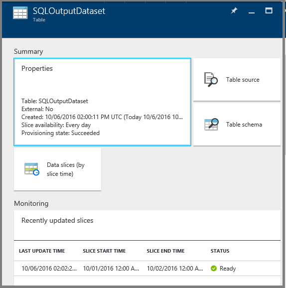

<properties
    pageTitle="Lernprogramm: Erstellen einer Verkaufspipeline mit Ressourcenmanager Vorlage | Microsoft Azure"
    description="In diesem Lernprogramm erstellen Sie eine Verkaufspipeline Azure Data Factory mit einer Kopie Aktivität mithilfe von Azure Ressourcenmanager Vorlage ein."
    services="data-factory"
    documentationCenter=""
    authors="spelluru"
    manager="jhubbard"
    editor="monicar"/>

<tags
    ms.service="data-factory"
    ms.workload="data-services"
    ms.tgt_pltfrm="na"
    ms.devlang="na"
    ms.topic="get-started-article"
    ms.date="10/10/2016"
    ms.author="spelluru"/>

# Lernprogramm: Erstellen einer Verkaufspipeline mit Kopieren Aktivität mit Ressourcenmanager Azure-Vorlage
> [AZURE.SELECTOR]
- [Übersicht und erforderliche Komponenten](data-factory-copy-data-from-azure-blob-storage-to-sql-database.md)
- [Assistent zum Kopieren von](data-factory-copy-data-wizard-tutorial.md)
- [Azure-portal](data-factory-copy-activity-tutorial-using-azure-portal.md)
- [Visual Studio](data-factory-copy-activity-tutorial-using-visual-studio.md)
- [PowerShell](data-factory-copy-activity-tutorial-using-powershell.md)
- [Azure Ressourcenmanager Vorlage](data-factory-copy-activity-tutorial-using-azure-resource-manager-template.md)
- [REST-API](data-factory-copy-activity-tutorial-using-rest-api.md)
- [.NET API](data-factory-copy-activity-tutorial-using-dotnet-api.md)

In diesem Lernprogramm erfahren Sie, wie erstellen und eine Azure-Daten Factory mithilfe einer Vorlage Azure Ressourcenmanager überwachen. Der Verkaufspipeline in die Factory Daten kopiert Daten aus Azure BLOB-Speicher mit Azure SQL-Datenbank.

## Erforderliche Komponenten
- Durchgehen Sie [Lernprogramm Übersicht und erforderliche Komponenten](data-factory-copy-data-from-azure-blob-storage-to-sql-database.md) , und führen Sie die Schritte **Voraussetzung** aus.
- Anweisungen Sie [zum Installieren und Konfigurieren von Azure PowerShell](../powershell-install-configure.md) -Artikel auf die neueste Version von Azure PowerShell auf Ihrem Computer installieren. In diesem Lernprogramm verwenden Sie PowerShell Daten Factory Personen bereitstellen. 
- (optional) Finden Sie unter [Authoring Azure Ressourcenmanager Vorlagen](../resource-group-authoring-templates.md) Azure Ressourcenmanager Vorlagen lernen.

## In diesem Lernprogramm

In diesem Lernprogramm erstellen Sie eine Factory Daten mit den folgenden Daten Factory-Objekten:

Entität | Beschreibung  
------ | ----------- 
Azure verknüpft Speicherdienst | Ihr Konto Azure-Speicher verknüpft mit den Daten Factory. Azure-Speicher ist die Quelle Datenspeicher und SQL Azure-Datenbank ist der Empfänger Datenspeicher für die Aktivität kopieren im Lernprogramm. Es gibt an, das Speicherkonto, das die Eingabedaten für die Aktivität Kopie enthält. 
Azure SQL-Datenbank verknüpft-Dienst| Die SQL Azure-Datenbank verknüpft mit den Daten Factory. Es gibt Azure SQL-Datenbank, die die Ausgabedaten für die Aktivität Kopie enthält. 
Eingabe Azure Blob-dataset | Bezieht sich auf den Dienst Azure-Speicher verknüpft. Verknüpfte Dienst mit einer Firma Azure-Speicher verweist und Azure Blob Dataset gibt Container, Ordner und Dateinamen im Speicher, der die eingegebenen Daten enthält. 
Azure SQL-Ausgabe-dataset | Bezieht sich auf den Dienst SQL Azure-Verknüpfte. Der Dienst SQL Azure-Verknüpfte bezieht sich auf eine SQL Azure-Server und das SQL Azure-Dataset gibt den Namen der Tabelle, die die Ausgabedaten enthält. 
Daten Verkaufspipeline | Der Verkaufspipeline hat eine Aktivität vom Typ kopieren, die das Dataset Azure Blob als Eingabe und dem SQL Azure-Dataset als Ausgabe akzeptiert. Die Aktivität kopieren kopiert Daten aus einer Azure Blob zu einer Tabelle in der SQL Azure-Datenbank.  

Eine Factory Daten kann eine oder mehrere Rohrleitungen haben. Eine Verkaufspipeline kann eine oder mehrere Aktivitäten enthalten. Es gibt zwei Arten von Aktivitäten: [Daten Bewegung](data-factory-data-movement-activities.md) und [Daten Transformationsaktivitäten](data-factory-data-transformation-activities.md). In diesem Lernprogramm erstellen Sie eine Verkaufspipeline Zug (Aktivität kopieren).

 

Der folgende Abschnitt enthält die vollständige Ressourcenmanager Vorlage zum Definieren von Daten Factory Personen, damit Sie schnell anhand des Lernprogramms ausführen können, und Testen Sie die Vorlage ein. Um zu verstehen, wie jede Entität Daten Factory wird definiert, finden Sie unter [Data Factory Einheiten in der Vorlage](#data-factory-entities-in-the-template) Abschnitt.

## Data Factory JSON-Vorlage
Vorlage für eine Fabrik Daten definieren auf oberster Ebene Ressourcenmanager lautet: 

    {
        "$schema": "http://schema.management.azure.com/schemas/2015-01-01/deploymentTemplate.json#",
        "contentVersion": "1.0.0.0",
        "parameters": { ...
        },
        "variables": { ...
        },
        "resources": [
            {
                "name": "[parameters('dataFactoryName')]",
                "apiVersion": "[variables('apiVersion')]",
                "type": "Microsoft.DataFactory/datafactories",
                "location": "westus",
                "resources": [
                    { ... },
                    { ... },
                    { ... },
                    { ... }
                ]
            }
        ]
    }

Erstellen einer JSON-Datei mit dem Namen **ADFCopyTutorialARM.json** **C:\ADFGetStarted** Ordner mit dem folgenden Inhalt:

    {
        "contentVersion": "1.0.0.0",
        "$schema": "http://schema.management.azure.com/schemas/2015-01-01/deploymentTemplate.json#",
        "parameters": {
          "storageAccountName": { "type": "string", "metadata": { "description": "Name of the Azure storage account that contains the data to be copied." } },
          "storageAccountKey": { "type": "securestring", "metadata": { "description": "Key for the Azure storage account." } },
          "sourceBlobContainer": { "type": "string", "metadata": { "description": "Name of the blob container in the Azure Storage account." } },
          "sourceBlobName": { "type": "string", "metadata": { "description": "Name of the blob in the container that has the data to be copied to Azure SQL Database table" } },
          "sqlServerName": { "type": "string", "metadata": { "description": "Name of the Azure SQL Server that will hold the output/copied data." } },
          "databaseName": { "type": "string", "metadata": { "description": "Name of the Azure SQL Database in the Azure SQL server." } },
          "sqlServerUserName": { "type": "string", "metadata": { "description": "Name of the user that has access to the Azure SQL server." } },
          "sqlServerPassword": { "type": "securestring", "metadata": { "description": "Password for the user." } },
          "targetSQLTable": { "type": "string", "metadata": { "description": "Table in the Azure SQL Database that will hold the copied data." } 
          } 
        },
        "variables": {
          "dataFactoryName": "[concat('AzureBlobToAzureSQLDatabaseDF', uniqueString(resourceGroup().id))]",
          "azureSqlLinkedServiceName": "AzureSqlLinkedService",
          "azureStorageLinkedServiceName": "AzureStorageLinkedService",
          "blobInputDatasetName": "BlobInputDataset",
          "sqlOutputDatasetName": "SQLOutputDataset",
          "pipelineName": "Blob2SQLPipeline"
        },
        "resources": [
          {
            "name": "[variables('dataFactoryName')]",
            "apiVersion": "2015-10-01",
            "type": "Microsoft.DataFactory/datafactories",
            "location": "West US",
            "resources": [
              {
                "type": "linkedservices",
                "name": "[variables('azureStorageLinkedServiceName')]",
                "dependsOn": [
                  "[variables('dataFactoryName')]"
                ],
                "apiVersion": "2015-10-01",
                "properties": {
                  "type": "AzureStorage",
                  "description": "Azure Storage linked service",
                  "typeProperties": {
                    "connectionString": "[concat('DefaultEndpointsProtocol=https;AccountName=',parameters('storageAccountName'),';AccountKey=',parameters('storageAccountKey'))]"
                  }
                }
              },
              {
                "type": "linkedservices",
                "name": "[variables('azureSqlLinkedServiceName')]",
                "dependsOn": [
                  "[variables('dataFactoryName')]"
                ],
                "apiVersion": "2015-10-01",
                "properties": {
                  "type": "AzureSqlDatabase",
                  "description": "Azure SQL linked service",
                  "typeProperties": {
                    "connectionString": "[concat('Server=tcp:',parameters('sqlServerName'),'.database.windows.net,1433;Database=', parameters('databaseName'), ';User ID=',parameters('sqlServerUserName'),';Password=',parameters('sqlServerPassword'),';Trusted_Connection=False;Encrypt=True;Connection Timeout=30')]"
                  }
                }
              },
              {
                "type": "datasets",
                "name": "[variables('blobInputDatasetName')]",
                "dependsOn": [
                  "[variables('dataFactoryName')]",
                  "[variables('azureStorageLinkedServiceName')]"
                ],
                "apiVersion": "2015-10-01",
                "properties": {
                  "type": "AzureBlob",
                  "linkedServiceName": "[variables('azureStorageLinkedServiceName')]",
                  "structure": [
                    {
                      "name": "Column0",
                      "type": "String"
                    },
                    {
                      "name": "Column1",
                      "type": "String"
                    }
                  ],
                  "typeProperties": {
                    "folderPath": "[concat(parameters('sourceBlobContainer'), '/')]",
                    "fileName": "[parameters('sourceBlobName')]",
                    "format": {
                      "type": "TextFormat",
                      "columnDelimiter": ","
                    }
                  },
                  "availability": {
                    "frequency": "Day",
                    "interval": 1
                  },
                  "external": true
                }
              },
              {
                "type": "datasets",
                "name": "[variables('sqlOutputDatasetName')]",
                "dependsOn": [
                  "[variables('dataFactoryName')]",
                  "[variables('azureSqlLinkedServiceName')]"
                ],
                "apiVersion": "2015-10-01",
                "properties": {
                  "type": "AzureSqlTable",
                  "linkedServiceName": "[variables('azureSqlLinkedServiceName')]",
                  "structure": [
                    {
                      "name": "FirstName",
                      "type": "String"
                    },
                    {
                      "name": "LastName",
                      "type": "String"
                    }
                  ],
                  "typeProperties": {
                    "tableName": "[parameters('targetSQLTable')]"
                  },
                  "availability": {
                    "frequency": "Day",
                    "interval": 1
                  }
                }
              },
              {
                "type": "datapipelines",
                "name": "[variables('pipelineName')]",
                "dependsOn": [
                  "[variables('dataFactoryName')]",
                  "[variables('azureStorageLinkedServiceName')]",
                  "[variables('azureSqlLinkedServiceName')]",
                  "[variables('blobInputDatasetName')]",
                  "[variables('sqlOutputDatasetName')]"
                ],
                "apiVersion": "2015-10-01",
                "properties": {
                  "activities": [
                    {
                      "name": "CopyFromAzureBlobToAzureSQL",
                      "description": "Copy data frm Azure blob to Azure SQL",
                      "type": "Copy",
                      "inputs": [
                        {
                          "name": "[variables('blobInputDatasetName')]"
                        }
                      ],
                      "outputs": [
                        {
                          "name": "[variables('sqlOutputDatasetName')]"
                        }
                      ],
                      "typeProperties": {
                        "source": {
                          "type": "BlobSource"
                        },
                        "sink": {
                          "type": "SqlSink",
                          "sqlWriterCleanupScript": "$$Text.Format('DELETE FROM {0}', 'emp')"
                        },
                        "translator": {
                          "type": "TabularTranslator",
                          "columnMappings": "Column0:FirstName,Column1:LastName"
                        }
                      },
                      "Policy": {
                        "concurrency": 1,
                        "executionPriorityOrder": "NewestFirst",
                        "retry": 3,
                        "timeout": "01:00:00"
                      }
                    }
                  ],
                  "start": "2016-10-02T00:00:00Z",
                  "end": "2016-10-03T00:00:00Z"
                }
              }
            ]
          }
        ]
      }

## JSON-Parameter 
Erstellen einer JSON-Datei mit dem Namen **ADFCopyTutorialARM-Parameters.json** , die Parameter für die Vorlage Azure Ressourcenmanager enthält. 

> [AZURE.IMPORTANT] Geben Sie den Namen und die Taste Ihres Kontos Azure-Speicher für Parameter **StorageAccountName** und **StorageAccountKey** .  

    {
        "$schema": "https://schema.management.azure.com/schemas/2015-01-01/deploymentParameters.json#",
        "contentVersion": "1.0.0.0",
        "parameters": { 
            "storageAccountName": { "value": "<Name of the Azure storage account>"  },
            "storageAccountKey": {
                "value": "<Key for the Azure storage account>"
            },
            "sourceBlobContainer": { "value": "adftutorial" },
            "sourceBlobName": { "value": "emp.txt" },
            "sqlServerName": { "value": "<Name of the Azure SQL server>" },
            "databaseName": { "value": "<Name of the Azure SQL database>" },
            "sqlServerUserName": { "value": "<Name of the user who has access to the Azure SQL database>" },
            "sqlServerPassword": { "value": "<password for the user>" },
            "targetSQLTable": { "value": "emp" }
        }
    }

> [AZURE.IMPORTANT] Möglicherweise müssen Sie separaten Parameter JSON-Dateien für die Entwicklung, testen und Herstellung Umgebungen, die Sie mit der gleichen Daten Factory JSON-Vorlage verwenden können. Mithilfe von Power-Shellskript können Sie die Bereitstellung von Daten Factory-Elemente in dieser Umgebungen automatisieren.  

## Erstellen von Daten factory
1. Starten Sie **Azure PowerShell** , und führen Sie den folgenden Befehl aus:
    - Führen Sie `Login-AzureRmAccount` , und geben Sie den Benutzernamen und das Kennwort für die Anmeldung bei der Azure-Portal.  
    - Führen Sie `Get-AzureRmSubscription` alle Abonnements für dieses Konto anzeigen.
    - Führen Sie `Get-AzureRmSubscription -SubscriptionName <SUBSCRIPTION NAME> | Set-AzureRmContext` um das Abonnement auszuwählen, die Sie mit arbeiten möchten. 
2. Führen Sie den folgenden Befehl zum Bereitstellen von Daten Factory Personen, die mit der Vorlage Ressourcenmanager, dass Sie in Schritt 1 erstellt haben.

        New-AzureRmResourceGroupDeployment -Name MyARMDeployment -ResourceGroupName ADFTutorialResourceGroup -TemplateFile C:\ADFGetStarted\ADFCopyTutorialARM.json -TemplateParameterFile C:\ADFGetStarted\ADFCopyTutorialARM-Parameters.json

## Monitor Verkaufspipeline
1. Melden Sie sich mit Ihrem Konto Azure [Azure-Portal](https://portal.azure.com) an.
2. Klicken Sie im Menü links auf **Daten Factory** (oder) klicken Sie auf **Weitere Dienste** , und klicken Sie auf **Daten Factory** **INTELLIGENCE + ANALYTICS** Kategorie aufgelistet.

    
3. Auf der Seite **Daten Factory** suchen Sie, und suchen Sie Ihre Daten Factory. 

      
4. Klicken Sie auf Ihrer Factory Azure-Daten. Sie sehen die Homepage für die Daten Factory.

      
5. Klicken Sie auf **Diagramm** -Kachel, um die Diagrammansicht Ihrer Daten Factory anzuzeigen.

    
6. Doppelklicken Sie in der Diagrammansicht auf das Dataset **SQLOutputDataset**. Dieser Status des Segments angezeigt. Wenn der Kopiervorgang abgeschlossen ist, legen Sie Sie den Status auf **bereit**.

    
7. Wenn das Segment **eingeschaltet** ist, stellen Sie sicher, dass die Daten in der Tabelle **emp** der SQL Azure-Datenbank kopiert werden.

Finden Sie unter [Monitor Datasets und Verkaufspipeline](data-factory-monitor-manage-pipelines.md) Anweisungen zur Verwendung der Azure Portals Blades die Verkaufspipeline und Datasets überwachen, dass Sie in diesem Lernprogramm erstellt haben.

Überwachen und Verwalten von App können Sie auch Ihre Datenpipelines überwachen. Finden Sie unter [Überwachen und Verwalten von Azure Data Factory Pipelines mit App Überwachung](data-factory-monitor-manage-app.md) detaillierte Informationen zur Verwendung der Anwendungs.

## Daten Factory Einheiten in der Vorlage

### Definieren von Daten factory
Definieren Sie eine Factory Daten in der Vorlage der Ressource-Manager wie im folgenden Beispiel gezeigt:  

    "resources": [
    {
        "name": "[variables('dataFactoryName')]",
        "apiVersion": "2015-10-01",
        "type": "Microsoft.DataFactory/datafactories",
        "location": "West US"
    }

Die DataFactoryName ist wie folgt definiert: 
      
    "dataFactoryName": "[concat('AzureBlobToAzureSQLDatabaseDF', uniqueString(resourceGroup().id))]"

Es ist eine eindeutige Zeichenfolge basierend auf die Kennung der Ressource.  

### Definieren von Daten Factory Einheiten
Die folgenden Daten Factory-Elemente sind in der Vorlage JSON definiert: 

1. [Azure verknüpft Speicherdienst](#azure-storage-linked-service)
2. [Azure SQL-verknüpfte-Dienst](#azure-sql-database-linked-service)
3. [Azure Blob-dataset](#azure-blob-dataset)
4. [Azure SQL-dataset](#azure-sql-dataset)
5. [Daten Verkaufspipeline mit einer Kopie Aktivität](#data-pipeline)

#### Azure verknüpft Speicherdienst
In diesem Abschnitt geben Sie den Namen und Schlüssel Ihres Kontos Azure-Speicher. Details zum Definieren einer Azure verknüpft Speicherdienst verwendeten JSON-Eigenschaften finden Sie unter [Azure-Speicher verknüpft Dienst](data-factory-azure-blob-connector.md#azure-storage-linked-service) . 

    {
        "type": "linkedservices",
        "name": "[variables('azureStorageLinkedServiceName')]",
        "dependsOn": [
            "[variables('dataFactoryName')]"
        ],
        "apiVersion": "2015-10-01",
        "properties": {
            "type": "AzureStorage",
            "description": "Azure Storage linked service",
            "typeProperties": {
                "connectionString": "[concat('DefaultEndpointsProtocol=https;AccountName=',parameters('storageAccountName'),';AccountKey=',parameters('storageAccountKey'))]"
            }
        }
    }

Der Verbindungszeichenfolge verwendet die Parameter StorageAccountName und StorageAccountKey. Die Werte für diesen Parameter mithilfe einer Konfigurationsdatei übergeben. Die Definition auch Variablen verwendet: AzureStroageLinkedService und DataFactoryName in der Vorlage definiert. 
    
#### Azure SQL-Datenbank verknüpft-Dienst
In diesem Abschnitt werden der SQL Azure-Servernamen, Datenbankname, Benutzername und das Benutzerkennwort angeben. Details zum Definieren eines SQL Azure-Verknüpfte Diensts verwendeten JSON-Eigenschaften finden Sie unter [SQL Azure verknüpft Dienst](data-factory-azure-sql-connector.md#azure-sql-linked-service-properties) .  

    {
        "type": "linkedservices",
        "name": "[variables('azureSqlLinkedServiceName')]",
        "dependsOn": [
          "[variables('dataFactoryName')]"
        ],
        "apiVersion": "2015-10-01",
        "properties": {
            "type": "AzureSqlDatabase",
            "description": "Azure SQL linked service",
            "typeProperties": {
                "connectionString": "[concat('Server=tcp:',parameters('sqlServerName'),'.database.windows.net,1433;Database=', parameters('databaseName'), ';User ID=',parameters('sqlServerUserName'),';Password=',parameters('sqlServerPassword'),';Trusted_Connection=False;Encrypt=True;Connection Timeout=30')]"
            }
        }
    }

Der Verbindungszeichenfolge verwendet SqlServerName, Datenbankname, SqlServerUserName und SqlServerPassword Parameter, deren Werte mithilfe einer Konfigurationsdatei übergeben werden. Die Definition auch verwendet die folgenden Variablen aus der Vorlage: AzureSqlLinkedServiceName, DataFactoryName.

#### Azure Blob-dataset
Sie geben Sie die Namen der Blob-Container, Ordner und Datei, die die eingegebenen Daten enthält. Details zum Definieren einer Azure Blob-Dataset verwendeten JSON-Eigenschaften finden Sie unter [Datensatzeigenschaften Azure Blob](data-factory-azure-blob-connector.md#azure-blob-dataset-type-properties) . 

    {
        "type": "datasets",
        "name": "[variables('blobInputDatasetName')]",
        "dependsOn": [
          "[variables('dataFactoryName')]",
          "[variables('azureStorageLinkedServiceName')]"
        ],
        "apiVersion": "2015-10-01",
        "properties": {
            "type": "AzureBlob",
            "linkedServiceName": "[variables('azureStorageLinkedServiceName')]",
            "structure": [
            {
                "name": "Column0",
                "type": "String"
            },
            {
                "name": "Column1",
                "type": "String"
            }
            ],
            "typeProperties": {
                "folderPath": "[concat(parameters('sourceBlobContainer'), '/')]",
                "fileName": "[parameters('sourceBlobName')]",
                "format": {
                    "type": "TextFormat",
                    "columnDelimiter": ","
                }
            },
            "availability": {
                "frequency": "Day",
                "interval": 1
            },
            "external": true
        }
    }

#### Azure SQL-dataset
Sie geben Sie den Namen der Tabelle in der SQL Azure-Datenbank, der die kopierten Daten aus dem Azure Blob-Speicher. Details zum Definieren einer SQL Azure-Dataset verwendeten JSON-Eigenschaften finden Sie unter [SQL Azure-Dataset-Eigenschaften](data-factory-azure-sql-connector.md#azure-sql-dataset-type-properties) . 

    {
        "type": "datasets",
        "name": "[variables('sqlOutputDatasetName')]",
        "dependsOn": [
            "[variables('dataFactoryName')]",
            "[variables('azureSqlLinkedServiceName')]"
        ],
        "apiVersion": "2015-10-01",
        "properties": {
            "type": "AzureSqlTable",
            "linkedServiceName": "[variables('azureSqlLinkedServiceName')]",
            "structure": [
            {
                "name": "FirstName",
                "type": "String"
            },
            {
                "name": "LastName",
                "type": "String"
            }
            ],
            "typeProperties": {
                "tableName": "[parameters('targetSQLTable')]"
            },
            "availability": {
                "frequency": "Day",
                "interval": 1
            }
        }
    }

#### Daten Verkaufspipeline
Definieren Sie eine Verkaufspipeline, die Daten aus dem Azure Blob-Dataset dem SQL Azure-DataSet kopiert. Eine Beschreibung der JSON-Elementen, die zum Festlegen einer Verkaufspipeline in diesem Beispiel finden Sie unter [Verkaufspipeline JSON](data-factory-create-pipelines.md#pipeline-json) . 

    {
        "type": "datapipelines",
        "name": "[variables('pipelineName')]",
        "dependsOn": [
            "[variables('dataFactoryName')]",
            "[variables('azureStorageLinkedServiceName')]",
            "[variables('azureSqlLinkedServiceName')]",
            "[variables('blobInputDatasetName')]",
            "[variables('sqlOutputDatasetName')]"
        ],
        "apiVersion": "2015-10-01",
        "properties": {
            "activities": [
            {
                "name": "CopyFromAzureBlobToAzureSQL",
                "description": "Copy data frm Azure blob to Azure SQL",
                "type": "Copy",
                "inputs": [
                {
                    "name": "[variables('blobInputDatasetName')]"
                }
                ],
                "outputs": [
                {
                    "name": "[variables('sqlOutputDatasetName')]"
                }
                ],
                "typeProperties": {
                    "source": {
                        "type": "BlobSource"
                    },
                    "sink": {
                        "type": "SqlSink",
                        "sqlWriterCleanupScript": "$$Text.Format('DELETE FROM {0}', 'emp')"
                    },
                    "translator": {
                        "type": "TabularTranslator",
                        "columnMappings": "Column0:FirstName,Column1:LastName"
                    }
                },
                "Policy": {
                    "concurrency": 1,
                    "executionPriorityOrder": "NewestFirst",
                    "retry": 3,
                    "timeout": "01:00:00"
                }
            }
            ],
            "start": "2016-10-02T00:00:00Z",
            "end": "2016-10-03T00:00:00Z"
        }
    }

## Die Vorlage wiederverwenden 
Im Lernprogramm haben Sie eine Vorlage zum Definieren von Daten Factory-Einheiten und eine Vorlage für die Übergabe von Werten für Parameter erstellt. Der Verkaufspipeline kopiert Daten von einem Konto Azure-Speicher mit einer SQL Azure-Datenbank mithilfe von Parametern angegeben. Um dieselbe Vorlage verwenden, um Daten Factory Personen zu verschiedenen Umgebungen bereitstellen, erstellen Sie eine Parameterdatei für jede Umgebung und diese verwenden, wenn Sie für diese Umgebung bereitstellen.     

Beispiel:  

    New-AzureRmResourceGroupDeployment -Name MyARMDeployment -ResourceGroupName ADFTutorialResourceGroup -TemplateFile ADFCopyTutorialARM.json -TemplateParameterFile ADFCopyTutorialARM-Parameters-Dev.json

    New-AzureRmResourceGroupDeployment -Name MyARMDeployment -ResourceGroupName ADFTutorialResourceGroup -TemplateFile ADFCopyTutorialARM.json -TemplateParameterFile ADFCopyTutorialARM-Parameters-Test.json

    New-AzureRmResourceGroupDeployment -Name MyARMDeployment -ResourceGroupName ADFTutorialResourceGroup -TemplateFile ADFCopyTutorialARM.json -TemplateParameterFile ADFCopyTutorialARM-Parameters-Production.json

Beachten Sie, dass der erste Befehl Parameterdatei für die Entwicklungsumgebung, zweiten eine für die testumgebung und das dritte Layout für die Herstellung Umgebung verwendet.  

Sie können auch die Vorlage, um wiederholte Aufgaben wiederverwenden. Beispielsweise müssen Sie viele Daten Factory mit eine oder mehrere Rohrleitungen zu erstellen, die die gleiche Logik implementieren jedoch jede Factory Daten werden verschiedene Azure-Speicher und Azure SQL-Datenbank-Konten verwendet. In diesem Szenario mithilfe erstellen Sie derselben Vorlage in der gleichen Umgebung (Entwickler, testen oder Fertigung) mit anderen Parameterdateien Daten Factory.   

