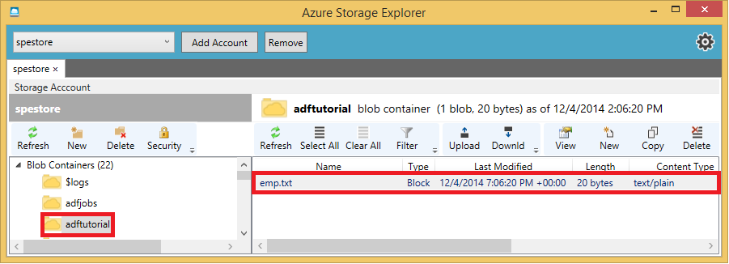

<properties 
    pageTitle="Lernprogramm: Erstellen einer Verkaufspipeline mit Kopieren Aktivität mithilfe der PowerShell Azure | Microsoft Azure" 
    description="In diesem Lernprogramm erstellen Sie eine Verkaufspipeline Azure Data Factory mithilfe der PowerShell Azure mit einer Aktivität kopieren." 
    services="data-factory" 
    documentationCenter="" 
    authors="spelluru" 
    manager="jhubbard" 
    editor="monicar"/>

<tags 
    ms.service="data-factory" 
    ms.workload="data-services" 
    ms.tgt_pltfrm="na" 
    ms.devlang="na" 
    ms.topic="get-started-article" 
    ms.date="09/16/2016" 
    ms.author="spelluru"/>

# Lernprogramm: Erstellen einer Verkaufspipeline mit Kopieren Aktivität mithilfe der PowerShell Azure
> [AZURE.SELECTOR]
- [Übersicht und erforderliche Komponenten](data-factory-copy-data-from-azure-blob-storage-to-sql-database.md)
- [Assistent zum Kopieren von](data-factory-copy-data-wizard-tutorial.md)
- [Azure-portal](data-factory-copy-activity-tutorial-using-azure-portal.md)
- [Visual Studio](data-factory-copy-activity-tutorial-using-visual-studio.md)
- [PowerShell](data-factory-copy-activity-tutorial-using-powershell.md)
- [Azure Ressourcenmanager Vorlage](data-factory-copy-activity-tutorial-using-azure-resource-manager-template.md)
- [REST-API](data-factory-copy-activity-tutorial-using-rest-api.md)
- [.NET API](data-factory-copy-activity-tutorial-using-dotnet-api.md)

In diesem Lernprogramm erstellen und Überwachen eine Factory Azure-Daten mithilfe von Azure PowerShell-Cmdlets. Der Verkaufspipeline in die Sie in diesem Lernprogramm erstellen Daten Factory verwendet eine Kopie Aktivität zum Kopieren von Daten aus einer Azure BLOB-mit einer SQL Azure-Datenbank.

Die Kopie Aktivität führt das Verschieben von Daten in Azure Data Factory. Die Aktivität wird von einer global verfügbaren Service bereitgestellt, die Daten zwischen verschiedenen Datenspeicher sicheren, zuverlässigen und skalierbare So kopieren können. [Aktivitäten zum Verschieben von Daten](data-factory-data-movement-activities.md) finden Sie im Artikel für Details zur Aktivität kopieren.   

> [AZURE.IMPORTANT] 
> Wechseln Sie im Artikel [Lernprogramm (Übersicht)](data-factory-copy-data-from-azure-blob-storage-to-sql-database.md) , und führen Sie **Voraussetzung** Schritte aus, bevor Sie dieses Lernprogramm ausführen.
>   
> In diesem Artikel befasst sich nicht auf alle Daten Factory Cmdlets aus. Umfassende Dokumentation auf Daten Factory-Cmdlets finden Sie unter [Daten Factory Cmdlet verweisen](https://msdn.microsoft.com/library/dn820234.aspx) .
  

##Erforderliche Komponenten
Abgesehen von Komponenten, die im Thema Lernprogramm Übersicht aufgeführt müssen Sie die **Azure PowerShell**installieren. Anweisungen Sie [zum Installieren und Konfigurieren von Azure PowerShell](../powershell-install-configure.md) Artikel Azure PowerShell auf Ihrem Computer installieren.

##In diesem Lernprogramm
Die folgende Tabelle enthält die Schritte, die Sie als Teil des Lernprogramms und deren Beschreibung ausführen. 

Schritt | Beschreibung
-----| -----------
[Erstellen einer Factory Azure-Daten](#create-data-factory) | In diesem Schritt erstellen Sie eine Azure-Daten Factory mit dem Namen **ADFTutorialDataFactoryPSH**. 
[Erstellen von verknüpften Diensten](#create-linked-services) | In diesem Schritt erstellen Sie zwei verknüpfte Diensten: **StorageLinkedService** und **AzureSqlLinkedService**. Die StorageLinkedService links Azure-Speicher und AzureSqlLinkedService eine SQL Azure-Datenbank mit der ADFTutorialDataFactoryPSH verknüpft.
[Erstellen von Eingabe- und Datasets ausgeben](#create-datasets) | In diesem Schritt definieren Sie zwei Datensätze (**EmpTableFromBlob** und **EmpSQLTable**). Diese Datasets werden als Eingabe- und Tabellen für die **Aktivität kopieren** in die ADFTutorialPipeline verwendet, die Sie im nächsten Schritt erstellen.
[Erstellen und Ausführen einer Verkaufspipeline](#create-pipeline) | In diesem Schritt erstellen Sie eine Verkaufspipeline mit dem Namen **ADFTutorialPipeline** in der Factory Daten: **ADFTutorialDataFactoryPSH**. Der Verkaufspipeline weist eine **Kopie Aktivitäten** , die Daten aus einer Azure kopiert Blob zu einer Ausgabe Azure-Datenbank.
[Monitor Datasets und Verkaufspipeline](#monitor-pipeline) | In diesem Schritt überwachen Sie die Datasets und der Verkaufspipeline Azure PowerShell in diesem Schritt verwenden.

## Erstellen von Daten factory
In diesem Schritt mithilfe erstellen Sie der PowerShell Azure eine Azure-Daten Factory mit dem Namen **ADFTutorialDataFactoryPSH**.

1. Starten Sie **PowerShell**. Lassen Sie Azure PowerShell bis zum Ende des Lernprogramms geöffnet. Wenn Sie schließen und erneut öffnen, müssen Sie die Befehle erneut ausführen.
    1. Führen Sie den folgenden Befehl aus, und geben Sie den Benutzernamen und das Kennwort für die Anmeldung bei der Azure-Portal:
    
            Login-AzureRmAccount   
    2. Führen Sie zum Anzeigen aller Abonnements für dieses Konto den folgenden Befehl ein:

            Get-AzureRmSubscription 
    3. Führen Sie den folgenden Befehl aus, um das Abonnement auszuwählen, dem Sie mit arbeiten möchten. Ersetzen Sie ** &lt;NameOfAzureSubscription** &gt; durch den Namen Ihres Abonnements Azure:

            Get-AzureRmSubscription -SubscriptionName <NameOfAzureSubscription> | Set-AzureRmContext

3. Erstellen eine Azure Ressourcengruppe mit dem Namen: **ADFTutorialResourceGroup** , indem Sie den folgenden Befehl ausführen:
   
        New-AzureRmResourceGroup -Name ADFTutorialResourceGroup  -Location "West US"

    Einige der Schritte in diesem Lernprogramm wird davon ausgegangen, dass Sie die Ressourcengruppe mit dem Namen **ADFTutorialResourceGroup**verwenden. Wenn Sie eine andere Ressourcengruppe verwenden, müssen Sie es anstelle von ADFTutorialResourceGroup in diesem Lernprogramm verwenden. 
4. Führen Sie das Cmdlet **Neu-AzureRmDataFactory** zum Erstellen einer mit dem Namen "Data Factory": **ADFTutorialDataFactoryPSH**:  

        New-AzureRmDataFactory -ResourceGroupName ADFTutorialResourceGroup -Name ADFTutorialDataFactoryPSH –Location "West US"

    
Beachten Sie die folgenden Punkte:
 
- Der Name der Factory Azure-Daten muss global eindeutig sein. Wenn Sie die folgende Fehlermeldung angezeigt, ändern Sie den Namen (beispielsweise YournameADFTutorialDataFactoryPSH). Verwenden Sie diesen Namen anstelle von ADFTutorialFactoryPSH während der Ausführung der Schritte in diesem Lernprogramm. Finden Sie unter [Data Factory - Regeln zur Benennung von](data-factory-naming-rules.md) Thema Benennungskonventionen für Daten Factory Elemente.
    
        Data factory name “ADFTutorialDataFactoryPSH” is not available
- Um Daten Factory-Instanzen erstellen zu können, müssen Sie ein Mitwirkender/Administrator des Abonnements Azure sein
- Der Name der Factory Daten möglicherweise als DNS-Namen in der Zukunft und somit werden öffentlich sichtbar registriert werden.
- Wenn Sie die Fehlermeldung: "**Abonnement ist nicht registriert, um den Namespace Microsoft.DataFactory verwenden**", führen Sie eine der folgenden Aktionen, und versuchen Sie erneut veröffentlichen: 

    - Führen Sie in Azure PowerShell zum Registrieren des Daten Factory-Anbieters den folgenden Befehl aus: 
        
            Register-AzureRmResourceProvider -ProviderNamespace Microsoft.DataFactory
    
        Führen Sie den folgenden Befehl aus, um zu bestätigen, dass der Daten Factory-Anbieter registriert ist: 
    
            Get-AzureRmResourceProvider
    - Melden Sie sich mit dem Azure Abonnement in der [Azure-Portal](https://portal.azure.com) und navigieren Sie zu einer Blade Daten Factory (oder) erstellen Sie eine Factory Daten im Azure-Portal. Diese Aktion registriert automatisch den Anbieter für Sie.

## Erstellen von verknüpften Diensten
Verknüpfte Services Datenspeicher verknüpfen oder Dienste für eine Fabrik Azure-Daten zu berechnen. Ein Datenspeicher möglich-Speicher Azure, SQL Azure-Datenbank oder einer lokalen SQL Server-Datenbank, die Eingabedaten enthält oder Ausgabedaten für eine Fabrik Daten Verkaufspipeline speichert. Computing-Service ist der Dienst, der Eingabedaten verarbeitet und Ausgabedaten erzeugt. 

In diesem Schritt erstellen Sie zwei verknüpfte Diensten: **StorageLinkedService** und **AzureSqlLinkedService**. StorageLinkedService Dienst Links verknüpft ein Azure-Speicher-Konto und AzureSqlLinkedService verknüpft Azure SQL-Datenbank mit den Daten Factory: **ADFTutorialDataFactoryPSH**. Erstellen Sie eine Verkaufspipeline später in diesem Lernprogramm, die Daten aus einem Container Blob in StorageLinkedService zu einer SQL-Tabelle in AzureSqlLinkedService kopiert.

### Erstellen Sie einen verknüpften Dienst für ein Konto Azure-Speicher
1.  Erstellen einer JSON-Datei mit dem Namen **StorageLinkedService.json** in der **C:\ADFGetStartedPSH** mit dem folgenden Inhalt. Erstellen Sie den Ordner ADFGetStartedPSH aus, wenn es nicht bereits vorhanden ist.

            {
                "name": "StorageLinkedService",
                "properties": {
                    "type": "AzureStorage",
                    "typeProperties": {
                        "connectionString": "DefaultEndpointsProtocol=https;AccountName=<accountname>;AccountKey=<accountkey>"
                    }
                }
            }

    Ersetzen von **Kontoname** und **Accountkey** mit Namen und den Schlüssel Ihres Kontos Azure-Speicher.
2.  Wechseln Sie der **PowerShell Azure**zu dem Ordner **ADFGetStartedPSH** . 
3.  Das Cmdlet " **New-AzureRmDataFactoryLinkedService** " können Sie um einen verknüpften Dienst zu erstellen. Dieses Cmdlet und anderen Daten Factory-Cmdlets, die Sie in diesem Lernprogramm verwenden erfordert Werte für die Parameter **ResourceGroupName** und **DataFactoryName** übergeben. Alternativ können Sie **Get-AzureRmDataFactory** zum Abrufen von DataFactory-Objekt, und das Objekt zu übergeben, ohne die Eingabe von ResourceGroupName und DataFactoryName jedes Mal, wenn Sie ein Cmdlet ausführen. Führen Sie den folgenden Befehl aus, um das Cmdlet " **Get-AzureRmDataFactory** " die Ausgabe einer Variablen zuweisen: **$df**: 

        $df=Get-AzureRmDataFactory -ResourceGroupName ADFTutorialResourceGroup -Name ADFTutorialDataFactoryPSH

4.  Führen Sie nun das Cmdlet **Neu-AzureRmDataFactoryLinkedService** zum Erstellen von verknüpften Diensts: **StorageLinkedService**. 

        New-AzureRmDataFactoryLinkedService $df -File .\StorageLinkedService.json

    Wenn Sie hadn't das Cmdlet " **Get-AzureRmDataFactory** " ausführen, und die Ausgabe **$df** Variablen zugewiesen, Sie die Werte für die Parameter ResourceGroupName und DataFactoryName wie folgt angeben müssen.   
        
        New-AzureRmDataFactoryLinkedService -ResourceGroupName ADFTutorialResourceGroup -DataFactoryName ADFTutorialDataFactoryPSH -File .\StorageLinkedService.json

    Wenn Sie die PowerShell Azure in der Mitte des Lernprogramms schließen, haben Sie ausführen das Cmdlet "Get-AzureRmDataFactory" nächste Mal starten von Azure PowerShell, um das Lernprogramm abzuschließen.

### Erstellen Sie einen verknüpften Dienst für eine SQL Azure-Datenbank
1.  Erstellen einer JSON-Datei mit dem Namen AzureSqlLinkedService.json mit dem folgenden Inhalt:

            {
                "name": "AzureSqlLinkedService",
                "properties": {
                    "type": "AzureSqlDatabase",
                    "typeProperties": {
                        "connectionString": "Server=tcp:<server>.database.windows.net,1433;Database=<databasename>;User ID=<user>@<server>;Password=<password>;Trusted_Connection=False;Encrypt=True;Connection Timeout=30"
                    }
                }
            }

    Ersetzen Sie **Servername**, **Datenbankname**, **username@servername**, und das **Kennwort** mit den Namen der SQL Azure-Server, die Datenbank, die Benutzerkonto sowie Kennwort.

2.  Führen Sie zum Erstellen eines verknüpften Diensts den folgenden Befehl ein: 
    
        New-AzureRmDataFactoryLinkedService $df -File .\AzureSqlLinkedService.json

    Bestätigen Sie, dass die Einstellung für **den Zugriff auf Azure Services** für Ihre SQL Azure-Server aktiviert ist. Um zu überprüfen, und aktivieren Sie es, führen Sie die folgenden Schritte aus:

    1. Klicken Sie auf **Durchsuchen** -Hub auf der linken Seite, und klicken Sie auf **SQL Server**.
    2. Wählen Sie Ihren Server, und klicken Sie auf dem SQL SERVER-Blade auf **EINSTELLUNGEN** .
    3. Klicken Sie in das Blade **EINSTELLUNGEN** auf **Firewall**.
    4. Klicken Sie in das Blade **Firewall-Einstellungen** für den **Zugriff auf Dienste Azure zulassen**auf **auf** .
    5. Klicken Sie auf **aktiver** Hub auf der linken Seite an die **Daten Factory** Blade wechseln, die Sie auf wurden.
    

## Datasets erstellen

Im vorherigen Schritt erstellt Sie verknüpfte Diensten **StorageLinkedService** und **AzureSqlLinkedService** ein Speicher Azure-Konto und SQL Azure-Datenbank Fabrik Daten verknüpfen: **ADFTutorialDataFactoryPSH**. In diesem Schritt erstellen Sie Datasets, die die Eingabe- und Daten für die Aktivität kopieren in der Verkaufspipeline darstellen, die Sie im nächsten Schritt erstellen. 

Eine Tabelle ist ein rechteckiges Dataset, und es ist der einzige Typ von Dataset, das jetzt unterstützt wird. Die Eingabewerte Tabelle in diesem Lernprogramm bezieht sich auf einen Container Blob in den Azure-Speicher, den StorageLinkedService verweist. Die Ausgabetabelle bezieht sich auf einer SQL-Tabelle in der SQL Azure-Datenbank, die auf AzureSqlLinkedService zeigt.  

### Vorbereitung des Lernprogramms Azure BLOB-Speicher und Azure SQL-Datenbank
Überspringen Sie diesen Schritt, wenn Sie aus dem Artikel [Kopieren von Daten aus dem Blob-Speicher mit SQL-Datenbank](data-factory-copy-data-from-azure-blob-storage-to-sql-database.md) anhand des Lernprogramms überschritten haben. 

Führen Sie die folgenden Schritte aus, um die Azure Blob-Speicher und SQL Azure-Datenbank in diesem Lernprogramm vorzubereiten. 
 
* Erstellen Sie einen Blob-Container mit dem Namen **Adftutorial** in der Azure Blob-Speicher, dem auf **StorageLinkedService** verweist. 
* Erstellen und Hochladen einer Textdatei, **emp.txt**, als Blob in den Container **Adftutorial** . 
* Erstellen einer Tabelle mit dem Namen **emp** in der Azure SQL-Datenbank in der SQL Azure-Datenbank, der auf **AzureSqlLinkedService** verweist.

1. Starten Sie den Editor, fügen Sie den folgenden Text, und speichern Sie es als **emp.txt** **C:\ADFGetStartedPSH** Ordner auf Ihrer Festplatte. 

        John, Doe
        Jane, Doe
                
2. Verwenden Sie Tools wie [Azure-Speicher-Explorer](https://azurestorageexplorer.codeplex.com/) aus, um den Container **Adftutorial** erstellen und die **emp.txt** -Datei auf den Container hochzuladen.

    
3. Verwenden Sie das folgende SQL-Skript, um die Tabelle **emp** in Ihrem SQL Azure-Datenbank zu erstellen.  

        CREATE TABLE dbo.emp 
        (
            ID int IDENTITY(1,1) NOT NULL,
            FirstName varchar(50),
            LastName varchar(50),
        )
        GO

        CREATE CLUSTERED INDEX IX_emp_ID ON dbo.emp (ID); 

    Wenn Sie SQL Server 2014 auf Ihrem Computer installiert haben: Anweisungen aus [Schritt2: Herstellen einer Verbindung mit der Verwaltung von Azure SQL-Datenbank mit SQL Server Management Studio SQL-Datenbank mit](../sql-database/sql-database-manage-azure-ssms.md) Artikel, um eine Verbindung mit dem SQL Azure-Server, und führen Sie das Skript SQL.

    Wenn Sie Ihren Kunden Zugriff auf den SQL Azure-Server nicht zulässig ist, müssen Sie zum Konfigurieren der Firewall für Ihre SQL Azure-Server für den Zugriff von Ihrem Computer (IP-Adresse). Finden Sie [in diesem Artikel](../sql-database/sql-database-configure-firewall-settings.md) Schritte zum Konfigurieren der Firewall für Ihre SQL Azure-Server aus.
        
### Erstellen von dataset 
Eine Tabelle ist ein rechteckiges Dataset und über ein Schema verfügt. In diesem Schritt erstellen Sie eine Tabelle mit dem Namen **EmpBlobTable** , die zu einem Container Blob in den Azure-Speicher dargestellt werden vom Dienst **StorageLinkedService** verknüpft verweist. Diese Container Blob (**Adftutorial**) enthält die Eingabedaten in der Datei: **emp.txt**. 

1.  Erstellen einer JSON-Datei mit dem Namen **EmpBlobTable.json** im Ordner " **C:\ADFGetStartedPSH** " mit dem folgenden Inhalt:

            {
              "name": "EmpTableFromBlob",
              "properties": {
                "structure": [
                  {
                    "name": "FirstName",
                    "type": "String"
                  },
                  {
                    "name": "LastName",
                    "type": "String"
                  }
                ],
                "type": "AzureBlob",
                "linkedServiceName": "StorageLinkedService",
                "typeProperties": {
                  "fileName": "emp.txt",
                  "folderPath": "adftutorial/",
                  "format": {
                    "type": "TextFormat",
                    "columnDelimiter": ","
                  }
                },
                "external": true,
                "availability": {
                  "frequency": "Hour",
                  "interval": 1
                }
              }
            }
    
    Beachten Sie die folgenden Punkte: 
    
    - DataSet **Typ** wird auf **AzureBlob**festgelegt.
    - **LinkedServiceName** wird auf **StorageLinkedService**festgelegt. 
    - **Ordnerpfad** wird an den Container **Adftutorial** festgelegt. 
    - **FileName** wird auf **emp.txt**festgelegt. Wenn Sie den Namen des Blob nicht angeben, gilt als eine Eingabedaten Daten aus allen Blobs im Container.  
    - **Art** der Formatierung wird auf **TextFormat** festgelegt.
    - Es gibt zwei Felder in der Textdatei – **FirstName** und **LastName** – getrennt durch ein Komma (**ColumnDelimiter**) 
    - Die **Verfügbarkeit** wird festgelegt, um **stündlich** (**Häufigkeit** auf **Stunde** festgelegt ist und **Intervall** auf **1**festgelegt ist). Daher sucht Daten Factory Eingabedaten stündlich im Stammordner im Container Blob (**Adftutorial**).

    Wenn Sie einen **Dateinamen** für die **Eingabewerte** **Tabelle**nicht angeben, werden alle Dateien/Blobs im Ordner "Eingabe" (**Ordnerpfad**) als Eingaben angesehen. Wenn Sie einen Dateinamen in das JSON angeben, wird nur das angegebene Datei/Blob Asn Eingabe betrachtet. 
 
    Wenn Sie einen **Dateinamen** für eine **Ausgabetabelle**nicht angeben, werden die generierten Dateien in den **Ordnerpfad** im folgenden Format benannt: Kalenderdaten. < Guid\>txt (Beispiel: Data.0a405f8a-93ff-4c6f-b3be-f69616f1df7a.txt.).

    Um **Ordnerpfad** und **Dateiname** dynamisch basierend auf der Uhrzeit **SliceStart** festzulegen, verwenden Sie die Eigenschaft **PartitionedBy** ein. Im folgenden Beispiel Ordnerpfad verwendet Jahr, Monat und Tag aus der SliceStart (Startzeit für das Segment des verarbeiteten) und FileName verwendet Stunde aus der SliceStart. Wenn Sie ein Segment für 2016 gefertigt wird beispielsweise-10-20T08:00:00, der Ordnername auf Wikidatagateway/Wikisampledataout/2016/10/20 festgelegt ist und der Dateinamen auf 08.csv festgelegt ist. 

            "folderPath": "wikidatagateway/wikisampledataout/{Year}/{Month}/{Day}",
            "fileName": "{Hour}.csv",
            "partitionedBy": 
            [
                { "name": "Year", "value": { "type": "DateTime", "date": "SliceStart", "format": "yyyy" } },
                { "name": "Month", "value": { "type": "DateTime", "date": "SliceStart", "format": "MM" } }, 
                { "name": "Day", "value": { "type": "DateTime", "date": "SliceStart", "format": "dd" } }, 
                { "name": "Hour", "value": { "type": "DateTime", "date": "SliceStart", "format": "hh" } } 
            ],

    Details zu JSON-Eigenschaften finden Sie unter [Scripting JSON-Referenz](http://go.microsoft.com/fwlink/?LinkId=516971) .

2.  Führen Sie den folgenden Befehl aus, um Daten Factory Dataset zu erstellen.

        New-AzureRmDataFactoryDataset $df -File .\EmpBlobTable.json

### Die Ausgabe Dataset erstellen
In diesem Schritt erstellen Sie eine Ausgabe Dataset mit dem Namen **EmpSQLTable**. Dieses Dataset verweist auf eine SQL-Tabelle (**emp**) in der SQL Azure-Datenbank, die durch **AzureSqlLinkedService**dargestellt werden. Der Verkaufspipeline werden Daten aus dem Eingabe-Blob in der Tabelle **emp** kopiert. 

1.  Erstellen einer JSON-Datei mit dem Namen **EmpSQLTable.json** im Ordner " **C:\ADFGetStartedPSH** " mit dem folgenden Inhalt:
        
            {
              "name": "EmpSQLTable",
              "properties": {
                "structure": [
                  {
                    "name": "FirstName",
                    "type": "String"
                  },
                  {
                    "name": "LastName",
                    "type": "String"
                  }
                ],
                "type": "AzureSqlTable",
                "linkedServiceName": "AzureSqlLinkedService",
                "typeProperties": {
                  "tableName": "emp"
                },
                "availability": {
                  "frequency": "Hour",
                  "interval": 1
                }
              }
            }

     Beachten Sie die folgenden Punkte: 
    
    * DataSet **Typ** wird auf **AzureSqlTable**festgelegt.
    * **LinkedServiceName** wird auf **AzureSqlLinkedService**festgelegt.
    * **Tabellenname** ist **emp**festgelegt.
    * Es gibt drei Spalten – **ID**, **FirstName**und **LastName** – in der Tabelle emp in der Datenbank ein. ID ist eine Identitätsspalte, daher Sie nur **FirstName** und **LastName** hier angeben müssen.
    * Die **Verfügbarkeit** wird **stündlich** (**Häufigkeit** auf **Hour** festgelegten und **Intervall** auf **1**festgelegt) festgelegt.  Der Dienst Daten Factory generiert ein Ausgabe Daten Segments stündlich in der Tabelle **emp** der SQL Azure-Datenbank.

2.  Führen Sie den folgenden Befehl aus, um Daten Factory Dataset zu erstellen. 
    
        New-AzureRmDataFactoryDataset $df -File .\EmpSQLTable.json

## Erstellen der Verkaufspipeline
In diesem Schritt erstellen Sie eine Verkaufspipeline mit einer **Kopie Aktivitäten** , die **EmpTableFromBlob** als Eingabe verwendet und **EmpSQLTable** in der Ausgabe.

1.  Erstellen einer JSON-Datei mit dem Namen **ADFTutorialPipeline.json** im Ordner " **C:\ADFGetStartedPSH** " mit dem folgenden Inhalt: 
    
             {
              "name": "ADFTutorialPipeline",
              "properties": {
                "description": "Copy data from a blob to Azure SQL table",
                "activities": [
                  {
                    "name": "CopyFromBlobToSQL",
                    "description": "Push Regional Effectiveness Campaign data to Azure SQL database",
                    "type": "Copy",
                    "inputs": [
                      {
                        "name": "EmpTableFromBlob"
                      }
                    ],
                    "outputs": [
                      {
                        "name": "EmpSQLTable"
                      }
                    ],
                    "typeProperties": {
                      "source": {
                        "type": "BlobSource"
                      },
                      "sink": {
                        "type": "SqlSink"
                      }
                    },
                    "Policy": {
                      "concurrency": 1,
                      "executionPriorityOrder": "NewestFirst",
                      "style": "StartOfInterval",
                      "retry": 0,
                      "timeout": "01:00:00"
                    }
                  }
                ],
                "start": "2016-08-09T00:00:00Z",
                "end": "2016-08-10T00:00:00Z",
                "isPaused": false
              }
            }

    Beachten Sie die folgenden Punkte:

    - Im Abschnitt Aktivitäten gibt es nur eine Aktivität zu **Kopieren**, deren **Typ** festgelegt ist.
    - Eingabe für die Aktivität auf **EmpTableFromBlob** festgelegt ist, und die Ausgabe für die Aktivität auf **EmpSQLTable**festgelegt ist.
    - Im Abschnitt **Transformation** **BlobSource** als den Quelltyp angegeben wird, und **SqlSink** als den Typ der Empfänger angegeben.

    Ersetzen Sie den Wert der Eigenschaft **beginnen Sie** mit dem aktuellen Tag und die **Endzeit** der Wert mit dem nächsten Tag. Beide starten und beenden Zeiteingabe muss im [ISO-Format](http://en.wikipedia.org/wiki/ISO_8601). Beispiel: 2016-10-14T16:32:41Z. **Die Endzeit** ist optional, aber wir in diesem Lernprogramm verwenden. 
    
    Wenn Sie keinen Wert für die Eigenschaft **Ende** angeben, wird es als "**Start + 48 Stunden**" berechnet. Wenn der Verkaufspipeline endlos ausführen möchten, geben Sie als Wert für die Eigenschaft **Ende** **9/9/9999** an.
    
    Im Beispiel werden 24 Datensegmente wie jedes Segment Daten stündlich erstellt wird.
    
    Details zu JSON-Eigenschaften finden Sie unter [Scripting JSON-Referenz](http://go.microsoft.com/fwlink/?LinkId=516971) .
2.  Führen Sie den folgenden Befehl zum Erstellen einer Tabelle Daten Factory. 
        
        New-AzureRmDataFactoryPipeline $df -File .\ADFTutorialPipeline.json

**Herzlichen Glückwunsch!** Sie haben erfolgreich erstellt eine Fabrik Azure-Daten, verknüpften Diensten, Tabellen und eine Verkaufspipeline und der Verkaufspipeline geplant.

## Monitor Verkaufspipeline
In diesem Schritt verwenden Sie den PowerShell Azure zum Überwachen der Aktivitäten in einer Factory Azure-Daten in ein.

1.  **Get-AzureRmDataFactory** ausführen und die Ausgabe einer Variablen $df zuzuweisen.

        $df=Get-AzureRmDataFactory -ResourceGroupName ADFTutorialResourceGroup -Name ADFTutorialDataFactoryPSH
 
2.  Führen Sie **Get-AzureRmDataFactorySlice** , um die Details zu der der **EmpSQLTable**, alle Segmente abzurufen, die Ausgabetabelle für die der Verkaufspipeline ist.  

        Get-AzureRmDataFactorySlice $df -DatasetName EmpSQLTable -StartDateTime 2016-08-09T00:00:00

    Ersetzen Sie Jahr, Monat und Datumsteil des Parameters **StartDateTime** durch das aktuelle Jahr, Monat und Datum ein. Diese Einstellung sollte den Wert **Start** in der Verkaufspipeline JSON entsprechen. 

    Es sollte 24 Segmente, eine für jede Stunde von 12 Uhr des aktuellen Tags bis 12 Uhr des nächsten Tages angezeigt. 
    
    **Beispiel für die Ausgabe:**

        ResourceGroupName : ADFTutorialResourceGroup
        DataFactoryName   : ADFTutorialDataFactoryPSH
        TableName         : EmpSQLTable
        Start             : 8/9/2016 12:00:00 AM
        End               : 8/9/2016 1:00:00 AM
        RetryCount        : 0
        Status            : Waiting
        LatencyStatus     :
        LongRetryCount    : 0

3.  Ausführen **Get-AzureRmDataFactoryRun** können Sie die Details der Aktivität zu gelangen, die für einen **bestimmten** Speicherbereich ausgeführt wird. Ändern Sie den Wert des Parameters **StartDateTime** , der **die Startzeit des Segments aus der Ausgabe** entsprechen. Der Wert von der **StartDateTime** muss im [ISO-Format](http://en.wikipedia.org/wiki/ISO_8601). 

        Get-AzureRmDataFactoryRun $df -DatasetName EmpSQLTable -StartDateTime 2016-08-09T00:00:00

    Die Ausgabe ähnlich wie im folgenden Beispielausgabe sollte angezeigt werden:

        Id                  : 3404c187-c889-4f88-933b-2a2f5cd84e90_635614488000000000_635614524000000000_EmpSQLTable
        ResourceGroupName   : ADFTutorialResourceGroup
        DataFactoryName     : ADFTutorialDataFactoryPSH
        TableName           : EmpSQLTable
        ProcessingStartTime : 8/9/2016 11:03:28 PM
        ProcessingEndTime   : 8/9/2016 11:04:36 PM
        PercentComplete     : 100
        DataSliceStart      : 8/9/2016 10:00:00 PM
        DataSliceEnd        : 8/9/2016 11:00:00 PM
        Status              : Succeeded
        Timestamp           : 8/9/2016 11:03:28 PM
        RetryAttempt        : 0
        Properties          : {}
        ErrorMessage        :
        ActivityName        : CopyFromBlobToSQL
        PipelineName        : ADFTutorialPipeline
        Type                : Copy

Finden Sie unter [Daten Factory Cmdlet Referenz] [ cmdlet-reference] umfassende Dokumentation zur Daten Factory-Cmdlets. 

## Zusammenfassung
In diesem Lernprogramm erstellt Sie eine Fabrik Azure-Daten so kopieren Sie Daten aus einer Azure BLOB-mit einer SQL Azure-Datenbank. Sie mit der PowerShell die Daten Factory, verknüpften Diensten, Datasets und eine Verkaufspipeline erstellt. Hier sind die allgemeinen Schritte, die Sie in diesem Lernprogramm ausgeführt:  

1.  Erstellt eine Azure- **Daten Factory**.
2.  Erstellt von **verknüpften Diensten**:
    1. Ein **Azure-Speicher** verknüpft Dienst auf Ihr Konto Azure-Speicher zu verknüpfen, die Eingabedaten enthält.    
    2. Einer **SQL Azure** -verknüpfte Dienst Ihrer SQL Azure-Datenbank zu verknüpfen, die die Ausgabedaten enthält. 
3.  Erstellt **Datasets** , die Eingabedaten und Ausgabedaten für Pipelines zu beschreiben.
4.  Erstellt eine **Verkaufspipeline** mit einer **Kopie Aktivität** mit **BlobSource** als Quell- und **SqlSink** als Empfänger. 

## Siehe auch
| Thema | Beschreibung |
| :---- | :---- |
| [Aktivitäten zum Verschieben von Daten](data-factory-data-movement-activities.md) | Dieser Artikel enthält ausführliche Informationen zur Aktivität kopieren Sie im Lernprogramm verwendet. |
| [Planung und Ausführung](data-factory-scheduling-and-execution.md) | In diesem Artikel wird erläutert, die Planung und Ausführung Aspekte des Modells für Azure Data Factory-Anwendung. |
| [Pipelines](data-factory-create-pipelines.md) | Dieser Artikel soll Sie Rohrleitungen und Aktivitäten in Azure Data Factory verstehen |
| [Datasets](data-factory-create-datasets.md) | In diesem Artikel können Sie die Datasets in Azure Data Factory zu verstehen.
| [Überwachen und Verwalten von Pipelines mit App für die Überwachung](data-factory-monitor-manage-app.md) | Dieser Artikel beschreibt, wie überwachen, verwalten und Debuggen Pipelines die Überwachung und Verwaltung App verwenden. 

[use-custom-activities]: data-factory-use-custom-activities.md
[troubleshoot]: data-factory-troubleshoot.md
[developer-reference]: http://go.microsoft.com/fwlink/?LinkId=516908

[cmdlet-reference]: https://msdn.microsoft.com/library/azure/dn820234.aspx
[old-cmdlet-reference]: https://msdn.microsoft.com/library/azure/dn820234(v=azure.98).aspx
[azure-free-trial]: http://azure.microsoft.com/pricing/free-trial/

[azure-portal]: http://portal.azure.com
[download-azure-powershell]: ../powershell-install-configure.md
[data-factory-introduction]: data-factory-introduction.md

[image-data-factory-get-started-storage-explorer]: ./media/data-factory-copy-activity-tutorial-using-powershell/getstarted-storage-explorer.png

[sql-management-studio]: ../sql-database/sql-database-manage-azure-ssms.md
 