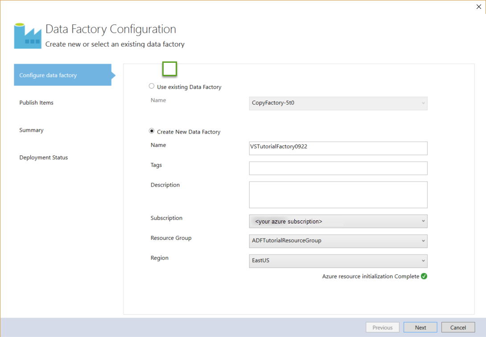
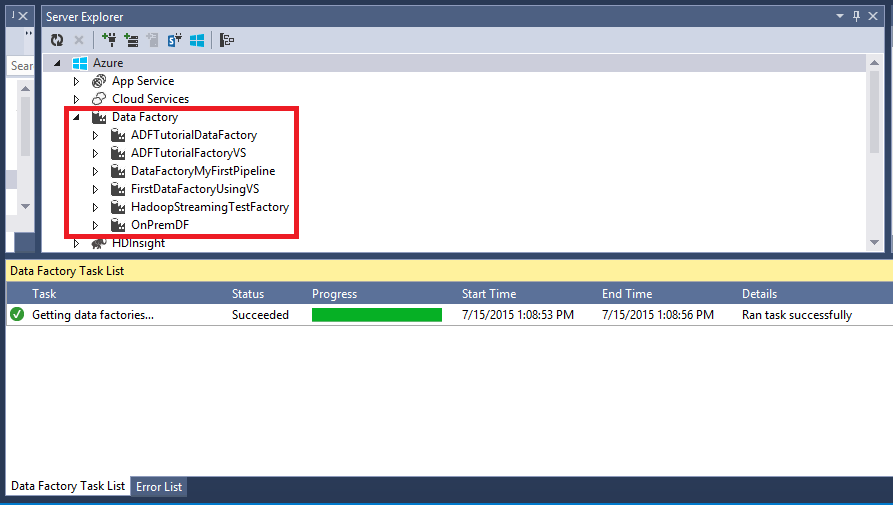

<properties 
    pageTitle="Lernprogramm: Erstellen einer Verkaufspipeline mit Kopieren Aktivität mit Visual Studio | Microsoft Azure" 
    description="In diesem Lernprogramm erstellen Sie eine Verkaufspipeline Azure Data Factory mit einer Kopie Aktivität mit Visual Studio." 
    services="data-factory" 
    documentationCenter="" 
    authors="spelluru" 
    manager="jhubbard" 
    editor="monicar"/>

<tags 
    ms.service="data-factory" 
    ms.workload="data-services" 
    ms.tgt_pltfrm="na" 
    ms.devlang="na" 
    ms.topic="get-started-article" 
    ms.date="10/17/2016" 
    ms.author="spelluru"/>

# Lernprogramm: Erstellen einer Verkaufspipeline mit Kopieren Aktivität mit Visual Studio
> [AZURE.SELECTOR]
- [Übersicht und erforderliche Komponenten](data-factory-copy-data-from-azure-blob-storage-to-sql-database.md)
- [Assistent zum Kopieren von](data-factory-copy-data-wizard-tutorial.md)
- [Azure-portal](data-factory-copy-activity-tutorial-using-azure-portal.md)
- [Visual Studio](data-factory-copy-activity-tutorial-using-visual-studio.md)
- [PowerShell](data-factory-copy-activity-tutorial-using-powershell.md)
- [Azure Ressourcenmanager Vorlage](data-factory-copy-activity-tutorial-using-azure-resource-manager-template.md)
- [REST-API](data-factory-copy-activity-tutorial-using-rest-api.md)
- [.NET API](data-factory-copy-activity-tutorial-using-dotnet-api.md)

In diesem Lernprogramm erfahren Sie, wie erstellen und Überwachen einer Azure Daten Factory mit Visual Studio. Der Verkaufspipeline in den Daten Factory verwendet eine Kopie Aktivität zum Kopieren von Daten aus Azure BLOB-Speicher mit Azure SQL-Datenbank.

Hier sind die Schritte, die Sie als Teil dieses Lernprogramms ausführen:

1. Erstellen von zwei verknüpften Diensten: **AzureStorageLinkedService1** und **AzureSqlinkedService1**. 

    Die AzureStorageLinkedService1 links Azure-Speicher und AzureSqlLinkedService1 verknüpft Azure SQL-Datenbank mit den Daten Factory: **ADFTutorialDataFactoryVS**. Die eingegebenen Daten für die Verkaufspipeline befinden sich in der Azure Blob-Speicher ein Blob-Container und Ausgabe von Daten in einer Tabelle in der SQL Azure-Datenbank gespeichert ist. Daher, fügen Sie diese zwei Datenspeicher als verknüpften Diensten Fabrik Daten ein.
2. Erstellen Sie zwei Datasets: **InputDataset** und **OutputDataset**, die die Eingabe/Ausgabe Daten darstellen, die in die Datenspeicher gespeichert ist. 

    Für die InputDataset Geben Sie den Blob-Container, der einen Blob für die Quelldaten enthält. Für die OutputDataset Geben Sie die SQL-Tabelle, die die Ausgabedaten speichert. Außerdem können andere Eigenschaften wie Struktur, Verfügbarkeit und Richtlinie angeben.
3. Erstellen einer benannten **ADFTutorialPipeline** in den ADFTutorialDataFactoryVS Verkaufspipeline an. 

    Der Verkaufspipeline verfügt über eine **Kopie Aktivitäten** , die der Ausgabe Azure SQL-Tabelle Kopien Eingabemethoden-Daten aus der Azure BLOB. Die Kopie Aktivität führt das Verschieben von Daten in Azure Data Factory. Die Aktivität wird von einer global verfügbaren Service bereitgestellt, die Daten zwischen verschiedenen Datenspeicher sicheren, zuverlässigen und skalierbare So kopieren können. [Aktivitäten zum Verschieben von Daten](data-factory-data-movement-activities.md) finden Sie im Artikel für Details zur Aktivität kopieren. 
4. Erstellen Sie eine Daten Factory mit dem Namen **VSTutorialFactory**. Bereitstellen der Daten Factory und alle Daten Factory Personen (verknüpften Diensten, Tabellen und der Verkaufspipeline).    

## Erforderliche Komponenten

1. [Lernprogramm Übersicht](data-factory-copy-data-from-azure-blob-storage-to-sql-database.md) Artikel lesen Sie, und führen Sie die Schritte **Voraussetzung** aus. 
2. Sie müssen ein **Administrator des Abonnements Azure** Data Factory Personen in Azure Data Factory veröffentlichen können sein.  
3. Sie müssen Folgendes auf Ihrem Computer installiert sein: 
    - Visual Studio-2013 oder Visual Studio 2015
    - Herunterladen von Azure SDK für Visual Studio-2013 oder Visual Studio 2015. Navigieren Sie zur [Downloadseite Azure](https://azure.microsoft.com/downloads/) , und klicken Sie auf **im Vergleich mit einer 2013** oder **im Vergleich mit einer 2015** im Abschnitt **.NET** .
    - Laden Sie die neuesten Azure Data Factory-Plug-In für Visual Studio: [im Vergleich mit einer 2013](https://visualstudiogallery.msdn.microsoft.com/754d998c-8f92-4aa7-835b-e89c8c954aa5) oder [im Vergleich mit einer 2015](https://visualstudiogallery.msdn.microsoft.com/371a4cf9-0093-40fa-b7dd-be3c74f49005). Sie können auch das Plug-in aktualisieren, indem Sie die folgenden Schritte ausführen: Klicken Sie im Menü **Extras**auf -> **Extensions und Updates** -> **Online** -> **Visual Studio Gallery** -> **Microsoft Azure Data Factory-Tools für Visual Studio** -> **Aktualisieren**.

## Visual Studio-Projekt erstellen 
1. Starten Sie **Visual Studio 2013**. Klicken Sie auf **Datei**, zeigen Sie auf **neu**, und klicken Sie auf **Projekt**. Klicken Sie im Dialogfeld **Neues Projekt** sollte angezeigt werden.  
2. Klicken Sie im Dialogfeld **Neues Projekt** wählen Sie die Vorlage **DataFactory** aus, und klicken Sie auf **Leere Daten Factory-Projekt**. Wenn Sie die Vorlage DataFactory angezeigt werden, schließen Sie Visual Studio, installieren Sie Azure SDK für Visual Studio 2013 und erneut öffnen Sie Visual Studio.  

    

3. Geben Sie einen **Namen** für das Projekt, **Speicherort**und einen Namen für die **Lösung**, und klicken Sie auf **OK**.

     

## Erstellen von verknüpften Diensten
Verknüpfte Services Datenspeicher verknüpfen oder Dienste für eine Fabrik Azure-Daten zu berechnen. Finden Sie unter [unterstützte Daten gespeichert sind](data-factory-data-movement-activities.md##supported-data-stores-and-formats) , für alle Quellen und senken unterstützt, indem Sie die Aktivität kopieren. Finden Sie unter für die Liste der berechnen Dienste von Daten Factory unterstützt [verknüpfte Diensten zu berechnen](data-factory-compute-linked-services.md) . In diesem Lernprogramm verwenden Sie keine Computing-Service. 

In diesem Schritt erstellen Sie zwei verknüpfte Diensten: **AzureStorageLinkedService1** und **AzureSqlLinkedService1**. AzureStorageLinkedService1 Dienst Links verknüpft ein Azure-Speicher-Konto und AzureSqlLinkedService verknüpft Azure SQL-Datenbank mit den Daten Factory: **ADFTutorialDataFactory**. 

### Erstellen der Azure verknüpft Speicherdienst

4. Mit der rechten Maustaste **Verknüpften Diensten** Explorer Lösung, zeigen Sie auf **Hinzufügen**, und klicken Sie auf **Neues Element**.      
5. Wählen Sie im Dialogfeld **Neues Element hinzufügen** aus der Liste **Verknüpfte Azure-Speicherdienst** aus, und klicken Sie auf **Hinzufügen**. 

    
 
3. Ersetzen Sie `<accountname>` und `<accountkey>`* mit dem Namen der Ihr Konto Azure-Speicher und den zugehörigen Schlüssel. 

    

4. Speichern Sie die Datei **AzureStorageLinkedService1.json** .

> Details zu JSON-Eigenschaften finden Sie unter [Verschieben von Daten aus dem und in Azure Blob](data-factory-azure-blob-connector.md#azure-storage-linked-service) .

### Erstellen des SQL Azure-Verknüpfte-Diensts

5. Mit der rechten Maustaste auf **Verknüpfte Services** -Knoten in der **Lösung Explorer** erneut, zeigen Sie auf **Hinzufügen**, und klicken Sie auf **Neues Element**. 
6. Diesmal, wählen Sie **Verknüpfte Azure SQL-Dienst**aus, und klicken Sie auf **Hinzufügen**. 
7. Ersetzen Sie in der **Datei AzureSqlLinkedService1.json** `<servername>`, `<databasename>`, `<username@servername>`, und `<password>` mit den Namen Ihrer SQL Azure-Server, Datenbank, Benutzerkonto und Ihr Kennwort ein.    
8.  Speichern Sie die Datei **AzureSqlLinkedService1.json** . 

> [AZURE.NOTE]
> Details zu JSON-Eigenschaften finden Sie unter [Verschieben von Daten aus dem und in Azure SQL-Datenbank](data-factory-azure-sql-connector.md#azure-sql-linked-service-properties) .

## Datasets erstellen
Im vorherigen Schritt erstellt Sie verknüpfte Diensten **AzureStorageLinkedService1** und **AzureSqlLinkedService1** ein Speicher Azure-Konto und SQL Azure-Datenbank Fabrik Daten verknüpfen: **ADFTutorialDataFactory**. In diesem Schritt definieren Sie zwei Datasets – **InputDataset** und **OutputDataset** –, die die Eingabe/Ausgabe Daten darstellen, die in die Datenspeicher Hilfethemas verwiesen wird AzureStorageLinkedService1 und AzureSqlLinkedService1 gespeichert ist. InputDataset Geben Sie den Blob-Container, der einen Blob für die Quelldaten enthält. OutputDataset Geben Sie die SQL-Tabelle, die die Ausgabedaten speichert.

### Erstellen von dataset
In diesem Schritt erstellen Sie ein Dataset namens **InputDataset** , die zu einem Container Blob in den Azure-Speicher dargestellt werden vom Dienst **AzureStorageLinkedService1** verknüpft verweist. Eine Tabelle ist ein rechteckiges Dataset und ist der einzige Dataset sofort unterstützt. 

9. Mit der rechten Maustaste **Tabellen** in der **Lösung Explorer**, zeigen Sie auf **Hinzufügen**, und klicken Sie auf **Neues Element**.
10. Klicken Sie im Dialogfeld **Neues Element hinzufügen** **Azure Blob**wählen Sie aus, und klicken Sie auf **Hinzufügen**.   
10. Ersetzen Sie den JSON-Text mit den folgenden Text ein, und speichern Sie die Datei **AzureBlobLocation1.json** . 

        {
          "name": "InputDataset",
          "properties": {
            "structure": [
              {
                "name": "FirstName",
                "type": "String"
              },
              {
                "name": "LastName",
                "type": "String"
              }
            ],
            "type": "AzureBlob",
            "linkedServiceName": "AzureStorageLinkedService1",
            "typeProperties": {
              "folderPath": "adftutorial/",
              "format": {
                "type": "TextFormat",
                "columnDelimiter": ","
              }
            },
            "external": true,
            "availability": {
              "frequency": "Hour",
              "interval": 1
            }
          }
        }

     Beachten Sie die folgenden Punkte: 
    
    - DataSet **Typ** wird auf **AzureBlob**festgelegt.
    - **LinkedServiceName** wird auf **AzureStorageLinkedService**festgelegt. Sie erstellt diesen Dienst verknüpfte in Schritt2 aus.
    - **Ordnerpfad** wird an den Container **Adftutorial** festgelegt. Sie können auch den Namen eines Blob innerhalb des Ordners mithilfe der Eigenschaft **FileName** angeben. Da Sie den Namen des Blob nicht angeben, werden Daten aus allen Blobs im Container als eine Eingabedaten angesehen.  
    - **Art** der Formatierung wird auf **TextFormat** festgelegt.
    - Es gibt zwei Felder in der Textdatei – **FirstName** und **LastName** – getrennt durch ein Komma (**ColumnDelimiter**) 
    - Die **Verfügbarkeit** wird festgelegt, um **stündlich** (**Häufigkeit** auf **Stunde** festgelegt ist und **Intervall** auf **1**festgelegt ist). Daher sucht Daten Factory Eingabedaten stündlich in den Stammordner des Blob Container (**Adftutorial**), die Sie angegeben haben. 
    
    Wenn Sie einen **Dateinamen** für eine **Eingabe** -Dataset nicht angeben, werden alle Dateien/Blobs im Ordner "Eingabe" (**Ordnerpfad**) als Eingaben angesehen. Wenn Sie einen Dateinamen in das JSON angeben, wird nur das angegebene Datei/Blob Asn Eingabe betrachtet.
 
    Wenn Sie einen **Dateinamen** für eine **Ausgabetabelle**nicht angeben, werden die generierten Dateien in den **Ordnerpfad** im folgenden Format benannt: Daten. &lt;Guid\&amp. TXT (Beispiel: Data.0a405f8a-93ff-4c6f-b3be-f69616f1df7a.txt.).

    Um **Ordnerpfad** und **Dateiname** dynamisch basierend auf der Uhrzeit **SliceStart** festzulegen, verwenden Sie die Eigenschaft **PartitionedBy** ein. Im folgenden Beispiel Ordnerpfad verwendet Jahr, Monat und Tag aus der SliceStart (Startzeit für das Segment des verarbeiteten) und FileName verwendet Stunde aus der SliceStart. Wenn Sie ein Segment für 2016 gefertigt wird beispielsweise-09-20T08:00:00, der Ordnername auf Wikidatagateway/Wikisampledataout/2016/09/20 festgelegt ist und der Dateinamen auf 08.csv festgelegt ist. 

            "folderPath": "wikidatagateway/wikisampledataout/{Year}/{Month}/{Day}",
            "fileName": "{Hour}.csv",
            "partitionedBy": 
            [
                { "name": "Year", "value": { "type": "DateTime", "date": "SliceStart", "format": "yyyy" } },
                { "name": "Month", "value": { "type": "DateTime", "date": "SliceStart", "format": "MM" } }, 
                { "name": "Day", "value": { "type": "DateTime", "date": "SliceStart", "format": "dd" } }, 
                { "name": "Hour", "value": { "type": "DateTime", "date": "SliceStart", "format": "hh" } } 

> [AZURE.NOTE]
> Details zu JSON-Eigenschaften finden Sie unter [Verschieben von Daten aus dem und in Azure Blob](data-factory-azure-blob-connector.md#azure-blob-dataset-type-properties) .

### Die Ausgabe Dataset erstellen
In diesem Schritt erstellen Sie eine Ausgabe Dataset mit dem Namen **OutputDataset**. Dieses Dataset verweist auf eine SQL-Tabelle in der SQL Azure-Datenbank, die durch **AzureSqlLinkedService1**dargestellt werden. 

11. Mit der rechten Maustaste erneut auf **Tabellen** in der **Lösung Explorer** , zeigen Sie auf **Hinzufügen**, und klicken Sie auf **Neues Element**.
12. Wählen Sie im Dialogfeld **Neues Element hinzufügen** **SQL Azure**aus, und klicken Sie auf **Hinzufügen**. 
13. Ersetzen Sie den JSON-Text mit den folgenden JSON, und speichern Sie die Datei **AzureSqlTableLocation1.json** .

        {
          "name": "OutputDataset",
          "properties": {
            "structure": [
              {
                "name": "FirstName",
                "type": "String"
              },
              {
                "name": "LastName",
                "type": "String"
              }
            ],
            "type": "AzureSqlTable",
            "linkedServiceName": "AzureSqlLinkedService1",
            "typeProperties": {
              "tableName": "emp"
            },
            "availability": {
              "frequency": "Hour",
              "interval": 1
            }
          }
        }

     Beachten Sie die folgenden Punkte: 
    
    - DataSet **Typ** wird auf **AzureSQLTable**festgelegt.
    - **LinkedServiceName** wird auf **AzureSqlLinkedService** festgelegt (Sie erstellt diesen Dienst verknüpfte in Schritt2).
    - **Tabellenname** ist **emp**festgelegt.
    - Es gibt drei Spalten – **ID**, **FirstName**und **LastName** – in der Tabelle emp in der Datenbank ein. ID ist eine Identitätsspalte, daher Sie nur **FirstName** und **LastName** hier angeben müssen.
    - Die **Verfügbarkeit** wird **stündlich** (**Häufigkeit** auf **Hour** festgelegten und **Intervall** auf **1**festgelegt) festgelegt.  Der Dienst Daten Factory generiert ein Ausgabe Daten Segments stündlich in der Tabelle **emp** der SQL Azure-Datenbank.

> [AZURE.NOTE]
> Details zu JSON-Eigenschaften finden Sie unter [Verschieben von Daten aus dem und in Azure SQL-Datenbank](data-factory-azure-sql-connector.md#azure-sql-linked-service-properties) .

## Erstellen der Verkaufspipeline 
Sie haben verknüpfte Eingabe/Ausgabe-Dienste und Tabellen bisher erstellt. Nun erstellen Sie eine Verkaufspipeline mit einer **Kopie Aktivität** zum Kopieren von Daten aus der Azure BLOB-mit SQL Azure-Datenbank. 

1. Mit der rechten Maustaste **Pipelines** **Lösung Explorer**, zeigen Sie auf **Hinzufügen**, und klicken Sie auf **Neues Element**.  
15. Wählen Sie im Dialogfeld **Neues Element hinzufügen** **Kopieren Daten Verkaufspipeline** aus, und klicken Sie auf **Hinzufügen**. 
16. Ersetzen Sie die JSON mit den folgenden JSON, und speichern Sie die Datei **CopyActivity1.json** .
            
        {
          "name": "ADFTutorialPipeline",
          "properties": {
            "description": "Copy data from a blob to Azure SQL table",
            "activities": [
              {
                "name": "CopyFromBlobToSQL",
                "type": "Copy",
                "inputs": [
                  {
                    "name": "InputDataset"
                  }
                ],
                "outputs": [
                  {
                    "name": "OutputDataset"
                  }
                ],
                "typeProperties": {
                  "source": {
                    "type": "BlobSource"
                  },
                  "sink": {
                    "type": "SqlSink",
                    "writeBatchSize": 10000,
                    "writeBatchTimeout": "60:00:00"
                  }
                },
                "Policy": {
                  "concurrency": 1,
                  "executionPriorityOrder": "NewestFirst",
                  "style": "StartOfInterval",
                  "retry": 0,
                  "timeout": "01:00:00"
                }
              }
            ],
            "start": "2015-07-12T00:00:00Z",
            "end": "2015-07-13T00:00:00Z",
            "isPaused": false
          }
        }

    Beachten Sie die folgenden Punkte:

    - Im Abschnitt Aktivitäten gibt es nur eine Aktivität zu **Kopieren**, deren **Typ** festgelegt ist.
    - Eingabe für die Aktivität auf **InputDataset** festgelegt ist, und die Ausgabe für die Aktivität auf **OutputDataset**festgelegt ist.
    - Im Abschnitt **TypeProperties** **BlobSource** als den Quelltyp angegeben und den Typ der Empfänger **SqlSink** angegeben ist.

    Ersetzen Sie den Wert der Eigenschaft **beginnen Sie** mit dem aktuellen Tag und die **Endzeit** der Wert mit dem nächsten Tag. Können Sie nur den Datumsteil angeben und den Zeitteil des Datums Uhrzeit überspringen. Beispielsweise "2016-02-03" entspricht "2016-02-03T00:00:00Z"
    
    Beide starten und beenden Zeiteingabe muss im [ISO-Format](http://en.wikipedia.org/wiki/ISO_8601). Beispiel: 2016-10-14T16:32:41Z. **Die Endzeit** ist optional, aber wir in diesem Lernprogramm verwenden. 
    
    Wenn Sie keinen Wert für die Eigenschaft **Ende** angeben, wird es als "**Start + 48 Stunden**" berechnet. Wenn der Verkaufspipeline endlos ausführen möchten, geben Sie als Wert für die Eigenschaft **Ende** **9999-09-09** an.
    
    Im vorherigen Beispiel sind 24 Datensegmente wie jedes Segment Daten stündlich erstellt wird.

## Veröffentlichen/Bereitstellen von Daten Factory Einheiten
In diesem Schritt veröffentlichen Sie die Daten Factory Einheiten (verknüpften Diensten, Datasets und Verkaufspipeline) Sie zuvor erstellt haben. Auch Geben Sie den Namen der neuen Daten Factory erstellt werden, um diese Elemente zu halten.  

18. Mit der rechten Maustaste Projekt in der Lösung-Explorer, und klicken Sie auf **Veröffentlichen**. 
19. Wenn Sie im Dialogfeld **Melden Sie sich bei Ihrem Microsoft-Konto** angezeigt wird, geben Sie Ihre Anmeldeinformationen für das Konto, das Abonnement Azure hat, und klicken Sie auf **Anmelden**.
20. Das Dialogfeld sollte angezeigt werden:

    
21. Führen Sie auf der Seite Factory konfigurieren die folgenden Schritte aus: 
    1. Wählen Sie **Erstellen neue Daten Factory** -Option aus.
    2. Geben Sie **VSTutorialFactory** **ein**.  
    
        > [AZURE.IMPORTANT]  
        > Der Name der Factory Azure-Daten muss global eindeutig sein. Wenn Sie bei der Veröffentlichung einen Fehler wegen der Name der Factory Daten erhalten, ändern Sie den Namen der Daten Factory (z. B. YournameVSTutorialFactory) und versuchen Sie erneut veröffentlichen. Finden Sie unter [Data Factory - Regeln zur Benennung von](data-factory-naming-rules.md) Thema Benennungskonventionen für Daten Factory Elemente.     
    3 Wählen Sie Ihre Azure-Abonnement für das Feld **Abonnement** .
     
        > [AZURE.IMPORTANT]Wenn Sie alle Abonnements nicht angezeigt werden, stellen Sie sicher, dass Sie sich mit einem Konto, ist ein oder co-Administrator des Abonnements, angemeldet.  
    4 Wählen Sie die **Ressourcengruppe** für die Daten Factory erstellt werden. 5. Wählen Sie im **Bereich** für die Daten Factory aus. Nur Regionen vom Dienst Daten Factory unterstützt werden in der Dropdownliste angezeigt.
6. Klicken Sie auf **Weiter** , wechseln Sie zur Seite **Elemente veröffentlichen** .
    
           
23. Auf der Seite **Veröffentlichen Elemente** sicher, dass alle Daten-Factory Elemente ausgewählt sind, und klicken Sie auf **Weiter** zur Seite **Zusammenfassung** zu wechseln.
    
         
24. Überprüfen Sie die Zusammenfassung, und klicken Sie auf **Weiter** , um zu den Bereitstellungsprozess starten, und zeigen Sie den **Status der Bereitstellung**.

    
25. Die **Bereitstellung** Statusseite sollten Sie den Status des Bereitstellungsprozesses angezeigt. Klicken Sie auf Fertig stellen, nachdem die Bereitstellung abgeschlossen ist. 
     Beachten Sie die folgenden Punkte: 

- Wenn Sie die Fehlermeldung: "**Abonnement ist nicht registriert, um den Namespace Microsoft.DataFactory verwenden**", führen Sie eine der folgenden Aktionen, und versuchen Sie erneut veröffentlichen: 

    - Führen Sie in Azure PowerShell zum Registrieren des Daten Factory-Anbieters den folgenden Befehl ein. 
        
            Register-AzureRmResourceProvider -ProviderNamespace Microsoft.DataFactory
    
        Sie können dem folgenden Befehl aus, um zu bestätigen, dass die Daten Factory ausführen, wenn Anbieter registriert ist. 
    
            Get-AzureRmResourceProvider
    - Melden Sie sich mit dem Azure Abonnement in der [Azure-Portal](https://portal.azure.com) und navigieren Sie zu einer Blade Daten Factory (oder) erstellen Sie eine Factory Daten im Azure-Portal. Diese Aktion registriert automatisch den Anbieter für Sie.
-   Der Name der Factory Daten möglicherweise als DNS-Namen in der Zukunft und somit werden öffentlich sichtbar registriert werden.

> [AZURE.IMPORTANT] Um Daten Factory-Instanzen erstellen zu können, müssen Sie ein Administrator/co-Administrator des Azure-Abonnements

## Zusammenfassung
In diesem Lernprogramm erstellt Sie eine Fabrik Azure-Daten so kopieren Sie Daten aus einer Azure BLOB-mit einer SQL Azure-Datenbank. Visual Studio verwendet zum Erstellen der Daten Factory, verknüpften Diensten, Datasets und eine Verkaufspipeline. Hier sind die allgemeinen Schritte, die Sie in diesem Lernprogramm ausgeführt:  

1.  Erstellt eine Azure- **Daten Factory**.
2.  Erstellt von **verknüpften Diensten**:
    1. Ein **Azure-Speicher** verknüpft Dienst auf Ihr Konto Azure-Speicher zu verknüpfen, die Eingabedaten enthält.    
    2. Einer **SQL Azure** -verknüpfte Dienst Ihrer SQL Azure-Datenbank zu verknüpfen, die die Ausgabedaten enthält. 
3.  **Datasets**, erstellt, die Eingabe von Daten und Ausgabedaten für Pipelines zu beschreiben.
4.  Erstellt eine **Verkaufspipeline** mit einer **Kopie Aktivität** mit **BlobSource** als Quell- und **SqlSink** als Empfänger. 

## Verwenden Sie Server-Explorer zum Anzeigen von Daten Factory

1. Klicken Sie in **Visual Studio**klicken Sie im Menü **Ansicht** auf, und klicken Sie auf **Server-Explorer**.
2. Der Server-Explorer-Fenster erweitern Sie **Azure** und **Daten Factory**. Wenn **Visual Studio anmelden**, geben Sie angezeigt wird das **Konto** mit Ihrem Azure-Abonnement verknüpft ist, und klicken Sie auf **Weiter**. Geben Sie **Ihr Kennwort ein**, und klicken Sie auf **Anmelden**. Visual Studio versucht, Informationen zu allen Azure Daten Factory in Ihrem Abonnement zu erhalten. Der Status dieses Vorgangs im Fenster **Daten Factory-Aufgabenliste** angezeigt.
    
3. Sie können mit der rechten Maustaste auf eine Factory Daten, und wählen Sie exportieren Daten Factory auf Neues Projekt basierend auf einer vorhandenen Daten Factory Visual Studio-Projekt erstellen.
      

## Aktualisieren von Daten Factory-Tools für Visual Studio
Führen Sie zum Aktualisieren von Azure Data Factory-Tools für Visual Studio die folgenden Schritte aus:

1. Klicken Sie im Menü auf **Extras** , und wählen Sie **Extensions und Updates**. 
2. Wählen Sie im linken Bereich **Updates** aus, und wählen Sie dann **Visual Studio-Katalog**.
4. Wählen Sie **die Daten Factory Azure Tools für Visual Studio** aus, und klicken Sie auf **Aktualisieren**. Wenn Sie diesen Eintrag nicht angezeigt werden, verfügen Sie bereits über die neueste Version der Tools. 

Finden Sie unter [Monitor Datasets und Verkaufspipeline](data-factory-copy-activity-tutorial-using-azure-portal.md#monitor-pipeline) Anweisungen zur Verwendung das Azure-Portal die Verkaufspipeline und Datasets überwachen, dass Sie in diesem Lernprogramm erstellt haben.

## Siehe auch
| Thema | Beschreibung |
| :---- | :---- |
| [Aktivitäten zum Verschieben von Daten](data-factory-data-movement-activities.md) | Dieser Artikel enthält ausführliche Informationen zur Aktivität kopieren Sie im Lernprogramm verwendet. |
| [Planung und Ausführung](data-factory-scheduling-and-execution.md) | In diesem Artikel wird erläutert, die Planung und Ausführung Aspekte des Modells für Azure Data Factory-Anwendung. |
| [Pipelines](data-factory-create-pipelines.md) | Dieser Artikel soll Sie Rohrleitungen und Aktivitäten in Azure Data Factory verstehen |
| [Datasets](data-factory-create-datasets.md) | In diesem Artikel können Sie die Datasets in Azure Data Factory zu verstehen.
| [Überwachen und Verwalten von Pipelines mit App für die Überwachung](data-factory-monitor-manage-app.md) | Dieser Artikel beschreibt, wie überwachen, verwalten und Debuggen Pipelines die Überwachung und Verwaltung App verwenden. 
