<properties 
    pageTitle="Lernprogramm: Erstellen einer Verkaufspipeline mithilfe des Assistenten zum Kopieren von | Microsoft Azure" 
    description="In diesem Lernprogramm erstellen Sie eine Verkaufspipeline Azure Data Factory mit einer Kopie Aktivität mithilfe des Assistenten zum Kopieren von Daten Factory unterstützt" 
    services="data-factory" 
    documentationCenter="" 
    authors="spelluru" 
    manager="jhubbard" 
    editor="monicar"/>

<tags 
    ms.service="data-factory" 
    ms.workload="data-services" 
    ms.tgt_pltfrm="na"
    ms.devlang="na" 
    ms.topic="get-started-article" 
    ms.date="09/16/2016" 
    ms.author="spelluru"/>

# Lernprogramm: Erstellen einer Verkaufspipeline mit Kopieren Aktivität mithilfe des Assistenten zum Kopieren von Factory
> [AZURE.SELECTOR]
- [Übersicht und erforderliche Komponenten](data-factory-copy-data-from-azure-blob-storage-to-sql-database.md)
- [Assistent zum Kopieren von](data-factory-copy-data-wizard-tutorial.md)
- [Azure-portal](data-factory-copy-activity-tutorial-using-azure-portal.md)
- [Visual Studio](data-factory-copy-activity-tutorial-using-visual-studio.md)
- [PowerShell](data-factory-copy-activity-tutorial-using-powershell.md)
- [Azure Ressourcenmanager Vorlage](data-factory-copy-activity-tutorial-using-azure-resource-manager-template.md)
- [REST-API](data-factory-copy-activity-tutorial-using-rest-api.md)
- [.NET API](data-factory-copy-activity-tutorial-using-dotnet-api.md)

Der Azure Data Factory- **Assistenten zum Kopieren von** können Sie ganz einfach und schnell erstellen, eine Verkaufspipeline, die das Daten Aufnahme/Bewegung Szenario implementiert. Wir empfehlen daher, dass Sie den Assistenten zum Erstellen einer Stichprobe Verkaufspipeline für Daten Bewegung Szenario als ersten Schritt verwenden. In diesem Lernprogramm erfahren Sie, wie eine Fabrik Azure-Daten erstellen, starten den Assistenten zum Kopieren, wechseln Sie durch eine Reihe von Schritten Details zu Ihrer Daten Aufnahme/Bewegung Szenario bereit. Wenn Sie die Schritte im Assistenten abgeschlossen haben, erstellt der Assistent automatisch eine Verkaufspipeline mit einer Aktivität kopieren, um Daten aus einem Azure Blob-Speicher in einer SQL Azure-Datenbank zu kopieren. [Aktivitäten zum Verschieben von Daten](data-factory-data-movement-activities.md) finden Sie im Artikel für Details zur Aktivität kopieren. 

> [AZURE.IMPORTANT] Wechseln Sie im [Lernprogramm Übersicht und Voraussetzungen für](data-factory-copy-data-from-azure-blob-storage-to-sql-database.md) Artikel für einen Überblick des Lernprogramms und zum **Voraussetzung** Schritte vor dem Ausführen dieses Lernprogramms.

## Erstellen von Daten factory
In diesem Schritt mithilfe erstellen Sie das Azure-Portal eine Azure-Daten Factory mit dem Namen **ADFTutorialDataFactory**.

1.  Klicken Sie nach der Anmeldung an den [Azure-Portal](https://portal.azure.com)auf **+ neu** in der oberen linken Ecke, klicken Sie auf **Intelligence + Analytics**, und klicken Sie auf **Daten Factory**. 

    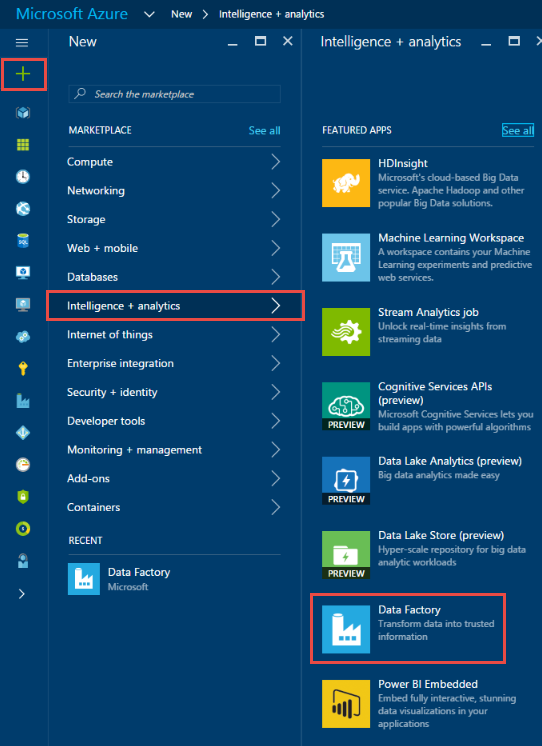

6. In der **neuen Daten Factory** -Blade:
    1. Geben Sie **ADFTutorialDataFactory** für den **Namen**ein.
        Der Name der Factory Azure-Daten muss global eindeutig sein. Wenn Sie die Fehlermeldung: **Factory Data Source Name "ADFTutorialDataFactory" ist nicht verfügbar**, ändern Sie den Namen der Factory Daten (z. B. YournameADFTutorialDataFactory), und versuchen Sie erneut erstellen. Finden Sie unter [Data Factory - Regeln zur Benennung von](data-factory-naming-rules.md) Thema Benennungskonventionen für Daten Factory Elemente.  
     
        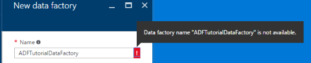
    
        > [AZURE.NOTE] Der Name der Factory Daten möglicherweise als DNS-Namen in der Zukunft und somit werden öffentlich sichtbar registriert werden.
2. Wählen Sie Ihr **Abonnement**für Azure aus.
3. Für Ressourcengruppe, führen Sie eine der folgenden Schritte aus: 1. Wählen Sie die **vorhandenen verwenden** , um eine vorhandene Ressourcengruppe auszuwählen.
2. Wählen Sie **neu erstellen** , um einen Namen für eine Ressourcengruppe eingeben.

            Some of the steps in this tutorial assume that you use the name: **ADFTutorialResourceGroup** for the resource group. To learn about resource groups, see [Using resource groups to manage your Azure resources](../azure-resource-manager/resource-group-overview.md).
    3. Wählen Sie einen **Speicherort** für die Daten Factory aus.
    4. Wählen Sie die **Pin zum Dashboard** Kontrollkästchen am unteren Rand der Blade.  
    5. Klicken Sie auf **Erstellen**.
    
        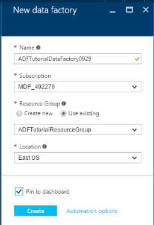          
10. Nach Abschluss die Erstellung wird das Blade **Factory Daten** wie in der folgenden Abbildung dargestellt:

    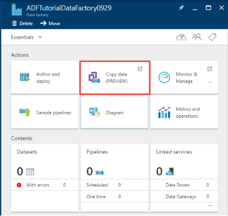

## Starten des Assistenten zum Kopieren von

1. Klicken Sie auf der Homepage der Daten Factory klicken Sie auf die Kachel **Daten kopieren** , um die **Kopieren-Assistenten**zu starten. 

    > [AZURE.NOTE] Wenn Sie sehen, dass der Webbrowser bei "Autorisieren..." hängen geblieben ist, **Cookies von Drittanbietern blockieren und Standortdaten** Einstellung deaktivieren/deaktivieren (oder) beibehalten aktiviert und erstellen Sie eine Ausnahme für **login.microsoftonline.com** und versuchen Sie es dann mit dem Starten des Assistenten erneut.
2. Auf der Seite **Eigenschaften** :
    1. Geben Sie **CopyFromBlobToAzureSql** für **Vorgangsname**
    2. Geben Sie **eine Beschreibung** (optional).
    3. Ändern Sie die **Startzeit Datum** und **Ende Uhrzeit** , sodass das Enddatum auf heute festgelegt ist und den Anfangstermin auf fünf Tage vor dem aktuellen Tag.  
    3. Klicken Sie auf **Weiter**.  

    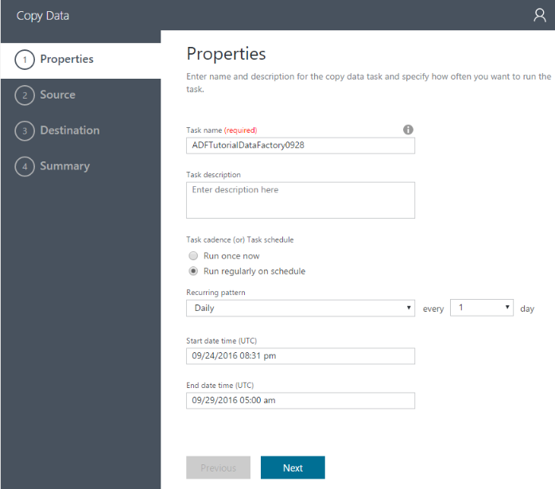 
3. Klicken Sie auf der Seite **Quelldaten speichern** auf Kachel **Azure BLOB-Speicher** . Sie verwenden diese Seite, um die Quelle Datenspeicher für den Vorgang kopieren anzugeben. Sie können einen vorhandenen Daten verknüpft Store-Dienst verwenden (oder) Geben Sie einen neuen Datenspeicher. Um einen vorhandenen verknüpften-Dienst verwenden, möchten Sie klicken Sie auf **Aus vorhandenen VERKNÜPFTEN Diensten** und wählen Sie den richtigen verknüpften Dienst. 

    
5. Auf der Seite **Angeben des Azure Blob-Speicher-Kontos** :
    1. Geben Sie als **AzureStorageLinkedService** **verknüpfte Dienst ein**.
    2. Bestätigen Sie, dass **aus Azure Abonnementoptionen** das Kontrollkästchen für die **Auswahlmethode Konto**ausgewählt ist.
    3. Wählen Sie Ihr **Abonnement**für Azure aus.  
    3. Wählen Sie ein **Konto Azure-Speicher** aus der Liste der Azure-Speicherkonten in das ausgewählte Abonnement verfügbar. Sie können auch die Einstellungen für Speicher-Konto manuell eingeben, durch Auswahl der Option **manuell eingeben** , für die **die Auswahl für die Firma**auswählen, und klicken Sie dann auf **Weiter**. 

    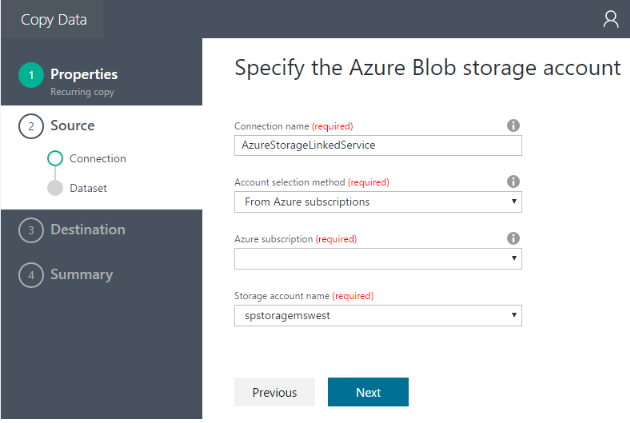
6. Klicken Sie auf Seite **Wählen Sie aus einer Datei oder eines Ordners** :
    1. Navigieren Sie zu dem Ordner **Adftutorial** .
    2. Wählen Sie **emp.txt**aus, und klicken Sie auf **auswählen**
    3. Klicken Sie auf **Weiter**. 

    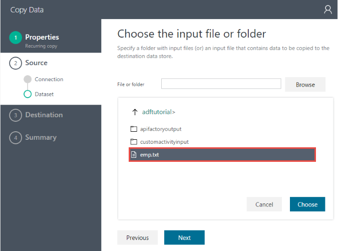
7. Klicken Sie auf der Seite **Wählen Sie aus einer Datei oder eines Ordners** auf **Weiter**. Markieren Sie dabei nicht **binäre kopieren**. 

    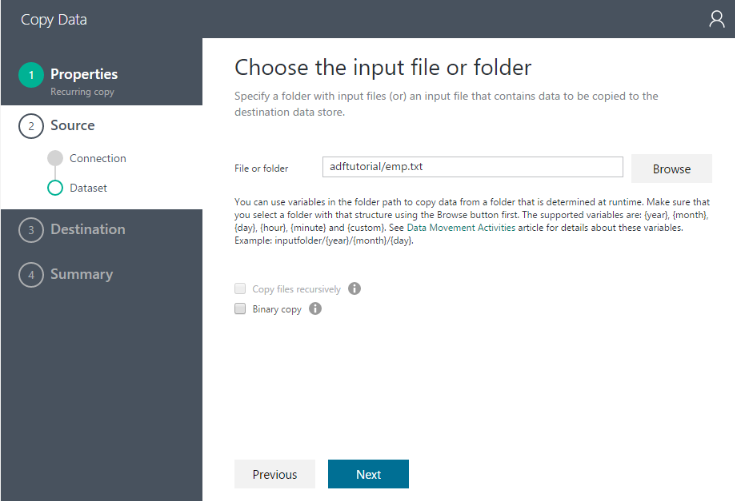 
8. Klicken Sie auf der Einstellungsseite **Format Datei** wird das Trennzeichen und das Schema, das durch die Analyse der Datei ist vom Assistenten automatisch erkannt. Sie können auch die Trennzeichen für den Assistenten zum Kopieren, Beenden der automatischen Erkennung oder überschreiben manuell eingeben. Klicken Sie auf **Weiter** , nachdem Sie die Trennzeichen überprüfen und Vorschau von Daten. 

    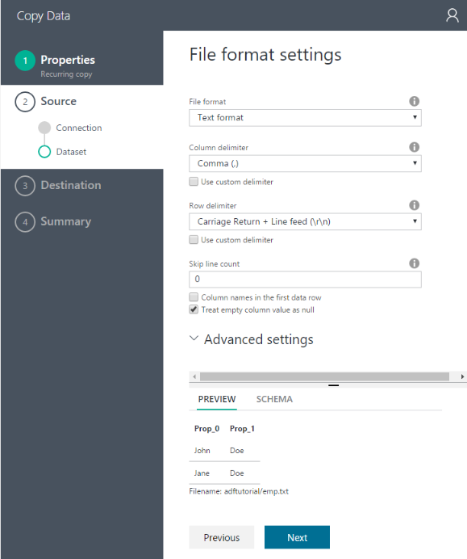  
8. Klicken Sie auf die Ziel-Daten Seite zu speichern, Option **Azure SQL-Datenbank**, und klicken Sie auf **Weiter**.

    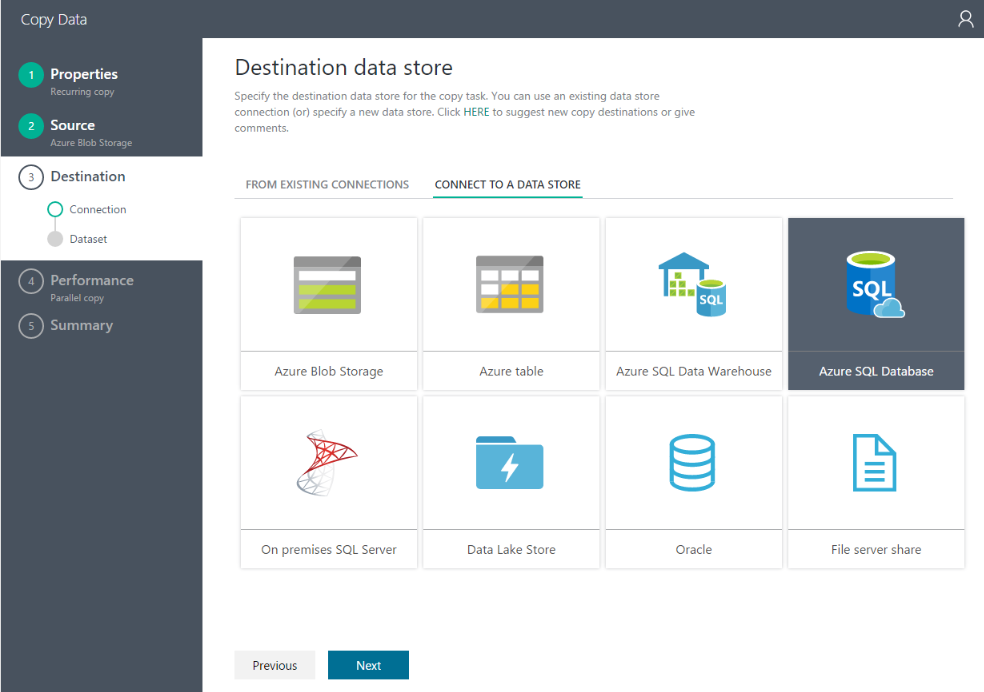
9. Klicken Sie auf **Angeben der SQL Azure-Datenbank** -Seite:
    1. Geben Sie für das Feld **Verbindungsname** **AzureSqlLinkedService** ein.
    2. Bestätigen, dass die Option **aus Azure-Abonnements** für ausgewählt ist **Server / Datenbank Auswahlmethode**.
    3. Wählen Sie Ihr **Abonnement**für Azure aus.  
    2. Wählen Sie **Servernamen** und die **Datenbank**ein.
    4. Geben Sie **Benutzernamen** und Ihr **Kennwort**ein.
    5. Klicken Sie auf **Weiter**.  

    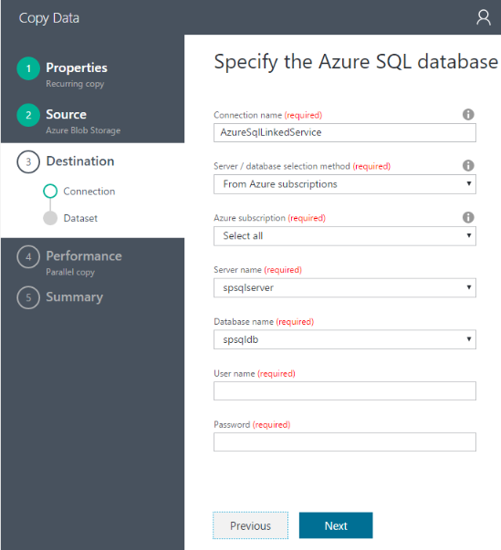
9. Klicken Sie auf der Seite **Zuordnung zu einer Tabelle** wählen Sie **emp** für **das Zielfeld in der Dropdown-Liste** aus, klicken Sie auf **nach unten weisenden Pfeil** (optional) das Schema anzeigen und eine Vorschau die Daten anzeigen.

    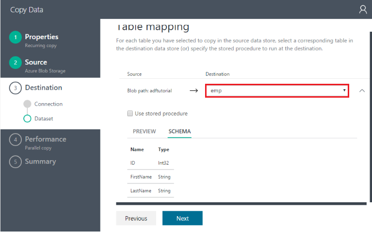 
10. Klicken Sie auf der Seite **Schema Zuordnung** auf **Weiter**.

    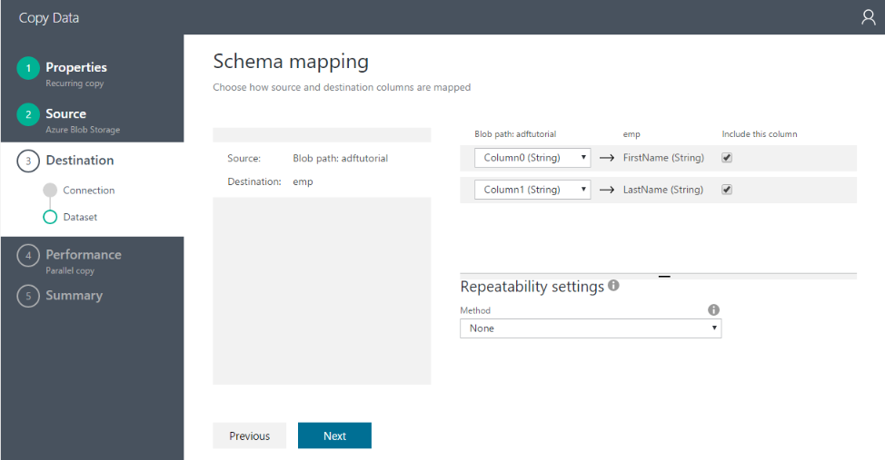
11. Klicken Sie auf der Einstellungsseite **Leistung** klicken Sie auf **Weiter**. 

    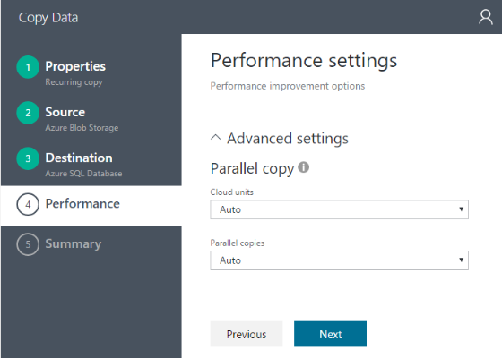
11. Überprüfen Sie die Informationen auf der Seite **Zusammenfassung** , und klicken Sie auf **Fertig stellen**. Der Assistent erstellt zwei verknüpften Diensten, zwei Datasets (Eingabe und Ausgabe) und eine Verkaufspipeline in den Daten Factory (aus, in dem Sie den Assistenten zum Kopieren gestartet haben). 

    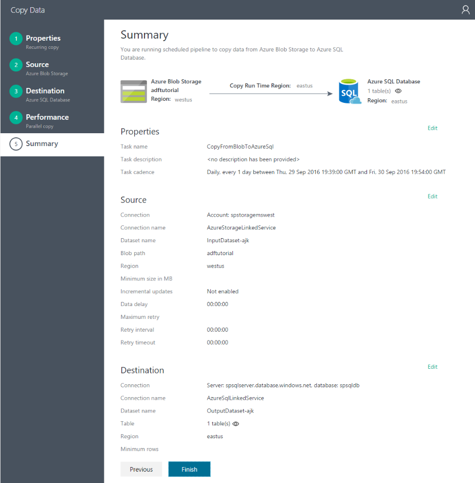

## Starten Sie überwachen und Verwalten von Anwendung 
12. Klicken Sie auf der Seite **Bereitstellung** auf den Link: `Click here to monitor copy pipeline`.

    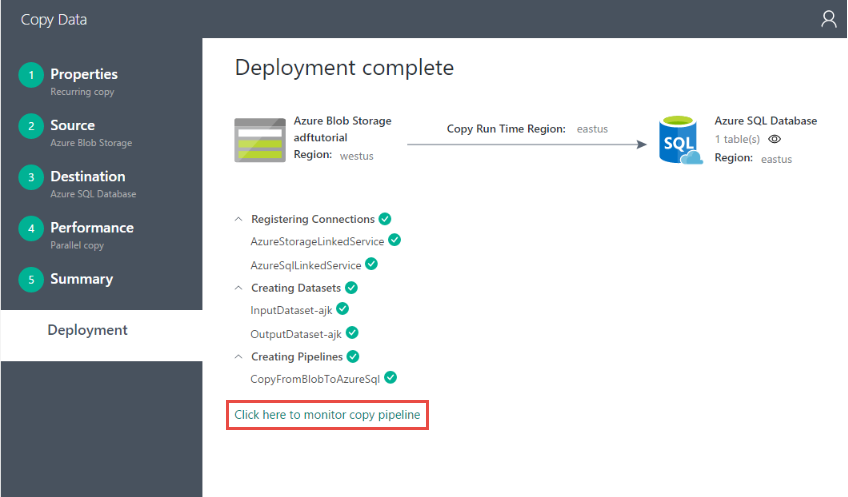  
13. Verwenden Sie die Anweisungen aus [Überwachen und Verwalten von Verkaufspipeline mit App Überwachung](data-factory-monitor-manage-app.md) Informationen dazu, wie Sie die Verkaufspipeline überwachen Sie erstellt haben. Klicken Sie auf der **Aktivität WINDOWS** -Liste, um das Segment finden Sie unter Symbol **Aktualisieren** . 

    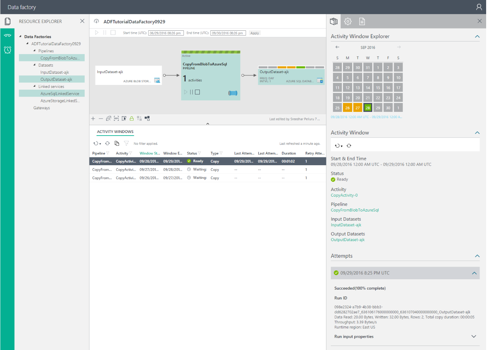 
    
    > [AZURE.NOTE] Klicken Sie auf die Schaltfläche ' **Aktualisieren** ' in der Liste **Aktivität WINDOWS** unten, um den aktuellen Status anzuzeigen. Es wird nicht automatisch aktualisiert. 

## Siehe auch
| Thema | Beschreibung |
| :---- | :---- |
| [Aktivitäten zum Verschieben von Daten](data-factory-data-movement-activities.md) | Dieser Artikel enthält ausführliche Informationen zur Aktivität kopieren Sie im Lernprogramm verwendet. |
| [Planung und Ausführung](data-factory-scheduling-and-execution.md) | In diesem Artikel wird erläutert, die Planung und Ausführung Aspekte des Modells für Azure Data Factory-Anwendung. |
| [Pipelines](data-factory-create-pipelines.md) | In diesem Artikel können Sie die Pipelines und Aktivitäten in Azure Data Factory und deren Verwendung zum Erstellen von End-to-End-Daten basierende Workflows für Ihre Szenario oder Ihr Unternehmen zu verstehen. |
| [Datasets](data-factory-create-datasets.md) | In diesem Artikel können Sie die Datasets in Azure Data Factory zu verstehen.
| [Überwachen und Verwalten von Pipelines mit App für die Überwachung](data-factory-monitor-manage-app.md) | Dieser Artikel beschreibt, wie überwachen, verwalten und Debuggen Pipelines die Überwachung und Verwaltung App verwenden. 