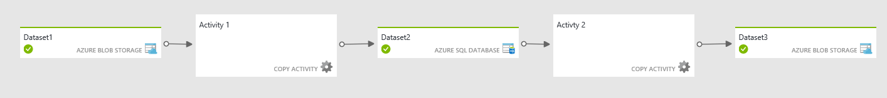

<properties 
    pageTitle="Pipelines erstellen/Zeitplan, verketten Aktivitäten in "Data Factory" | Microsoft Azure" 
    description="Sie lernen, wie eine Verkaufspipeline Daten in Azure Data Factory verschieben und transformieren Daten erstellen. Erstellen Sie einen Workflow leistungsgesteuert Daten bereit zur Verwendung von Informationen zu erzeugen." 
    keywords="Daten Verkaufspipeline, Daten leistungsgesteuert workflow"
    services="data-factory" 
    documentationCenter="" 
    authors="sharonlo101" 
    manager="jhubbard" 
    editor="monicar"/>

<tags 
    ms.service="data-factory" 
    ms.workload="data-services" 
    ms.tgt_pltfrm="na" 
    ms.devlang="na" 
    ms.topic="article"
    ms.date="09/12/2016" 
    ms.author="shlo"/>

# Pipelines und Aktivitäten in Factory Azure-Daten
In diesem Artikel können Sie Rohrleitungen und Aktivitäten in Azure Data Factory verstehen und verwenden können, um End-to-End-Daten basierende Workflows für Ihre Daten Bewegung und Datenverarbeitung Szenarien zu erstellen.  

> [AZURE.NOTE] In diesem Artikel wird vorausgesetzt, dass Sie über [Einführung Azure Data Factory](data-factory-introduction.md)überschritten haben. Wenn Sie keinen hands-on-Erfahrung mit der Erstellung von Daten, die Anlagen, [Erstellen Ihrer erste Daten Factory](data-factory-build-your-first-pipeline.md) Lernprogramm durchgehen derer verstehen Sie in diesem Artikel besser aus.  

## Was ist eine Verkaufspipeline Daten?
**Verkaufspipeline** ist eine Gruppierung von logisch verwandten **Aktivitäten**. Es wird in der Gruppenaktivitäten in einer Einheit verwendet, die eine Aufgabe ausführt. Um Rohrleitungen besser zu verstehen, müssen Sie zuerst eine Aktivität zu verstehen. 

## Was ist eine Aktivität?
Aktivitäten legen Sie die Aktionen für Ihre Daten ausführen. Jede Aktivität 0 (null) oder mehrere [Datasets](data-factory-create-datasets.md) als Eingaben akzeptiert und erstellt ein oder mehrere Datasets als Ausgabe. 

Beispielsweise können Sie eine Kopie Aktivität verwenden, zum Kopieren von Daten aus einem Datenspeicher zu einem anderen Datenspeicher koordinieren. Auf ähnliche Weise können Sie eine Struktur HDInsight Aktivität verwenden, zum Ausführen einer Abfrage Struktur auf einem Cluster Azure HDInsight Transformation die Daten. Azure Data Factory bietet eine Vielzahl von [Datentransformation](data-factory-data-transformation-activities.md)und [Verschieben von Daten](data-factory-data-movement-activities.md) Aktivitäten. Sie können auch zum Erstellen einer benutzerdefinierten .NET Aktivität zum Ausführen von eigenem Codes auswählen. 

## Beispiel für Kopieren Verkaufspipeline
In der folgenden Beispiel Verkaufspipeline gibt es eine Aktivität vom Typ **Kopieren** im Abschnitt **Aktivitäten** . In diesem Beispiel kopiert die [Aktivität kopieren](data-factory-data-movement-activities.md) Daten aus einem Azure Blob-Speicher in einer SQL Azure-Datenbank. 

    {
      "name": "CopyPipeline",
      "properties": {
        "description": "Copy data from a blob to Azure SQL table",
        "activities": [
          {
            "name": "CopyFromBlobToSQL",
            "type": "Copy",
            "inputs": [
              {
                "name": "InputDataset"
              }
            ],
            "outputs": [
              {
                "name": "OutputDataset"
              }
            ],
            "typeProperties": {
              "source": {
                "type": "BlobSource"
              },
              "sink": {
                "type": "SqlSink",
                "writeBatchSize": 10000,
                "writeBatchTimeout": "60:00:00"
              }
            },
            "Policy": {
              "concurrency": 1,
              "executionPriorityOrder": "NewestFirst",
              "retry": 0,
              "timeout": "01:00:00"
            }
          }
        ],
        "start": "2016-07-12T00:00:00Z",
        "end": "2016-07-13T00:00:00Z"
      }
    } 

Beachten Sie die folgenden Punkte:

- Im Abschnitt Aktivitäten gibt es nur eine Aktivität zu **Kopieren**, deren **Typ** festgelegt ist.
- Eingabe für die Aktivität auf **InputDataset** festgelegt ist, und die Ausgabe für die Aktivität auf **OutputDataset**festgelegt ist.
- Im Abschnitt **TypeProperties** **BlobSource** als den Quelltyp angegeben und den Typ der Empfänger **SqlSink** angegeben ist.

Umfassende Informationen zum Erstellen dieses Verkaufspipeline von, finden Sie unter [Lernprogramm: Kopieren von Daten aus dem Blob-Speicher mit SQL-Datenbank](data-factory-copy-data-from-azure-blob-storage-to-sql-database.md). 

## Beispiel für Transformation Verkaufspipeline
In der folgenden Beispiel Verkaufspipeline gibt es eine Aktivität vom Typ **HDInsightHive** im Abschnitt **Aktivitäten** . In diesem Beispiel transformiert die [Struktur HDInsight Aktivität](data-factory-hive-activity.md) Daten aus einem Azure Blob-Speicher auf einem Cluster Azure HDInsight Hadoop eine Struktur Skript-Datei ausführen. 

    {
        "name": "TransformPipeline",
        "properties": {
            "description": "My first Azure Data Factory pipeline",
            "activities": [
                {
                    "type": "HDInsightHive",
                    "typeProperties": {
                        "scriptPath": "adfgetstarted/script/partitionweblogs.hql",
                        "scriptLinkedService": "AzureStorageLinkedService",
                        "defines": {
                            "inputtable": "wasb://adfgetstarted@<storageaccountname>.blob.core.windows.net/inputdata",
                            "partitionedtable": "wasb://adfgetstarted@<storageaccountname>.blob.core.windows.net/partitioneddata"
                        }
                    },
                    "inputs": [
                        {
                            "name": "AzureBlobInput"
                        }
                    ],
                    "outputs": [
                        {
                            "name": "AzureBlobOutput"
                        }
                    ],
                    "policy": {
                        "concurrency": 1,
                        "retry": 3
                    },
                    "scheduler": {
                        "frequency": "Month",
                        "interval": 1
                    },
                    "name": "RunSampleHiveActivity",
                    "linkedServiceName": "HDInsightOnDemandLinkedService"
                }
            ],
            "start": "2016-04-01T00:00:00Z",
            "end": "2016-04-02T00:00:00Z",
            "isPaused": false
        }
    }

Beachten Sie die folgenden Punkte: 

- Im Abschnitt Aktivitäten gibt es nur eine Aktivität, deren **Typ** auf **HDInsightHive**festgelegt ist.
- Die Struktur-Skriptdatei, **partitionweblogs.hql**, wird in der Azure-Speicher-Konto (angegeben durch die ScriptLinkedService, die als **AzureStorageLinkedService**bezeichnet), und klicken Sie im Ordner " **Skript** " in den Container **Adfgetstarted**gespeichert.
- Im Abschnitt **definiert** wird verwendet, um die Einstellungen für die Laufzeit angeben, die als Struktur Konfigurationswerte an das Skript Struktur übergeben werden (z. B. ${Hiveconf: inputtable}, ${Hiveconf:partitionedtable}).

Umfassende Informationen zum Erstellen dieses Verkaufspipeline von, finden Sie unter [Lernprogramm: Erstellen Ihrer ersten Verkaufspipeline zum Verarbeiten von Daten mithilfe von Hadoop Cluster](data-factory-build-your-first-pipeline.md). 

## Verketten von Aktivitäten
Wenn Sie mehrere Aktivitäten in einem Verkaufspipeline und Ausgabe einer Aktivität keine Eingabemethode einer anderen Aktivität ist, möglicherweise die Aktivitäten parallel ausgeführt, wenn die Eingabedaten Segmente für die Aktivitäten bereit sind. 

Sie können zwei Aktivitäten verketten, indem Sie das Ausgabe Dataset als des Eingabe-Dataset der anderen Aktivität einer Aktivität Probleme. Die Aktivitäten können in der gleichen Verkaufspipeline oder in anderen Rohrleitungen sein. Die zweite Aktivität führt nur bei der ersten Phase erfolgreich abgeschlossen wurde. 

Betrachten Sie beispielsweise den folgenden Fällen aus:
 
1.  Verkaufspipeline P1 weist Aktivität A1, die externe Eingabe-Dataset D1 erfordert, und Naturprodukte **Ausgabe** Dataset **D2**.
2.  Aktivitäten in A2, die **Eingabe** von Dataset **D2**erfordert, und erzeugt Ausgabe Dataset D3 verfügt Verkaufspipeline P2
 
In diesem Szenario wird die Aktivität A1 ausgeführt, wenn die externen Daten verfügbar ist, und die geplante Verfügbarkeit Häufigkeit erreicht ist.  Die Aktivität führt A2 aus, wenn die geplanten Segmente aus D2 verfügbar werden und die geplante Verfügbarkeit Häufigkeit erreicht ist. Ist ein Fehler in einem Dataset D2 Segmente, wird nicht A2 für diese Segment ausgeführt, bis er wieder verfügbar ist.

In der Diagrammansicht:

Diagrammsicht mit beide Aktivitäten in der gleichen Verkaufspipeline: 

Weitere Informationen finden Sie unter [Planung und Ausführung](#chaining-activities). 

## Planung und Ausführung
Sie haben bisher verstanden, was Pipelines und Aktivitäten sind. Sie haben auch diese definierten und auf hoher Ebene sind untersucht der Aktivitäten in Azure Data Factory anzuzeigen. Lassen Sie uns nun auf wie diese ausgeführt werden. 

Eine Verkaufspipeline ist nur zwischen deren Start- und Endzeit aktiv. Es ist nicht vor der Startzeit oder nach der Endzeit ausgeführt. Wenn der Verkaufspipeline angehalten ist, ist es nicht unabhängig von deren Start- und Zeit ausgeführt abrufen. Für eine Verkaufspipeline ausführen sollten sie nicht angehalten werden. Tatsächlich ist es nicht der Verkaufspipeline die ausgeführt wird. Es ist der Aktivitäten in der Verkaufspipeline, die ausgeführt werden. Jedoch verwenden sie dazu in der Gesamtzusammenhang von der Verkaufspipeline. 

Finden Sie unter [Planung und Ausführung](data-factory-scheduling-and-execution.md) zu verstehen, wie die Planung und Ausführung in Azure Data Factory funktioniert.

## Erstellen von pipelines
Azure Data Factory bietet verschiedene Verfahren zum Erstellen und Bereitstellen von Pipelines (die wiederum eine oder mehrere Aktivitäten darin enthalten). 

### Verwenden von Azure-portal
Daten Factory-Editor können im Azure-Portal Sie um eine Verkaufspipeline zu erstellen. Eine umfassende Exemplarische Vorgehensweise finden Sie unter [Erste Schritte mit Azure Data Factory (Daten Factory-Editor)](data-factory-build-your-first-pipeline-using-editor.md) . 

### Verwenden Visual Studio 
Sie können Visual Studio erstellen und Bereitstellen von Pipelines für Azure Data Factory. Eine umfassende Exemplarische Vorgehensweise finden Sie unter [Erste Schritte mit Azure Data Factory (Visual Studio)](data-factory-build-your-first-pipeline-using-vs.md) . 

### Mithilfe der PowerShell Azure
Der PowerShell Azure können Pipelines in Azure Data Factory zu erstellen. Angenommen, haben Sie der Verkaufspipeline JSON in einer Datei am c:\DPWikisample.json definiert. Sie können sie Ihre Azure Data Factory-Instanz hochladen, wie im folgenden Beispiel gezeigt:

    New-AzureRmDataFactoryPipeline -ResourceGroupName ADF -Name DPWikisample -DataFactoryName wikiADF -File c:\DPWikisample.json

Eine umfassende Exemplarische Vorgehensweise zum Erstellen einer Factory Daten mit einer Verkaufspipeline finden Sie unter [Erste Schritte mit Azure Data Factory (Azure PowerShell)](data-factory-build-your-first-pipeline-using-powershell.md) . 

### Verwenden von .NET SDK
Erstellen und Bereitstellen von Verkaufspipeline über .NET SDK zu können. Dieses Verfahren kann verwendet werden, Pipelines programmgesteuert zu erstellen. Weitere Informationen finden Sie unter [erstellen, verwalten und Daten Factory programmgesteuert überwachen](data-factory-create-data-factories-programmatically.md). 

### Verwenden von Ressourcenmanager Azure-Vorlage
Erstellen und Bereitstellen von Verkaufspipeline mithilfe einer Vorlage Azure Ressourcenmanager können. Weitere Informationen finden Sie unter [Erste Schritte mit Azure Data Factory (Azure Ressourcenmanager)](data-factory-build-your-first-pipeline-using-arm.md). 

### Verwenden die REST-API
Sie können erstellen und Bereitstellen Verkaufspipeline REST-APIs zu verwenden. Dieses Verfahren kann verwendet werden, Pipelines programmgesteuert zu erstellen. Weitere Informationen finden Sie unter [Erstellen oder Aktualisieren einer Verkaufspipeline](https://msdn.microsoft.com/library/azure/dn906741.aspx). 

## Überwachen und Verwalten von pipelines  
Nachdem Sie eine Verkaufspipeline bereitgestellt wird, können Sie verwalten und Überwachen Ihrer Rohrleitungen, Segmente und ausgeführt. Weitere Informationen zu sie hier: [Überwachen und Verwalten von Pipelines](data-factory-monitor-manage-pipelines.md).

## Verkaufspipeline JSON   
Lassen Sie uns genaueres auf wie eine Verkaufspipeline im JSON-Format definiert ist. Die generische Struktur einer Verkaufspipeline sieht wie folgt aus:

    {
        "name": "PipelineName",
        "properties": 
        {
            "description" : "pipeline description",
            "activities":
            [
    
            ],
            "start": "<start date-time>",
            "end": "<end date-time>"
        }
    }

Im Abschnitt **Aktivitäten** kann eine oder mehrere Aktivitäten, die darin enthaltenen definiert haben. Jede Aktivität weist die folgende auf oberster Ebene Struktur:

    {
        "name": "ActivityName",
        "description": "description", 
        "type": "<ActivityType>",
        "inputs":  "[]",
        "outputs":  "[]",
        "linkedServiceName": "MyLinkedService",
        "typeProperties":
        {
    
        },
        "policy":
        {
        }
        "scheduler":
        {
        }
    }

Beschreiben Sie die Eigenschaften in den JSON-Definitionen Aktivität und Verkaufspipeline folgenden Tabelle:

Kategorie | Beschreibung | Erforderlich
--- | ----------- | --------
Namen | Name der Aktivität oder der Verkaufspipeline. Geben Sie einen Namen, die die Aktion darstellt, dass die Aktivität oder Verkaufspipeline muss konfiguriert ist <ul><li>Maximale Anzahl von Zeichen: 260</li><li>Muss mit einem Buchstaben Zahl oder eines Unterstrichs (_) beginnen.</li><li>Folgenden Zeichen sind nicht zulässig: ".", "+", "?", "/", "<",">", "*", "%", "&", ":","\\"</li></ul> | Ja
Beschreibung | Text zur Beschreibung, wofür die Aktivität oder Verkaufspipeline verwendet wird | Ja
Typ | Gibt den Typ der Aktivität. Siehe folgende Artikel [Daten Bewegung](data-factory-data-movement-activities.md) und [Daten Transformationsaktivitäten](data-factory-data-transformation-activities.md) für unterschiedliche Arten von Aktivitäten. | Ja
Eingaben | Eingabe von der Aktivität verwendete Tabellen  Tabelle mit einem Eingabefeld "Eingaben": [{"Name": "inputtable1"}],  zwei von Tabellen  "Eingaben": [{"Name": "inputtable1"}, {"Name": "inputtable2"}], | Ja
Ausgaben | Ausgabetabellen, die von der activity.// eine Ausgabetabelle verwendet wird "gibt": [{"Name": "outputtable1"}],  zwei Tabellen ausgeben "gibt": [{"Name": "outputtable1"}, {"Name": "outputtable2"}], | Ja
linkedServiceName | Name des verknüpften Services durch die Aktivität verwendet.   Eine Aktivität erfordern, dass Sie den verknüpften Dienst angeben, der mit der Umgebung erforderlichen berechnen verknüpft. | Ja für HDInsight Aktivitäten und Azure-Computern Learning Stapel Aktivität bewerten   Nicht für alle anderen
typeProperties | Eigenschaften im Abschnitt TypeProperties abhängig vom Typ der Aktivität ab. | Nein
Richtlinie | Richtlinien, die das Verhalten der Laufzeit der Aktivität auswirken. Wenn sie nicht angegeben ist, werden Standardrichtlinien verwendet. | Nein
Starten | Starten Sie Datum und Uhrzeit für die Verkaufspipeline. Muss im [ISO-Format](http://en.wikipedia.org/wiki/ISO_8601). Beispiel: 2014-10-14T16:32:41Z.   Es ist möglich, eine lokale Zeit, beispielsweise eine EST Zeit angeben. Hier ein Beispiel: "2016-02-27T06:00:00**-05: 00**", welche 6 AM EST. ist  Zusammen Geben Sie die Start- und Eigenschaften für die Verkaufspipeline aktiven Zeitraums an. Ausgabe Segmente werden nur in diesem aktiven Zeitraums mit erzeugt. | Nein  Wenn Sie einen Wert für die Eigenschaft Ende angeben möchten, müssen Sie den Wert für die Eigenschaft "Start" angeben.  Die Start- und Endzeiten können beide zum Erstellen einer Verkaufspipeline leer sein. Sie müssen beide Werte zum Festlegen der Verkaufspipeline zum Ausführen einer aktiven Periode angeben. Wenn Sie keine Start- und Endzeiten angeben beim Erstellen einer Verkaufspipeline können Sie festlegen, verwenden das Cmdlet "Set-AzureRmDataFactoryPipelineActivePeriod" weiter unten.
Ende | Datum / Uhrzeit für die Verkaufspipeline zu beenden. Wenn angegeben, muss im ISO-Format. Beispiel: 2014-10-14T17:32:41Z   Es ist möglich, eine lokale Zeit, beispielsweise eine EST Zeit angeben. Hier ein Beispiel: "2016-02-27T06:00:00**-05: 00**", welche 6 AM EST. ist  Wenn der Verkaufspipeline endlos ausführen möchten, geben Sie als Wert für die Eigenschaft Ende 9999-09-09 an. | Nein   Wenn Sie einen Wert für die Start-Eigenschaft angeben, müssen Sie den Wert für die Eigenschaft Ende angeben.  Finden Sie Hinweise für die Eigenschaft **zu starten** .
isPaused | Wenn der Wert true lautet der Verkaufspipeline nicht ausgeführt werden kann. Standardwert = False. Sie können diese Eigenschaft aktivieren oder deaktivieren. | Nein 
Scheduler | Eigenschaft "Zeitplan" wird verwendet, um die gewünschte Planung für die Aktivität definieren. Deren untergeordnete Eigenschaften stimmen mit den Preisen in die [Verfügbarkeit-Eigenschaft in einem Dataset](data-factory-create-datasets.md#Availability). | Nein |   
| pipelineMode | Die Methode für die Planung für die Verkaufspipeline ausgeführt werden soll. Sind die Werte zulässig: geplant (Standard), einmalige.  'Geplant' zeigt an, dass der Verkaufspipeline auf ein angegebenes Zeitintervall entsprechend der aktiven Zeitraums (Start- und Zeit) ausgeführt wird. "Einmalige" gibt an, dass der Verkaufspipeline nur einmal ausgeführt wird. Einmalige Rohrleitungen nach der Erstellung geändert/aktualisiert zurzeit nicht möglich. Details zu einmalige Einstellung finden Sie unter [Onetime Verkaufspipeline](data-factory-scheduling-and-execution.md#onetime-pipeline) . | Nein | 
| expirationTime | Dauer der Zeit nach der Erstellung, für die der Verkaufspipeline ist gültig und bereitgestellte bleiben soll. Wenn es keiner aktiven fehlschlug, oder ausstehend ausgeführt wird, wird der Verkaufspipeline automatisch einmal gelöscht, sobald das Ablaufdatum erreicht. | Nein | 
| Datasets | Liste der Datasets von Aktivitäten, die in der Verkaufspipeline definiert verwendet werden soll. Datasets definieren, die für diese Verkaufspipeline spezifisch sind und nicht innerhalb der Daten Factory definiert, kann diese Eigenschaft verwendet werden. Innerhalb dieser Verkaufspipeline definiert Datasets kann nur verwendet werden, indem Sie diese Verkaufspipeline und kann nicht freigegeben werden. Details finden Sie unter [ausgelegte Datasets](data-factory-create-datasets.md#scoped-datasets) .| Nein |  
 

### Richtlinien
Richtlinien beeinflussen das Verhalten der Laufzeit einer Aktivität, insbesondere wenn das Segment einer Tabelle verarbeitet wird. Die folgende Tabelle enthält die Details an.

Eigenschaft | Zulässigen Werte | Standardwert | Beschreibung
-------- | ----------- | -------------- | ---------------
Parallelität | Ganze Zahl   Max-Wert: 10 | 1 | Anzahl der gleichzeitigen Ausführungen der Aktivität.  Es bestimmt die Anzahl der Ausführungen parallele Aktivitäten, die auf anderen Segmente auftreten können. Beispielsweise, wenn eine Aktivität aufzurufen, muss beschleunigen eine große Datenmenge verfügbar, müssen einen größeren Wert für Parallelität der Datenverarbeitung. 
executionPriorityOrder | NewestFirst  OldestFirst | OldestFirst | Bestimmt die Reihenfolge der Datensegmente, die verarbeitet werden.  Wenn Sie haben 2 slices (eine diesen: 00 Uhr und 5 Uhr einen anderen Namen) ein, und beide Ausführung sind. Wenn Sie die ExecutionPriorityOrder NewestFirst werden festlegen, wird das Segment 5 Uhr zuerst verarbeitet werden. Auf ähnliche Weise, wenn Sie die ExecutionPriorityORder OldestFIrst werden festlegen, wird das Segment: 00 Uhr verarbeitet. 
"Wiederholen" | Ganze Zahl  Max-Wert kann 10 sein. | 3 | Anzahl der Wiederholungsversuche vor der Datenverarbeitung für das Segment als Fehler markiert ist. Ausführung der Aktivitäten für ein Segment Daten wird auf die Anzahl der angegebenen "Wiederholen" wiederholt. Die Wiederholung erfolgt nach dem Fehler so früh wie möglich.
Timeout | TimeSpan | 00:00:00 | Timeout für die Aktivität. Beispiel: 00:10:00 (bedingt Timeout 10 Minuten)  Wenn ein Wert nicht angegeben ist oder 0 ist, ist das Timeout unbegrenzte.  Wenn die Daten Verarbeitungszeit auf einem Speicherbereich den Timeoutwert überschreitet, wird sie abgebrochen, und das System versucht, wiederholen Sie die Verarbeitung. Die Anzahl der Wiederholungsversuche hängt die Eigenschaft "Wiederholen" aus. Timeout auftritt, wird der Status auf TimedOut festgelegt.
Verzögerung | TimeSpan | 00:00:00 | Geben Sie die Verzögerungszeit Datenverarbeitung der Segment beginnt.  Die Ausführung der Aktivität für ein Segment Daten wird gestartet, nachdem die Verzögerung ältere der erwarteten Zeit für die Ausführung ist.  Beispiel: 00:10:00 (bedingt Verzögerung von 10 Minuten)
longRetry | Ganze Zahl  Max-Wert: 10 | 1 | Die Anzahl der langen Wiederholungsversuche, bevor die Segment Ausführung fehlgeschlagen ist.  LongRetry Versuche werden durch LongRetryInterval gleichen Abständen angeordnet. Wenn Sie eine Uhrzeit zwischen Wiederholungsversuche angeben müssen, verwenden Sie also LongRetry. Wenn sowohl die "Wiederholen" LongRetry angegeben sind, jeden Versuch LongRetry umfasst Wiederholungsversuche und die maximale Anzahl der Versuche ist "Wiederholen" * LongRetry.  Wenn beispielsweise die folgenden Einstellungen in der Richtlinie Aktivität müssen: Wiederholen: 3 LongRetry: 2 LongRetryInterval: 01:00:00  Angenommen, es gibt nur ein Segment auszuführende (Status wartet) und die Ausführung der Aktivitäten nicht jedes Mal. Zunächst würde 3 aufeinander folgenden Ausführungsversuche vorhanden sein. Nach jedem Versuch wäre der Segment Status "Wiederholen" aus. Nach dem ersten 3 Versuche über sind, wäre des Segment Status LongRetry.  Nach einer Stunde (d. h., der LongRetryInteval Wert) wäre einen weiteren Satz von 3 aufeinander folgenden Ausführungsversuche. Anschließend der Segment Status hätte einen Fehler ausgelöst werden und keine weitere Versuche werden möchten. Daher wurden insgesamt 6 versucht.  Wenn alle Ausführung erfolgreich ist, der Status Segment wäre sofort und keine weitere Versuche sind.  LongRetry kann in Situationen verwendet werden, bei denen abhängige Daten nicht deterministisch Vorkommen eintreffen oder die gesamte Umgebung ausgetrocknet klicken Sie unter welche Verarbeitung erfolgt ist. In diesem Fall Zeit dadurch die Wiederholungsversuche einzeln nacheinander nicht helfen können und dadurch nach einem Intervall der Ergebnisse in der gewünschten Ausgabe.  Vorsicht: Legen Sie hohe Werte für LongRetry oder LongRetryInterval nicht. Höhere Werte implizieren normalerweise andere systematische Probleme. 
longRetryInterval | TimeSpan | 00:00:00 | Die Verzögerung zwischen lange Wiederholungsversuche 

## Nächste Schritte

- Grundlegendes zu [Planung und Ausführung in Azure Data Factory](data-factory-scheduling-and-execution.md).  
- Erfahren Sie mehr über das [Verschieben von Daten](data-factory-data-movement-activities.md) und [Funktionen für die Transformation](data-factory-data-transformation-activities.md) in Azure Data Factory
- Grundlegendes zu [Management und Überwachung in Azure Data Factory](data-factory-monitor-manage-pipelines.md).
- [Erstellen und Bereitstellen Ihrer Fist Verkaufspipeline](data-factory-build-your-first-pipeline.md). 
