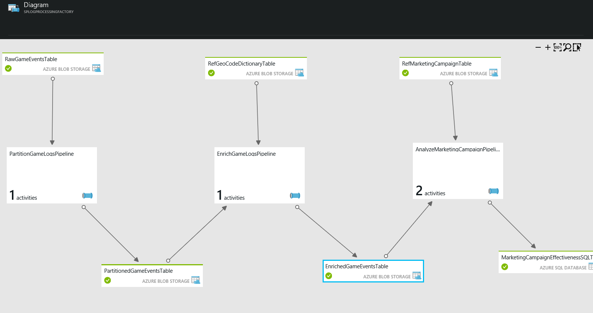

<properties 
    pageTitle="Verwenden von Case - Kunden ein Profil erstellen" 
    description="Erfahren Sie, wie Azure Data Factory zum Erstellen eines Workflows Daten leistungsgesteuert (Verkaufspipeline), wenn Sie ein Profil Spiele Kunden verwendet wird." 
    services="data-factory" 
    documentationCenter="" 
    authors="sharonlo101" 
    manager="jhubbard" 
    editor="monicar"/>

<tags 
    ms.service="data-factory" 
    ms.workload="data-services" 
    ms.tgt_pltfrm="na" 
    ms.devlang="na" 
    ms.topic="article" 
    ms.date="09/06/2016" 
    ms.author="shlo"/>

# Verwenden von Case - Kunden ein Profil erstellen

Azure Data Factory ist der viele Dienste verwendet, um die Cortana Intelligence Suite Lösung Zugriffstasten implementieren.  Weitere Informationen zu Cortana Intelligence finden Sie auf [Cortana Intelligence Suite](http://www.microsoft.com/cortanaanalytics). In diesem Dokument beschreiben wir eine einfache Anwendungsfall-, um helfen Ihnen den Einstieg zu verstehen, wie Azure Data Factory allgemeine Analytics-Probleme beheben können.

Sie müssen zugreifen und diese einfache Anwendungsfall-testen ist ein [Azure-Abonnement](https://azure.microsoft.com/pricing/free-trial/).  Sie können eine Stichprobe bereitstellen, die diese Anwendungsfall-implementiert, die im Artikel [Beispiele](data-factory-samples.md) beschriebenen Schritte befolgen.

## Szenario

Contoso ist ein Spiele Unternehmen, die Spiele für mehrere Plattformen erstellt: Spiel Konsolen, tragbare Geräte und Personal Computer (PCs). Wie diese Spiele Player wiedergeben möchten, ist große Datenmengen Log gefertigt, die die von Verwendungsmustern, Spiele Formatvorlage und Einstellungen des Benutzers nachverfolgt.  In Kombination mit demographischen, Region, und Produktdaten, Contoso Analytics, um diese Informationen zum Spieler zu verbessern begleiten ausführen kann und die Zieladresse, die Sie für Upgrades und im Spiel EC-oder. 

Contoso Zielsetzung besteht darin, verkaufen/Cross-Weiterverkauf Verkaufschancen auf Grundlage des Verlaufs Spiele der zugehörigen Spieler identifizieren und überzeugende Features Laufwerk geschäftliches Wachstum hinzufügen und optimal für Kunden bereitstellen. Für diese Anwendungsfall-verwenden wir einem Unternehmen Spiele als Beispiel für ein Unternehmen ein. Das Unternehmen möchte seine Spiele basierend auf Spieler Verhalten zu optimieren. Diese Prinzipien gelten für jedes Unternehmen, die seiner Kunden um seine waren und Dienstleistungen populärer und verbessern ihrer Kunden Eindruck möchte.

## Probleme

## Übersicht über die Lösung

Dieses einfache Anwendungsfall-kann als ein Beispiel für die Nutzung Azure Data Factory Aufnahme, vorbereiten, transformieren, analysieren und Veröffentlichen von Daten verwendet werden.

Diese Abbildung zeigt, wie die Datenpipelines Azure-Portal angezeigt, nachdem sie bereitgestellt wurden.

1.  Die **PartitionGameLogsPipeline** liest die unformatierten Spiel Ereignisse von Blob-Speicher und Partitionen basierend auf Tag, Monat und Jahr erstellt.
2.  Die **EnrichGameLogsPipeline** partitionierten Spiel Ereignisse mit Geo Code Bezug Daten verknüpft und bereichert die Daten, indem Sie die entsprechenden Geo-Speicherorte IP-Adressen zuordnen.
3.  Der Verkaufspipeline **AnalyzeMarketingCampaignPipeline** erweiterte Daten verwendet und verarbeitet sie mit den Daten Werbung, um die endgültige Ausgabe zu erstellen, die Marketing Campaign Effektivität enthält.

In diesem Beispiel wird Daten Factory zum Koordinieren von Aktivitäten, die Eingabedaten, Transformation und die Daten nicht verarbeiten kopieren, und die endgültige Ausgabedaten mit einer Azure SQL-Datenbank.  Sie können auch im Netzwerk der Datenpipelines visualisieren, diese verwalten und Überwachen von deren Status in der Benutzeroberfläche.

## Vorteile

Optimieren ihrer Benutzer Profil Analytics und es mit geschäftlichen Zielen auszurichten, sind Spiele Unternehmen schnell sammeln Verwendungsmuster, und die Effektivität der zugehörigen Marketingkampagnen analysieren können.

