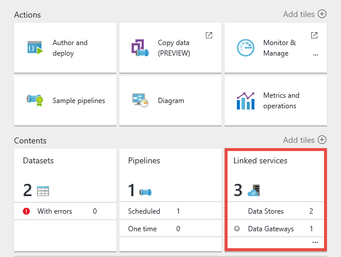
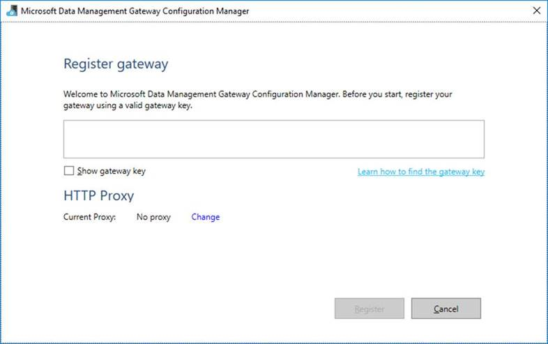
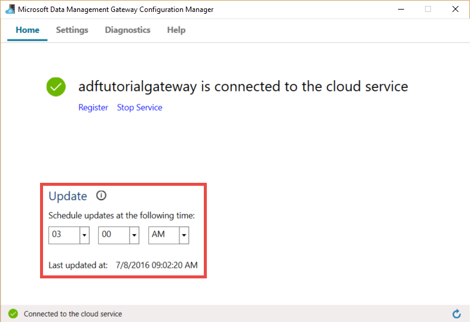
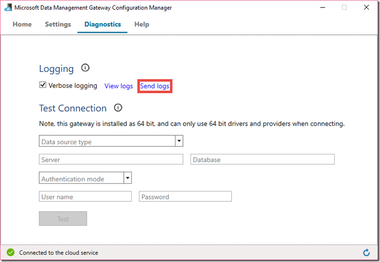
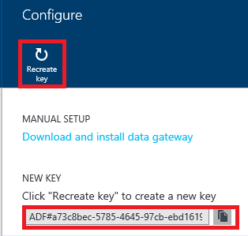
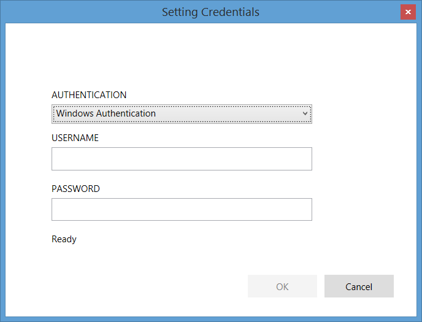

<properties 
    pageTitle="Datenverwaltungsgateway für Daten Factory | Microsoft Azure"
    description="Richten Sie ein datenverwaltungsgateway zum Verschieben von Daten zwischen lokal und in der Cloud. Verwenden Sie Datenverwaltungsgateway in Azure Data Factory, um Ihre Daten zu wechseln." 
    services="data-factory" 
    documentationCenter="" 
    authors="linda33wj" 
    manager="jhubbard" 
    editor="monicar"/>

<tags 
    ms.service="data-factory" 
    ms.workload="data-services" 
    ms.tgt_pltfrm="na" 
    ms.devlang="na" 
    ms.topic="article" 
    ms.date="10/11/2016" 
    ms.author="jingwang"/>

# Datenverwaltungsgateway
Das Datenverwaltungsgateway ist ein Client-Agent, die Sie in Ihrer lokalen Umgebung zu kopierenden installieren müssen Daten zwischen Cloud und lokalen Datenspeicher. Die lokale Datenspeicher von Daten Factory unterstützt werden im Abschnitt [unterstützte Datenquellen](data-factory-data-movement-activities.md##supported-data-stores) aufgeführt. 

> [AZURE.NOTE] Gateway unterstützt nur die Aktivität kopieren und gespeicherte Prozedur Aktivität derzeit in Daten Factory. Es ist nicht möglich, das Gateway aus einer benutzerdefinierten Aktivität Zugriff auf lokale Datenquellen zu verwenden. 

In diesem Artikel ergänzen die exemplarische Vorgehensweise in die [Verschieben von Daten zwischen lokalen und Cloud Datenspeicher](data-factory-move-data-between-onprem-and-cloud.md) Artikel. In der Anleitung erfahren Sie erstellen Sie eine Verkaufspipeline, die das Gateway zum Verschieben von Daten aus einer lokalen SQL Server-Datenbank in einer Azure Blob verwendet. Dieser Artikel enthält ausführliche ausführliche Informationen über das Datenverwaltungsgateway.   

## (Übersicht)

### Funktionen des Gateways Datenverwaltung
Datenverwaltungsgateway bietet die folgenden Funktionen:

- Lokale Datenquellen modellieren und cloud-Datenquellen innerhalb der gleichen Daten Factory und Verschieben von Daten.
- Haben Sie einer zentralen Konsole für die Überwachung und Verwaltung Einblick in gatewaystatus aus dem Blade Factory Daten ein.
- Verwalten des Zugriffs auf lokale Datenquellen sicher.
    - Keine Änderungen auf corporate Firewall erforderlich. Gateway ist nur ausgehende HTTP-basierte Verbindungen Internet zu öffnen.
    - Verschlüsseln Sie die Anmeldeinformationen für Ihre lokalen Datenspeicher mit Ihrem Zertifikat.
- Verschieben Sie Daten effizient – Daten übertragen parallel, flexibel in Bezug auf wiederkehrender Netzwerkproblemen mit Auto Logik wiederholen.

### Befehl Fluss und Datenfluss
Wenn Sie eine Kopie Aktivität zum Kopieren von Daten zwischen lokalen und Cloud verwenden, verwendet die Aktivität ein Gateways übertragen von Daten aus lokalen Datenquelle in der Cloud und umgekehrt.

Hier auf hoher Ebene Daten Fluss für und Zusammenfassung der Schritte zum Kopieren mit datenverwaltungsgateway: 

1.  Daten Entwicklertools wird einen Gateway für die Factory ein Azure-Daten mit dem [Azure-Portal](https://portal.azure.com) oder [PowerShell-Cmdlet](https://msdn.microsoft.com/library/dn820234.aspx)erstellt. 
2.  Daten Entwicklertools erstellt einen verknüpften Dienst für eine lokale Datenspeicher durch Angabe des Gateways. Als Bestandteil der Einrichtung des verknüpften Diensts verwendet Daten Entwicklertools die Einstellung Anmeldeinformationen Anwendung Authentifizierungsarten und Anmeldeinformationen an.  Das Dialogfeld für die Einstellung Anmeldeinformationen Anwendung kommuniziert mit dem Datenspeicher zum Testen Verbindung und des Gateways auf Anmeldeinformationen speichern.
3. Gateway werden die Informationen für das Zertifikat des Gateways (bereitgestellt durch Daten Entwicklertools), bevor Sie die Anmeldeinformationen in der Cloud Speichern verschlüsselt.
4. Factory Datendienst kommuniziert mit dem Gateway für die Planung und Verwaltung von Aufträge über ein Steuerelement-Kanal, der eine freigegebene Azure Service Bus Warteschlange verwendet. Wenn ein Auftrag zum Kopieren von Aktivitäten gestartet werden muss, reiht Daten Factory die Anforderung zusammen mit Anmeldeinformationen. Gateway startet den Auftrag, nachdem die Warteschlange.
5.  Das Gateway entschlüsselt die Anmeldeinformationen für das gleiche Zertifikat und dann eine Verbindung mit dem lokalen Datenspeicher mit den richtigen Authentifizierungstyp und Anmeldeinformationen herstellt.
6.  Das Gateway kopiert Daten aus einem lokalen Speicher in einen Cloud-Speicher (oder umgekehrt) abhängig davon, wie die Aktivität kopieren in der Verkaufspipeline Daten konfiguriert ist. Für diesen Schritt kommuniziert das Gateway direkt mit cloudbasierte Datenspeicher wie Azure BLOB-Speicher über einen Kanal (HTTPS).

### Hinweise zur Verwendung des Gateways
- Eine Instanz des Datenverwaltungsgateways kann für mehrere lokale Datenquellen verwendet werden. Jedoch, **eine einzelne Gatewayinstanz ist an nur eine Azure-Daten Factory gebunden** und nicht mit einem anderen Daten Factory freigegeben werden.
- Sie können **nur eine Instanz des Datenverwaltungsgateways** auf demselben Computer installiert haben. Angenommen, Sie zwei Daten Factory verfügen, die müssen Zugriff auf lokale Datenquellen, müssen Sie Gateways auf zwei lokalen Computer installieren. Zählung ausnehmen ist ein Gateways auf eine bestimmte Daten Factory verknüpft
- Das **Gateway muss nicht auf dem gleichen Computer als Datenquelle sein**. Probleme Gateway näher an die Datenquelle verringert jedoch die Zeit für das Gateway die Verbindung zur Datenquelle herstellen. Es empfiehlt sich, dass Sie des Gateways auf einem Computer installieren, die von der abweicht, auf dem lokalen Datenquelle befindet. Wenn das Gateway und der Datenquelle sind auf unterschiedlichen Computern, nimmt Gateways für Ressourcen für die Datenquelle keinen Anspruch.
- Sie können **mehrere Gateways auf unterschiedlichen Computern herstellen einer Verbindung mit der lokalen Datenquelle**haben. Beispielsweise möglicherweise müssen Sie zwei Gateways zwei Daten Factory erstellen, aber die gleiche lokale Datenquelle für beide die Daten Factory registriert ist.
- Wenn Sie bereits über ein Gateway auf Ihrem Computer, erstellen ein **Power BI** -Szenario installiert haben, installieren Sie eine **separate Gateway für Azure Daten Factory** auf einem anderen Computer.
- Gateways muss verwendet werden, auch wenn Sie **ExpressRoute**verwenden.
- Behandeln von Ihrer Datenquelle als einer lokalen Datenquelle (die hinter einer Firewall befindet) auch bei Verwendung **ExpressRoute**. Verwenden Sie das Gateway, um die Verbindung zwischen dem Dienst und der Datenquelle herzustellen.
- Müssen Sie **das Gateway zu verwenden** , auch wenn der Datenspeicher in der Cloud auf einer **Azure Neuerung**ist. 

## Installation

### Erforderliche Komponenten
- **Die unterstützten Betriebssysteme** sind Windows 7, Windows 8/8.1, 10 für Windows, Windows Server 2008 R2, Windows Server 2012, Windows Server 2012 R2. Installation von das Datenverwaltungsgateway auf einem Domain Controller wird derzeit nicht unterstützt.
- .NET Framework 4.5.1 oder höher ist erforderlich. Wenn Sie Gateways auf einem Windows 7-Computer installieren, installieren Sie .NET Framework 4.5 oder höher. Details finden Sie unter [Systemanforderungen für .NET Framework](https://msdn.microsoft.com/library/8z6watww.aspx) . 
- Die empfohlene **Konfiguration** für den Gatewaycomputer ist mindestens 2 GHz, 4 Kernen, 8 GB RAM und 80-GB-Datenträger.
- Wenn der Hostcomputer im Ruhezustand befindet, reagiert das Gateway nicht auf Daten fordern. Daher können konfigurieren Sie einen entsprechenden **Power-Plan** auf dem Computer vor der Neuinstallation des Gateways. Wenn der Computer den Ruhezustand konfiguriert ist, fordert die Gateway-Installation eine Nachricht an.
- Sie müssen ein Administrator auf dem Computer installieren und konfigurieren das Datenverwaltungsgateway erfolgreich. Sie können die **Daten Management Gateway** lokalen Windows Benutzergruppe weiterer Benutzer hinzufügen. Die Mitglieder dieser Gruppe können das Daten Management Gateway-Konfigurations-Manager-Tool verwenden, um das Gateway zu konfigurieren. 

Als Kopie Aktivität ausgeführt auf einer bestimmten Häufigkeit erfolgen, resultiert Ressource: Einsatz (CPU, Speicher) auf dem Computer auch das gleiche Muster mit Höchstwert und im Leerlauf Zeiten aus. Ressource Auslastung hängt auch stark von der Datenmenge verschoben wird. Wenn mehrere Kopieraufträge wird ausgeführt haben, wird Höchstwert Zeiten steigen Ressource: Einsatz hinzu. 

### Optionen für die Installation
Datenverwaltungsgateway können auf folgende Weise installiert werden: 

- Setup-Paket vom [Microsoft Download Center](https://www.microsoft.com/download/details.aspx?id=39717)durch eine MSI-Datei herunterladen.  Die MSI-Datei kann auch so aktualisieren Sie vorhandene Datenverwaltungsgateway auf die neueste Version, mit alle Einstellungen beibehalten verwendet werden.
- Durch Klicken auf **herunterladen und Installieren von datenverwaltungsgateway** -Link unter manuellen SETUP oder unter EXPRESS SETUP **direkt auf diesem Computer installieren** . [Verschieben von Daten zwischen lokalen und Cloud](data-factory-move-data-between-onprem-and-cloud.md) diesem Artikel finden Sie eine schrittweise Anleitung zum Verwenden express Setup. Der manuelle Schritt gelangen Sie zum Downloadcenter.  Die Anweisungen zum Herunterladen und installieren das Gateway Download Center werden im nächsten Abschnitt. 

### Bewährte Methoden für die Installation:
1.  Konfigurieren Sie Power-Plan für das Gateway auf dem Host so, dass der Computer nicht in den Ruhezustand. Wenn der Hostcomputer im Ruhezustand befindet, reagiert das Gateway nicht auf Daten fordern.
2.  Sichern Sie das Zertifikat mit dem Gateway aus.

### Installieren von Gateway Download Center
1. Navigieren Sie zur [Downloadseite der Microsoft-Datenverwaltungsgateway](https://www.microsoft.com/download/details.aspx?id=39717). 
2. Klicken Sie auf **herunterladen**, wählen Sie die gewünschte Version (**32-Bit-** im Vergleich zu **64-Bit**) aus, und klicken Sie auf **Weiter**. 
3. Führen Sie die **MSI** direkt oder auf der Festplatte gespeichert und ausführen.
4. Klicken Sie auf der Seite **Willkommen** auf **Weiter** **Sprache** auswählen.
5. **Annehmen** der Endbenutzer-Lizenzvertrag, und klicken Sie auf **Weiter**. 
6. Wählen Sie **Ordner** zum Installieren des Gateways, und klicken Sie auf **Weiter**. 
7. Klicken Sie auf der Seite **bereit zum Installieren** auf **Installieren**. 
8. Klicken Sie auf **Fertig stellen** , um die Installation abzuschließen.
9. Rufen Sie die Taste von Azure-Portal an. Finden Sie im nächste Abschnitt, um eine schrittweise Anleitung aus. 
10. Führen Sie auf der Seite **Gateway zu registrieren** der **Daten Management Gateway-Konfigurations-Manager** auf Ihrem Computer aktiv die folgenden Schritte aus: 
    1. Fügen Sie die Taste in den Text ein.
    2. Klicken Sie optional auf **Gateway-Taste anzeigen** , um den Key Text finden Sie unter.
    3. Klicken Sie auf **Registrieren**. 

### Registrieren des Gateways Schlüssel

#### Wenn Sie bereits einen logischen Gateway im Portal erstellt haben
Zum Erstellen eines Gateways im Portal und die Taste aus dem Blade **Konfigurieren** erhalten, führen Sie die Schritte aus Exemplarische Vorgehensweise im Artikel [Verschieben von Daten zwischen lokalen und Cloud](data-factory-move-data-between-onprem-and-cloud.md) .    

#### Wenn Sie logische Gateways im Portal bereits erstellt haben
1. Navigieren Sie zu der **Daten Factory** Blade Azure-Portal, und klicken Sie auf die Kachel **Verknüpften Diensten** .

    
2. Wählen Sie das Blade **Verknüpften Diensten** logische **Gateways** , die Sie im Portal erstellt haben. 

      
2. Klicken Sie in das Blade **Datenverwaltungsgateway** auf **herunterladen und Installieren von datenverwaltungsgateway**.

       
3. Klicken Sie auf **Schlüssel neu zu erstellen**, in dem Blade **Konfigurieren** . Klicken Sie auf Ja klicken Sie auf die Warnmeldung nach dem sorgfältig lesen.

    
4. Klicken Sie auf die Schaltfläche neben der Taste kopieren. Der Schlüssel ist in die Zwischenablage kopiert.
    
     

### Symbole / Benachrichtigungen
Die folgende Abbildung zeigt einige der Symbole, die angezeigt werden. 

Wenn Sie den Cursor über das System über Taskleiste Symbol/Benachrichtigung verschieben, wird Details über den Status des Gateways/Aktualisierungsvorgangs in einem Popupfenster.

### Ports und firewall
Es gibt zwei Firewalls, die Sie berücksichtigen müssen,: **Unternehmens-Firewall** auf dem zentralen Router der Organisation und **Windows-Firewall** so konfiguriert, dass als Daemon auf dem lokalen Computer ausgeführt werden, in dem das Gateway installiert ist.  

Unternehmens-Firewall auf oberster Ebene müssen Sie die folgenden Domänen und ausgehende Ports konfigurieren:

| Domänennamen | Ports | Beschreibung |
| ------ | --------- | ------------ |
| *. servicebus.windows.net | 443, 80 | Listener auf Service Bus Relay über TCP (erfordert 443 für Access Control token Acquisition) | 
| *. servicebus.windows.net | 9350-9354, 5671 | Optionaler Service Bus Relay über TCP | 
| *. von Core.Windows.NET befinden. | 443 | HTTPS | 
| *. clouddatahub.net | 443 | HTTPS | 
| Graph.Windows.NET | 443 | HTTPS |
| Login.Windows.NET | 443 | HTTPS | 

Windows-Firewall auf oberster Ebene werden diese ausgehende Ports normalerweise aktiviert. Wenn Sie nicht, Sie die Domänen und Ports entsprechend konfigurieren können, auf dem Gatewaycomputer.

#### Kopieren Sie Daten aus einer Quelle Datenspeicher zu einem Empfänger Datenspeicher

Stellen Sie sicher, dass die Firewallregeln auf des Firewalls des Unternehmens, Windows-Firewall auf dem Gatewaycomputer ordnungsgemäß aktiviert sind, und speichern die Daten selbst. Aktivieren diese Regeln ermöglicht das Gateway beider Datenquellen herstellen und erfolgreich ignorieren. Aktivieren Sie Regeln für jeden Datenspeicher, die in den Kopiervorgang beteiligt ist.

Führen Sie zum **Ignorieren eines lokalen Datenspeichers ein Empfänger Azure SQL-Datenbank oder einer Azure SQL-Data Warehouse**zu kopieren, beispielsweise die folgenden Schritte aus: 

- Ausgehende **TCP-** Kommunikation auf Port **1433** für Windows-Firewall und Unternehmens-Firewall zulassen
- Konfigurieren der Firewall-Einstellungen der SQL Azure-Server die IP-Adresse des Computers Gateway zur Liste der zugelassenen IP-Adressen hinzufügen. 

### Aspekte der Proxy-server
Wenn Ihre unternehmensumgebung Netzwerk einen Proxyserver verwendet, auf das Internet zugreifen, Konfigurieren von Datenverwaltungsgateway zum entsprechenden Proxyeinstellungen verwenden. Sie können den Proxy der ersten Registrierung Phase festlegen. 

Gateway verwendet den Proxyserver für die Verbindung zum Cloud-Dienst. Klicken Sie auf Verknüpfung **Ändern** , während der anfänglichen Installation. Das Dialogfeld **Proxyeinstellung** angezeigt.

Es gibt drei Optionen aus: 

- **Verwenden Sie keine Proxy**: Gateway alle Proxy nicht explizit Verbindung zum Cloud-Diensten verwenden.
- **Verwenden Sie System Proxy**: Gateway verwendet die Proxyeinstellung, die in diahost.exe.config konfiguriert ist.  Wenn kein Proxy in diahost.exe.config konfiguriert ist, eine Verbindung herstellt Gateway zu Cloud-Dienst direkt ohne Proxy durchgehen.
- **Verwenden von benutzerdefinierten Proxy**: konfigurieren den HTTP-Proxy festlegen für Gateways, anstelle von Konfigurationen in diahost.exe.config verwendet werden soll.  Adresse und den Port sind erforderlich.  Benutzername und Kennwort sind je nach der Proxyeinstellung Authentifizierung optional.  Alle Einstellungen für das Zertifikat Anmeldeinformationen des Gateways verschlüsselt und lokal auf dem Host Gatewaycomputer gespeichert.

Nachdem Sie die aktualisierte Proxyeinstellungen Speichern der Daten Management Gateway-Hostdienst automatisch neu gestartet. 

Nach dem Gateway Bedarf anzeigen oder Aktualisieren von Proxyeinstellungen erfolgreich registriert wurden, verwenden Sie die Daten Management Gateway-Konfigurations-Manager. 

1. Daten Management Gateway-Konfigurations-Manager zu starten.
2. Wechseln Sie zur Registerkarte **Einstellungen** .
3. Klicken Sie auf **Change** Link im Abschnitt **HTTP-Proxy** , um das Dialogfeld **HTTP-Proxy festlegen** zu starten.  
4. Nachdem Sie die Schaltfläche **Weiter** geklickt haben, wird in einem Warnungsdialogfeld für Ihre Berechtigung zum Speichern der Proxyeinstellung, und starten den Gateway-Hostdienst bestätigen.

Sie können anzeigen und Aktualisieren von HTTP-Proxy mithilfe des Konfigurations-Manager-Tool. 

> [AZURE.NOTE] Wenn Sie einen Proxyserver mit NTLM-Authentifizierung eingerichtet haben, wird der Gateway-Hostdienst unter dem Domänenkonto ausgeführt. Wenn Sie das Kennwort für die Domänenkonto später ändern, denken Sie daran, aktualisieren die Konfiguration von Einstellungen für den Dienst, und starten Sie ihn entsprechend. Aufgrund dieser Anforderung empfehlen wir, dass Sie ein Domänenkonto dedizierten verwenden, auf den Proxyserver zuzugreifen, der häufig Aktualisieren des Kennworts nicht erforderlich ist.

### Konfigurieren von Proxyeinstellungen in diahost.exe.config
Wenn Sie **verwenden System Proxy** -Einstellung für den HTTP-Proxy auswählen, verwendet Gateway die Proxyeinstellung in diahost.exe.config an.  Wenn kein Proxy in diahost.exe.config angegeben ist, eine Verbindung herstellt Gateway zu Cloud-Dienst direkt ohne Proxy durchgehen. Im folgenden Verfahren finden Anweisungen für die Konfigurationsdatei wird aktualisiert. 

1.  Stellen Sie im Datei-Explorer eine sichere Kopie c:\Programme c:\Programme\Microsoft Daten Management Gateway\2.0\Shared\diahost.exe.config, um die Originaldatei zu sichern.
2.  Starten Sie Notepad.exe als Administrator ausführen, und öffnen Sie die Textdatei "c:\Programme\Gemeinsame Dateien\Microsoft Daten Management Gateway\2.0\Shared\diahost.exe.config. Finden Sie das Standard-Tag für system.net, wie im folgenden Code dargestellt:

            <system.net>
                <defaultProxy useDefaultCredentials="true" />
            </system.net>   

    Anschließend können Sie die Details der Proxy-Server hinzufügen, wie im folgenden Beispiel gezeigt:

            <system.net>
                  <defaultProxy enabled="true">
                        <proxy bypassonlocal="true" proxyaddress="http://proxy.domain.org:8888/" />
                  </defaultProxy>
            </system.net>

    Zusätzliche Eigenschaften sind innerhalb des Proxy-Tags zulässig die erforderlichen Einstellungen wie ScriptLocation angeben. [Proxy Element (Network Settings)](https://msdn.microsoft.com/library/sa91de1e.aspx) zur Syntax finden Sie unter.

            <proxy autoDetect="true|false|unspecified" bypassonlocal="true|false|unspecified" proxyaddress="uriString" scriptLocation="uriString" usesystemdefault="true|false|unspecified "/>

3. Speichern der Konfigurationsdatei an den ursprünglichen Speicherort und starten Sie den Dienst Daten Management Gateway-Hostdienst, die von der Änderungen wählt. Den Dienst neu: Verwenden Sie Services Applet in der Systemsteuerung oder aus den **Daten Management Gateway-Konfigurations-Manager** > Klicken Sie auf die Schaltfläche **Dienst beenden** , und klicken Sie auf den **Dienst starten**. Wenn der Dienst nicht gestartet wird, ist es wahrscheinlich, dass eine falsche Syntax von XML-Tag in der Konfigurationsdatei der Anwendung hinzugefügt wurde, das nicht bearbeitet wurde.     

Zusätzlich zu diesen Punkten müssen Sie auch sicherstellen, dass Microsoft Azure in Ihres Unternehmens weißen Liste ist. Die Liste der gültigen Microsoft Azure IP-Adressen kann vom [Microsoft Download Center](https://www.microsoft.com/download/details.aspx?id=41653)heruntergeladen werden.

#### Mögliche Symptome für Firewall und Proxy Server-Problemen
Wenn folgenden ähnliche Fehler auftreten, ist es wahrscheinlich durch eine fehlerhafte Konfiguration des Servers Firewall oder des Proxyservers der Herstellen einer Verbindung mit Daten Factory Gateway selbst authentifizieren blockiert. Finden Sie im vorherigen Abschnitt um sicherzustellen, dass Ihre Firewall, und Proxyserver ordnungsgemäß konfiguriert sind.

1.  Wenn Sie versuchen, das Gateway zu registrieren, erhalten Sie folgende Fehlermeldung: "Fehler beim die Taste Gateway zu registrieren. Bevor Sie versuchen, erneut die Taste Gateway zu registrieren, zu bestätigen, dass das Datenverwaltungsgateway in einem verbundenen Zustand ist und der Daten Management Gateway-Hostdienst wird gestartet."
2.  Wenn Sie Konfigurations-Manager öffnen, sehen Sie Status als "Getrennt" oder "Herstellen einer Verbindung." Beim Anzeigen der Windows-Ereignisprotokollen, klicken Sie unter "Ereignisanzeige" > "Anwendung und Dienste Protokolle" > "Datenverwaltungsgateway", die Fehlermeldungen wie der folgende Fehler angezeigt:`Unable to connect to the remote server` 
    `A component of Data Management Gateway has become unresponsive and restarts automatically. Component name: Gateway.`

### Öffnen Sie Port 8050 für die Verschlüsselung der Anmeldeinformationen 
Die **Einstellung Anmeldeinformationen** Anwendung verwendet die eingehenden Port **8050** Relay mit dem Gateway beim Einrichten einer lokalen Anmeldeinformationen verknüpft Dienst Azure-Portal an. Während der Installation von Gateway wird geöffnet wird standardmäßig der Installation des Datenverwaltungsgateways auf dem Gatewaycomputer.
 
Wenn Sie eine Firewall von Drittanbietern verwenden, können Sie den Port 8050 manuell öffnen. Wenn Sie während der Installation von Gateway Firewall Problem auftreten, können Sie versuchen, mit dem folgenden Befehl, um das Gateway zu installieren, ohne Konfigurieren der Firewall.

    msiexec /q /i DataManagementGateway.msi NOFIREWALL=1

Wenn Sie nicht den Port 8050 auf dem Gatewaycomputer öffnen, verwenden Sie Verfahren als mit, dass die **Einstellung Anmeldeinformationen** Anwendung Daten Store-Anmeldeinformationen konfigurieren. Beispielsweise können Sie [Neue AzureRmDataFactoryEncryptValue](https://msdn.microsoft.com/library/mt603802.aspx) PowerShell-Cmdlets. Finden Sie unter [Festlegen der Anmeldeinformationen und Sicherheit](#set-credentials-and-securityy) Abschnitt wie Daten Anmeldeinformationen speichern festgelegt werden kann.

## Aktualisieren 
Standardmäßig wird Datenverwaltungsgateway automatisch aktualisiert, wenn eine neuere Version des Gateways verfügbar ist. Das Gateway wird nicht aktualisiert, bis alle geplanten Vorgängen abgeschlossen haben. Keine weiteren Aufgaben werden vom Gateway verarbeitet, bis der Aktualisierungsvorgang abgeschlossen ist. Schlägt die Aktualisierung fehl, wird das Gateway auf die alte Version zurückgesetzt. 

Sie sehen die Zeit für die geplante Aktualisierung an folgenden Stellen:

- Gateway Eigenschaften vorher in der Azure-Portal.
- Homepage der Daten Management Gateway-Konfigurations-Manager
- Benachrichtigung für System über Taskleiste. 

Die Registerkarte Start der Daten Management Gateway-Konfigurations-Manager zeigt den Aktualisierungszeitplan und Uhrzeit der letzten das Gateway wurde installiert/aktualisiert. 

Installieren Sie das Update sofort oder warten, bis das Gateway zum geplanten Zeitpunkt automatisch aktualisiert werden können. Die folgende Abbildung zeigt beispielsweise die Benachrichtigung in der Konfigurations-Manager des zusammen mit der Schaltfläche Aktualisieren, die Sie klicken können, um die Installation sofort angezeigt. 

Die Benachrichtigung in der Taskleiste sieht wie in der folgenden Abbildung dargestellt: 

Der Status der Aktualisierungsvorgang (manuell oder automatisch) in der Taskleiste angezeigt. Wenn Sie Konfigurations-Manager des nächsten Mal starten, klicken Sie auf der Benachrichtigungsleiste, dass das Gateway zusammen mit einem Link zu [Neuigkeiten neues Thema](data-factory-gateway-release-notes.md)aktualisiert wurde eine Nachricht angezeigt.

### Um das Feature für automatische Updates aktivieren/deaktivieren
Sie können Aktivieren/Deaktivieren des Features für die automatische Aktualisierung, indem Sie die folgenden Schritte ausführen: 

1. Starten Sie Windows PowerShell auf dem Gatewaycomputer. 
2. Wechseln Sie zu dem Ordner c:\Programme\Microsoft c:\Programme\Microsoft Daten Management Gateway\2.0\PowerShellScript.
3. Der folgende Befehl aus, um die automatische Aktualisierung aktivieren feature deaktivieren (deaktivieren) ausführen.   

        .\GatewayAutoUpdateToggle.ps1  -off

4. Um ihn wieder einzuschalten: 
    
        .\GatewayAutoUpdateToggle.ps1  -on  

## Konfigurations-Manager 
Nachdem Sie das Gateway installiert haben, können Sie Daten Management Gateway-Konfigurations-Manager auf eine der folgenden Methoden starten: 

- Geben Sie **das Suchfenster** **Datenverwaltungsgateway** , um dieses Programm zuzugreifen. 
- Führen Sie die ausführbare **ConfigManager.exe** im Ordner: **C:\Programme\Microsoft c:\Programme\Microsoft Daten Management Gateway\2.0\Shared** 
 
### Homepage
Die Homepage können Sie die folgenden Aktionen ausführen: 

- Anzeigen des Status des Gateways (besteht in der Cloud-Service usw.). 
- **Registrieren Sie sich** mit einem Schlüssel auf dem Portal.
- **Beenden** und Starten der **Daten Management Gateway-Hostdienst** auf dem Gatewaycomputer.
- **Planen von Updates** zu einem bestimmten Zeitpunkt der Tage.
- Hier wird das Datum aus, wenn das Gateway **zuletzt aktualisiert wurde**. 

### Einstellungsseite
Die Einstellungsseite können Sie die folgenden Aktionen ausführen:

- Anzeigen, ändern und das Gateway verwendeten **Zertifikat** exportieren. Dieses Zertifikat wird zum Verschlüsseln von Anmeldeinformationen für Datenquellen verwendet.
- Ändern Sie **HTTPS-Port** für den Endpunkt ein. Das Gateway öffnet einen Port für das Festlegen von Anmeldeinformationen für Datenquellen. 
- **Status** des Endpunkts
- Anzeigen **SSL-Zertifikat** wird für die SSL-Kommunikation zwischen dem Portal und dem Gateway zum Festlegen von Anmeldeinformationen für Datenquellen verwendet.  

### Diagnoseseite
Die Seite Diagnose können Sie die folgenden Aktionen ausführen:

- Aktivieren Sie die ausführliche **Protokollierung**, zeigen Sie Protokolle in der Ereignisanzeige an und senden Sie Protokolle an Microsoft, wenn ein Fehler ist aufgetreten.
- **Testen der Verbindung** mit einer Datenquelle.  

### Seite "Hilfe"
Die Seite "Hilfe" zeigt die folgenden Informationen:  

- Kurze Beschreibung des Gateways
- Versionsnummer
- Links zu online-Hilfe, Datenschutzbestimmungen und Endbenutzer-Lizenzvertrag.  

## Behandlung von Problemen

- Sie können suchen, dass detaillierte Informationen in das Feld Gateway in Windows-Ereignisprotokollen protokolliert. Sie mithilfe der Windows **-Ereignisanzeige** unter **Anwendung und Services-Ereignisprotokollen**finden > **Datenverwaltungsgateway**. Bei der Behandlung von Gateway-Problemen, suchen Sie nach Fehler Ebene Ereignissen im Viewer.
- Wenn das Gateway nicht arbeiten, nachdem Sie **das Zertifikat zu ändern mehr**, starten Sie den **Gateway-Verwaltungsdienst Daten** , die mit dem Tool Microsoft Data Management Gateway Konfigurations-Manager oder Diensten Systemsteuerungsoption aus. Wenn weiterhin einen Fehler angezeigt wird, müssen Sie möglicherweise für den Datenverwaltungsgateway-Dienstbenutzer zum Zugriff auf das Zertifikat Zertifikate-Manager (certmgr.msc) explizite Berechtigung erteilen.  Das standardmäßige Benutzerkonto für den Dienst ist: **NT Service\DIAHostService**. 
- Wenn die Anwendung **Anmeldeinformationsverwaltung** zum **Verschlüsseln** der Anmeldeinformationen schlägt fehl, wenn Sie verschlüsseln Schaltfläche im Daten Factory-Editor klicken, stellen Sie sicher, dass Sie diese Anwendung auf dem **Gatewaycomputer**ausgeführt werden. Wenn dies nicht der Fall ist, führen Sie die Anwendung auf dem Gatewaycomputer, und versuchen Sie es zum Verschlüsseln der Anmeldeinformationen.  
- Wenn Verbindung oder Treiber-bezogene Fehler speichern Daten angezeigt wird, führen Sie die folgenden Schritte aus: 
    - Starten Sie auf dem Gatewaycomputer **Daten Management Gateway-Konfigurations-Manager** .
    - Wechseln Sie zur Registerkarte **Diagnose**
    - Geben Sie wählen Sie/geeignete Werte für die Felder in der Gruppe **Verbindung testen, um eine lokale Datenquelle mithilfe dieses gateway**
    - Klicken Sie auf **Verbindung testen** , um festzustellen, ob Sie auf eine lokale Datenquelle aus dem Gatewaycomputer, verwenden die Verbindungsinformationen und Anmeldeinformationen Verbindung. Wenn die Verbindung testen weiterhin fehlschlägt, nachdem Sie einen Treiber installiert haben, starten Sie erneut das Gateway zu lassen, um die letzte Änderung zu übernehmen.  

    

### Senden Sie Gateway Protokolle an Microsoft.
Wenn sich Microsoft Support zum Abrufen von Hilfe bei der Behebung von Problemen mit Gateway wenden, möglicherweise Sie aufgefordert, Ihr Gateway Protokolle freigeben. Die Version des Gateways können Sie ganz einfach erforderlichen Gateway Protokolle über zwei auf eine Schaltfläche im Konfigurations-Manager des freigeben.   

1. Wechseln Sie zur Registerkarte des Konfigurations-Manager des **Diagnose** .
 
    
2. Klicken Sie auf Link **Senden von Protokollen** , um das Dialogfeld anzuzeigen: 

    
3. (optional) Klicken Sie auf **Ansicht ' Protokolle '** , um die Ereignisanzeige überprüfen.
4. (optional) Klicken Sie auf **private** zum Überprüfen der Datenschutzbestimmungen für Microsoft online Services. 
3. Nachdem Sie zufrieden sind mit werden hochgeladen werden soll, klicken Sie auf **Senden von Protokollen** tatsächlich Protokolle aus der letzten sieben Tage an Microsoft zur Behandlung dieses Problems senden. Finden Sie den Status des Vorgangs das Senden von Protokollen wie in der folgenden Abbildung dargestellt:

    
4. Nachdem der Vorgang abgeschlossen ist, wird ein Dialogfeld wie in der folgenden Abbildung dargestellt:
    
    
5. Notieren Sie die **Berichts-ID** , und teilen Sie sie mit Microsoft-Support. Die Berichts-ID wird verwendet, um Ihre Gateway Protokolle zu suchen, die Sie zur Behandlung dieses Problems hochgeladen.  Die Berichts-ID wird auch in der Ereignisanzeige für den Verweis gespeichert.  Sie können finden, indem Sie die Ereignis-ID "25", und überprüfen Sie Datum und Uhrzeit.
    
        

### Archivieren Gateway anmeldet Host Gatewaycomputer
Es gibt einige Szenarien, wo Sie Gateway Probleme haben und Gateway Protokolle können nicht direkt freigegeben, werden: 

- Manuell installieren des Gateways und das Gateway zu registrieren;
- Sie versuchen, mit einem neu generierte Schlüssel auf Konfigurations-Manager für das Gateway zu registrieren. 
- Sie versuchen, die Protokolle zu senden, und der Gateway-Hostdienst kann nicht verbunden werden;

In diesen Fällen können Sie eine Zip-Datei Gateway Protokolle speichern und teilen Sie sie an, wenn Sie sich später Microsoft-Support wenden. Beispielsweise, wenn Sie eine beim Registrieren des Gateways als Fehlermeldung dargestellt in der folgenden Abbildung:   

Klicken Sie auf **archivieren Gateway** Protokolle Link zum Archivieren und Speichern von Protokollen und anschließendes Freigeben der Zip-Datei mit Microsoft-Support. 

### Gateway ist online mit eingeschränkter Funktionalität 
Sie finden Sie unter Status des Gateways als **online mit eingeschränkter Funktionalität** für eine der folgenden Gründe.

- Gateway herstellen nicht durch Dienstbus-Cloud-Dienst.
- Cloud-Dienst herstellen nicht Gateway über Dienstbus.

Wenn das Gateway ist online mit eingeschränkter Funktionalität, Sie können mithilfe des Assistenten zum Kopieren von Daten Factory Datenpipelines zum Kopieren von Daten zu/aus lokalen Datenspeicher erstellen möglicherweise nicht.

Mit einer Auflösung von/dieses Problem zu umgehen (online mit eingeschränkter Funktionalität) basiert auf, ob Gateway mit Cloud-Dienst oder umgekehrt verbinden kann. Die folgenden Abschnitte enthalten diese problemumgehungen. 

#### Gateway kann keine Verbindung über Dienstbus-Cloud-Dienst hergestellt werden.
Wie folgt vor, um das Gateway wieder online zu erhalten: 

1. Ausgehende Ports 9350-9354 sowohl die Windows-Firewall auf Gatewaycomputer und Unternehmens-Firewall zu aktivieren. Details finden Sie unter [Ports und Firewall](#ports-and-firewall) im Abschnitt.
2. Konfigurieren von Proxyeinstellungen auf dem Gateway. Siehe Abschnitt " [Proxy Server Aspekte](#proxy-server-considerations) " detailliert beschrieben. 

Verwenden Sie Daten Factory-Editor in Azure-Portal (oder) Visual Studio (oder) Azure PowerShell, Problem zu umgehen.

#### Fehler: Cloud-Dienst nicht Gateway über Dienstbus herstellen.
Wie folgt vor, um das Gateway wieder online zu erhalten:
 
1. Ausgehende Ports 5671 und 9350-9354 sowohl die Windows-Firewall auf Gatewaycomputer und Unternehmens-Firewall zu aktivieren. Details finden Sie unter [Ports und Firewall](#ports-and-firewall) im Abschnitt.
2. Konfigurieren von Proxyeinstellungen auf dem Gateway. Siehe Abschnitt " [Proxy Server Aspekte](#proxy-server-considerations) " detailliert beschrieben.
3. Entfernen Sie statische IP-Einschränkung auf dem Proxyserver. 

Problem zu umgehen können Sie Daten Factory-Editor im Azure-Portal (oder) Visual Studio (oder) Azure PowerShell verwenden.
 
## Verschieben von Gateway von einem Computer zu einem anderen
Dieser Abschnitt enthält Schritte zum Verschieben Gatewayclient von einem Computer auf einen anderen Computer an. 

2. Navigieren Sie zur **Homepage Factory Daten**im Portal, und klicken Sie auf die Kachel **Verknüpften Diensten** . 

     
3. Wählen Sie im Abschnitt **DATENGATEWAYS** des **Verknüpften Diensten** Blades Schlüsselaufgaben aus.
    
    
4. Klicken Sie in das Blade **datenverwaltungsgateway** auf **herunterladen und Installieren von datenverwaltungsgateway**.
    
     
5. Klicken Sie in das Blade **Konfigurieren** auf **herunterladen und Installieren von datenverwaltungsgateway**, und führen Sie die Anweisungen, um das datenverwaltungsgateway auf dem Computer installieren. 

    
6. Lassen Sie das **Microsoft Data Management Gateway Konfigurations-Manager** geöffnet. 
 
     
7. Klicken Sie in vorher **Konfigurieren** in das Portal auf der Befehlsleiste auf **Schlüssel neu zu erstellen** , und klicken Sie auf **Ja** , für die Warnung angezeigt. Klicken Sie auf die **Schaltfläche Kopieren** , neben Key Text, der die Taste in die Zwischenablage kopiert. Das Gateway auf dem alten Computer funktioniert wie schnell Sie die Taste neu erstellen.  
    
    
     
8. Fügen Sie im Textfeld auf der Seite **Gateway zu registrieren** der **Daten Management Gateway-Konfigurations-Manager** auf Ihrem Computer die **Taste** zu. (optional) Klicken Sie auf **Gateway-Taste anzeigen** das Kontrollkästchen, um den Key Text finden Sie unter. 
 
    
9. Klicken Sie auf **Registrieren** , um das Gateway zu registrieren, mit der Cloud-Dienst.
10. Klicken Sie auf der Registerkarte **Einstellungen** auf **Ändern** , um Wählen Sie das gleiche Zertifikat, das mit dem alten Gateway verwendet wurde, geben das **Kennwort ein**, und klicken Sie auf **Fertig stellen**. 
 
    

    Sie können ein Zertifikat aus dem alten Gateway exportieren, indem Sie die folgenden Schritte ausführen: Daten Management Gateway-Konfigurations-Manager auf dem alten Computer zu starten, wechseln Sie zur Registerkarte **Zertifikat** , klicken Sie auf die Schaltfläche " **Exportieren** " und folgen Sie den Anweisungen. 
10. Nach der erfolgreichen Registrierung des Gateways sollten Sie sehen die **Registrierung** auf **registriert** und zum **Status** festlegen auf **gestartet** auf der Homepage der Gateway-Konfigurations-Manager. 

## Verschlüsseln der Anmeldeinformationen 
Zum Verschlüsseln der Anmeldeinformationen in der Factory-Editor, führen Sie die folgenden Schritte aus:

1. Starten Sie Webbrowser auf dem **Gatewaycomputer**, navigieren Sie zur [Azure-Portal](http://portal.azure.com). Ihre Daten Factory bei Bedarf open Data Factory in das Blade **FACTORY Daten** suchen Sie, und klicken Sie dann auf **Autor und Bereitstellen** zum Starten der Daten Factory-Editor.   
1. Klicken Sie auf einen vorhandenen **verknüpften Dienst** in der Strukturansicht, um die JSON-Definition finden oder erstellen einen verknüpften Dienst, eines Datenverwaltungsgateways benötigt (z. B.: SQL Server oder Oracle). 
2. Geben Sie den Namen des Gateways im JSON-Editor für die Eigenschaft **GatewayName** . 
3. Geben Sie die Servernamen für die **Datenquelle** Eigenschaft in **ConnectionString**.
4. Geben Sie den Datenbanknamen für die Eigenschaft **Anfangskatalogs** in **ConnectionString**.    
5. Klicken Sie auf die Schaltfläche auf der Befehlsleiste, die dann auf startet **Verschlüsseln** -einmal **Anmeldeinformationsverwaltung** Anwendung. Im Dialogfeld **Anmeldeinformationen festlegen** sollte angezeigt werden. 
    
6. Führen Sie im Dialogfeld **Anmeldeinformationen festgelegt** die folgenden Schritte aus:  
    1.  Wählen Sie **Authentifizierung** , die den Daten Factory Dienst verwenden, um eine Verbindung mit der Datenbank angezeigt werden soll. 
    2.  Geben Sie die Namen des Benutzers, der Zugriff auf die Datenbank für die **USERNAME** -Einstellung hat. 
    3.  Geben Sie das Kennwort für den Benutzer für die Einstellung **Kennwort** ein.  
    4.  Klicken Sie auf **OK** , um Verschlüsseln der Anmeldeinformationen, und das Dialogfeld zu schließen. 
5.  Eine **EncryptedCredential** -Eigenschaft in **ConnectionString** sollte jetzt angezeigt werden.      
        
            {
                "name": "SqlServerLinkedService",
                "properties": {
                    "type": "OnPremisesSqlServer",
                    "description": "",
                    "typeProperties": {
                        "connectionString": "data source=myserver;initial catalog=mydatabase;Integrated Security=False;EncryptedCredential=eyJDb25uZWN0aW9uU3R",
                        "gatewayName": "adftutorialgateway"
                    }
                }
            }

Wenn Sie einen Computer im Portal, die sich aus dem Gatewaycomputer unterscheidet zugreifen, müssen Sie sicherstellen, dass die Anmeldeinformationen Manager-Anwendung auf dem Gatewaycomputer eine Verbindung herstellen kann. Wenn die Anwendung auf dem Gatewaycomputer erreichen kann, ist es nicht zum Festlegen von Anmeldeinformationen für die Datenquelle, und Testen Sie die Verbindung zur Datenquelle zulässig.  

Wenn Sie die **Einstellung Anmeldeinformationen** Anwendung verwenden, werden im Portal die Informationen mit der Registerkarte **Zertifikat** des **Konfigurations-Manager des** auf dem Gatewaycomputer angegebene Zertifikat verschlüsselt. 

Wenn Sie einen API-basierte Ansatz zum Verschlüsseln der Anmeldeinformationen von suchen, können Sie das [Neue AzureRmDataFactoryEncryptValue](https://msdn.microsoft.com/library/mt603802.aspx) PowerShell-Cmdlet zum Verschlüsseln der Anmeldeinformationen verwenden. Das Cmdlet verwendet das Zertifikat dieses Gateway ist so konfiguriert, dass zum Verschlüsseln der Anmeldeinformationen. Durch das Hinzufügen von verschlüsselter Anmeldeinformationen auf das Element **EncryptedCredential** der **ConnectionString** in das JSON. Verwenden Sie die JSON, mit dem Cmdlet [Neu-AzureRmDataFactoryLinkedService](https://msdn.microsoft.com/library/mt603647.aspx) oder in der Factory-Editor. 

    "connectionString": "Data Source=<servername>;Initial Catalog=<databasename>;Integrated Security=True;EncryptedCredential=<encrypted credential>",

Es gibt eine weitere Möglichkeit zum Festlegen von Anmeldeinformationen mit Daten Factory-Editor aus. Wenn Sie einen verknüpfte SQL-Server-Dienst mit dem Editor erstellen, und Sie Anmeldeinformationen im nur-Text geben, werden die Anmeldeinformationen verschlüsselt mit einem Zertifikat, das der Daten Factory-Dienst besitzt. Das Zertifikat wird nicht verwendet die Gateway ist so konfiguriert, dass verwenden. Während dieser Ansatz möglicherweise etwas schneller in einigen Fällen sind, ist es weniger sicher. Daher wird empfohlen, dass Sie dieser Ansatz nur für die Entwicklung/Tests Zwecke folgen. 

## PowerShell-cmdlets 
In diesem Abschnitt beschrieben, wie Sie erstellen und Registrieren eines Gateways Azure PowerShell-Cmdlets. 

1. Starten Sie **Azure PowerShell** im Administratormodus aus. 
2. Melden Sie sich bei Ihrem Konto Azure durch den folgenden Befehl ausführen und Ihre Azure Anmeldeinformationen eingeben. 

    Login-AzureRmAccount
2. Verwenden Sie das Cmdlet " **New-AzureRmDataFactoryGateway** " erstellen Sie eine logische Gateways wie folgt aus:

        $MyDMG = New-AzureRmDataFactoryGateway -Name <gatewayName> -DataFactoryName <dataFactoryName> -ResourceGroupName ADF –Description <desc>

    **Beispiel-Befehl und Ausgabe**:

        PS C:\> $MyDMG = New-AzureRmDataFactoryGateway -Name MyGateway -DataFactoryName $df -ResourceGroupName ADF –Description “gateway for walkthrough”

        Name              : MyGateway
        Description       : gateway for walkthrough
        Version           :
        Status            : NeedRegistration
        VersionStatus     : None
        CreateTime        : 9/28/2014 10:58:22
        RegisterTime      :
        LastConnectTime   :
        ExpiryTime        :
        ProvisioningState : Succeeded
        Key               : ADF#00000000-0000-4fb8-a867-947877aef6cb@fda06d87-f446-43b1-9485-78af26b8bab0@4707262b-dc25-4fe5-881c-c8a7c3c569fe@wu#nfU4aBlq/heRyYFZ2Xt/CD+7i73PEO521Sj2AFOCmiI

    
4. Wechseln Sie zu dem Ordner Azure PowerShell: * *c:\Programme c:\Programme\Microsoft Daten Management Gateway\2.0\PowerShellScript\**. Führen Sie * *RegisterGateway.ps1* * die lokale Variable zugeordnet * *$Key** wie in den folgenden Befehl dargestellt. Dieses Skript registriert den Client-Agent auf Ihrem Computer mit dem logischen Gateway zuvor erstellten installiert.

        PS C:\> .\RegisterGateway.ps1 $MyDMG.Key
        
        Agent registration is successful!

    Sie können mithilfe des Parameters IsRegisterOnRemoteMachine des Gateways auf einem Remotecomputer registrieren. Beispiel:
        
        .\RegisterGateway.ps1 $MyDMG.Key -IsRegisterOnRemoteMachine true

5. Das Cmdlet " **Get-AzureRmDataFactoryGateway** " können Sie die Liste der Gateways in Ihrem Unternehmen Daten abzurufen. Wenn der **Status** **online**angezeigt wird, bedeutet dies, dass Ihr Gateway verwendet werden kann.

        Get-AzureRmDataFactoryGateway -DataFactoryName <dataFactoryName> -ResourceGroupName ADF

Können Sie ein Gateway mit dem **Entfernen-AzureRmDataFactoryGateway** -Cmdlet entfernen und eine Beschreibung für ein Gateway mit der Cmdlets **Set-AzureRmDataFactoryGateway** aktualisieren. Syntax und andere Details dieser Cmdlets finden Sie unter Daten Factory-Cmdlet verweisen.  

### Liste Gateways mithilfe der PowerShell

    Get-AzureRmDataFactoryGateway -DataFactoryName jasoncopyusingstoredprocedure -ResourceGroupName ADF_ResourceGroup

### Entfernen Sie mithilfe der PowerShell gateway
    
    Remove-AzureRmDataFactoryGateway -Name JasonHDMG_byPSRemote -ResourceGroupName ADF_ResourceGroup -DataFactoryName jasoncopyusingstoredprocedure -Force 

## Nächste Schritte
- Finden Sie unter [Verschieben von Daten zwischen lokalen und Cloud Datenspeicher](data-factory-move-data-between-onprem-and-cloud.md) Artikel. In der Anleitung erfahren Sie erstellen Sie eine Verkaufspipeline, die das Gateway zum Verschieben von Daten aus einer lokalen SQL Server-Datenbank in einer Azure Blob verwendet.  
