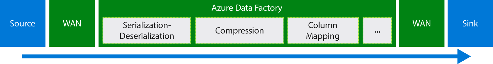
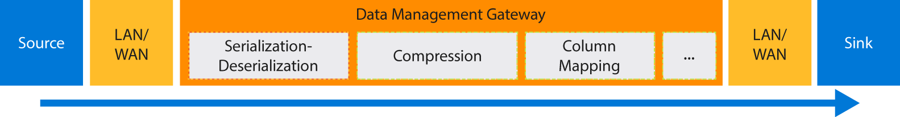

<properties
    pageTitle="Verschieben von Daten mithilfe von kopieren Aktivität | Microsoft Azure"
    description="Erfahren Sie mehr über das Verschieben von Daten in Daten Factory Pipelines: Migration von Daten zwischen Cloud speichern und zwischen einer lokalen Store und einem Cloud-Speicher. Verwenden Sie Aktivität kopieren."
    keywords="Kopieren von Daten, die das Verschieben von Daten, die Datenmigration übertragen von Daten"
    services="data-factory"
    documentationCenter=""
    authors="linda33wj"
    manager="jhubbard"
    editor="monicar"/>

<tags
    ms.service="data-factory"
    ms.workload="data-services"
    ms.tgt_pltfrm="na"
    ms.devlang="na"
    ms.topic="article"
    ms.date="09/22/2016"
    ms.author="jingwang"/>

# Verschieben von Daten mithilfe von kopieren Aktivität

## (Übersicht)
In Azure Data Factory können Sie kopieren Aktivität verwenden, kopieren Sie Daten von anderen Shapes aus verschiedenen lokalen und Datenquellen Azure cloud. Nach Daten kopiert werden, können sie weiteren transformiert und analysiert werden. Kopieren von Aktivitäten können Sie auch Transformation und Analyseergebnisse für Business Intelligence (BI) und Verbrauch Anwendung veröffentlichen.

Kopieren Aktivität verfügt über eine sichere zuverlässigen, skalierbare, und [Dienst global verfügbar](#global). Dieser Artikel enthält Details zum Verschieben von Daten in Daten Factory und Aktivität kopieren.

Zunächst sehen wir uns wie Migration von Daten zwischen zwei Cloud Datenspeicher und zwischen einer lokalen Datenspeicher und einen Cloud-Datenspeicher auftritt.

> [AZURE.NOTE] Informationen zu den Aktivitäten im Allgemeinen, zu können, finden Sie unter [Grundlegendes zu Pipelines und Aktivitäten](data-factory-create-pipelines.md).

### Kopieren von Daten zwischen zwei Cloud-Datenspeicher
Wenn sowohl Quell-als auch Empfänger Datenspeicher in der Cloud befinden, durchläuft kopieren Aktivität der folgenden Phasen zum Kopieren von Daten aus der Quelle an den Empfänger. Der Dienst, der schaltet Aktivität kopieren:

1. Liest Daten aus der Quelle Datenspeicher.
2. Serialisierungs-/Deserialisierungsfehler, Komprimierung/ursprünglich, Spalte Zuordnung ausführt, und geben Sie die Konvertierung. Diese Vorgänge basierend auf der Konfiguration der Eingabe-Dataset, Ausgabe Dataset und kopieren Aktivität bedeutet.
3.  Schreibt Daten in die Ziel-Datenspeicher.

Der Dienst wählt automatisch die optimale Region zur Durchführung der Bewegung Daten. Dieser Bereich ist in der Regel eine, die Empfänger Datenspeicher am nächsten ist.

### Kopieren von Daten zwischen einem lokalen Datenspeicher und einen Cloud-Datenspeicher
Installieren Sie zum sicher Verschieben von Daten zwischen einem lokalen Datenspeicher und einem Datenspeicher Cloud Datenverwaltungsgateway auf Ihrem lokalen Computer. Datenverwaltungsgateway ist ein Agent, der Hybrid Verschieben von Daten und Verarbeitung ermöglicht. Sie können es auf dem gleichen Computer installieren, wie die Daten selbst zu speichern, oder auf einem separaten Computer, die Zugriff auf den Datenspeicher hat.

In diesem Szenario Datenverwaltungsgateway führt die Serialisierung/Deserialisierung, Komprimierung/ursprünglich Zuordnung Spalte, und geben Sie die Konvertierung. Datenfluss nicht über den Azure Data Factory-Dienst. In diesem Fall schreibt Datenverwaltungsgateway die Daten direkt zum Ziel Store.

Finden Sie unter [Verschieben von Daten zwischen lokalen und Cloud Datenspeicher](data-factory-move-data-between-onprem-and-cloud.md) für eine Einführung in und eine exemplarische Vorgehensweise. Ausführliche Informationen zu diesen Agent finden Sie unter [Datenverwaltungsgateway](data-factory-data-management-gateway.md) .

Sie können auch Daten aus dem und in unterstützt Datenspeicher verschieben, die mithilfe von Datenverwaltungsgateway auf IaaS Azure-virtuellen Computern (virtuellen Computern) gehostet werden. In diesem Fall können Sie Datenverwaltungsgateway Speichern der Daten selbst oder einem separaten virtuellen Computers hat, die Zugriff auf den Datenspeicher auf dem gleichen virtuellen Computer installieren.

## Unterstützte-Datenspeicher und Formate
[AZURE.INCLUDE [data-factory-supported-data-stores](../../includes/data-factory-supported-data-stores.md)]

Wenn Sie verschieben müssen speichern Daten in einer, dass kopieren Aktivität nicht unterstützt, verwenden eine **benutzerdefinierte Aktivität** in Factory Daten mit Ihrer eigenen Logik zum Kopieren/Verschieben von Daten. Details zum Erstellen und Verwenden einer benutzerdefinierten Aktivität finden Sie unter [Verwenden von benutzerdefinierten Aktivitäten in einer Azure Data Factory Verkaufspipeline](data-factory-use-custom-activities.md).

### Unterstützte Dateiformate
Können Sie zum Kopieren von Dateien als Aktivität kopieren-zwischen zwei Datei-basierten Datenspeicher wie Azure Blob, Dateisystem und HDFS ist. Hierzu können Sie im [Abschnitt "Format"](data-factory-create-datasets.md) in die Eingabe- und Dataset-Definitionen überspringen. Die Daten werden ohne eine Serialisierung/Deserialisierung effizient kopiert.

Kopieren Aktivität auch aus liest und schreibt in Dateien im angegebenen Formate: Text, Avro, ORC, Parquet und JSON. Sie können die folgenden Aktivitäten kopieren, beispielsweise Aktionen ausführen:

-   Kopieren Sie Daten aus Azure Blob im Textformat (CSV), und Schreiben mit Azure SQL-Datenbank.
-   Kopieren Sie die Dateien im Textformat (CSV) von lokalen Dateisystem, und Schreiben Sie im Format Avro Azure Blob.
-   Kopieren Sie Daten in Azure SQL-Datenbank, und Schreiben auf lokale im Format ORC HDFS.

## Verschieben von Daten global zur Verfügung.
Azure Data Factory steht nur in den Regionen Westen US und ostasiatischen US North Europe. Jedoch steht der Dienst, der kopieren Aktivität schaltet Global in den folgenden Regionen und geografischen Standorten. Der Suchtopologie global verfügbar: Damit ist sichergestellt Bewegung effizient Daten, die in der Regel Cross-Region Abschnitte vermieden werden. Verfügbarkeit von Daten Factory und Verschieben von Daten in einem Bereich finden Sie unter [Services nach Region](https://azure.microsoft.com/regions/#services) .

### Kopieren von Daten zwischen Cloud-Datenspeicher
Wenn sowohl Quell-als auch Empfänger Datenspeicher in der Cloud haben, verwendet Daten Factory Service-Bereitstellung in der Region, das an den Empfänger in der gleichen Geography zum Verschieben der Daten am nächsten ist. Finden Sie in der folgenden Tabelle für die Zuordnung:

Region, der die Ziel-Datenspeicher | Region zum Verschieben von Daten
:----------------------------------- | :----------------------------
Ostasiatische US | Ostasiatische US
Ostasiatische USA 2 | Ostasiatische USA 2
Westen US | Westen US
Westen USA 2 | Westen US
USA – zentral | USA – zentral
USA – zentral "Westen" | USA – zentral
Nord-zentralen US | Nord-zentralen US
Süd zentralen US | Süd zentralen US
North Europa | North Europa
Westen Europa | Westen Europa
Oder Asien | Oder Asien
Ostasien | Oder Asien
Japan OST | Japan OST
Japan "Westen" | Japan OST
Brasilien Süd | Brasilien Süd
Australien OST | Australien OST
Australien oder | Australien oder
Zentrale Indien | Zentrale Indien
Süd Indien | Zentrale Indien
Westen Indien | Zentrale Indien

> [AZURE.NOTE] Ist die Region von Datenspeicher das Ziel nicht in der vorstehenden Liste, schlägt kopieren Aktivität durchläuft eine alternative Region nicht.

### Kopieren von Daten zwischen einem lokalen Datenspeicher und einen Cloud-Datenspeicher
Wenn der zwischen lokalen (oder Azure-virtuellen Computern/IaaS) kopierte Daten und Cloud Stores, [Datenverwaltungsgateway](data-factory-data-management-gateway.md) führt das Verschieben von Daten auf einem lokalen Computer oder virtuellen Computern. Die Daten werden nicht über den Dienst in der Cloud, übergeben, es sei denn, Sie verwenden die Funktion [Kopieren bereitgestellt](data-factory-copy-activity-performance.md#staged-copy) . In diesem Fall Daten durch das staging Azure Blob-Speicher geleitet, bevor sie in den Empfänger Datenspeicher geschrieben werden.

## Erstellen Sie eine Verkaufspipeline mit Aktivität kopieren
Sie können eine Verkaufspipeline mit Kopieren Aktivität auf verschiedene Weise erstellen:

### Mithilfe des Assistenten zum Kopieren
Assistent zum Kopieren von Factory hilft Ihnen zum Erstellen einer Verkaufspipeline mit Aktivität kopieren. Diese Verkaufspipeline können Sie Daten von unterstützten Datenquellen in Ziele *ohne Schreiben JSON* Definitionen für verknüpfte Services, Datasets und Rohrleitungen zu kopieren. Details zu den Assistenten finden Sie unter [Assistent zum Kopieren von Factory](data-factory-copy-wizard.md) .  

### Mithilfe von JSON
Daten Factory-Editor können Azure-Portal, Visual Studio oder Azure PowerShell Sie eine JSON-Definition für eine Verkaufspipeline (mithilfe von kopieren Aktivitäten) erstellen. Klicken Sie dann können Sie es zum Erstellen der Verkaufspipeline in Daten Factory bereitstellen. Finden Sie unter [Lernprogramm: verwenden kopieren Aktivität in einer Azure Data Factory Verkaufspipeline](data-factory-copy-data-from-azure-blob-storage-to-sql-database.md) ein Lernprogramm mit einer schrittweisen Anleitung.    

JSON-Eigenschaften (beispielsweise Name, Beschreibung, Eingabe- und Tabellen und Richtlinien) sind für alle Arten von Aktivitäten verfügbar. Die verfügbaren Eigenschaften in der `typeProperties` Abschnitt der Aktivität bei jeder Aktivität variieren.

Aktivitäten, kopieren die `typeProperties` Abschnitt abhängig von den Typen von Datenquellen und senken. Klicken Sie auf eine Quelle/des im Abschnitt [Quellen und Empfängern unterstützt](#supported-data-stores) , um Informationen zu Typeigenschaften, die Aktivität kopieren für die Datenspeicher unterstützt.   

Hier ist eine Beispiel JSON-Definition:

    {
      "name": "ADFTutorialPipeline",
      "properties": {
        "description": "Copy data from Azure blob to Azure SQL table",
        "activities": [
          {
            "name": "CopyFromBlobToSQL",
            "type": "Copy",
            "inputs": [
              {
                "name": "InputBlobTable"
              }
            ],
            "outputs": [
              {
                "name": "OutputSQLTable"
              }
            ],
            "typeProperties": {
              "source": {
                "type": "BlobSource"
              },
              "sink": {
                "type": "SqlSink",
                "writeBatchSize": 10000,
                "writeBatchTimeout": "60:00:00"
              }
            },
            "Policy": {
              "concurrency": 1,
              "executionPriorityOrder": "NewestFirst",
              "retry": 0,
              "timeout": "01:00:00"
            }
          }
        ],
        "start": "2016-07-12T00:00:00Z",
        "end": "2016-07-13T00:00:00Z"
      }
    }

Der Zeitplan, die in der Ausgabe Dataset definiert ist bestimmt, wann die Aktivität ausgeführt wird (z. B.: **tägliche**, Häufigkeit als **Tag**und Intervall als **1**). Die Aktivität kopiert Daten aus einer Eingabe-Dataset (**Quelle**) zu einem Dataset Ausgabe (**Empfänger**).

Sie können mehr als eine Eingabe-Dataset auf Kopie Aktivität angeben. Sie werden verwendet, um die Abhängigkeiten überprüfen, bevor die Aktivität ausgeführt wird. Nur die Daten aus dem ersten Dataset werden jedoch zum Ziel Dataset kopiert. Weitere Informationen finden Sie unter [Planung und Ausführung](data-factory-scheduling-and-execution.md).  

## Leistung und optimieren
Finden Sie im [Kopieren Aktivität Leistung und Videogeräten Leitfadens](data-factory-copy-activity-performance.md), der wichtige Faktoren beschrieben, die die Leistung von Daten Bewegung (Kopieren Aktivität) in Azure Data Factory beeinflussen. Außerdem listet die beobachtete Leistung bei internen Tests und erläutert verschiedene Methoden zur Optimierung der Leistung von Aktivität kopieren.

## Planung und sequenziellen kopieren
Ausführliche Informationen zur Planung und Ausführung Funktionsweise in Daten Factory finden Sie unter [Planung und Ausführung](data-factory-scheduling-and-execution.md) . Es ist möglich, mehrere von Vorgängen in einer Weise sequenziellen/bestellt einzeln nacheinander ausführen. Finden Sie im Abschnitt [bestellt kopieren](data-factory-scheduling-and-execution.md#ordered-copy) .

## Konvertieren des Datentyps
Andere Datenspeicher haben andere systemeigenen Typsysteme. Kopieren Aktivität führt automatische Konvertieren des Datentyps von Arten von Datenquellen zu Typen mit den folgenden zwei Ansatz ignorieren:

1. Konvertieren von systemeigenen Quelltypen in einen Typ für .NET.
2. Konvertieren von einem Typ .NET in einen Typ native Empfänger ein.

Die Zuordnung aus einer systemeigenen Typsystem in einen Typ .NET für einen Datenspeicher ist in der jeweiligen Daten Store Artikel. (Klicken Sie auf den Link in der Tabelle [Datenspeicher unterstützt](#supported-data-stores) ). Diese Zuordnungen können Sie die entsprechende Typen bestimmen beim Erstellen der Tabellen, sodass Aktivität kopieren die rechten Konvertierungen ausführt.

## Nächste Schritte
- Weitere Informationen über die Aktivität kopieren finden Sie unter [Kopieren von Daten aus Azure Blob-Speicher mit Azure SQL-Datenbank](data-factory-copy-data-from-azure-blob-storage-to-sql-database.md).
- Weitere Informationen zum Verschieben von Daten aus einem lokalen Datenspeicher in einen Cloud-Datenspeicher, finden Sie unter [Verschieben von Daten aus lokalen um cloud Daten speichert](data-factory-move-data-between-onprem-and-cloud.md).
