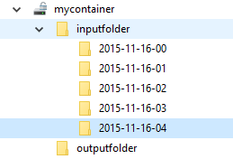
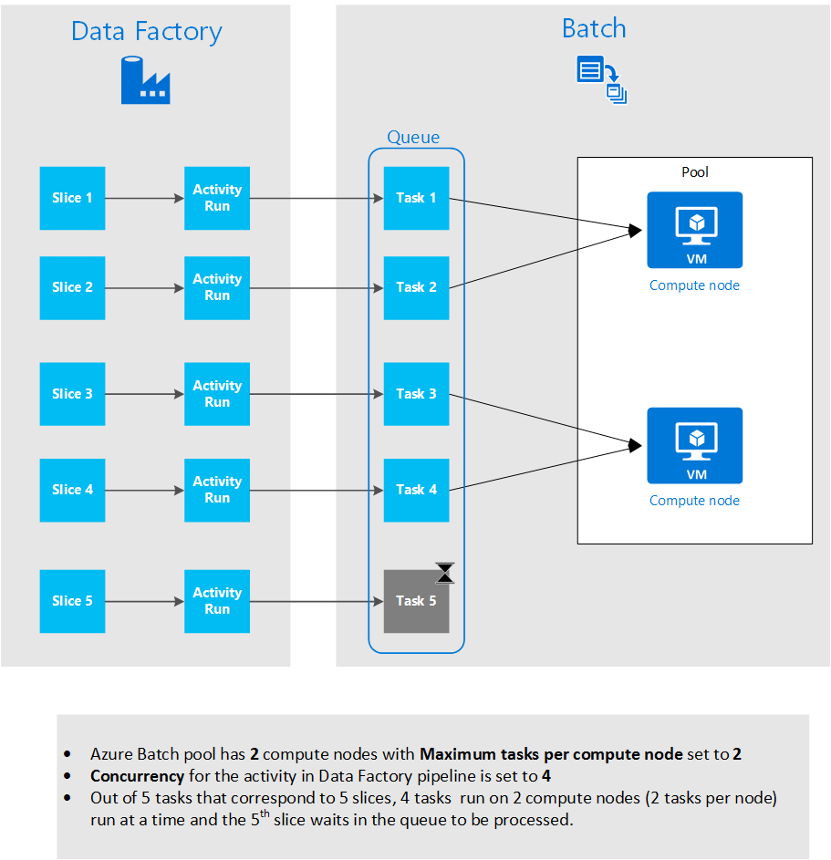
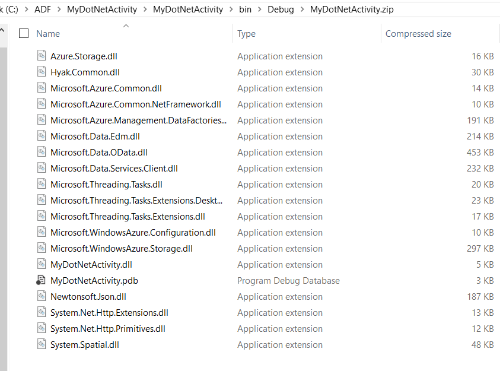

<properties
    pageTitle="Verarbeiten von umfangreichen Datasets mit Daten Factory und Stapel | Microsoft Azure"
    description="Beschrieben, wie Sie große Datenmengen in einer Azure Data Factory Verkaufspipeline mithilfe der parallele Verarbeitung Videofunktionen von Azure Stapel verarbeiten."
    services="data-factory"
    documentationCenter=""
    authors="spelluru"
    manager="jhubbard"
    editor="monicar"/>

<tags
    ms.service="data-factory"
    ms.workload="data-services"
    ms.tgt_pltfrm="na"
    ms.devlang="na"
    ms.topic="article"
    ms.date="10/17/2016"
    ms.author="spelluru"/>

# Prozess umfangreichen Datasets mit Daten Factory und Stapel
Dieser Artikel beschreibt eine Architektur einer Stichprobe-Lösung, die verschoben und umfangreichen Datasets auf automatische und geplante Weise verarbeitet werden. Darüber hinaus eine umfassende Exemplarische Vorgehensweise zum Implementieren der Lösung mit Azure Data Factory und Azure Stapel. 

In diesem Artikel umfasst mehr als unsere typische Artikel, da sie eine exemplarische eine Lösung für die gesamte Beispiel enthält. Wenn Sie neue Stapel und Daten Factory, sind Sie können diese Dienste wissen möchten, und wie sie zusammen funktionieren. Wenn Sie etwas über die Dienste kennen und entwerfen / eine Lösung Architektur werden, können Sie einfach auf die [Architektur Abschnitt](#architecture-of-sample-solution) des Artikels konzentrieren, und wenn Sie Prototypen oder eine Lösung entwickeln, möglicherweise auch möchten Sie eine schrittweise Anleitung in der [Exemplarische Vorgehensweise](#implementation-of-sample-solution)zu testen. Wir laden Sie Ihre Kommentare zu diesen Inhalt und deren Verwendung.

Zunächst sehen wir uns wie Daten Factory und Stapel Services mit großen Datasets in der Cloud Verarbeitung helfen können.     

## Warum Azure Stapel?
Azure Stapel können Sie effizient Ausführen von Applications umfangreiche parallele und High Performance computing (HPC) in der Cloud. Es ist ein Plattformdienst, der in geplant rechenintensiver Arbeit für eine verwaltete Gruppe von virtuellen Computern ausgeführt werden, und kann automatisch skalieren berechnen von Aufträgen Anforderungen Ressourcen.

Mit dem Dienst Stapel definieren Sie Ressourcen Azure berechnen, um parallel und bei der Ihre Programme ausgeführt. Sie können bei Bedarf oder geplante ausführen Aufträge, und Sie müssen nicht manuell erstellen, konfigurieren und Verwalten eines HPC Cluster, einzelne virtuelle Maschinen, virtuelle Netzwerke oder eine komplexe Auftrag und Infrastruktur Planung des Vorgangs.

Finden Sie unter den folgenden Artikeln, wenn Sie nicht mit Azure Stapel vertraut sind, weil es mit den Grundlagen der Architektur/Implementierung der Lösung in diesem Artikel beschriebenen erleichtern.   

- [Grundlagen des Blatts Azure](../batch/batch-technical-overview.md)
- [Stapel Features (Übersicht)](../batch/batch-api-basics.md)

(optional) Wenn Sie weitere Informationen zur Azure Stapel finden Sie unter den [Learning Path für Azure Stapel](https://azure.microsoft.com/documentation/learning-paths/batch/).

## Warum Factory Azure-Daten?
Daten Factory ist eine cloudbasierte Integration Datendienst, der koordiniert und Automatisierung der Bewegung und Transformation von Daten. Sie können mit den Daten Factory-Dienst, verwaltete Datenpipelines, das Verschieben von Daten aus lokalen und Datenspeicher zu einem zentralen Datenspeicher cloud erstellen (zum Beispiel: Azure BLOB-Speicher), und Prozess/Transformation Daten mithilfe von Diensten wie Azure HDInsight und Azure-Computer-Schulung. Sie können auch zum Ausführen in einer geplanten gegenseitig (stündlich, täglich, wöchentlich, usw.) und überwachen und verwalten sie auf einen Blick Probleme zu identifizieren und agieren Datenpipelines planen. 

Finden Sie unter den folgenden Artikeln, wenn Sie nicht mit Azure Data Factory vertraut sind, weil es mit den Grundlagen der Architektur/Implementierung der Lösung in diesem Artikel beschriebenen erleichtern.  

- [Einführung von Factory Azure-Daten](data-factory-introduction.md)
- [Erstellen Sie Ihrer ersten Daten Verkaufspipeline](data-factory-build-your-first-pipeline.md)   

(optional) Wenn Sie weitere Informationen zur Azure-Daten Factory finden Sie unter den [Learning Path für Azure Daten Factory](https://azure.microsoft.com/documentation/learning-paths/data-factory/).

## Daten Factory und Stapel nicht trennen
Daten Factory enthält integrierte Aktivitäten wie Kopieren Aktivität zum Kopieren/Verschieben von Daten aus einem Datenspeicher Quelle zu einem Ziel Datenspeicher und Struktur Aktivität zum Verarbeiten von Daten mithilfe von Hadoop Cluster (HDInsight) auf Azure. Eine Liste der unterstützten Transformationsaktivitäten finden Sie unter [Daten Transformationsaktivitäten](data-factory-data-transformation-activities.md) . 

Außerdem können Sie zum Erstellen von benutzerdefinierter .NET Aktivitäten zum Verschieben oder Verarbeiten von Daten mit Ihrer eigenen Logik und diese Aktivitäten in einem Cluster Azure HDInsight oder in einem Stapel Azure Pool virtueller Computer ausgeführt werden soll. Wenn Sie Azure Stapel verwenden, können Sie den Pool auf automatische Skalierung konfigurieren (hinzufügen oder Entfernen von virtuellen Computern basierend auf die Arbeitsbelastung) basierend auf einer Formel, die Sie zur Verfügung stellen.     

## Architektur Stichprobe Lösung
Obwohl in diesem Artikel beschriebene Architektur für eine einfache Lösung ist, ist es für die komplexe Szenarien wie das Risiko modeling von Finanzdienstleister, Bild Verarbeitung und Rendern und Genomische Analyse. 

Das Diagramm veranschaulicht, 1) wie Daten Factory Verlagerung von Daten und Verarbeitung koordiniert und 2) wie Azure Stapel die Daten in einer parallele Weise verarbeitet. Herunterladen Sie und drucken Sie das Diagramm zur Hand (11 x 17 in. oder Größe A3): [HPC und Daten Orchestrierung Azure Stapel und Factory Daten verwenden](http://go.microsoft.com/fwlink/?LinkId=717686).

Die folgende Liste enthält die grundlegenden Schritte des Prozesses. Die Lösung umfasst Code und erläuterungen zu die End-to-End-Lösung erstellen.

1.  **Konfigurieren von Azure Stapel mit einem Ressourcenpool von Computeknoten (virtuelle Computer)**. Sie können die Anzahl der Knoten und die Größe der einzelnen Knoten angeben.

2.  **Erstellen einer Azure Data Factory-Instanz** , die mit Personen konfiguriert ist, die Azure Blob-Speicher, Azure Stapel Computing-Service, e/a-Daten und ein Workflow/Verkaufspipeline mit Aktivitäten, die verschieben und transformieren Daten darstellen.

3.   **Erstellen einer benutzerdefinierten .NET Aktivität in der Verkaufspipeline Factory Daten**. Die Aktivität ist Ihre Benutzercode, der für den Ressourcenpool Azure Stapel ausgeführt wird.

4.  **Speichern von große Datenmengen wie Eingabedaten als Blobs in Azure-Speicher**. Daten werden in logische Segmente (normalerweise nach Zeiten) aufgeteilt.

5.  An den sekundären Speicherort **Daten Factory kopiert Daten, die parallel verarbeitet wird** .

6.  **Daten Factory ausgeführt wird, die benutzerdefinierte Aktivität mit dem Pool von Stapel zugeordnet wurden**. Daten Factory kann Aktivitäten gleichzeitig ausgeführt werden. Jede Aktivität verarbeitet ein Segments aus Daten. Die Ergebnisse werden im Azure-Speicher gespeichert.

7.  **Daten Factory die endgültige Ergebnisse auf eine dritte Position verschoben**, zur Verteilung über eine app oder für die weitere Verarbeitung von anderen Tools.

## Implementierung der Stichprobe Lösung
Die Lösung Beispiel ist absichtlich einfach und besteht darin, gezeigt, wie Daten Factory Stapel gemeinsames Verwenden von und Datasets verarbeitet werden. Die Lösung ermittelt die Anzahl von Vorkommen des einen Suchbegriff ("Microsoft") einfach von Dateien in einer Serie Zeit organisiert. Es gibt die Anzahl die in der Ausgabedateien aus.

**Zeit**: Wenn Sie mit den Grundlagen von Azure, Daten Factory und Stapel vertraut sind, und die unten aufgeführten erforderlichen Komponenten abgeschlossen haben, wir schätzen diese Lösung dauert 1 und 2 Stunden.

### Erforderliche Komponenten

#### Azure-Abonnement
Wenn Sie ein Azure-Abonnement besitzen, können Sie ein kostenloses Testversion Konto nur wenigen Minuten erstellen. Finden Sie [kostenlose Testversion](https://azure.microsoft.com/pricing/free-trial/)aus.

#### Azure-Speicher-Konto
Verwenden Sie ein Konto Azure-Speicher zum Speichern der Daten in diesem Lernprogramm. Wenn Sie ein Azure-Speicher-Konto besitzen, finden Sie unter [Erstellen eines Speicher-Kontos](../storage/storage-create-storage-account.md#create-a-storage-account). Die Lösung für die Stichprobe verwendet Blob-Speicher.

#### Azure Stapel-Konto
Erstellen Sie ein Stapel Azure-Konto mithilfe der [Azure-Portal](http://manage.windowsazure.com/)an. Finden Sie unter [Erstellen und Verwalten von einem Stapel Azure-Konto](../batch/batch-account-create-portal.md). Beachten Sie die Taste für das Konto Azure Stapel der Servername und die Kontoinformationen ein. [Neu-AzureRmBatchAccount](https://msdn.microsoft.com/library/mt603749.aspx) -Cmdlet können Sie auch um ein Stapel Azure-Konto zu erstellen. Detaillierte Informationen zum Verwenden dieser Cmdlets finden Sie unter [Erste Schritte mit Azure Stapel PowerShell-Cmdlets](../batch/batch-powershell-cmdlets-get-started.md) .

Die Lösung für die Stichprobe verwendet Azure Stapel (indirekt über eine Azure Data Factory Verkaufspipeline) zum Verarbeiten von Daten in einer parallele Weise in einem Pool von Computeknoten (einer verwalteten Auflistung von virtuellen Computern).

#### Azure Stapel Ressourcenpool von virtuellen Computern (virtuellen Computern)
Erstellen einer **Azure Stapel Ressourcenpool** mit mindestens 2 berechnen Knoten.

1.  Im [Portal Azure](https://portal.azure.com)klicken Sie im linken Menü auf **Durchsuchen** , und klicken Sie auf **Stapel Konten**. 
2. Wählen Sie Ihr Konto Azure Stapel, um das **Konto Stapel** Blade zu öffnen. 
3. Klicken Sie auf die Kachel **Pools** .
4. Klicken Sie in das Blade **Pools** auf Schaltfläche auf der Symbolleiste auf einem Ressourcenpool hinzufügen hinzufügen.
    1. Geben Sie eine ID für den Ressourcenpool (**Pool-ID**) ein. Beachten Sie die **Pool-ID**an. benötigt die Daten Factory-Lösung erstellen. 
    2. Geben Sie für die Einstellung der Familie Betriebssystem **Windows Server 2012 R2** an.
    3. Wählen Sie einen **Knoten Preisgestaltung Ebene**aus.
    4. Geben Sie **2** als Wert für die Einstellung **Dedizierter Ziel** ein.
    5. **2** als Wert für die Einstellung **Max Vorgänge pro Knoten** eingeben.
    6. Klicken Sie auf **OK** , um den Ressourcenpool zu erstellen. 
    
#### Azure-Speicher-Explorer   
[Azure Speicher Explorer 6 (Tool)](https://azurestorageexplorer.codeplex.com/) oder [CloudXplorer](http://clumsyleaf.com/products/cloudxplorer) (von ClumsyLeaf Software). Sie können diese Tools zum Überprüfen und ändern die Daten in die Protokolle Cloud gehostete Anwendung einschließlich Azure-Speicher Projekten verwenden.

1.  Erstellen eines Containers mit dem Namen **Mycontainer** mit private-Zugriff (kein anonymer Zugriff)

2.  Wenn Sie **CloudXplorer**verwenden, erstellen Sie Ordner und Unterordner, mit der folgenden Struktur:

    

    **Inputfolder** und **Outputfolder** sind Ordner der obersten Ebene in **Mycontainer,** und die **Inputfolder** weist Unterordner mit Datum-/ Uhrzeit-Stempel (JJJJ-MM-TT-HH).

    Wenn Sie im nächsten Schritt **Azure-Speicher-Explorer**verwenden, müssen Sie zum Hochladen von Dateien mit Namen: inputfolder/2015-11-16-00/file.txt, inputfolder/2015-11-16-01/file.txt usw.. Dieser Schritt erstellt automatisch den Ordner aus.

3.  Erstellen einer Text-Datei **file.txt** auf Ihrem Computer mit Inhalten, die das **Microsoft**-Schlüsselwort enthält. Beispiel: "test benutzerdefinierter Aktivität Microsoft Test benutzerdefinierten Aktivität Microsoft".

4.  Hochladen der Datei zu den folgenden von Ordnern in Azure Blob-Speicher.

    

    Wenn Sie **Azure-Speicher-Explorer**verwenden, laden Sie die Datei **file.txt** auf **Mycontainer**hoch. Klicken Sie auf **Kopieren** , klicken Sie auf der Symbolleiste, um eine Kopie der Blob erstellen. Klicken Sie im Dialogfeld **Kopieren Blob** ändern die **Ziel-Blob-Namen** **inputfolder/2015-11-16-00/file.txt.** Wiederholen Sie diesen Schritt, um inputfolder/2015-11-16-01/file.txt, inputfolder/2015-11-16-02/file.txt, inputfolder/2015-11-16-03/file.txt, inputfolder/2015-11-16-04/file.txt usw. zu erstellen. Diese Aktion erstellt automatisch den Ordner aus.

3.  Erstellen Sie einen anderen Container mit dem Namen: **Customactivitycontainer**. Sie Hochladen benutzerdefinierter Aktivität Zip-Datei mit diesem Container.

#### Visual Studio
Installieren Sie Microsoft Visual Studio 2012 oder höher zum Erstellen der benutzerdefinierten Aktivität, in die Daten Factory-Lösung verwendet werden soll.

### Allgemeinen Schritte, um die Lösung zu erstellen.

1.  Erstellen Sie eine benutzerdefinierte Aktivität, die die Datenverarbeitung Logik enthält.
2.  Erstellen Sie eine Fabrik Azure-Daten, die die benutzerdefinierte Aktivität verwendet:

### Erstellen Sie benutzerdefinierten Aktivität

Die benutzerdefinierte Daten Factory-Aktivität ist das Herzstück dieser Lösung für die Stichprobe. Die Lösung für die Stichprobe verwendet Azure Stapel zum Ausführen benutzerdefinierten Aktivität. Finden Sie unter grundlegende Informationen zu entwickeln benutzerdefinierte Aktivitäten und deren Verwendung in Azure Data Factory Pipelines [benutzerdefinierte Aktivitäten in einer Azure Data Factory Verkaufspipeline verwenden](data-factory-use-custom-activities.md) .

Zum Erstellen eines .NET benutzerdefinierten Aktivität, mit denen Sie, in einer Verkaufspipeline Azure Data Factory müssen Sie ein Projekt **.NET Class Library** mit einer Klasse zu erstellen, die die **IDotNetActivity** Schnittstelle implementiert. Diese Schnittstelle verfügt über nur eine Methode: **Ausführen**. Hier ist die Signatur der Methode:

    public IDictionary<string, string> Execute(
                IEnumerable<LinkedService> linkedServices,
                IEnumerable<Dataset> datasets,
                Activity activity,
                IActivityLogger logger)

Die Methode hat ein paar wichtige Komponenten, die Sie benötigen, zu verstehen.

-   Diese Methode verwendet vier Parameter:

    1.  **LinkedServices**. Eine aufzählbare Liste von verknüpften Diensten, die ein-/Ausgabe Datenquellen verknüpft (zum Beispiel: Azure BLOB-Speicher) Fabrik Daten. In diesem Beispiel ist nur eine verknüpfte Dienst vom Typ Azure-Speicher für ein- und Ausgaben verwendet.

    2.  **Datasets**. Dies ist eine aufzählbare Liste von Datasets. Sie können diesen Parameter verwenden, an die Speicherorte und die Verwendung von Eingabe- und Datasets definierten Schemas.

    3.  **Aktivität**. Für diesen Parameter die aktuellen berechnen Entität darstellt – in diesem Fall eines Stapel Azure-Diensts.

    4.  **Protokollierung**. Die Protokollierung können Sie Debuggen-Kommentare Fläche als das Protokoll "Benutzer" für die Verkaufspipeline schreiben.

-   Die Methode gibt ein Wörterbuch, das zum benutzerdefinierte Aktivitäten in der Zukunft verketten verwendet werden kann. Diese Funktion ist noch nicht verfügbar, also ein leeres Wörterbuch aus der Methode zurückgegeben. 

#### Vorgehensweise: Erstellen Sie benutzerdefinierten Aktivität

1.  Erstellen eines Projekts .NET Class Library in Visual Studio.

    1.  Starten Sie **Visual Studio 2012**/**2013/2015**.

    2.  Klicken Sie auf **Datei**, zeigen Sie auf **neu**, und klicken Sie auf **Projekt**.

    3.  Erweitern Sie **Vorlagen**, und wählen Sie **Visual C\#**. In dieser Anleitung erfahren Sie, verwenden Sie C\#, aber Sie können jeder verwenden, um die benutzerdefinierte Aktivität entwickeln.

    4.  Wählen Sie aus der Liste mit Projekttypen auf der rechten Seite **Class-Bibliothek** aus.

    5.  Geben Sie **MyDotNetActivity** für den **Namen**ein.

    6.  Wählen Sie **C:\\ADF** für den **Speicherort**. Erstellen Sie den Ordner **ADF** , wenn er nicht vorhanden ist.

    7.  Klicken Sie auf **OK** , um das Projekt zu erstellen.

2.  Klicken Sie auf **Extras**, zeigen Sie auf **NuGet-Paket-Manager**, und klicken Sie auf **Paket-Manager-Konsole**.

3.  Führen Sie in der **Paket-Manager-Konsole**den folgenden Befehl aus, um **Microsoft.Azure.Management.DataFactories**zu importieren.

            Install-Package Microsoft.Azure.Management.DataFactories

4.  Importieren des **Azure-Speicher** NuGet-Pakets in dem Projekt. Sie benötigen dieses Paket, da Sie den Blob-Speicher-API in diesem Beispiel verwenden.

        Install-Package Azure.Storage

5.  Fügen Sie **die folgenden Codefensters** zur Quelldatei im Projekt hinzu.

        using System.IO;
        using System.Globalization;
        using System.Diagnostics;
        using System.Linq;

        using Microsoft.Azure.Management.DataFactories.Models;
        using Microsoft.Azure.Management.DataFactories.Runtime;

        using Microsoft.WindowsAzure.Storage;
        using Microsoft.WindowsAzure.Storage.Blob;

6.  Ändern Sie den Namen des **Namespace** in **MyDotNetActivityNS**ein.

        namespace MyDotNetActivityNS

7.  Ändern Sie den Namen der Klasse in **MyDotNetActivity** und leiten Sie ihn aus der **IDotNetActivity** Schnittstelle wie unten dargestellt.

        public class MyDotNetActivity : IDotNetActivity

8.  Implementieren Sie (hinzufügen) **Ausführen** der Methode der **IDotNetActivity** Schnittstelle der Klasse **MyDotNetActivity** , und kopieren Sie den folgenden Code in der Methode. Finden Sie im Abschnitt [Methode ausführen](#execute-method) Erläuterung für die Logik in dieser Methode verwendet.

        /// 

        /// Execute method is the only method of IDotNetActivity interface you must implement.
        /// In this sample, the method invokes the Calculate method to perform the core logic.  
        /// 

        public IDictionary<string, string> Execute(
            IEnumerable<LinkedService> linkedServices,
            IEnumerable<Dataset> datasets,
            Activity activity,
            IActivityLogger logger)
        {

            // declare types for input and output data stores
            AzureStorageLinkedService inputLinkedService;

            Dataset inputDataset = datasets.Single(dataset => dataset.Name == activity.Inputs.Single().Name);
    
            foreach (LinkedService ls in linkedServices)
                logger.Write("linkedService.Name {0}", ls.Name);

            // using First method instead of Single since we are using the same
            // Azure Storage linked service for input and output.
            inputLinkedService = linkedServices.First(
                linkedService =>
                linkedService.Name ==
                inputDataset.Properties.LinkedServiceName).Properties.TypeProperties
                as AzureStorageLinkedService;

            string connectionString = inputLinkedService.ConnectionString; // To create an input storage client.
            string folderPath = GetFolderPath(inputDataset);
            string output = string.Empty; // for use later.

            // create storage client for input. Pass the connection string.
            CloudStorageAccount inputStorageAccount = CloudStorageAccount.Parse(connectionString);
            CloudBlobClient inputClient = inputStorageAccount.CreateCloudBlobClient();

            // initialize the continuation token before using it in the do-while loop.
            BlobContinuationToken continuationToken = null;
            do
            {   // get the list of input blobs from the input storage client object.
                BlobResultSegment blobList = inputClient.ListBlobsSegmented(folderPath,
                                         true,
                                         BlobListingDetails.Metadata,
                                         null,
                                         continuationToken,
                                         null,
                                         null);

                // Calculate method returns the number of occurrences of
                // the search term (“Microsoft”) in each blob associated
                // with the data slice.
                //
                // definition of the method is shown in the next step.
                output = Calculate(blobList, logger, folderPath, ref continuationToken, "Microsoft");

            } while (continuationToken != null);

            // get the output dataset using the name of the dataset matched to a name in the Activity output collection.
            Dataset outputDataset = datasets.Single(dataset => dataset.Name == activity.Outputs.Single().Name);

            folderPath = GetFolderPath(outputDataset);

            logger.Write("Writing blob to the folder: {0}", folderPath);

            // create a storage object for the output blob.
            CloudStorageAccount outputStorageAccount = CloudStorageAccount.Parse(connectionString);
            // write the name of the file.
            Uri outputBlobUri = new Uri(outputStorageAccount.BlobEndpoint, folderPath + "/" + GetFileName(outputDataset));

            logger.Write("output blob URI: {0}", outputBlobUri.ToString());
            // create a blob and upload the output text.
            CloudBlockBlob outputBlob = new CloudBlockBlob(outputBlobUri, outputStorageAccount.Credentials);
            logger.Write("Writing {0} to the output blob", output);
            outputBlob.UploadText(output);

            // The dictionary can be used to chain custom activities together in the future.
            // This feature is not implemented yet, so just return an empty dictionary.
            return new Dictionary<string, string>();
        }

9.  Die folgenden Helper Methoden der Klasse hinzufügen. Diese Methoden werden von der Methode **Ausführen** aufgerufen. Die **Calculate** -Methode isoliert, vor allem den Code, der einzelnen Blob durchläuft.

        /// 

        /// Gets the folderPath value from the input/output dataset.
        /// 

        private static string GetFolderPath(Dataset dataArtifact)
        {
            if (dataArtifact == null || dataArtifact.Properties == null)
            {
                return null;
            }

            AzureBlobDataset blobDataset = dataArtifact.Properties.TypeProperties as AzureBlobDataset;
            if (blobDataset == null)
            {
                return null;
            }

            return blobDataset.FolderPath;
        }

        /// 

        /// Gets the fileName value from the input/output dataset.
        /// 

        private static string GetFileName(Dataset dataArtifact)
        {
            if (dataArtifact == null || dataArtifact.Properties == null)
            {
                return null;
            }

            AzureBlobDataset blobDataset = dataArtifact.Properties.TypeProperties as AzureBlobDataset;
            if (blobDataset == null)
            {
                return null;
            }

            return blobDataset.FileName;
        }

        /// 

        /// Iterates through each blob (file) in the folder, counts the number of instances of search term in the file,
        /// and prepares the output text that is written to the output blob.
        /// 

        public static string Calculate(BlobResultSegment Bresult, IActivityLogger logger, string folderPath, ref BlobContinuationToken token, string searchTerm)
        {
            string output = string.Empty;
            logger.Write("number of blobs found: {0}", Bresult.Results.Count<IListBlobItem>());
            foreach (IListBlobItem listBlobItem in Bresult.Results)
            {
                CloudBlockBlob inputBlob = listBlobItem as CloudBlockBlob;
                if ((inputBlob != null) && (inputBlob.Name.IndexOf("$$$.$$$") == -1))
                {
                    string blobText = inputBlob.DownloadText(Encoding.ASCII, null, null, null);
                    logger.Write("input blob text: {0}", blobText);
                    string[] source = blobText.Split(new char[] { '.', '?', '!', ' ', ';', ':', ',' }, StringSplitOptions.RemoveEmptyEntries);
                    var matchQuery = from word in source
                                     where word.ToLowerInvariant() == searchTerm.ToLowerInvariant()
                                     select word;
                    int wordCount = matchQuery.Count();
                    output += string.Format("{0} occurrences(s) of the search term \"{1}\" were found in the file {2}.\r\n", wordCount, searchTerm, inputBlob.Name);
                }
            }
            return output;
        }

    Die Methode **"GetFolderPath"** gibt den Pfad zu dem Ordner, dem auf das Dataset verweist, und die **GetFileName** -Methode gibt den Namen der Blob-Datei, der auf das Dataset verweist.

        "name": "InputDataset",
        "properties": {
            "type": "AzureBlob",
            "linkedServiceName": "StorageLinkedService",
            "typeProperties": {
                "fileName": "file.txt",
                "folderPath": "mycontainer/inputfolder/{Year}-{Month}-{Day}-{Hour}",

    Die **Calculate** -Methode berechnet die Anzahl der Instanzen des Schlüsselworts **Microsoft** in der Eingabewerte Dateien (Blobs im Ordner). Der Suchbegriff ist ("Microsoft") in den Code hartcodierte.

10.  Kompilieren Sie das Projekt an. Klicken Sie im Menü auf **Erstellen** , und klicken Sie auf die **Lösung erstellen**.

11.  Starten Sie **Windows-Explorer**, und navigieren Sie zu **Papierkorb\\Debuggen** oder **Papierkorb\\lassen Sie wieder los** Ordner je nach Typ der erstellen.

12.  Erstellen einer Zipdatei **MyDotNetActivity.zip** , die alle Binärdateien enthält die ** \\Papierkorb\\Debuggen** Ordner. Sie möchten die MyDotNetActivity enthalten. **PDB** -Datei eintritt, damit Sie weitere Details wie Zeilennummer im Quellcode abzurufen, die Ursache des Problems, wenn ein Fehler beim.

    

13.  Hochladen von **MyDotNetActivity.zip** als Blob in den Container Blob: **Customactivitycontainer** in der Azure Blob-Speicher, dass der **StorageLinkedService** -Dienst in der **ADFTutorialDataFactory** verknüpft verwendet. Erstellen der Blob Container **Customactivitycontainer** an, wenn es nicht bereits vorhanden ist.

#### Methode ausführen

Dieser Abschnitt enthält weitere Details und Hinweise zu den Code in der Methode ausführen.

1.  Die Mitglieder für die Eingabewerte Auflistung durchlaufen finden Sie in den Namespace [Microsoft.WindowsAzure.Storage.Blob](https://msdn.microsoft.com/library/azure/microsoft.windowsazure.storage.blob.aspx) . Durchlaufen der Blob-Auflistung erfordert die Verwendung der Klasse **BlobContinuationToken** . Im Wesentlichen müssen Sie verwenden, führen Sie eine-während der Schleife mit dem Token als das Verfahren für die Schleife beendet wird. Weitere Informationen finden Sie unter [Verwenden von .NET Blob-Speicher](../storage/storage-dotnet-how-to-use-blobs.md). Eine einfache Schleife lautet:

        // Initialize the continuation token.
        BlobContinuationToken continuationToken = null;
        do
        {
        // Get the list of input blobs from the input storage client object.
        BlobResultSegment blobList = inputClient.ListBlobsSegmented(folderPath,
                                true,
                                          BlobListingDetails.Metadata,
                                          null,
                                          continuationToken,
                                          null,
                                          null);
        // Return a string derived from parsing each blob.
            output = Calculate(blobList, logger, folderPath, ref continuationToken, "Microsoft");

        } while (continuationToken != null);

    Finden Sie in der Dokumentation für die [ListBlobsSegmented](https://msdn.microsoft.com/library/jj717596.aspx) -Methode.

2.  Der Code für die Arbeit durch das Festlegen von Blobs logisch wechselt innerhalb der-während der Schleife. In der Methode **Ausführen** , führen Sie die-während der Schleife für die Liste der Blobs an eine Methode namens **berechnen**übergibt. Die Methode gibt eine Zeichenfolgenvariablen, mit dem Namen wird das Ergebnis der Probleme durchlaufen alle Blobs in das Segment **Ausgabe** an.

    Es gibt die Anzahl der Vorkommen des Suchbegriffs (**Microsoft**), in dem Blob an die **Calculate** -Methode übergeben.

        output += string.Format("{0} occurrences of the search term \"{1}\" were found in the file {2}.\r\n", wordCount, searchTerm, inputBlob.Name);

3.  Sobald die **Calculate** -Methode die Arbeit abgeschlossen hat, müssen sie eine neue Blob geschrieben werden. Damit Sie für jede Gruppe von Blobs verarbeitet werden sollen, ein neuer Blob mit den Ergebnissen geschrieben werden kann. Um eine neue Blob zu schreiben, müssen Sie zuerst suchen Sie das Ausgabe Dataset.

        // Get the output dataset using the name of the dataset matched to a name in the Activity output collection.
        Dataset outputDataset = datasets.Single(dataset => dataset.Name == activity.Outputs.Single().Name);

4.  Der Code ruft auch eine Methode Helper: **GetFolderPath** zum Abrufen des Ordnerpfads (der Name der Speicher-Container).

        folderPath = GetFolderPath(outputDataset);

    Die **GetFolderPath** wandelt das DataSet-Objekt, das eine AzureBlobDataSet, die eine Eigenschaft namens Ordnerpfad hat.

        AzureBlobDataset blobDataset = dataArtifact.Properties.TypeProperties as AzureBlobDataset;

        return blobDataset.FolderPath;

5.  Der Code Ruft die **GetFileName** -Methode, um den Dateinamen (Blob Name) abzurufen. Der Code ist ähnlich wie der oben angegebenen Code können Sie den Pfad des Ordners zu gelangen.

        AzureBlobDataset blobDataset = dataArtifact.Properties.TypeProperties as AzureBlobDataset;

        return blobDataset.FileName;

6.  Der Name der Datei wird durch Erstellen einer URI-Objekt geschrieben. Der URI-Konstruktor verwendet die Eigenschaft **BlobEndpoint** , um den Containernamen zurück. Der Ordnername Pfad und Dateinamen werden zum Erstellen des Ausgabe BLOBs-URI hinzugefügt.  

        // Write the name of the file.
        Uri outputBlobUri = new Uri(outputStorageAccount.BlobEndpoint, folderPath + "/" + GetFileName(outputDataset));

7.  Der Name der Datei geschrieben wurde, und Sie können nun die Ausgabezeichenfolge aus der **Calculate** -Methode schreiben, in ein neues Blob:

        // Create a blob and upload the output text.
        CloudBlockBlob outputBlob = new CloudBlockBlob(outputBlobUri, outputStorageAccount.Credentials);
        logger.Write("Writing {0} to the output blob", output);
        outputBlob.UploadText(output);

### Erstellen Sie die Daten factory

Im Abschnitt [Erstellen benutzerdefinierten Aktivität](#create-the-custom-activity) erstellt eine benutzerdefinierte Aktivität und die Zip-Datei mit Binärdateien und PDB-Datei zu einem Container Azure Blob hochgeladen. In diesem Abschnitt erstellen Sie eine Azure- **Daten Factory** mit **Verkaufspipeline** , die die **benutzerdefinierte Aktivität**verwendet.

Das Eingabe-Dataset für die benutzerdefinierte Aktivität darstellt die Blobs (Dateien) in den Ordner "Eingabe" (Mycontainer\\Inputfolder) im BLOB-Speicher. Das Ausgabe Dataset für die Aktivität darstellt, die Ausgabe Blobs im Ausgabeordner (Mycontainer\\Outputfolder) im BLOB-Speicher.

Legen Sie eine oder mehrere Dateien in die Eingabewerte Ordner an:

    mycontainer -\> inputfolder
        2015-11-16-00
        2015-11-16-01
        2015-11-16-02
        2015-11-16-03
        2015-11-16-04

Legen Sie beispielsweise eine Datei (Datei.txt) mit den folgenden Inhalt in allen Ordnern.

    test custom activity Microsoft test custom activity Microsoft

Jede Eingabe Ordner entspricht einer Segment in Azure Data Factory, auch wenn der Ordner 2 oder mehrere Dateien hat. Wenn Sie jedes Segment von der Verkaufspipeline verarbeitet wird, durchläuft benutzerdefinierte Aktivität alle Blobs im Ordner "Eingabe" für die Segment.

Fünf Ausgabedateien mit denselben Inhalt angezeigt. Die Ausgabedatei aus, die Datei im Ordner 2015-11-16-00 Verarbeitung weist beispielsweise den folgenden Inhalt:

    2 occurrences(s) of the search term "Microsoft" were found in the file inputfolder/2015-11-16-00/file.txt.

Wenn Sie mehrere Dateien (Datei.txt, file2.txt, file3.txt) mit den gleichen Inhalt in den Ordner Eingabewerte ablegen, sehen Sie den folgenden Inhalt in der Ausgabedatei. Jeder Ordner (2015-11-16-00 usw.) entspricht einem Segment in diesem Beispiel, obwohl der Ordner mehrere Eingabewerte Dateien hat.

    2 occurrences(s) of the search term "Microsoft" were found in the file inputfolder/2015-11-16-00/file.txt.
    2 occurrences(s) of the search term "Microsoft" were found in the file inputfolder/2015-11-16-00/file2.txt.
    2 occurrences(s) of the search term "Microsoft" were found in the file inputfolder/2015-11-16-00/file3.txt.

Die Ausgabedatei enthält drei Zeilen nun eine für jede Eingabe Datei (Blob) in den Ordner, der das Segment (2015-11-16-00) zugeordnet.

Für jede Aktivität ausgeführt wird eine Aufgabe erstellt. In diesem Beispiel gibt es nur eine Aktivität in der Verkaufspipeline. Wenn ein Segment von der Verkaufspipeline verarbeitet wird, wird die benutzerdefinierte Aktivität Azure Blattnamen das Segment Verarbeitungszeit ausgeführt. Da es gibt fünf Segmente (jedes Segment kann mehrere Blobs oder Datei haben), es gibt fünf Aufgaben in Azure Stapel erstellt. Wenn ein Vorgang auf Stapel ausgeführt wird, ist es tatsächlich benutzerdefinierter Aktivität, der ausgeführt wird.

Die folgende exemplarische Vorgehensweise enthält weitere Details an.

#### Schritt 1: Erstellen der Factory Daten

1.  Führen Sie nach der Anmeldung [Azure-Portal](https://portal.azure.com/)die folgenden Schritte aus:

    1.  Klicken Sie im Menü links auf **neu** .

    2.  Klicken Sie auf **Daten + Analytics** in das **neue** Blade.

    3.  Klicken Sie auf das Blade **Daten Analytics** **Data Factory** .

2.  Geben Sie in das **neue Daten Factory** Blade **CustomActivityFactory** für den Namen ein. Der Name der Factory Azure-Daten muss global eindeutig sein. Wenn Sie die Fehlermeldung: **Factory Data Source Name "CustomActivityFactory" ist nicht verfügbar**, ändern Sie den Namen der Factory Daten (z. B. **YournameCustomActivityFactory**), und versuchen Sie erneut erstellen.

3.  Klicken Sie auf **RESSOURCENGRUPPENNAMEN**, und wählen Sie eine vorhandene Ressourcengruppe oder erstellen Sie eine Ressourcengruppe.

4.  Stellen Sie sicher, dass Sie verwenden die richtige Abonnement und Region, werden die Daten Factory erstellt werden soll.

5.  Klicken Sie auf die **neuen Daten Factory** -Blade auf **Erstellen** .

6.  Sie sehen die Daten Factory im **Dashboard** des Portals Azure erstellt wird.

7.  Nachdem die Daten Factory erfolgreich erstellt wurde, wird die Factory Seite, die Sie den Inhalt der Daten Factory anzeigt.

 

#### Schritt 2: Erstellen von verknüpften Diensten

Verknüpfte Services Datenspeicher verknüpfen oder Dienste für eine Fabrik Azure-Daten zu berechnen. In diesem Schritt verknüpfen Sie Ihre **Azure-Speicher** -Konto und **Azure Stapel** Konto mit Ihrer Daten Factory ein.

#### Erstellen von Azure verknüpft Speicherdienst

1.  Klicken Sie auf die **Autor und Bereitstellen** Kachel auf dem **Daten FACTORY** -Blade für **CustomActivityFactory**. Sie sehen die Daten Factory-Editor.

2.  Klicken Sie auf der Befehlsleiste auf **neue Daten speichern möchten** , und wählen Sie **Azure-Speicher.** Es sollte das JSON-Skript zum Erstellen einer Azure verknüpft Speicherdienst im Editor angezeigt.

    

3.  Ersetzen Sie **Kontonamen** durch den Namen Ihrer Azure-Speicher-Konto und **kontoschlüssel** zusammen mit der Tastenkombination für das Konto ein Azure-Speicher. So erhalten Sie Ihre Zugriffstaste Speicher finden Sie unter [anzeigen, kopieren und neu generieren Speicher Zugriffstasten](../storage/storage-create-storage-account.md#view-copy-and-regenerate-storage-access-keys).

4.  Klicken Sie auf der Befehlsleiste verknüpften Dienst bereitstellen auf **Bereitstellen** .

    

#### Erstellen von Azure Stapel verknüpft-Dienst

In diesem Schritt erstellen Sie einen verknüpften Dienst für Ihr **Stapel Azure** -Konto, mit dem den Daten Factory benutzerdefinierten Aktivität ausführen.

1.  Klicken Sie auf der Befehlsleiste auf **neu zu berechnen** , und wählen Sie **Azure Stapel.** Es sollte das JSON-Skript zum Erstellen eines Azure Stapel verknüpft-Diensts im Editor angezeigt.

2.  Klicken Sie in das JSON-Skript:

    1.  Ersetzen Sie durch den Namen Ihres Kontos Azure Stapel **Kontonamen** ein.

    2.  Ersetzen Sie **Zugriffstaste** zusammen mit der Tastenkombination für das Stapel Azure-Konto an.

    3.  Geben Sie die ID des dem Pool für die Eigenschaft **Pool** **** aus. Für diese Eigenschaft können Sie entweder Ressourcenpool Namen oder pool-ID

    4.  Geben Sie den Stapel URI für die **BatchUri** JSON-Eigenschaft aus. 
    
        > [AZURE.IMPORTANT] Die **URL** aus dem **Stapel Azure-Konto Blade** befindet sich in folgendem Format: \<Kontoname\>. \<Region\>. batch.azure.com. Für die **BatchUri** -Eigenschaft in den JSON müssen Sie **Entfernen "Kontoname."** über die URL. Beispiel: `"batchUri": "https://eastus.batch.azure.com"`.

        

        Für die Eigenschaft **Pool** können Sie auch die ID des dem Pool anstelle des Namens des Pool angeben.

        > [AZURE.NOTE] Der Dienst Daten Factory unterstützt eine Option bei Bedarf für Azure Stapel nicht wie bei HDInsight. Sie können eigene Ressourcenpool Azure Stapel nur in einer Factory Azure-Daten verwenden.

    5.  Geben Sie für die Eigenschaft **LinkedServiceName** **StorageLinkedService** an. Sie erstellt diesen Dienst verknüpften im vorherigen Schritt. Dieser Speicher wird als Staging-Bereich für Dateien und Protokolle verwendet.

3.  Klicken Sie auf der Befehlsleiste verknüpften Dienst bereitstellen auf **Bereitstellen** .

#### Schritt 3: Erstellen von datasets

In diesem Schritt erstellen Sie Datasets um Eingabe- und Daten darstellen.

#### Erstellen von dataset

1.  Klicken Sie im **Editor** für die Daten Factory auf der Symbolleiste auf die Schaltfläche **neue Dataset** aus, und klicken Sie im Dropdown-Menü auf **Azure Blob-Speicher** .

2.  Ersetzen Sie die JSON im rechten Bereich mit den folgenden JSON-Codeausschnitt:

        {
            "name": "InputDataset",
            "properties": {
                "type": "AzureBlob",
                "linkedServiceName": "AzureStorageLinkedService",
                "typeProperties": {
                    "folderPath": "mycontainer/inputfolder/{Year}-{Month}-{Day}-{Hour}",
                    "format": {
                        "type": "TextFormat"
                    },
                    "partitionedBy": [
                        {
                            "name": "Year",
                            "value": {
                                "type": "DateTime",
                                "date": "SliceStart",
                                "format": "yyyy"
                            }
                        },
                        {
                            "name": "Month",
                            "value": {
                                "type": "DateTime",
                                "date": "SliceStart",
                                "format": "MM"
                            }
                        },
                        {
                            "name": "Day",
                            "value": {
                                "type": "DateTime",
                                "date": "SliceStart",
                                "format": "dd"
                            }
                        },
                        {
                            "name": "Hour",
                            "value": {
                                "type": "DateTime",
                                "date": "SliceStart",
                                "format": "HH"
                            }
                        }
                    ]
                },
                "availability": {
                    "frequency": "Hour",
                    "interval": 1
                },
                "external": true,
                "policy": {}
            }
        }

     Sie erstellen eine Verkaufspipeline später in dieser Anleitung erfahren mit Startzeit: 2015-11-16T00:00:00Z und die Endzeit: 2015-11-16T05:00:00Z. Geplanten Daten **stündlich**, zu erzeugen, damit es 5/Ausgang Segmente gibt (zwischen **00**: 00:00 -\> **05**: 00:00).

     Die **Häufigkeit** und die **Intervall** für die Eingabe-Dataset wird festgelegt, **Stunde** und **1**, was bedeutet, dass das Segment Eingabewerte stündlich verfügbar ist.

     Hier sind die Startzeiten für jedes Segment, das durch **SliceStart** Systemvariable in den oben angegebenen JSON-Codeausschnitt dargestellt wird.

  	| **Segment** | **Startzeit**          |
  	|-----------|-------------------------|
  	| 1         | 2015-11-16T**00**: 00:00 |
  	| 2         | 2015-11-16T**01**: 00:00 |
  	| 3         | 2015-11-16T**02**: 00:00 |
  	| 4         | 2015-11-16T**03**: 00:00 |
  	| 5         | 2015-11-16T**04**: 00:00 |

     Der **Ordnerpfad** wird mithilfe des Jahr, Monat, Tag und Stunde Teils der Startzeit Segments (**SliceStart**) berechnet. Hier also wie ein Eingabe Ordner mit einem Segment zugeordnet wird.

  	| **Segment** | **Startzeit**          | **Eingabe Ordner**  |
  	|-----------|-------------------------|-------------------|
  	| 1         | 2015-11-16T**00**: 00:00 | 2015-11-16 -**00** |
  	| 2         | 2015-11-16T**01**: 00:00 | 2015-11-16 -**01** |
  	| 3         | 2015-11-16T**02**: 00:00 | 2015-11-16 -**02** |
  	| 4         | 2015-11-16T**03**: 00:00 | 2015-11-16 -**03** |
  	| 5         | 2015-11-16T**04**: 00:00 | 2015-11-16 -**04** |

3.  Klicken Sie auf der Symbolleiste auf erstellen und Bereitstellen der Tabelle **InputDataset** auf **Bereitstellen** . 

#### Die Ausgabe Dataset erstellen

In diesem Schritt erstellen Sie einen anderen Dataset vom Typ AzureBlob, um die Ausgabedaten darzustellen.

1.  Klicken Sie im **Editor** für die Daten Factory auf der Symbolleiste auf die Schaltfläche **neue Dataset** aus, und klicken Sie im Dropdown-Menü auf **Azure Blob-Speicher** .

2.  Ersetzen Sie die JSON im rechten Bereich mit den folgenden JSON-Codeausschnitt:

        {
            "name": "OutputDataset",
            "properties": {
                "type": "AzureBlob",
                "linkedServiceName": "AzureStorageLinkedService",
                "typeProperties": {
                    "fileName": "{slice}.txt",
                    "folderPath": "mycontainer/outputfolder",
                    "partitionedBy": [
                        {
                            "name": "slice",
                            "value": {
                                "type": "DateTime",
                                "date": "SliceStart",
                                "format": "yyyy-MM-dd-HH"
                            }
                        }
                    ]
                },
                "availability": {
                    "frequency": "Hour",
                    "interval": 1
                }
            }
        }

    Eine Ausgabe Blob-Datei wird für jedes Eingabewerte Segment generiert. So sieht wie eine Ausgabedatei für jedes Segment benannt wird. Die Ausgabedateien werden in einem Ausgabeordner generiert: **Mycontainer\\Outputfolder**.

  	| **Segment** | **Startzeit**          | **Die Ausgabedatei**       |
  	|-----------|-------------------------|-----------------------|
  	| 1         | 2015-11-16T**00**: 00:00 | 2015-11-16 -**00. Txt** |
  	| 2         | 2015-11-16T**01**: 00:00 | 2015-11-16 -**01. Txt** |
  	| 3         | 2015-11-16T**02**: 00:00 | 2015-11-16 -**02. Txt** |
  	| 4         | 2015-11-16T**03**: 00:00 | 2015-11-16 -**03. Txt** |
  	| 5         | 2015-11-16T**04**: 00:00 | 2015-11-16 -**04. Txt** |

     Denken Sie daran, die alle Dateien in einem Ordner Eingabewerte (zum Beispiel: 2015-11-16-00) sind Teil eines Segments mit der Startzeit: 2015-11-16-00. Bei der Verarbeitung dieses Segments, benutzerdefinierte Aktivität werden alle Dateien scannt und erzeugt eine Zeile in der Ausgabedatei mit der Anzahl von Vorkommen des Suchbegriff ("Microsoft"). Wenn es drei Dateien im Ordner 2015-11-16-00 gibt, werden drei Zeilen, in der Ausgabedatei: 2015-11-16-00.txt.

3.  Klicken Sie auf der Symbolleiste auf erstellen und Bereitstellen der **OutputDataset**auf **Bereitstellen** .

#### Schritt 4: Erstellen Sie und führen Sie der Verkaufspipeline mit benutzerdefinierter Aktivität aus

In diesem Schritt erstellen Sie eine Verkaufspipeline mit einer Aktivität, die benutzerdefinierte Aktivitäten, die Sie zuvor erstellt haben.

> [AZURE.IMPORTANT] Wenn Sie die **Datei.txt** zum Ordner im Container Blob Eingabemethoden noch nicht hochgeladen haben, führen Sie vor dem Erstellen der Verkaufspipeline. Die Eigenschaft **IsPaused** ist in der Verkaufspipeline JSON, auf False festgelegt damit die Verkaufspipeline sofort ausgeführt wird, wie **das Startdatum** in der Vergangenheit liegt.

1.  Klicken Sie in den Daten Factory-Editor auf **neue Verkaufspipeline** auf der Befehlsleiste. Wenn Sie den Befehl nicht angezeigt werden, klicken Sie auf **... (Auslassungspunkte)** um ihn anzuzeigen.

2.  Ersetzen Sie die JSON im rechten Bereich mit den folgenden JSON-Skript ein:

        {
            "name": "PipelineCustom",
            "properties": {
                "description": "Use custom activity",
                "activities": [
                    {
                        "type": "DotNetActivity",
                        "typeProperties": {
                            "assemblyName": "MyDotNetActivity.dll",
                            "entryPoint": "MyDotNetActivityNS.MyDotNetActivity",
                            "packageLinkedService": "AzureStorageLinkedService",
                            "packageFile": "customactivitycontainer/MyDotNetActivity.zip"
                        },
                        "inputs": [
                            {
                                "name": "InputDataset"
                            }
                        ],
                        "outputs": [
                            {
                                "name": "OutputDataset"
                            }
                        ],
                        "policy": {
                            "timeout": "00:30:00",
                            "concurrency": 5,
                            "retry": 3
                        },
                        "scheduler": {
                            "frequency": "Hour",
                            "interval": 1
                        },
                        "name": "MyDotNetActivity",
                        "linkedServiceName": "AzureBatchLinkedService"
                    }
                ],
                "start": "2015-11-16T00:00:00Z",
                "end": "2015-11-16T05:00:00Z",
                "isPaused": false
           }
        }

    Beachten Sie die folgenden Punkte:

    -   Es gibt nur eine Aktivität in der Verkaufspipeline und vom Typ: **DotNetActivity**.

    -   **AssemblyName** festgelegt ist, auf den Namen der DLL: **MyDotNetActivity.dll**.

    -   **Einstiegspunkt** ist **MyDotNetActivityNS.MyDotNetActivity**festgelegt. Es ist im Grunde \<Namespace\>. \<Objektname\> im Code.

    -   **PackageLinkedService** wird auf **StorageLinkedService** festgelegt, die auf die Blob-Speicher verweist, die die benutzerdefinierte Aktivität Zip-Datei enthält. Wenn Sie verschiedene Azure-Speicher Konten für/Ausgang Dateien und die Zip-Datei mit benutzerdefinierter Aktivität verwenden, müssen Sie ein anderes Azure verknüpft Speicherdienst erstellen. In diesem Artikel wird vorausgesetzt, dass Sie das gleiche Speicher Azure-Konto verwenden.

    -   **PackageFile** ist **customactivitycontainer/MyDotNetActivity.zip**festgelegt. Es ist im Format: \<Containerforthezip\>/\<nameofthezip.zip\>.

    -   Die benutzerdefinierte Aktion verwendet **InputDataset** als Eingabe und **OutputDataset** in der Ausgabe.

    -   Die Eigenschaft **LinkedServiceName** benutzerdefinierter Aktivität verweist auf **AzureBatchLinkedService**, wodurch Azure Data Factory angewiesen wird, die die benutzerdefinierte Aktivität auf Azure Stapel ausgeführt werden muss.

    -   Die Einstellung **Parallelität** ist wichtig. Wenn Sie den Standardwert, also 1 verwenden, auch wenn stehen Ihnen 2 oder mehr Knoten im Pool Azure Stapel berechnen, werden die Segmente verarbeitet einzeln nacheinander. Daher abzubrechen Sie nicht die Funktion parallele Verarbeitung des Blatts Azure nutzen. Wenn Sie einen höheren Wert **Parallelität** festlegen, sagen 2, dies bedeutet, dass zwei slices (entspricht zwei Aufgaben in Azure Stapel) zur gleichen Zeit, in diesem Fall der virtuellen Computern, im Ressourcenpool genutzt werden Azure Stapel verarbeitet werden können. Die Eigenschaft Parallelität daher ordnungsgemäß festgelegt werden.

    -   Nur eine Aufgabe (Segment) wird standardmäßig eine virtuellen Computers zu einem beliebigen Zeitpunkt ausgeführt. Der Grund ist, dass standardmäßig die **Maximum Vorgänge pro virtueller Computer** für eine Azure Stapel Ressourcenpool auf 1 festgelegt ist. Als Bestandteil der erforderlichen Komponenten haben Sie einem Ressourcenpool erstellt, mit dieser Eigenschaft auf 2 festlegen, damit zwei Daten Factory Segmente zur gleichen Zeit auf einen virtuellen Computer ausgeführt werden können.

    -   Die Standardeinstellung für **IsPaused** Eigenschaft ist falsch. Der Verkaufspipeline wird sofort in diesem Beispiel wird ausgeführt, da die Segmente in der Vergangenheit zu starten. Legen Sie diese Eigenschaft auf True, wenn der Verkaufspipeline zeigen, und legen Sie dafür falsch neu starten zurück.

    -   Die **Start-** und **Endzeiten** werden fünf Stunden auseinander und stündlich, Segmente hergestellt werden, damit nach der Verkaufspipeline fünf Segmente gefertigt wurden.

3.  Klicken Sie auf der Befehlsleiste in der Verkaufspipeline bereitstellen auf **Bereitstellen** .

#### Schritt 5: Testen der Verkaufspipeline

In diesem Schritt testen Sie die Verkaufspipeline durch Ablegen von Dateien in die Eingabewerte Ordner aus. Beginnen wir mit der Verkaufspipeline mit einer Datei pro eine Eingabe Ordner testen.

1.  Klicken Sie in vorher Factory Daten in der Azure-Portal auf **Diagramm**.

    

2.  Doppelklicken Sie in der Diagrammansicht auf Eingabe-Dataset: **InputDataset**.

    

3.  Es sollte das **InputDataset** Blade mit allen fünf Segmente bereit angezeigt. Beachten Sie die **Segment ANFANGSZEIT** und **ENDZEIT Segment** für jedes Segment aus.

    

4.  Klicken Sie in der **Diagrammansicht** **OutputDataset**jetzt auf.

5.  Sollte angezeigt werden, dass die fünf Ausgabe Segmente im Zustand bereit sind, wenn bereits produziert wurden.

    

6.  Formular mit Azure-Portal **Aufgaben** im Zusammenhang mit der **Segmente** anzeigen und finden Sie unter welche virtuellen Computer für jedes Segment ausgeführt. Details finden Sie unter [Data Factory und Stapel Integration](#data-factory-and-batch-integration) im Abschnitt. 

7.  Die Ausgabedateien in den **Outputfolder** der **Mycontainer** sollte in Ihrem Azure Blob Storage angezeigt werden.

    

    Fünf Ausgabedateien für jedes Eingabewerte Segment sollte angezeigt werden. Jeder der Ausgabedatei sollte ähnlich wie die folgende Ausgabe Inhalte aufweisen:

        2 occurrences(s) of the search term "Microsoft" were found in the file inputfolder/2015-11-16-00/file.txt.

    Das folgende Diagramm veranschaulicht, wie die Daten Factory Segmente Aufgaben in Azure Stapel zugeordnet werden. In diesem Beispiel wurde ein Segment nur eine ausführen.

    

8.  Nun versuchen Sie mit mehreren Dateien in einem Ordner. Erstellen von Dateien: **file2.txt**, **file3.txt**, **file4.txt**und **file5.txt** mit denselben Inhalt wie Datei.txt im Ordner: **2015-11-06-01**.

9.  In der Ausgabeordner, **Löschen** Sie die Ausgabedatei: **2015-11-16-01.txt**.

10. Nun in das Blade **OutputDataset** mit der rechten Maustaste des Segments mit **Segment ANFANGSZEIT** auf **11/16/2015 01:00:00 Uhr**, und klicken Sie auf **Ausführen** , um erneut ausführen/erneute-Prozess-das Segment. Nun weist das Segment fünf Dateien anstelle einer Datei an.

    

11. Nachdem das Segment ausgeführt wird und der Status **bereit sind lautet**, überprüfen Sie den Inhalt in der Ausgabedatei für dieses Segments (**2015-11-16-01.txt**) in der **Outputfolder** der **Mycontainer** in Ihrem Blob-Speicher ein. Eine Zeile für jede Datei des Segments werden soll.

        2 occurrences(s) of the search term "Microsoft" were found in the file inputfolder/2015-11-16-01/file.txt.
        2 occurrences(s) of the search term "Microsoft" were found in the file inputfolder/2015-11-16-01/file2.txt.
        2 occurrences(s) of the search term "Microsoft" were found in the file inputfolder/2015-11-16-01/file3.txt.
        2 occurrences(s) of the search term "Microsoft" were found in the file inputfolder/2015-11-16-01/file4.txt.
        2 occurrences(s) of the search term "Microsoft" were found in the file inputfolder/2015-11-16-01/file5.txt.

> [AZURE.NOTE] Wenn Sie die Ausgabe Datei 2015-11-16-01.txt nicht löschen, bevor Sie versuchen, die mit fünf von Dateien, wird eine Zeile aus der vorherigen Segment ausführen und fünf Zeilen aus der aktuellen Segment ausführen. Standardmäßig wird der Inhalt angefügt, so dass Datei ausgeben, wenn sie bereits vorhanden ist.

#### Integration von Daten Factory und Stapel
Der Dienst Daten Factory erstellt eine Position in Azure-Blatt, mit dem Namen: **Adf-Poolname:job-Funktionen Länge und LÄNGEB**. 

Für jede Aktivität Ausführen eines Segments wird eine Aufgabe in den Auftrag erstellt. Falls 10 Segmente zu verarbeitenden bereit sind, werden in den Auftrag 10 Aufgaben erstellt. Sie können veranlassen, dass mehr als ein Segment parallel ausgeführt werden, wenn Sie mehrere berechnen Knoten im Pool verfügen. Wenn die maximale Vorgänge pro berechnen Knoten > 1 festgelegt ist, können mehr als ein Segment auf demselben Computer ausgeführt werden.

In diesem Beispiel gibt es fünf Segmente, also fünf Aufgaben in Azure Stapel. Setzen mit der **Parallelität** festlegen auf **5** in der Verkaufspipeline JSON in Azure Data Factory und **Maximum Vorgänge pro virtueller Computer** auf **2** in Azure Stapel Ressourcenpool mit **2** virtuellen Computern, die Aufgaben schnell (Start- und Endzeiten für Vorgänge überprüfen) ausgeführt.

Verwenden des Portals zum Anzeigen der Stapelverarbeitung und seine Aufgaben, die die **Segmente** zugeordnet sind, und finden Sie unter welche virtuellen Computer für jedes Segment ausgeführt. 

### Debuggen der Verkaufspipeline

Für das Debuggen umfasst einige einfache Methoden:

1.  Wenn das Segment Eingabewerte nicht **bereit**festgelegt ist, dass die Eingabewerte Ordnerstruktur ist richtig und Datei.txt vorhanden ist, in die Eingabewerte Ordner.

    

2.  Verwenden Sie in der Methode **Ausführen** Ihrer benutzerdefinierten Aktivität das Objekt **IActivityLogger** Informationen protokollieren, mit dem Sie Probleme beheben können. Die protokollierten Nachrichten angezeigt, in dem Benutzer\_0.weitere Protokolldatei.

    Klicken Sie in das Blade **OutputDataset** auf das Segment, um das **Segment Daten** Blade für diese Segment finden Sie unter. Sie sehen, für die Segment **Aktivität ausgeführt wird** . Es sollte eine Aktivität für das Segment ausführen angezeigt. Wenn Sie in der Befehlsleiste auf **Ausführen** klicken, können Sie eine andere Aktivität abspielen für das gleiche Segment starten.

    Wenn Sie die Aktivität ausführen klicken, wird die **Aktivität ausführen DETAILS** Blade mit einer Liste der Protokolldateien. Sie finden Sie unter protokollierte Nachrichten in der **Benutzer\_0.Weitere Protokoll** Datei. Wenn ein Fehler auftritt, sehen Sie drei Aktivität ausgeführt, weil "Wiederholen" die Anzahl der in der Verkaufspipeline/Aktivität JSON auf 3 festgelegt ist. Wenn Sie die Aktivität ausführen klicken, wird die Protokolldateien, die Sie überprüfen können, um den Fehler zu beheben.

    

    Klicken Sie in der Liste der Protokolldateien auf der **Benutzer-0.log**. Im rechten Bereich werden die Ergebnisse mithilfe der Methode **IActivityLogger.Write** .

    

    Aktivieren Sie System-0.log für alle Fehlermeldungen und Ausnahmen.

        Trace\_T\_D\_12/6/2015 1:43:35 AM\_T\_D\_\_T\_D\_Verbose\_T\_D\_0\_T\_D\_Loading assembly file MyDotNetActivity...

        Trace\_T\_D\_12/6/2015 1:43:35 AM\_T\_D\_\_T\_D\_Verbose\_T\_D\_0\_T\_D\_Creating an instance of MyDotNetActivityNS.MyDotNetActivity from assembly file MyDotNetActivity...

        Trace\_T\_D\_12/6/2015 1:43:35 AM\_T\_D\_\_T\_D\_Verbose\_T\_D\_0\_T\_D\_Executing Module

        Trace\_T\_D\_12/6/2015 1:43:38 AM\_T\_D\_\_T\_D\_Information\_T\_D\_0\_T\_D\_Activity e3817da0-d843-4c5c-85c6-40ba7424dce2 finished successfully

3.  Einbeziehen Sie **PDB** -Datei in Zip-Datei, damit die Fehlerdetails haben Informationen, wie etwa **Anrufen Stapel** aus, wenn ein Fehler auftritt.

4.  Alle Dateien in der Zipdatei für die benutzerdefinierte Aktivität muss auf der **obersten Ebene** ohne Unterordner.

    

5.  Stellen Sie sicher, dass der **AssemblyName** (MyDotNetActivity.dll), **Einstiegspunkt** (MyDotNetActivityNS.MyDotNetActivity), **PackageFile** (customactivitycontainer/MyDotNetActivity.zip) und **PackageLinkedService** (sollte zeigen auf den Azure Blob-Speicher, die die Zip-Datei enthält) zum richtigen Werte festgelegt sind.

6.  Wenn Sie einen Fehler behoben und das Segment erneut aufbereiten möchten, mit der rechten Maustaste in des Segments im das Blade **OutputDataset** , und klicken Sie auf **Ausführen**.

    

    > [AZURE.NOTE] 
    > Im Ihrer Azure Blob-Speicher mit dem Namen eines **Containers** werden angezeigt: **Adfjobs**. Dieser Container wird nicht automatisch gelöscht, jedoch können sicheres Löschen Wenn Sie fertig sind Testen der Lösung. In ähnlicher Weise erstellt die Daten Factory-Lösung eine Azure Stapel **Auftrag** mit dem Namen: **Adf -\<pool-ID/Name\>: Auftrag-0000000001**. Sie können diesen Auftrag löschen, nachdem Sie bei Bedarf die Lösung testen.
7. Benutzerdefinierte Aktivität werden keine **der App aus Ihrem Paket** verwendet. Daher, wenn der Code jede beliebige Verbindungszeichenfolge aus der Konfigurationsdatei liest, es zur Laufzeit funktioniert nicht. Die bewährte Methode, wenn vertrauliche Daten in einer **Azure KeyVault**, halten ist mit Azure Stapel verwenden ein Zertifikat webbasierten Dienst Tilgungsanteile Schutz der Keyvault und das Zertifikat Azure Stapel Pool verteilen. Der .NET benutzerdefinierte Aktivität kann Kennwörter dann der KeyVault zur Laufzeit zugreifen. Die Lösung ist eine generische und kann auf einen beliebigen geheim, nicht nur die Verbindungszeichenfolge skalieren.

    Es ist ein einfacher dieses Problem zu umgehen (jedoch nicht empfohlen): Sie können Erstellen einer **SQL Azure verknüpft Dienst** mit Verbindung Zeichenfolge Einstellungen, erstellen Sie ein Dataset aus, die den verknüpften Dienst verwendet und das Dataset als eine-platzhalterprodukt Eingabe-Dataset in die benutzerdefinierte .NET Aktivität zu verketten. Anschließend können Sie die verknüpfte Dienst Verbindungszeichenfolge den Code ein benutzerdefinierter Aktivität zugreifen und es sollte funktionieren zur Laufzeit.  

#### Erweitern der Stichprobe

Sie können in diesem Beispiel erfahren Sie mehr über Azure Data Factory und Azure Stapel Features erweitern. Führen Sie zum Verarbeiten von Segmente in einem anderen Zeitraum, beispielsweise die folgenden Schritte aus:

1.  Fügen Sie die folgenden Unterordner in der **Inputfolder**: 2015-11-16-05 2015-11-16-06 201-11-16-07, 2011 11-16-08 2015-11-16-09 und Ort Eingabemethoden-Dateien in diesen Ordner. Ändern Sie die Endzeit für die Verkaufspipeline aus `2015-11-16T05:00:00Z` auf `2015-11-16T10:00:00Z`. Doppelklicken Sie auf die **InputDataset**, und bestätigen Sie, dass die Eingabewerte Segmente bereit sind, in der **Diagrammansicht**. Doppelklicken Sie auf **OuptutDataset** , um den Status der Ausgabe Segmente anzuzeigen. Wenn sie bereit sind, überprüfen Sie die Outputfolder für die Ausgabedateien.

2.  Erhöhen Sie oder verringern Sie die Einstellung **Parallelität** zu verstehen, wie sie die Leistung Ihrer Lösung, insbesondere der Verarbeitung wirkt sich auf, bei dem Azure Stapel auftritt. (Finden Sie unter Schritt 4: Erstellen und Ausführen der Verkaufspipeline Weitere Informationen über die Einstellung **Concurrency** .)

3.  Erstellen Sie einen Pool mit höheren/untere **Maximum Vorgänge pro virtueller Computer**an. Um den neuen Pool verwenden, die, den Sie erstellt haben, aktualisieren Sie den Dienst Azure Stapel verknüpft, in die Daten Factory-Lösung. (Finden Sie unter Schritt 4: Erstellen und Ausführen der Verkaufspipeline Weitere Informationen über die Einstellung **Maximum Vorgänge pro virtueller Computer** .)

4.  Erstellen einer Azure Stapel Ressourcenpool mit **automatisch skalieren** Feature an. Automatisch skalieren Datenverarbeitungsknoten in einem Stapel Azure-Pool ist die dynamische Anpassung der Verarbeitung von der Anwendung verwendeten Power. Sie können beispielsweise ein Ressourcenpool Azure Stapel mit 0 dedizierten virtuellen Computern und einer automatisch skalieren Formel basierend auf die Anzahl der anstehenden Aufgaben erstellen:
 
    Virtueller pro ausstehende Vorgänge jeweils ein Computer (zum Beispiel: gewähren anstehenden Aufgaben -> fünf virtuellen Computern):

        pendingTaskSampleVector=$PendingTasks.GetSample(600 * TimeInterval_Second);
        $TargetDedicated = max(pendingTaskSampleVector);

    Max von einem virtuellen Computer ohne Rücksicht auf die Anzahl der anstehenden Aufgaben nacheinander:

        pendingTaskSampleVector=$PendingTasks.GetSample(600 * TimeInterval_Second);
        $TargetDedicated = (max(pendingTaskSampleVector)>0)?1:0;

    Details finden Sie unter [automatisch skalieren Knoten in einem Stapel Azure-Pool zu berechnen](../batch/batch-automatic-scaling.md) . 

    Wenn der Pool der Standard- [AutoScaleEvaluationInterval](https://msdn.microsoft.com/library/azure/dn820173.aspx)verwendet wird, konnte der Stapel Dienst den virtuellen Computer ausführen vorbereitender Schritte vor dem Ausführen benutzerdefinierten Aktivität 15-30 Minuten dauern.  Wenn der Ressourcenpool eines anderen AutoScaleEvaluationInterval verwendet wird, könnte ein Dienst Stapel AutoScaleEvaluationInterval + 10 Minuten dauern. 
     
5. In der Stichprobe Lösung Ruft die **Ausführen** -Methode die **Calculate** -Methode, die ein Segments Eingabedaten zu erzeugen, ein Segments der Ausgabe Daten verarbeitet. Sie können eine eigene Methode zum eingegebenen Daten zu verarbeiten, und ersetzen den Anruf Calculate-Methode, in der Methode ausführen mit einem Anruf, um Ihre Methode schreiben.

 

### Nächste Schritte: nutzen die Daten

Nachdem Sie Daten zu verarbeiten, können Sie es mit online-Tools, wie **Microsoft Power BI**nutzen. Hier sind Links zu Power BI und Einsatzbreite in Azure helfen können:

-   [Untersuchen Sie ein Dataset in Power BI](https://powerbi.microsoft.com/en-us/documentation/powerbi-service-get-data/)

-   [Erste Schritte mit den Power BI-Desktop](https://powerbi.microsoft.com/en-us/documentation/powerbi-desktop-getting-started/)

-   [Aktualisieren von Daten in Power BI](https://powerbi.microsoft.com/en-us/documentation/powerbi-refresh-data/)

-   [Azure und Power BI - Grundlagen](https://powerbi.microsoft.com/en-us/documentation/powerbi-azure-and-power-bi/)

## Verweise

-   [Factory Azure-Daten](https://azure.microsoft.com/documentation/services/data-factory/)

    -   [Einführung in Azure Data Factory-Dienst](data-factory-introduction.md)

    -   [Erste Schritte mit Azure Data Factory](data-factory-build-your-first-pipeline.md)

    -   [Verwenden Sie benutzerdefinierte Aktivitäten in einer Azure Data Factory Verkaufspipeline](data-factory-use-custom-activities.md)

-   [Azure Stapel](https://azure.microsoft.com/documentation/services/batch/)

    -   [Grundlagen des Blatts Azure](../batch/batch-technical-overview.md)

    -   [Übersicht über Funktionen zur Azure Stapel](../batch/batch-api-basics.md)

    -   [Erstellen und Verwalten von Stapel Azure-Konto im Azure-Portal](../batch/batch-account-create-portal.md)

    -   [Erste Schritte mit Azure Stapel Bibliothek .NET](../batch/batch-dotnet-get-started.md)

[batch-explorer]: https://github.com/Azure/azure-batch-samples/tree/master/CSharp/BatchExplorer
[batch-explorer-walkthrough]: http://blogs.technet.com/b/windowshpc/archive/2015/01/20/azure-batch-explorer-sample-walkthrough.aspx

