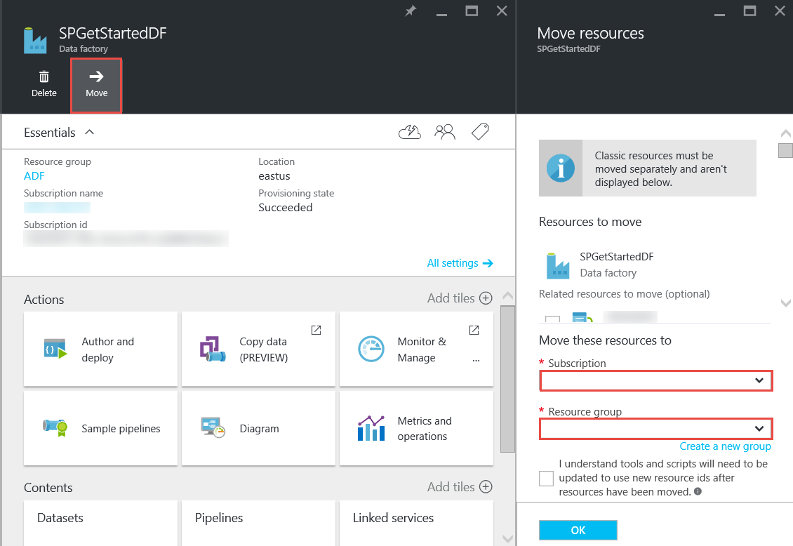

<properties 
    pageTitle="Azure-Daten Factory - häufig gestellte Fragen" 
    description="Häufig gestellte Fragen zur Azure-Daten Factory ein." 
    services="data-factory" 
    documentationCenter="" 
    authors="sharonlo101" 
    manager="jhubbard" 
    editor="monicar"/>

<tags 
    ms.service="data-factory" 
    ms.workload="data-services" 
    ms.tgt_pltfrm="na" 
    ms.devlang="na" 
    ms.topic="article" 
    ms.date="09/12/2016" 
    ms.author="shlo"/>

# Azure-Daten Factory - häufig gestellte Fragen

## Allgemeine Fragen

### Was ist die Daten Factory Azure?

Daten Factory ist eine cloudbasierte Datenintegration service die **Automatisierung der Bewegung und Transformation von Daten**. Wie eine Factory, die ausgeführt Ausrüstung wird um Rohstoffe ausführen und deren Umwandlung in fertig gestellten Artikel, koordiniert Daten Factory vorhandenen Dienste, die unformatierte Daten zu sammeln und es in sofort einsatzbereite Informationen umzuwandeln. 
 
Daten Factory können Sie zum Verschieben von Daten zwischen sowohl lokalen und Cloud Datenspeicher als auch Prozess/Transformieren von Daten mithilfe von berechnen-Diensten wie Azure HDInsight und Azure Daten dem Analytics-Daten basierende Workflows erstellen. Nachdem Sie eine Verkaufspipeline, die die Aktion ausführt, die Sie benötigen erstellen, können Sie es regelmäßig ausgeführt (stündlich, täglich, wöchentlich usw.) planen.   

Weitere Informationen hierzu finden Sie unter [Übersicht & Schlüssel Konzepte](data-factory-introduction.md) . 

### Wo finde ich Details für Azure Daten Factory Preise?

[Seite Daten Factory Preise Details] finden Sie unter[ adf-pricing-details] für die Informationen zur Preisgestaltung für die Azure-Daten Factory.  

### Wie Schritte kann ich mit Azure Data Factory?

- Eine Übersicht über die Daten Factory Azure finden Sie unter [Einführung in Azure Data Factory](data-factory-introduction.md).
- Ein Lernprogramm zum **Kopieren/Verschieben von Daten** mithilfe von kopieren Aktivität finden Sie unter [Kopieren von Daten aus Azure BLOB-Speicher mit Azure SQL-Datenbank](data-factory-copy-data-from-azure-blob-storage-to-sql-database.md).
- Ein Lernprogramm zum **Transformieren von Daten** mithilfe von HDInsight Struktur Aktivität. [Verarbeiten von Daten durch Ausführen Struktur Skripts auf Hadoop Cluster](data-factory-build-your-first-pipeline.md) finden Sie unter 
  
### Was ist die Daten-Factory Region Verfügbarkeit?
Daten Factory ist in **US-Westen** und **North Europa**verfügbar. Datenverarbeitung und Speicher Dienste verwendeten Daten Factory können in anderen Regionen sein. Finden Sie unter [unterstützte Regionen](data-factory-introduction.md#supported-regions). 
 
### Was sind die Grenzwerte für die Anzahl der Daten Factory/Pipelines/Aktivitäten/Datasets?
 
Finden Sie unter **Azure Daten Factory Grenzwerte** Abschnitt des Artikels [Azure-Abonnement und Beschränkungen Service, Kontingente, und Einschränkungen](../azure-subscription-service-limits.md#data-factory-limits) .

### Was ist die authoring/Entwicklertools Erfahrung mit Azure Data Factory Service?

Sie können Autor/Daten Factory mithilfe einer der folgenden erstellen:

- **Azure-Portal**  
   der Daten Factory Blades Azure-Portal bieten umfangreiche Benutzeroberfläche für Sie Datendienste Factory-Ad verknüpft zu erstellen. **Daten Factory-Editor**, der auch Teil des Portals ist, können Sie auf einfache Weise verknüpften Diensten, Tabellen, Datensätze und Pipelines erstellen, indem JSON-Definitionen für diese Elemente angeben. Ein Beispiel für die Verwendung im Portal /-Editors zum Erstellen und Bereitstellen einer Factory Daten finden Sie unter [Erstellen Ihrer ersten Daten Verkaufspipeline Azure-Portal verwenden](data-factory-build-your-first-pipeline-using-editor.md) .

- **Visual Studio**  
   verwenden Sie Visual Studio, um eine Fabrik Azure-Daten zu erstellen. Weitere Informationen finden Sie unter [Erstellen Ihrer ersten Daten Verkaufspipeline mit Visual Studio](data-factory-build-your-first-pipeline-using-vs.md) . 

- **Azure PowerShell**  
   finden Sie unter [Erstellen und überwachen Azure Data Factory mithilfe der PowerShell Azure](data-factory-build-your-first-pipeline-using-powershell.md) für eine Lernprogramm/das Exemplarische Vorgehensweise zum Erstellen einer Daten Factory mithilfe der PowerShell. Finden Sie unter [Daten Factory Cmdlet Referenz] [ adf-powershell-reference] Inhalte auf der MSDN-Bibliothek für eine umfassende Dokumentation von Daten Factory-Cmdlets.
   
- **.NET Class Library**  
   Sie können mithilfe von Data Factory .NET SDK programmgesteuert Factory Daten erstellen. Eine exemplarische Vorgehensweise zum Erstellen einer Daten Factory mit .NET SDK finden Sie unter [erstellen, überwachen und Verwalten von Daten Factory .NET SDK verwenden](data-factory-create-data-factories-programmatically.md) . [Referenz für die Daten Factory Bibliothek] finden Sie unter[ msdn-class-library-reference] für eine umfassende Data Factory .NET SDK-Dokumentation.

- **REST-API**  
   können Sie auch die REST-API verfügbar gemacht werden vom Dienst Azure Data Factory zum Erstellen und Bereitstellen von Daten Factory. [Daten Factory REST-API-Referenz] finden Sie unter[ msdn-rest-api-reference] für eine umfassende Dokumentation von Data Factory REST-API.
 
- **Azure Ressourcenmanager Vorlage** 
   finden Sie unter [Lernprogramm: Erstellen Ihrer erste Azure-Daten Factory mit Azure Ressourcenmanager Vorlage](data-factory-build-your-first-pipeline-using-arm.md) fo Details. 

### Kann ich eine Factory Daten umbenennen?
Nein. Wie andere Azure Ressourcen kann der Name einer Factory Azure Daten geändert werden. 

### Kann ich eine Factory Daten von einem Azure-Abonnement zu einem anderen verschieben? 
Ja. Verwenden Sie die Schaltfläche **Verschieben** auf Ihre Daten Factory-Blade ein, wie in der folgenden Abbildung gezeigt. 

### Was sind die berechnen-Umgebungen von Daten Factory unterstützt?
Die folgende Tabelle enthält eine Liste der berechnen Umgebungen unterstützt nach Daten Fabrik und die Aktivitäten, die diesen ausgeführt werden können. 

| Berechnen der Umgebung | Aktivitäten |
| ------------------- | -------- | 
| [Bei Bedarf HDInsight Cluster](data-factory-compute-linked-services.md#azure-hdinsight-on-demand-linked-service) oder [Eigene HDInsight cluster](data-factory-compute-linked-services.md#azure-hdinsight-linked-service) | [DotNet](data-factory-use-custom-activities.md), [Struktur](data-factory-hive-activity.md), [Schwein](data-factory-pig-activity.md), [MapReduce](data-factory-map-reduce.md), [Hadoop Streaming](data-factory-hadoop-streaming-activity.md) | 
| [Azure Stapel](data-factory-compute-linked-services.md#azure-batch-linked-service) | [DotNet](data-factory-use-custom-activities.md) |  
| [Learning Azure-Computern](data-factory-compute-linked-services.md#azure-machine-learning-linked-service) | [Maschinelle Learning Aktivitäten: Stapel Ausführung und Aktualisieren von Ressourcen](data-factory-azure-ml-batch-execution-activity.md) |
| [Azure-Daten Lake Analytics](data-factory-compute-linked-services.md#azure-data-lake-analytics-linked-service) | [Daten Lake Analytics U-SQL](data-factory-usql-activity.md)
| [SQL Azure](data-factory-compute-linked-services.md#azure-sql-linked-service), [SQL Azure Datawarehouse](data-factory-compute-linked-services.md#azure-sql-data-warehouse-linked-service), [SQLServer](data-factory-compute-linked-services.md#sql-server-linked-service) | [Gespeicherte Prozedur](data-factory-stored-proc-activity.md)

## Aktivitäten – häufig gestellte Fragen
### Was sind die verschiedenen Typen von Aktivitäten, die in einer Verkaufspipeline Factory Daten verwendet werden können? 

- [Daten Bewegung Aktivitäten](data-factory-data-movement-activities.md) zum Verschieben von Daten.
- [Daten Transformationsaktivitäten](data-factory-data-transformation-activities.md) zu Prozess/Daten transformieren. 

### Wann kann eine Aktivität werden ausgeführt?
Die Einstellung der Konfiguration **Verfügbarkeit** in der Ausgabe Datentabelle bestimmt, wann die Aktivität ausgeführt wird. Eingabe Datasets angegeben, die Aktivität überprüft, ob alle die Eingabedaten Abhängigkeiten erfüllt sind (d. h., **bereit** State) vor dem Beginn ausgeführt. 

## Kopieren der Aktivität – häufig gestellte Fragen
### Ist es besser eine Verkaufspipeline mit mehreren Aktivitäten oder einem separaten Verkaufspipeline für jede Aktivität haben? 
Um verwandte Aktivitäten zu bündeln Pipelines werden sollte. Wenn die Datasets, die sie Verbinden nicht in eine beliebige andere Aktivität außerhalb der Verkaufspipeline verwendet werden, können Sie die Aktivitäten in einem Verkaufspipeline halten. Auf diese Weise nicht für die Kette Verkaufspipeline aktiven Zeiten müssten Sie, dass diese zueinander ausgerichtet. Darüber hinaus wird die Datenintegrität in den Tabellen in der Verkaufspipeline internen besser beibehalten, bei der Aktualisierung der Verkaufspipeline. Verkaufspipeline aktualisieren im Wesentlichen beendet alle Aktivitäten innerhalb der Verkaufspipeline, entfernt sie und erstellt sie erneut. Von der Erstellung Perspektive, dies möglicherweise auch leichter zu finden in den Datenfluss innerhalb der zugehörigen Aktivitäten in einer JSON-Datei für die Verkaufspipeline verwenden.

### Was sind die unterstützten Datenspeicher?
[AZURE.INCLUDE [data-factory-supported-data-stores](../../includes/data-factory-supported-data-stores.md)]

### Was sind die unterstützte Dateiformate? 
[AZURE.INCLUDE [data-factory-file-format](../../includes/data-factory-file-format.md)]

### Wo ist der Kopiervorgang ausgeführt? 
Siehe Abschnitt " [global verfügbaren Daten Bewegung](data-factory-data-movement-activities.md#global) " Details. Kurz gesagt, wenn ein lokale Datenspeicher beteiligt ist, der Kopiervorgang durch das Datenverwaltungsgateway in Ihrer lokalen Umgebung ausgeführt wird. Und wenn das Verschieben von Daten zwischen zwei Cloud-Speicher ist, erfolgt beim Kopieren in der Region, den Speicherort der Empfänger in der gleichen Geography am nächsten ist. 

## HDInsight Aktivität – häufig gestellte Fragen

### Welche Bereiche von HDInsight unterstützt werden?

Finden Sie im Abschnitt geografische Verfügbarkeit im folgenden Artikel: oder [HDInsight Preise Details][hdinsight-supported-regions].

### Welche Region durch eine bei Bedarf HDInsight Cluster verwendet wird?

Bei Bedarf HDInsight Cluster wird in derselben Region erstellt die Speicherung, die Sie angegeben haben, um mit dem Cluster verwendet werden, wenn vorhanden ist.    

### Zum Zuordnen zusätzlicher Speicherkonten zum HDInsight Cluster?

Wenn Sie Ihre eigenen HDInsight Cluster (BYOC – zeigen Sie Ihre eigenen Cluster) verwenden, finden Sie unter den folgenden Themen: 

- [Verwenden ein HDInsight Cluster mit alternativen Speicherkonten und Metastores][hdinsight-alternate-storage]
- [Verwenden Sie zusätzlichen Speicher-Konten mit HDInsight Struktur][hdinsight-alternate-storage-2]

Wenn Sie einen Cluster bei Bedarf verwenden, der vom Dienst Factory Daten erstellt wird, geben Sie, dass die zusätzlichen Speicherkonten für die HDInsight Dienst verknüpft, damit der Daten Factory-Dienst in Ihrem Auftrag registrieren werden kann. Verwenden Sie in der JSON-Definition für den verknüpften bei Bedarf-Dienst **AdditionalLinkedServiceNames** Eigenschaft alternative Speicherkonten wie in den folgenden JSON-Codeausschnitt dargestellt angeben:
 
    {
        "name": "MyHDInsightOnDemandLinkedService",
        "properties":
        {
            "type": "HDInsightOnDemandLinkedService",
            "typeProperties": {
                "clusterSize": 1,
                "timeToLive": "00:01:00",
                "linkedServiceName": "LinkedService-SampleData",
                "additionalLinkedServiceNames": [ "otherLinkedServiceName1", "otherLinkedServiceName2" ] 
            }
        }
    } 

Im Beispiel oben darstellen otherLinkedServiceName1 und otherLinkedServiceName2 verknüpfte Diensten, deren Definitionen Anmeldeinformationen enthalten, die der HDInsight Cluster alternative Speicherkonten zugreifen muss.

## Segmente – häufig gestellte Fragen

### Warum sind meine Eingabewerte Segmente nicht mehr im Zustand bereit?  
Ein häufiger Fehler ist nicht **externe** festlegen-Eigenschaft auf **true** für die Eingabewerte Dataset, wenn die Eingabedaten externe Daten Fabrik (nicht von der Factory Daten erzeugt) ist. 

Im folgenden Beispiel müssen Sie nur **externe** auf **dataset1**true festlegen.  

**DataFactory1** Verkaufspipeline 1: dataset1 -> Activity1 aufgerufen -> Datensatz2 -> activity2 -> dataset3 Verkaufspipeline 2: dataset3 -> activity3 -> dataset4

Wenn Sie eine andere Daten Factory mit einer Verkaufspipeline, die dataset4 verfügen (durch Verkaufspipeline in Daten Factory 1 2 produziert) annimmt, markieren Sie dataset4 als eine externe Dataset, da das Dataset durch eine andere Daten Factory (DataFactory1, nicht DataFactory2) erstellt wird.  

**DataFactory2**    
Verkaufspipeline 1: dataset4 -> activity4 -> dataset5

Wenn die externe Eigenschaft richtig eingestellt ist, stellen Sie sicher, ob die eingegebenen Daten an der Stelle in der Eingabe-Dataset Definition angegebenen vorhanden ist. 

### Wie wird ein Segment zu einem späteren Zeitpunkt als Mitternacht ausführen, wenn das Segment täglich erzeugt wird?
Verwenden Sie die Eigenschaft **Offset** , um den Zeitraum anzugeben, an dem Sie das Segment produziert werden soll. Siehe Abschnitt " [Dataset Verfügbarkeit](data-factory-create-datasets.md#Availability) " Details dieser Eigenschaft. Hier ist ein kurzes Beispiel:

    "availability":
    {
        "frequency": "Day",
        "interval": 1,
        "offset": "06:00:00"
    }

Tägliche Segmente beginnen mit **6 Uhr** anstelle der standardmäßigen Mitternacht verstrichen sind.     

### Wie kann ich ein Segment erneut ausführen?
Sie können ein Segment in eine der folgenden Methoden erneut ausführen: 

- Verwenden Sie überwachen und Verwalten von App, um ein Aktivitätsfenster oder Segment erneut auszuführen. Weitere Informationen finden Sie in der [erneut ausführen Aktivität Fenster ausgewählt](data-factory-monitor-manage-app.md#re-run-selected-activity-windows) .   
- Klicken Sie in der Befehlsleiste auf das **Segment Daten** Blade für das Segment Azure-Portal auf **Ausführen** .
- Führen Sie Cmdlet " **Set-AzureRmDataFactorySliceStatus aus** " mit Status auf **Warten** für das Segment.   
    
        Set-AzureRmDataFactorySliceStatus -Status Waiting -ResourceGroupName $ResourceGroup -DataFactoryName $df -TableName $table -StartDateTime "02/26/2015 19:00:00" -EndDateTime "02/26/2015 20:00:00" 

Finden Sie unter [Festlegen-AzureRmDataFactorySliceStatus] [ set-azure-datafactory-slice-status] Details des Cmdlets. 

### Wie lange hat die gedauert ein Segment Verarbeitungszeit?
Verwenden Sie Aktivitäten in Windows-Explorer in das Überwachen und Verwalten von App kennen, die Zeitdauer ein Segments Daten zu verarbeiten. Details finden Sie unter [Aktivität Fenster Explorer](data-factory-monitor-manage-app.md#activity-window-explorer) . 

Sie können auch in der Azure-Portal die folgenden Aktionen ausführen:  

1. Klicken Sie auf die Kachel **Datasets** , auf dem **Daten FACTORY** -Blade für Ihre Daten Factory.
2. Klicken Sie auf bestimmte Dataset auf das Blade **Datasets** .
3. Wählen Sie das Segment, dem Sie aus der Liste **zuletzt verwendete Segmente** in der **Tabelle** Blade interessiert sind.
4. Klicken Sie auf die Aktivität, führen Sie das **Segment Daten** Blade aus der Liste **Aktivität ausgeführt** . 
5. Klicken Sie auf die Kachel der **Eigenschaften** auf das Blade **DETAILS über die Aktivitäten ausführen** . 
6. Das Feld " **Dauer** " mit einem Wert sollte angezeigt werden. Dieser Wert ist die Verarbeitungszeit für das Segment.   

### Wie kann ich ein laufenden Segment beenden?
Wenn Sie zum Beenden der Verkaufspipeline ausführen müssen, können Sie [Standby-AzureRmDataFactoryPipeline](https://msdn.microsoft.com/library/mt603721.aspx) -Cmdlet verwenden. Derzeit hält Aussetzen der Verkaufspipeline nicht das Segment Ausführungen an, die ausgeführt werden. Nachdem die Ausführungen in Bearbeitung abgeschlossen haben, wird keine zusätzliche Segment übernommen.

Wenn Sie alle die Ausführungen sofort beenden möchten, wäre die einzige Möglichkeit zum Löschen der Verkaufspipeline und erstellen Sie ihn erneut. Wenn Sie zum Löschen der Verkaufspipeline auswählen, müssen Sie nicht löschen von Tabellen und verknüpften Diensten, die von der Verkaufspipeline verwendet. 

[create-factory-using-dotnet-sdk]: data-factory-create-data-factories-programmatically.md
[msdn-class-library-reference]: https://msdn.microsoft.com/library/dn883654.aspx
[msdn-rest-api-reference]: https://msdn.microsoft.com/library/dn906738.aspx

[adf-powershell-reference]: https://msdn.microsoft.com/library/dn820234.aspx 
[azure-portal]: http://portal.azure.com
[set-azure-datafactory-slice-status]: https://msdn.microsoft.com/library/mt603522.aspx

[adf-pricing-details]: http://go.microsoft.com/fwlink/?LinkId=517777
[hdinsight-supported-regions]: http://azure.microsoft.com/pricing/details/hdinsight/
[hdinsight-alternate-storage]: http://social.technet.microsoft.com/wiki/contents/articles/23256.using-an-hdinsight-cluster-with-alternate-storage-accounts-and-metastores.aspx
[hdinsight-alternate-storage-2]: http://blogs.msdn.com/b/cindygross/archive/2014/05/05/use-additional-storage-accounts-with-hdinsight-hive.aspx
 
