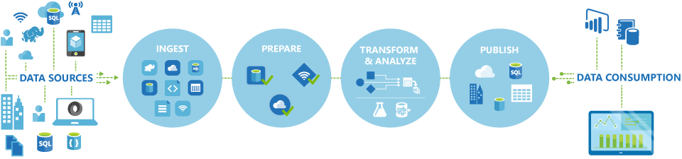

<properties 
    pageTitle="Einführung in Daten Factory, einem Integration Datendienst | Microsoft Azure" 
    description="Erfahren Sie, was Azure Data Factory ist: Datendienst Integration einer Cloud, der koordiniert und Automatisierung Bewegung und Transformation von Daten." 
    keywords="Datenintegration, Cloud Datenintegration, was Azure Daten Factory ist"
    services="data-factory" 
    documentationCenter="" 
    authors="sharonlo101" 
    manager="jhubbard" 
    editor="monicar"/>

<tags 
    ms.service="data-factory" 
    ms.workload="data-services" 
    ms.tgt_pltfrm="na" 
    ms.devlang="na" 
    ms.topic="get-started-article" 
    ms.date="09/22/2016" 
    ms.author="shlo"/>

# Einführung in Azure Factory Datendienst, einem Datendienst-Integration in der cloud

## Was ist die Daten Factory Azure? 
Daten Factory ist eine cloudbasierte Integration Datendienst, der koordiniert und Automatisierung der **Bewegung** und **Transformation** von Daten. Sie können Daten Integration Lösungen mithilfe des Diensts für Daten Factory erstellen, die können Daten aus verschiedenen Datenspeicher Aufnahme, Transformation/Prozess die Daten, und veröffentlichen die Ergebnisdaten für die Datenspeicher. 

Factory Datendienst können Sie Datenpipelines, die verschieben und Transformieren der Daten erstellen, und führen Sie die Rohrleitungen nach einem bestimmten Zeitplan (stündlich, täglich, wöchentlich usw.). Darüber hinaus Darstellungen zum Anzeigen der Datenherkunft und Abhängigkeiten zwischen Ihrem Datenpipelines und Überwachen Ihrer Datenpipelines aus einer einheitlichen Ansicht in ganz einfach pinpoint-Problemen und für die Überwachung Benachrichtigungen einrichten.

**Abbildung 1.** Umwandlung von Daten aus verschiedenen Datenquellen, vorbereiten, transformieren, und Analysieren der Daten, und klicken Sie dann veröffentlichen sofort einsatzbereite Daten für die Ernährung.

## Pipelines und Aktivitäten
In einer Lösung Daten Factory erstellen Sie eine oder mehrere Daten **Pipelines**. Eine Verkaufspipeline ist eine logische Gruppierung von Aktivitäten. Sie werden in der Gruppenaktivitäten in einer Einheit verwendet, die gemeinsam eine Aufgabe auszuführen. 

**Aktivitäten** legen Sie die Aktionen für Ihre Daten ausführen. Beispielsweise können Sie eine Kopie Aktivität verwenden, zum Kopieren von Daten aus einem Datenspeicher zu einem anderen Datenspeicher. Auf ähnliche Weise können Sie eine Struktur Aktivität verwenden, die ausgeführt wird, eine Struktur Abfrage in einem Cluster Azure HDInsight transformieren oder Analysieren von Daten. Daten Factory unterstützt zwei Arten von Aktivitäten: Daten Bewegung und Daten Transformationsaktivitäten. 
  
## Aktivitäten zum Verschieben von Daten 
[AZURE.INCLUDE [data-factory-supported-data-stores](../../includes/data-factory-supported-data-stores.md)]

[Daten Bewegung Aktivitäten](data-factory-data-movement-activities.md) -Artikel Weitere Informationen hierzu finden Sie unter. 

## Daten Transformationsaktivitäten
[AZURE.INCLUDE [data-factory-transformation-activities](../../includes/data-factory-transformation-activities.md)]

[Daten Transformationsaktivitäten](data-factory-data-transformation-activities.md) -Artikel Weitere Informationen hierzu finden Sie unter.

Wenn Sie verschieben müssen speichern Daten in einer, dass kopieren Aktivität nicht unterstützt, oder Transformieren von Daten über eine eigene Logik, erstellen Sie eine **benutzerdefinierte .NET Aktivität**. Details zum Erstellen und Verwenden einer benutzerdefinierten Aktivität finden Sie unter [Verwenden von benutzerdefinierten Aktivitäten in einer Azure Data Factory Verkaufspipeline](data-factory-use-custom-activities.md).

## Verknüpfte services
Verknüpfte Services definieren die Informationen für Daten Factory Verbindung zu externen Ressourcen erforderlich (Beispiele: Azure-Speicher lokalen SQL Server, Azure HDInsight). Verknüpfte Services sind für zwei Zwecke in Daten Factory verwendet:

- Zum Darstellen einer **Datenspeicher** einschließlich, aber nicht beschränkt auf, einer lokalen SQL Server, Oracle-Datenbank, die Datei freigeben, oder aber ein Konto Azure BLOB-Speicher. Finden Sie im Abschnitt [Daten Bewegung Aktivitäten](data-factory-data-movement-activities.md) für eine Liste der unterstützten Datenspeicher aus. 
- Um eine **Ressource zu berechnen** darzustellen, die die Ausführung einer Aktivität hosten können. Beispielsweise wird die Aktivität HDInsightHive auf einem HDInsight Hadoop Cluster ausgeführt. Abschnitt [Daten Transformationsaktivitäten](data-factory-data-transformation-activities.md) finden Sie unter für eine Liste der unterstützten berechnen Umgebungen. 

## Datasets 
Verknüpfte Services link Datenspeicher zu einer Factory Azure-Daten. Datasets darstellen Datenstrukturen mit in die Datenspeicher. Beispielsweise bietet einen Azure-Speicher verknüpft Verbindungsinformationen für Daten Factory Verbindung mit einer Firma Azure-Speicher. Ein Dataset Azure Blob gibt den Blob Container und Ordner in den Azure BLOB-Speicher, aus denen der Verkaufspipeline die Daten lesen sollten. Entsprechend ein SQL Azure-Verknüpfte Dienst bietet Verbindungsinformationen für eine SQL Azure-Datenbank und einer SQL Azure-Dataset die Tabelle, die die Daten enthält.   

## Beziehung zwischen Daten Factory-Elementen
Daten Factory enthält einige Key Einheiten, die Zusammenarbeit zu Eingabe definieren und Ausgabedaten, Verarbeiten von Ereignissen und den Zeitplan und die Ressourcen, die zum Ausführen des gewünschten Datenfluss.

**Abbildung 2.** Beziehungen zwischen Dataset, Aktivität, Verkaufspipeline und verknüpfte Dienst

Mit den vier einfachen Konzepten von verknüpften Diensten, Datasets, Aktivitäten und Pipelines sind Sie sofort beginnen! Sie können das [Erstellen Ihrer ersten Verkaufspipeline](data-factory-build-your-first-pipeline.md). 

## Unterstützte Regionen
Zurzeit können Sie Daten Factory in den Regionen **Westen US**und **Ostasiatischen US** **North Europe** erstellen. Jedoch eine Factory Daten Datenspeicher zugreifen kann, und Berechnen von Diensten in anderen Azure Regionen zum Verschieben von Daten zwischen Datenspeicher oder Verarbeiten von Daten mithilfe berechnen Services. 

Azure Data Factory selbst werden keine Daten gespeichert werden. Sie können Daten basierende Zahlungen zum Koordinieren Verlagerung von Daten zwischen [Datenspeicher unterstützt](data-factory-data-movement-activities.md#supported-data-stores) und Verarbeitung von Daten in anderen Regionen oder in einer lokalen Umgebung mit [berechnen Dienste](data-factory-compute-linked-services.md) zu erstellen. Sie können auch zum [Überwachen und Verwalten von Workflows](data-factory-monitor-manage-pipelines.md) mit beide programmgesteuerten und Benutzeroberfläche Verfahren. 

Obwohl Azure Data Factory in nur **Westen US**, **Ostasiatischen US**und **North Europe** Regionen verfügbar ist, ist das Verschieben von Daten in Daten Factory einschalten Dienst verfügbar [Global](data-factory-data-movement-activities.md#global) in mehreren Regionen. Für den Fall, dass ein Datenspeicher hinter einem Firewall als ein [Datenverwaltungsgateway](data-factory-move-data-between-onprem-and-cloud.md) installiert befindet sich werden die Daten in Ihrer lokalen Umgebung stattdessen verschoben. 

Ein Beispiel lassen Sie uns davon aus, dass Ihre berechnen Umgebungen wie Azure HDInsight Cluster und Azure maschinellen Learning aus Ihrer Region Westen Europa ausgeführt werden. Erstellen und Verwenden einer Instanz Azure Data Factory in Europa North, und verwenden sie zum Planen von Aufträgen auf Ihre berechnen Umgebungen in Europa Westen. Es dauert ein paar Millisekunden für Daten Factory den Auftrag auf Ihre Umgebung berechnen ausgelöst, aber die Zeit für die Ausführung des Auftrags auf Ihre Umgebung ändert sich nicht.

In Kürze Azure Data Factory in allen Regionen in der Zukunft von Azure unterstützt haben.
  
## Nächste Schritte
Um Informationen zum Erstellen von Daten Factory mit Datenpipelines, führen Sie eine schrittweise Anleitung in den folgenden Lernprogrammen aus. 

Lernprogramm | Beschreibung
-------- | -----------
[Erstellen Sie eine Verkaufspipeline Daten, die Daten mit Hadoop Cluster verarbeitet](data-factory-build-your-first-pipeline.md) | In diesem Lernprogramm erstellen Sie Ihre ersten Azure-Daten Factory mit einer Verkaufspipeline Daten die **Daten verarbeitet** ausführen Struktur Skripts auf einem Cluster Azure HDInsight (Hadoop). |
[Erstellen Sie eine Verkaufspipeline Daten zum Verschieben von Daten zwischen zwei Cloud-Datenspeicher](data-factory-copy-data-from-azure-blob-storage-to-sql-database.md) | In diesem Lernprogramm erstellen Sie eine Factory Daten mit einer Verkaufspipeline die **Daten verschoben** von Blob-Speicher mit SQL-Datenbank.
[Erstellen Sie eine Verkaufspipeline Daten zum Verschieben von Daten zwischen einem lokalen Datenspeicher und einen Cloud-Datenspeicher mit Datenverwaltungsgateway](data-factory-move-data-between-onprem-and-cloud.md) | In diesem Lernprogramm erstellen Sie einer Factory Daten mit einer Verkaufspipeline die **verschiebt Daten** aus einer **lokalen** SQL Server-Datenbank in einer Azure Blob. Als Teil der exemplarische Vorgehensweise installieren und konfigurieren das Datenverwaltungsgateway auf Ihrem Computer. 
