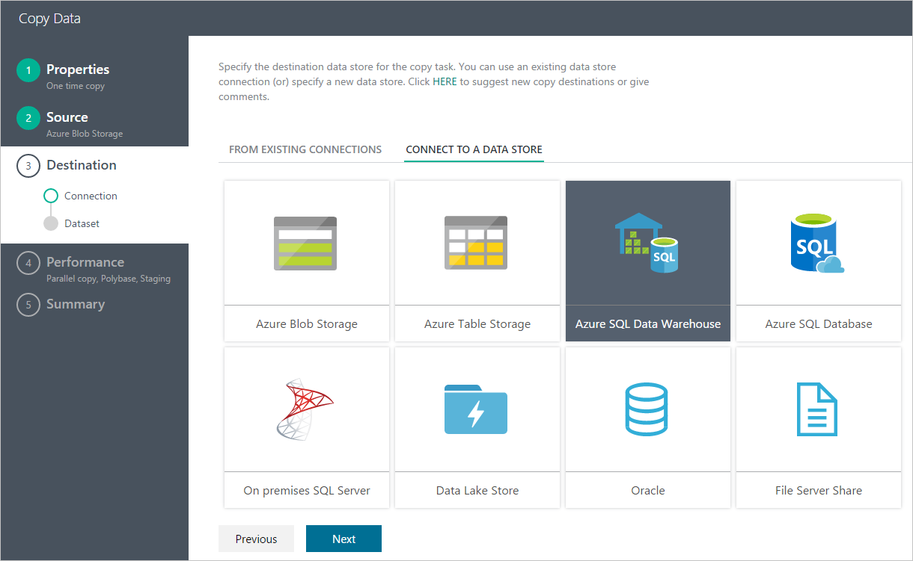

<properties 
    pageTitle="Laden Sie TB Daten in SQL Data Warehouse | Microsoft Azure" 
    description="Veranschaulicht, wie 1 TB Daten in Azure SQL-Data Warehouse unter 15 Minuten mit Azure Data Factory geladen werden kann" 
    services="data-factory" 
    documentationCenter="" 
    authors="linda33wj" 
    manager="jhubbard" 
    editor="monicar"/>

<tags 
    ms.service="data-factory" 
    ms.workload="data-services" 
    ms.tgt_pltfrm="na" 
    ms.devlang="na" 
    ms.topic="article" 
    ms.date="10/28/2016" 
    ms.author="jingwang"/>

# Laden Sie 1 TB in Azure SQL-Data Warehouse unter 15 Minuten mit Azure Data Factory [Kopieren Wizard]
[Azure SQL-Data Warehouse](../sql-data-warehouse/sql-data-warehouse-overview-what-is.md) ist eine cloudbasierte Skalierung Datenbank Lage große Datenmengen relationalen und nicht relationalen Daten zu verarbeiten.  Auf der Grundlage der parallele (MPP)-Verarbeitungsarchitektur ist SQL Data Warehouse für Enterprise Datawarehouse Auslastung optimiert.  Cloud Elastizität vergleichbar mit der Flexibilität, Speicher skalieren und unabhängig voneinander zu berechnen.

Erste Schritte mit Azure SQL-Data Warehouse ist jetzt einfacher denn je zuvor mit **Azure Data Factory**.  Azure Data Factory ist eine vollständig verwaltete cloudbasierten Integration Datendienst, die zum Füllen einer SQL Data Warehouse mit den Daten aus Ihrem vorhandenen System, und speichern Sie wertvolle Zeit SQL Data Warehouse Auswertung und erstellen Ihre Analytics Lösungen auf es verwendet werden kann.  Hier sind die wichtigsten Vorteile von Daten in Azure SQL-Data Warehouse mit Azure Data Factory geladen aus:

- **Einfach einrichten**: 5 intuitive Assistenten mit keine scripting erforderlich.
- **Rich-Datenspeicher Support**: integrierte Unterstützung für eine umfangreiche Menge von lokalen und cloudbasierte Datenspeicher.
- **Sichere und kompatible**: Daten über einen HTTPS oder ExpressRoute übertragen werden, und Anwesenheitsinformationen globalen Dienst wird sichergestellt, bleibt die Daten immer auf die Begrenzungslinie geografische
- **Mithilfe von PolyBase und Leistungsfähigkeit** – mithilfe von Polybase ist am effizientesten zum Verschieben von Daten in Azure SQL-Data Warehouse. Das staging Blob-Feature verwenden, können Sie hoher Auslastung Geschwindigkeit aus allen Arten von Datenspeicher neben Azure Blob-Speicher erzielen, die die Polybase standardmäßig unterstützt.

In diesem Artikel wird veranschaulicht, wie Assistenten zum Kopieren von Factory um 1 TB Daten aus Azure BLOB-Speicher in Azure SQL-Data Warehouse in unter 15 Minuten bei über 1,2 GBps Durchsatz zu laden.

Dieser Artikel enthält eine schrittweise Anleitung zum Verschieben von Daten in Azure SQL-Data Warehouse mithilfe des Assistenten zum Kopieren. 

> [AZURE.NOTE] [Verschieben von Daten zwischen Azure SQL-Data Warehouse mit Azure Data Factory](data-factory-azure-sql-data-warehouse-connector.md) finden Sie im Artikel nach allgemeinen Informationen zu Funktionen Factory Daten in das Verschieben von Daten zu/aus Azure SQL-Data Warehouse. 
> 
> Sie können auch mit Azure-Portal Visual Studio PowerShell Pipelines erstellen usw.. Finden Sie unter [Lernprogramm: Kopieren von Daten aus Azure Blob mit Azure SQL-Datenbank](data-factory-copy-data-from-azure-blob-storage-to-sql-database.md) eine schnelle Exemplarische Vorgehensweise mit einer schrittweisen Anleitung für die Aktivität kopieren in Azure Data Factory verwenden.  

## Erforderliche Komponenten
- Azure Blob-Speicher: diesem Versuch verwendet Azure BLOB-Speicher (GRS) zum Speichern von TPC-H Test-Dataset an.  Wenn Sie nicht über ein Konto Azure-Speicher verfügen, erfahren Sie, [wie ein Speicherkonto erstellen](../storage/storage-create-storage-account.md#create-a-storage-account).
- Daten [TPC-H](http://www.tpc.org/tpch/) : Wir werden TPC-H als Test-Dataset zu verwenden.  Dazu müssen Sie verwenden `dbgen` aus TPC-H-Toolkit, der Ihnen dabei hilft Dataset generieren.  Sie können entweder herunterladen Quellcode für `dbgen` aus [TPC Tools](http://www.tpc.org/tpc_documents_current_versions/current_specifications.asp) und selbst kompilieren oder die kompilierte Binärdatei von [GitHub](https://github.com/Azure/Azure-DataFactory/tree/master/Samples/TPCHTools)herunterladen.  Ausführen von dbgen.exe mit den folgenden Befehlen zum Generieren von 1 TB Flatfile für `lineitem` Tabelle verteilt über 10 Dateien:
    - `Dbgen -s 1000 -S **1** -C 10 -T L -v`
    - `Dbgen -s 1000 -S **2** -C 10 -T L -v`
    - …
    - `Dbgen -s 1000 -S **10** -C 10 -T L -v` 

    Kopieren Sie jetzt die generierten Dateien in Azure Blob.  Beziehen sich auf [Verschieben von Daten zu und von einem lokalen Dateisystem mithilfe von Azure Data Factory](data-factory-onprem-file-system-connector.md) zur Vorgehensweise, die über ADF kopieren.   
- Azure SQL-Datawarehouse: lädt diesem Versuch Daten in Azure SQL-Data Warehouse erstellt mit 6.000 DWUs

    Wenn Sie ausführliche Anweisungen zum Erstellen einer Datenbank SQL Data Warehouse finden Sie unter [Erstellen einer Azure SQL-Data Warehouse](../sql-data-warehouse/sql-data-warehouse-get-started-provision/) .  Um die optimale Leistung von möglichen Laden in SQL Data Warehouse mit Polybase zu gelangen, wählen Sie aus wir maximale Anzahl von Data Warehouse Einheiten (DWUs) in der Leistung-Einstellung, also 6.000 DWUs zulässig sind.

    > [AZURE.NOTE] 
    > Beim Laden aus Azure Blob ist die Leistung beim Laden von Daten direkt proportional auf die Anzahl der DWUs, die Sie auf SQL Data Warehouse konfigurieren:
    > 
    > Laden 1 TB in 1.000 DWU SQL Data Warehouse dauert 87min (~ 200MBps Durchsatz) Laden von 1 TB in 2.000 DWU SQL Data Warehouse dauert 46min (~ 380MBps Durchsatz) Laden von 1 TB in weniger als 6.000 DWU SQL Data Warehouse dauert 14min (~1.2GBps Durchsatz) 

    So erstellen Sie eine SQL Data Warehouse mit 6.000 DWUs den Schieberegler Leistung ganz nach rechts:

    

    Für eine vorhandene Datenbank, die mit 6.000 DWUs konfiguriert ist, können Sie es mithilfe von Azure-Portal skalieren.  Navigieren Sie zu der Datenbank Azure-Portal und befindet sich eine Schaltfläche **Maßstab** in den Bereich " **Übersicht** " in der folgenden Abbildung dargestellt:

        

    Bewegen Sie den Schieberegler auf den Höchstwert der **Skalierung** klicken, um Sie im folgenden Fenster öffnen, und klicken Sie auf die Schaltfläche **Speichern** .

    
    
    Diese experimentieren lädt Daten in Azure SQL-Data Warehouse mit `xlargerc` Ressource Class.

    Um die beste mögliche Durchsatz zu erreichen, Kopieren mit einer SQL Data Warehouse Benutzer, die ausgeführt werden muss `xlargerc` Ressource Class.  Erfahren Sie, wie erledigen von folgenden [Ändern einer Ressource Beispiel für Benutzer](../sql-data-warehouse/sql-data-warehouse-develop-concurrency.md#change-a-user-resource-class-example).  

- Erstellen Sie Ziel Tabellenschema in Azure SQL-Data Warehouse-Datenbank, indem Sie die folgende DDL-Anweisung ausführen:

        CREATE TABLE [dbo].[lineitem]
        (
            [L_ORDERKEY] [bigint] NOT NULL,
            [L_PARTKEY] [bigint] NOT NULL,
            [L_SUPPKEY] [bigint] NOT NULL,
            [L_LINENUMBER] [int] NOT NULL,
            [L_QUANTITY] [decimal](15, 2) NULL,
            [L_EXTENDEDPRICE] [decimal](15, 2) NULL,
            [L_DISCOUNT] [decimal](15, 2) NULL,
            [L_TAX] [decimal](15, 2) NULL,
            [L_RETURNFLAG] [char](1) NULL,
            [L_LINESTATUS] [char](1) NULL,
            [L_SHIPDATE] [date] NULL,
            [L_COMMITDATE] [date] NULL,
            [L_RECEIPTDATE] [date] NULL,
            [L_SHIPINSTRUCT] [char](25) NULL,
            [L_SHIPMODE] [char](10) NULL,
            [L_COMMENT] [varchar](44) NULL
        )
        WITH
        (
            DISTRIBUTION = ROUND_ROBIN,
            CLUSTERED COLUMNSTORE INDEX
        )

Mit den erforderlichen Schritten abgeschlossen können wir nun so konfigurieren Sie die Kopie Aktivität mithilfe des Assistenten zum Kopieren.

## Starten des Assistenten zum Kopieren von

1.  Melden Sie sich mit dem [Azure-Portal](https://portal.azure.com)an.
2.  Klicken Sie auf **+ neu** in der oberen linken Ecke auf **Intelligence + Analytics**, und klicken Sie auf **Daten Factory**. 
6. In der **neuen Daten Factory** -Blade:
    1. Geben Sie **LoadIntoSQLDWDataFactory** für den **Namen**ein.
        Der Name der Factory Azure-Daten muss global eindeutig sein. Wenn Sie die Fehlermeldung: **Factory Data Source Name "LoadIntoSQLDWDataFactory" ist nicht verfügbar**, ändern Sie den Namen der Factory Daten (z. B. YournameLoadIntoSQLDWDataFactory), und versuchen Sie erneut erstellen. Finden Sie unter [Data Factory - Regeln zur Benennung von](data-factory-naming-rules.md) Thema Benennungskonventionen für Daten Factory Elemente.  
     
    2. Wählen Sie Ihr **Abonnement**für Azure aus.
    3. Führen Sie für Ressourcengruppe die folgenden Schritte aus: 
        1. Wählen Sie die **vorhandenen verwenden** , um eine vorhandene Ressourcengruppe auszuwählen.
        2. Wählen Sie **neu erstellen** , um einen Namen für eine Ressourcengruppe eingeben.
    3. Wählen Sie einen **Speicherort** für die Daten Factory aus.
    4. Wählen Sie die **Pin zum Dashboard** Kontrollkästchen am unteren Rand der Blade.  
    5. Klicken Sie auf **Erstellen**.
10. Nach Abschluss die Erstellung wird das Blade **Factory Daten** wie in der folgenden Abbildung dargestellt:

    
11. Klicken Sie auf der Homepage der Daten Factory klicken Sie auf die Kachel **Daten kopieren** , um die **Kopieren-Assistenten**zu starten. 

    > [AZURE.NOTE] Wenn Sie sehen, dass der Webbrowser bei "Autorisieren..." hängen geblieben ist, **Cookies von Drittanbietern blockieren und Standortdaten** Einstellung deaktivieren/deaktivieren (oder) beibehalten aktiviert und erstellen Sie eine Ausnahme für **login.microsoftonline.com** und versuchen Sie es dann mit dem Starten des Assistenten erneut.

## Schritt 1: Konfigurieren von Terminplan Laden von Daten
Im erste Schritt müssen Sie die Daten geladen Zeitplan konfigurieren.  

Auf der Seite **Eigenschaften** :
1. Geben Sie **CopyFromBlobToAzureSqlDataWarehouse** für **Vorgangsname**
2. Wählen Sie die Option **einmal jetzt ausführen** .   
3. Klicken Sie auf **Weiter**.  

## Schritt 2: Konfigurieren von Quelle
In diesem Abschnitt werden die Schritte zum Konfigurieren der Quelle: Azure Blob mit Zeile 1 TB TPC-H Element Dateien.

Wählen Sie die **Azure BLOB-Speicher** , sobald die Daten zu speichern, und klicken Sie auf **Weiter**.

Füllen Sie die Verbindungsinformationen für das Azure Blob-Speicher-Konto, und klicken Sie auf **Weiter**.

Wählen Sie den **Ordner** mit den TPC-H Linie Elementdateien aus, und klicken Sie auf **Weiter**.

Beim Klicken auf **Weiter**, werden die Datei Format Einstellungen automatisch erkannt.  Stellen Sie sicher, dass die Spaltentrennzeichen ' | 'anstelle der standardmäßigen Kommas','.  Nachdem Sie die Daten in der Vorschau angezeigt haben, klicken Sie auf **Weiter** .

## Schritt 3: Konfigurieren von Ziel
In diesem Abschnitt wird gezeigt, wie das Ziel konfigurieren: `lineitem` Tabelle in der Datenbank Azure SQL-Data Warehouse.

Wählen Sie **Azure SQL-Data Warehouse** als die Ziel-Store, und klicken Sie auf **Weiter**.

Füllen Sie die Verbindungsinformationen für Azure SQL-Data Warehouse aus.  Sicherstellen, dass Sie angeben, dass den Benutzer, die ein Mitglied der Rolle ist `xlargerc` (siehe die ausführliche Anweisungen im Abschnitt **erforderliche Komponenten** ), und klicken Sie auf **Weiter**. 

Wählen Sie die Zieltabelle aus, und klicken Sie auf **Weiter**.

Akzeptieren Sie die Standardeinstellungen für die Zuordnung der Spalte, und klicken Sie auf **Weiter**.

## Schritt 4: Leistung Einstellungen

**Zulassen Polybase** ist standardmäßig aktiviert.  Klicken Sie auf **Weiter**.

## Schritt 5: Bereitstellen Sie und überwachen Sie Ergebnisse laden
Klicken Sie auf die Schaltfläche für die Bereitstellung **Fertig stellen** . 

Nachdem die Bereitstellung abgeschlossen ist, klicken Sie auf `Click here to monitor copy pipeline` zum Überwachen der Kopie des Vorgangsfortschritts ausführen.

Wählen Sie die Verkaufspipeline kopieren, die Sie in der Liste **Aktivität Windows** erstellt haben.

Sie können die Details in der **Aktivitäten in Windows Explorer** im rechten Bereich, einschließlich der Daten Lautstärke Quelle lesen und Schreiben in Ziel, Dauer und der Durchschnittsdurchsatz für ausführen ausgeführte Kopie anzeigen.

Wie Sie aus den folgenden Screenshot sehen können, Erstellen Kopieren von 1 TB aus Azure BLOB-Speicher in SQL Data Warehouse 14 Minuten effektiv 1,22 GBps Durchsatz erreichen!

## Bewährte Methoden
Hier sind einige bewährte Methoden für die Ausführung von Azure SQL-Data Warehouse-Datenbank:

- Verwenden Sie eine größere Ressourcenklasse in einem gruppierten COLUMNSTORE INDEX zu laden.
- Erwägen Sie für eine effizientere Verknüpfungen Hash Verteilung nach einer Spalte auswählen, statt das standardmäßige Robert Verteilung.
- Für höhere Geschwindigkeit laden sollten Sie in Betracht ziehen, Heap für vorübergehende Daten zu verwenden.
- Erstellen Sie nach dem Beenden der Azure SQL-Data Warehouse geladen Statistik.

Details finden Sie unter [bewährte Methoden für Azure SQL-Data Warehouse](../sql-data-warehouse/sql-data-warehouse-best-practices.md) . 

## Nächste Schritte
- [Assistent zum Kopieren von Factory](data-factory-copy-wizard.md) – in diesem Artikel enthält Details zu den Assistenten zum Kopieren. 
- [Kopieren Aktivität Leistung und Videogeräten Führungslinie](data-factory-copy-activity-performance.md) – in diesem Artikel enthält den Bezug Leistung Maße und Videogeräten Führungslinie.

