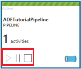
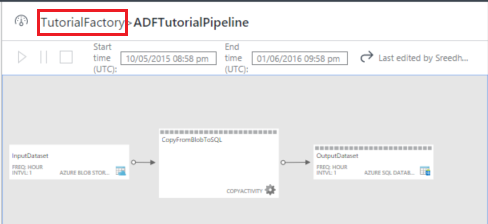
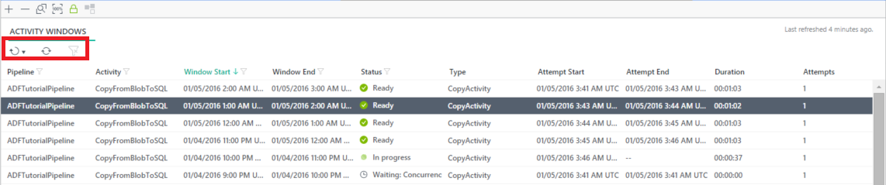
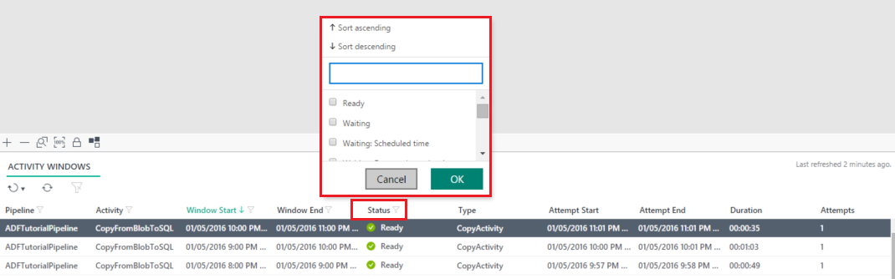
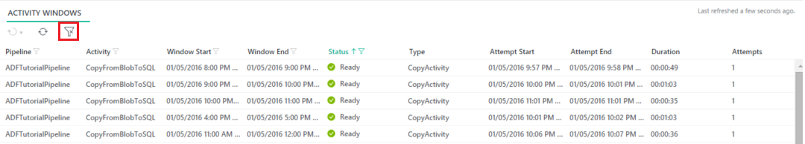
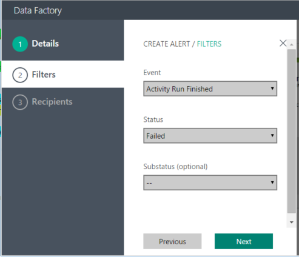

<properties 
    pageTitle="Überwachen und Verwalten von Azure Data Factory pipelines" 
    description="Informationen Sie zum Verwenden von Überwachung und Verwaltung App zum Überwachen und Verwalten von Azure Daten Factory und Pipelines." 
    services="data-factory" 
    documentationCenter="" 
    authors="spelluru" 
    manager="jhubbard" 
    editor="monicar"/>

<tags 
    ms.service="data-factory" 
    ms.workload="data-services" 
    ms.tgt_pltfrm="na" 
    ms.devlang="na" 
    ms.topic="article" 
    ms.date="09/06/2016" 
    ms.author="spelluru"/>

# Überwachen und Verwalten von Azure Data Factory Pipelines mit neuen Überwachung und Verwaltung-App
> [AZURE.SELECTOR]
- [Mithilfe der Azure-Portal/Azure PowerShell](data-factory-monitor-manage-pipelines.md)
- [Verwenden für die Überwachung und Verwaltung-App](data-factory-monitor-manage-app.md)

Dieser Artikel beschreibt, wie überwachen, verwalten und Debuggen Pipelines und Erstellen von Benachrichtigungen zu Fehlern, die Verwendung der **Überwachung und Verwaltung App**benachrichtigt zu werden. Sie können auch schauen Sie sich das folgende Video erfahren Sie mehr über die Überwachung und Verwaltung App verwenden.
   

> [AZURE.VIDEO azure-data-factory-monitoring-and-managing-big-data-piplines]
      
## Starten die Überwachung und Verwaltung App ein
Um den Monitor und Management App starten, klicken Sie auf **Überwachung und verwalten** der Kachel auf dem **Daten FACTORY** -Blade für Ihre Daten Factory.

 

Sollte angezeigt werden, dass die Überwachung und Verwaltung App in einer separaten Registerkartenfenster gestartet wird.  

> [AZURE.NOTE] Wenn Sie sehen, dass der Webbrowser bei "Autorisieren..." hängen geblieben ist, deaktivieren/deaktivieren **von Drittanbietern-Cookies blockieren und Standortdaten** Einstellung (oder) beibehalten aktiviert und erstellen Sie eine Ausnahme für **login.microsoftonline.com** und versuchen Sie es dann mit dem Sie die Anwendung erneut starten.

Wenn Sie die Aktivität Windows in der Liste unten nicht angezeigt werden, klicken Sie auf die Schaltfläche **Aktualisieren** , klicken Sie auf der Symbolleiste, um die Liste zu aktualisieren. Darüber hinaus legen Sie die richtigen Werte für die **Startzeit** und die **Endzeit** Filter ein.  

## Grundlegendes zu den für die Überwachung und Verwaltung-App
Es gibt drei Registerkarten (**Ressourcen-Explorer**, **Überwachung Ansichten**und **Benachrichtigungen**) auf der linken Seite und die erste Registerkarte (Ressourcen-Explorer) ist standardmäßig aktiviert. 

### Ressourcen-Explorer
Sie finden die folgenden Themen: 

- Ressource Explorer- **Strukturansicht** im linken Bereich.
- **In der Diagrammansicht** oben.
- Klicken Sie unten im mittleren Bereich **Aktivitäten in Windows** -Liste.
- **Eigenschaften**/**Aktivität Fenster Explorer** -Registerkarten im rechten Bereich. 

Alle Ressourcen (Pipelines, Datasets verknüpfte Services) in der Factory Daten in einer Strukturansicht im Ressourcen-Explorer wird. Beim Auswählen eines Objekts im Ressourcen-Explorer, beachten Sie die folgenden: 

- zugeordneten Daten Factory Entität wird in der Diagrammansicht hervorgehoben.
- Aktivität Fenster zugeordnet (klicken Sie auf [hier](data-factory-scheduling-and-execution.md) lernen Aktivität Windows) werden in der Liste Aktivität Windows unten hervorgehoben.  
- Eigenschaften des ausgewählten Objekts im Fenster Eigenschaften im rechten Bereich. 
- JSON-Definition des ausgewählten Objekts, falls zutreffend. Beispiel: eine verknüpfte Dienst oder ein Dataset oder eine Verkaufspipeline. 

Ausführliche grundlegende Informationen zur Aktivitätsfenster finden Sie unter [Planung und Ausführung](data-factory-scheduling-and-execution.md) diesem Artikel. 

### In der Diagrammansicht
Der Diagrammansicht einer Factory Daten bietet einen zentralen Konsole überwachen und Verwalten der Daten Factory und ihre Ressourcen. Wenn Sie eine Entität Daten Factory (Dataset/Verkaufspipeline) in der Diagrammansicht auswählen, beachten Sie Folgendes:
 
- die Daten Factory Entität ist in der Strukturansicht ausgewählt
- Windows zugeordneten Aktivität werden in der Liste Aktivität Windows hervorgehoben.
- Eigenschaften des ausgewählten Objekts im Eigenschaftenfenster

Wenn der Verkaufspipeline (nicht im angehaltenen Zustand) aktiviert ist, wird sie mit einer grünen Linie angezeigt. 

Beachten Sie, dass es drei Schaltflächen für die Verkaufspipeline in der Diagrammansicht gibt. Die zweite Schaltfläche können die Verkaufspipeline angehalten. Anhalten nicht die aktuell ausgeführten Aktivitäten zu beenden und mit der sie abschließen. Dritte Schaltfläche hält die Verkaufspipeline und deren Aktivitäten auszuführen vorhandenen beendet. Erste Schaltfläche Lebensläufen der Verkaufspipeline an. Wenn Ihre Verkaufspipeline angehalten ist, stellen Sie die Farbwechsel für die Verkaufspipeline Kachel wie folgt aus.

Sie können Mehrfachauswahl zwei oder mehr Pipelines (mit STRG) und Schaltflächen der Befehlsleiste anhalten/mehrere Pipelines nacheinander fortsetzen.

Sie können alle Aktivitäten in der Verkaufspipeline anzeigen, indem Sie mit der rechten Maustaste in der Kachel "Verkaufspipeline" und auf **Verkaufspipeline öffnen**.

In der geöffneten Verkaufspipeline befinden finden Sie unter alle Aktivitäten in der Verkaufspipeline. In diesem Beispiel ist es nur eine Aktivität: Kopieren Aktivität. Um zur vorherigen Ansicht zurückzukehren, klicken Sie auf Data source Name in der Breadcrumb-Menü am oberen Factory.

In der Ansicht Verkaufspipeline wird Wenn Sie auf ein Dataset Ausgabe oder wenn Sie die Maus über das Dataset Ausgabe bewegen das Aktivitäten in Windows-Popup für diesen Dataset.

Sie können ein Aktivitätsfenster, um Details dafür anzuzeigen, **Klicken Sie im Eigenschaftenfenster im rechten Bereich** klicken. 

Wechseln Sie im rechten Bereich zur Registerkarte **Aktivitäten in Windows-Explorer** , um weitere Details anzuzeigen.

 

Sie sehen auch für jede Aktivität ausführen im Abschnitt **Versuche** versuchen **Variablen gelöst** . 

Wechseln Sie zur Registerkarte **Skript** die JSON-Skript-Definition für das ausgewählte Objekt angezeigt.   

Sie können Aktivitäten in Windows an drei Stellen angezeigt werden:

- Aktivitäten in Windows-Popup in der Diagrammansicht (mittleren Bereich).
- Aktivität-Explorer-Fenster im rechten Bereich.
- Windows-Liste im unteren Bereich Aktivitäten.

In der Aktivität Windows Popupmenü und Aktivitäten in Windows-Explorer können Sie zum vorherigen Woche und nächste Woche mithilfe der Pfeiltasten nach links und rechts wechseln.

Am unteren Rand der Diagrammansicht finden Sie unter Schaltflächen zum Vergrößern, verkleinern, Zoom passt 100 % vergrößern, Layout sperren. Die Schaltfläche Sperren Layout wird verhindert, dass Sie versehentlich Verschieben von Tabellen und Pipelines in der Diagrammansicht und ist standardmäßig aktiviert. Sie können es deaktivieren und Elemente im Diagramm navigieren. Wenn Sie diese Funktion deaktivieren, können die letzte Schaltfläche Sie um Tabellen und Rohrleitungen automatisch zu positionieren. Sie können auch die Ansicht vergrößern / verkleinern, mit Mausrad.

### Windows-Aktivitätenliste
Die Windows-Liste Aktivität unten in der Gruppe im mittleren Bereich zeigt alle Aktivität Fenster für das Dataset, das Sie in der Ressource Explorer oder in der Diagrammansicht ausgewählt haben. Standardmäßig ist die Liste in absteigender Reihenfolge, was bedeutet, dass das neueste Aktivitätsfenster oben angezeigt wird. 

Diese Liste nicht automatisch aktualisiert wird, verwenden Sie also die Aktualisierungsschaltfläche auf der Symbolleiste, um diese manuell zu aktualisieren.  

Die Aktivität Windows können eine der folgenden Status aufweisen:

<table>
<tr>
    <th align="left">Status</th><th align="left">Untergeordnete Status</th><th align="left">Beschreibung</th>
</tr>
<tr>
    <td rowspan="8">Warten</td><td>ScheduleTime</td><td>Nicht es ist für das Aktivitätsfenster ausführen Zeit.</td>
</tr>
<tr>
<td>DatasetDependencies</td><td>Die übergeordneten Abhängigkeiten sind nicht bereit.</td>
</tr>
<tr>
<td>ComputeResources</td><td>Die berechnen Ressourcen sind nicht verfügbar.</td>
</tr>
<tr>
<td>ConcurrencyLimit</td> <td>Alle Aktivitätsinstanzen sind beschäftigt andere Aktivität Windows ausgeführt.</td>
</tr>
<tr>
<td>ActivityResume</td><td>Aktivität angehalten wird und die Aktivität Windows kann nicht ausgeführt werden, bis er fortgesetzt wird.</td>
</tr>
<tr>
<td>"Wiederholen"</td><td>Aktivität Ausführung wird wiederholt.</td>
</tr>
<tr>
<td>Überprüfung</td><td>Überprüfung hat noch nicht begonnen.</td>
</tr>
<tr>
<td>ValidationRetry</td><td>Warten, bis die Überprüfung wiederholt werden.</td>
</tr>
<tr>
<tr
<td rowspan="2">In Bearbeitung</td><td>Überprüfen von</td><td>Überprüfung wird ausgeführt.</td>
</tr>
<td></td>
<td>Im Aktivitätsfenster wird bearbeitet.</td>
</tr>
<tr>
<td rowspan="4">Fehler beim</td><td>TimedOut</td><td>Ausführung benötigte länger als die von der Aktivität zulässig ist.</td>
</tr>
<tr>
<td>Abgebrochen</td><td>Durch eine Benutzeraktion abgebrochen.</td>
</tr>
<tr>
<td>Überprüfung</td><td>Fehler bei der Überprüfung.</td>
</tr>
<tr>
<td></td><td>Fehler beim Generieren und/oder das Aktivitätsfenster überprüfen.</td>
</tr>
<td>Bereit</td><td></td><td>Im Aktivitätsfenster ist zur Verwendung bereit.</td>
</tr>
<tr>
<td>Übersprungen</td><td></td><td>Im Aktivitätsfenster wird nicht verarbeitet werden.</td>
</tr>
<tr>
<td>Keine</td><td></td><td>Ein Aktivitätsfenster, die mit einem anderen Status bestehen verwendet, aber zurückgesetzt wurde.</td>
</tr>
</table>

Wenn Sie ein Aktivitätsfenster in der Liste klicken, wird auf der rechten Seite Details zu erhalten, klicken Sie im **Windows-Explorer Aktivität** oder **Eigenschaften** .

### Aktualisieren von Aktivitäten in windows  
Die Details werden nicht automatisch aktualisiert, sodass Sie die **Aktualisieren verwenden** Schaltfläche (zweite Schaltfläche) auf der Befehlsleiste in der Liste der Aktivität Windows manuell zu aktualisieren.  
 

### Eigenschaftenfenster
Das Fenster Eigenschaften wird im äußersten rechten Bereich der app Überwachung und Verwaltung. 

Eigenschaften für das Element, das Sie in der Ressource Explorer (Strukturansicht) (oder) Diagramm anzeigen (oder) Aktivität Windows Liste ausgewählt angezeigt. 

### Aktivitäten in Windows Explorer

**Aktivität im Explorer** -Fenster wird im äußersten rechten Bereich der Überwachung und Verwaltung App. Es zeigt die Details der Aktivitätsfenster, das Sie in der Aktivität Windows Popupmenü oder Aktivität Windows-Liste ausgewählt haben. 

Sie können in ein anderes Aktivitätsfenster, indem Sie darauf in der Kalenderansicht oben wechseln. Sie können auch die **nach-links**/**nach-rechts** -Schaltflächen nach oben, um die Aktivität Windows aus dem vorherigen/nächsten Woche finden Sie unter.

Sie können die Schaltflächen der Symbolleiste im unteren Bereich **erneut ausführen** im Aktivitätsfenster oder **Aktualisieren** die Details im Bereich verwenden. 

### Skript 
Sie können die Registerkarte **Skript** verwenden, um die JSON-Definition der ausgewählten Daten Factory Entität (verknüpfte Service, Dataset und Verkaufspipeline) anzuzeigen. 

## Verwenden von Systemansichten
Die Überwachung und Verwaltung App enthält vorgefertigte Systemansichten (**aktuelle Aktivität Windows**, **fehlgeschlagen Aktivität Windows**, **Aktivitäts-Windows In Bearbeitung**), die Sie zuletzt verwendete/Fehler beim/in Bearbeitung Aktivität Windows für Ihre Daten Factory anzeigen können. 

Wechseln Sie zur Registerkarte **Überwachung Ansichten** auf der linken Seite, indem Sie darauf. 

Zurzeit stehen drei Ansichten unterstützt. Wählen Sie eine Option, um die aktuelle Aktivität Windows (oder) fehlerhafte Aktivität Windows (oder) in Bearbeitung Aktivität Windows in der Liste Aktivität Windows (unten im mittleren Bereich) angezeigt. 

Wenn Sie die Option **aktuelle Aktivität Windows** auswählen, wird alle zuletzt verwendete Aktivität Windows in absteigender Reihenfolge der **letzten Mal versuchen**. 

Die Ansicht **fehlgeschlagen Aktivität Windows** können alle fehlerhafte Aktivität Fenster in der Liste angezeigt. Wählen Sie eine fehlerhafte Aktivität-Fenster in der Liste, um die Details im **Eigenschaften** Fenster (oder) **Aktivität Fenster Explorer**finden Sie unter ein. Sie können auch Protokolle für eine fehlerhafte Aktivitätsfenster herunterladen. 

## Sortieren und Filtern von Aktivitäten in windows
Ändern Sie die **Startzeit** und die **Endzeit** Einstellungen in der Befehlsleiste in Filter Aktivität Windows ein. Nachdem Sie die Start- und Endzeit ändern, klicken Sie auf die Schaltfläche neben Endzeit aktualisieren Sie die Liste der Aktivitäten in Windows.

> [AZURE.NOTE] Aktuell sind alle Zeiten im UTC-Format in die Überwachung und Verwaltung App aus. 

Klicken Sie auf den Namen einer Spalte, in der **Liste der Aktivitäten in Windows**(zum Beispiel: Status). 

Sie können die folgenden Aktionen ausführen:

- Sortieren in aufsteigender Reihenfolge.
- Sortieren in absteigender Reihenfolge.
- Filtern Sie, indem Sie einen oder mehrere Werte (bereit, wartet usw..)

Wenn Sie einen Filter für eine Spalte angeben, wird die Filterschaltfläche für die Spalte fest, dass die Werte in der Spalte gefilterter Werte werden aktiviert. 

Das gleiche Popupfenster können zum Löschen von Filtern. Klicken Sie zum Löschen aller Filter für die Liste der Aktivitäten in Windows auf die Schaltfläche Filter löschen auf der Befehlsleiste. 

## Ausführen von Aktionen Stapel

### Führen Sie die ausgewählte Aktivität Windows erneut aus.
Wählen Sie ein Aktivitätsfenster aus, klicken Sie auf den Pfeil nach unten für die erste Befehlsschaltfläche Balken aus, und wählen Sie **erneut ausführen** / **mit vor-in Verkaufspipeline ausführen**. Wenn Sie die Option **mit vor-in Verkaufspipeline ausführen** auswählen, führt sie alle übergeordneten Aktivität Windows als auch erneut aus. 
    

Sie können auch wählen in der Liste mehrere Aktivitäten in Windows und führen sie gleichzeitig erneut aus. Sie möchten die Aktivität Windows basierend auf den Status zu filtern (beispielsweise: **fehlgeschlagen**) und anschließend erneut ausführen der fehlerhafte Aktivität Windows nach korrigieren das Problem, bei dem die Aktivität Windows fehlschlägt. Finden Sie im folgenden Abschnitt Details zum Filtern Aktivität Windows in der Liste aus.  

### Mehrere Pipelines anhalten/fortsetzen
Sie können Mehrfachauswahl zwei oder mehr Pipelines (mit STRG) und Schaltflächen der Befehlsleiste (hervorgehoben in Rot Rechteck auf die folgende Abbildung) anhalten/sie nacheinander fortsetzen.

## Benachrichtigungen erstellen 
Die Seite Benachrichtigungen können Sie eine Benachrichtigung anzeigen/bearbeiten/löschen vorhandenen Benachrichtigungen zu erstellen. Sie können auch aktivieren/deaktivieren einer Benachrichtigung. Wenn die Seite Benachrichtigungen anzeigen möchten, klicken Sie auf die Registerkarte Benachrichtigungen.

### Erstellen eine Benachrichtigung

1. Klicken Sie auf die **Benachrichtigung hinzufügen** , um eine Benachrichtigung hinzuzufügen. Die Seite Details angezeigt. 

    
1. Geben Sie den **Namen** und eine **Beschreibung** für die Warnung, und klicken Sie auf **Weiter**. Sie sollten die **Filter** -Seite angezeigt.

    

2. Wählen Sie das **Ereignis**, **Status**und **untergeordnete Status** (optional) die Daten Factory Service Sie benachrichtigen sollen, und klicken Sie auf **Weiter**. Sie sollten die **Empfänger** -Seite angezeigt.

     
3. Wählen Sie **e-Mail-Abonnement Administratoren** Option und/oder geben Sie **zusätzliche Administrator e-Mail-Adresse ein**, und klicken Sie auf **Fertig stellen**. Es sollte die Benachrichtigung in der Liste angezeigt. 
    
    

Verwenden Sie die Schaltflächen, die Verbindung mit der Warnung zu bearbeiten/löschen/aktivieren/deaktivieren einer Benachrichtigung, in der Liste Benachrichtigungen. 

### Ereignis/Status/untergeordneter
Die folgende Tabelle enthält eine Liste der verfügbaren Ereignisse und Status (und Unterstatus).

Name des Ereignisses | Status | Sub-status
-------------- | ------ | ----------
Aktivität Schritte ausführen | Schritte | Starten
Führen Sie den Vorgang abgeschlossen Aktivität | Wurde erfolgreich abgeschlossen | Wurde erfolgreich abgeschlossen 
Führen Sie den Vorgang abgeschlossen Aktivität | Fehler beim| Fehler beim Ressourcenzuteilung  Fehler beim Ausführen  Timeout  Fehler beim Überprüfung  Abgebrochen
Erstellen Sie bei Bedarf HDI Cluster Schritte | Schritte | &nbsp; |
Bei Bedarf HDI Cluster wurde erfolgreich erstellt. | Wurde erfolgreich abgeschlossen | &nbsp; |
Bei Bedarf HDI Cluster gelöscht | Wurde erfolgreich abgeschlossen | &nbsp; |
### So bearbeiten oder löschen/Deaktivieren einer Benachrichtigung

    
 

