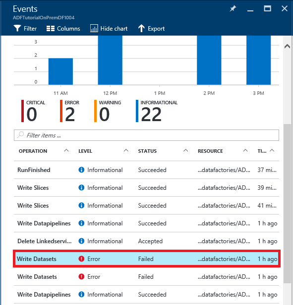
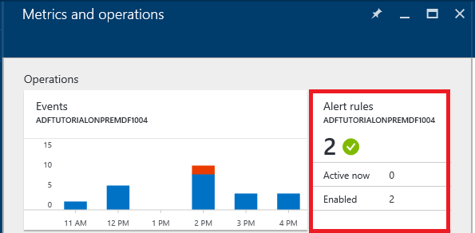

<properties 
    pageTitle="Überwachen und Verwalten von Azure Data Factory pipelines" 
    description="Erfahren Sie, wie Sie Azure-Portal und Azure PowerShell zum Überwachen und Verwalten von Azure Daten Factory und Pipelines, die Sie erstellt haben." 
    services="data-factory" 
    documentationCenter="" 
    authors="spelluru" 
    manager="jhubbard" 
    editor="monicar"/>

<tags 
    ms.service="data-factory" 
    ms.workload="data-services" 
    ms.tgt_pltfrm="na" 
    ms.devlang="na" 
    ms.topic="article" 
    ms.date="09/06/2016" 
    ms.author="spelluru"/>

# Überwachen und Verwalten von Azure Data Factory pipelines
> [AZURE.SELECTOR]
- [Verwenden von Azure-Portal/Azure PowerShell](data-factory-monitor-manage-pipelines.md)
- [Verwenden für die Überwachung und Verwaltung-App](data-factory-monitor-manage-app.md)

Der Daten Factory-Dienst bietet zuverlässigen und vollständiger Überblick über Ihre Speicher, Verarbeitung und Daten Bewegung Dienste. Der Dienst bietet Ihnen eine Überwachung Dashboard hilft, die Sie verwenden können, um die folgenden Aufgaben ausführen: 

- Bewerten Sie schnell End-to-End-Daten Verkaufspipeline Dienststatus.
- Probleme erkennen und Ausführen von Maßnahmen, falls erforderlich. 
- Die Datenherkunft nachverfolgen. 
- Nachverfolgen von Beziehungen zwischen Ihrer Daten in allen Ihrer Quellen.
- Ansicht vollständige zurückliegenden Buchhaltung Ausführung Auftrags, des Systemzustands und Abhängigkeiten.

Dieser Artikel beschreibt, wie überwachen, verwalten und Debuggen Pipelines. Darüber hinaus Informationen zum Erstellen von Benachrichtigungen und erhalten einer Benachrichtigung zu Fehlern.

## Grundlagen von Pipelines und Aktivität Staaten
Verwenden des Azure-Portals an, können Sie die folgenden Schritte ausführen:

- Zeigen Sie Ihrer Factory Daten als ein Diagramm an
- Anzeigen von Aktivitäten in einer Verkaufspipeline
- Eingabe- und Datasets anzeigen
- und vieles mehr. 

Dieser Abschnitt enthält auch an, wie ein Segment von einem Zustand in einen anderen Status wechselt.   

### Navigieren Sie zu Ihrer Daten factory
1.  Melden Sie sich mit dem [Azure-Portal](https://portal.azure.com)aus.
2.  Klicken Sie im Menü auf der linken Seite auf **Daten Factory** . Wenn es nicht angezeigt wird, klicken Sie auf **Weitere Dienste >** , und klicken Sie auf **Daten Factory** **INTELLIGENCE + ANALYTICS** Kategorie aufgelistet. 

    

    Alle Daten Factory in das Blade **Daten Factory** sollte angezeigt werden. 
4. Wählen Sie die Daten Factory-Blade die Daten Factory, das, der Sie interessiert.

      
5.  und Sie die Homepage (**Data Factory** Blade) für die Daten Factory auftreten.

    

#### Diagrammansicht Ihrer Daten Factory
Der Diagrammansicht einer Factory Daten bietet einen zentralen Konsole überwachen und Verwalten der Daten Factory und ihre Ressourcen.

Wenn die Diagrammansicht Ihrer Factory Daten anzeigen möchten, klicken Sie auf **Diagramm** auf der Startseite der Daten Factory.

Sie können vergrößern, verkleinern, vergrößern, um anzupassen, auf 100 % zoomen, Sperren das Layout des Diagramms und Pipelines und Tabellen automatisch zu positionieren. Sie können auch die Informationen über die Datenherkunft anzeigen (übergeordneten und untergeordneten Elemente der ausgewählten Elemente anzeigen).
 

### Aktivitäten innerhalb einer Verkaufspipeline 
1. Mit der rechten Maustaste in der Verkaufspipeline, und klicken Sie auf **Öffnen Verkaufspipeline** zum Anzeigen aller Aktivitäten in der Verkaufspipeline zusammen mit Eingabe- und Datasets für die Aktivitäten. Dieses Feature ist nützlich, wenn der Verkaufspipeline besteht aus mehr als eine Aktivität und Sie von einer einzelnen Verkaufspipeline die Betrieb Datenherkunft verstehen möchten.

      
2. Im folgenden Beispiel sehen Sie zwei Aktivitäten in der Verkaufspipeline mit ihre Eingaben und Ausgaben. Die Aktivität mit dem Titel **JoinData** vom Typ HDInsight Struktur Aktivitäten und **EgressDataAzure** vom Typ kopieren Aktivität werden in diesem Beispiel Verkaufspipeline. 
    
     
3. Sie können zurück zur Startseite Daten Factory zum Navigieren auf Data Factory-Link im Breadcrumb in der oberen linken Ecke.

    

### Ansicht Status jeder Aktivität innerhalb einer Verkaufspipeline
Sie können den aktuellen Status einer Aktivität anzeigen, indem Sie den Staus der von der Aktivität erzeugt Datasets anzeigen. 

Beispiel: im folgenden Beispiel die **BlobPartitionHiveActivity** erfolgreich ausgeführt wurde, und erzeugt ein Dataset namens **PartitionedProductsUsageTable**, die **eingeschaltet** ist.

Durch Doppelklicken auf die **PartitionedProductsUsageTable** in der Diagrammansicht werden alle Segmente, die von anderen Aktivität führt innerhalb einer Verkaufspipeline erzeugte die. Sie können sehen, dass die **BlobPartitionHiveActivity** erfolgreich monatlich ausgeführt wurde für die letzten acht Monate und gefertigt Segmente in den Zustand **bereit** .

Dataset Segmente in Daten Factory können eine der folgenden Status haben:

<table>
<tr>
    <th align="left">Bundesstaat</th><th align="left">Unterzustand</th><th align="left">Beschreibung</th>
</tr>
<tr>
    <td rowspan="8">Warten</td><td>ScheduleTime</td><td>Nicht es ist für das Segment ausführen Zeit.</td>
</tr>
<tr>
<td>DatasetDependencies</td><td>Die übergeordneten Abhängigkeiten sind nicht bereit.</td>
</tr>
<tr>
<td>ComputeResources</td><td>Die berechnen Ressourcen sind nicht verfügbar.</td>
</tr>
<tr>
<td>ConcurrencyLimit</td> <td>Alle Aktivitätsinstanzen sind beschäftigt andere Segmente ausgeführt.</td>
</tr>
<tr>
<td>ActivityResume</td><td>Aktivität angehalten wird und die Segmente kann nicht ausgeführt werden, bis er fortgesetzt wird.</td>
</tr>
<tr>
<td>"Wiederholen"</td><td>Aktivität Ausführung wird wiederholt.</td>
</tr>
<tr>
<td>Überprüfung</td><td>Überprüfung hat noch nicht begonnen.</td>
</tr>
<tr>
<td>ValidationRetry</td><td>Warten, bis die Überprüfung wiederholt werden.</td>
</tr>
<tr>
<tr
<td rowspan="2">In Bearbeitung</td><td>Überprüfen von</td><td>Überprüfung wird ausgeführt.</td>
</tr>
<td></td>
<td>Das Segment wird verarbeitet.</td>
</tr>
<tr>
<td rowspan="4">Fehler beim</td><td>TimedOut</td><td>Ausführung benötigte länger als die von der Aktivität zulässig ist.</td>
</tr>
<tr>
<td>Abgebrochen</td><td>Durch eine Benutzeraktion abgebrochen.</td>
</tr>
<tr>
<td>Überprüfung</td><td>Fehler bei der Überprüfung.</td>
</tr>
<tr>
<td></td><td>Fehler beim Generieren und/oder das Segment zu überprüfen.</td>
</tr>
<td>Bereit</td><td></td><td>Das Segment ist zur Verwendung bereit.</td>
</tr>
<tr>
<td>Übersprungen</td><td></td><td>Das Segment wird nicht verarbeitet werden.</td>
</tr>
<tr>
<td>Keine</td><td></td><td>Ein Segment, die mit einem anderen Status bestehen verwendet, aber zurückgesetzt wurde.</td>
</tr>
</table>

Sie können die Details zu einem Segment anzeigen, indem Sie auf einen Eintrag Segment in das Blade **Segmente zuletzt aktualisiert** .

 
Wenn das Segment mehrmals ausgeführt wurde, sehen Sie mehrere Zeilen in der Liste **Aktivität ausgeführt wird** . Sie können Details zu einer Aktivität ausführen durch Klicken auf den Eintrag ausführen, in der Liste **Aktivität führt** anzeigen. Die Liste zeigt die Protokolldateien sowie eine Fehlermeldung angezeigt, wenn ein. Dieses Feature ist nützlich zum Anzeigen und Debuggen von Protokollen ohne Ihre Daten Factory verlassen zu müssen.

Wenn das Segment nicht im Zustand **bereit** ist, können Sie Segmente des übergeordneten angezeigt, die nicht bereit sind und das aktuelle Segment von in der Liste **übergeordneten Segmente, die nicht bereit sind,** ausgeführt werden blockieren. Dieses Feature ist nützlich, wenn das Segment befindet sich im Status **Warten** und die übergeordneten Abhängigkeiten zu verstehen, an denen das Segment wartet, werden soll.

### Bundesstaat DataSet-Diagramm
Nachdem Sie eine Factory Daten bereitstellen und die Rohrleitungen eine gültige aktive Periode haben, slices Dataset Übergang von einem Zustand zu einem anderen an. Derzeit umfasst der Segment Status im nachstehenden Diagramm für den Bundesstaat:

Bundesstaat Dataset Übergang illustrieren in Daten Factory: Warten-In-Fortschritt/In Bearbeitung (Überprüfung) > -> sofort/fehlgeschlagen

Die Segmente in einem Zustand **Warten** für Pre Bedingungen erfüllt sein, bevor Sie ausführen starten. Klicken Sie dann die Aktivität ausgeführt wird, und das Segment wechselt in den Status **In Bearbeitung** . Die Ausführung der Aktivitäten möglicherweise erfolgreich ist oder fehlschlägt. Das Segment **bereit**markiert ' oder **fehlgeschlagen** auf Basis des Ergebnisses der Ausführung. 

Sie können das Segment zurückkehren aus Zustand **bereit** oder **Fehler** in **Warten** Zustand zurücksetzen. Sie können auch im Segment Zustand zu **Überspringen**, wodurch gehindert, dass die Aktivität aufgeführte markieren und nicht verarbeiten das Segment.

## Verwalten von pipelines
Sie können mithilfe der PowerShell Azure Pipelines verwalten. Beispielsweise können anhalten und fortsetzen Pipelines durch Ausführen der Azure-PowerShell-Cmdlets. 

### Anhalten und fortsetzen pipelines
Sie können anhalten/Pipelines mithilfe des Powershell-Cmdlets **Standby-AzureRmDataFactoryPipeline** unterbrechen. Dieses Cmdlet ist nützlich, wenn nicht der Pipelines ausgeführt, bis ein Problem behoben werden soll.

Beispiel: in der folgenden Screenshot, wurde ein Problem mit der **PartitionProductsUsagePipeline** in **productrecgamalbox1dev** Daten Factory erkannt und wir die Verkaufspipeline anhalten möchten.

Um eine Verkaufspipeline unterbrechen, führen Sie den folgenden PowerShell-Befehl aus:

    Suspend-AzureRmDataFactoryPipeline [-ResourceGroupName] <String> [-DataFactoryName] <String> [-Name] <String>

Beispiel:

    Suspend-AzureRmDataFactoryPipeline -ResourceGroupName ADF -DataFactoryName productrecgamalbox1dev -Name PartitionProductsUsagePipeline 

Nach der Behebung des Problems mit der **PartitionProductsUsagePipeline**kann die unterbrochene Verkaufspipeline durch Ausführen des folgenden PowerShell-Befehls fortgesetzt werden:

    Resume-AzureRmDataFactoryPipeline [-ResourceGroupName] <String> [-DataFactoryName] <String> [-Name] <String>

Beispiel:

    Resume-AzureRmDataFactoryPipeline -ResourceGroupName ADF -DataFactoryName productrecgamalbox1dev -Name PartitionProductsUsagePipeline 

## Debuggen von pipelines
Azure Data Factory bietet Rich-Funktionen, die über Azure-Portal und Azure PowerShell Debuggen und Problembehandlung bei Rohrleitungen.

### Suchen von Fehlern in einer Verkaufspipeline
Aktivität ausführen in einer Verkaufspipeline fehlschlägt, ist das von der Verkaufspipeline erzeugten Dataset in einem Fehlerstatus aufgrund der Fehler. Sie können Debuggen und Problembehandlung bei Synchronisierungsfehlern in Azure Data Factory mithilfe der folgenden Methoden.

#### Verwenden Sie einen Fehler Debuggen Azure-Portal:

3.  Klicken Sie in der **Tabelle** Blade auf das Segment Problem mit **STATUS** auf **fehlgeschlagen**.

    
4.  Klicken Sie in das Blade **Daten Segment** auf die Aktivität, die Fehler beim Ausführen.
    
    
5.  In der Blade **DETAILS über die Aktivitäten ausführen** können Sie die Verarbeitung von HDInsight zugeordneten Dateien herunterladen. Klicken Sie auf herunterladen für Status/Stderr die Fehlerprotokolldatei herunterladen, die Details zu dem Fehler enthält.

      

#### Mithilfe der PowerShell Debuggen einen Fehler
1.  Starten Sie **Azure PowerShell**.
3.  Führen Sie **Get-AzureRmDataFactorySlice** Befehl um Segmente und deren Status anzuzeigen. Ein Segment mit dem Status sollte angezeigt werden: **fehlgeschlagen**.       

            Get-AzureRmDataFactorySlice [-ResourceGroupName] <String> [-DataFactoryName] <String> [-TableName] <String> [-StartDateTime] <DateTime> [[-EndDateTime] <DateTime> ] [-Profile <AzureProfile> ] [ <CommonParameters>]
    
    Beispiel:
        
            Get-AzureRmDataFactorySlice -ResourceGroupName ADF -DataFactoryName LogProcessingFactory -TableName EnrichedGameEventsTable -StartDateTime 2014-05-04 20:00:00

    Ersetzen Sie **StartDateTime** mit dem StartDateTime Wert enthält, die, den Sie für die Set-AzureRmDataFactoryPipelineActivePeriod angegeben haben.
4. Führen Sie nun das Cmdlet " **Get-AzureRmDataFactoryRun** ", um Details für das Segment ausführen Aktivität zu erhalten.

        Get-AzureRmDataFactoryRun [-ResourceGroupName] <String> [-DataFactoryName] <String> [-TableName] <String> [-StartDateTime] 
        <DateTime> [-Profile <AzureProfile> ] [ <CommonParameters>]
    
    Beispiel:

        Get-AzureRmDataFactoryRun -ResourceGroupName ADF -DataFactoryName LogProcessingFactory -TableName EnrichedGameEventsTable -StartDateTime "5/5/2014 12:00:00 AM"

    Der Wert von StartDateTime ist die Startzeit für Fehler/Problem Segments, das Sie aus dem vorherigen Schritt notiert haben. Datum und Uhrzeit sollten in doppelte Anführungszeichen eingeschlossen sein.
5.  Die Ausgabe mit Details zu dem Fehler (ähnlich wie der folgende) sollte angezeigt werden:

            Id                      : 841b77c9-d56c-48d1-99a3-8c16c3e77d39
            ResourceGroupName       : ADF
            DataFactoryName         : LogProcessingFactory3
            TableName               : EnrichedGameEventsTable
            ProcessingStartTime     : 10/10/2014 3:04:52 AM
            ProcessingEndTime       : 10/10/2014 3:06:49 AM
            PercentComplete         : 0
            DataSliceStart          : 5/5/2014 12:00:00 AM
            DataSliceEnd            : 5/6/2014 12:00:00 AM
            Status                  : FailedExecution
            Timestamp               : 10/10/2014 3:04:52 AM
            RetryAttempt            : 0
            Properties              : {}
            ErrorMessage            : Pig script failed with exit code '5'. See wasb://     adfjobs@spestore.blob.core.windows.net/PigQuery
                                            Jobs/841b77c9-d56c-48d1-99a3-
                        8c16c3e77d39/10_10_2014_03_04_53_277/Status/stderr' for
                        more details.
            ActivityName            : PigEnrichLogs
            PipelineName            : EnrichGameLogsPipeline
            Type                    :
    
    
6.  Sie können mit ID-Wert **Speichern-AzureRmDataFactoryLog** -Cmdlet ausführen, finden Sie in der Ausgabe, und Laden Sie die Protokolldateien mithilfe der **-DownloadLogsoption** für das Cmdlet.

            Save-AzureRmDataFactoryLog -ResourceGroupName "ADF" -DataFactoryName "LogProcessingFactory" -Id "841b77c9-d56c-48d1-99a3-8c16c3e77d39" -DownloadLogs -Output "C:\Test"

## Führen Sie die Fehler in einer Verkaufspipeline erneut aus.

### Verwenden von Azure-portal

Nachdem Sie behandeln von Problemen mit und Debuggen von Fehlern in einer Verkaufspipeline, können Sie Fehlern erneut ausführen, indem Sie auf das Segment zurück navigieren und durch Klicken auf die Schaltfläche " **Ausführen** " auf der Befehlsleiste.

Für den Fall, dass das Segment aufgrund einer Richtlinienfehler fehlgeschlagen ist (für ex: Daten nicht verfügbar), können Sie den Fehler zu beheben und erneut überprüfen, indem Sie auf die Schaltfläche **bestätigen** auf der Befehlsleiste.

### Mithilfe der PowerShell Azure

Sie können Fehler mithilfe des Cmdlets Set-AzureRmDataFactorySliceStatus erneut ausführen. Finden Sie unter [Festlegen – AzureRmDataFactorySliceStatus](https://msdn.microsoft.com/library/mt603522.aspx) Thema Informationen zur Syntax und die Details des Cmdlets. 

**Beispiel:** Im folgenden Beispiel wird der Status der alle Segmente für die Tabelle 'DAWikiAggregatedData' auf 'Warten' in der Factory Azure-Daten 'WikiADF'.

Festlegen der UpdateType zu UpstreamInPipeline, was bedeutet, dass der Status der einzelnen Segments für die Tabelle und alle abhängigen (übergeordneten) Tabellen festgelegt sind "Warten". Andere mögliche Wert für diesen Parameter ist "Person".

    Set-AzureRmDataFactorySliceStatus -ResourceGroupName ADF -DataFactoryName WikiADF -TableName DAWikiAggregatedData -Status Waiting -UpdateType UpstreamInPipeline -StartDateTime 2014-05-21T16:00:00 -EndDateTime 2014-05-21T20:00:00

## Benachrichtigungen erstellen
Azure Protokolle Benutzerereignisse aus, wenn eine Azure Ressource (beispielsweise eine Factory Daten) wird erstellt, aktualisiert oder gelöscht. Diese Ereignisse können Sie Benachrichtigungen erstellen. Daten Factory können Sie verschiedene Kennzahlen erfassen und Benachrichtigungen auf Kennzahlen erstellen. Es empfiehlt sich, dass Sie Ereignisse für eine in Echtzeit überwachen und Kriterien für zurückliegende Zwecke verwenden. 

### Benachrichtigungen für Ereignisse
Azure Ereignisse bieten hilfreiche Einblicke in was in Azure Ressourcen passiert. Azure Protokolle Benutzerereignisse aus, wenn eine Azure Ressource (beispielsweise eine Factory Daten) wird erstellt, aktualisiert oder gelöscht. Bei Verwendung der Azure-Daten Factory Ereignisse generiert werden beim:

- Azure Data Factory ist erstellt/aktualisiert/gelöscht.
- Datenverarbeitung (namens als ausgeführt) wurde gestartet/durchgeführt.
- Ein bei Bedarf HDInsight Cluster erstellt und entfernt.

Sie können Benachrichtigungen für diesen Benutzerereignisse erstellen und konfigurieren sie zum Senden von e-Mail-Benachrichtigungen an den Administrator und Co-Administratoren des Abonnements. Darüber hinaus können Sie zusätzliche e-Mail-Adressen der Benutzer angeben, die e-Mail-Benachrichtigungen zu erhalten, wenn die Bedingung erfüllt werden müssen. Dieses Feature ist nützlich, wenn Sie, zu Fehlern benachrichtigt zu werden möchten, und Sie Ihre Daten Factory ständig zu überwachen möchten.

> [AZURE.NOTE] Im Portal zeigt derzeit keine Benachrichtigungen für Ereignisse. Verwenden Sie die [Überwachung und Verwaltung App](data-factory-monitor-manage-app.md) , um alle Benachrichtigungen anzuzeigen.

#### Angeben einer Benachrichtigung Definition:
Um eine Benachrichtigung Definition angeben möchten, erstellen Sie eine JSON-Datei, die beschreibt die Vorgänge, denen Sie auf benachrichtigt werden möchten. Im folgenden Beispiel sendet die Benachrichtigung für eine e-Mail-Benachrichtigung für den Vorgang RunFinished. Um zugeschnitten, eine e-Mail-Benachrichtigung gesendet werden, wenn eine ausführen, in der Daten Factory abgeschlossen ist, und Fehler beim Ausführen (Status = FailedExecution).

    {
        "contentVersion": "1.0.0.0",
         "$schema": "http://schema.management.azure.com/schemas/2014-04-01-preview/deploymentTemplate.json#",
        "parameters": {},
        "resources": 
        [
            {
                "name": "ADFAlertsSlice",
                "type": "microsoft.insights/alertrules",
                "apiVersion": "2014-04-01",
                "location": "East US",
                "properties": 
                {
                    "name": "ADFAlertsSlice",
                    "description": "One or more of the data slices for the Azure Data Factory has failed processing.",
                    "isEnabled": true,
                    "condition": 
                    {
                        "odata.type": "Microsoft.Azure.Management.Insights.Models.ManagementEventRuleCondition",
                        "dataSource": 
                        {
                            "odata.type": "Microsoft.Azure.Management.Insights.Models.RuleManagementEventDataSource",
                            "operationName": "RunFinished",
                            "status": "Failed",
                            "subStatus": "FailedExecution"   
                        }
                    },
                    "action": 
                    {
                        "odata.type": "Microsoft.Azure.Management.Insights.Models.RuleEmailAction",
                        "customEmails": [ "<your alias>@contoso.com" ]
                    }
                }
            }
        ]
    }

Aus der Definition JSON können **untergeordneter** entfernt werden, wenn Sie nicht bei einem bestimmten Fehler benachrichtigt werden möchten.

In diesem Beispiel wird von der Benachrichtigung für alle Daten Factory in Ihr Abonnement. Wenn Sie die Benachrichtigung nach einer bestimmten Daten Factory eingerichtet werden möchten, können Sie in der **Datenquelle**Daten Factory **ResourceUri** angeben:

    "resourceUri" : "/SUBSCRIPTIONS/<subscriptionId>/RESOURCEGROUPS/<resourceGroupName>/PROVIDERS/MICROSOFT.DATAFACTORY/DATAFACTORIES/<dataFactoryName>"

Die folgende Tabelle enthält eine Liste der verfügbaren Vorgänge und Status (und untergeordnete Status).

Name des Vorgangs | Status | Sub-status
-------------- | ------ | ----------
RunStarted | Schritte | Starten
RunFinished | Fehler beim / wurde erfolgreich abgeschlossen | FailedResourceAllocation  Wurde erfolgreich abgeschlossen  FailedExecution  TimedOut  < abgebrochen  FailedValidation  Abgebrochen
OnDemandClusterCreateStarted | Schritte
OnDemandClusterCreateSuccessful | Wurde erfolgreich abgeschlossen
OnDemandClusterDeleted | Wurde erfolgreich abgeschlossen

Informationen zum JSON-Elemente, die im Beispiel verwendete finden Sie in der [Regel erstellen](https://msdn.microsoft.com/library/azure/dn510366.aspx) . 

#### Bereitstellen von der Benachrichtigung 
Verwenden Sie die Benachrichtigung für die Bereitstellung das Azure PowerShell-Cmdlet: **Neu-AzureRmResourceGroupDeployment**, wie im folgenden Beispiel gezeigt:

    New-AzureRmResourceGroupDeployment -ResourceGroupName adf -TemplateFile .\ADFAlertFailedSlice.json  

Sobald die Ressource Gruppe Bereitstellung erfolgreich abgeschlossen wurde, wird der folgenden angezeigt:

    VERBOSE: 7:00:48 PM - Template is valid.
    WARNING: 7:00:48 PM - The StorageAccountName parameter is no longer used and will be removed in a future release.
    Please update scripts to remove this parameter.
    VERBOSE: 7:00:49 PM - Create template deployment 'ADFAlertFailedSlice'.
    VERBOSE: 7:00:57 PM - Resource microsoft.insights/alertrules 'ADFAlertsSlice' provisioning status is succeeded
    
    DeploymentName    : ADFAlertFailedSlice
    ResourceGroupName : adf
    ProvisioningState : Succeeded
    Timestamp         : 10/11/2014 2:01:00 AM
    Mode              : Incremental
    TemplateLink      :
    Parameters        :
    Outputs           :

> [AZURE.NOTE] Die [Benachrichtigung Regel erstellen](https://msdn.microsoft.com/library/azure/dn510366.aspx) REST-API können Sie eine Regel erstellen. Die JSON-Nutzlast ist ähnlich wie im Beispiel JSON.  

#### Abrufen der Liste der Azure Ressource Gruppe Bereitstellungen
Um die Liste der bereitgestellten Ressourcengruppe Azure-Bereitstellungen abrufen möchten, verwenden Sie das Cmdlet: **Get-AzureRmResourceGroupDeployment**, wie im folgenden Beispiel gezeigt:

    Get-AzureRmResourceGroupDeployment -ResourceGroupName adf
    
    DeploymentName    : ADFAlertFailedSlice
    ResourceGroupName : adf
    ProvisioningState : Succeeded
    Timestamp         : 10/11/2014 2:01:00 AM
    Mode              : Incremental
    TemplateLink      :
    Parameters        :
    Outputs           :

#### Problembehandlung bei Benutzerereignisse

1. Sie können alle nach dem Klicken auf die Kachel **Metrik und Vorgänge** generierte Ereignisse anzeigen.

    

2. Klicken Sie auf die Kachel **Ereignisse** , um die Ereignisse anzuzeigen. 

    
3. Sie können in das Blade **Ereignisse** Anzeigen von Details zu Ereignissen, Filtern von Ereignissen usw.. 

    
4. Klicken Sie auf einen **Vorgang** in der Liste der Vorgänge, die einen Fehler verursacht.
    
     
5. Klicken Sie auf ein Ereignis **zurück** , um Details zu dem Fehler anzuzeigen.

    
  

[Azure Einblicke Cmdlets](https://msdn.microsoft.com/library/mt282452.aspx) finden Sie im Artikel für PowerShell-Cmdlets, mit denen Sie Benachrichtigungen hinzufügen/Get/entfernen können. Hier sind einige Beispiele für das Cmdlet " **Get-AlertRule** " verwenden: 

    PS C:\> get-alertrule -res $resourceGroup -n ADFAlertsSlice -det
        
            Properties :
            Action      : Microsoft.Azure.Management.Insights.Models.RuleEmailAction
            Condition   :
            DataSource :
            EventName             :
            Category              :
            Level                 :
            OperationName         : RunFinished
            ResourceGroupName     :
            ResourceProviderName  :
            ResourceId            :
            Status                : Failed
            SubStatus             : FailedExecution
            Claims                : Microsoft.Azure.Management.Insights.Models.RuleManagementEventClaimsDataSource
            Condition   :
            Description : One or more of the data slices for the Azure Data Factory has failed processing.
            Status      : Enabled
            Name:       : ADFAlertsSlice
            Tags       :
            $type          : Microsoft.WindowsAzure.Management.Common.Storage.CasePreservedDictionary, Microsoft.WindowsAzure.Management.Common.Storage
            Id: /subscriptions/<subscription ID>/resourceGroups/<resource group name>/providers/microsoft.insights/alertrules/ADFAlertsSlice
            Location   : West US
            Name       : ADFAlertsSlice
    
    PS C:\> Get-AlertRule -res $resourceGroup

            Properties : Microsoft.Azure.Management.Insights.Models.Rule
            Tags       : {[$type, Microsoft.WindowsAzure.Management.Common.Storage.CasePreservedDictionary, Microsoft.WindowsAzure.Management.Common.Storage]}
            Id         : /subscriptions/<subscription id>/resourceGroups/<resource group name>/providers/microsoft.insights/alertrules/FailedExecutionRunsWest0
            Location   : West US
            Name       : FailedExecutionRunsWest0
    
            Properties : Microsoft.Azure.Management.Insights.Models.Rule
            Tags       : {[$type, Microsoft.WindowsAzure.Management.Common.Storage.CasePreservedDictionary, Microsoft.WindowsAzure.Management.Common.Storage]}
            Id         : /subscriptions/<subscription id>/resourceGroups/<resource group name>/providers/microsoft.insights/alertrules/FailedExecutionRunsWest3
            Location   : West US
            Name       : FailedExecutionRunsWest3

    PS C:\> Get-AlertRule -res $resourceGroup -Name FailedExecutionRunsWest0
    
            Properties : Microsoft.Azure.Management.Insights.Models.Rule
            Tags       : {[$type, Microsoft.WindowsAzure.Management.Common.Storage.CasePreservedDictionary, Microsoft.WindowsAzure.Management.Common.Storage]}
            Id         : /subscriptions/<subscription id>/resourceGroups/<resource group name>/providers/microsoft.insights/alertrules/FailedExecutionRunsWest0
            Location   : West US
            Name       : FailedExecutionRunsWest0

Führen Sie folgende Hilfe Befehle Details und Beispiele für das Cmdlet "Get-AlertRule" angezeigt. 

    get-help Get-AlertRule -detailed 
    get-help Get-AlertRule -examples

- Wenn finden Sie unter den Ereignissen benachrichtigen Generation auf das Portal Blade, aber keine e-Mail-Benachrichtigungen erhalten, überprüfen Sie, ob e-Mails von externen Absendern empfangen festgelegte e-Mail-Adresse festgelegt ist. Möglicherweise wurde die Detailinformationen mithilfe Ihrer e-Mail-Einstellungen blockiert.

### Benachrichtigungen für Kennzahlen
Daten Factory können Sie verschiedene Kennzahlen erfassen und Benachrichtigungen auf Kennzahlen erstellen. Sie können überwachen und Benachrichtigungen auf die folgende Metrik für die Segmente in Ihrem Unternehmen Daten erstellen.
 
- Fehler beim ausgeführt
- Erfolgreich ausgeführt

Diese Metrik eignen und ermöglichen es Ihnen, die in ihren Daten Factory eine Übersicht insgesamt fehlerhaft und erfolgreich ausgeführt werden können. Jedes Mal, wenn es wird ein Segment ausführen, werden Kennzahlen ausgegeben. Klicken Sie auf die Stunde sind diese Kennzahlen zusammengefasster und bei Ihrem Speicherkonto abgelegt. Daher um Kennzahlen zu aktivieren, richten Sie ein Speicherkonto.

#### Aktivieren der Kennzahlen:
Wenn Kennzahlen aktivieren möchten, klicken Sie auf die folgenden aus Daten Factory Blade:

**Überwachung** -> **Metrisch** -> **diagnoseeinstellungen** -> **Diagnose**

**Klicken Sie in den **Diagnoseprotokollen** Blade auf** , und wählen Sie das Speicherkonto und speichern.

Nach dem Speichern, kann es für die Metrik in die Überwachung Blade, sichtbar sein, da Kennzahlen Aggregation stündlich geschieht bis zu einer Stunde dauern.

### Einrichten von Benachrichtigung für Kennzahlen:

Klicken Sie auf **Daten Factory Kennzahlen** Blade: 

Klicken Sie auf das Blade **Metrisch** auf **+ Add Benachrichtigung** auf der Symbolleiste. 

Führen Sie auf der Seite **Hinzufügen eine Regel** die folgenden Schritte aus, und klicken Sie auf **OK**.
 
- Geben Sie einen Namen für die Benachrichtigung (Beispiel: Fehler beim Benachrichtigung).
- Geben Sie eine Beschreibung für die Benachrichtigung (Beispiel: eine e-Mail-Nachricht senden, wenn ein Fehler auftritt).
- Wählen Sie eine Metrik (im Vergleich zu erfolgreich ausgeführt fehlgeschlagene wird ausgeführt) aus.
- Geben Sie eine Bedingung und ein gegebener.   
- Geben Sie den Zeitraum an. 
- Geben Sie an, ob eine e-Mail-Nachricht an Besitzer, Mitwirkende und Leser gesendet werden soll.
- und vieles mehr. 

Nachdem die Regel erfolgreich hinzugefügt wurde, wird das Blade wird geschlossen, und finden Sie unter neue Warnung auf der Seite **Metrik** . 

Die Anzahl der Benachrichtigungen sollte auch auf die Kachel **Benachrichtigungen** angezeigt werden. Klicken Sie auf die Kachel **Benachrichtigungen** .

Klicken Sie in das Blade **Benachrichtigungen** finden Sie unter alle vorhandenen Benachrichtigungen. Um eine Benachrichtigung hinzuzufügen, klicken Sie auf der Symbolleiste auf **Benachrichtigung hinzufügen** .

### Benachrichtigung:
Sobald die Regel der Bedingung entspricht, sollten Sie eine Benachrichtigung aktivierte e-Mail-Nachricht erhalten. Sobald das Problem gelöst ist, und der Benachrichtigung Bedingung nicht mehr entsprechen, erhalten Sie eine Benachrichtigung gelöst e-Mail-Nachricht an.

Dieses Verhalten unterscheidet sich von Ereignissen, eine Benachrichtigung gesendet wird bei jedem Fehler für welche benachrichtigen Regel qualifiziert ist.

### Bereitstellen von Benachrichtigungen mithilfe der PowerShell
Sie können auf die gleiche Weise Benachrichtigungen für Kennzahlen bereitstellen, so, wie Sie für Ereignisse. 

**Benachrichtigen Definition:**

    {
        "contentVersion" : "1.0.0.0",
        "$schema" : "http://schema.management.azure.com/schemas/2014-04-01-preview/deploymentTemplate.json#",
        "parameters" : {},
        "resources" : [
        {
                "name" : "FailedRunsGreaterThan5",
                "type" : "microsoft.insights/alertrules",
                "apiVersion" : "2014-04-01",
                "location" : "East US",
                "properties" : {
                    "name" : "FailedRunsGreaterThan5",
                    "description" : "Failed Runs greater than 5",
                    "isEnabled" : true,
                    "condition" : {
                        "$type" : "Microsoft.WindowsAzure.Management.Monitoring.Alerts.Models.ThresholdRuleCondition, Microsoft.WindowsAzure.Management.Mon.Client",
                        "odata.type" : "Microsoft.Azure.Management.Insights.Models.ThresholdRuleCondition",
                        "dataSource" : {
                            "$type" : "Microsoft.WindowsAzure.Management.Monitoring.Alerts.Models.RuleMetricDataSource, Microsoft.WindowsAzure.Management.Mon.Client",
                            "odata.type" : "Microsoft.Azure.Management.Insights.Models.RuleMetricDataSource",
                            "resourceUri" : "/SUBSCRIPTIONS/<subscriptionId>/RESOURCEGROUPS/<resourceGroupName
    >/PROVIDERS/MICROSOFT.DATAFACTORY/DATAFACTORIES/<dataFactoryName>",
                            "metricName" : "FailedRuns"
                        },
                        "threshold" : 5.0,
                        "windowSize" : "PT3H",
                        "timeAggregation" : "Total"
                    },
                    "action" : {
                        "$type" : "Microsoft.WindowsAzure.Management.Monitoring.Alerts.Models.RuleEmailAction, Microsoft.WindowsAzure.Management.Mon.Client",
                        "odata.type" : "Microsoft.Azure.Management.Insights.Models.RuleEmailAction",
                        "customEmails" : ["abhinav.gpt@live.com"]
                    }
                }
            }
        ]
    }
 
Ersetzen Sie SubscriptionId, ResourceGroupName und DataFactoryName in der Stichprobe mit den entsprechenden Werten aus.

*MetricName* ab jetzt unterstützt zwei Werte:
- FailedRuns
- SuccessfulRuns

**Bereitstellen von der Warnung aus:**

Verwenden Sie die Benachrichtigung für die Bereitstellung das Azure PowerShell-Cmdlet: **Neu-AzureRmResourceGroupDeployment**, wie im folgenden Beispiel gezeigt:

    New-AzureRmResourceGroupDeployment -ResourceGroupName adf -TemplateFile .\FailedRunsGreaterThan5.json

Folgen nach der erfolgreichen Bereitstellung Nachricht auftreten:

    VERBOSE: 12:52:47 PM - Template is valid.
    VERBOSE: 12:52:48 PM - Create template deployment 'FailedRunsGreaterThan5'.
    VERBOSE: 12:52:55 PM - Resource microsoft.insights/alertrules 'FailedRunsGreaterThan5' provisioning status is succeeded
    
    
    DeploymentName    : FailedRunsGreaterThan5
    ResourceGroupName : adf
    ProvisioningState : Succeeded
    Timestamp         : 7/27/2015 7:52:56 PM
    Mode              : Incremental
    TemplateLink      :
    Parameters        :
    Outputs           

Das **Hinzufügen-AlertRule** -Cmdlet können Sie auch eine Benachrichtigung Regel bereitstellen. Finden Sie [Hinzufügen-AlertRule](https://msdn.microsoft.com/library/mt282468.aspx) detaillierte Informationen und Beispiele.  

## Verschieben von Daten Factory zu einem anderen Ressourcengruppe oder-Abonnement
Sie können eine Factory Daten einer anderen Ressourcengruppe oder ein anderes Abonnement mithilfe der **Verschieben** -Leiste Befehlsschaltfläche auf der Homepage Ihrer Daten Factory verschieben. 

Sie können auch alle zugehörigen Ressourcen (z. B. Benachrichtigungen, die die Daten Factory zugeordnet) zusammen mit den Daten Factory verschieben.

