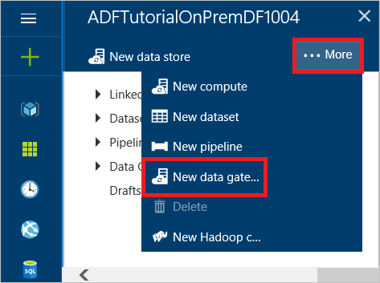
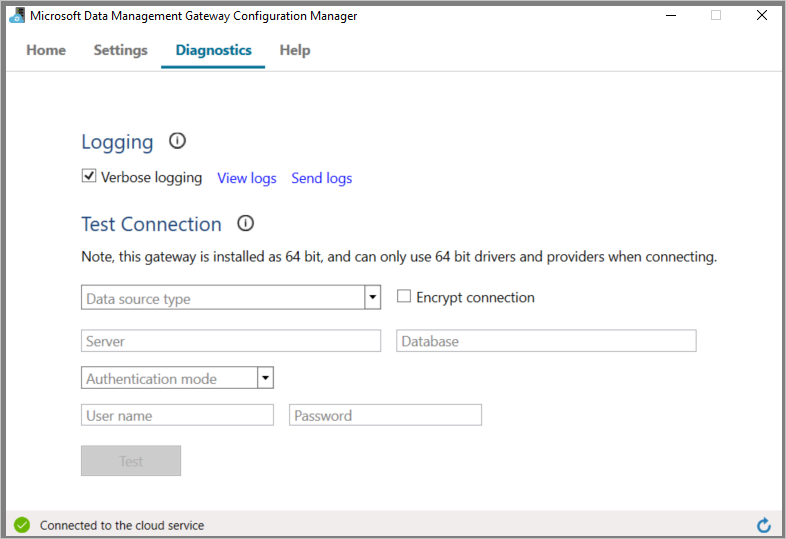
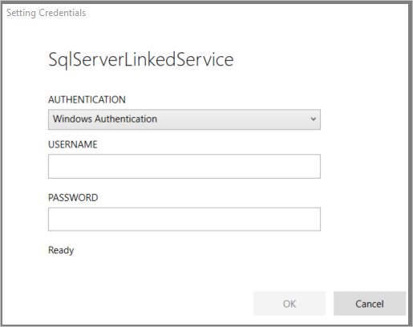
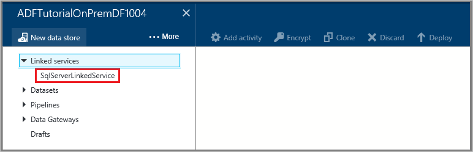
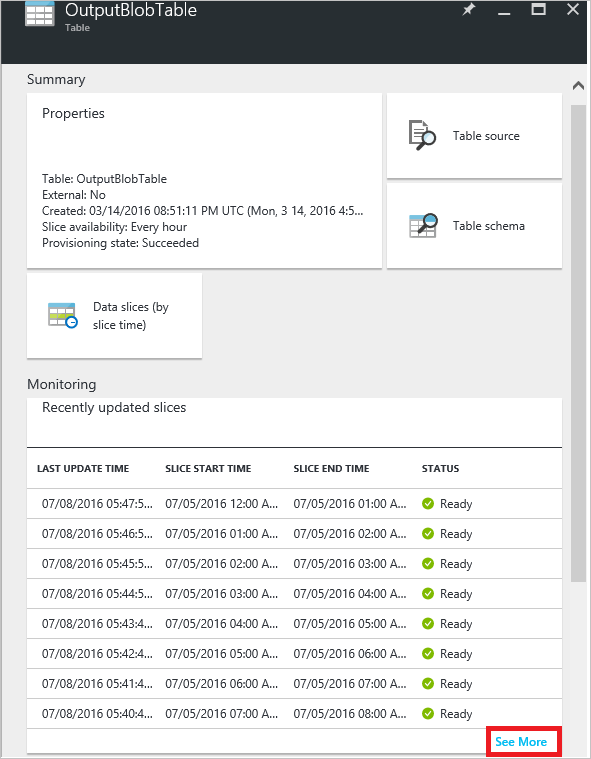

<properties 
    pageTitle="Verschieben von Daten - Datenverwaltungsgateway | Microsoft Azure"
    description="Richten Sie ein datenverwaltungsgateway zum Verschieben von Daten zwischen lokal und in der Cloud. Verwenden Sie Datenverwaltungsgateway in Azure Data Factory, um Ihre Daten zu wechseln." 
    keywords="datenverwaltungsgateway, Datenintegration von, Verschieben von Daten, Gateway-Anmeldeinformationen"
    services="data-factory" 
    documentationCenter="" 
    authors="linda33wj" 
    manager="jhubbard" 
    editor="monicar"/>

<tags 
    ms.service="data-factory" 
    ms.workload="data-services" 
    ms.tgt_pltfrm="na" 
    ms.devlang="na" 
    ms.topic="article" 
    ms.date="10/18/2016" 
    ms.author="jingwang"/>

# Verschieben von Daten zwischen lokalen Quellen und der Cloud mit Datenverwaltungsgateway
Dieser Artikel enthält eine Übersicht der Datenintegration zwischen lokalen Datenspeicher und Cloud Datenspeicher Factory Daten verwenden. Es basiert auf den [Daten Bewegung Aktivitäten](data-factory-data-movement-activities.md) Artikel und weitere Daten Factory Core Konzepte Artikel: [Datasets](data-factory-create-datasets.md) und [Pipelines](data-factory-create-pipelines.md). 

## Datenverwaltungsgateway
Sie müssen auf Ihrem lokalen Computer verschieben von Daten in einer lokalen Datenspeicher aktivieren Datenverwaltungsgateway installieren. Das Gateway kann auf demselben Computer als Datenspeicher oder auf einem anderen Computer installiert werden, solange das Gateway mit dem Datenspeicher herstellen kann. 

> [AZURE.IMPORTANT] [Datenverwaltungsgateway](data-factory-data-management-gateway.md) finden Sie im Artikel Details des Datenverwaltungsgateways.   

Die folgende exemplarische Vorgehensweise wird gezeigt, wie eine Factory Daten mit einer Verkaufspipeline zu erstellen, die Daten aus einer lokalen **SQL Server** -Datenbank zu einer Azure Blob-Speicher verschoben werden kann. Als Teil der exemplarische Vorgehensweise installieren und konfigurieren das Datenverwaltungsgateway auf Ihrem Computer. 

## Exemplarische Vorgehensweise: Kopieren Sie lokaler Daten in die cloud
  
## Erstellen von Daten factory
In diesem Schritt verwenden Sie das Azure-Portal zum Erstellen einer benannten **ADFTutorialOnPremDF**Azure Data Factory-Instanz aus. 

1.  Melden Sie sich mit dem [Azure-Portal](https://portal.azure.com)an. 
2.  Klicken Sie auf **+ neu**, klicken Sie auf **Intelligence + Analytics**, und klicken Sie auf **Daten Factory**.

      
2. Geben Sie in das **neue Daten Factory** Blade **ADFTutorialOnPremDF** für den Namen ein.

    

    > [AZURE.IMPORTANT] 
    > Der Name der Factory Azure-Daten muss global eindeutig sein. Wenn Sie die Fehlermeldung: **Factory Data Source Name "ADFTutorialOnPremDF" ist nicht verfügbar**, ändern Sie den Namen der Factory Daten (z. B. YournameADFTutorialOnPremDF), und versuchen Sie erneut erstellen. Verwenden Sie diesen Namen anstelle von ADFTutorialOnPremDF während der Ausführung der verbleibenden Schritte in diesem Lernprogramm.
    > 
    > Der Name der Factory Daten möglicherweise als einen **DNS-** Namen in der Zukunft und somit werden öffentlich sichtbar registriert sein.
3. Wählen Sie das **Abonnement Azure** , werden die Daten Factory erstellt werden soll. 
4.  Wählen Sie vorhandene **Ressourcengruppe** oder erstellen Sie eine Ressourcengruppe. Erstellen Sie eine Ressourcengruppe mit dem Namen für das Lernprogramm: **ADFTutorialResourceGroup**. 
5.  Klicken Sie auf die **neuen Daten Factory** -Blade auf **Erstellen** .

    > [AZURE.IMPORTANT] Um Daten Factory-Instanzen erstellen zu können, müssen Sie Mitglied der Rolle [Data Factory Mitwirkender](../active-directory/role-based-access-built-in-roles.md/#data-factory-contributor) auf Gruppenebene Abonnement oder einer Ressource sein. 
11. Nach Abschluss der Erstellung wird das Blade **Factory Daten** wie in der folgenden Abbildung dargestellt:

    

## Erstellen des Gateways
5. Klicken Sie in das Blade **Daten Factory** auf **Autor und Bereitstellen** Kachel, um den **Editor** für die Daten Factory zu starten.

     
6.  Klicken Sie in den Daten Factory-Editor auf **... Weitere** auf der Symbolleiste, und klicken Sie dann auf **neue datenverwaltungsgateway**. Alternativ können Sie mit der rechten Maustaste **Gateways Daten** in der Strukturansicht, und klicken Sie auf **neue datenverwaltungsgateway**. 

    
2. Klicken Sie in das Blade **Erstellen** Geben Sie **Adftutorialgateway** für den **Namen**, und klicken Sie auf **OK**.    

    
3. Klicken Sie in das Blade **Konfigurieren** auf **direkt auf diesem Computer installieren**. Diese Aktion downloads des Installationspakets für das Gateway, installiert, konfiguriert und registriert des Gateways auf dem Computer.  

    > [AZURE.NOTE] 
    > Verwenden Sie Internet Explorer oder einen kompatiblen Webbrowser Microsoft ClickOnce.
    > 
    > Wenn Sie Chrome verwenden, wechseln Sie zum [Chrome Web Store](https://chrome.google.com/webstore/), suchen mit "ClickOnce" Schlüsselwort, wählen Sie eine Erweiterung ClickOnce und zu installieren. 
    >  
    > Führen Sie den gleichen für Firefox (installieren-add-in). Klicken Sie auf **Menü öffnen** Schaltfläche auf der Symbolleiste (**drei horizontale Linien** in der oberen rechten Ecke), klicken Sie auf **Add-ons**, mit dem Schlüsselwort "ClickOnce" Suchen Sie, wählen Sie eine Erweiterung ClickOnce, und installieren Sie es.    

    

    Diese Methode ist die einfachste Möglichkeit (ein-Klick) zum Herunterladen, installieren, konfigurieren und in einem einzigen Schritt das Gateway zu registrieren. Sie können sehen, dass die Anwendung **Microsoft Data Management Gateway Konfigurations-Manager** auf dem Computer installiert ist. Sie können auch die ausführbare **ConfigManager.exe** finden Sie in den Ordner: **C:\Programme\Microsoft c:\Programme\Microsoft Daten Management Gateway\2.0\Shared**.

    Sie können auch herunterladen und Gateway manuell installieren, indem Sie über die Links in dieser Blade und registrieren mit der Taste in das Textfeld **Neuen Product KEY** angezeigt.
    
    [Datenverwaltungsgateway](data-factory-data-management-gateway.md) finden Sie im Artikel für alle Details des Gateways.

    >[AZURE.NOTE] Sie müssen ein Administrator auf dem lokalen Computer installieren und konfigurieren das Datenverwaltungsgateway erfolgreich. Sie können die **Daten Management Gateway** lokalen Windows Benutzergruppe weiterer Benutzer hinzufügen. Die Mitglieder dieser Gruppe können das Tool Daten Management Gateway-Konfigurations-Manager verwenden, um das Gateway zu konfigurieren. 

5. Warten Sie ein paar Minuten oder warten Sie, bis Sie die folgende Benachrichtigung angezeigt:

     
6. Starten Sie **Daten Management Gateway-Konfigurations-Manager** -Anwendung auf Ihrem Computer. Geben Sie **das Suchfenster** **Datenverwaltungsgateway** , um dieses Programm zuzugreifen. Sie können auch die ausführbare **ConfigManager.exe** finden Sie in den Ordner: **C:\Programme\Microsoft c:\Programme\Microsoft Daten Management Gateway\2.0\Shared** 

    
6. Bestätigen, dass Sie finden Sie unter `adftutorialgateway is connected to the cloud service` Nachricht. In der Statusleiste unten zeigt zusammen mit einem **grünen Häkchen** **verbunden mit der Cloud-Dienst** an.

    Klicken Sie auf der Registerkarte ' **Start** ' können Sie auch die folgenden Vorgänge ausführen: 
    - **Registrieren Sie sich** ein Gateway mit einem Schlüssel vom Azure-Portal mithilfe der Schaltfläche Register an. 
    - **Beenden** der Daten Management Gateway-Hostdienst auf Ihrem Gatewaycomputer aktiv. 
    - **Planen von Updates** zu einem bestimmten Zeitpunkt des Tages installiert werden. 
    - Anzeigen, wenn das Gateway **zuletzt aktualisiert**wurde.
    - Geben Sie die Uhrzeit, an dem ein Update auf dem Gateway installiert werden kann. 

8. Wechseln Sie zur Registerkarte **Einstellungen** . Das Zertifikat, das im Abschnitt " **Zertifikat** " wird verwendet, um verschlüsseln/Anmeldeinformationen für den lokalen Datenspeicher entschlüsseln, die Sie auf das Portal angeben. (optional) Klicken Sie auf **Ändern** , um Ihr eigenes Zertifikat stattdessen verwenden. Das Gateway verwendet standardmäßig das Zertifikat, das von den Daten Factory-Dienst automatisch generiert wird.

    

    Sie können auch auf der Registerkarte **Einstellungen** die folgenden Aktionen ausführen: 
    - Anzeigen oder das Zertifikat vom Gateway exportieren.
    - Ändern Sie den HTTPS-Endpunkt vom Gateway verwendet.    
    - Legen Sie einen HTTP-Proxy, von dem Gateway verwendet werden soll.   
9. (optional) Wechseln Sie zur Registerkarte **Diagnose** , und aktivieren Sie die Option **ausführliche Protokollierung aktivieren** , wenn ausführliche Protokollierung zu aktivieren, mit denen Sie Probleme mit dem Gateway behandelt, werden sollen. Die protokollierten Informationen finden Sie in der **Ereignisanzeige** unter **Anwendungen und Dienste Protokolle** -> **Datenverwaltungsgateway** -Knoten. 

    

    Sie können auch auf der Registerkarte **Diagnose** die folgenden Aktionen ausführen: 
    
    - Verwenden Sie Abschnitt **Verbindung testen** , um einer lokalen Datenquelle mithilfe des Gateways.
    - Klicken Sie auf **Protokolle anzeigen** , um das Datenverwaltungsgateway-Protokoll in einem Fenster Ereignisanzeige anzuzeigen. 
    - Klicken Sie auf **Senden von Protokollen** , um eine Zip-Datei mit Protokolle der letzten sieben Tage an Microsoft zur Erleichterung Ihrer Probleme Problembehandlung hochladen. 
10. Klicken Sie auf der Registerkarte **Diagnose** im Abschnitt **Verbindung testen** **SqlServer** für die Art von Datenspeicher wählen Sie aus, geben Sie den Namen des Datenbankservers, den Namen der Datenbank, geben Sie Authentifizierungstyp an, geben Sie Benutzername und Kennwort ein, und klicken Sie auf **Testen** , testen, ob das Gateway zu der Datenbank herstellen kann. 
11. Wechseln Sie zum Webbrowser, und klicken Sie im **Portal Azure**, klicken Sie auf das Blade **Konfigurieren** und dann auf das **neue datenverwaltungsgateway** Blade auf **OK** .
6. Klicken Sie unter **Datengateways** **Adftutorialgateway** in der Strukturansicht auf der linken Seite sollte angezeigt werden.  Wenn Sie darauf klicken, sollte die zugeordnete JSON angezeigt werden. 
    

## Erstellen von verknüpften Diensten 
In diesem Schritt erstellen Sie zwei verknüpfte Diensten: **AzureStorageLinkedService** und **SqlServerLinkedService**. Die **SqlServerLinkedService** links einer lokalen SQL Server-Datenbank und Speichern einer Azure Blob **AzureStorageLinkedService** verknüpfte Dienst Verknüpfungen Fabrik Daten. Erstellen Sie eine Verkaufspipeline weiter unten in dieser Anleitung erfahren Sie, die Daten aus lokalen SQL Server-Datenbank im Azure Blob-Speicher kopiert. 

#### Hinzufügen eines verknüpften Diensts zu einer lokalen SQL Server-Datenbank
1.  Klicken Sie in den **Daten Factory-Editor**klicken Sie auf der Symbolleiste auf **neue Daten speichern möchten** , und wählen Sie **SQL Server**. 

     
3.  Führen Sie den **JSON-Editor** auf der rechten Seite die folgenden Schritte aus: 
    1. Geben Sie für die **GatewayName** **Adftutorialgateway**an. 
    2. **ConnectionString**führen Sie die folgenden Schritte aus: 
        1. **Servername**Geben Sie den Namen des Servers, auf dem SQL Server-Datenbank befindet.
        2. Geben Sie für **Datenbankname**den Namen der Datenbank ein.
        3. Klicken Sie auf der Symbolleiste auf die Schaltfläche **Verschlüsseln** . Diese downloads und startet die Anwendung Anmeldeinformationen-Manager.
        
            
        5. Klicken Sie im Dialogfeld **Anmeldeinformationen Einstellung** Geben Sie Authentifizierungstyp, Benutzernamen und Ihr Kennwort ein an, und klicken Sie auf **OK**. Wenn die Verbindung erfolgreich hergestellt wurde, werden die verschlüsselten Anmeldeinformationen in das JSON gespeichert und schließt das Dialogfeld. 
        6. Schließen Sie die leeren Browserregisterkarte, die im Dialogfeld gestartet wird, wenn sie nicht automatisch geschlossen und wieder zur Registerkarte mit dem Portal Azure. 
  
            Auf dem Gatewaycomputer werden diese Anmeldeinformationen **verschlüsselte** mit einem Zertifikat, das der Daten Factory-Dienst besitzt. Wenn Sie möchten das Zertifikat verwenden, das stattdessen das Datenverwaltungsgateway zugeordnet ist, finden Sie unter [Festlegen von Anmeldeinformationen sicher](#set-credentials-and-security).    
    1.  Klicken Sie auf der Befehlsleiste Verknüpfte von SQL Server-Dienst bereitstellen auf **Bereitstellen** . Verknüpften Dienst in der Strukturansicht sollte angezeigt werden. 
        
          

#### Hinzufügen eines verknüpften Diensts für ein Konto Azure-Speicher
 
1. Klicken Sie in den **Daten Factory-Editor**auf **neue Daten speichern möchten** , klicken Sie auf der Befehlsleiste, und klicken Sie auf **Azure-Speicher**.
2. Geben Sie den Namen Ihres Kontos Azure-Speicher für den **Kontonamen**ein.
3. Geben Sie die Taste für Ihr Konto Azure-Speicher für die **kontoschlüssel**ein.
4. Klicken Sie auf **Bereitstellen** , um die **AzureStorageLinkedService**bereitstellen.
   
 
## Datasets erstellen
In diesem Schritt erstellen von Eingabe- und Datasets, die Eingabe- und Daten für den Kopiervorgang darstellen ausgeben (lokalen SQL Server-Datenbank = > Azure Blob-Speicher). Vor dem Erstellen von Datasets, führen Sie die folgenden Schritte aus (resultiert aus der Liste der detaillierten Schritte):

- Erstellen einer Tabelle mit dem Namen **emp** in der SQL Server-Datenbank, die Sie als verknüpfte Service Factory Daten hinzugefügt haben, und fügen Sie ein paar Beispiele für Einträge in der Tabelle.
- Erstellen Sie einen Blob-Container mit dem Namen **Adftutorial** in Azure Blob-Speicher-Konto an, die, das Sie als verknüpfte Dienst die Daten Factory hinzugefügt.

### Vorbereiten der lokalen SQL Server für das Lernprogramm

1. In der Datenbank, die Sie für den lokalen SQL Server angegeben haben verknüpfte Dienst (**SqlServerLinkedService**), das folgende SQL-Skript zum Erstellen der **emp** -Tabelle in der Datenbank verwenden.

        CREATE TABLE dbo.emp
        (
            ID int IDENTITY(1,1) NOT NULL, 
            FirstName varchar(50),
            LastName varchar(50),
            CONSTRAINT PK_emp PRIMARY KEY (ID)
        )
        GO 
2. Einige Beispiele für in die Tabelle einfügen: 

        INSERT INTO emp VALUES ('John', 'Doe')
        INSERT INTO emp VALUES ('Jane', 'Doe')

### Erstellen von dataset

1. Klicken Sie in den **Daten Factory-Editor** **auf... Weitere**, klicken Sie auf der Befehlsleiste auf **Neues Dataset** , und klicken Sie auf **SQL Server-Tabelle**. 
2.  Ersetzen Sie die JSON im rechten Bereich mit den folgenden Text ein:
        
            {       
                "name": "EmpOnPremSQLTable",
                "properties": {
                    "type": "SqlServerTable",
                    "linkedServiceName": "SqlServerLinkedService",
                    "typeProperties": {
                        "tableName": "emp"
                    },
                    "external": true,
                    "availability": {
                        "frequency": "Hour",
                        "interval": 1
                    },
                    "policy": {
                        "externalData": {
                            "retryInterval": "00:01:00",
                            "retryTimeout": "00:10:00",
                            "maximumRetry": 3
                        }
                    }
                }
            }    

    Beachten Sie die folgenden Punkte: 

    - **Typ** wird auf **SqlServerTable**festgelegt.
    - **Tabellenname** ist **emp**festgelegt.
    - **LinkedServiceName** wird auf **SqlServerLinkedService** festgelegt (Sie hatten diesen Dienst verknüpften weiter oben in dieser Anleitung erfahren erstellt.).
    - Für eine Eingabe-Dataset, die nicht von einem anderen Verkaufspipeline in Azure Data Factory generiert wird, müssen Sie **externe** auf **true**festlegen. Es gibt an, dass die Eingabedaten außerhalb der Azure-Daten Factory-Dienst erstellt werden. Optional können Sie eine beliebige externe Daten-Richtlinien mithilfe des **ExternalData** -Elements im Abschnitt **Richtlinie** angeben.    

    Details zu JSON-Eigenschaften finden Sie unter [Verschieben von Daten in SQL Server](data-factory-sqlserver-connector.md) .
2. Klicken Sie auf der Befehlsleiste Dataset bereitstellen auf **Bereitstellen** .  

### Die Ausgabe Dataset erstellen

1.  Klicken Sie in den **Daten Factory-Editor**auf der Befehlsleiste auf **Neues Dataset** , und klicken Sie auf **Azure Blob-Speicher**.
2.  Ersetzen Sie die JSON im rechten Bereich mit den folgenden Text ein: 

            {
                "name": "OutputBlobTable",
                "properties": {
                    "type": "AzureBlob",
                    "linkedServiceName": "AzureStorageLinkedService",
                    "typeProperties": {
                        "folderPath": "adftutorial/outfromonpremdf",
                        "format": {
                            "type": "TextFormat",
                            "columnDelimiter": ","
                        }
                    },
                    "availability": {
                        "frequency": "Hour",
                        "interval": 1
                    }
                }
            }
  
    Beachten Sie die folgenden Punkte: 
    
    - **Typ** wird auf **AzureBlob**festgelegt.
    - **LinkedServiceName** wird auf **AzureStorageLinkedService** festgelegt (Sie hatten diesen Dienst verknüpfte in Schritt2 erstellt haben).
    - **Ordnerpfad** ist zu **Adftutorial/Outfromonpremdf** festgelegt, wobei Outfromonpremdf den Ordner im Container Adftutorial. Erstellen Sie den Container **Adftutorial** aus, wenn es nicht bereits vorhanden ist. 
    - Die **Verfügbarkeit** wird **stündlich** (**Häufigkeit** auf **Hour** festgelegten und **Intervall** auf **1**festgelegt) festgelegt.  Der Dienst Daten Factory generiert ein Ausgabe Daten Segments stündlich in der Tabelle **emp** Azure SQL-Datenbank. 

    Wenn Sie einen **Dateinamen** für eine **Ausgabetabelle**nicht angeben, werden die generierten Dateien in den **Ordnerpfad** im folgenden Format benannt: Daten. <Guid>txt (zum Beispiel:: Data.0a405f8a-93ff-4c6f-b3be-f69616f1df7a.txt.).

    Um **Ordnerpfad** und **Dateiname** dynamisch basierend auf der Uhrzeit **SliceStart** festzulegen, verwenden Sie die Eigenschaft PartitionedBy ein. Im folgenden Beispiel Ordnerpfad verwendet Jahr, Monat und Tag aus der SliceStart (Startzeit für das Segment des verarbeiteten) und FileName verwendet Stunde aus der SliceStart. Wenn Sie ein Segment für 2014 gefertigt wird beispielsweise-10-20T08:00:00, der Ordnername auf Wikidatagateway/Wikisampledataout/2014/10/20 festgelegt ist und der Dateinamen auf 08.csv festgelegt ist. 

        "folderPath": "wikidatagateway/wikisampledataout/{Year}/{Month}/{Day}",
        "fileName": "{Hour}.csv",
        "partitionedBy": 
        [
            { "name": "Year", "value": { "type": "DateTime", "date": "SliceStart", "format": "yyyy" } },
            { "name": "Month", "value": { "type": "DateTime", "date": "SliceStart", "format": "MM" } }, 
            { "name": "Day", "value": { "type": "DateTime", "date": "SliceStart", "format": "dd" } }, 
            { "name": "Hour", "value": { "type": "DateTime", "date": "SliceStart", "format": "hh" } } 
        ],

 
    Details zu JSON-Eigenschaften finden Sie unter [Verschieben von Daten zu/aus Azure BLOB-Speicher](data-factory-azure-blob-connector.md) .
2.  Klicken Sie auf der Befehlsleiste Dataset bereitstellen auf **Bereitstellen** . Bestätigen Sie, dass Sie sowohl die Datasets in der Strukturansicht angezeigt.  

## Erstellen der Verkaufspipeline
In diesem Schritt erstellen Sie eine **Verkaufspipeline** mit einer **Kopie Aktivitäten** , die **EmpOnPremSQLTable** als Eingabe verwendet und **OutputBlobTable** in der Ausgabe.

1.  Daten Factory-Editor, klicken Sie auf **... Weitere**, und klicken Sie auf **neue Verkaufspipeline**. 
2.  Ersetzen Sie die JSON im rechten Bereich mit den folgenden Text ein: 
    
            {
                "name": "ADFTutorialPipelineOnPrem",
                "properties": {
                "description": "This pipeline has one Copy activity that copies data from an on-prem SQL to Azure blob",
                "activities": [
                {
                    "name": "CopyFromSQLtoBlob",
                    "description": "Copy data from on-prem SQL server to blob",
                    "type": "Copy",
                    "inputs": [
                    {
                        "name": "EmpOnPremSQLTable"
                    }
                    ],
                    "outputs": [
                    {
                        "name": "OutputBlobTable"
                      }
                    ],
                    "typeProperties": {
                      "source": {
                        "type": "SqlSource",
                        "sqlReaderQuery": "select * from emp"
                      },
                      "sink": {
                        "type": "BlobSink"
                      }
                    },
                    "Policy": {
                      "concurrency": 1,
                      "executionPriorityOrder": "NewestFirst",
                      "style": "StartOfInterval",
                      "retry": 0,
                      "timeout": "01:00:00"
                    }
                  }
                ],
                "start": "2016-07-05T00:00:00Z",
                "end": "2016-07-06T00:00:00Z",
                "isPaused": false
              }
            }

    > [AZURE.IMPORTANT]
    > Ersetzen Sie den Wert der Eigenschaft **beginnen Sie** mit dem aktuellen Tag und die **Endzeit** der Wert mit dem nächsten Tag.

    Beachten Sie die folgenden Punkte:
 
    - Im Abschnitt Aktivitäten gibt es nur die Aktivität zu **Kopieren**, deren **Typ** festgelegt ist.
    - **Eingabe** für die Aktivität auf **EmpOnPremSQLTable** festgelegt ist, und **die Ausgabe** für die Aktivität auf **OutputBlobTable**festgelegt ist.
    - Im Abschnitt **TypeProperties** **SQLSource aus** den **Quellentyp** angegeben ist, und **BlobSink **als die **Empfänger**angegeben ist.
    - SQL-Abfrage `select * from emp` für die Eigenschaft **SqlReaderQuery** **SQLSource aus**angegeben ist.

     Beide starten und beenden Zeiteingabe muss im [ISO-Format](http://en.wikipedia.org/wiki/ISO_8601). Beispiel: 2014-10-14T16:32:41Z. **Die Endzeit** ist optional, aber wir in diesem Lernprogramm verwenden. 
    
    Wenn Sie keinen Wert für die Eigenschaft **Ende** angeben, wird es als "**Start + 48 Stunden**" berechnet. Wenn der Verkaufspipeline endlos ausführen möchten, geben Sie als Wert für die Eigenschaft **Ende** **9/9/9999** an. 
    
    Sie definieren die Dauer auf Grundlage der **Verfügbarkeit von** Eigenschaften, die für jedes Dataset Azure Data Factory definiert wurden, in der die Datensegmente verarbeitet werden.
    
    Im Beispiel werden 24 Datensegmente wie jedes Segment Daten stündlich erstellt wird.     
2. Klicken Sie auf **Bereitstellen** auf der Befehlsleiste Dataset bereitstellen (Tabelle ist ein rechteckiges Dataset). Bestätigen Sie, dass der Verkaufspipeline in der Strukturansicht unter **Pipelines** Knoten angezeigt.  
5. Klicken Sie nun auf **X** zweimal, um die Blades wieder an die **Daten Factory** Blade für die **ADFTutorialOnPremDF**abrufen zu schließen.

**Herzlichen Glückwunsch!** Sie haben erfolgreich erstellt eine Fabrik Azure-Daten, verknüpften Diensten, Datasets und eine Verkaufspipeline und der Verkaufspipeline geplant.

#### Anzeigen der Factory Daten in einer Ansicht des Diagramms 
1. Klicken Sie im **Portal Azure**- **Diagramm** -Kachel auf der Homepage für die **ADFTutorialOnPremDF** Daten Factory auf. :

    

2. Das Diagramm ähnlich wie die folgende Abbildung sollte angezeigt werden:

    

    Sie können vergrößern, verkleinern, Vergrößern auf 100 %, Zoom passt, automatisch positionieren Pipelines und Datasets und Anzeigen von Informationen über die Datenherkunft (hervorgehoben übergeordneten und untergeordneten Elemente der ausgewählten Elemente).  Sie können ein Objekt (/ Ausgang Dataset oder Verkaufspipeline) Eigenschaften dafür finden Sie unter doppelklicken. 

## Monitor Verkaufspipeline
In diesem Schritt verwenden Sie das Azure-Portal zum Überwachen der Aktivitäten in einer Factory Azure-Daten in ein. PowerShell-Cmdlets können Sie auch Datasets und Rohrleitungen überwachen. Details zum Überwachen finden Sie unter [Überwachen und Verwalten von Pipelines](data-factory-monitor-manage-pipelines.md).

5. Doppelklicken Sie auf das Diagramm **EmpOnPremSQLTable**.  

    

6. Beachten Sie, dass alle Daten von slices Zustand **bereit** sind, da der Verkaufspipeline Dauer (Anfangszeit und Endzeit) in der Vergangenheit liegt. Es ist auch auf, da Sie die Daten in der SQL Server-Datenbank eingefügt haben und es es immer ist. Bestätigen Sie, dass keine Segmente im Abschnitt **Problem Segmente** unten angezeigt. Um alle Segmente anzeigen möchten, klicken Sie auf **Weitere finden Sie** am Ende der Liste der Segmente. 
7. Klicken Sie nun In das Blade **Datasets** auf **OutputBlobTable**.

    
9. Klicken Sie auf ein beliebiges Segment Daten aus der Liste aus, und Sie das **Segment Daten** Blade auftreten. Sie sehen, dass die Aktivität für das Segment ausgeführt wird. Sie sehen nur eine Aktivität in der Regel ausgeführt.  

    

    Wenn das Segment nicht im Zustand **bereit** ist, können Sie Segmente des übergeordneten angezeigt, die nicht bereit sind und das aktuelle Segment von in der Liste **übergeordneten Segmente, die nicht bereit sind,** ausgeführt werden blockieren.

10. Klicken Sie auf die **Aktivität ausführen** aus der Liste unten, um die **Aktivität ausführen Details**finden Sie unter.

    

    Sie möchten finden Sie unter Informationen wie Durchsatz, Dauer und das Gateway verwendet, um die Daten zu übertragen. 
11. Klicken Sie auf **X** , um alle Blades, bis Sie zu schließen. 
12. zurückkehren Sie zur das home Blade für die **ADFTutorialOnPremDF**.
14. (optional) Klicken Sie auf **Pipelines**auf **ADFTutorialOnPremDF**, und Drillthrough-Eingabewerte Tabellen (**verbraucht**) oder Ausgabe Datasets (**produziert**).
15. Mit Tools wie z. B. Tools verwenden, wie etwa [Microsoft Speicher-Explorer](http://storageexplorer.com/) zum Überprüfen, ob eine Blob-Datei für jede Stunde erstellt wird.

    

## Nächste Schritte

- [Datenverwaltungsgateway](data-factory-data-management-gateway.md) finden Sie im Artikel für alle Details über das Datenverwaltungsgateway.
- Finden Sie unter [Kopieren von Daten aus Azure Blob zu SQL Azure](data-factory-copy-data-from-azure-blob-storage-to-sql-database.md) Weitere Informationen zum Kopieren Aktivität zum Verschieben von Daten aus einem Datenspeicher Quelle zu einem Empfänger Datenspeicher verwenden. 
