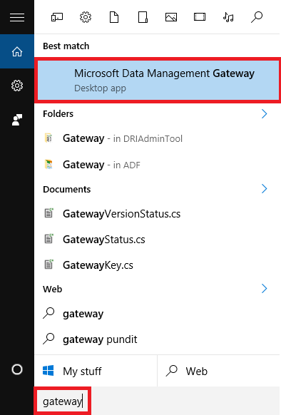
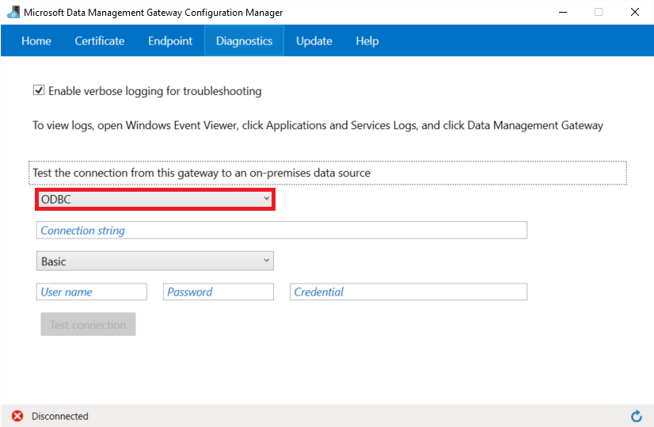

<properties 
    pageTitle="Verschieben von Daten aus ODBC-Datenspeicher | Factory Azure-Daten" 
    description="Informationen Sie zum Verschieben von Daten aus ODBC-Datenspeicher Azure Data Factory verwenden." 
    services="data-factory" 
    documentationCenter="" 
    authors="linda33wj" 
    manager="jhubbard" 
    editor="monicar"/>

<tags 
    ms.service="data-factory" 
    ms.workload="data-services" 
    ms.tgt_pltfrm="na" 
    ms.devlang="na" 
    ms.topic="article" 
    ms.date="09/12/2016" 
    ms.author="jingwang"/>

# Verschieben von Daten aus ODBC-Datenspeicher Azure Data Factory verwenden
In diesem Artikel wird beschrieben, wie Sie die Aktivität kopieren in einer Factory Azure-Daten zum Verschieben von Daten aus einem lokalen ODBC-Datenspeicher zu einem anderen Datenspeicher verwenden können. In diesem Artikel wird im Artikel [Daten Bewegung Aktivitäten](data-factory-data-movement-activities.md) , die eine allgemeine Übersicht über das Verschieben von Daten mit Aktivität kopieren und unterstützten Data Store Kombinationen bietet erstellt.

Daten Factory unterstützt derzeit nur verschieben Daten aus einem lokalen ODBC-Datenspeicher andere Datenspeicher. Verschieben von Daten aus anderen Datenspeicher in einen lokalen ODBC-Datenspeicher werden nicht unterstützt.

## Aktivieren der Konnektivität
Factory Datendienst unterstützt das Herstellen einer Verbindung mit einer lokalen ODBC-Datenquellen das Datenverwaltungsgateway verwenden. Finden Sie unter [Verschieben von Daten zwischen lokalen Orten und Cloud](data-factory-move-data-between-onprem-and-cloud.md) Artikel lernen Datenverwaltungsgateway und eine schrittweise Anleitung zum Einrichten des Gateways. Verwenden des Gateways Verbindung zu einer ODBC-Datenspeicher, auch wenn es eine Neuerung Azure gehostet wird. 

Sie können das Gateway als ODBC-Datenspeicher auf demselben lokalen Computer oder den Azure-virtuellen Computer installieren. Allerdings empfiehlt es sich, dass die Installation des Gateways auf einem separaten Computer/Azure IaaS virtueller Computer zu vermeiden und für eine bessere Leistung. Bei der Installation des Gateways auf einem separaten Computer sollten der Computer auf den Computer mit dem ODBC-Datenspeicher zugreifen. 

Neben das Datenverwaltungsgateway müssen Sie auch den ODBC-Treiber für den Datenspeicher auf dem Gatewaycomputer installieren. 

> [AZURE.NOTE] Finden Sie unter [Behandeln von Gateway Probleme](data-factory-data-management-gateway.md#troubleshoot-gateway-issues) Tipps zur Behebung von Verbindung/Gateway zusammenhängende Probleme. 

## Assistent zum Kopieren von Daten
Die einfachste Möglichkeit, eine Verkaufspipeline zu erstellen, die Daten aus einer ODBC-Datenquelle kopiert besteht darin, den Assistenten zum Kopieren von Daten verwenden. Finden Sie unter [Lernprogramm: Erstellen einer Verkaufspipeline mithilfe des Assistenten zum Kopieren von](data-factory-copy-data-wizard-tutorial.md) für eine schnelle Exemplarische Vorgehensweise zum Erstellen einer Verkaufspipeline mithilfe des Assistenten zum Kopieren von Daten. 

In den folgenden Beispielen bieten Stichprobe JSON-Definitionen, mit denen Sie eine Verkaufspipeline mithilfe von [Azure-Portal](data-factory-copy-activity-tutorial-using-azure-portal.md) oder [Visual Studio](data-factory-copy-activity-tutorial-using-visual-studio.md) oder [Azure PowerShell](data-factory-copy-activity-tutorial-using-powershell.md)erstellen. Wird gezeigt, wie Daten aus einer ODBC-Datenquelle in eine Azure BLOB-Speicher zu kopieren. Daten können jedoch an die senken angegebener [So](data-factory-data-movement-activities.md#supported-data-stores) verwenden die Aktivität kopieren in Azure Data Factory kopiert werden.

## Beispiel: Kopieren Sie Daten aus ODBC-Datenspeicher in Azure Blob

Dieses Beispiel zeigt, wie Sie Daten aus einem ODBC-Datenspeicher in Azure BLOB-Speicher zu kopieren. Daten kann jedoch kopierten **direkt** an die senken angegebener [hier](data-factory-data-movement-activities.md#supported-data-stores) die Aktivität kopieren in Azure Data Factory verwenden.  
 
Im Beispiel weist die folgenden Daten Factory Elemente:

1.  Eine verknüpfte Dienst vom Typ [OnPremisesOdbc](#odbc-linked-service-properties).
2.  Eine verknüpfte Dienst vom Typ [AzureStorage](data-factory-azure-blob-connector.md#azure-storage-linked-service-properties).
3.  Eine Eingabe- [Dataset](data-factory-create-datasets.md) vom Typ [RelationalTable](#odbc-dataset-type-properties).
4.  Eine Ausgabe [Dataset](data-factory-create-datasets.md) vom Typ [AzureBlob](data-factory-azure-blob-connector.md#azure-blob-dataset-type-properties).
4.  Eine [Verkaufspipeline](data-factory-create-pipelines.md) mit Aktivität kopieren, die [RelationalSource](#odbc-copy-activity-type-properties) und [BlobSink](data-factory-azure-blob-connector.md#azure-blob-copy-activity-type-properties)verwendet.

Im Beispiel kopiert Daten aus einem Abfrageergebnis in eine ODBC-Datenquelle in eine Blob stündlich. Die JSON-Eigenschaften, die in diesen Beispielen verwendete werden in den Beispielen folgen Abschnitten beschrieben. 

Richten Sie als ersten Schritt das datenverwaltungsgateway aus. Die Hinweise finden Sie im Artikel [Verschieben von Daten zwischen lokalen Orten und Cloud](data-factory-move-data-between-onprem-and-cloud.md) . 

**ODBC verknüpft service** In diesem Beispiel wird die Standardauthentifizierung. Finden Sie unter [ODBC verknüpft Dienst](#odbc-linked-service-properties) Abschnitt für unterschiedliche Arten von Authentifizierung, die Sie verwenden können. 

    {
        "name": "OnPremOdbcLinkedService",
        "properties":
        {
            "type": "OnPremisesOdbc",
            "typeProperties":
            {
                "authenticationType": "Basic",
                "connectionString": "Driver={SQL Server};Server=Server.database.windows.net; Database=TestDatabase;",
                "userName": "username",
                "password": "password",
                "gatewayName": "mygateway"
            }
        }
    }

**Azure verknüpft Speicherdienst**

    {
      "name": "AzureStorageLinkedService",
      "properties": {
        "type": "AzureStorage",
        "typeProperties": {
          "connectionString": "DefaultEndpointsProtocol=https;AccountName=<accountname>;AccountKey=<accountkey>"
        }
      }
    }

**Eingabe ODBC-dataset**

Das Beispiel wird vorausgesetzt, Sie eine Tabelle "MyTable" in einer ODBC-Datenbank erstellt haben und sie eine Spalte mit der Bezeichnung "Timestampcolumn" für die Reihe Uhrzeitdaten enthält.

Festlegen von "externe": "true" werden dem Daten Factory-Dienst informiert, dass das Dataset externe Daten Fabrik Wert und nicht durch eine Aktivität in der Factory Daten erstellt wird.
    
    {
        "name": "ODBCDataSet",
        "properties": {
            "published": false,
            "type": "RelationalTable",
            "linkedServiceName": "OnPremOdbcLinkedService",
            "typeProperties": {},
            "availability": {
                "frequency": "Hour",
                "interval": 1
            },
            "external": true,
            "policy": {
                "externalData": {
                    "retryInterval": "00:01:00",
                    "retryTimeout": "00:10:00",
                    "maximumRetry": 3
                }
            }
        }
    }

**Azure Blob ausgeben dataset**

Jede Stunde Daten in einer neuen Blob geschrieben (Häufigkeit: Stunde, Intervall: 1). Pfad des Ordners für das Blob wird dynamisch ausgewertet basierend auf der Startzeit des Segments, die verarbeitet wird. Der Pfad des verwendet Jahr, Monat, Tag und Stunden Teile der Startzeit.

    {
        "name": "AzureBlobOdbcDataSet",
        "properties": {
            "type": "AzureBlob",
            "linkedServiceName": "AzureStorageLinkedService",
            "typeProperties": {
                "folderPath": "mycontainer/odbc/yearno={Year}/monthno={Month}/dayno={Day}/hourno={Hour}",
                "format": {
                    "type": "TextFormat",
                    "rowDelimiter": "\n",
                    "columnDelimiter": "\t"
                },
                "partitionedBy": [
                    {
                        "name": "Year",
                        "value": {
                            "type": "DateTime",
                            "date": "SliceStart",
                            "format": "yyyy"
                        }
                    },
                    {
                        "name": "Month",
                        "value": {
                            "type": "DateTime",
                            "date": "SliceStart",
                            "format": "MM"
                        }
                    },
                    {
                        "name": "Day",
                        "value": {
                            "type": "DateTime",
                            "date": "SliceStart",
                            "format": "dd"
                        }
                    },
                    {
                        "name": "Hour",
                        "value": {
                            "type": "DateTime",
                            "date": "SliceStart",
                            "format": "HH"
                        }
                    }
                ]
            },
            "availability": {
                "frequency": "Hour",
                "interval": 1
            }
        }
    }

**Pipeline mit Aktivität kopieren**

Der Verkaufspipeline enthält eine Kopie-Aktivität, ist so konfiguriert, dass diese Eingabe- und Datasets verwenden und stündlich Ausführung geplant ist. Klicken Sie in der Verkaufspipeline JSON-Definition der Typ der **Quelle** auf **RelationalSource** festgelegt ist, und Typ der **Empfänger** auf **BlobSink**festgelegt ist. Die SQL-Abfrage für die Eigenschaft **Abfrage** angegebenen wählt die Daten in der letzten Stunde zu kopieren.
    
    {
        "name": "CopyODBCToBlob",
        "properties": {
            "description": "pipeline for copy activity",
            "activities": [
                {
                    "type": "Copy",
                    "typeProperties": {
                        "source": {
                            "type": "RelationalSource",
                            "query": "$$Text.Format('select * from MyTable where timestamp >= \\'{0:yyyy-MM-ddTHH:mm:ss}\\' AND timestamp < \\'{1:yyyy-MM-ddTHH:mm:ss}\\'', WindowStart, WindowEnd)"
                        },
                        "sink": {
                            "type": "BlobSink",
                            "writeBatchSize": 0,
                            "writeBatchTimeout": "00:00:00"
                        }
                    },
                    "inputs": [
                        {
                            "name": "OdbcDataSet"
                        }
                    ],
                    "outputs": [
                        {
                            "name": "AzureBlobOdbcDataSet"
                        }
                    ],
                    "policy": {
                        "timeout": "01:00:00",
                        "concurrency": 1
                    },
                    "scheduler": {
                        "frequency": "Hour",
                        "interval": 1
                    },
                    "name": "OdbcToBlob"
                }
            ],
            "start": "2014-06-01T18:00:00Z",
            "end": "2014-06-01T19:00:00Z"
        }
    }

## Eigenschaften von verknüpften ODBC-Dienst

Die folgende Tabelle enthält eine Beschreibung für den JSON-Elemente ODBC-spezifischen Dienst verknüpft.

| Eigenschaft | Beschreibung | Erforderlich |
| -------- | ----------- | -------- | 
| Typ | Die Eigenschaft muss auf festgelegt sein: **OnPremisesOdbc** | Ja |
| connectionString | Anmeldeinformationen nicht Access, Teil der Verbindungszeichenfolge und eine optionale verschlüsselte Anmeldeinformationen. Beispiele für in den folgenden Abschnitten. | Ja
| Anmeldeinformationen | Der Zugriff Anmeldeinformationen Teil der Verbindungszeichenfolge angegebenen Eigenschaftswert Treiber-spezifischen Format. Beispiel: "Uid =<user ID>; PWD =<password>; RefreshToken =<secret refresh token>; ". | Nein
| authenticationType | Art der Authentifizierung, die Verbindung mit dem ODBC-Datenspeicher verwendet. Mögliche Werte sind: anonyme und. | Ja | 
| Benutzername | Geben Sie Benutzernamen an, wenn Sie Standardauthentifizierung verwenden. | Nein | 
| Kennwort | Geben Sie das Kennwort für das Benutzerkonto, das Sie für den Benutzernamen angegeben haben. | Nein | 
| gatewayName | Name des Gateways, das der Daten Factory-Dienst in den Datenspeicher ODBC-Verbindung verwendet werden sollen. | Ja |

Finden Sie unter [Festlegen der Anmeldeinformationen und Sicherheit](data-factory-move-data-between-onprem-and-cloud.md#set-credentials-and-security) ausführliche Informationen zum Festlegen von Anmeldeinformationen für eine lokale ODBC-Daten zu speichern.

### Mithilfe der Standardauthentifizierung

    {
        "name": "odbc",
        "properties":
        {
            "type": "OnPremisesOdbc",
            "typeProperties":
            {
                "authenticationType": "Basic",
                "connectionString": "Driver={SQL Server};Server=Server.database.windows.net; Database=TestDatabase;",
                "userName": "username",
                "password": "password",
                "gatewayName": "mygateway"
            }
        }
    }

### Mithilfe der Standardauthentifizierung mit verschlüsselten Anmeldeinformationen
Sie können die Anmeldeinformationen mithilfe der [Neu-AzureRMDataFactoryEncryptValue](https://msdn.microsoft.com/library/mt603802.aspx) (Version 1.0 von Azure PowerShell) Cmdlet oder [Neu-AzureDataFactoryEncryptValue](https://msdn.microsoft.com/library/dn834940.aspx) (0,9 oder eine frühere Version des Azure PowerShell) verschlüsseln.  

    {
        "name": "odbc",
        "properties":
        {
            "type": "OnPremisesOdbc",
            "typeProperties":
            {
                "authenticationType": "Basic",
                "connectionString": "Driver={SQL Server};Server=myserver.database.windows.net; Database=TestDatabase;;EncryptedCredential=eyJDb25uZWN0...........................",
                "gatewayName": "mygateway"
            }
        }
    }

### Anonyme Authentifizierung

    {
        "name": "odbc",
        "properties":
        {
            "type": "OnPremisesOdbc",
            "typeProperties":
            {
                "authenticationType": "Anonymous",
                "connectionString": "Driver={SQL Server};Server={servername}.database.windows.net; Database=TestDatabase;",
                "credential": "UID={uid};PWD={pwd}",
                "gatewayName": "mygateway"
            }
        }
    }

## ODBC-Typ Datensatzeigenschaften

Eine vollständige Liste der Abschnitte und Eigenschaften, die zum Definieren von Datasets zur Verfügung finden Sie im Artikel [Datasets erstellen](data-factory-create-datasets.md) . Abschnitte wie Struktur, Verfügbarkeit und Richtlinie eines Datasets JSON ähneln für alle Dataset-Typen (Azure SQL Azure Blob, Azure Table usw..).

Im Abschnitt **TypeProperties** unterscheidet sich für jede Art von Dataset und enthält Informationen über den Speicherort der Daten im Datenspeicher. Im Abschnitt TypeProperties für Dataset vom Typ **RelationalTable** (enthält ODBC-Dataset) weist die folgenden Eigenschaften

| Eigenschaft | Beschreibung | Erforderlich |
| -------- | ----------- | -------- |
| Tabellenname | Name der Tabelle in der ODBC-Datenquelle. | Ja | 

## ODBC-Kopie Aktivitäten Schrifteigenschaften

Eine vollständige Liste der Abschnitte und Eigenschaften zum Definieren von Aktivitäten verfügbar sind finden Sie unter Artikel [Pipelines erstellen](data-factory-create-pipelines.md) . Eigenschaften wie Name, Beschreibung, Eingabe- und Tabellen und Richtlinien zur Verfügung stehen für alle Arten von Aktivitäten. 

Im Abschnitt **TypeProperties** der Aktivität verfügbaren Eigenschaften variieren andererseits bei jeder Aktivität. Aktivitäten, kopieren variieren je nach den Typen von Datenquellen und senken.

In Aktivität kopieren Wenn Quelle ist vom Typ **RelationalSource** (enthält ODBC), stehen die folgenden Eigenschaften im Abschnitt TypeProperties:

| Eigenschaft | Beschreibung | Zulässigen Werte | Erforderlich |
| -------- | ----------- | -------------- | -------- |
| Abfrage | Verwenden Sie die benutzerdefinierte Abfrage, um Daten zu lesen. | SQL-Abfragezeichenfolge. Beispiel: Wählen Sie * from MyTable. | Ja | 

[AZURE.INCLUDE [data-factory-structure-for-rectangualr-datasets](../../includes/data-factory-structure-for-rectangualr-datasets.md)]

### Für ODBC-Zuordnung

Wie in den [Daten Bewegung Aktivitäten](data-factory-data-movement-activities.md) Artikel erwähnt, führt kopieren Aktivität automatische Konvertieren des Datentyps von Arten von Datenquellen zu Typen mit den folgenden zwei Ansatz ignorieren:

1. Konvertieren von Datentypen systemeigenen Quelle in .NET Typ
2. Konvertieren von .NET Typ in einer systemeigenen Empfänger Typ

Beim Verschieben von Daten aus ODBC-Daten gespeichert werden, werden in .NET Dateitypen wie im Thema [ODBC-Datentyp Zuordnungen](https://msdn.microsoft.com/library/cc668763.aspx) erwähnt ODBC-Datentypen zugeordnet.

[AZURE.INCLUDE [data-factory-column-mapping](../../includes/data-factory-column-mapping.md)]

[AZURE.INCLUDE [data-factory-type-repeatability-for-relational-sources](../../includes/data-factory-type-repeatability-for-relational-sources.md)]

## Seite Historian store
Sie erstellen ein verknüpft ODBC-Diensts zum Verknüpfen von eines [Seite Proficy Historian (jetzt Seite Historian)](http://www.geautomation.com/products/proficy-historian) Datenspeichers mit einer Factory Azure-Daten, wie im folgenden Beispiel gezeigt: 

    {
        "name": "HistorianLinkedService",
        "properties":
        {
            "type": "OnPremisesOdbc",
            "typeProperties":
            {
                "connectionString": "DSN=<name of the GE Historian store>",
                "gatewayName": "<gateway name>",
                "authenticationType": "Basic",
                "userName": "<user name>",
                "password": "<password>"
            }
        }
    }

Datenverwaltungsgateway auf einem lokalen Computer installieren und mit dem Portal das Gateway zu registrieren. Des Gateways auf dem lokalen Computer installierten verwendet den ODBC-Treiber für Seite Historian Verbindung zu der Seite Historian Datenspeicher. Installieren Sie den Treiber daher, wenn es nicht bereits auf dem Gatewaycomputer installiert ist. Siehe Abschnitt " [Aktivieren Connectivity](#enabling-connectivity) " Details.

Bevor Sie den Seite Historian Store in eine Lösung Daten Factory verwenden, stellen Sie sicher, ob das Gateway mit dem Datenspeicher anhand der Anweisungen im nächsten Abschnitt herstellen kann. 

Hierzu finden Sie im Artikel vom Anfang für einen detaillierten Überblick der Verwendung von ODBC-Daten als Quelle Datenspeicher in einem Kopiervorgang speichert.  

## Behandeln von Verbindungsproblemen
Verwenden Sie zum Behandeln von Problemen mit der Verbindung mit der Registerkarte **Diagnose** **Daten Management Gateway-Konfigurations-Manager**aus. 

1. **Daten Management Gateway-Konfigurations-Manager**zu starten. Sie können entweder ausführen "C:\Programme c:\Programme\Microsoft Daten Management Gateway\1.0\Shared\ConfigManager.exe" direkt (oder) suchen für **Gateway** , um einen Link zu **Microsoft Datenverwaltungsgateway** -Anwendung zu ermitteln, wie in der folgenden Abbildung gezeigt. 

    
2. Wechseln Sie zur Registerkarte **Diagnose** .

     
3. Wählen Sie den **Typ** von Datenspeicher (verknüpfte Service) aus. 
4. Geben Sie der **Authentifizierung an** und geben Sie **Anmeldeinformationen** (oder) Geben Sie die **Verbindungszeichenfolge** , die Verbindung mit dem Datenspeicher verwendet wird. 
5. Klicken Sie auf **Verbindung testen** klicken Sie zum Testen der Verbindungs mit dem Datenspeicher. 

## Leistung und optimieren  
Finden Sie unter [Kopieren Aktivität Leistung und Optimieren von Leitfaden für](data-factory-copy-activity-performance.md) die Leistung Einfluss der Daten Bewegung (Kopieren Aktivität) in Azure Data Factory und verschiedene Methoden zum Optimieren sie wichtige Faktoren lernen.

