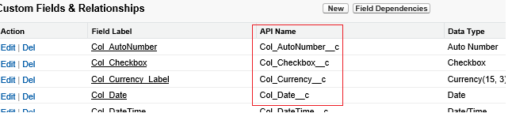

<properties
    pageTitle="Verschieben von Daten aus Vertrieb mithilfe von Daten Factory | Microsoft Azure"
    description="Informationen Sie zum Verschieben von Daten mithilfe von Azure Data Factory aus Vertrieb."
    services="data-factory"
    documentationCenter=""
    authors="linda33wj"
    manager="jhubbard"
    editor="monicar"/>

<tags
    ms.service="data-factory"
    ms.workload="data-services"
    ms.tgt_pltfrm="na"
    ms.devlang="na"
    ms.topic="article"
    ms.date="10/25/2016"
    ms.author="jingwang"/>

# Verschieben von Daten aus Vertrieb mithilfe von Azure Data Factory
In diesem Artikel werden die Verwendungsmöglichkeiten kopieren Aktivität in einer Factory Azure-Daten kopieren von Daten aus Vertrieb zu einem beliebigen Datenspeicher, die unter der Spalte Empfänger in der Tabelle [unterstützte Quellen und Empfängern](data-factory-data-movement-activities.md#supported-data-stores) aufgelistet ist. In diesem Artikel wird im Artikel [Daten Bewegung Aktivitäten](data-factory-data-movement-activities.md) , die eine allgemeine Übersicht über das Verschieben von Daten mit Aktivität kopieren und unterstützten Data Store Kombinationen bietet erstellt.

Azure Data Factory unterstützt das aktuell nur Verschieben von Daten aus Vertrieb [unterstützten Empfänger Daten stores]((data-factory-data-movement-activities.md#supported-data-stores), aber Features nicht unterstützt, die Verschieben von Daten aus anderen Daten zu Vertrieb speichert.

## Erforderliche Komponenten
- Sie müssen eine der folgenden Editionen von Vertrieb verwenden: Developer Edition, Professional Edition, Enterprise Edition oder unbegrenzte Edition.
- API Berechtigung muss aktiviert sein. Finden Sie unter [Wie aktiviere API Access in Vertrieb, indem Sie Berechtigungen festlegen?](https://www.data2crm.com/migration/faqs/enable-api-access-salesforce-permission-set/)
- Um Daten aus Vertrieb für lokale Datenspeicher kopieren möchten, müssen Sie mindestens Daten Management Gateway 2.0 in Ihrer lokalen Umgebung installiert.

## Vertrieb Anforderung Beschränkungen
Vertrieb weist Grenzwerte für Anfragen für insgesamt API und gleichzeitige API Anforderungen an. Finden Sie im Abschnitt "API anfordern Grenzwerte" im Artikel [Vertrieb Entwicklertools Grenzwerte](http://resources.docs.salesforce.com/200/20/en-us/sfdc/pdf/salesforce_app_limits_cheatsheet.pdf) für Details aus. Beachten Sie überschreitet die Anzahl der gleichzeitige Anforderungen den Grenzwert, tritt begrenzungsebene und zufällige Fehlern werden angezeigt. Wenn die Gesamtzahl der Anfragen den Grenzwert überschreitet, werden das Konto Vertrieb für 24 Stunden blockiert; Möglicherweise erhalten Sie auch den Fehler "REQUEST_LIMIT_EXCEEDED" in beiden Szenarien.

## Assistent zum Kopieren von Daten
Die einfachste Möglichkeit, eine Verkaufspipeline zu erstellen, die Daten von Vertrieb an die Empfänger unterstützten Datenspeicher kopiert besteht darin, den Daten kopieren-Assistenten verwenden. Finden Sie unter [Lernprogramm: Erstellen einer Verkaufspipeline mithilfe des Assistenten zum Kopieren von](data-factory-copy-data-wizard-tutorial.md) für eine schnelle Exemplarische Vorgehensweise zum Erstellen einer Verkaufspipeline mithilfe des Assistenten Daten kopieren.

Im folgende Beispiel stellt Stichprobe JSON-Definitionen, die Sie verwenden können, um eine Verkaufspipeline mithilfe der [Azure-Portal](data-factory-copy-activity-tutorial-using-azure-portal.md), [Visual Studio](data-factory-copy-activity-tutorial-using-visual-studio.md)oder [Azure PowerShell](data-factory-copy-activity-tutorial-using-powershell.md)zu erstellen. Wird gezeigt, wie Daten aus Vertrieb in Azure BLOB-Speicher zu kopieren. Daten können jedoch an die senken angegebener [So](data-factory-data-movement-activities.md#supported-data-stores) verwenden die Aktivität kopieren in Azure Data Factory kopiert werden.   

## Beispiel: Kopieren Sie Daten aus Vertrieb in einer Azure blob
In diesem Beispiel kopiert Daten aus Vertrieb in eine Azure Blob stündlich. Die JSON-Eigenschaften, die in diesen Beispielen verwendet werden, sind nach den Beispielen in Abschnitten beschrieben. Sie können Daten direkt an die senken kopieren, die im Artikel [Bewegung Aktivitäten von Daten](data-factory-data-movement-activities.md#supported-data-stores) mithilfe von kopieren Aktivität in Azure Data Factory aufgeführt sind.

Hier sind die Daten Factory-Elemente, die Sie erstellen, um dem Szenario implementieren müssen. Den folgenden Abschnitten die Liste Bereitstellen von Details zu diesen Schritten.

- Eine verknüpfte Dienst des Typs [Vertrieb](#salesforce-linked-service-properties)
- Eine verknüpfte Dienst des Typs [AzureStorage](data-factory-azure-blob-connector.md#azure-storage-linked-service-properties)
- Eine Eingabe- [Dataset](data-factory-create-datasets.md) vom Typ [RelationalTable](#salesforce-dataset-properties)
- Eine Ausgabe [Dataset](data-factory-create-datasets.md) vom Typ [AzureBlob](data-factory-azure-blob-connector.md#azure-blob-dataset-type-properties)
- Eine [Verkaufspipeline](data-factory-create-pipelines.md) mit Aktivität kopieren, die [RelationalSource](#relationalsource-type-properties) und [BlobSink](data-factory-azure-blob-connector.md#azure-blob-copy-activity-type-properties) verwendet.

**Vertrieb verknüpft-Dienst**

In diesem Beispiel wird den Dienst **Vertrieb** verknüpft. Finden Sie im Abschnitt [Vertrieb verknüpft Dienst](#salesforce-linked-service-properties) , für die Eigenschaften, die von diesem Dienst verknüpften unterstützt werden.  Anweisungen zum Zurücksetzen/das Sicherheitstoken Get finden Sie unter [Abrufen von Sicherheitstoken](https://help.salesforce.com/apex/HTViewHelpDoc?id=user_security_token.htm) .

    {
        "name": "SalesforceLinkedService",
        "properties":
        {
            "type": "Salesforce",
            "typeProperties":
            {
                "username": "<user name>",
                "password": "<password>",
                "securityToken": "<security token>"
            }
        }
    }

**Azure verknüpft Speicherdienst**

    {
      "name": "AzureStorageLinkedService",
      "properties": {
        "type": "AzureStorage",
        "typeProperties": {
          "connectionString": "DefaultEndpointsProtocol=https;AccountName=<accountname>;AccountKey=<accountkey>"
        }
      }
    }

**Vertrieb Eingabe-dataset**

    {
        "name": "SalesforceInput",
        "properties": {
            "linkedServiceName": "SalesforceLinkedService",
            "type": "RelationalTable",
            "typeProperties": {
                "tableName": "AllDataType__c"  
            },
            "availability": {
                "frequency": "Hour",
                "interval": 1
            },
            "external": true,
            "policy": {
                "externalData": {
                    "retryInterval": "00:01:00",
                    "retryTimeout": "00:10:00",
                    "maximumRetry": 3
                }
            }
        }
    }

**Externe** auf **true** festlegen informiert dem Daten Factory-Dienst an, dass das Dataset externe Daten Fabrik Wert und nicht durch eine Aktivität in der Factory Daten erstellt wird.

> [AZURE.IMPORTANT] Das Webpart "__c" des Namens-API ist für alle benutzerdefinierten Objekt erforderlich.

**Azure Blob Ausgabe dataset**

Jede Stunde Daten in einer neuen Blob geschrieben (Häufigkeit: Stunde, Intervall: 1).

    {
        "name": "AzureBlobOutput",
        "properties":
        {
            "type": "AzureBlob",
            "linkedServiceName": "AzureStorageLinkedService",
            "typeProperties":
            {
                "folderPath": "adfgetstarted/alltypes_c"
            },
            "availability":
            {
                "frequency": "Hour",
                "interval": 1
            }
        }
    }

**Verkaufspipeline mit Aktivität kopieren**

Der Verkaufspipeline enthält kopieren Aktivitäten, die konfiguriert wird, verwenden Sie die oben angegebenen Eingabe und Datasets ausgeben, und stündlich ausführen geplant ist. In der Verkaufspipeline JSON-Definition der Typ der **Quelle** auf **RelationalSource**festgelegt ist und der Typ der **Empfänger** auf **BlobSink**festgelegt ist.

Finden Sie unter [RelationalSource Typeigenschaften](#relationalsource-type-properties) für die Liste der Eigenschaften, die von der RelationalSource unterstützt werden.

    {  
        "name":"SamplePipeline",
        "properties":{  
            "start":"2016-06-01T18:00:00",
            "end":"2016-06-01T19:00:00",
            "description":"pipeline with copy activity",
            "activities":[  
            {
                "name": "SalesforceToAzureBlob",
                "description": "Copy from Salesforce to an Azure blob",
                "type": "Copy",
                "inputs": [
                {
                    "name": "SalesforceInput"
                }
                ],
                "outputs": [
                {
                    "name": "AzureBlobOutput"
                }
                ],
                "typeProperties": {
                    "source": {
                        "type": "RelationalSource",
                        "query": "SELECT Id, Col_AutoNumber__c, Col_Checkbox__c, Col_Currency__c, Col_Date__c, Col_DateTime__c, Col_Email__c, Col_Number__c, Col_Percent__c, Col_Phone__c, Col_Picklist__c, Col_Picklist_MultiSelect__c, Col_Text__c, Col_Text_Area__c, Col_Text_AreaLong__c, Col_Text_AreaRich__c, Col_URL__c, Col_Text_Encrypt__c, Col_Lookup__c FROM AllDataType__c"             
                    },
                    "sink": {
                        "type": "BlobSink"
                    }
                },
                "scheduler": {
                    "frequency": "Hour",
                    "interval": 1
                },
                "policy": {
                    "concurrency": 1,
                    "executionPriorityOrder": "OldestFirst",
                    "retry": 0,
                    "timeout": "01:00:00"
                }
            }
            ]
        }
    }

> [AZURE.IMPORTANT] Das Webpart "__c" des Namens-API ist für alle benutzerdefinierten Objekt erforderlich.

## Vertrieb verknüpft Diensteigenschaften

Die folgende Tabelle enthält eine Beschreibung der JSON-Elemente, die speziell für den Dienst Vertrieb verknüpft sind.

| Eigenschaft | Beschreibung | Erforderlich |
| -------- | ----------- | -------- |
| Typ | Die Eigenschaft muss auf festgelegt sein: **Vertrieb**. | Ja |
| Benutzername |Geben Sie einen Benutzernamen für das Benutzerkonto. | Ja |
| Kennwort | Geben Sie ein Kennwort für das Benutzerkonto an.  | Ja |
| securityToken | Geben Sie ein Sicherheitstoken für das Benutzerkonto an. Anweisungen zum Zurücksetzen/ein Sicherheitstoken Get finden Sie unter [Abrufen von Sicherheitstoken](https://help.salesforce.com/apex/HTViewHelpDoc?id=user_security_token.htm) . Informationen zu Sicherheitstokens im Allgemeinen finden Sie unter [Sicherheit zu gewährleisten und die API](https://developer.salesforce.com/docs/atlas.en-us.api.meta/api/sforce_api_concepts_security.htm).  | Ja |

## Vertrieb Datensatzeigenschaften

Eine vollständige Liste der Abschnitte und Eigenschaften, die zum Definieren von Datasets verfügbar sind, finden Sie im Artikel [Datasets erstellen](data-factory-create-datasets.md) . Abschnitte wie Struktur, Verfügbarkeit und Richtlinie eines Datasets JSON ähneln für alle Dataset-Typen (SQL Azure, Azure Blob, Azure Table usw.).

Im Abschnitt **TypeProperties** unterscheidet sich für jede Art von Dataset und enthält Informationen über den Speicherort der Daten im Datenspeicher. Im Abschnitt TypeProperties für ein Dataset vom Typ **RelationalTable** weist die folgenden Eigenschaften:

| Eigenschaft | Beschreibung | Erforderlich |
| -------- | ----------- | -------- |
| Tabellenname | Name der Tabelle im Vertrieb. | Nein (Wenn eine **Abfrage** der **RelationalSource** angegeben ist) |

> [AZURE.IMPORTANT]  Das Webpart "__c" des Namens-API ist für alle benutzerdefinierten Objekt erforderlich.

## RelationalSource Typeigenschaften

Eine vollständige Liste der Abschnitte und Eigenschaften, die zum Definieren von Aktivitäten verfügbar sind, finden Sie im Artikel [Erstellen Pipelines](data-factory-create-pipelines.md) . Eigenschaften wie Name, Beschreibung, Eingabe- und Tabellen und verschiedenen Richtlinien für alle Arten von Aktivitäten verfügbar sind.

Die verfügbaren Eigenschaften im Abschnitt TypeProperties der Aktivität, je nach andererseits, jedes Aktivitätstyps. Aktivitäten, kopieren variieren je nach den Typen von Datenquellen und senken.

In Aktivität kopieren Wenn die Quelle ist vom Typ **RelationalSource** (enthält Vertrieb), stehen die folgenden Eigenschaften TypeProperties Abschnitt:

| Eigenschaft | Beschreibung | Zulässigen Werte | Erforderlich |
| -------- | ----------- | -------------- | -------- |
| Abfrage | Verwenden Sie die benutzerdefinierte Abfrage, um Daten zu lesen. | SQL-92-Abfragen oder [Vertrieb Objekt Query Language (SOQL)](https://developer.salesforce.com/docs/atlas.en-us.soql_sosl.meta/soql_sosl/sforce_api_calls_soql.htm) Abfrage. Beispiel: `select * from MyTable__c`. | Nein (wenn der **Tabellenname** des **Dataset** angegeben ist) |

> [AZURE.IMPORTANT] Das Webpart "__c" des Namens-API ist für alle benutzerdefinierten Objekt erforderlich.

## Tipps zur Suche

### Abrufen von Daten mit der Where-Klausel für DateTime-Spalte
Geben Sie beim SOQL oder SQL-Abfrage, achten Sie darauf, die Differenz DateTime-Format ein. Beispiel:

- **SOQL Beispiel**: $$Text.Format (' auswählen-Id "," Name "," BillingCity von Konto, in dem LastModifiedDate > = {0:yyyy-MM-: ssZ} und LastModifiedDate < {1:yyyy-MM-: ssZ}', WindowStart, WindowEnd)
- **SQL-Beispiel**: $$Text.Format (' wählen * aus Konto, in dem LastModifiedDate > = {{Terminaldienste\'{0:yyyy-MM-TT HH: mm:}\'}} und LastModifiedDate < {{Terminaldienste\'{1:yyyy-MM-TT HH: mm:}\'}} ", WindowStart, WindowEnd)'.

### Abrufen von Daten aus Vertrieb-Bericht
Sie können Daten aus Vertrieb Berichte abrufen, durch Angabe Abfrage als `{call "<report name>"}`, z. B. `"query": "{call \"TestReport\"}"`.

### Abrufen von gelöschten Datensätzen aus Papierkorb Vertrieb
Weiche gelöschten Datensätze Vertrieb Papierkorb abgefragt werden soll, können Sie angeben **"IsDeleted = 1"** in Ihrer Abfrage. Beispielsweise 

- Nur die gelöschten Datensätze abgefragt werden soll, geben Sie "Wählen Sie *aus MyTable__c * *, wo IsDeleted = 1**"
- Um alle Datensätze, einschließlich der vorhandenen und die gelöschten abzufragen, geben Sie "Wählen Sie *aus MyTable__c * *, wo IsDeleted = 0 oder IsDeleted = 1**"

[AZURE.INCLUDE [data-factory-structure-for-rectangualr-datasets](../../includes/data-factory-structure-for-rectangualr-datasets.md)]

### Für den Vertrieb-Zuordnung
Vertrieb Typ | . Netz-basierten Typ
--------------- | ---------------
Automatische Nummerierung | Zeichenfolge
Kontrollkästchen | Boolesch
Währung | Double
Datum | "DateTime"
Datum/Uhrzeit | "DateTime"
E-Mail | Zeichenfolge
ID | Zeichenfolge
Nachschlage-Beziehung | Zeichenfolge
Mehrfachauswahl Auswahlliste | Zeichenfolge
Zahl | Double
Prozent | Double
Mobiltelefon | Zeichenfolge
Auswahlliste | Zeichenfolge
Text | Zeichenfolge
Textbereich | Zeichenfolge
Textbereich (lang) | Zeichenfolge
Textbereich (RTF) | Zeichenfolge
Text (verschlüsselt) | Zeichenfolge
URL | Zeichenfolge

[AZURE.INCLUDE [data-factory-column-mapping](../../includes/data-factory-column-mapping.md)]
[AZURE.INCLUDE [data-factory-structure-for-rectangualr-datasets](../../includes/data-factory-structure-for-rectangualr-datasets.md)]

## Leistung und optimieren  
Finden Sie unter der [Aktivität kopieren Leistung und Videogeräten Führungslinie](data-factory-copy-activity-performance.md) wichtige Faktoren die Leistung Einfluss der Daten Bewegung (Kopieren Aktivität) in Azure Data Factory und verschiedene Methoden zum Optimieren sie lernen.
