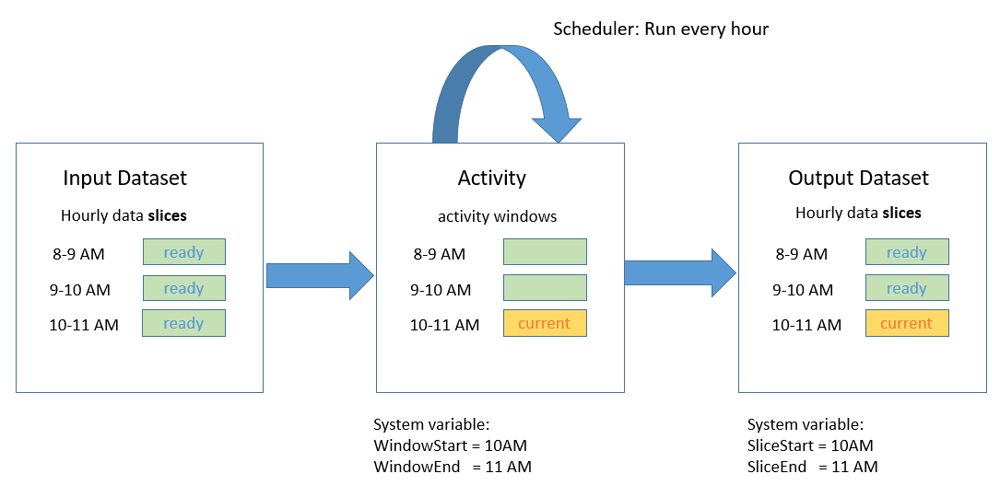
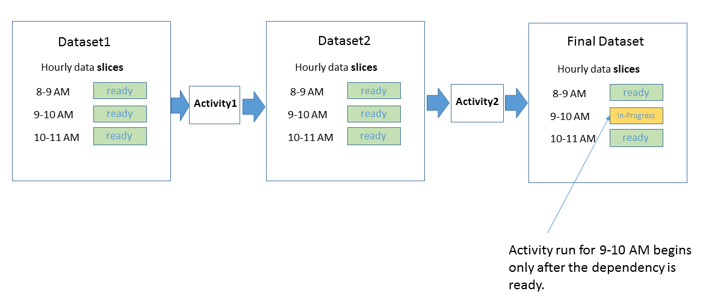

<properties
    pageTitle="Planung und Ausführung mit Daten Factory | Microsoft Azure"
    description="Erfahren Sie, Planung und Ausführung Aspekte des Modells für Azure Data Factory-Anwendung."
    services="data-factory"
    documentationCenter=""
    authors="spelluru"
    manager="jhubbard"
    editor="monicar"/>

<tags
    ms.service="data-factory"
    ms.workload="data-services"
    ms.tgt_pltfrm="na"
    ms.devlang="na"
    ms.topic="article"
    ms.date="08/22/2016"
    ms.author="spelluru"/>

# Daten Factory Planung und Ausführung
In diesem Artikel wird erläutert, die Planung und Ausführung Aspekte des Modells Azure Data Factory-Anwendung. 

## Erforderliche Komponenten
In diesem Artikel wird vorausgesetzt, dass Sie die Grundlagen der Daten Factory Anwendung Modell Konzepte, einschließlich Aktivität, Rohrleitungen, verknüpften Diensten und Datasets verstehen. Grundlegende Konzepte Azure Daten Factory finden Sie unter den folgenden Artikeln:

- [Einführung in Daten Factory](data-factory-introduction.md)
- [Pipelines](data-factory-create-pipelines.md)
- [Datasets](data-factory-create-datasets.md) 

## Planen einer Aktivität

Mit der Aktivität JSON im Abschnitt Scheduler können Sie einen periodischen Zeitplan für eine Aktivität angeben. Beispielsweise können Sie eine Aktivität planen stündlich wie folgt:

    "scheduler": {
        "frequency": "Hour",
        "interval": 1
    },  

Im Diagramm angezeigt wird, erstellt eine Reihe von Fenstern Tumbling zurück, der einen Zeitplan für die Aktivität angibt. Tumbling Windows sind eine Reihe von fester Größe, übereinander, zusammenhängenden Zeitintervalle. Diese logische Tumbling Fenster für die Aktivität werden *Aktivität Windows*bezeichnet.

Für das aktuell ausgeführte Aktivitätsfenster können Sie den Zeitraum aus, mit dem Aktivitätsfenster mit [WindowStart](data-factory-functions-variables.md#data-factory-system-variables) und [WindowEnd](data-factory-functions-variables.md#data-factory-system-variables) System-Variablen in die Aktivität JSON verknüpfte zugreifen. Sie können diese Variablen in Ihrer Aktivität JSON für verschiedene Zwecke verwenden. Sie beispielsweise können verwenden, um Daten aus Eingabe- und Datasets darstellt Reihe Zeitdaten auszuwählen.

Die Eigenschaft **Scheduler** unterstützt die gleichen untergeordneten Eigenschaften wie die **Verfügbarkeit** -Eigenschaft in einem Dataset. Details finden Sie unter [Dataset Verfügbarkeit](data-factory-create-datasets.md#Availability) . Beispiele: Planung an einem bestimmten Zeitpunkt Offset oder Festlegen des Modus Verarbeitung am Anfang oder Ende des Intervalls für das Aktivitätsfenster ausrichten.

Sie können die Eigenschaften für eine Aktivität **Scheduler** angeben, aber diese Eigenschaft ist **optional**. Wenn Sie eine Eigenschaft angeben, wird er muss die Trittfrequenz entsprechen, die Sie in der Ausgabe Dataset Definition angeben. Derzeit ist Ausgabe Dataset, was den Terminplan veranlasst, müssen Sie ein Dataset Ausgabe erstellen, selbst wenn die Aktivität keine Ausgabe erzeugt. Wenn die Aktivität jede Eingabe übernehmen möchten nicht, können Sie überspringen des Eingabe-Dataset zu erstellen.

## Zeit Reihe Datasets und Segmente

Reihe Zeitdaten ist eine fortlaufende Abfolge von vorkommenden Datenpunkte, die in der Regel umfasst aufeinanderfolgende Maße vorgenommen über einen Zeitraum aus. Allgemeine zählen Reihe Zeitdaten Sensordaten und Anwendung werden Daten.

Mit Daten Factory können Sie Zeit verarbeiten, die Datenreihen in einem gespeicherten Weise mit Aktivität ausgeführt wird. In der Regel besteht eine laufende Trittfrequenz mit der eingegebenen Daten eintrifft und Ausgeben von Daten Anforderungen hergestellt werden soll. Diese Trittfrequenz ist von angeben **Verfügbarkeit** im Dataset wie folgt abgebildet:

    "availability": {
      "frequency": "Hour",
      "interval": 1
    },

Jede Dateneinheit verbraucht und von einer Aktivität ausführen erstellt wird ein Segment Daten bezeichnet. Die folgende Abbildung zeigt ein Beispiel für eine Aktivität mit einem Eingabe-Dataset und eine Dataset ausgeben. Diese Datasets haben **Verfügbarkeit** zu einer stündlich Häufigkeit festlegen.

Die obige Abbildung zeigt die Datensegmente des stündlich für das Dataset Eingabe- und. Das Diagramm zeigt drei Eingabewerte Segmente, die für die Verarbeitung bereit sind. Die Aktivität 10-11 Uhr wird ausgeführt, das 10-11 Uhr Ausgabe Segment erzeugt.

Sie können den Zeitraum aus, die das aktuelle Segment im Dataset JSON mit Variablen [SliceStart](data-factory-functions-variables.md#data-factory-system-variables) und [SliceEnd](data-factory-functions-variables.md#data-factory-system-variables)produziert werden zugeordnet zugreifen.

Daten Factory muss derzeit der Terminplan genau in der Aktivität angegebenen den Zeitplan bei der **Verfügbarkeit** von Dataset Ausgabe angegeben entspricht. Daher Zuordnung **WindowStart**, **WindowEnd**, **SliceStart**und **SliceEnd** immer denselben Zeitraum und ein einzelnes Ergebnis Segment.

Weitere Informationen zu anderen Eigenschaften für den Abschnitt Verfügbarkeit zur Verfügung finden Sie unter [Erstellen von Datasets](data-factory-create-datasets.md).

## Verschieben von Daten aus SQL-Datenbank auf Blob-Speicher

Sehen wir uns einige Aktionen zusammen und in Aktion durch Erstellen einer Verkaufspipeline, die Daten aus einer Tabelle Azure SQL-Datenbank in Azure Blob-Speicher stündlich kopiert.

**Eingabe: Azure SQL-Datenbank dataset**

    {
        "name": "AzureSqlInput",
        "properties": {
            "published": false,
            "type": "AzureSqlTable",
            "linkedServiceName": "AzureSqlLinkedService",
            "typeProperties": {
                "tableName": "MyTable"
            },
            "availability": {
                "frequency": "Hour",
                "interval": 1
            },
            "external": true,
            "policy": {}
        }
    }

**Häufigkeit** auf **Stunde** und **Intervall** **1** im Abschnitt Verfügbarkeit der festgelegt ist.

**Ausgabe: Azure Blob-Speicher dataset**

    {
        "name": "AzureBlobOutput",
        "properties": {
            "published": false,
            "type": "AzureBlob",
            "linkedServiceName": "StorageLinkedService",
            "typeProperties": {
                "folderPath": "mypath/{Year}/{Month}/{Day}/{Hour}",
                "format": {
                    "type": "TextFormat"
                },
                "partitionedBy": [
                    {
                        "name": "Year",
                        "value": {
                            "type": "DateTime",
                            "date": "SliceStart",
                            "format": "yyyy"
                        }
                    },
                    {
                        "name": "Month",
                        "value": {
                            "type": "DateTime",
                            "date": "SliceStart",
                            "format": "%M"
                        }
                    },
                    {
                        "name": "Day",
                        "value": {
                            "type": "DateTime",
                            "date": "SliceStart",
                            "format": "%d"
                        }
                    },
                    {
                        "name": "Hour",
                        "value": {
                            "type": "DateTime",
                            "date": "SliceStart",
                            "format": "%H"
                        }
                    }
                ]
            },
            "availability": {
                "frequency": "Hour",
                "interval": 1
            }
        }
    }

**Häufigkeit** auf **Stunde** und **Intervall** **1** im Abschnitt Verfügbarkeit der festgelegt ist.

**Aktivität: Kopieren Aktivität**

    {
        "name": "SamplePipeline",
        "properties": {
            "description": "copy activity",
            "activities": [
                {
                    "type": "Copy",
                    "name": "AzureSQLtoBlob",
                    "description": "copy activity",
                    "typeProperties": {
                        "source": {
                            "type": "SqlSource",
                            "sqlReaderQuery": "$$Text.Format('select * from MyTable where timestampcolumn >= \\'{0:yyyy-MM-dd HH:mm}\\' AND timestampcolumn < \\'{1:yyyy-MM-dd HH:mm}\\'', WindowStart, WindowEnd)"
                        },
                        "sink": {
                            "type": "BlobSink",
                            "writeBatchSize": 100000,
                            "writeBatchTimeout": "00:05:00"
                        }
                    },
                    "inputs": [
                        {
                            "name": "AzureSQLInput"
                        }
                    ],
                    "outputs": [
                        {
                            "name": "AzureBlobOutput"
                        }
                    ],
                    "scheduler": {
                        "frequency": "Hour",
                        "interval": 1
                    }
                }
            ],
            "start": "2015-01-01T08:00:00Z",
            "end": "2015-01-01T11:00:00Z"
        }
    }

Das Beispiel zeigt den Aktivität Terminplan und Dataset Verfügbarkeit Abschnitte auf einer stündlich Häufigkeit festgelegt. Im Beispiel zeigt, wie **WindowStart** können und **WindowEnd** zum Auswählen von relevanten Daten für eine Aktivität ausführen und kopieren Sie ihn in ein Blob mit den entsprechenden **Ordnerpfad**. Der **Ordnerpfad** ist parametrisierte einen separaten Ordner für jede Stunde enthält.

Wenn drei Segmente zwischen 8 – 11 Uhr ausführen, lautet die Daten in SQL Azure-Datenbank wie folgt:

Nachdem der Verkaufspipeline bereitstellt, wird wie folgt Azure Blob aufgefüllt:

-   Datei Mypath/2015/1/1/8/Daten. &lt;Guid&gt;txt mit Daten

            10002345,334,2,2015-01-01 08:24:00.3130000
            10002345,347,15,2015-01-01 08:24:00.6570000
            10991568,2,7,2015-01-01 08:56:34.5300000

    > [AZURE.NOTE] &lt;GUID&gt; wird durch eine tatsächliche Guid ersetzt. Dateiname-Beispiel: Data.bcde1348-7620-4f93-bb89-0eed3455890b.txt
-   Datei Mypath/2015/1/1/9/Daten. &lt;Guid&gt;txt mit Daten:

            10002345,334,1,2015-01-01 09:13:00.3900000
            24379245,569,23,2015-01-01 09:25:00.3130000
            16777799,21,115,2015-01-01 09:47:34.3130000
-   Datei Mypath/2015/1/1/10/Daten. &lt;Guid&gt;txt ohne Daten.

## Aktive Periode Verkaufspipeline

[Erstellen von Pipelines](data-factory-create-pipelines.md) vorgestellt einer aktiven Zeitraums für eine Verkaufspipeline angegeben, indem Sie die Eigenschaften **Starten** und **Beenden** .

Sie können den Anfangstermin für die Verkaufspipeline aktive Periode in der Vergangenheit festlegen. Daten Factory automatisch berechnet (wieder Füllungen) alle Datensegmente in der Vergangenheit und diese Verarbeitung beginnt.

## Parallele Verarbeitung von Datensegmente
Sie können zurück ausgefüllt Datensegmente parallel ausgeführt werden, mithilfe der **Concurrency** Eigenschaft im Richtlinienabschnitt der Aktivität JSON konfigurieren. Weitere Informationen zu dieser Eigenschaft finden Sie unter [Erstellen von Pipelines](data-factory-create-pipelines.md).

## Führen Sie eine fehlgeschlagene Daten Segment erneut aus. 
Sie können die Ausführung der Segmente in einer leistungsfähigen, visuelle Weise überwachen. Details finden Sie unter [Überwachen und Verwalten von Pipelines mit Azure Portals Blades](data-factory-monitor-manage-pipelines.md) oder [Überwachung und Verwaltung app](data-factory-monitor-manage-app.md) .

Berücksichtigen Sie im folgende Beispiel, bei das zwei Aktivitäten angezeigt wird. Activity1 aufgerufen erstellt eine Uhrzeit Reihe Dataset mit Segmente als Ausgabe, die als Eingabe von Activity2, um die endgültige Ausgabe Zeit Reihe Dataset zu erzeugen verwendet wird.

Das Diagramm zeigt, die aus drei zuletzt verwendete Segmente, es ist ein Fehler aufgetreten, der das Segment 9-10 Uhr für Datensatz2 erzeugt. Daten Factory verfolgt automatisch Abhängigkeit für die Uhrzeit Reihe Dataset aus. Daher wird die Aktivität für das 9-10 AM untergeordneten Segment ausführen nicht gestartet.

Factory die Überwachung und Verwaltung Datentools können Sie detailliert Auswerten der Diagnoseprotokolle für den Fehler beim Segment auf einfache Weise die Ursache für das Problem suchen und beheben. Nachdem Sie das Problem behoben haben, können Sie einfach die Aktivität ausführen, um das Segment fehlgeschlagene Naturprodukte starten. Weitere Details zum erneut aus, und Übergänge zwischen für Datensegmente zu verstehen finden Sie unter [Überwachen und Verwalten von Pipelines mit Azure Portals Blades](data-factory-monitor-manage-pipelines.md) oder [Überwachung und Verwaltung app](data-factory-monitor-manage-app.md).

Nachdem Sie das Segment 9-10 Uhr für **Datensatz2**erneut ausführen, startet Daten Factory ausführen für das 9-10 Uhr abhängige Segment auf die endgültige Dataset aus.

## Ausführen von Aktivitäten in einer Sequenz
Sie können zwei Aktivitäten (zum Ausführen einer Aktivität nach der anderen) verketten, indem Sie das Dataset Ausgabe einer Aktivität als des Eingabe-Datasets der anderen Aktivität festlegen. Die Aktivitäten können in der gleichen Verkaufspipeline oder in anderen Rohrleitungen sein. Die zweite Aktivität führt nur bei der ersten Phase erfolgreich abgeschlossen ist.

Betrachten Sie beispielsweise den folgenden Fällen aus:

1.  Verkaufspipeline P1 weist Aktivität A1, die externe Eingabe-Dataset D1 erfordert, und erzeugt Ausgabe Dataset D2.
2.  Aktivitäten in A2, die Eingabe von Dataset D2 erforderlich ist, und erzeugt Ausgabe Dataset D3 verfügt Verkaufspipeline P2

In diesem Szenario sind Aktivitäten A1 und A2 in anderen Rohrleitungen aus. Wenn die externen Daten verfügbar ist, und die geplante Verfügbarkeit Häufigkeit erreicht ist, wird die Aktivität A1 ausgeführt. Die Aktivität führt A2 aus, wenn die geplanten Segmente aus D2 verfügbar werden und die geplante Verfügbarkeit Häufigkeit erreicht ist. Ist ein Fehler in einem Dataset D2 Segmente, wird nicht A2 für diese Segment ausgeführt, bis er wieder verfügbar ist.

In der Diagrammansicht sieht wie das folgende Diagramm aus:

Wie zuvor schon erwähnt, können die Aktivitäten in der gleichen Verkaufspipeline sein. Das folgende Diagramm würde die Diagrammansicht mit beide Aktivitäten in der gleichen Verkaufspipeline aussehen:

### Kopieren Sie nacheinander
Es ist möglich, mehrere von Vorgängen in einer Weise sequenziellen/bestellt einzeln nacheinander ausführen. Beispielsweise können Sie zwei kopieren Aktivitäten in einer Verkaufspipeline (CopyActivity1 und CopyActivity2) mit den folgenden Eingabedaten Ausgabe Datasets einrichten:   

CopyActivity1

Eingabe: Dataset. Ausgabe: Datensatz2.

CopyActivity2

Eingabe: Datensatz2.  Ausgabe: Dataset3.

CopyActivity2 würde nur ausgeführt, wenn der CopyActivity1 erfolgreich ausgeführt wurde und Datensatz2 zur Verfügung steht.

So sieht der Stichprobe Verkaufspipeline JSON aus:

    {
        "name": "ChainActivities",
        "properties": {
            "description": "Run activities in sequence",
            "activities": [
                {
                    "type": "Copy",
                    "typeProperties": {
                        "source": {
                            "type": "BlobSource"
                        },
                        "sink": {
                            "type": "BlobSink",
                            "copyBehavior": "PreserveHierarchy",
                            "writeBatchSize": 0,
                            "writeBatchTimeout": "00:00:00"
                        }
                    },
                    "inputs": [
                        {
                            "name": "Dataset1"
                        }
                    ],
                    "outputs": [
                        {
                            "name": "Dataset2"
                        }
                    ],
                    "policy": {
                        "timeout": "01:00:00"
                    },
                    "scheduler": {
                        "frequency": "Hour",
                        "interval": 1
                    },
                    "name": "CopyFromBlob1ToBlob2",
                    "description": "Copy data from a blob to another"
                },
                {
                    "type": "Copy",
                    "typeProperties": {
                        "source": {
                            "type": "BlobSource"
                        },
                        "sink": {
                            "type": "BlobSink",
                            "writeBatchSize": 0,
                            "writeBatchTimeout": "00:00:00"
                        }
                    },
                    "inputs": [
                        {
                            "name": "Dataset2"
                        }
                    ],
                    "outputs": [
                        {
                            "name": "Dataset3"
                        }
                    ],
                    "policy": {
                        "timeout": "01:00:00"
                    },
                    "scheduler": {
                        "frequency": "Hour",
                        "interval": 1
                    },
                    "name": "CopyFromBlob2ToBlob3",
                    "description": "Copy data from a blob to another"
                }
            ],
            "start": "2016-08-25T01:00:00Z",
            "end": "2016-08-25T01:00:00Z",
            "isPaused": false
        }
    }

Beachten Sie, dass im Beispiel das Ausgabe Dataset von der ersten Aktivität kopieren (Datensatz2) als Eingabe für die zweite Aktivität angegeben ist. Daher führt die zweite Aktivität nur bei das Ausgabe Dataset aus der ersten Aktivität bereit ist.  

Im Beispiel können CopyActivity2 eine andere Eingabe, z. B. Dataset3, doch Sie Datensatz2 als Eingabe für CopyActivity2, angeben, damit die Aktivität nicht ausgeführt werden kann, bis CopyActivity1 abgeschlossen ist. Beispiel:

CopyActivity1

Eingabe: Dataset1. Ausgabe: Datensatz2.

CopyActivity2

Eingaben: Dataset3, Datensatz2. Ergebnis: Dataset4.

    {
        "name": "ChainActivities",
        "properties": {
            "description": "Run activities in sequence",
            "activities": [
                {
                    "type": "Copy",
                    "typeProperties": {
                        "source": {
                            "type": "BlobSource"
                        },
                        "sink": {
                            "type": "BlobSink",
                            "copyBehavior": "PreserveHierarchy",
                            "writeBatchSize": 0,
                            "writeBatchTimeout": "00:00:00"
                        }
                    },
                    "inputs": [
                        {
                            "name": "Dataset1"
                        }
                    ],
                    "outputs": [
                        {
                            "name": "Dataset2"
                        }
                    ],
                    "policy": {
                        "timeout": "01:00:00"
                    },
                    "scheduler": {
                        "frequency": "Hour",
                        "interval": 1
                    },
                    "name": "CopyFromBlobToBlob",
                    "description": "Copy data from a blob to another"
                },
                {
                    "type": "Copy",
                    "typeProperties": {
                        "source": {
                            "type": "BlobSource"
                        },
                        "sink": {
                            "type": "BlobSink",
                            "writeBatchSize": 0,
                            "writeBatchTimeout": "00:00:00"
                        }
                    },
                    "inputs": [
                        {
                            "name": "Dataset3"
                        },
                        {
                            "name": "Dataset2"
                        }
                    ],
                    "outputs": [
                        {
                            "name": "Dataset4"
                        }
                    ],
                    "policy": {
                        "timeout": "01:00:00"
                    },
                    "scheduler": {
                        "frequency": "Hour",
                        "interval": 1
                    },
                    "name": "CopyFromBlob3ToBlob4",
                    "description": "Copy data from a blob to another"
                }
            ],
            "start": "2017-04-25T01:00:00Z",
            "end": "2017-04-25T01:00:00Z",
            "isPaused": false
        }
    }

Beachten Sie, dass im Beispiel zwei Eingabewerte Datasets für die zweite Kopie Aktivität angegeben sind. Wenn mehrere Eingaben angegeben sind, wird nur das erste Eingabewerte Dataset zum Kopieren von Daten verwendet, aber andere Datasets als Abhängigkeiten verwendet werden. CopyActivity2 würde erst beginnen, wenn die folgenden Bedingungen erfüllt sind:

- CopyActivity1 wurde erfolgreich abgeschlossen, und Datensatz2 steht zur Verfügung. Dieses Dataset wird beim Kopieren von Daten in Dataset4 nicht verwendet. Es fungiert nur als Abhängigkeit Planung für CopyActivity2.   
- Dataset3 steht zur Verfügung. Dieses Dataset stellt die Daten, die an das Ziel kopiert werden.  

## Modell Datasets mit anderen Häufigkeiten

In den Beispielen für wurden die Häufigkeiten für Eingabe- und Datasets und die Aktivität Terminplan Fenster identisch. Einige Szenarien erfordern die Möglichkeit, die Ausgabe in einem Intervall anders als die Häufigkeiten eine oder mehrere Eingaben zu erzeugen. Daten Factory unterstützt diese Szenarios modeling.

### Beispiel 1: Erstellen eines täglichen Ausgabe-Berichts für eingegebenen Daten, die pro Stunde zur Verfügung

Erwägen Sie ein Szenario, in dem Sie den Maßeinheiten Daten aus Sensoren verfügbar stündlich in Azure Blob-Speicher eingegeben haben. Möchten Sie eine tägliche Zusammenfassungsberichts mit Statistiken wie z. B. Mittelwert, Minimum und Maximum für den Tag mit [Daten Factory Struktur Aktivität](data-factory-hive-activity.md)zu erstellen.

Hier ist, wie Sie dieses Szenario mit Daten Factory modellieren können:

**Eingabe-dataset**

Die stündlichen von Dateien werden in den Ordner für den angegebenen Tag gelöscht. Verfügbarkeit von Eingaben am **Stunde** festgelegt ist (Häufigkeit: Stunde, Intervall: 1).

    {
      "name": "AzureBlobInput",
      "properties": {
        "type": "AzureBlob",
        "linkedServiceName": "StorageLinkedService",
        "typeProperties": {
          "folderPath": "mycontainer/myfolder/{Year}/{Month}/{Day}/",
          "partitionedBy": [
            { "name": "Year", "value": {"type": "DateTime","date": "SliceStart","format": "yyyy"}},
            { "name": "Month","value": {"type": "DateTime","date": "SliceStart","format": "%M"}},
            { "name": "Day","value": {"type": "DateTime","date": "SliceStart","format": "%d"}}
          ],
          "format": {
            "type": "TextFormat"
          }
        },
        "external": true,
        "availability": {
          "frequency": "Hour",
          "interval": 1
        }
      }
    }

**Die Ausgabe dataset**

Eine Ausgabedatei wird jeden Tag des Tages Ordner erstellt. Verfügbarkeit der Ausgabe am **Tag** festgelegt ist (Häufigkeit: Tag und Intervall: 1).

    {
      "name": "AzureBlobOutput",
      "properties": {
        "type": "AzureBlob",
        "linkedServiceName": "StorageLinkedService",
        "typeProperties": {
          "folderPath": "mycontainer/myfolder/{Year}/{Month}/{Day}/",
          "partitionedBy": [
            { "name": "Year", "value": {"type": "DateTime","date": "SliceStart","format": "yyyy"}},
            { "name": "Month","value": {"type": "DateTime","date": "SliceStart","format": "%M"}},
            { "name": "Day","value": {"type": "DateTime","date": "SliceStart","format": "%d"}}
          ],
          "format": {
            "type": "TextFormat"
          }
        },
        "availability": {
          "frequency": "Day",
          "interval": 1
        }
      }
    }

**Aktivität: Struktur Aktivität in einer Verkaufspipeline**

Das Skript Struktur empfängt die entsprechende Informationen *DateTime* als Parameter, die die Variable **WindowStart** verwenden, wie im folgenden Codeausschnitt dargestellt. Das Skript Struktur verwendet diese Variable So laden Sie die Daten aus dem richtigen Ordner für den Tag fest, und führen die Aggregation, um die Ausgabe zu generieren.

        {  
            "name":"SamplePipeline",
            "properties":{  
            "start":"2015-01-01T08:00:00",
            "end":"2015-01-01T11:00:00",
            "description":"hive activity",
            "activities": [
                {
                    "name": "SampleHiveActivity",
                    "inputs": [
                        {
                            "name": "AzureBlobInput"
                        }
                    ],
                    "outputs": [
                        {
                            "name": "AzureBlobOutput"
                        }
                    ],
                    "linkedServiceName": "HDInsightLinkedService",
                    "type": "HDInsightHive",
                    "typeProperties": {
                        "scriptPath": "adftutorial\\hivequery.hql",
                        "scriptLinkedService": "StorageLinkedService",
                        "defines": {
                            "Year": "$$Text.Format('{0:yyyy}',WindowStart)",
                            "Month": "$$Text.Format('{0:%M}',WindowStart)",
                            "Day": "$$Text.Format('{0:%d}',WindowStart)"
                        }
                    },
                    "scheduler": {
                        "frequency": "Day",
                        "interval": 1
                    },          
                    "policy": {
                        "concurrency": 1,
                        "executionPriorityOrder": "OldestFirst",
                        "retry": 2,
                        "timeout": "01:00:00"
                    }
                 }
             ]
           }
        }

Das folgende Diagramm veranschaulicht das Szenario aus einem Daten-Abhängigkeit Sicht.

Das Segment Ausgabe für jeden Tag hängt 24 Stunden Segmente aus einer Eingabe-Dataset aus. Daten Factory berechnet diese Abhängigkeiten automatisch, indem Sie herausfinden, die Eingabedaten Segmente die liegen in der gleichen Zeit als das Segment Ausgabe hergestellt werden soll. Wenn keines der 24 Eingabewerte Segmente nicht verfügbar ist, wartet Factory Daten für die Eingabewerte Segment bereit sein, bevor Sie beginnen die tägliche Aktivität ausführen.

### Beispiel 2: Geben Sie Abhängigkeit mit Ausdrücken und Daten Factory-Funktionen

Sehen Sie sich ein anderes Szenario aus. Angenommen, Sie haben eine Struktur Aktivität verarbeitet wurden, zwei Eingabewerte Datasets. Eine von ihnen hat neue Daten täglich, aber einen davon ruft neue Daten auf jede Woche. Angenommen Sie, Sie verwenden möchten, führen Sie eine Verknüpfung über zwei Eingaben, und erstellen eine Ausgabe jeden Tag.

Die einfache Möglichkeit bieten, in welche Daten Factory Eingabemethoden automatisch Zahlen aus dem rechten Segmente zu verarbeiten, indem Sie ausrichten an die Ausgabe, die Daten des Segments Mal Periode nicht funktioniert.

Sie müssen angeben, dass für jede Aktivität ausführen, die Daten Factory letzte Woche Daten Segment für das wöchentliche Eingabewerte Dataset verwendet werden sollen. Sie verwenden, Azure Data Factory-Funktionen wie im folgenden Codeausschnitt dargestellt um dieses Verhalten zu implementieren.

**Input1: Azure blob**

Die erste Eingabe ist der Azure Blob täglich aktualisiert wird.

    {
      "name": "AzureBlobInputDaily",
      "properties": {
        "type": "AzureBlob",
        "linkedServiceName": "StorageLinkedService",
        "typeProperties": {
          "folderPath": "mycontainer/myfolder/{Year}/{Month}/{Day}/",
          "partitionedBy": [
            { "name": "Year", "value": {"type": "DateTime","date": "SliceStart","format": "yyyy"}},
            { "name": "Month","value": {"type": "DateTime","date": "SliceStart","format": "%M"}},
            { "name": "Day","value": {"type": "DateTime","date": "SliceStart","format": "%d"}}
          ],
          "format": {
            "type": "TextFormat"
          }
        },
        "external": true,
        "availability": {
          "frequency": "Day",
          "interval": 1
        }
      }
    }

**Input2: Azure blob**

Input2 ist der Azure Blob wöchentlich aktualisiert wird.

    {
      "name": "AzureBlobInputWeekly",
      "properties": {
        "type": "AzureBlob",
        "linkedServiceName": "StorageLinkedService",
        "typeProperties": {
          "folderPath": "mycontainer/myfolder/{Year}/{Month}/{Day}/",
          "partitionedBy": [
            { "name": "Year", "value": {"type": "DateTime","date": "SliceStart","format": "yyyy"}},
            { "name": "Month","value": {"type": "DateTime","date": "SliceStart","format": "%M"}},
            { "name": "Day","value": {"type": "DateTime","date": "SliceStart","format": "%d"}}
          ],
          "format": {
            "type": "TextFormat"
          }
        },
        "external": true,
        "availability": {
          "frequency": "Day",
          "interval": 7
        }
      }
    }

**Ausgabe: Azure blob**

Eine Ausgabedatei wird jeden Tag in den Ordner für den Tag erstellt. Verfügbarkeit der Ausgabe auf **Tag** festgelegt ist (Häufigkeit: Tag, Intervall: 1).

    {
      "name": "AzureBlobOutputDaily",
      "properties": {
        "type": "AzureBlob",
        "linkedServiceName": "StorageLinkedService",
        "typeProperties": {
          "folderPath": "mycontainer/myfolder/{Year}/{Month}/{Day}/",
          "partitionedBy": [
            { "name": "Year", "value": {"type": "DateTime","date": "SliceStart","format": "yyyy"}},
            { "name": "Month","value": {"type": "DateTime","date": "SliceStart","format": "%M"}},
            { "name": "Day","value": {"type": "DateTime","date": "SliceStart","format": "%d"}}
          ],
          "format": {
            "type": "TextFormat"
          }
        },
        "availability": {
          "frequency": "Day",
          "interval": 1
        }
      }
    }

**Aktivität: Struktur Aktivität in einer Verkaufspipeline**

Die Aktivität Struktur hat zwei Eingaben auf und erzeugt ein Segments Ausgabe jeden Tag. Sie können jedes Tages Ausgabe Segment so, dass der vorherigen Woche Eingabewerte Segment wöchentliche Eingaben wie folgt abhängig angeben.

    {  
        "name":"SamplePipeline",
        "properties":{  
        "start":"2015-01-01T08:00:00",
        "end":"2015-01-01T11:00:00",
        "description":"hive activity",
        "activities": [
          {
            "name": "SampleHiveActivity",
            "inputs": [
              {
                "name": "AzureBlobInputDaily"
              },
              {
                "name": "AzureBlobInputWeekly",
                "startTime": "Date.AddDays(SliceStart, - Date.DayOfWeek(SliceStart))",
                "endTime": "Date.AddDays(SliceEnd,  -Date.DayOfWeek(SliceEnd))"  
              }
            ],
            "outputs": [
              {
                "name": "AzureBlobOutputDaily"
              }
            ],
            "linkedServiceName": "HDInsightLinkedService",
            "type": "HDInsightHive",
            "typeProperties": {
              "scriptPath": "adftutorial\\hivequery.hql",
              "scriptLinkedService": "StorageLinkedService",
              "defines": {
                "Year": "$$Text.Format('{0:yyyy}',WindowStart)",
                "Month": "$$Text.Format('{0:%M}',WindowStart)",
                "Day": "$$Text.Format('{0:%d}',WindowStart)"
              }
            },
            "scheduler": {
              "frequency": "Day",
              "interval": 1
            },          
            "policy": {
              "concurrency": 1,
              "executionPriorityOrder": "OldestFirst",
              "retry": 2,  
              "timeout": "01:00:00"
            }
           }
         ]
       }
    }

## Daten Factory-Funktionen und Systemvariablen   

Finden Sie unter [Data Factory-Funktionen und Systemvariablen](data-factory-functions-variables.md) für eine Liste der Funktionen und Systemvariablen, die Daten Factory unterstützt.

## Tiefer Einblick Daten in Abhängigkeit

Um ein Dataset Segment durch eine Aktivität ausführen zu generieren, wird mit Daten Factory das folgende *Abhängigkeit Modell* die Beziehungen zwischen Datasets verbraucht und durch eine Aktivität gefertigt bestimmt.

Der Zeitbereich des die Eingabewerte Datasets erforderlich, um die Ausgabe Dataset Segment generieren heißt *Abhängigkeit Periode zurück*.

Eine Aktivität ausführen generiert ein Dataset Segment erst Datensegmente innerhalb des Zeitraums Abhängigkeit von Datasets zur Verfügung stehen. Führen Sie alle Eingabewerte Segmente, umfasst die Periode Abhängigkeit **für die Aktivität eingeschaltet** sein müssen Kurzum, um eine Ausgabe Dataset Segment zu erzeugen.

Um das Dataset Segment [**Starten**, **Ende**] zu generieren, muss eine Funktion ihres Abhängigkeit Zeitraums das Segment Dataset zuordnen. Diese Funktion ist im Wesentlichen eine Formel, die das Start- und Enddatum des Segments Dataset am Anfang und Ende einer Periode Abhängigkeit konvertiert. Formeller:

    DatasetSlice = [start, end]
    DependecyPeriod = [f(start, end), g(start, end)]

**F** und **g** zuordnen Funktionen, die das Start- und Enddatum der Periode Abhängigkeit für jede Aktivität Eingabemethoden zu berechnen.

Wie in den Beispielen gesehen, ist die Abhängigkeit Periode identisch mit den Zeitraum für die Daten Segment, das erstellt wird. In diesen Fällen berechnet Daten Factory automatisch die Eingabewerte Segmente, die in Abhängigkeit Periode liegen.  

In der Stichprobe Aggregation, wo Ausgabe täglich erstellt wird und die Eingabedaten steht stündlich, beträgt Periode Segment Daten beispielsweise 24 Stunden. Daten Factory findet die relevante stündliche Eingabe für dieses Zeitraums slices und macht das Segment Ausgabe das Segment Eingabewerte abhängig.

Sie können auch angeben, dass Ihre eigenen Zuordnung für den Zeitraum Abhängigkeit wie im Beispiel dargestellt dabei eine der Eingaben wöchentlich und das Segment Ausgabe ist täglich erzeugt wird.

## Abhängigkeit von Daten und Überprüfung

Ein Dataset kann eine Überprüfung Richtlinie definiert haben, die angibt, wie die Daten von einem Segment Ausführung erstellt überprüft werden können, bevor er zur Verwendung bereit ist. Details finden Sie unter [Datasets erstellen](data-factory-create-datasets.md) .

Nachdem das Segment Ausführung, abgeschlossen ist, wird der Status der Ausgabe Segment in diesem Fall in **Warten** mit einer untergeordneter der **Validierung**geändert. Nachdem die Segmente überprüft werden, ändert sich der Status Segment in **bereit**ein.

Wenn ein Segment Daten wurde erstellt, jedoch die Überprüfung nicht bestanden, werden Aktivität ausgeführt für untergeordneten Segmente, die diesem Segment abhängig sind nicht verarbeitet werden.

[Überwachen und Verwalten von Pipelines](data-factory-monitor-manage-pipelines.md) werden die verschiedenen Bundesstaaten Datensegmente in Daten Factory behandelt.

## Externe Daten

Als extern (wie in den folgenden JSON-Codeausschnitt gezeigt), dass dies, dass sie nicht mit Daten Factory erstellt wurde, kann ein Dataset markiert werden. In diesem Fall kann die Richtlinie Dataset haben eine zusätzliche Reihe von Parametern zur Beschreibung der Überprüfung, und wiederholen Sie die Richtlinie für das Dataset. Eine Beschreibung aller Eigenschaften finden Sie unter [Erstellen von Pipelines](data-factory-create-pipelines.md) .

Ähnlich wie Datasets, die von Daten Factory gefertigt wurden, müssen die Datensegmente für externe Daten bereit sein, bevor abhängige Segmente verarbeitet werden können.

    {
        "name": "AzureSqlInput",
        "properties":
        {
            "type": "AzureSqlTable",
            "linkedServiceName": "AzureSqlLinkedService",
            "typeProperties":
            {
                "tableName": "MyTable"
            },
            "availability":
            {
                "frequency": "Hour",
                "interval": 1     
            },
            "external": true,
            "policy":
            {
                "externalData":
                {
                    "retryInterval": "00:01:00",
                    "retryTimeout": "00:10:00",
                    "maximumRetry": 3
                }
            }  
        }
    }

## Einmalige Verkaufspipeline
Sie können das Erstellen und Planen Sie eine Verkaufspipeline regelmäßig ausführen (zum Beispiel: stündlich oder täglich) innerhalb der Start- und Endzeiten, die Sie in der Verkaufspipeline Definition angeben. Details finden Sie unter [Planung Aktivitäten](#scheduling-and-execution) . Sie können auch eine Verkaufspipeline erstellen, die nur einmal ausgeführt wird. Hierzu legen Sie die **PipelineMode** -Eigenschaft in der Websitedefinition Verkaufspipeline **einmalige** wie im folgenden Beispiel JSON dargestellt. Es ist der Standardwert für diese Eigenschaft **geplanten**.

    {
        "name": "CopyPipeline",
        "properties": {
            "activities": [
                {
                    "type": "Copy",
                    "typeProperties": {
                        "source": {
                            "type": "BlobSource",
                            "recursive": false
                        },
                        "sink": {
                            "type": "BlobSink",
                            "writeBatchSize": 0,
                            "writeBatchTimeout": "00:00:00"
                        }
                    },
                    "inputs": [
                        {
                            "name": "InputDataset"
                        }
                    ],
                    "outputs": [
                        {
                            "name": "OutputDataset"
                        }
                    ]
                    "name": "CopyActivity-0"
                }
            ]
            "pipelineMode": "OneTime"
        }
    }

Beachten Sie Folgendes:

- ** **Starten** und** Endzeiten für die Verkaufspipeline sind nicht angegeben.
- **Verfügbarkeit** von Eingabe- und Datasets ist (**Häufigkeit** und **Intervall**) angegeben, obwohl Daten Factory nicht die Werte verwenden.  
- Einmalige Pipelines in der Diagrammansicht nicht angezeigt. Dieses Verhalten ist beabsichtigt.
- Einmalige Pipelines können nicht aktualisiert werden. Sie können eine einmalige Verkaufspipeline klonen, benennen Sie sie, Eigenschaften aktualisieren und bereitstellen, um eine weitere zu erstellen.
